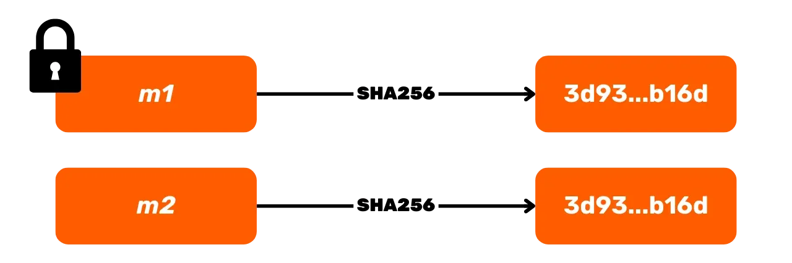

# Matka Bitcoin-lompakoiden sydämeen

Löydä determinististen ja hierarkkisten Bitcoin-lompakoiden salaisuudet CYP201-kurssillamme! Olitpa sitten tavallinen käyttäjä tai innokas harrastaja, joka haluaa syventää tietämystään, tämä kurssi tarjoaa täydellisen sukelluksen näiden päivittäin käyttämiemme työkalujen toimintaan.

Opit hajautusfunktioiden, digitaalisten allekirjoitusten (ECDSA ja Schnorr), mnemonisten fraasien, kryptografisten avainten ja vastaanotto-osoitteiden luomisen mekanismeista, samalla tutkien edistyneitä turvallisuusstrategioita.

Tämä koulutus ei ainoastaan varusta sinua tiedolla Bitcoin-lompakon rakenteen ymmärtämiseksi, vaan myös valmistaa sinut sukeltamaan syvemmälle kryptografian jännittävään maailmaan.

Selkeän pedagogiikan, yli 60 selittävän diagrammin ja konkreettisten esimerkkien avulla CYP201 mahdollistaa sinun ymmärtää alusta loppuun, kuinka lompakkosi toimii, jotta voit navigoida Bitcoin-universumissa luottavaisin mielin. Ota hallintaasi UTXO:si tänään ymmärtämällä, kuinka HD-lompakot toimivat!

+++

# Johdanto

<partId>32960669-d13a-592f-a053-37f70b997cbf</partId>

## Kurssin esittely

<chapterId>fb4e8857-ea35-5a8a-ae8a-5300234e0104</chapterId>

Tervetuloa CYP201-kurssille, jossa tutkimme syvällisesti HD Bitcoin-lompakoiden toimintaa. Tämä kurssi on suunniteltu kaikille, jotka haluavat ymmärtää Bitcoinin tekniset perusteet, olivatpa he sitten satunnaisia käyttäjiä, valistuneita harrastajia tai tulevaisuuden asiantuntijoita.

Tämän koulutuksen tavoitteena on antaa sinulle avaimet päivittäin käyttämiesi työkalujen hallintaan. HD Bitcoin-lompakot, jotka ovat käyttökokemuksesi ytimessä, perustuvat joskus monimutkaisiin käsitteisiin, joita pyrimme tekemään ymmärrettäviksi. Yhdessä demystifioimme ne!

Ennen kuin sukellamme Bitcoin-lompakoiden rakenteen ja toiminnan yksityiskohtiin, aloitamme muutamalla luvulla kryptografisista primitiiveistä, jotka on tiedettävä seuraavaa varten.
Aloitamme kryptografisista hajautusfunktioista, jotka ovat olennaisia sekä lompakoille että itse Bitcoin-protokollalle. Löydät niiden pääominaisuudet, Bitcoinissa käytetyt erityiset funktiot ja teknisemmässä luvussa opit yksityiskohtaisesti hajautusfunktioiden kuningattaren, SHA256:n, toiminnasta.


Seuraavaksi keskustelemme digitaalisten allekirjoitusalgoritmien toiminnasta, joita käytät joka päivä UTXO:idesi turvaamiseen. Bitcoin käyttää kahta: ECDSA:ta ja Schnorr-protokollaa. Opit, mitkä matemaattiset primitiivit ovat näiden algoritmien taustalla ja kuinka ne takaavat transaktioiden turvallisuuden.


Kun meillä on hyvä ymmärrys näistä kryptografian elementeistä, siirrymme viimein koulutuksen ytimeen: deterministisiin ja hierarkkisiin lompakoihin! Ensin on osio omistettu mnemonisille fraaseille, näille 12 tai 24 sanan sekvensseille, jotka mahdollistavat lompakkojesi luomisen ja palauttamisen. Löydät, kuinka nämä sanat generoidaan entropian lähteestä ja kuinka ne helpottavat Bitcoinin käyttöä.


Koulutus jatkuu BIP39-salasanan, siemenen (ei pidä sekoittaa mnemoniseen lauseeseen), pääketjukoodin ja pääavaimen tutkimisella. Tarkastelemme yksityiskohtaisesti, mitä nämä elementit ovat, niiden vastaavat roolit ja kuinka ne lasketaan.


Lopuksi, pääavaimesta, tutustumme siihen, kuinka kryptografiset avainparit johdetaan deterministisellä ja hierarkisella tavalla aina vastaanotto-osoitteisiin saakka.


Tämä koulutus mahdollistaa sinulle lompakko-ohjelmiston käytön luottavaisin mielin, samalla parantaen taitojasi tunnistaa ja lieventää riskejä. Valmistaudu tulemaan todelliseksi asiantuntijaksi Bitcoin-lompakoissa!

# Häsäfunktiot

<partId>3713fee1-2ec2-512e-9e97-b6da9e4d2f17</partId>

## Johdanto Häsäfunktioihin

<chapterId>dba011f5-1805-5a48-ac2b-4bd637c93703</chapterId>

Ensimmäinen Bitcoinissa käytetty kryptografisten algoritmien tyyppi kattaa häsäfunktiot. Ne ovat olennaisessa roolissa eri tasoilla protokollassa, mutta myös Bitcoin-lompakoissa. Tutustutaan yhdessä siihen, mikä häsäfunktio on ja mihin sitä käytetään Bitcoinissa.

### Määritelmä ja Häsäyksen Periaate

Häsäys on prosessi, joka muuntaa mielivaltaisen pituisen tiedon toiseksi, kiinteän pituiseksi tiedoksi kryptografisen häsäfunktion avulla. Toisin sanoen, häsäfunktio ottaa syötteenä minkä tahansa kokoisen tiedon ja muuntaa sen kiinteän kokoiseksi sormenjäljeksi, jota kutsutaan "häsäykseksi".
Häsäystä voidaan joskus kutsua myös "digestiksi", "tiivisteeksi", "tiivistetyksi" tai "häsätyksi".

Esimerkiksi SHA256-häsäfunktio tuottaa kiinteän pituisen, 256-bittisen häsäyksen. Jos käytämme syötteenä "_PlanB_", mielivaltaisen pituisen viestin, tuotettu häsäys on seuraava 256-bittinen sormenjälki:

```text
24f1b93b68026bfc24f5c8265f287b4c940fb1664b0d75053589d7a4f821b688
```


### Häsäfunktioiden Ominaisuudet

Näillä kryptografisilla häsäfunktioilla on useita olennaisia ominaisuuksia, jotka tekevät niistä erityisen hyödyllisiä Bitcoinin ja muiden tietojärjestelmien kontekstissa:

1. Palautumattomuus (tai esikuvan vastustuskyky)
2. Muutoksenkestävyys (lumivyöryvaikutus)
3. Kolarinkestävyys
4. Toisen esikuvan vastustuskyky

#### 1. Palautumattomuus (esikuvan vastustuskyky):

Palautumattomuus tarkoittaa, että häsäyksen laskeminen syötteestä on helppoa, mutta käänteinen laskenta, eli syötteen löytäminen häsäyksestä, on käytännössä mahdotonta. Tämä ominaisuus tekee häsäfunktioista täydellisiä ainutlaatuisten digitaalisten sormenjälkien luomiseen ilman alkuperäisen tiedon vaarantamista. Tätä ominaisuutta kutsutaan usein yksisuuntaiseksi funktioksi tai "_ansaovifunktioksi_".

Annetussa esimerkissä häsäyksen `24f1b9…` saaminen tietäen syötteen "_PlanB_" on yksinkertaista ja nopeaa. Kuitenkin viestin "_PlanB_" löytäminen tietäen vain `24f1b9…` on mahdotonta.


Siksi on mahdotonta löytää esikuvaa $m$ häsäykselle $h$ siten, että $h = \text{HASH}(m)$, missä $\text{HASH}$ on kryptografinen häsäfunktio.

#### 2. Muutoksenkestävyys (lumivyöryvaikutus)

Toisen ominaisuuden nimi on manipuloinnin kestävyys, joka tunnetaan myös **lumivyöryefektinä**. Tämä ominaisuus havaitaan hajautusfunktiossa, jos pieni muutos syötteen viestissä johtaa radikaaliin muutokseen tulosteessa olevassa hajautusarvossa.
Jos palaamme esimerkkiimme syötteellä "_PlanB_" ja SHA256-funktiolla, olemme nähneet, että tuotettu hajautusarvo on seuraava:

```text
24f1b93b68026bfc24f5c8265f287b4c940fb1664b0d75053589d7a4f821b688
```

Jos teemme hyvin pienen muutoksen syötteeseen käyttämällä tällä kertaa "_Planb_", niin pelkästään muuttamalla iso "B" pieneksi "b":ksi muuttaa täysin SHA256:n tulosteena olevan hajautusarvon:

```text
bb038b4503ac5d90e1205788b00f8f314583c5e22f72bec84b8735ba5a36df3f
```


Tämä ominaisuus varmistaa, että jopa pieni muutos alkuperäisessä viestissä on välittömästi havaittavissa, sillä se ei vain muuta pientä osaa hajautusarvosta, vaan koko hajautusarvon. Tämä voi olla kiinnostavaa eri aloilla viestien, ohjelmistojen tai jopa Bitcoin-siirtojen eheyden varmistamiseksi.

#### 3. Yhteentörmäyksen Kestävyys

Kolmas ominaisuus on yhteentörmäyksen kestävyys. Hajautusfunktio on yhteentörmäyksen kestävä, jos on laskennallisesti mahdotonta löytää kahta erilaista viestiä, jotka tuottavat saman hajautusarvon funktiosta. Formaalisti, on vaikeaa löytää kaksi erillistä viestiä $m_1$ ja $m_2$ siten, että:

$$
\text{HASH}(m_1) = \text{HASH}(m_2)
$$


Todellisuudessa on matemaattisesti väistämätöntä, että hajautusfunktioille esiintyy yhteentörmäyksiä, koska syötteiden koko voi olla suurempi kuin tulosteiden koko. Tämä tunnetaan Dirichletin laatikkoperiaatteena: jos $n$ objektia jaetaan $m$ laatikkoon, joista $m < n$, niin ainakin yhdessä laatikossa on välttämättä kaksi tai useampi objekti. Hajautusfunktiolle tämä periaate pätee, koska mahdollisten viestien määrä on (lähes) ääretön, kun taas mahdollisten hajautusarvojen määrä on rajallinen ($2^{256}$ SHA256:n tapauksessa).

Näin ollen tämä ominaisuus ei tarkoita, että hajautusfunktioilla ei olisi yhteentörmäyksiä, vaan pikemminkin, että hyvä hajautusfunktio tekee yhteentörmäyksen löytämisen todennäköisyyden merkityksettömäksi. Esimerkiksi SHA-0 ja SHA-1 algoritmit, SHA-2:n edeltäjät, joille on löydetty yhteentörmäyksiä, eivät enää täytä tätä ominaisuutta. Näitä funktioita suositellaan siis välttämään ja ne katsotaan usein vanhentuneiksi.
Hajautusfunktion $n$ bittiä varten, yhteentörmäyksen kestävyys on järjestyksessä $2^{\frac{n}{2}}$, syntymäpäivähyökkäyksen mukaisesti. Esimerkiksi SHA256:n ($n = 256$) tapauksessa yhteentörmäyksen löytämisen monimutkaisuus on järjestyksessä $2^{128}$ yritystä. Käytännön termein tämä tarkoittaa, että jos funktioon syötetään $2^{128}$ erilaista viestiä, on todennäköistä löytää yhteentörmäys.

#### 4. Toisen Esikuvan Kestävyys

Toisen esikuvan kestävyys on toinen tärkeä hajautusfunktioiden ominaisuus. Se toteaa, että annetun viestin $m_1$ ja sen hajautusarvon $h$ perusteella, on laskennallisesti mahdotonta löytää toista viestiä $m_2 \neq m_1$ siten, että:

$$
\text{HASH}(m_1) = \text{HASH}(m_2)
$$

Näin ollen toisen esikuvan kestävyys on jossain määrin samankaltainen kuin yhteentörmäyksen kestävyys, paitsi että tässä hyökkäys on vaikeampi, koska hyökkääjä ei voi vapaasti valita $m_1$.


### Hash-funktioiden sovellukset Bitcoinissa

Bitcoinissa eniten käytetty hash-funktio on **SHA256** ("_Secure Hash Algorithm 256 bits"_). NSA suunnitteli sen 2000-luvun alussa ja NIST standardisoi sen. Se tuottaa 256-bittisen hash-tuloksen.

Tätä funktiota käytetään monissa Bitcoinin osa-alueissa. Protokollatasolla se on mukana Proof-of-Work -mekanismissa, jossa sitä sovelletaan kaksinkertaisessa hashauksessa etsittäessä osittaista törmäystä ehdokaslohkon otsikon ja vaikeustavoitteen välillä. Jos tämä osittainen törmäys löytyy, ehdokaslohko muuttuu kelvolliseksi ja sen voi lisätä lohkoketjuun.

SHA256:ta käytetään myös Merkle-puun rakentamisessa, joka on erityisesti transaktioiden tallentamiseen käytetty akkumulaattori lohkoissa. Tätä rakennetta käytetään myös Utreexo-protokollassa, joka mahdollistaa UTXO Setin koon pienentämisen. Lisäksi Taprootin käyttöönoton myötä vuonna 2021, SHA256:ta hyödynnetään MAST:ssa (_Merkelised Alternative Script Tree_), joka mahdollistaa vain käytetyissä skripteissä käytettyjen kulutusehtojen paljastamisen ilman muiden mahdollisten vaihtoehtojen paljastamista. Sitä käytetään myös transaktioidentiteettien laskennassa, pakettien siirrossa P2P-verkossa, sähköisissä allekirjoituksissa... Lopuksi, ja tämä on erityisen kiinnostavaa tässä koulutuksessa, SHA256:ta käytetään sovellustasolla Bitcoin-lompakoiden rakentamisessa ja osoitteiden johdannaisessa.

Useimmiten, kun törmäät SHA256:n käyttöön Bitcoinissa, on kyseessä itse asiassa kaksinkertainen hash SHA256, merkitty "**HASH256**", joka yksinkertaisesti koostuu SHA256:n soveltamisesta kahdesti peräkkäin:
HASH256(m) = SHA256(SHA256(m))

Tämä kaksinkertaisen hashauksen käytäntö lisää ylimääräisen turvallisuustason tietyiltä mahdollisilta hyökkäyksiltä suojautumiseen, vaikka yksittäinen SHA256 katsotaan nykyään kryptografisesti turvalliseksi.

Toinen Script-kielissä käytettävä hash-funktio vastaanotto-osoitteiden johdannaisessa on RIPEMD160-funktio. Tämä funktio tuottaa 160-bittisen hashin (joka on siis lyhyempi kuin SHA256). Sitä yhdistetään yleensä SHA256:n kanssa muodostamaan HASH160-funktio:

$$
\text{HASH160}(m) = \text{RIPEMD160}(\text{SHA256}(m))
$$

Tätä yhdistelmää käytetään lyhyempien hashien tuottamiseen, erityisesti tietyntyyppisten Bitcoin-osoitteiden luomisessa, jotka edustavat avainten tai skriptien hash-arvoja, sekä avainten sormenjälkien tuottamiseen.

Lopuksi, vain sovellustasolla, joskus käytetään myös SHA512-funktiota, joka epäsuorasti vaikuttaa avainten johdannaisessa lompakoille. Tämä funktio on hyvin samankaltainen kuin SHA256 toiminnassaan; molemmat kuuluvat samaan SHA2-perheeseen, mutta SHA512 tuottaa, kuten nimestä voi päätellä, 512-bittisen hashin, verrattuna SHA256:n 256 bittiin. Tarkastelemme sen käyttöä tarkemmin seuraavissa luvuissa.

Nyt tiedät olennaiset perustiedot hash-funktioista seuraavaa varten. Seuraavassa luvussa ehdotan, että tutustumme yksityiskohtaisemmin funktioon, joka on Bitcoinin ytimessä: SHA256. Pureudumme siihen ymmärtääksemme, miten se saavuttaa tässä kuvatut ominaisuudet. Seuraava luku on melko pitkä ja tekninen, mutta sen ymmärtäminen ei ole olennaista koulutuksen jatkamisen kannalta. Joten, jos et ymmärrä sitä, älä huolestu ja siirry suoraan seuraavaan lukuun, joka on paljon helpommin saavutettavissa.

## SHA256:n sisäinen toiminta

<chapterId>905eb320-f15b-5fb6-8d2d-5bb447337deb</chapterId>
Olemme aiemmin nähneet, että hajautusfunktiot omaavat tärkeitä ominaisuuksia, jotka oikeuttavat niiden käytön Bitcoinissa. Tutkitaan nyt näiden hajautusfunktioiden sisäisiä mekanismeja, jotka antavat niille nämä ominaisuudet, ja tätä varten ehdotan, että pureudumme SHA256-toiminnon toimintaan.
SHA256- ja SHA512-funktiot kuuluvat samaan SHA2-perheeseen. Niiden mekanismi perustuu tiettyyn rakenteeseen, jota kutsutaan **Merkle-Damgård -rakenteeksi**. Myös RIPEMD160 käyttää tätä samaa rakennetyyppiä.

Muistutuksena, meillä on SHA256:lle syötteenä mielivaltaisen kokoinen viesti, ja lähetämme sen funktion läpi saadaksemme 256-bittisen hajautusarvon tulosteena.

### Syötteen esikäsittely

Aloitetaan valmistamalla syöteviestimme $m$ niin, että sillä on standardi pituus, joka on 512 bitin monikerta. Tämä vaihe on ratkaisevan tärkeä algoritmin myöhemmän toiminnan kannalta.
Tätä varten aloitamme täytesegmenttien lisäysvaiheella. Lisäämme ensin viestiin erotinbitin `1`, jonka jälkeen lisäämme tietyn määrän `0` bittejä. Lisättävien `0` bittien määrä lasketaan niin, että viestin kokonaispituus tämän lisäyksen jälkeen on kongruentti 448 modulo 512 kanssa. Näin ollen viestin $L$ pituus täytesegmenttien kanssa on yhtä suuri kuin:

$$
L \equiv 448 \mod 512
$$

$\text{mod}$, modulo, on matemaattinen operaatio, joka kahden kokonaisluvun välillä palauttaa ensimmäisen ja toisen Euklidisen jaon jäännöksen. Esimerkiksi: $16 \mod 5 = 1$. Se on operaatio, jota käytetään laajalti kryptografiassa.

Tässä täytesegmenttien lisäysvaihe varmistaa, että seuraavassa vaiheessa lisättävien 64 bitin jälkeen viestin kokonaispituus on 512 bitin monikerta. Jos alkuperäisen viestin pituus on $M$ bittejä, lisättävien `0` bittien määrä ($N$) on siis:

$$
N = (448 - (M + 1) \mod 512) \mod 512
$$

Esimerkiksi, jos alkuperäinen viesti on 950 bittiä, laskenta olisi seuraava:

$$
\begin{align*}
M & = 950 \\
M + 1 & = 951 \\
(M + 1) \mod 512 & = 951 \mod 512 \\
& = 951 - 512 \cdot \left\lfloor \frac{951}{512} \right\rfloor \\
& = 951 - 512 \cdot 1 \\
& = 951 - 512 \\
& = 439 \\
\\
448 - (M + 1) \mod 512 & = 448 - 439 \\
& = 9 \\
\\
N & = (448 - (M + 1) \mod 512) \mod 512 \\
N & = 9 \mod 512 \\
& = 9
\end{align*}
$$

Näin ollen meillä olisi 9 `0` lisäksi erotin `1`. Täytesegmenttimme, joka lisätään suoraan viestimme $M$ jälkeen, olisi siis:

```text
1000 0000 00
```

Täytesegmenttien lisäämisen jälkeen viestiimme $M$, lisäämme myös 64-bittisen esityksen alkuperäisestä viestin $M$ pituudesta, ilmaistuna binäärilukuna. Tämä mahdollistaa hajautusfunktion herkkyyden bittien järjestykselle ja viestin pituudelle.
Jos palaamme esimerkkiimme, jossa alkuperäinen viesti oli 950 bittiä, muutamme desimaaliluvun `950` binääriluvuksi, mikä antaa meille `1110 1101 10`. Täydennämme tämän luvun nollilla perään, jotta saamme yhteensä 64 bittiä. Esimerkissämme tämä antaa:

```text
0000 0000 0000 0000 0000 0000 0000 0000 0000 0000 0000 0000 0000 0011 1011 0110
```

Tämä täytteen koko lisätään seuraamalla bittitäytettä. Näin ollen viesti käsittelyn jälkeen koostuu kolmesta osasta:

1. Alkuperäinen viesti $M$;
2. Bitti `1` seurattuna usealla bitillä `0` muodostaakseen bittitäytteen;
3. 64-bittinen esitys $M$:n pituudesta muodostaakseen koon täytteen.


### Muuttujien Alustus

SHA256 käyttää kahdeksaa alkuarvomuuttujaa, jotka on merkitty $A$:sta $H$:een, kukin 32 bittiä. Nämä muuttujat alustetaan tietyillä vakioilla, jotka ovat ensimmäisten kahdeksan alkuluvun neliöjuurten desimaaliosat. Käytämme näitä arvoja myöhemmin hashausprosessin aikana:

- $A = 0x6a09e667$
- $B = 0xbb67ae85$
- $C = 0x3c6ef372$
- $D = 0xa54ff53a$
- $E = 0x510e527f$
- $F = 0x9b05688c$
- $G = 0x1f83d9ab$
- $H = 0x5be0cd19$

SHA256 käyttää myös 64 muuta vakioa, jotka on merkitty $K_0$:sta $K_{63}$:een, ja jotka ovat ensimmäisten 64 alkuluvun kuutiojuurten desimaaliosat:

$$
K[0 \ldots 63] = \begin{pmatrix}
0x428a2f98, & 0x71374491, & 0xb5c0fbcf, & 0xe9b5dba5, \\
0x3956c25b, & 0x59f111f1, & 0x923f82a4, & 0xab1c5ed5, \\
0xd807aa98, & 0x12835b01, & 0x243185be, & 0x550c7dc3, \\
0x72be5d74, & 0x80deb1fe, & 0x9bdc06a7, & 0xc19bf174, \\
0xe49b69c1, & 0xefbe4786, & 0x0fc19dc6, & 0x240ca1cc, \\
0x2de92c6f, & 0x4a7484aa, & 0x5cb0a9dc, & 0x76f988da, \\
0x983e5152, & 0xa831c66d, & 0xb00327c8, & 0xbf597fc7, \\
0xc6e00bf3, & 0xd5a79147, & 0x06ca6351, & 0x14292967, \\
0x27b70a85, & 0x2e1b2138, & 0x4d2c6dfc, & 0x53380d13, \\


$$

\begin{pmatrix}

$$
\begin{pmatrix}
0x650a7354, & 0x766a0abb, & 0x81c2c92e, & 0x92722c85, \\
0xa2bfe8a1, & 0xa81a664b, & 0xc24b8b70, & 0xc76c51a3, \\
0xd192e819, & 0xd6990624, & 0xf40e3585, & 0x106aa070, \\
0x19a4c116, & 0x1e376c08, & 0x2748774c, & 0x34b0bcb5, \\
0x391c0cb3, & 0x4ed8aa4a, & 0x5b9cca4f, & 0x682e6ff3, \\
0x748f82ee, & 0x78a5636f, & 0x84c87814, & 0x8cc70208, \\
0x90befffa, & 0xa4506ceb, & 0xbef9a3f7, & 0xc67178f2
\end{pmatrix}
$$

### Syötteen Jakaminen

Nyt kun meillä on tasapainotettu syöte, siirrymme SHA256-algoritmin pääkäsittelyvaiheeseen: tiivistysfunktioon. Tämä vaihe on erittäin tärkeä, koska se on ensisijaisesti se, mikä antaa hajautusfunktiolle sen kryptografiset ominaisuudet, joita tutkimme edellisessä luvussa.

Aloitamme jakamalla tasapainotetun viestimme (esikäsittelyvaiheiden tulos) useisiin 512 bitin lohkoihin $P$. Jos tasapainotetulla viestillämme on yhteensä $n \times 512$ bittiä, meillä on siis $n$ lohkoa, joista jokainen on 512 bittiä. Jokaista 512 bitin lohkoa käsitellään erikseen tiivistysfunktion toimesta, joka koostuu 64 peräkkäisestä operaatiosta. Nimeämme nämä lohkot $P_1$, $P_2$, $P_3$...

### Loogiset Operaatiot

Ennen kuin tutkimme tiivistysfunktiota yksityiskohtaisesti, on tärkeää ymmärtää siinä käytetyt perusloogiset operaatiot. Nämä operaatiot, jotka perustuvat Booleen algebraan, toimivat bittitasolla. Käytetyt perusloogiset operaatiot ovat:

- **Konjunktio (AND)**: merkitään $\land$, vastaa loogista "JA".
- **Disjunktio (OR)**: merkitään $\lor$, vastaa loogista "TAI".
- **Negaatio (NOT)**: merkitään $\lnot$, vastaa loogista "EI".

Näistä perusoperaatioista voimme määritellä monimutkaisempia operaatioita, kuten "Eksklusiivinen TAI" (XOR) merkitään $\oplus$, jota käytetään laajalti kryptografiassa.
Jokainen looginen operaatio voidaan esittää totuustaulukolla, joka ilmoittaa tuloksen kaikille mahdollisille binäärisyötteiden yhdistelmille (kaksi operandia $p$ ja $q$).
XOR:lle ($\oplus$):

| $p$ | $q$ | $p \oplus q$ |
| --- | --- | ------------ |
| 0   | 0   | 0            |
| 0   | 1   | 1            |
| 1   | 0   | 1            |
| 1   | 1   | 0            |

AND:lle ($\land$):

| $p$ | $q$ | $p \land q$ |
| --- | --- | ----------- | --- | --- | --- | --- |
| 0   | 0   | 0           |
| 0   | 1   | 0           |     | 1   | 0   | 0   |
| 1   | 1   | 1           |

Ei ole ($\lnot p$):

| $p$ | $\lnot p$ |
| --- | --------- |
| 0   | 1         |
| 1   | 0         |

Otetaan esimerkki ymmärtääksemme XOR-operaation toimintaa bittitasolla. Jos meillä on kaksi binäärilukua 6 bitissä:

- $a = 101100$
- $b = 001000$

Silloin:

$$
a \oplus b = 101100 \oplus 001000 = 100100
$$

Soveltamalla XOR bitti bittiltä:

| Bittipaikka | $a$ | $b$ | $a \oplus b$ |
| ----------- | --- | --- | ------------ |
| 1           | 1   | 0   | 1            |
| 2           | 0   | 0   | 0            |
| 3           | 1   | 1   | 0            |
| 4           | 1   | 0   | 1            |
| 5           | 0   | 0   | 0            |
| 6           | 0   | 0   | 0            |

Tulos on siis $100100$.

Loogisten operaatioiden lisäksi tiivistysfunktio käyttää bittien siirto-operaatioita, jotka ovat olennaisessa roolissa bittien diffuusiossa algoritmissa.

Ensinnäkin on looginen oikealle siirto -operaatio, joka on merkitty $ShR_n(x)$, ja joka siirtää kaikki $x$:n bitit oikealle $n$ paikkaa, täyttäen vasemmalla puolella olevat tyhjät bitit nollilla.

Esimerkiksi, jos $x = 101100001$ (9 bitissä) ja $n = 4$:

$$
ShR_4(101100001) = 000010110
$$

Kaaviollisesti oikean siirron operaatio voidaan nähdä näin:


Toinen SHA256:ssa bittimanipulaatioon käytetty operaatio on oikea kiertävä siirto, merkitty $RotR_n(x)$, joka siirtää $x$:n bitit oikealle $n$ paikkaa, asettaen siirretyt bitit merkkijonon alkuun.
Esimerkiksi, jos $x = 101100001$ (yli 9 bitissä) ja $n = 4$:

$$
RotR_4(101100001) = 000110110
$$

Kaaviollisesti oikea kiertävä siirto -operaatio voidaan nähdä näin:


### Tiivistysfunktio

Nyt kun olemme ymmärtäneet perusoperaatiot, tarkastellaan SHA256:n tiivistysfunktiota yksityiskohtaisesti.

Edellisessä vaiheessa jaettiin syöte useisiin 512-bittisiin palasiin $P$. Jokaiselle 512-bittiselle lohkolle $P$, meillä on:

- **Viestisanat $W_i$**: $i$:lle 0:sta 63:een.
- **Vakiot $K_i$**: $i$:lle 0:sta 63:een, määritelty edellisessä vaiheessa.
- **Tilamuuttujat $A, B, C, D, E, F, G, H$**: alustettu arvoilla edellisestä vaiheesta.
  Ensimmäiset 16 sanaa, $W_0$ - $W_{15}$, on suoraan poimittu käsitellystä 512-bittisestä lohkosta $P$. Jokainen sana $W_i$ koostuu 32 peräkkäisestä bitistä lohkosta. Esimerkiksi otamme ensimmäisen syötteen palan $P_1$, ja jaamme sen edelleen pienempiin 32-bittisiin palasiin, joita kutsumme sanoiksi.
  Seuraavat 48 sanaa ($W_{16}$ - $W_{63}$) luodaan käyttäen seuraavaa kaavaa:

$$
W_i = W_{i-16} + \sigma_0(W_{i-15}) + W_{i-7} + \sigma_1(W_{i-2}) \mod 2^{32}
$$

Missä:

- $\sigma_0(x) = RotR_7(x) \oplus RotR_{18}(x) \oplus ShR_3(x)$
- $\sigma_1(x) = RotR_{17}(x) \oplus RotR_{19}(x) \oplus ShR_{10}(x)$

Tässä tapauksessa $x$ on yhtä kuin $W_{i-15}$ $\sigma_0(x)$:lle ja $W_{i-2}$ $\sigma_1(x)$:lle.

Kun olemme määrittäneet kaikki sanat $W_i$ 512-bittiselle palalle, voimme siirtyä puristustoimintoon, joka koostuu 64 kierroksen suorittamisesta.


Jokaisella kierroksella $i$ välillä 0 - 63, meillä on kolme erilaista syötettä. Ensinnäkin, $W_i$, jonka juuri määritimme, osittain koostuen viestimme palasta $P_n$. Seuraavaksi, 64 vakioa $K_i$. Lopuksi käytämme tilamuuttujia $A$, $B$, $C$, $D$, $E$, $F$, $G$ ja $H$, jotka kehittyvät läpi hajautusprosessin ja muuttuvat jokaisen puristustoiminnon myötä. Kuitenkin ensimmäiselle palalle $P_1$, käytämme aiemmin annettuja alkuvakioita.
Suoritamme sitten seuraavat operaatiot syötteillämme:

- **Funktio $\Sigma_0$:**

$$
\Sigma_0(A) = RotR_2(A) \oplus RotR_{13}(A) \oplus RotR_{22}(A)
$$

- **Funktio $\Sigma_1$:**

$$
\Sigma_1(E) = RotR_6(E) \oplus RotR_{11}(E) \oplus RotR_{25}(E)
$$

- **Funktio $Ch$ ("_Valitse_"):**

$$
Ch(E, F, G) = (E \land F) \oplus (\lnot E \land G)
$$

- **Funktio $Maj$ ("_Enemmistö_"):**

$$
Maj(A, B, C) = (A \land B) \oplus (A \land C) \oplus (B \land C)
$$

Laskemme sitten 2 väliaikaista muuttujaa:

- $temp1$:

$$
temp1 = H + \Sigma_1(E) + Ch(E, F, G) + K_i + W_i \mod 2^{32}
$$

- $temp2$:

$$
temp2 = \Sigma_0(A) + Maj(A, B, C) \mod 2^{32}
$$

Seuraavaksi päivitämme tilamuuttujat seuraavasti:

$$
\begin{cases}
H = G \\
G = F \\
F = E \\
Seuraava kaava esittää yhden kierroksen SHA256-tiivistysfunktion toimintaa, kuten juuri kuvailimme:


- Nuolet osoittavat datan kulkusuunnan;
- Laatikot edustavat suoritettuja operaatioita;
- $+$ ympäröidyt edustavat modulo $2^{32}$ lisäystä.

Voimme jo havaita, että tämä kierros tuottaa uudet tilamuuttujat $A$, $B$, $C$, $D$, $E$, $F$, $G$ ja $H$. Nämä uudet muuttujat toimivat syötteenä seuraavalle kierrokselle, joka puolestaan tuottaa uudet muuttujat $A$, $B$, $C$, $D$, $E$, $F$, $G$ ja $H$, joita käytetään seuraavalla kierroksella. Tämä prosessi jatkuu aina 64. kierrokseen asti.
64 kierroksen jälkeen päivitämme tilamuuttujien alkuperäiset arvot lisäämällä ne lopullisiin arvoihin 64. kierroksen lopussa:
$$

\begin{cases}
A = A*{\text{alkuperäinen}} + A \mod 2^{32} \\
B = B*{\text{alkuperäinen}} + B \mod 2^{32} \\
C = C*{\text{alkuperäinen}} + C \mod 2^{32} \\
D = D*{\text{alkuperäinen}} + D \mod 2^{32} \\
E = E*{\text{alkuperäinen}} + E \mod 2^{32} \\
F = F*{\text{alkuperäinen}} + F \mod 2^{32} \\
G = G*{\text{alkuperäinen}} + G \mod 2^{32} \\
H = H*{\text{alkuperäinen}} + H \mod 2^{32}
\end{cases}

$$

Nämä uudet arvot $A$, $B$, $C$, $D$, $E$, $F$, $G$ ja $H$ toimivat alkuperäisinä arvoina seuraavalle lohkolle, $P_2$. Tässä lohkossa $P_2$ toistamme saman tiivistysprosessin 64 kierroksen ajan, sitten päivitämme muuttujat lohkolle $P_3$, ja niin edelleen, kunnes viimeinen lohko tasattua syötettä on käsitelty.

Kaikkien viestilohkojen käsittelyn jälkeen yhdistämme muuttujien lopulliset arvot $A$, $B$, $C$, $D$, $E$, $F$, $G$ ja $H$ muodostaaksemme tiivistysfunktiomme lopullisen 256-bittisen tiivisteen:


$$

\text{Tiiviste} = A \Vert B \Vert C \Vert D \Vert E \Vert F \Vert G \Vert H

$$

Jokainen muuttuja on 32-bittinen kokonaisluku, joten niiden yhdistäminen tuottaa aina 256-bittisen tuloksen, riippumatta viestin syötteen koosta tiivistysfunktioon.

### Kryptografisten Ominaisuuksien Perustelu

Mutta miten tämä funktio on peruuttamaton, törmäyskestävä ja manipuloinnin kestävä?

Manipuloinnin kestävyyden ymmärtäminen on melko yksinkertaista. Suoritetaan niin monta laskutoimitusta peräkkäin, jotka riippuvat sekä syötteestä että vakioista, että alkuperäisen viestin pieninkin muutos muuttaa täysin polkua, jota pitkin edetään, ja siten muuttaa täysin lopputuloksen tiivisteen. Tätä kutsutaan lumivyöryvaikutukseksi. Tämä ominaisuus varmistetaan osittain sekoittamalla välitilat alkuperäisiin tiloihin kussakin palassa.
Seuraavaksi, kun keskustelemme kryptografisesta hajautusfunktiosta, termiä "irreversibility" (kääntämättömyys) ei yleensä käytetä. Sen sijaan puhumme "preimage resistance" (esikuvan vastustuskyvystä), joka määrittelee, että mille tahansa annetulle $y$:lle, on vaikeaa löytää sellaista $x$:ää, että $h(x) = y$. Tämä esikuvan vastustuskyky taataan algebrallisen monimutkaisuuden ja suoritettujen operaatioiden vahvan epälineaarisuuden, sekä prosessissa tapahtuvan tietyn tiedon häviämisen kautta. Esimerkiksi, annetulle tulokselle moduuli lisäyksessä, on useita mahdollisia operandeja:$$
3+2 \mod 10 = 5 \\
7+8 \mod 10 = 5 \\
5+10 \mod 10 = 5
$$

Tässä esimerkissä, tietäen vain käytetyn moduulin (10) ja tuloksen (5), ei voi varmuudella määrittää, mitkä ovat oikeat operandit lisäyksessä. Sanotaan, että on olemassa useita kongruensseja moduuli 10 suhteen.

XOR-operaation kohdalla kohtaamme saman ongelman. Muista totuustaulu tälle operaatiolle: mikä tahansa 1-bittinen tulos voidaan määrittää kahdella eri syötteiden konfiguraatiolla, joilla on täsmälleen sama todennäköisyys olla oikeat arvot. Siksi ei voi varmuudella määrittää XOR:n operandeja tietäen vain sen tuloksen. Jos lisäämme XOR-operandeiden kokoa, mahdollisten syötteiden määrä tietäen vain tuloksen kasvaa eksponentiaalisesti. Lisäksi XOR:ia käytetään usein yhdessä muiden bittitason operaatioiden, kuten $\text{RotR}$ operaation kanssa, jotka lisäävät vielä enemmän mahdollisia tulkintoja tulokseen.

Puristusfunktio käyttää myös $\text{ShR}$ operaatiota. Tämä operaatio poistaa osan perustiedosta, jota ei myöhemmin ole mahdollista palauttaa. Jälleen kerran, ei ole algebrallista keinoa kääntää tätä operaatiota. Kaikkia näitä yksisuuntaisia ja tietoa menettäviä operaatioita käytetään hyvin usein puristusfunktioissa. Mahdollisten syötteiden määrä annetulle tulokselle on siis lähes ääretön, ja jokainen käänteislaskuyritys johtaisi yhtälöihin, joissa on hyvin suuri määrä tuntemattomia, jotka kasvaisivat eksponentiaalisesti jokaisessa vaiheessa.

Lopuksi, törmäyskestävyyden ominaisuuden osalta, useat parametrit tulevat peliin. Alkuperäisen viestin esikäsittelyllä on olennainen rooli. Ilman tätä esikäsittelyä, törmäysten löytäminen funktiosta saattaisi olla helpompaa. Vaikka teoreettisesti törmäykset ovat olemassa (lintuhäkkiprinsiipin vuoksi), hajautusfunktion rakenne, yhdessä edellä mainittujen ominaisuuksien kanssa, tekee törmäyksen löytämisen todennäköisyyden äärimmäisen matalaksi.
Jotta hajautusfunktio olisi törmäyskestävä, on olennaista, että:

- Tuloksen ennustamattomuus: Mikä tahansa ennustettavuus voidaan hyödyntää törmäysten löytämiseksi nopeammin kuin brute force -hyökkäyksellä. Funktio varmistaa, että jokainen tuloksen bitti riippuu ei-triviaalilla tavalla syötteestä. Toisin sanoen, funktio on suunniteltu niin, että jokaisen lopputuloksen bitillä on itsenäinen todennäköisyys olla 0 tai 1, vaikka tämä itsenäisyys ei käytännössä olekaan absoluuttinen.
- Hajautusten jakautuminen on pseudosatunnainen: Tämä varmistaa, että hajautukset ovat tasaisesti jakautuneet.
- Hajautuksen koko on merkittävä: mitä suurempi mahdollisten tulosten tila on, sitä vaikeampi on löytää törmäys.

Kryptografit suunnittelevat näitä funktioita arvioimalla parhaita mahdollisia hyökkäyksiä törmäysten löytämiseksi, ja sitten säätävät parametreja tehdäkseen nämä hyökkäykset tehottomiksi.

### Merkle-Damgårdin rakenne

SHA256:n rakenne perustuu Merkle-Damgårdin rakenteeseen, joka mahdollistaa puristusfunktion muuntamisen hajautusfunktioksi, joka voi käsitellä mielivaltaisen pituisia viestejä. Juuri tämän olemme nähneet tässä luvussa.
Kuitenkin jotkin vanhat hajautusfunktiot kuten SHA1 tai MD5, jotka käyttävät tätä tiettyä rakennetta, ovat haavoittuvaisia pituuden laajennushyökkäyksille. Tämä on tekniikka, joka mahdollistaa hyökkääjän, joka tietää viestin $M$ hajautusarvon ja $M$:n pituuden (tietämättä itse viestiä), laskea hajautusarvon viestille $M'$, joka muodostuu yhdistämällä $M$ lisäsisällön kanssa.
SHA256, vaikka se käyttää samaa tyyppistä rakennetta, on teoreettisesti vastustuskykyinen tällaiselle hyökkäykselle, toisin kuin SHA1 ja MD5. Tämä saattaa selittää mysteerin Bitcoinin läpi toteutetusta kaksinkertaisesta hajautuksesta, jonka Satoshi Nakamoto toteutti. Välttääkseen tällaista hyökkäystä, Satoshi on saattanut suosia kaksinkertaista SHA256 käyttöä:

$$
\text{HASH256}(m) = \text{SHA256}(\text{SHA256}(m))
$$

Tämä parantaa turvallisuutta potentiaalisia hyökkäyksiä vastaan, jotka liittyvät Merkle-Damgårdin rakenteeseen, mutta se ei lisää hajautusprosessin turvallisuutta törmäyskestävyyden suhteen. Lisäksi, vaikka SHA256 olisi ollut haavoittuvainen tällaiselle hyökkäykselle, sillä ei olisi ollut vakavaa vaikutusta, koska kaikki hajautusfunktioiden käyttötapaukset Bitcoinissa liittyvät julkisiin tietoihin. Kuitenkin pituuden laajennushyökkäys saattaisi olla hyödyllinen hyökkääjälle vain, jos hajautetut tiedot ovat yksityisiä ja käyttäjä on käyttänyt hajautusfunktiota näiden tietojen autentikointimekanismina, samankaltaisesti kuin MAC. Näin ollen kaksinkertaisen hajautuksen toteutus pysyy mysteerinä Bitcoinin suunnittelussa.
Nyt kun olemme tarkastelleet yksityiskohtaisesti hajautusfunktioiden toimintaa, erityisesti SHA256, jota käytetään laajalti Bitcoinissa, keskitymme erityisesti sovellustason kryptografisiin johdannaisalgoritmeihin, erityisesti avainten johdattamiseen lompakkoosi.

## Johdannaisalgoritmien käyttö

<chapterId>cc668121-7789-5e99-bf5e-1ba085f4f5f2</chapterId>

Bitcoinissa sovellustasolla, hajautusfunktioiden lisäksi, käytetään kryptografisia johdannaisalgoritmeja turvallisten tietojen tuottamiseen alkuperäisistä syötteistä. Vaikka nämä algoritmit nojaavat hajautusfunktioihin, ne palvelevat eri tarkoituksia, erityisesti autentikoinnin ja avainten tuottamisen suhteen. Nämä algoritmit säilyttävät joitakin hajautusfunktioiden ominaisuuksia, kuten peruuttamattomuuden, manipuloinnin vastustuskyvyn ja törmäyskestävyyden.

Bitcoin-lompakoissa käytetään pääasiassa kahta johdannaisalgoritmia:

1. **HMAC (_Hash-based Message Authentication Code_)**
2. **PBKDF2 (_Password-Based Key Derivation Function 2_)**

Tutkimme yhdessä kunkin niiden toimintaa ja roolia.

### HMAC-SHA512

HMAC on kryptografinen algoritmi, joka laskee autentikointikoodin perustuen hajautusfunktion ja salaisen avaimen yhdistelmään. Bitcoin käyttää HMAC-SHA512, HMAC:n varianttia, joka käyttää SHA512 hajautusfunktiota. Olemme jo nähneet edellisessä luvussa, että SHA512 kuuluu samaan hajautusfunktioiden perheeseen kuin SHA256, mutta se tuottaa 512-bittisen tulosteen.

Tässä on sen yleinen toimintakaava, jossa $m$ on syötteenä oleva viesti ja $K$ salainen avain:


Tutkitaan tarkemmin, mitä tapahtuu tässä HMAC-SHA512 mustassa laatikossa. HMAC-SHA512 toiminto:

- $m$: käyttäjän valitsema mielivaltainen kokoinen viesti (ensimmäinen syöte);
- $K$: käyttäjän valitsema mielivaltainen salainen avain (toinen syöte);
- $K'$: avain $K$ sopeutettuna hajautusfunktion lohkojen kokoon $B$ (1024 bittiä SHA512:lle, eli 128 tavua);
- $\text{SHA512}$: SHA512 hajautusfunktio;
- $\oplus$: XOR (yksinomainen tai) operaatio;
- $\Vert$: yhdistämisoperaattori, joka liittää bittijonot peräkkäin;
- $\text{opad}$: vakio, joka koostuu toistuvasta tavusta $0x5c$ 128 kertaa
- $\text{ipad}$: vakio, joka koostuu toistuvasta tavusta $0x36$ 128 kertaa
  Ennen HMAC:n laskemista on tarpeen tasapainottaa avain ja vakiot lohkokoon $B$ mukaisesti. Esimerkiksi, jos avain $K$ on lyhyempi kuin 128 tavua, sitä täydennetään nollilla, kunnes saavutetaan koko $B$. Jos $K$ on pidempi kuin 128 tavua, se tiivistetään käyttäen SHA512:ta, ja sitten siihen lisätään nollia, kunnes saavutetaan 128 tavua. Näin saadaan tasapainotettu avain nimeltä $K'$.
  Arvot $\text{opad}$ ja $\text{ipad}$ saadaan toistamalla niiden perustavu ($0x5c$ $\text{opad}$:lle, $0x36$ $\text{ipad}$:lle) kunnes saavutetaan koko $B$. Näin ollen, kun $B = 128$ tavua, meillä on:

$$
\text{opad} = \underbrace{0x5c5c\ldots5c}_{128 \, \text{tavua}}
$$

Kun esikäsittely on tehty, HMAC-SHA512-algoritmi määritellään seuraavalla yhtälöllä:

$$
\text {HMAC-SHA512}_K(m) = \text{SHA512} \left( (K' \oplus \text{opad}) \parallel \text{SHA512} \left( (K' \oplus \text{ipad}) \parallel m \right) \right)
$$

Tämä yhtälö jaetaan seuraaviin vaiheisiin:

1. XORaa tasapainotettu avain $K'$ $\text{ipad}$:n kanssa saadaksesi $\text{iKpad}$;
2. XORaa tasapainotettu avain $K'$ $\text{opad}$:n kanssa saadaksesi $\text{oKpad}$;
3. Yhdistä $\text{iKpad}$ viestin $m$ kanssa.
4. Hashaa tämä tulos SHA512:lla saadaksesi välituloksen $H_1$.
5. Yhdistä $\text{oKpad}$ $H_1$:n kanssa.
6. Hashaa tämä tulos SHA512:lla saadaksesi lopputuloksen $H_2$.

Nämä vaiheet voidaan tiivistää kaaviona seuraavasti:


HMAC:ia käytetään erityisesti Bitcoinissa avainjohdannassa HD (Hierarkkisesti Deterministisissä) lompakoissa (josta puhumme tarkemmin tulevissa luvuissa) ja PBKDF2:n osana.

### PBKDF2

PBKDF2 (_Password-Based Key Derivation Function 2_) on avainjohdantoalgoritmi, joka on suunniteltu parantamaan salasanojen turvallisuutta. Algoritmi soveltaa pseudo-satunnaistoimintoa (tässä HMAC-SHA512) salasanaan ja kryptografiseen suolaan, ja toistaa tämän operaation tietyn määrän kertoja tuottaakseen tulosteavaimen.

Bitcoinissa PBKDF2:ta käytetään HD-lompakon siemenen generoimiseen mnemonisesta fraasista ja salasanasta (mutta puhumme tästä tarkemmin tulevissa luvuissa).

PBKDF2-prosessi on seuraava, jossa:

- $m$: käyttäjän mnemoninen fraasi;
- $s$: valinnainen salasana turvallisuuden lisäämiseksi (tyhjä kenttä, jos salasanaa ei ole);
- $n$: funktion toistojen määrä, meidän tapauksessamme se on 2048.
  PBKDF2-funktio määritellään iteratiivisesti. Jokainen iteraatio ottaa edellisen tuloksen, syöttää sen HMAC-SHA512:n läpi ja yhdistää peräkkäiset tulokset tuottaakseen lopullisen avaimen:
  $$
  \text{PBKDF2}(m, s) = \text{HMAC-SHA512}^{2048}(m, s)
  $$

Kaavamaisesti PBKDF2 voidaan esittää seuraavasti:


Tässä luvussa olemme tutkineet HMAC-SHA512- ja PBKDF2-funktioita, jotka käyttävät hajautusfunktioita varmistaakseen avainten johdannaisten eheyden ja turvallisuuden Bitcoin-protokollassa. Seuraavassa osassa tarkastelemme digitaalisia allekirjoituksia, toista Bitcoinissa laajalti käytettyä kryptografista menetelmää.

# Digitaaliset Allekirjoitukset

<partId>76b58a00-0c18-54b9-870d-6b7e34029db8</partId>

## Digitaaliset Allekirjoitukset ja Elliptiset Käyrät

<chapterId>c9dd9672-6da1-57f8-9871-8b28994d4c1a</chapterId>

Toinen Bitcoinissa käytetty kryptografinen menetelmä liittyy digitaalisiin allekirjoitusalgorytmeihin. Tutkitaan, mitä tämä tarkoittaa ja miten se toimii.

### Bitcoinit, UTXO:t ja Käyttöehdot

Termi "_lompakko_" Bitcoinissa voi olla melko hämmentävä aloittelijoille. Todellisuudessa sitä, mitä kutsutaan Bitcoin-lompakoksi, on ohjelmisto, joka ei suoraan pidä hallussaan bitcoinejasi, toisin kuin fyysinen lompakko, joka voi pitää sisällään kolikoita tai seteleitä. Bitcoinit ovat yksinkertaisesti tilikirjan yksiköitä. Tämä tilikirjan yksikkö edustetaan **UTXO**:lla (_Unspent Transaction Outputs_, käyttämättömät transaktiotulosteet), jotka ovat käyttämättömiä transaktiotulosteita. Jos nämä tulosteet ovat käyttämättömiä, tarkoittaa se, että ne kuuluvat käyttäjälle. UTXO:t ovat tavallaan bitcoinien palasia, vaihtelevan kokoisia, jotka kuuluvat käyttäjälle.

Bitcoin-protokolla on hajautettu ja toimii ilman keskusvaltaa. Siksi se ei ole kuin perinteiset pankkikirjaukset, joissa sinulle kuuluvat eurot yksinkertaisesti yhdistetään henkilöllisyyteesi. Bitcoinissa UTXO:si kuuluvat sinulle, koska ne on suojattu Script-kielen määrittelemillä käyttöehdoilla. Yksinkertaistaaksemme, on olemassa kaksi tyyppistä skriptiä: lukitseva skripti (_scriptPubKey_), joka suojaa UTXO:a, ja avaava skripti (_scriptSig_), joka mahdollistaa UTXO:n avaamisen ja siten bitcoin-yksiköiden käyttämisen.
Bitcoinin alkuperäinen toimintatapa P2PK-skriptien kanssa sisältää julkisen avaimen käyttämisen varojen lukitsemiseen, määrittelemällä _scriptPubKey_:ssä, että henkilön, joka haluaa käyttää tätä UTXO:a, on toimitettava kelvollinen allekirjoitus yksityisavaimella, joka vastaa tätä julkista avainta. Tämän UTXO:n avaamiseksi on siis tarpeen toimittaa kelvollinen allekirjoitus _scriptSig_:ssä. Kuten nimet vihjaavat, julkinen avain on kaikkien tiedossa, koska se lähetetään lohkoketjussa, kun taas yksityinen avain on vain varojen laillisen omistajan tiedossa.
Tämä on Bitcoinin perustoiminta, mutta ajan myötä tämä toiminta on muuttunut monimutkaisemmaksi. Aluksi Satoshi esitteli myös P2PKH-skriptejä, jotka käyttävät vastaanotto-osoitetta _scriptPubKey_:ssä, joka edustaa julkisen avaimen hajautusta. Sitten järjestelmästä tuli vielä monimutkaisempi SegWitin ja myöhemmin Taprootin myötä. Kuitenkin yleinen periaate pysyy perustavanlaatuisesti samana: julkista avainta tai sen edustusta käytetään UTXO:jen lukitsemiseen, ja vastaavaa yksityistä avainta vaaditaan niiden avaamiseen ja siten käyttämiseen.
Käyttäjän, joka haluaa tehdä Bitcoin-siirron, on siis luotava digitaalinen allekirjoitus käyttäen omaa yksityistä avaintaan kyseisessä siirrossa. Muut verkon osallistujat voivat tarkistaa allekirjoituksen. Jos se on pätevä, tämä tarkoittaa, että siirtoa aloittava käyttäjä on todellakin yksityisen avaimen omistaja, ja siten myös bitcoinejaan kuluttavan varojen omistaja. Muut käyttäjät voivat sitten hyväksyä ja levittää siirtoa.
Tuloksena käyttäjän, joka omistaa julkisella avaimella lukittuja bitcoineja, on löydettävä tapa turvallisesti säilyttää se, mikä mahdollistaa varojen lukituksen avaamisen: yksityinen avain. Bitcoin-lompakko on juuri sellainen laite, joka mahdollistaa kaikkien avaimiesi helpon säilyttämisen ilman, että muilla on niihin pääsyä. Se on siis enemmän avainnippu kuin lompakko.

Julkisen avaimen ja yksityisen avaimen välisen matemaattisen yhteyden, sekä kyvyn suorittaa allekirjoitus yksityisen avaimen hallussapidon todistamiseksi paljastamatta sitä, tekee mahdolliseksi digitaalisen allekirjoitus algoritmi. Bitcoin-protokollassa käytetään 2 allekirjoitus algoritmia: **ECDSA** (_Elliptic Curve Digital Signature Algorithm_) ja **Schnorrin allekirjoitusjärjestelmä**. ECDSA on digitaalisen allekirjoituksen protokolla, jota on käytetty Bitcoinissa sen alusta lähtien. Schnorr on Bitcoinissa uudempi, sillä se otettiin käyttöön marraskuussa 2021 Taproot-päivityksen myötä.
Nämä kaksi algoritmia ovat mekanismeiltaan melko samankaltaisia. Molemmat perustuvat elliptiseen käyräkryptografiaan. Näiden kahden protokollan merkittävin ero on allekirjoituksen rakenteessa ja joissakin erityisissä matemaattisissa ominaisuuksissa. Tutkimme siis näiden algoritmien toimintaa aloittaen vanhimmasta: ECDSA.

### Elliptinen käyräkryptografia

Elliptinen käyräkryptografia (ECC) on algoritmien joukko, joka käyttää elliptistä käyrää sen erilaisten matemaattisten ja geometristen ominaisuuksien hyödyntämiseen kryptografisissa tarkoituksissa. Näiden algoritmien turvallisuus perustuu elliptisten käyrien diskreetin logaritmi ongelman vaikeuteen. Elliptisiä käyriä käytetään erityisesti avaintenvaihdossa, asymmetrisessä salauksessa tai digitaalisten allekirjoitusten luomisessa.

Tärkeä näiden käyrien ominaisuus on, että ne ovat symmetrisiä x-akselin suhteen. Näin ollen mikä tahansa ei-pystysuora viiva, joka leikkaa käyrän kahdessa erillisessä pisteessä, kohtaa aina käyrän kolmannessa pisteessä. Lisäksi mikä tahansa käyrän ei-singulaariseen pisteeseen piirretty tangentti kohtaa käyrän toisessa pisteessä. Nämä ominaisuudet ovat hyödyllisiä määriteltäessä operaatioita käyrällä.

Tässä on esitys elliptisestä käyrästä reaalilukujen kentässä:


Jokainen elliptinen käyrä määritellään yhtälöllä muodossa:

$$
y^2 = x^3 + ax + b
$$

### secp256k1

ECDSA:n tai Schnorrin käyttämiseksi on valittava elliptisen käyrän parametrit, eli arvot $a$ ja $b$ käyräyhtälössä. On olemassa erilaisia elliptisten käyrien standardeja, jotka ovat maineikkaita kryptografisesti turvallisina. Tunnetuin on _secp256r1_-käyrä, jonka on määritellyt ja suositellut NIST (_National Institute of Standards and Technology_).

Huolimatta tästä, Bitcoinin keksijä Satoshi Nakamoto päätti olla käyttämättä tätä käyrää. Tämän valinnan syy on tuntematon, mutta jotkut uskovat hänen halunneen löytää vaihtoehdon, koska tämän käyrän parametrit saattaisivat sisältää takaportin. Sen sijaan Bitcoin-protokolla käyttää standardia **_secp256k1_**-käyrää. Tämä käyrä on määritelty parametreilla $a = 0$ ja $b = 7$. Sen yhtälö on siis:

$$
y^2 = x^3 + 7
$$

Sen graafinen esitys reaalilukujen kentässä näyttää tältä:

Kuitenkin kryptografiassa työskentelemme äärellisten lukujen joukkojen kanssa. Tarkemmin sanottuna työskentelemme äärellisellä kentällä $\mathbb{F}_p$, joka on kokonaislukujen kenttä modulo alkuluku $p$.
**Määritelmä**: Alkuluku on luonnollinen kokonaisluku, joka on suurempi tai yhtä suuri kuin 2 ja jolla on vain kaksi erillistä positiivista kokonaislukujakajaa: 1 ja se itse. Esimerkiksi luku 7 on alkuluku, koska sen voi jakaa vain 1:llä ja 7:llä. Toisaalta luku 8 ei ole alkuluku, koska sen voi jakaa 1:llä, 2:lla, 4:llä ja 8:lla.
Bitcoinissa käytetty alkuluku $p$ määrittelemään äärellinen kenttä on erittäin suuri. Se on valittu siten, että kentän järjestys (eli elementtien määrä $\mathbb{F}_p$:ssä) on riittävän suuri varmistamaan kryptografisen turvallisuuden.

Käytetty alkuluku $p$ on:

```text
p = 0xFFFFFFFFFFFFFFFFFFFFFFFFFFFFFFFFFFFFFFFFFFFFFFFFFFFFFFFEFFFFFC2F
```

Desimaalinotaatiossa tämä vastaa:

$$
p = 2^{256} - 2^{32} - 977
$$

Näin ollen elliptisen käyrämme yhtälö on itse asiassa:

$$
y^2 \equiv x^3 + 7 \mod p
$$

Koska tämä käyrä on määritelty äärellisellä kentällä $\mathbb{F}_p$, se ei enää muistuta jatkuvaa käyrää vaan pikemminkin diskreettien pisteiden joukkoa. Esimerkiksi tässä on miltä Bitcoinissa käytetty käyrä näyttää erittäin pienellä $p = 17$:


Tässä esimerkissä olen tarkoituksella rajoittanut äärellisen kentän $p = 17$:ään koulutuksellisista syistä, mutta on kuviteltava, että Bitcoinissa käytetty on valtavasti suurempi, lähes $2^{256}$.

Käytämme äärellistä kokonaislukujen modulo $p$ kenttää varmistaaksemme käyrällä suoritettavien toimintojen tarkkuuden. Todellakin, elliptiset käyrät reaalilukujen kentässä ovat alttiita epätarkkuuksille pyöristysvirheiden vuoksi laskennallisten laskelmien aikana. Jos käyrällä suoritetaan lukuisia toimintoja, nämä virheet kasaantuvat ja lopputulos voi olla virheellinen tai vaikea toistaa. Positiivisten kokonaislukujen yksinomainen käyttö varmistaa laskelmien täydellisen tarkkuuden ja siten tuloksen toistettavuuden.

Elliptisten käyrien matematiikka äärellisillä kentillä on analoginen reaalilukujen kentän matematiikan kanssa, sopeutuksella, että kaikki toiminnot suoritetaan modulo $p$. Selitysten yksinkertaistamiseksi jatkamme seuraavissa luvuissa käsitteiden havainnollistamista käyrällä, joka on määritelty reaalilukujen yli, pitäen mielessä, että käytännössä käyrä on määritelty äärellisellä kentällä.

Jos haluat oppia lisää modernin kryptografian matemaattisista perusteista, suosittelen myös tutustumaan tähän toiseen kurssiin Plan B Networkissa:

https://planb.network/courses/cyp302

## Julkisen avaimen laskeminen yksityisavaimesta

<chapterId>fcb2bd58-5dda-5ecf-bb8f-ad1a0561ab4a</chapterId>
Kuten aiemmin nähtiin, Bitcoinin digitaalisen allekirjoituksen algoritmit perustuvat matemaattisesti yhteydessä olevaan yksityisen ja julkisen avaimen pariin. Tutkitaan yhdessä, mikä tämä matemaattinen yhteys on ja miten ne luodaan.

### Yksityinen avain

Yksityinen avain on yksinkertaisesti satunnainen tai pseudosatunnainen numero. Bitcoinin tapauksessa tämä numero on 256 bittiä suuruinen. Bitcoinin yksityisen avaimen mahdollisuuksien määrä on siis teoreettisesti $2^{256}$.
**Huomio**: "Pseudosatunnaisluku" on luku, jolla on ominaisuuksia, jotka ovat lähellä todellisen satunnaisluvun ominaisuuksia, mutta se on tuotettu deterministisellä algoritmilla.
Käytännössä elliptisellä käyrällämme secp256k1 on kuitenkin vain $n$ erillistä pistettä, missä $n$ on käyrän generaattoripisteen $G$ järjestys. Näemme myöhemmin, mitä tämä luku vastaa, mutta muista yksinkertaisesti, että kelvollinen yksityisavain on kokonaisluku välillä $1$ ja $n-1$, tietäen, että $n$ on luku, joka on lähellä mutta hieman pienempi kuin $2^{256}$. Siksi on olemassa joitakin 256-bittisiä lukuja, jotka eivät kelpaa Bitcoinin yksityisavaimiksi, erityisesti kaikki luvut välillä $n$ ja $2^{256}$. Jos satunnaisluvun (yksityisavain) tuottaminen tuottaa arvon $k$ siten, että $k \geq n$, se katsotaan kelvottomaksi, ja uusi satunnaisarvo on tuotettava.

Bitcoinin yksityisavaimen mahdollisuuksien määrä on siis noin $n$, mikä on luku lähellä $1.158 \times 10^{77}$. Tämä luku on niin suuri, että jos valitset yksityisavaimen satunnaisesti, on tilastollisesti lähes mahdotonta päätyä toisen käyttäjän yksityisavaimelle. Antaaksesi käsityksen mittakaavasta, Bitcoinin mahdollisten yksityisavainten määrä on suuruusluokkaa lähellä arvioitujen atomien määrää havaittavissa olevassa universumissa.

Kuten tulevissa luvuissa näemme, nykyään suurin osa Bitcoinissa käytetyistä yksityisavaimista ei ole satunnaisesti generoituja, vaan ne ovat deterministisen johdannaisen tulosta mnemonisesta fraasista, joka itsessään on pseudosatunnainen (tämä on kuuluisa 12 tai 24 sanan fraasi). Tämä tieto ei muuta mitään ECDSA:n kaltaisten allekirjoitusalgoritmien käytössä, mutta auttaa keskittämään popularisointimme Bitcoinin ympärille.

Jatkossa yksityisavain merkitään pienellä kirjaimella $k$.

### Julkinen avain

Julkinen avain on piste elliptisellä käyrällä, joka on merkitty isolla kirjaimella $K$, ja se lasketaan yksityisavaimesta $k$. Tämä piste $K$ esitetään koordinaattiparina $(x, y)$ elliptisellä käyrällä, kumpikin koordinaatti on kokonaisluku modulo $p$, alkuluku, joka määrittelee äärellisen kentän $\mathbb{F}_p$.
Käytännössä pakkaamaton julkinen avain esitetään 512 bitillä (tai 64 tavulla), mikä vastaa kahta 256-bittistä lukua ($x$ ja $y$) peräkkäin. Nämä luvut ovat pisteen $K$ koordinaatit secp256k1-käyrällä. Lisäämällä etuliite, julkisen avaimen kokonaispituus on 520 bittiä.

On kuitenkin myös mahdollista esittää julkinen avain pakatussa muodossa käyttäen vain 33 tavua (264 bittiä) säilyttämällä vain käyrän pisteen $x$-koordinaatin ja tavun, joka ilmaisee $y$:n parillisuuden. Tätä kutsutaan pakatuksi julkiseksi avaimiksi. Puhun tästä enemmän koulutuksen viimeisissä luvuissa. Mutta mitä sinun tarvitsee muistaa, on että julkinen avain $K$ on piste, jota kuvaavat $x$ ja $y$.

Laskeaksemme pisteen $K$, joka vastaa julkista avaintamme, käytämme skalaarikertolaskua elliptisillä käyrillä, joka määritellään toistuvana lisäyksenä ($k$ kertaa) generaattoripisteestä $G$:

$$
K = k \cdot G
$$

missä:

- $k$ on yksityisavain (satunnainen kokonaisluku välillä $1$ ja $n-1$);
- $G$ on elliptisen käyrän generaattoripiste, jota kaikki Bitcoin-verkon osallistujat käyttävät; - $\cdot$ edustaa skalaarikertolaskua elliptisellä käyrällä, mikä vastaa pisteen $G$ lisäämistä itseensä $k$ kertaa.

Se, että tämä piste $G$ on yhteinen kaikille Bitcoinin julkisille avaimille, mahdollistaa meidän olla varmoja, että sama yksityinen avain $k$ antaa aina saman julkisen avaimen $K$:


Tämän toiminnon pääominaisuus on, että se on yksisuuntainen funktio. Julkisen avaimen $K$ laskeminen on helppoa tietäen yksityisen avaimen $k$ ja generaattoripisteen $G$, mutta yksityisen avaimen $k$ laskeminen tietäen vain julkisen avaimen $K$ ja generaattoripisteen $G$ on käytännössä mahdotonta. $k$:n löytäminen $K$:sta ja $G$:stä tarkoittaa elliptisten käyrien diskreetin logaritmin ongelman ratkaisemista, matemaattisesti vaikeaa ongelmaa, jolle ei tunneta tehokasta algoritmia. Edes tehokkaimmat nykyiset laskimet eivät pysty ratkaisemaan tätä ongelmaa kohtuullisessa ajassa.

### Pisteiden yhteenlasku ja kaksinkertaistaminen elliptisillä käyrillä

Elliptisten käyrien yhteenlaskun käsite määritellään geometrisesti. Jos meillä on kaksi pistettä $P$ ja $Q$ käyrällä, operaatio $P + Q$ lasketaan piirtämällä viiva, joka kulkee $P$:n ja $Q$:n kautta. Tämä viiva leikkaa käyrän kolmannessa pisteessä $R'$. Otamme sitten tämän pisteen peilikuvan x-akselin suhteen saadaksemme pisteen $R$, joka on yhteenlaskun tulos:

$$
P + Q = R
$$

Graafisesti tämä voidaan esittää seuraavasti:


Pisteen kaksinkertaistamisessa, eli operaatio $P + P$, piirrämme tangentin käyrälle pisteen $P$ kohdalla. Tämä tangentti leikkaa käyrän toisessa pisteessä $S'$. Otamme sitten tämän pisteen peilikuvan x-akselin suhteen saadaksemme pisteen $S$, joka on kaksinkertaistamisen tulos:

$$
2P = S
$$

Graafisesti tämä näytetään seuraavasti:


Käyttämällä näitä yhteenlaskun ja kaksinkertaistamisen operaatioita, voimme suorittaa pisteen skalaarikertolaskun kokonaisluvulla $k$, merkitty $kP$, suorittamalla toistuvia kaksinkertaistamisia ja yhteenlaskuja.

Esimerkiksi, oletetaan että olemme valinneet yksityisen avaimen $k = 4$. Laskeaksemme siihen liittyvän julkisen avaimen, suoritamme:

$$
K = k \cdot G = 4G
$$

Graafisesti tämä vastaa sarjan yhteenlaskuja ja kaksinkertaistamisia suorittamista:

- Laske $2G$ kaksinkertaistamalla $G$.
- Laske $4G$ kaksinkertaistamalla $2G$.


Jos haluamme esimerkiksi laskea pisteen $3G$, meidän on ensin laskettava piste $2G$ kaksinkertaistamalla piste $G$, sitten lisättävä $G$ ja $2G$. Lisätäksemme $G$ ja $2G$, piirrämme yksinkertaisesti viivan yhdistämään nämä kaksi pistettä, haemme yksilöllisen pisteen $-3G$ leikkauspisteestä tämän viivan ja elliptisen käyrän välillä, ja määritämme sitten $3G$ olevan $-3G$:n vastakohta.

Meillä on:

$$
G + G = 2G
$$

$$
2G + G = 3G
$$

Graafisesti tämä esitettäisiin seuraavasti:


### Yksisuuntainen Funktio

Näiden toimintojen ansiosta voimme ymmärtää, miksi julkisen avaimen johtaminen yksityisestä avaimesta on helppoa, mutta päinvastainen on käytännössä mahdotonta.

Palataanpa yksinkertaistettuun esimerkkiimme. Yksityisellä avaimella $k = 4$. Laskiaksemme siihen liittyvän julkisen avaimen, suoritamme:
K = k \cdot G = 4G$$

Olemme siis pystyneet helposti laskemaan julkisen avaimen $K$ tietäen $k$:n ja $G$:n.

Nyt, jos joku tietää vain julkisen avaimen $K$, hän kohtaa diskreetin logaritmin ongelman: löytää $k$ siten, että $K = k \cdot G$. Tätä ongelmaa pidetään vaikeana, koska elliptisille käyrille ei ole olemassa tehokasta algoritmia sen ratkaisemiseksi. Tämä takaa ECDSA- ja Schnorr-algoritmien turvallisuuden.

Tietenkin tässä yksinkertaistetussa esimerkissä, jossa $k = 4$, olisi mahdollista löytää $k$ kokeilemalla, koska mahdollisuuksien määrä on pieni. Käytännössä Bitcoinissa $k$ on kuitenkin 256-bittinen kokonaisluku, mikä tekee mahdollisuuksien määrästä astronomisen suuren (noin $1.158 \times 10^{77}$). Siksi $k$:n löytäminen brute force -menetelmällä on käytännössä mahdotonta.

## Allekirjoittaminen yksityisellä avaimella

<chapterId>bb07826f-826e-5905-b307-3d82001fb778</chapterId>

Nyt kun tiedät, miten johdetaan julkinen avain yksityisestä avaimesta, voit jo vastaanottaa bitcoineja käyttämällä tätä avainparia kulutusehtona. Mutta miten ne kulutetaan? Bitcoinien kuluttamiseksi sinun on avattava _scriptPubKey_, joka on liitetty UTXO:hosi todistaaksesi, että olet sen laillinen omistaja. Tämän tekemiseksi sinun on tuotettava allekirjoitus $s$, joka vastaa _scriptPubKey_:ssä olevaa julkista avainta $K$ käyttäen yksityistä avainta $k$, jota alun perin käytettiin $K$:n laskemiseen. Digitaalinen allekirjoitus on näin ollen kiistaton todiste siitä, että hallussasi on yksityinen avain, joka liittyy väittämääsi julkiseen avimeen.

### Elliptisen Käyrän Parametrit

Digitaalisen allekirjoituksen suorittamiseksi kaikkien osallistujien on ensin sovittava käytetyn elliptisen käyrän parametreista. Bitcoinin tapauksessa **secp256k1**-parametrit ovat seuraavat:

Äärellinen kenttä $\mathbb{Z}_p$ määritellään:

$$
p = 2^{256} - 2^{32} - 977
$$

```text
p = 0xFFFFFFFFFFFFFFFFFFFFFFFFFFFFFFFFFFFFFFFFFFFFFFFFFFFFFFFEFFFFFC2F
```

$p$ on hyvin suuri alkuluku hieman pienempi kuin $2^{256}$.

Elliptinen käyrä $y^2 = x^3 + ax + b$ yli $\mathbb{Z}_p$ määritellään:

$$
a = 0, \quad b = 7
$$

Generaattoripiste tai alkuperäispiste $G$:

```text
G = 0x0279BE667EF9DCBBAC55A06295CE870B07029BFCDB2DCE28D959F2815B16F81798
```

Tämä numero on tiivistetty muoto, joka antaa vain pisteen $G$ abskissan. Alkupääte `02` alussa määrittää, kumpaa kahdesta arvosta, joilla on tämä abskissa $x$, käytetään generaattoripisteenä.
$G$:n järjestys $n$ (olemassa olevien pisteiden määrä) ja kofaktori $h$:

```text
n = 0xFFFFFFFFFFFFFFFFFFFFFFFFFFFFFFFEBAAEDCE6AF48A03BBFD25E8CD0364141
```

$n$ on erittäin suuri luku, joka on hieman pienempi kuin $p$.

$$
h=1
$$

$h$ on kofaktori eli aliryhmien määrä. En käsittele tässä, mitä tämä tarkoittaa, koska se on melko monimutkaista, ja Bitcoinin tapauksessa meidän ei tarvitse ottaa sitä huomioon, koska se on yhtä suuri kuin $1$.

Kaikki tämä tieto on julkista ja kaikkien osallistujien tiedossa. Kiitos heidän, käyttäjät pystyvät tekemään digitaalisen allekirjoituksen ja varmentamaan sen.

### Allekirjoitus ECDSA:n avulla

ECDSA-algoritmi mahdollistaa käyttäjän viestin allekirjoittamisen heidän yksityisellä avaimellaan siten, että kuka tahansa, joka tietää vastaavan julkisen avaimen, voi varmistaa allekirjoituksen pätevyyden ilman, että yksityinen avain paljastuu. Bitcoinin kontekstissa allekirjoitettava viesti riippuu käyttäjän valitsemasta _sighashista_. Juuri tämä _sighash_ määrittää, mitkä transaktion osat kattaa allekirjoitus. Käsittelen tätä tarkemmin seuraavassa luvussa.

Tässä ovat askeleet ECDSA-allekirjoituksen luomiseen:

Ensiksi laskemme viestin, joka tarvitsee allekirjoittaa, hashin ($e$). Viesti $m$ siis kulkee kryptografisen hash-funktion läpi, yleensä SHA256 tai kaksinkertainen SHA256 Bitcoinin tapauksessa:

$$
e = \text{HASH}(m)
$$

Seuraavaksi laskemme nonce-arvon. Kryptografiassa nonce on yksinkertaisesti satunnaisesti tai pseudo-satunnaisesti generoitu numero, jota käytetään vain kerran. Toisin sanoen, joka kerta kun uusi digitaalinen allekirjoitus tehdään tällä avainparilla, on erittäin tärkeää käyttää eri noncea, muuten se vaarantaa yksityisen avaimen turvallisuuden. Riittää siis määrittää satunnainen ja uniikki kokonaisluku $r$ siten, että $1 \leq r \leq n-1$, missä $n$ on elliptisen käyrän generoivapisteen $G$ järjestys.

Sitten laskemme pisteen $R$ elliptisellä käyrällä koordinaateilla $(x_R, y_R)$ siten, että:

$$
R = r \cdot G
$$

Poimimme pisteen $R$ abskissin arvon ($x_R$). Tämä arvo edustaa allekirjoituksen ensimmäistä osaa. Ja lopuksi laskemme allekirjoituksen toisen osan $s$ seuraavalla tavalla:

$$
s = r^{-1} \left( e + k \cdot x_R \right) \mod n
$$

missä:

- $r^{-1}$ on $r$:n modulaarinen käänteisluku modulo $n$, eli kokonaisluku siten, että $r \cdot r^{-1} \equiv 1 \mod n$;
- $k$ on käyttäjän yksityinen avain;
- $e$ on viestin hash;
- $n$ on elliptisen käyrän generoivapisteen $G$ järjestys.

Allekirjoitus on sitten yksinkertaisesti $x_R$ ja $s$ yhdistelmä:

$$
\text{SIG} = x_R \Vert s
$$

### ECDSA-allekirjoituksen varmentaminen

Allekirjoituksen $(x_R, s)$ varmentamiseksi kuka tahansa, joka tietää julkisen avaimen $K$ ja elliptisen käyrän parametrit, voi edetä seuraavasti:
Ensin varmista, että $x_R$ ja $s$ ovat välillä $[1, n-1]$. Tämä varmistaa, että allekirjoitus noudattaa elliptisen ryhmän matemaattisia rajoitteita. Jos näin ei ole, tarkastaja hylkää välittömästi allekirjoituksen epäkelpoisena.
Sen jälkeen laske viestin hajautusarvo:

$$
e = \text{HASH}(m)
$$

Laske $s$:n modulaarinen käänteisluku modulo $n$:

$$
s^{-1} \mod n
$$

Laske kaksi skalaariarvoa $u_1$ ja $u_2$ seuraavalla tavalla:

$$
\begin{align*}
u_1 &= e \cdot s^{-1} \mod n \\
u_2 &= x_R \cdot s^{-1} \mod n
\end{align*}
$$

Ja lopuksi laske piste $V$ elliptisellä käyrällä siten, että:

$$
V = u_1 \cdot G + u_2 \cdot K
$$

Allekirjoitus on pätevä vain, jos $x_V \equiv x_R \mod n$, missä $x_V$ on pisteen $V$ $x$-koordinaatti. Todellakin, yhdistämällä $u_1 \cdot G$ ja $u_2 \cdot K$, saadaan piste $V$, joka, jos allekirjoitus on pätevä, täytyy vastata allekirjoituksen aikana käytettyä pistettä $R$ (modulo $n$).

### Allekirjoitus Schnorr-protokollalla

Schnorrin allekirjoitusjärjestelmä on vaihtoehto ECDSA:lle, joka tarjoaa monia etuja. Sitä on voinut käyttää Bitcoinissa vuodesta 2021 lähtien ja Taprootin esittelyn myötä, P2TR-skriptimallien kanssa. Kuten ECDSA:ssa, Schnorrin järjestelmä mahdollistaa viestin allekirjoittamisen yksityisellä avaimella siten, että allekirjoituksen voi varmentaa kuka tahansa, joka tuntee vastaavan julkisen avaimen.
Schnorrin tapauksessa käytetään täsmälleen samaa käyrää kuin ECDSA:ssa samoilla parametreilla. Julkiset avaimet kuitenkin esitetään hieman eri tavalla verrattuna ECDSA:han. Todellakin, ne on merkitty vain pisteen elliptisellä käyrällä $x$-koordinaatilla. Toisin kuin ECDSA:ssa, jossa tiivistetyt julkiset avaimet esitetään 33 tavulla (etuliitteen tavun osoittaessa $y$:n pariteetin), Schnorr käyttää 32 tavun julkisia avaimia, jotka vastaavat vain pisteen $K$ $x$-koordinaattia, ja oletetaan, että $y$ on oletusarvoisesti parillinen. Tämä yksinkertaistettu esitys pienentää allekirjoitusten kokoa ja helpottaa tiettyjä optimointeja varmennusalgoritmeissa.
Julkinen avain on sitten pisteen $K$ $x$-koordinaatti:

$$
\text{pk} = K_x
$$

Ensimmäinen askel allekirjoituksen luomiseksi on viestin hajauttaminen. Mutta toisin kuin ECDSA:ssa, se tehdään muiden arvojen kanssa ja käytetään merkittyä hajautusfunktiota välttääkseen törmäykset eri konteksteissa. Merkitty hajautusfunktio yksinkertaisesti sisältää satunnaisen merkinnän lisäämisen hajautusfunktion syötteisiin viestidatan ohella.


Viestin lisäksi hajautusfunktioon syötetään myös julkisen avaimen $K_x$ $x$-koordinaatti sekä piste $R$, joka on laskettu nousesta $r$ ($R=r \cdot G$), joka on itsessään uniikki kokonaisluku kullekin allekirjoitukselle, laskettu deterministisesti yksityisestä avaimesta ja viestistä välttääkseen haavoittuvuuksia, jotka liittyvät nouseen uudelleenkäyttöön. Kuten julkiselle avaimelle, vain nousepisteen $R_x$ $x$-koordinaatti säilytetään kuvaamaan pistettä.

Tämän hajautuksen tulos, jota kutsutaan "haasteeksi":

$$
e = \text{HASH}(\text{``BIP0340/haaste''}, R_x \Vert K_x \Vert m) \mod n
$$

Tässä $\text{HASH}$ on SHA256-tiivistefunktio, ja $\text{``BIP0340/haaste''}$ on tiivistämisen erityinen tagi.

Lopuksi parametri $s$ lasketaan seuraavalla tavalla yksityisestä avaimesta $k$, nonce-arvosta $r$ ja haasteesta $e$:

$$
s = (r + e \cdot k) \mod n
$$

Allekirjoitus on sitten yksinkertaisesti pari $Rx$ ja $s$.

$$
\text{SIG} = R_x \Vert s
$$

### Schnorr-allekirjoituksen varmentaminen

Schnorr-allekirjoituksen varmentaminen on yksinkertaisempaa kuin ECDSA-allekirjoituksen varmentaminen. Tässä ovat askeleet allekirjoituksen $(R_x, s)$ varmentamiseksi julkisella avaimella $K_x$ ja viestillä $m$:
Ensiksi varmistamme, että $K_x$ on kelvollinen kokonaisluku ja pienempi kuin $p$. Jos näin on, haemme vastaavan pisteen käyrältä, jossa $K_y$ on parillinen. Erotaamme myös $R_x$ ja $s$ erilleen allekirjoituksesta $\text{SIG}$. Sitten tarkistamme, että $R_x < p$ ja $s < n$ (käyrän järjestys).
Seuraavaksi laskemme haasteen $e$ samalla tavalla kuin allekirjoituksen antaja:

$$
e = \text{HASH}(\text{``BIP0340/haaste''}, R_x \Vert K_x \Vert m) \mod n
$$

Sitten laskemme viitepisteen käyrällä tällä tavalla:

$$
R' = s \cdot G - e \cdot K
$$

Lopuksi varmistamme, että $R'_x = R_x$. Jos kaksi x-koordinaattia täsmäävät, allekirjoitus $(R_x, s)$ on todellakin kelvollinen julkisella avaimella $K_x$.

### Miksi tämä toimii?

Allekirjoittaja on laskenut $s = r + e \cdot k \mod n$, joten $R' = s \cdot G - e \cdot K$ pitäisi olla yhtä suuri kuin alkuperäinen piste $R$, koska:

$$
s \cdot G = (r + e \cdot k) \cdot G = r \cdot G + e \cdot k \cdot G
$$

Koska $K = k \cdot G$, meillä on $e \cdot k \cdot G = e \cdot K$. Siis:

$$
R' = r \cdot G = R
$$

Näin ollen meillä on:

$$
R'_x = R_x
$$

### Schnorr-allekirjoitusten edut

Schnorr-allekirjoitusjärjestelmä tarjoaa useita etuja Bitcoinille verrattuna alkuperäiseen ECDSA-algoritmiin. Ensinnäkin Schnorr mahdollistaa avainten ja allekirjoitusten aggregoinnin. Tämä tarkoittaa, että useita julkisia avaimia voidaan yhdistää yhdeksi avain.


Samoin useita allekirjoituksia voidaan aggregoida yhdeksi kelvolliseksi allekirjoitukseksi. Näin ollen multisignature-transaktiossa osallistujien joukko voi allekirjoittaa yhdellä allekirjoituksella ja yhdellä aggregoidulla julkisella avaimella. Tämä vähentää merkittävästi tallennus- ja laskentakustannuksia verkossa, koska jokaisen solmun tarvitsee varmentaa vain yksi allekirjoitus.


Lisäksi allekirjoitusten aggregointi parantaa yksityisyyttä. Schnorrin avulla on mahdotonta erottaa multisignature-transaktiota tavallisesta yksittäisen allekirjoituksen transaktiosta. Tämä homogeenisuus tekee ketjuanalyysin vaikeammaksi, koska se rajoittaa lompakon sormenjälkien tunnistamisen mahdollisuutta.
Lopulta Schnorr tarjoaa myös mahdollisuuden erän varmennukseen. Varmistamalla useita allekirjoituksia samanaikaisesti, solmut voivat saavuttaa tehokkuutta, erityisesti lohkoissa, jotka sisältävät monia transaktioita. Tämä optimointi vähentää aikaa ja resursseja, joita tarvitaan lohkon validointiin. Lisäksi Schnorrin allekirjoitukset eivät ole muunneltavissa, toisin kuin ECDSA:lla tuotetut allekirjoitukset. Tämä tarkoittaa, että hyökkääjä ei voi muuttaa kelvollista allekirjoitusta luodakseen toisen kelvollisen allekirjoituksen samalle viestille ja samalle julkiselle avaimelle. Tämä haavoittuvuus oli aiemmin läsnä Bitcoinissa ja esti erityisesti Lightning Networkin turvallisen toteuttamisen. Se ratkaistiin ECDSA:lle SegWit-softforkilla vuonna 2017, joka sisältää allekirjoitusten siirtämisen erilliseen tietokantaan transaktioista niiden muunneltavuuden estämiseksi.

### Miksi Satoshi valitsi ECDSA:n?

Kuten olemme nähneet, Satoshi alun perin valitsi ECDSA:n digitaalisten allekirjoitusten toteuttamiseen Bitcoinissa. Olemme kuitenkin myös nähneet, että Schnorr on monessa suhteessa ECDSA:ta parempi, ja tämän protokollan loi Claus-Peter Schnorr vuonna 1989, 20 vuotta ennen Bitcoinin keksimistä.

No, emme todella tiedä, miksi Satoshi ei valinnut sitä, mutta todennäköinen hypoteesi on, että tämä protokolla oli patentin alainen vuoteen 2008 asti. Vaikka Bitcoin luotiin vuotta myöhemmin, tammikuussa 2009, Schnorrin allekirjoituksille ei ollut tuolloin saatavilla avoimen lähdekoodin standardointia. Ehkä Satoshi piti turvallisempana käyttää ECDSA:ta, joka oli jo laajalti käytössä ja testattu avoimen lähdekoodin ohjelmistossa ja sillä oli useita tunnustettuja toteutuksia (erityisesti OpenSSL-kirjasto, jota käytettiin Bitcoin Core:ssa vuoteen 2015 asti, jonka jälkeen se korvattiin libsecp256k1:llä version 0.10.0:ssa). Tai ehkä hän ei yksinkertaisesti ollut tietoinen siitä, että tämä patentti oli vanhenemassa vuonna 2008. Joka tapauksessa todennäköisin hypoteesi vaikuttaa liittyvän tähän patenttiin ja siihen tosiasiaan, että ECDSA:lla oli todistettu historia ja se oli helpompi toteuttaa.

## Sighash-liput

<chapterId>231c41a2-aff2-4655-9048-47b6d2d83d64</chapterId>

Kuten aiemmissa luvuissa olemme nähneet, digitaalisia allekirjoituksia käytetään usein syötteen skriptin avaamiseen. Allekirjoitusprosessissa on tarpeen sisällyttää allekirjoitettu data laskentaan, joka esimerkeissämme on merkitty viestillä $m$. Tämä data, kerran allekirjoitettuna, ei voida muuttaa tekemättä allekirjoituksesta kelvotonta. Todellakin, olipa kyseessä ECDSA tai Schnorr, allekirjoituksen varmentajan on sisällytettävä laskentaansa sama viesti $m$. Jos se eroaa alun perin allekirjoittajan käyttämästä viestistä $m$, tulos on virheellinen ja allekirjoitus katsotaan kelvottomaksi. Sanotaan, että allekirjoitus kattaa tiettyjä tietoja ja suojaa sitä tavallaan luvattomilta muutoksilta.

### Mikä on sighash-lippu?

Bitcoinin tapauksessa olemme nähneet, että viesti $m$ vastaa transaktiota. Todellisuudessa se on kuitenkin hieman monimutkaisempaa. Todellakin, sighash-lippujen ansiosta on mahdollista valita tiettyjä tietoja transaktiossa, jotka kattaa tai ei kata allekirjoitus.
"Sighash-lippu" on siis parametri, joka lisätään jokaiseen syötteeseen, mahdollistaen transaktion komponenttien määrittämisen, jotka ovat yhdistettyjen allekirjoitusten kattamia. Nämä komponentit ovat syötteet ja tulosteet. Sighash-lipun valinta määrittää siis, mitkä transaktion syötteet ja tulosteet ovat allekirjoituksen vahvistamia ja mitkä voidaan vielä muuttaa tekemättä siitä kelvotonta. Tämä mekanismi mahdollistaa allekirjoitusten sitoutumisen transaktiodataan allekirjoittajan aikeiden mukaisesti.
Ilmeisesti, kun transaktio on vahvistettu lohkoketjussa, se muuttuu muuttumattomaksi, riippumatta käytetyistä sighash-lipuista. Mahdollisuus muokata transaktiota sighash-lippujen avulla rajoittuu allekirjoituksen ja vahvistuksen väliseen aikaan.
Yleensä lompakko-ohjelmistot eivät tarjoa sinulle mahdollisuutta manuaalisesti muokata syötteidesi sighash-lippua, kun rakennat transaktiota. Oletuksena on asetettu `SIGHASH_ALL`. Henkilökohtaisesti tiedän vain Sparrow Walletin, joka sallii tämän muokkauksen käyttöliittymästä.

### Mitkä ovat olemassa olevat sighash-liput Bitcoinissa?

Bitcoinissa on ensisijaisesti kolme perus sighash-lippua:

- `SIGHASH_ALL` (`0x01`): Allekirjoitus kattaa kaikki transaktion syötteet ja kaikki lähdöt. Transaktio on siis kokonaan allekirjoituksen peitossa eikä sitä voi enää muokata. `SIGHASH_ALL` on yleisimmin käytetty sighash arkipäiväisissä transaktioissa, kun halutaan tehdä transaktio ilman, että sitä voidaan muokata.


Kaikissa tämän luvun kaavioissa oranssi väri edustaa allekirjoituksen peittämiä elementtejä, kun taas musta väri osoittaa niitä, jotka eivät ole peitossa.

- `SIGHASH_NONE` (`0x02`): Allekirjoitus kattaa kaikki syötteet, mutta ei yhtään lähtöä, mahdollistaen lähtöjen muokkauksen allekirjoituksen jälkeen. Käytännössä tämä on kuin tyhjä shekki. Allekirjoittaja avaa UTXO:t syötteissä, mutta jättää lähtökentän täysin muokattavaksi. Kuka tahansa, joka tietää tästä transaktiosta, voi siis lisätä haluamansa lähdön, esimerkiksi määrittelemällä vastaanotto-osoitteen kerätäkseen syötteiden kuluttamat varat, ja sitten lähettää transaktion palauttaakseen bitcoinit. Syötteiden omistajan allekirjoitus ei tule mitätöidyksi, koska se kattaa vain syötteet.


- `SIGHASH_SINGLE` (`0x03`): Allekirjoitus kattaa kaikki syötteet sekä yhden lähdön, joka vastaa allekirjoitetun syötteen indeksiä. Esimerkiksi, jos allekirjoitus avaa _scriptPubKeyn_ syötteessä #0, se kattaa myös lähdön #0. Allekirjoitus suojaa myös kaikki muut syötteet, joita ei voi enää muokata. Kuitenkin kuka tahansa voi lisätä ylimääräisen lähdön allekirjoitusta mitätöimättä, edellyttäen, että lähtö #0, joka on ainoa sen peittämä, ei muutu.
  

Näiden kolmen sighash-lipun lisäksi on myös muokkaaja `SIGHASH_ANYONECANPAY` (`0x80`). Tätä muokkaajaa voidaan yhdistää perus sighash-lippuun luomaan kolme uutta sighash-lippua:

- `SIGHASH_ALL | SIGHASH_ANYONECANPAY` (`0x81`): Allekirjoitus kattaa yhden syötteen sisältäen kaikki transaktion lähdöt. Tämä yhdistetty sighash-lippu mahdollistaa esimerkiksi joukkorahoitustransaktion luomisen. Järjestäjä valmistelee lähdön omalla osoitteellaan ja tavoitesummalla, ja jokainen sijoittaja voi sitten lisätä syötteitä rahoittaakseen tämän lähdön. Kun syötteissä on kerätty riittävästi varoja tyydyttämään lähtö, transaktio voidaan lähettää.


- `SIGHASH_NONE | SIGHASH_ANYONECANPAY` (`0x82`): Allekirjoitus kattaa yhden syötteen, sitoutumatta mihinkään lähtöön;


- `SIGHASH_SINGLE | SIGHASH_ANYONECANPAY` (`0x83`): Allekirjoitus kattaa yksittäisen syötteen sekä saman indeksin omaavan tulosteen. Esimerkiksi, jos allekirjoitus avaa syötteen #3 *scriptPubKey*n, se kattaa myös tulosteen #3. Loput transaktiosta pysyvät muokattavissa, sekä muiden syötteiden että muiden tulosteiden osalta.
  

### Projektit uusien Sighash-lippujen lisäämiseksi

Tällä hetkellä (2024), Bitcoinissa käytettävissä ovat vain edellisessä osiossa esitellyt sighash-liput. Kuitenkin jotkin projektit harkitsevat uusien sighash-lippujen lisäämistä. Esimerkiksi BIP118, jonka esittivät Christian Decker ja Anthony Towns, tuo esille kaksi uutta sighash-lippua: `SIGHASH_ANYPREVOUT` ja `SIGHASH_ANYPREVOUTANYSCRIPT` (_AnyPrevOut = "Mikä tahansa edellinen tuloste"_).

Nämä kaksi sighash-lippua tarjoaisivat lisämahdollisuuden Bitcoinissa: luoda allekirjoituksia, jotka eivät kata mitään tiettyä transaktion syötettä.


Tämä idea muotoiltiin alun perin Joseph Poonin ja Thaddeus Dryjan toimesta Lightning White Paperissa. Ennen nimeämistään uudelleen, tämä sighash-lippu oli nimeltään `SIGHASH_NOINPUT`.
Jos tämä sighash-lippu integroidaan Bitcoiniin, se mahdollistaa kovenanttien käytön, mutta se on myös pakollinen edellytys Eltoo:n toteuttamiselle, joka on yleinen toisen kerroksen protokolla, joka määrittelee, miten UTXO:n omistajuutta hallitaan yhdessä. Eltoo suunniteltiin erityisesti ratkaisemaan ongelmat, jotka liittyvät Lightning-kanavien tilan neuvottelumekanismeihin, eli avaamisen ja sulkemisen välillä.

Syventääksesi tietämystäsi Lightning-verkosta, CYP201-kurssin jälkeen suosittelen lämpimästi LNP201-kurssia, jonka pitää Fanis Michalakis ja joka käsittelee aihetta yksityiskohtaisesti:

https://planb.network/courses/lnp201

Seuraavassa osassa ehdotan, että tutustumme siihen, miten Bitcoin-lompakkosi perustana oleva mnemonic-lause toimii.

# Mnemonic-lause

<partId>4070af16-c8a2-58b5-9871-a22c86c07458</partId>

## Bitcoin-lompakoiden kehitys

<chapterId>9d9acd5d-a0e5-5dfd-b544-f043fae8840f</chapterId>

Nyt kun olemme tutkineet hajautusfunktioiden ja digitaalisten allekirjoitusten toimintaa, voimme tutkia, miten Bitcoin-lompakot toimivat. Tavoitteena on kuvitella, miten Bitcoin-lompakko rakennetaan, miten se puretaan, ja mitä eri tietoja, jotka muodostavat sen, käytetään. Tämän ymmärryksen lompakkomekanismeista avulla voit parantaa Bitcoinin käyttöäsi turvallisuuden ja yksityisyyden näkökulmasta.

Ennen teknisiin yksityiskohtiin syventymistä on olennaista selventää, mitä "Bitcoin-lompakko" tarkoittaa ja ymmärtää sen hyödyllisyys.

### Mikä on Bitcoin-lompakko?

Toisin kuin perinteiset lompakot, jotka mahdollistavat fyysisten seteleiden ja kolikoiden säilyttämisen, Bitcoin-lompakko ei "sisällä" bitcoineja sinänsä. Itse asiassa bitcoinit eivät ole olemassa fyysisessä tai digitaalisessa muodossa, jota voitaisiin säilyttää, vaan ne edustetaan tilikirjassa **UTXO**ina (_Käyttämätön Transaktiotuloste_).
UTXO:t edustavat siis bitcoinien palasia, vaihtelevan kokoisia, joita voidaan käyttää, kunhan niiden _scriptPubKey_ täyttyy. Bitcoinien käyttämiseksi käyttäjän on annettava _scriptSig_, joka avaa hänen UTXO:onsa liittyvän _scriptPubKey_. Tämä todiste tehdään yleensä digitaalisen allekirjoituksen kautta, joka on luotu yksityisavaimella, joka vastaa *scriptPubKey*ssa olevaa julkista avainta. Näin ollen ratkaiseva elementti, jonka käyttäjän on turvattava, on yksityisavain. Bitcoin-lompakon rooli on juuri näiden yksityisavainten turvallinen hallinta. Todellisuudessa sen rooli on enemmän avainnipun kuin perinteisessä mielessä olevan lompakon kaltainen.

### JBOK Lompakot (_Just a Bunch Of Keys_)

Bitcoinin ensimmäiset käytössä olleet lompakot olivat JBOK (_Just a Bunch Of Keys_) lompakoita, jotka ryhmittivät yksityisesti luodut avaimet itsenäisesti ja ilman niiden välisiä linkkejä. Nämä lompakot toimivat yksinkertaisella mallilla, jossa jokainen yksityisavain saattoi avata ainutlaatuisen Bitcoinin vastaanotto-osoitteen.


Jos halusi käyttää useita yksityisavaimia, oli tarpeen tehdä yhtä monta varmuuskopiota varmistaakseen varojen saatavuuden ongelmatilanteissa laitteen kanssa, jossa lompakko sijaitsi. Jos käytti vain yhtä yksityisavainta, tämä lompakon rakenne saattaisi riittää, koska yksi varmuuskopio olisi tarpeeksi. Tämä kuitenkin aiheuttaa ongelman: Bitcoinissa on voimakkaasti suositeltu välttämään saman yksityisavaimen jatkuvaa käyttöä. Yksityisavain on yhdistetty ainutlaatuiseen osoitteeseen, ja Bitcoinin vastaanotto-osoitteet on normaalisti suunniteltu kertakäyttöisiksi. Joka kerta kun vastaanotat varoja, sinun tulisi luoda uusi tyhjä osoite.

Tämä rajoitus juontuu Bitcoinin yksityisyysmallista. Saman osoitteen uudelleenkäyttö helpottaa ulkopuolisten tarkkailijoiden mahdollisuutta jäljittää kaikki Bitcoin-transaktioni. Siksi vastaanotto-osoitteen uudelleenkäyttöä suositellaan voimakkaasti välttämään. Kuitenkin, jotta voimme hallita useita osoitteita ja erottaa transaktiomme julkisesti, on tarpeen hallita useita yksityisavaimia. JBOK-lompakoiden tapauksessa tämä tarkoittaa yhtä monta varmuuskopiota kuin uusia avainpareja, tehtävä, joka voi nopeasti muuttua monimutkaiseksi ja vaikeaksi ylläpitää käyttäjille.

Lisätietoja Bitcoinin yksityisyysmallista ja menetelmistä yksityisyytesi suojaamiseksi suosittelen myös seuraamaan BTC204-kurssiani Plan B Networkissa:

https://planb.network/courses/btc204

### HD Lompakot (_Hierarchical Deterministic_)

JBOK-lompakoiden rajoituksen ratkaisemiseksi myöhemmin otettiin käyttöön uusi lompakon rakenne. Vuonna 2012 Pieter Wuille esitteli parannuksen BIP32:n kanssa, joka tuo käyttöön hierarkkiset deterministiset lompakot. HD-lompakon periaate on johtaa kaikki yksityisavaimet yhdestä tietolähteestä, siemenestä, deterministisellä ja hierarkkisella tavalla. Tämä siemen luodaan satunnaisesti, kun lompakko luodaan, ja muodostaa ainutlaatuisen varmuuskopion, joka mahdollistaa kaikkien lompakon yksityisavainten uudelleenluomisen. Näin käyttäjä voi luoda hyvin suuren määrän yksityisavaimia välttääkseen osoitteen uudelleenkäytön ja säilyttääkseen yksityisyytensä, tarviten vain yhden varmuuskopion lompakostaan siemenen kautta.


HD-lompakoissa avainten johtaminen suoritetaan hierarkkisen rakenteen mukaisesti, joka mahdollistaa avainten järjestämisen johtamisalasubavaruuteen, jokaista subspacea voidaan edelleen jakaa, helpottamaan varojen hallintaa ja yhteentoimivuutta eri lompakko-ohjelmistojen välillä. Nykyään tämä standardi on hyväksytty valtaosan Bitcoin-käyttäjien toimesta. Tästä syystä tarkastelemme sitä yksityiskohtaisesti seuraavissa luvuissa.

### BIP39-standardi: Mnemoninen lause

Lisäksi BIP32:n ohella BIP39 standardoi siemenmuodon muistisanoiksi, jotta varmuuskopiointi ja käyttäjien luettavuus helpottuisivat. Muistisanat, joita kutsutaan myös palautuslausekkeeksi tai 24 sanan lauseeksi, on sanojen jono, joka on poimittu ennalta määritellystä listasta ja joka turvallisesti koodaa lompakon siemenen.

Muistisanat huomattavasti yksinkertaistavat käyttäjän varmuuskopiointia. Laitteen katoamisen, vahingoittumisen tai varkauden sattuessa, jossa lompakko sijaitsee, pelkästään tämän muistisanan tietäminen mahdollistaa lompakon uudelleenluomisen ja pääsyn kaikkiin sen turvaamiin varoihin palauttamisen.

Tulevissa luvuissa tutkimme HD-lompakoiden sisäistä toimintaa, mukaan lukien avainjohdannan mekanismit ja erilaiset mahdolliset hierarkkiset rakenteet. Tämä antaa sinulle paremman ymmärryksen kryptografisista perusteista, joihin Bitcoinin varojen turvallisuus perustuu. Ja aloittaaksemme, seuraavassa luvussa ehdotan, että tutustumme entropian rooliin lompakkosi perustana.

## Entropia ja Satunnaisluku

<chapterId>b43c715d-affb-56d8-a697-ad5bc2fffd63</chapterId>
Nykyajan HD-lompakot (deterministiset ja hierarkkiset) perustuvat yhteen alkuinformaation palaseen, jota kutsutaan "entropiaksi", jotta ne voivat deterministisesti generoida koko avainjoukon. Tämä entropia on pseudo-satunnaisluku, jonka kaaoksen taso osittain määrittää lompakon turvallisuuden.

### Entropian määritelmä

Entropia, kryptografian ja informaation kontekstissa, on kvantitatiivinen mittaus epävarmuudelle tai arvaamattomuudelle, joka liittyy datalähteeseen tai satunnaisprosessiin. Se on tärkeässä roolissa kryptografisten järjestelmien turvallisuudessa, erityisesti avainten ja satunnaislukujen generoinnissa. Korkea entropia varmistaa, että generoidut avaimet ovat riittävän arvaamattomia ja vastustuskykyisiä brute force -hyökkäyksille, joissa hyökkääjä kokeilee kaikkia mahdollisia yhdistelmiä avaimen arvaamiseksi.

Bitcoinin kontekstissa entropiaa käytetään siemenen generoimiseen. Deterministisen ja hierarkkisen lompakon luomisessa muistilauseen rakentaminen tehdään satunnaisluvusta, joka itsessään on johdettu entropian lähteestä. Lauseetta käytetään sitten useiden yksityisten avainten generoimiseen deterministisellä ja hierarkkisella tavalla, jotta luodaan käyttöehdot UTXOille.

### Entropian generoinnin menetelmät

HD-lompakon alkuperäiseen entropiaan käytetään yleensä 128 bittiä tai 256 bittiä, missä:

- **128 bittiä entropiaa** vastaa **12 sanan** muistilauseetta;
- **256 bittiä entropiaa** vastaa **24 sanan** muistilauseetta.

Useimmissa tapauksissa tämä satunnaisluku generoidaan automaattisesti lompakko-ohjelmiston toimesta käyttäen PRNG:tä (_Pseudo-Random Number Generator_). PRNG:t ovat algoritmien kategoria, jota käytetään numerosekvenssien generoimiseen alkutilasta, jolla on ominaisuuksia, jotka lähestyvät satunnaisluvun ominaisuuksia, olematta kuitenkaan sellainen. Hyvällä PRNG:llä on oltava ominaisuuksia kuten tuloksen yhtenäisyys, arvaamattomuus ja vastustuskyky ennustettavuushyökkäyksille. Toisin kuin todelliset satunnaislukugeneraattorit (TRNG), PRNG:t ovat deterministisiä ja toistettavissa.


Vaihtoehtona on manuaalisesti generoida entropia, mikä tarjoaa paremman kontrollin mutta on myös paljon riskialttiimpaa. Neuvon voimakkaasti vastaan generoimasta entropiaa HD-lompakkoosi itse.

Seuraavassa luvussa näemme, miten siirrymme satunnaisluvusta 12 tai 24 sanan muistilauseeseen.

## Muistilause

<chapterId>8f9340c1-e6dc-5557-a2f2-26c9669987d5</chapterId>
Mnemoninen lause, jota kutsutaan myös "siemenlauseeksi", "palautuslauseeksi", "salaisuuslauseeksi" tai "24 sanan lauseeksi", on yleensä 12 tai 24 sanasta koostuva jono, joka on generoitu entropiasta. Sitä käytetään deterministisesti johdettamaan kaikki HD-lompakon avaimet. Tämä tarkoittaa, että tästä lauseesta on mahdollista deterministisesti generoida ja uudelleen luoda kaikki Bitcoin-lompakon yksityiset ja julkiset avaimet, ja siten päästä käsiksi sen suojaamiin varoihin. Mnemonisen lauseen tarkoitus on tarjota sekä turvallinen että helppokäyttöinen varmuuskopioinnin ja palautuksen keino bitcoineille. Se otettiin standardeihin käyttöön vuonna 2013 BIP39:n myötä.
Tutkitaan yhdessä, miten entropiasta päästään mnemoniseen lauseeseen.

### Tarkistussumma

Entropian muuntamiseksi mnemoniseksi lauseeksi on ensin lisättävä tarkistussumma (tai "kontrollisumma") entropian loppuun. Tämä tarkistussumma on lyhyt bittijono, joka varmistaa datan eheyden tarkistamalla, ettei siihen ole tullut vahingossa muutoksia.

Tarkistussumman laskemiseksi SHA256-hajautusfunktio sovelletaan entropiaan (vain kerran; tämä on yksi harvoista tapauksista Bitcoinissa, jossa käytetään yhtä SHA256-hajautusta kahden sijaan). Tämä toimenpide tuottaa 256-bittisen hajautuksen. Tarkistussumma koostuu tämän hajautuksen ensimmäisistä biteistä, ja sen pituus riippuu entropian pituudesta seuraavan kaavan mukaisesti:

$$
\text{CS} = \frac{\text{ENT}}{32}
$$

missä $\text{ENT}$ edustaa entropian pituutta biteissä, ja $\text{CS}$ tarkistussumman pituutta biteissä.

Esimerkiksi 256-bittiselle entropialle otetaan hajautuksen ensimmäiset 8 bittiä muodostamaan tarkistussumma:

$$
\text{CS} = \frac{256}{32} = 8 \text{ bittiä}
$$

Kun tarkistussumma on laskettu, se yhdistetään entropian kanssa saadakseen laajennetun bittijonon merkittynä $\text{ENT} \Vert \text{CS}$ ("yhdistäminen" tarkoittaa peräkkäin asettamista).


### Vastaavuus Entropian ja Mnemonisen Lauseen Välillä

Mnemonisen lauseen sanojen määrä riippuu alkuperäisen entropian koosta, kuten seuraavassa taulukossa on esitetty:

- $\text{ENT}$: entropian koko biteissä;
- $\text{CS}$: tarkistussumman koko biteissä;
- $w$: lopullisen mnemonisen lauseen sanojen määrä.

$$
\begin{array}{|c|c|c|c|}
\hline
Esimerkiksi 256-bittiselle entropialle tulos $\text{ENT} \Vert \text{CS}$ on 264 bittiä ja tuottaa 24 sanan mnemonisen lauseen.

### Binäärijonon Muuntaminen Mnemoniseksi Lauseeksi

Bittijono $\text{ENT} \Vert \text{CS}$ jaetaan sitten 11 bitin segmentteihin. Kukin 11-bittinen segmentti, kun se muunnetaan desimaaliksi, vastaa numeroa välillä 0 ja 2047, joka osoittaa sanan sijainnin [2048 sanan standardoidussa listassa BIP39:n mukaan](https://github.com/PlanB-Network/bitcoin-educational-content/blob/dev/resources/bet/bip39-wordlist/assets/BIP39-WORDLIST.pdf).


Esimerkiksi 128-bittiselle entropialle tarkistussumma on 4 bittiä, ja näin ollen koko sekvenssi on 132 bittiä pitkä. Se jaetaan 12 segmenttiin, joista jokainen on 11 bittiä (oranssit bitit merkitsevät tarkistussummaa):


Jokainen segmentti muunnetaan sitten desimaaliluvuksi, joka edustaa sanaa listalla. Esimerkiksi binäärinen segmentti `01011010001` on desimaaliluvussa `721`. Lisäämällä 1 indeksoinnin mukauttamiseksi (joka alkaa 1:stä eikä 0:sta), saadaan sanan järjestysnumero `722`, joka listalla on "*focus*".


Tätä vastaavuutta toistetaan jokaiselle 12 segmentille, jotta saadaan 12 sanan lause.


### BIP39-sanalistan ominaisuudet

BIP39-sanalistan erityispiirre on, että yksikään sana ei jaa samoja neljää ensimmäistä kirjainta samassa järjestyksessä toisen sanan kanssa. Tämä tarkoittaa, että riittää, kun merkitsee muistiin kunkin sanan ensimmäiset neljä kirjainta, jotta voi tallentaa muistilauseen. Tämä voi olla mielenkiintoista tilan säästämiseksi, erityisesti niille, jotka haluavat kaivertaa sen metallialustaan.

Tämä 2048 sanan lista on olemassa useilla kielillä. Nämä eivät ole yksinkertaisia käännöksiä, vaan kullekin kielelle omat sanansa. Kuitenkin on vahvasti suositeltavaa pysyä englanninkielisessä versiossa, koska muiden kielten versiot eivät yleensä ole lompakko-ohjelmistojen tukemia.

### Mikä pituus valita muistilauseellesi?
Optimaalisen muistilauseen pituuden määrittämiseksi on otettava huomioon sen tarjoama todellinen turvallisuus. 12 sanan lause takaa 128 bitin turvallisuuden, kun taas 24 sanan lause tarjoaa 256 bitin turvallisuuden.

Tämä ero lauseen turvallisuustasossa ei kuitenkaan paranna Bitcoin-lompakon kokonaisturvallisuutta, koska tästä lauseesta johdetut yksityiset avaimet hyötyvät vain 128 bitin turvallisuudesta. Todellakin, kuten aiemmin näimme, Bitcoinin yksityiset avaimet luodaan satunnaisista numeroista (tai johdetaan satunnaisesta lähteestä) välillä $1$ ja $n-1$, missä $n$ edustaa secp256k1-käyrän generaattoripisteen $G$ järjestystä, lukua hieman alle $2^{256}$. Voisi siis ajatella, että nämä yksityiset avaimet tarjoavat 256 bitin turvallisuuden. Kuitenkin niiden turvallisuus perustuu yksityisen avaimen löytämisen vaikeuteen sen liitetystä julkisesta avaimesta, vaikeuteen, joka on perustettu elliptisten käyrien diskreetin logaritmin matemaattiseen ongelmaan (*ECDLP*). Tähän mennessä parhaiten tunnettu algoritmi tämän ongelman ratkaisemiseksi on Pollardin rho-algoritmi, joka vähentää tarvittavien operaatioiden määrän avaimen murtamiseksi sen koon neliöjuureen.

256-bittisille avaimille, kuten niille, joita käytetään Bitcoinissa, Pollardin rho-algoritmi vähentää siis monimutkaisuuden $2^{128}$ operaatioon:


$$

O(\sqrt{2^{256}}) = O(2^{128})

$$

Näin ollen katsotaan, että Bitcoinissa käytetty yksityinen avain tarjoaa 128 bitin turvallisuuden.

Tuloksena on, että 24 sanan lauseen valitseminen ei tarjoa lisäsuojaa lompakolle, koska 256 bitin turvallisuus lauseessa on hyödytön, jos johdetut avaimet tarjoavat vain 128 bitin turvallisuuden. Tämän periaatteen havainnollistamiseksi, se on kuin talossa olisi kaksi ovea: vanha puuovi ja vahvistettu ovi. Murron sattuessa vahvistettu ovi olisi hyödytön, koska murtovaras menisi puuoven kautta. Tässä on analoginen tilanne.
12-sanainen lause, joka tarjoaa myös 128 bitin turvallisuuden, on siis tällä hetkellä riittävä suojaamaan bitcoinsisi minkä tahansa varkausyrityksen varalta. Niin kauan kuin digitaalisen allekirjoituksen algoritmi ei muutu käyttämään suurempia avaimia tai nojaamaan johonkin muuhun matemaattiseen ongelmaan kuin ECDLP:hen, 24-sanainen lause pysyy tarpeettomana. Lisäksi pidempi lause lisää menetysriskiä varmuuskopioinnin aikana: kaksi kertaa lyhyempi varmuuskopio on aina helpompi hallita.
Jatkaaksesi ja oppiaksesi konkreettisesti, miten manuaalisesti generoida testaamiseen tarkoitettu mnemoninen lause, suosittelen tutustumaan tähän tutoriaaliin:

https://planb.network/tutorials/wallet/generate-mnemonic-phrase
Ennen kuin jatkamme lompakon johdannaisten luomista tästä mnemonisesta lauseesta, esittelen sinulle seuraavassa luvussa BIP39-salasanan, koska se näyttelee roolia johdannaisprosessissa, ja se on samalla tasolla kuin mnemoninen lause.
## Salasana
<chapterId>6a51b397-f3b5-5084-b151-cef94bc9b93f</chapterId>

Kuten juuri näimme, HD-lompakot luodaan mnemonisesta lauseesta, joka koostuu tyypillisesti 12 tai 24 sanasta. Tämä lause on erittäin tärkeä, koska se mahdollistaa kaikkien lompakon avainten palauttamisen, jos sen fyysinen laite (kuten laitteistolompakko, esimerkiksi) katoaa. Kuitenkin, se muodostaa yksittäisen vikapisteen, koska jos se vaarantuu, hyökkääjä voisi varastaa kaikki bitcoinsit. Tässä kohtaa BIP39-salasana astuu peliin.

### Mikä on BIP39-salasana?

Salasana on valinnainen salasana, jonka voit vapaasti valita, ja joka lisätään mnemoniseen lauseeseen avainten johdannaisprosessissa lompakon turvallisuuden parantamiseksi.

Varo, ettei salasanaa sekoiteta laitteistolompakkosi PIN-koodiin tai salasanaan, jota käytetään pääsyn avaamiseen lompakkoosi tietokoneellasi. Toisin kuin kaikki nämä elementit, salasana näyttelee roolia lompakkosi avainten johdannaisessa. **Tämä tarkoittaa, että ilman sitä, et koskaan pysty palauttamaan bitcoinsiasi.**

Salasana toimii yhdessä mnemonisen lauseen kanssa, muuttaen siemenen, josta avaimet generoidaan. Näin ollen, vaikka joku saisi 12 tai 24-sanaisen lauseesi, ilman salasanaa, he eivät pääse käsiksi varoihisi. Salasanan käyttö luo käytännössä uuden lompakon erillisillä avaimilla. Salasanan muuttaminen (jopa vähäisesti) generoi erilaisen lompakon.


### Miksi sinun tulisi käyttää salasanaa?

Salasana on mielivaltainen ja voi olla käyttäjän valitsema mikä tahansa merkkien yhdistelmä. Salasanan käyttö tarjoaa siis useita etuja. Ensinnäkin, se vähentää kaikki riskit, jotka liittyvät mnemonisen lauseen kompromettoitumiseen vaatimalla toisen tekijän varojen käyttöön pääsemiseksi (murtovarkaus, pääsy kotiisi jne.).

Seuraavaksi, sitä voidaan käyttää strategisesti luomaan harhautuslompakko, jotta voidaan kohdata fyysisiä rajoitteita varojen varastamiseksi, kuten kuuluisa "_5 dollarin jakoavainhyökkäys_". Tässä skenaariossa idea on olla lompakko ilman salasanaa, joka sisältää vain pienen määrän bitcoineja, tarpeeksi tyydyttämään mahdollisen hyökkääjän, samalla kun on olemassa piilotettu lompakko. Tämä jälkimmäinen käyttää samaa mnemonista lausetta, mutta on suojattu lisäsalasanalla.
Lopuksi, salasanan käyttö on mielenkiintoista, kun halutaan hallita HD-lompakon siemenen generoinnin satunnaisuutta.
### Miten valita hyvä salasana?

Jotta salasana olisi tehokas, sen on oltava riittävän pitkä ja satunnainen. Kuten vahvan salasanan kohdalla, suosittelen valitsemaan mahdollisimman pitkän ja satunnaisen salasanan, jossa on kirjainten, numeroiden ja symbolien monimuotoisuutta, jotta mikä tahansa brute force -hyökkäys olisi mahdoton.
On myös tärkeää tallentaa tämä salalause oikein, samalla tavalla kuin muistisarja. **Sen menettäminen tarkoittaa pääsyn menettämistä bitcoineihisi**. Vahva suositus on, että et luota pelkästään muistiisi, sillä se lisää kohtuuttomasti menetyksen riskiä. Ihanteellista on kirjoittaa se fyysiselle välineelle (paperille tai metallille) erillään muistisarjasta. Tämä varmuuskopio on ilmeisesti säilytettävä eri paikassa kuin missä muistisarjasi on, jotta molempia ei vaaranneta samanaikaisesti.


Seuraavassa osiossa tutustumme, kuinka nämä kaksi lompakkosi peruselementtiä — muistisarja ja salalause — käytetään johdattamaan avainparit, joita käytetään *scriptPubKey*ssa lukitsemaan UTXO:si.

# Bitcoin-lompakoiden luominen
<partId>9c25e767-7eae-50b8-8c5f-679d8fc83bab</partId>

## Siemenen ja pääavaimen luominen
<chapterId>63093760-2010-5691-8d0e-9a04732ae557</chapterId>

Kun muistisarja ja valinnainen salalause on luotu, voidaan aloittaa Bitcoin HD -lompakon johdannaisprosessi. Muistisarja muunnetaan ensin siemeneksi, joka muodostaa kaikkien lompakon avainten perustan.


### HD-lompakon siemen

BIP39-standardi määrittelee siemenen 512-bittiseksi jonoiksi, joka toimii lähtökohtana kaikkien HD-lompakon avainten johdannaiselle. Siemen johdetaan muistisarjasta ja mahdollisesta salalauseesta käyttäen **PBKDF2**-algoritmia (*Password-Based Key Derivation Function 2*), josta olemme jo keskustelleet luvussa 3.3. Tässä johdannaisfunktiossa käytämme seuraavia parametreja:

- $m$ : muistisarja;
- $p$ : käyttäjän valitsema valinnainen salalause siemenen turvallisuuden parantamiseksi. Jos salalausetta ei ole, tämä kenttä jätetään tyhjäksi;
- $\text{PBKDF2}$ : johdannaisfunktio $\text{HMAC-SHA512}$:lla ja $2048$ iteraatiolla;
- $s$: 512-bittinen lompakon siemen.
Riippumatta valitusta muistisarjan pituudesta (132 bittiä tai 264 bittiä), PBKDF2-funktio tuottaa aina 512-bittisen tuloksen, ja siemen on siksi aina tämän kokoinen.

### Siemenen johdannaiskaava PBKDF2:lla

Seuraava yhtälö havainnollistaa siemenen johdattamista muistisarjasta ja salalauseesta:


$$

s = \text{PBKDF2}\_{\text{HMAC-SHA512}}(m, p, 2048)

$$


Siemenen arvoon vaikuttavat siis muistisarjan ja salalauseen arvot. Salalauseen vaihtamisella saadaan erilainen siemen. Kuitenkin samalla muistisarjalla ja salalauseella tuotetaan aina sama siemen, koska PBKDF2 on deterministinen funktio. Tämä varmistaa, että samat avainparit voidaan palauttaa varmuuskopioistamme.

**Huom:** Yleiskielessä termi "siemen" viittaa usein väärinkäytöllä muistisarjaan. Todellisuudessa, jos salalausetta ei ole, toinen on vain toisen koodaus. Kuten olemme nähneet, lompakoiden teknisessä todellisuudessa siemen ja muistisarja ovat kuitenkin kaksi erillistä elementtiä.

Nyt kun meillä on siemenemme, voimme jatkaa Bitcoin-lompakkomme johdannaisen kanssa.
### Mestariavain ja Mestari Ketjukoodi
Kun siemen on saatu, seuraava vaihe HD-lompakon johdannassa sisältää mestari yksityisavaimen ja mestari ketjukoodin laskemisen, jotka edustavat lompakon syvyyttä 0.

Mestari yksityisavaimen ja mestari ketjukoodin saamiseksi HMAC-SHA512 -funktiota sovelletaan siemeneen, käyttäen kiinteää avainta "*Bitcoin Seed*", joka on identtinen kaikille Bitcoin-käyttäjille. Tämä vakio on valittu varmistamaan, että avainjohdannaiset ovat spesifisiä Bitcoinille. Tässä ovat elementit:
- $\text{HMAC-SHA512}$: johdannaisfunktio;
- $s$: 512-bittinen lompakon siemen;
- $\text{"Bitcoin Seed"}$: yhteinen johdannaisvakio kaikille Bitcoin-lompakoille.


$$

\text{output} = \text{HMAC-SHA512}(\text{"Bitcoin Seed"}, s)

$$

Tämän funktion tuloksena on siis 512 bittiä. Se jaetaan sitten kahteen osaan:
- Vasemmat 256 bittiä muodostavat **mestari yksityisavaimen**;
- Oikeat 256 bittiä muodostavat **mestari ketjukoodin**.
Matemaattisesti nämä kaksi arvoa voidaan merkitä seuraavasti, $k_M$ ollessa mestari yksityisavain ja $C_M$ mestari ketjukoodi:
$$

k*M = \text{HMAC-SHA512}(\text{"Bitcoin Seed"}, s)*{[:256]}

$$


$$

C*M = \text{HMAC-SHA512}(\text{"Bitcoin Seed"}, s)*{[256:]}

$$


### Mestariavaimen ja Ketjukoodin Rooli

Mestari yksityisavainta pidetään vanhempana avaimena, josta kaikki johdetut yksityisavaimet — lapset, lapsenlapset, lapsenlapsenlapset jne. — tullaan luomaan. Se edustaa hierarkian nollatasoa johdannaisessa.

Mestari ketjukoodi puolestaan tuo lisälähteen entropiaa avaimen johdannaisprosessiin lapsille, jotta voidaan vastustaa tiettyjä potentiaalisia hyökkäyksiä. Lisäksi HD-lompakossa jokaisella avainparilla on ainutlaatuinen ketjukoodi, jota käytetään myös tästä parista lasten avainten johdannaisiin, mutta käsittelemme tätä yksityiskohtaisemmin tulevissa luvuissa.

Ennen kuin jatkamme HD-lompakon johdannaisten kanssa seuraavien elementtien kanssa, haluan seuraavassa luvussa esitellä teille laajennetut avaimet, joita usein sekoitetaan mestariavaimen kanssa. Näemme, miten ne rakennetaan ja mikä rooli niillä on Bitcoin-lompakossa.

## Laajennetut Avaimet
<chapterId>8dcffce1-31bd-5e0b-965b-735f5f9e4602</chapterId>

Laajennettu avain on yksinkertaisesti avaimen (oli se sitten yksityinen tai julkinen) ja siihen liittyvän ketjukoodin yhdistelmä. Tämä ketjukoodi on olennainen lasten avainten johdannaisille, sillä ilman sitä on mahdotonta johtaa lasten avaimia vanhemmasta avaimesta, mutta tutkimme tätä prosessia tarkemmin seuraavassa luvussa. Nämä laajennetut avaimet mahdollistavat siis kaiken tarvittavan tiedon aggregoinnin lasten avainten johdannaisiin, yksinkertaistaen tilinhallintaa HD-lompakossa.


Laajennetun avaimen muodostavat kaksi osaa:
- Hyötykuorma, joka sisältää yksityisen tai julkisen avaimen sekä siihen liittyvän ketjukoodin;
- Metatiedot, jotka ovat erilaisia tietoja, jotka helpottavat ohjelmistojen välistä yhteentoimivuutta ja parantavat käyttäjän ymmärrystä.

### Miten Laajennetut Avaimet Toimivat
Kun laajennettu avain sisältää yksityisen avaimen, sitä kutsutaan laajennetuksi yksityiseksi avaimiksi. Se tunnistetaan etuliitteestään, joka sisältää maininnan `prv`. Yksityisen avaimen lisäksi laajennettu yksityinen avain sisältää myös siihen liittyvän ketjukoodin. Tällaisella laajennetulla avaimella on mahdollista johtaa kaikenlaisia lapsi-yksityisavaimia, ja siksi lisäyksen ja kertomisen avulla elliptisillä käyrillä, se mahdollistaa myös kaikkien lapsi-julkisten avainten johtamisen.

Kun laajennettu avain ei sisällä yksityistä avainta, vaan sen sijaan julkisen avaimen, sitä kutsutaan laajennetuksi julkiseksi avaimiksi. Se tunnistetaan etuliitteestään, joka sisältää maininnan `pub`. Ilmeisesti avaimen lisäksi se sisältää myös siihen liittyvän ketjukoodin. Toisin kuin laajennettu yksityinen avain, laajennettu julkinen avain mahdollistaa vain "normaalien" lapsi-julkisten avainten johtamisen (tarkoittaen, että se ei voi johtaa "kovennettuja" lapsiavaimia). Seuraavassa luvussa näemme, mitä nämä "normaalit" ja "kovennetut" määritelmät tarkoittavat.

Mutta joka tapauksessa, laajennettu julkinen avain ei mahdollista lapsi-yksityisavainten johtamista. Siksi, vaikka jollakulla olisi pääsy `xpub`-avaimen, he eivät pystyisi käyttämään siihen liittyviä varoja, koska heillä ei ole pääsyä vastaaviin yksityisiin avaimiin. He voivat vain johtaa lapsi-julkisia avaimia tarkkaillakseen siihen liittyviä transaktioita.

Seuraavaksi otamme käyttöön seuraavan notaation:
- $K_{\text{PAR}}$: vanhemman julkinen avain;
- $k_{\text{PAR}}$: vanhemman yksityinen avain;
- $C_{\text{PAR}}$: vanhemman ketjukoodi;
- $C_{\text{CHD}}$: lapsen ketjukoodi;
- $K_{\text{CHD}}^n$: normaali lapsi-julkinen avain;
- $k_{\text{CHD}}^n$: normaali lapsi-yksityinen avain;
- $K_{\text{CHD}}^h$: kovennettu lapsi-julkinen avain;
- $k_{\text{CHD}}^h$: kovennettu lapsi-yksityinen avain.


### Laajennetun Avaimen Rakenne

Laajennettu avain on rakenteeltaan seuraava:
- **Version**: Versiokoodi avaimen luonteen tunnistamiseksi (`xprv`, `xpub`, `yprv`, `ypub`...). Luvun lopussa näemme, mitä kirjaimet `x`, `y` ja `z` vastaavat.
- **Depth**: Hierarkkinen taso HD-lompakossa suhteessa pääavaimeseen (0 pääavaimelle).
- **Parent Fingerprint**: Vanhemman julkisen avaimen HASH160-hashin ensimmäiset 4 tavua, joita käytetään johtamaan kuormassa oleva avain.
- **Index Number**: Lapsiavaimen tunniste sisarusavainten joukossa, eli kaikkien samalla johtamistasolla olevien avainten joukossa, joilla on samat vanhemmat avaimet.
- **Chain Code**: Ainutlaatuinen 32-tavuinen koodi lapsiavainten johtamiseen.
- **Key**: Yksityinen avain (etuliitteellä 1 tavu koolle) tai julkinen avain.
- **Checksum**: Tarkistussumma, joka on laskettu HASH256-toiminnolla (kaksois SHA256), lisätään myös, mikä mahdollistaa laajennetun avaimen eheyden varmistamisen sen siirron tai tallennuksen aikana.

Laajennetun avaimen täydellinen muoto on siis 78 tavua ilman tarkistussummaa ja 82 tavua tarkistussumman kanssa. Se muunnetaan sitten Base58-muotoon tuottamaan käyttäjille helposti luettava esitys. Base58-muoto on sama kuin *Legacy*-vastaanotto-osoitteissa (ennen *SegWit*).

| Elementti           | Kuvaus                                                                                                        | Koko      |
| ----------------- | ------------------------------------------------------------------------------------------------------------------ | --------- |
| Versio           | Osoittaa, onko avain julkinen (`xpub`, `ypub`) vai yksityinen (`xprv`, `zprv`), sekä laajennetun avaimen version | 4 tavua   |
| Syvyys             | Taso hierarkiassa suhteessa pääavaimen                                                                             | 1 tavu    |
| Vanhemman Sormenjälki| Vanhemman julkisen avaimen HASH160:n ensimmäiset 4 tavua                                                              | 4 tavua   |
| Indeksinumero      | Avaimen sijainti lasten järjestyksessä                                                                              | 4 tavua   |
| Ketjukoodi        | Käytetään lasten avainten johdattamiseen                                                                                  | 32 tavua  |
| Avain               | Yksityinen avain (1 tavun etuliitteellä) tai julkinen avain                                                          | 33 tavua  |
| Tarkistussumma          | Tarkistussumma eheyden varmistamiseksi                                                                               | 4 tavua   |

Jos yksityiseen avaimen lisätään vain yksi tavu, se johtuu siitä, että pakattu julkinen avain on yksityistä avainta yhden tavun pidempi. Tämä lisätavu, joka lisätään yksityisen avaimen alkuun `0x00`-arvona, tasoittaa niiden koon varmistaen, että laajennetun avaimen kuorma on sama pituus, olipa kyseessä sitten julkinen tai yksityinen avain.

### Laajennettujen Avainten Etuliitteet
Kuten juuri näimme, laajennetut avaimet sisältävät etuliitteen, joka osoittaa sekä laajennetun avaimen version että sen luonteen. Notaatio `pub` osoittaa, että se viittaa laajennettuun julkiseen avaimen, ja notaatio `prv` osoittaa laajennettuun yksityiseen avaimen. Lisäkirjain laajennetun avaimen perusteella auttaa osoittamaan, noudatetaanko standardia Legacy, SegWit v0, SegWit v1, jne.
Tässä on yhteenveto käytetyistä etuliitteistä ja niiden merkityksistä:

| Base 58 Etuliite | Base 16 Etuliite     | Verkko  | Tarkoitus              | Liitetyt Skriptit        | Johdatus                 | Avaintyyppi    |
|----------------|--------------------|----------|----------------------|---------------------------|----------------------------|-------------|
| `xpub`         | `0488b21e`         | Mainnet  | Legacy ja SegWit V1 | P2PK / P2PKH / P2TR      | `m/44'/0'`, `m/86'/0'`     | julkinen      |
| `xprv`         | `0488ade4`         | Mainnet  | Legacy ja SegWit V1 | P2PK / P2PKH / P2TR      | `m/44'/0'`, `m/86'/0'`     | yksityinen     |
| `tpub`         | `043587cf`         | Testnet  | Legacy ja SegWit V1 | P2PK / P2PKH / P2TR      | `m/44'/1'`, `m/86'/1'`     | julkinen      |
| `tprv`         | `04358394`         | Testnet  | Legacy ja SegWit V1 | P2PK / P2PKH / P2TR      | `m/44'/1'`, `m/86'/1'`     | yksityinen     |
| `ypub`         | `049d7cb2`         | Mainnet  | Sisäkkäinen SegWit        | P2WPKH in P2SH           | `m/49'/0'`                 | julkinen      |
| `yprv`         | `049d7878`         | Mainnet  | Sisäkkäinen SegWit        | P2WPKH P2SH:ssa           | `m/49'/0'`                 | yksityinen     |
| `upub`         | `049d7cb2`         | Testnet  | Sisäkkäinen SegWit        | P2WPKH P2SH:ssa           | `m/49'/1'`                 | julkinen      |
| `uprv`         | `044a4e28`         | Testnet  | Sisäkkäinen SegWit        | P2WPKH P2SH:ssa           | `m/49'/1'`                 | yksityinen     |
| `zpub`         | `04b24746`         | Mainnet  | SegWit V0            | P2WPKH                   | `m/84'/0'`                 | julkinen      |

Tämä taulukko tarjoaa kattavan yleiskatsauksen laajennettujen avainten etuliitteistä, niiden base 58 ja base 16 etuliitteistä, niihin liittyvästä verkosta (Mainnet tai Testnet), niiden tarkoituksesta, niihin liittyvistä skripteistä, niiden johdannaispolusta ja siitä, ovatko ne julkisia vai yksityisiä avaimia.
| `zprv`          | `04b2430c`          | Mainnet  | SegWit V0            | P2WPKH                    | `m/84'/0'`                  | yksityinen     |
| `vpub`          | `045f1cf6`          | Testnet  | SegWit V0            | P2WPKH                    | `m/84'/1'`                  | julkinen      |
| `vprv`          | `045f18bc`          | Testnet  | SegWit V0            | P2WPKH                    | `m/84'/1'`                  | yksityinen     |

### Laajennetun avaimen elementtien yksityiskohdat

Ymmärtääksemme paremmin laajennetun avaimen sisäistä rakennetta, otetaan esimerkiksi yksi avain ja puretaan se osiin. Tässä on laajennettu avain:

- **Base58-muodossa**:

```text
xpub6CTNzMUkzpurBWaT4HQoYzLP4uBbGJuWY358Rj7rauiw4rMHCyq3Rfy9w4kyJXJzeFfyrKLUar2rUCukSiDQFa7roTwzjiAhyQAdPLEjqHT
```

- **Heksadesimaalimuodossa**:

```text
0488B21E036D5601AD80000000C605DF9FBD77FD6965BD02B77831EC5C78646AD3ACA14DC3984186F72633A89303772CCB99F4EF346078D167065404EED8A58787DED31BFA479244824DF50658051F067C3A
```

Tämä laajennettu avain jakautuu useisiin erillisiin elementteihin:

1. **Versio**: `0488B21E`

Ensimmäiset 4 tavua ovat versio. Tässä se vastaa laajennettua julkista avainta Mainnet-verkossa, jolla on joko *Legacy* tai *SegWit v1* johdannaiskäyttötarkoitus.

2. **Syvyys**: `03`

Tämä kenttä ilmaisee avaimen hierarkisen tason HD-lompakossa. Tässä tapauksessa syvyyden ollessa `03` tarkoittaa, että tämä avain on kolme johdannaistasoa pääavaimen alapuolella.

3. **Vanhemman sormenjälki**: `6D5601AD`
Nämä ovat ensimmäiset 4 tavua HASH160-hashista vanhemman julkisen avaimen osalta, jota käytettiin tämän `xpub`-avaimen johdannaisena.
4. **Indeksinumero**: `80000000`

Tämä indeksi ilmaisee avaimen sijainnin sen vanhempien lasten joukossa. `0x80`-etuliite osoittaa, että avain on johdettu kovennetulla tavalla, ja koska loput on täytetty nollilla, se osoittaa, että tämä avain on ensimmäinen mahdollisten sisarustensa joukossa.

5. **Ketjukoodi**: `C605DF9FBD77FD6965BD02B77831EC5C78646AD3ACA14DC3984186F72633A893`
6. **Julkinen avain**: `03772CCB99F4EF346078D167065404EED8A58787DED31BFA479244824DF5065805`
7. **Tarkistussumma**: `1F067C3A`

Tarkistussumma vastaa kaiken muun hashin (kaksois SHA256) ensimmäisiä 4 tavua.

Tässä luvussa havaitsimme, että on olemassa kaksi erilaista lasten avaintyyppiä. Opimme myös, että näiden lasten avainten johdannaiset vaativat avaimen (joko yksityisen tai julkisen) ja sen ketjukoodin. Seuraavassa luvussa tutkimme yksityiskohtaisesti näiden erilaisten avaintyyppien luonnetta ja sitä, miten ne johdetaan niiden vanhemman avaimen ja ketjukoodin avulla.

## Lasten avainparien johdannaiset
<chapterId>61c0807c-845b-5076-ad06-7f395b36adfd</chapterId>

Lasten avainparien johdannaiset Bitcoinin HD-lompakoissa perustuvat hierarkkiseen rakenteeseen, joka mahdollistaa suuren määrän avainten generoinnin, samalla kun nämä parit järjestetään eri ryhmiin haarojen kautta. Jokainen vanhemmasta parista johdettu lapsipari voidaan käyttää joko suoraan *scriptPubKey*:ssä bitcoinien lukitsemiseen tai lähtökohtana lisää lasten avainten generointiin, ja niin edelleen, luoden avainten puun.

Kaikki nämä johdannaiset alkavat pääavaimesta ja pääketjukoodista, jotka ovat ensimmäiset vanhemmat syvyystasolla 0. Ne ovat tavallaan lompakkosi avainten Aatami ja Eeva, kaikkien johdettujen avainten yhteiset esi-isät.


Tutkitaan, miten tämä deterministinen johdannainen toimii.

### Eri tyyppiset lasten avainjohdannaiset

Kuten edellisessä luvussa lyhyesti mainitsimme: lasten avaimet jakautuvat kahteen päätyyppiin:
1. **Normaalit lasten avaimet** ($k_{\text{CHD}}^n, K_{\text{CHD}}^n$): Nämä johdetaan laajennetusta julkisesta avaimesta ($K_{\text{PAR}}$), tai laajennetusta yksityisestä avaimesta ($k_{\text{PAR}}$), ensin julkisen avaimen johdannaisena.
2. **Kovennetut lasten avaimet** ($k_{\text{CHD}}^h, K_{\text{CHD}}^h$): Nämä voidaan johtaa vain laajennetusta yksityisestä avaimesta ($k_{\text{PAR}}$) ja ovat siksi näkymättömissä tarkkailijoille, joilla on vain laajennettu julkinen avain.
Jokainen lapsiavainpari tunnistetaan 32-bittisellä **indeksillä** (nimetty $i$:ksi laskelmissamme). Normaalien avainten indeksit vaihtelevat välillä $0$ - $2^{31}-1$, kun taas kovennettujen avainten indeksit vaihtelevat välillä $2^{31}$ - $2^{32}-1$. Näitä numeroita käytetään erottamaan sisarusavainparit johdannan aikana. Itse asiassa jokaisen vanhemman avainparin on pystyttävä johtamaan useita lapsiavainpareja. Jos soveltaisimme samaa laskentaa järjestelmällisesti vanhemmista avaimista, kaikki saadut sisarusavaimet olisivat identtisiä, mikä ei ole toivottavaa. Indeksi tuo siis muuttujan, joka muuttaa johdannan laskentaa, mahdollistaen kunkin sisarusparin erottamisen. Lukuun ottamatta tiettyjä protokollia ja johdannan standardeja, aloitamme yleensä johdannan ensimmäisestä lapsiavaimesta indeksillä `0`, toisesta indeksillä `1`, ja niin edelleen.
### Johdantaprosessi HMAC-SHA512:n kanssa

Kunkin lapsiavaimen johdanta perustuu HMAC-SHA512-funktioon, josta keskustelimme osiossa 2 hash-funktioista. Se ottaa kaksi syötettä: vanhemman ketjukoodin $C_{\text{PAR}}$ ja vanhemman avaimen (joko julkinen avain $K_{\text{PAR}}$ tai yksityinen avain $k_{\text{PAR}}$, riippuen halutun lapsiavaimen tyypistä) ja indeksin yhdistelmän. HMAC-SHA512:n tuloksena on 512-bittinen sekvenssi, joka jaetaan kahteen osaan:
- **Ensimmäiset 32 tavua** (tai $h_1$) käytetään uuden lapsiparin laskemiseen.
- **Viimeiset 32 tavua** (tai $h_2$) toimivat uutena ketjukoodina $C_{\text{CHD}}$ lapsiparille.

Kaikissa laskelmissamme merkitsen $\text{hash}$:lla HMAC-SHA512-funktion tulosta.


#### Lapsen yksityisen avaimen johdanta vanhemman yksityisestä avaimesta

Lapsen yksityisen avaimen $k_{\text{CHD}}$ johtamiseksi vanhemman yksityisestä avaimesta $k_{\text{PAR}}$ on kaksi mahdollista skenaariota riippuen siitä, halutaanko normaali vai kovennettu avain.

**Normaalille lapsiavaimelle** ($i < 2^{31}$) $\text{hash}$ lasketaan seuraavasti:


$$

\text{hash} = \text{HMAC-SHA512}(C*{\text{PAR}}, G \cdot k*{\text{PAR}} \Vert i)

$$
Tässä laskennassa huomaamme, että HMAC-funktiomme ottaa kaksi syötettä: ensin vanhemman ketjukoodin, ja sitten indeksin yhdistämisen vanhemman yksityiseen avaimen liittyvän julkisen avaimen kanssa. Vanhempaa julkista avainta käytetään tässä, koska haluamme johtaa normaalin lapsiavaimen, ei kovennettua.
Nyt meillä on 64-tavuinen $\text{hash}$, jonka jaamme kahteen 32 tavun osaan: $h_1$ ja $h_2$:


$$

\text{hash} = h_1 \Vert h_2

$$


$$

h*1 = \text{hash}*{[:32]} \quad, \quad h*2 = \text{hash}*{[32:]}

$$

Lapsen yksityinen avain $k_{\text{CHD}}^n$ lasketaan sitten seuraavasti:


$$

k*{\text{CHD}}^n = \text{parse256}(h_1) + k*{\text{PAR}} \mod n

$$
Tässä laskennassa toiminto $\text{parse256}(h_1)$ koostuu ensimmäisen 32 tavun tulkinnasta $\text{hash}$:sta 256-bittisenä kokonaislukuna. Tämä luku lisätään sitten vanhemman yksityisavaimen arvoon, kaikki otetaan modulo $n$ pysyäkseen elliptisen käyrän järjestyksessä, kuten näimme osiossa 3 digitaalisista allekirjoituksista. Näin ollen normaalin lapsen yksityisavaimen johdannaisessa, vaikka vanhemman julkista avainta käytetään laskennan perustana HMAC-SHA512 funktion syötteissä, on aina tarpeen olla vanhemman yksityisavain laskennan viimeistelyä varten.
Tästä lapsen yksityisavaimesta on mahdollista johtaa vastaava julkinen avain soveltamalla ECDSA:ta tai Schnorr:ia. Tällä tavoin saamme täydellisen avainparin.

Sitten $\text{hash}$:n toinen osa tulkitaan yksinkertaisesti lapsen avainparin ketjukoodiksi, jonka juuri johdimme:


$$

C\_{\text{CHD}} = h_2

$$

Tässä on kaavamainen esitys koko johdannaisesta:


**Kovennetulle lapsen avaimelle** ($i \geq 2^{31}$), $\text{hash}$:n laskenta on seuraava:


$$

hash = \text{HMAC-SHA512}(C*{\text{PAR}}, 0x00 \Vert k*{\text{PAR}} \Vert i)

$$

Tässä laskennassa huomaamme, että HMAC-funktiomme ottaa kaksi syötettä: ensin, vanhemman ketjukoodin, ja sitten indeksin yhdistämisen vanhemman yksityisavaimen kanssa. Vanhempaa yksityisavainta käytetään tässä, koska pyrimme johtamaan kovennetun lapsen avaimen. Lisäksi avaimen alkuun lisätään tavu, joka on yhtä suuri kuin `0x00`. Tämä toimenpide tasoittaa sen pituuden vastaamaan pakatun julkisen avaimen pituutta.
Joten meillä on nyt 64-tavuinen $\text{hash}$, jonka jaamme kahteen 32 tavun osaan: $h_1$ ja $h_2$:
$$

\text{hash} = h_1 \Vert h_2

$$


$$

h_1 = \text{hash}[:32] \quad, \quad h_2 = \text{hash}[32:]

$$

Lapsen yksityisavain $k_{\text{CHD}}^h$ lasketaan sitten seuraavasti:


$$

k*{\text{CHD}}^h = \text{parse256}(h_1) + k*{\text{PAR}} \mod n

$$

Seuraavaksi tulkitaan yksinkertaisesti $\text{hash}$:n toinen osa olevan juuri johdetun lapsen avainparin ketjukoodi:


$$

C\_{\text{CHD}} = h_2

$$

Tässä on kaavamainen esitys koko johdannaisesta:


Voimme nähdä, että normaali johdannainen ja kovennettu johdannainen toimivat samalla tavalla, tällä erolla: normaali johdannainen käyttää vanhemman julkista avainta syötteenä HMAC-funktioon, kun taas kovennettu johdannainen käyttää vanhemman yksityisavainta.

#### Lapsen julkisen avaimen johtaminen vanhemman julkisesta avaimesta
Jos tiedämme vain vanhemman julkisen avaimen $K_{\text{PAR}}$ ja siihen liittyvän ketjukoodin $C_{\text{PAR}}$, eli laajennetun julkisen avaimen, on mahdollista johtaa lapsen julkisia avaimia $K_{\text{CHD}}^n$, mutta vain normaaleille (ei-kovennetuille) lapsiavaimille. Tämä periaate mahdollistaa erityisesti Bitcoin-lompakon tilin liikkeiden seuraamisen `xpub` (*vain seuranta*) avulla.
Tämän laskennan suorittamiseksi laskemme $\text{hash}$ indeksillä $i < 2^{31}$ (normaali johdannainen):


$$

\text{hash} = \text{HMAC-SHA512}(C*{\text{PAR}}, K*{\text{PAR}} \Vert i)

$$

Tässä laskennassa huomaamme, että HMAC-funktiomme ottaa kaksi syötettä: ensin vanhemman ketjukoodin, sitten indeksin yhdistämisen vanhemman julkisen avaimen kanssa.

Joten, meillä on nyt 64 tavun $hash$, jonka jaamme kahteen 32 tavun osaan: $h_1$ ja $h_2$:


$$

\text{hash} = h_1 \Vert h_2

$$


$$

h_1 = \text{hash}[:32] \quad, \quad h_2 = \text{hash}[32:]

$$

Lapsen julkinen avain $K_{\text{CHD}}^n$ lasketaan sitten seuraavasti:


$$

K*{\text{CHD}}^n = G \cdot \text{parse256}(h_1) + K*{\text{PAR}}

$$
Jos $\text{parse256}(h_1) \geq n$ (elliptisen käyrän järjestys) tai jos $K_{\text{CHD}}^n$ on äärettömyyden piste, johdannainen on virheellinen, ja toinen indeksi on valittava.
Tässä laskennassa toiminto $\text{parse256}(h_1)$ sisältää ensimmäisen 32 tavun $\text{hash}$ tulkinnan 256-bittiseksi kokonaisluvuksi. Tätä lukua käytetään laskemaan piste elliptisellä käyrällä lisäyksen ja kaksinkertaistamisen kautta generaattoripisteestä $G$. Tämä piste lisätään sitten vanhemman julkiseen avaimen saadakseen normaalin lapsen julkisen avaimen. Näin ollen normaalin lapsen julkisen avaimen johtamiseksi tarvitaan vain vanhemman julkinen avain ja vanhemman ketjukoodi; vanhemman yksityinen avain ei koskaan tule tähän prosessiin, toisin kuin lapsen yksityisen avaimen laskenta, jonka näimme aiemmin.

Seuraavaksi lapsen ketjukoodi on yksinkertaisesti:


$$

C\_{\text{CHD}} = h_2

$$

Tässä on kaavamainen esitys koko johdannaisesta:


### Vastine lapsen julkisten ja yksityisten avainten välillä

Kysymys, joka saattaa nousta esiin, on miten normaali lapsen julkinen avain, joka on johdettu vanhemman julkisesta avaimesta, vastaa normaalia lapsen yksityistä avainta, joka on johdettu vastaavasta vanhemman yksityisestä avaimesta. Tämä linkki varmistetaan nimenomaan elliptisten käyrien ominaisuuksien avulla. Todellakin, normaalin lapsen julkisen avaimen johtamiseksi sovelletaan HMAC-SHA512 samalla tavalla, mutta sen tulosta käytetään eri tavalla:
   - **Normaali lapsen yksityinen avain**: $k_{\text{CHD}}^n = \text{parse256}(h_1) + k_{\text{PAR}} \mod n$
   - **Normaali lapsen julkinen avain**: $K_{\text{CHD}}^n = G \cdot \text{parse256}(h_1) + K_{\text{PAR}}$
Elliptisen käyrän lisäys- ja kaksinkertaistamistoimintojen ansiosta molemmat menetelmät tuottavat johdonmukaisia tuloksia: lapsen yksityisavaimesta johdettu julkinen avain on identtinen suoraan vanhemman julkisesta avaimesta johdetun lapsen julkisen avaimen kanssa.
### Johdannaistyypien yhteenveto

Yhteenvetona, tässä ovat erilaiset mahdolliset johdannaistyypit:


$$

\begin{array}{|c|c|c|c|}
\hline
\rightarrow & \text{PAR} & \text{CHD} & \text{n/h} \\
\hline
k*{\text{PAR}} \rightarrow k*{\text{CHD}} & k*{\text{PAR}} & \{ k*{\text{CHD}}^n, k\_{\text{CHD}}^h \} & \{ n, h \} \\
\end{array}

$$
$$

k*{\text{PAR}} \rightarrow K*{\text{CHD}} & k*{\text{PAR}} & \{ K*{\text{CHD}}^n, K*{\text{CHD}}^h \} & \{ n, h \} \\
K*{\text{PAR}} \rightarrow k*{\text{CHD}} & K*{\text{PAR}} & \times & \times \\
K*{\text{PAR}} \rightarrow K*{\text{CHD}} & K*{\text{PAR}} & K*{\text{CHD}}^n & n \\
\hline
\end{array}

$$

Yhteenvetona, tähän mennessä olet oppinut luomaan HD-lompakon peruselementit: muistilauseen, siemenen ja sitten pääavaimen sekä pääketjukoodin. Olet myös löytänyt, miten johdetaan lapsiavainpareja tässä luvussa. Seuraavassa luvussa tutkimme, miten nämä johdannaiset on järjestetty Bitcoin-lompakoissa ja mitä rakennetta noudattaa konkreettisesti vastaanotto-osoitteiden sekä *scriptPubKey* ja *scriptSig*:ssä käytettyjen avainparien saamiseksi.

## Lompakon Rakenne ja Johdannaispolku
<chapterId>34e1bbda-67de-5493-b268-1fded8d67689</chapterId>

HD-lompakoiden hierarkkinen rakenne Bitcoinissa mahdollistaa avainparien järjestämisen eri tavoin. Ajatuksena on johtaa useita syvyystasoja pääyksityisavaimesta ja pääketjukoodista. Jokainen lisätty taso vastaa lapsiavainparin johdantaa vanhemmasta avainparista.

Ajan myötä erilaiset BIP:t (*Bitcoin Improvement Proposals*) ovat esitelleet standardeja näille johdannaispoluille, pyrkien standardoimaan niiden käytön eri ohjelmistoissa. Joten tässä luvussa tutustumme HD-lompakoiden kunkin johdannaispolun tason merkitykseen näiden standardien mukaisesti.

### HD-lompakon Johdannaispolkujen Syvyydet

Johdannaispolut on järjestetty syvyystasojen kerroksiin, alkaen syvyydestä 0, joka edustaa pääavainta ja pääketjukoodia, aina alitasojen kerroksiin osoitteiden johdantaa varten, joita käytetään UTXO:iden lukitsemiseen. BIP:t (*Bitcoin Improvement Proposals*) määrittelevät kunkin kerroksen standardit, mikä auttaa harmonisoimaan käytäntöjä eri lompakonhallintaohjelmistojen välillä.

Johdannaispolku viittaa siis indeksien sekvenssiin, jota käytetään lapsiavainten johtamiseen pääavaimesta.

**Syvyys 0: Pääavain (BIP32)**

Tämä syvyys vastaa lompakon pääyksityisavainta ja pääketjukoodia. Sitä edustaa notaatio $m/$.

**Syvyys 1: Tarkoitus (BIP43)**
Tavoite määrittää johdannaisen loogisen rakenteen. Esimerkiksi P2WPKH-osoitteella on syvyydessä 1 $/84'/$ (BIP84:n mukaan), kun taas P2TR-osoitteella on $/86'/$ (BIP86:n mukaan). Tämä kerros helpottaa lompakoiden välistä yhteensopivuutta osoittamalla indeksinumerot, jotka vastaavat BIP-numeroita.
Toisin sanoen, kun sinulla on pääavain ja pääketjukoodi, ne toimivat vanhempina avainpareina johdettaessa lapsiavainparia. Tässä johdannaisessa käytettävä indeksi voi olla esimerkiksi $/84'/$, jos lompakko on tarkoitettu käyttämään SegWit v0 -tyyppisiä skriptejä. Tämä avainpari on sitten syvyydessä 1. Sen rooli ei ole lukita bittejä, vaan toimia vain välietappina johdannaisessa hierarkiassa.

**Syvyys 2: Valuuttatyyppi (BIP44)**

Syvyydessä 1 olevasta avainparista suoritetaan uusi johdannainen saadakseen avainparin syvyydessä 2. Tämä syvyys mahdollistaa Bitcoin-tilien erottamisen muista kryptovaluutoista samassa lompakossa.

Jokaisella valuutalla on ainutlaatuinen indeksi varmistaakseen yhteensopivuuden monivaluuttalompakoiden kanssa. Esimerkiksi Bitcoinille indeksi on $/0'/$ (tai `0x80000000` heksadesimaalinotaatiossa). Valuuttaindeksit on valittu väliltä $2^{31}$ - $2^{32}-1$ varmistaakseen kovennetun johdannaisen.

Antaakseni muita esimerkkejä, tässä on joitakin valuuttojen indeksejä:
- $1'$ (`0x80000001`) testnet-bitteille;
- $2'$ (`0x80000002`) Litecoinille;
- $60'$ (`0x8000003c`) Ethereumin...

**Syvyys 3: Tili (BIP32)**

Jokainen lompakko voidaan jakaa useisiin tileihin, jotka on numeroitu alkaen $2^{31}$, ja esitetty syvyydessä 3 $/0'/$ ensimmäiselle tilille, $/1'/$ toiselle ja niin edelleen. Yleensä, kun viitataan laajennettuun avaimen `xpub`, se viittaa avaimiin tässä johdannaisen syvyydessä.

Tämä erottelu eri tileihin on valinnainen. Sen tavoitteena on yksinkertaistaa lompakon organisointia käyttäjille. Käytännössä usein käytetään vain yhtä tiliä, yleensä oletuksena ensimmäistä. Kuitenkin joissakin tapauksissa, jos halutaan selvästi erottaa avainparit eri käyttötarkoituksiin, tämä voi olla hyödyllistä. Esimerkiksi on mahdollista luoda henkilökohtainen tili ja ammattitili samasta siemenestä, täysin erillisillä avainryhmillä tästä johdannaisen syvyydestä.
**Syvyys 4: Ketju (BIP32)**
Syvyydessä 3 määritelty kunkin tilin rakenne jaetaan sitten kahteen ketjuun:
- **Ulkoinen ketju**: Tässä ketjussa johdetaan niin sanottuja "julkisia" osoitteita. Nämä vastaanotto-osoitteet on tarkoitettu lukitsemaan UTXO:t, jotka tulevat ulkoisista transaktioista (toisin sanoen, peräisin UTXO:ista, jotka eivät kuulu sinulle). Yksinkertaisesti sanottuna, tätä ulkoista ketjua käytetään aina, kun halutaan vastaanottaa bittejä. Kun napsautat "*vastaanota*" lompakko-ohjelmistossasi, sinulle tarjotaan aina osoitetta ulkoisesta ketjusta. Tämä ketju on esitetty avainparilla, joka on johdettu indeksillä $/0/$.
- **Sisäinen ketju (vaihto)**: Tämä ketju on varattu vastaanotto-osoitteille, jotka lukitsevat bitit, jotka tulevat sinulle kuuluvien UTXO:iden kulutuksesta, toisin sanoen vaihto-osoitteille. Se tunnistetaan indeksillä $/1/$.

**Syvyys 5: Osoiteindeksi (BIP32)**
Lopulta syvyys 5 edustaa viimeistä vaihetta lompakon johdannaisprosessissa. Vaikka teknisesti on mahdollista jatkaa loputtomiin, nykyiset standardit päättyvät tähän. Tässä viimeisessä syvyydessä johdetaan avainpareja, joita käytetään UTXOjen lukitsemiseen ja avaamiseen. Jokainen indeksi mahdollistaa sisaravainparien erottamisen: näin ollen ensimmäinen vastaanotto-osoite käyttää indeksiä $/0/$, toinen indeksiä $/1/$, ja niin edelleen.


### Johdannaispolkujen notaatio

Johdannaispolku kirjoitetaan erottamalla jokainen taso kauttaviivalla ($/$). Jokainen kauttaviiva siis osoittaa vanhemman avainparin ($k_{\text{PAR}}$, $K_{\text{PAR}}$, $C_{\text{PAR}}$) johdattamisen lapsiavainpariksi ($k_{\text{CHD}}$, $K_{\text{CHD}}$, $C_{\text{CHD}}$). Jokaisessa syvyydessä mainittu numero vastaa indeksiä, jota käytetään tämän avaimen johdattamiseen vanhemmistaan. Heittomerkki ($'$) joskus indeksin oikealla puolella osoittaa kovennetun johdannaisen ($k_{\text{CHD}}^h$, $K_{\text{CHD}}^h$). Joskus tämä heittomerkki korvataan $h$:lla. Heittomerkin tai $h$:n puuttuessa kyseessä on siis normaali johdannainen ($k_{\text{CHD}}^n$, $K_{\text{CHD}}^n$).
Kuten aiemmissa luvuissa olemme nähneet, kovennetut avainindeksit alkavat $2^{31}$:stä, tai `0x80000000` heksadesimaalina. Siksi, kun johdannaispolussa indeksiä seuraa heittomerkki, $2^{31}$ on lisättävä ilmoitettuun numeroon saadaksemme todellisen arvon, jota käytetään HMAC-SHA512-funktiossa. Esimerkiksi, jos johdannaispolku määrittelee $/44'/$, todellinen indeksi on:
$$

i = 44 + 2^{31} = 2\,147\,483\,692

$$

Heksadesimaalina tämä on `0x8000002C`.

Nyt kun olemme ymmärtäneet johdannaispolkujen pääperiaatteet, otetaan esimerkki! Tässä on johdannaispolku Bitcoinin vastaanotto-osoitteelle:


$$

m / 84' / 0' / 1' / 0 / 7

$$

Tässä esimerkissä:
- $84'$ osoittaa P2WPKH (SegWit v0) standardin;
- $0'$ osoittaa Bitcoin-valuutan pääverkossa;
- $1'$ vastaa lompakon toista tiliä;
- $0$ osoittaa, että osoite on ulkoisella ketjulla;
- $7$ osoittaa tämän tilin 8. ulkoisen osoitteen.

### Johdannaisrakenteen yhteenveto

| Syvyys | Kuvaus             | Standardiesimerkki                |
| ------ | ------------------ | --------------------------------- |
| 0      | Pääavain           | $m/$                              |
| 1      | Tarkoitus          | $/86'/$ (P2TR)                    |
| 2      | Valuutta           | $/0'/$ (Bitcoin)                  |
| 3      | Tili               | $/0'/$ (Ensimmäinen tili)         |
| 4      | Ketju              | $/0/$ (ulkoisella) tai $/1/$ (vaihto)|
| 5      | Osoiteindeksi      | $/0/$ (ensimmäinen osoite)        |
Seuraavassa luvussa tutustumme siihen, mitä "*output script descriptorit*" ovat, Bitcoin Coreen äskettäin lisätty innovaatio, joka yksinkertaistaa Bitcoin-lompakon varmuuskopioinnin.

## Output script descriptorit
<chapterId>e4f1c2d3-9b8a-4d3e-8f2a-7b6c5d4e3f2a</chapterId>
Usein kerrotaan, että pelkkä mnemoninen lause on riittävä palauttamaan pääsyn lompakkoon. Todellisuudessa asiat ovat hieman monimutkaisempia. Edellisessä luvussa tarkastelimme HD-lompakon johdannaisrakennetta, ja saatoit huomata, että tämä prosessi on melko monimutkainen. Johdannaispolku kertoo ohjelmistolle, mihin suuntaan edetä käyttäjän avainten johdannaisessa. Kuitenkin Bitcoin-lompakon palauttamisessa, jos näitä polkuja ei tunneta, pelkkä mnemoninen lause ei riitä. Se mahdollistaa pääavaimen ja pääketjukoodin saamisen, mutta on tarpeen tietää indeksit, joita käytettiin lasten avainten saavuttamiseen.

Teoriassa olisi tarpeen tallentaa ei ainoastaan lompakkomme mnemoninen lause, vaan myös käyttämiemme tilien polut. Käytännössä on usein mahdollista saada pääsy lasten avaimiin ilman tätä tietoa, edellyttäen, että standardeja on noudatettu. Testaamalla jokaista standardia yksi kerrallaan, on yleensä mahdollista saada pääsy bitcoineihin. Tämä ei kuitenkaan ole taattua ja se on erityisen monimutkaista aloittelijoille. Lisäksi, skriptityyppien monipuolistumisen ja monimutkaisempien konfiguraatioiden esiinmarssin myötä, tämä tieto voisi muuttua vaikeaksi ekstrapoloida, muuttaen nämä tiedot yksityisiksi ja vaikeiksi palauttaa brute force -menetelmällä. Tämän vuoksi äskettäin on esitelty innovaatio, joka alkaa olla integroituna suosikkilompakko-ohjelmistoosi: *output script descriptorit*.

### Mikä on "descriptor"?

"*Output script descriptorit*", tai yksinkertaisesti "*descriptorit*", ovat rakenteellisia ilmaisuja, jotka kuvaavat täysin ulostulon skriptin (*scriptPubKey*) ja tarjoavat kaikki tarvittavat tiedot seurata transaktioita, jotka liittyvät tiettyyn skriptiin. Ne helpottavat avainten hallintaa HD-lompakoissa tarjoamalla standardoidun ja täydellisen kuvauksen lompakon rakenteesta ja käytetyistä osoitetyypeistä.

Descriptorien pääetu on niiden kyky kapseloida kaikki olennainen tieto lompakon palauttamiseksi yhteen merkkijonoon (lisäksi palautuslauseeseen). Tallentamalla descriptorin yhdessä mnemonisten lauseiden kanssa, on mahdollista palauttaa yksityiset avaimet tietäen tarkalleen niiden sijainnin hierarkiassa. Multisig-lompakoille, joiden varmuuskopiointi oli alun perin monimutkaisempaa, descriptor sisältää kunkin tekijän `xpub`-avaimen, varmistaen näin osoitteiden uudelleengeneroinnin mahdollisuuden ongelmatilanteessa.

### Descriptorin rakenne

Descriptor koostuu useista elementeistä:
* Skriptifunktiot, kuten `pk` (*Pay-to-PubKey*), `pkh` (*Pay-to-PubKey-Hash*), `wpkh` (*Pay-to-Witness-PubKey-Hash*), `sh` (*Pay-to-Script-Hash*), `wsh` (*Pay-to-Witness-Script-Hash*), `tr` (*Pay-to-Taproot*), `multi` (*Moniallekirjoitus*), ja `sortedmulti` (*Moniallekirjoitus järjestetyillä avaimilla*);
* Johdannaispolut, esimerkiksi `[d34db33f/44h/0h/0h]`, joka osoittaa johdetun tilin polun ja tietyn pääavaimen sormenjäljen;
* Avaimet eri muodoissa, kuten heksadesimaaliset julkiset avaimet tai laajennetut julkiset avaimet (`xpub`);
* Tarkistussumma, jota edeltää risuaita, descriptorin eheyden tarkistamiseksi.
Esimerkiksi P2WPKH (SegWit v0) -lompakon kuvaus voisi näyttää tältä:
```text
wpkh([cdeab12f/84h/0h/0h]xpub6CUGRUonZSQ4TWtTMmzXdrXDtyPWKiKbERr4d5qkSmh5h17C1TjvMt7DJ9Qve4dRxm91CDv6cNfKsq2mK1rMsJKhtRUPZz7MQtp3y6atC1U/<0;1>/*)#jy0l7nr4
```

Tässä kuvauksessa johdannaisfunktio `wpkh` viittaa skriptityyppiin *Pay-to-Witness-Public-Key-Hash*. Sitä seuraa johdannaispolku, joka sisältää:
* `cdeab12f`: pääavaimen sormenjälki;
* `84h`: joka merkitsee BIP84-tarkoitusta, joka on tarkoitettu SegWit v0 -osoitteille;
* `0h`: joka osoittaa, että kyseessä on BTC-valuutta pääverkossa;
* `0h`: joka viittaa lompakossa käytettyyn tiettyyn tiliin.

Kuvaus sisältää myös tässä lompakossa käytetyn laajennetun julkisen avaimen:

```text
xpub6CUGRUonZSQ4TWtTMmzXdrXDtyPWKiKbERr4d5qkSmh5h17C1TjvMt7DJ9Qve4dRxm91CDv6cNfKsq2mK1rMsJKhtRUPZz7MQtp3y6atC1U
```

Seuraavaksi, merkintä `/<0;1>/*` määrittelee, että kuvaus voi generoida osoitteita ulkoiselta ketjulta (`0`) ja sisäiseltä ketjulta (`1`), jossa jokerimerkki (`*`) mahdollistaa useiden osoitteiden sekventiaalisen johdannaisuuden konfiguroitavalla tavalla, samankaltaisesti kuin perinteisen lompakko-ohjelmiston "gap limitin" hallinnassa.
Lopuksi, `#jy0l7nr4` edustaa tarkistussummaa kuvauksen eheyden varmistamiseksi.
Nyt tiedät kaiken Bitcoinin HD-lompakon toiminnasta ja avainparien johdannaisprosessista. Kuitenkin viimeisissä luvuissa rajoituimme yksityisten ja julkisten avainten generointiin, osoitteiden luomista käsittelemättä. Tämä tulee olemaan seuraavan luvun aihe!

## Vastaanotto-osoitteet
<chapterId>ca80a89d-f8da-4e09-8c35-43179b65bced</chapterId>

Vastaanotto-osoitteet ovat tietoja, jotka on sisällytetty *scriptPubKey*-skriptiin lukitsemaan vasta luodut UTXO:t. Yksinkertaisesti sanottuna osoite palvelee bitcoinien vastaanottamista. Tutkitaan niiden toimintaa yhteydessä siihen, mitä olemme opiskelleet edellisissä luvuissa.

### Bitcoin-osoitteiden rooli skripteissä

Kuten aiemmin selitettiin, transaktion rooli on siirtää bitcoinien omistajuus syötteistä tulosteisiin. Tämä prosessi sisältää UTXO:iden kuluttamisen syötteinä samalla kun luodaan uusia UTXO:ita tulosteina. Nämä UTXO:t on suojattu skripteillä, jotka määrittelevät tarvittavat ehdot varojen vapauttamiseksi.
Kun käyttäjä vastaanottaa bitcoineja, lähettäjä luo ulostulon UTXO:n ja lukitsee sen *scriptPubKey*:lla. Tämä skripti sisältää säännöt, jotka tyypillisesti määrittelevät allekirjoitukset ja julkiset avaimet, jotka vaaditaan tämän UTXO:n avaamiseen. Uuden transaktion suorittamiseksi UTXO:sta, käyttäjän on toimitettava pyydetty tieto *scriptSig*:n kautta. *scriptSig*:n suorittaminen yhdessä *scriptPubKey*:n kanssa täytyy palauttaa "true" tai `1`. Jos tämä ehto täyttyy, UTXO voidaan käyttää luomaan uusi UTXO, joka puolestaan lukitaan uudella *scriptPubKey*:lla, ja niin edelleen.


Juuri *scriptPubKey*:ssa löytyvät vastaanotto-osoitteet. Kuitenkin niiden käyttö vaihtelee riippuen käytetystä skriptistandardista. Tässä on yhteenvetotaulukko tiedoista, jotka sisältyvät *scriptPubKey*:hin käytetyn standardin mukaan, sekä tiedot, jotka odotetaan *scriptSig*:ssä *scriptPubKey*:n avaamiseksi.

| Standardi         | *scriptPubKey*                                              | *scriptSig*                     | *redeem script*     | *witness*                                |
| ------------------ | ----------------------------------------------------------- | ------------------------------- | ------------------- | ---------------------------------------- |
| P2PK               | `<pubkey> OP_CHECKSIG`                                      | `<signature>`                   |                     |                                          |
| P2PKH              | `OP_DUP OP_HASH160 <pubKeyHash> OP_EQUALVERIFY OP_CHECKSIG` | `<signature> <public key>`      |                     |                                          |
| P2SH               | `OP_HASH160 <scriptHash> OP_EQUAL`                          | `<data pushes> <redeem script>` | Mielenvaltainen data|                                          |
| P2WPKH             | `0 <pubKeyHash>`                                            |                                 |                     | `<signature> <public key>`               |
| P2WSH              | `0 <witnessScriptHash>`                                     |                                 |                     | `<data pushes> <witness script>`         |
| P2SH-P2WPKH        | `OP_HASH160 <redeemScriptHash> OP_EQUAL`                    | `<redeem script>`               | `0 <pubKeyHash>`    | `<signature> <public key>`               |
| P2SH-P2WSH         | `OP_HASH160 <redeemScriptHash> OP_EQUAL`                    | `<redeem script>`               | `0 <scriptHash>`    | `<data pushes> <witness script>`         |
| P2TR (avainpolku)  | `1 <public key>`                                            |                                 |                     | `<signature>`                            |
| P2TR (skriptipolku)| `1 <public key>`                                            |                                 |                     | `<data pushes> <script> <control block>` |

*Lähde: Bitcoin Core PR review club, heinäkuu 7, 2021 - Gloria Zhao*

Skriptissä käytetyt operaatiokoodit on suunniteltu tiedon käsittelyyn ja tarvittaessa sen vertailuun tai testaamiseen. Otetaan esimerkiksi P2PKH-skripti, joka on seuraava:

```text
OP_DUP OP_HASH160 OP_PUSHBYTES_20 <pubKeyHash> OP_EQUALVERIFY OP_CHECKSIG
```

Kuten tässä luvussa näemme, `<pubKeyHash>` edustaa itse asiassa vastaanotto-osoitteen kuormaa, jota käytetään UTXO:n lukitsemiseen. Tämän *scriptPubKey*:n avaamiseksi on tarpeen toimittaa *scriptSig*, joka sisältää:

```text
<signature> <public key>
```
Skriptikielessä "pino" on "*LIFO*" ("*Viimeksi sisään, ensimmäisenä ulos*") -tietorakenne, jota käytetään elementtien väliaikaiseen tallentamiseen skriptin suorituksen aikana. Jokainen skriptitoiminto manipuloi tätä pinoa, jossa elementtejä voidaan lisätä (*push*) tai poistaa (*pop*). Skriptit käyttävät näitä pinoja lausekkeiden arvioimiseen, väliaikaisten muuttujien tallentamiseen ja ehtojen hallintaan.
Esimerkiksi antamani skriptin suoritus noudattaa tätä prosessia:

- Meillä on *scriptSig*, *ScriptPubKey* ja pino:


- *scriptSig* työnnetään pinolle:


- `OP_DUP` duplikoi pinolle *scriptSig*:ssä annetun julkisen avaimen:


- `OP_HASH160` palauttaa juuri duplikoidun julkisen avaimen hashin:


- `OP_PUSHBYTES_20 <pubKeyHash>` työntää *scriptPubKey*:ssä olevan Bitcoin-osoitteen pinolle:


- `OP_EQUALVERIFY` varmistaa, että hashattu julkinen avain vastaa annettua vastaanotto-osoitetta:


`OP_CHECKSIG` tarkistaa *scriptSig*:ssä olevan allekirjoituksen käyttäen julkista avainta. Tämä operaatiokoodi suorittaa käytännössä allekirjoituksen varmennuksen, kuten kuvasimme tämän koulutuksen osassa 3:


- Jos pinossa on jäljellä `1`, skripti on validi:


Yhteenvetona, tämä skripti mahdollistaa digitaalisen allekirjoituksen avulla varmistamaan, että käyttäjä, joka väittää omistavansa tämän UTXO:n ja haluaa käyttää sitä, todella omistaa vastaanotto-osoitteeseen liitetyn yksityisen avaimen, jota käytettiin tämän UTXO:n luomiseen.

### Eri tyyppiset Bitcoin-osoitteet

Bitcoinin kehityksen myötä on lisätty useita standardiskriptimalleja. Jokainen niistä käyttää erityyppistä vastaanotto-osoitetta. Tässä on yleiskatsaus tärkeimmistä tähän mennessä saatavilla olevista skriptimalleista:

**P2PK (*Pay-to-PubKey*)**:

Tämä skriptimalli esiteltiin Bitcoinin ensimmäisessä versiossa Satoshi Nakamoton toimesta. P2PK-skripti lukitsee bitcoinit suoraan käyttäen raakaa julkista avainta (näin ollen tässä mallissa ei käytetä vastaanotto-osoitetta). Sen rakenne on yksinkertainen: se sisältää julkisen avaimen ja vaatii vastaavan digitaalisen allekirjoituksen varojen vapauttamiseksi. Tämä skripti kuuluu "*Legacy*" -standardiin.

**P2PKH (*Pay-to-PubKey-Hash*)**:

Kuten P2PK, myös P2PKH-skripti esiteltiin Bitcoinin lanseerauksen yhteydessä. Toisin kuin edeltäjänsä, se lukitsee bitcoinit käyttäen julkisen avaimen hashia, eikä suoraan raakaa julkista avainta. *scriptSig*:n on sitten annettava vastaanotto-osoitteeseen liitetty julkinen avain sekä validi allekirjoitus. Tähän malliin kuuluvat osoitteet alkavat numerolla `1` ja ne on koodattu *base58check*-muodossa. Tämä skripti kuuluu myös "*Legacy*" -standardiin.

**P2SH (*Pay-to-Script-Hash*)**:
Vuonna 2012 BIP16:n myötä esitelty P2SH-malli mahdollistaa mielivaltaisen skriptin hajautusarvon käytön *scriptPubKey*ssä. Tätä hajautettua skriptiä, jota kutsutaan "*redeemScript*iksi", sisältää ehdot varojen vapauttamiseksi. P2SH:lla lukittujen UTXO:iden käyttämiseksi on tarpeen toimittaa *scriptSig*, joka sisältää alkuperäisen *redeemScript*in sekä tarvittavat tiedot sen validointiin. Tätä mallia käytetään erityisesti vanhoissa multisigeissa. P2SH:aan liittyvät osoitteet alkavat `3`:lla ja ne on koodattu *base58check* -muotoon. Tämä skripti kuuluu myös "*Legacy*" -standardiin.
**P2WPKH (*Pay-to-Witness-PubKey-Hash*)**:
Tämä skripti on samankaltainen kuin P2PKH, sillä se myös lukitsee bitcoineja käyttäen julkisen avaimen hajautusarvoa. Toisin kuin P2PKH:ssa, *scriptSig* siirretään erilliseen osioon nimeltä "*Witness*". Tätä kutsutaan joskus "*scriptWitness*iksi" osoittamaan allekirjoituksen ja julkisen avaimen sisältävän kokonaisuuden. Jokaisella SegWit-syötteellä on oma *scriptWitness*insä, ja *scriptWitness*ien kokoelma muodostaa transaktion *Witness*-kentän. Allekirjoitustietojen siirto on innovaatio, jonka SegWit-päivitys toi, erityisesti ECDSA-allekirjoitusten aiheuttaman transaktioiden muunneltavuuden estämiseksi.
P2WPKH-osoitteet käyttävät *bech32*-koodausta ja alkavat aina `bc1q`:lla. Tämä skriptityyppi vastaa version 0 SegWit-lähtöjä.

**P2WSH (*Pay-to-Witness-Script-Hash*)**:

P2WSH-malli esiteltiin myös SegWit-päivityksen yhteydessä elokuussa 2017. Samankaltainen kuin P2SH-malli, se lukitsee bitcoineja käyttäen skriptin hajautusarvoa. Pääero on siinä, miten allekirjoitukset ja skriptit sisällytetään transaktioon. Tällaisella skriptillä lukittujen bitcoinien käyttämiseksi vastaanottajan on toimitettava alkuperäinen skripti, kutsuttu *witnessScript*iksi (vastaa *redeemScript*iä P2SH:ssa), yhdessä tarvittavien tietojen kanssa tämän *witnessScript*in validointiin. Tämä mekanismi mahdollistaa monimutkaisempien käyttöehtojen toteuttamisen, kuten multisigit.

P2WSH-osoitteet käyttävät *bech32*-koodausta ja alkavat aina `bc1q`:lla. Tämä skripti vastaa myös version 0 SegWit-lähtöjä.

**P2TR (*Pay-to-Taproot*)**:

P2TR-malli esiteltiin Taprootin toteutuksen yhteydessä marraskuussa 2021. Se perustuu Schnorr-protokollaan kryptografisten avainten aggregointiin sekä MASTiin (*Merkelized Alternative Script Tree*) vaihtoehtoisille skripteille. Toisin kuin muissa skriptityypeissä, joissa käyttöehdot ovat julkisesti nähtävissä (joko vastaanotettaessa tai käytettäessä), P2TR mahdollistaa monimutkaisten skriptien piilottamisen yhden, näennäisen julkisen avaimen taakse.

Teknisesti P2TR-skripti lukitsee bitcoinit yksilölliselle Schnorrin julkiselle avaimelle, merkitty $Q$. Tämä avain $Q$ on itse asiassa julkisen avaimen $P$ ja Merkle-juuresta lasketun julkisen avaimen $M$ aggregaatti, jälkimmäinen laskettu *scriptPubKey*-listan perusteella. Tällaisella skriptillä lukitut bitcoinit voidaan käyttää kahdella tavalla:
- Julkaisemalla allekirjoitus julkiselle avaimelle $P$ (*key path*).
- Tyydyttämällä yksi Merkle-puussa olevista skripteistä (*script path*).
P2TR tarjoaa siis suuren joustavuuden, sillä se mahdollistaa bitcoinien lukitsemisen joko ainutlaatuisella julkisella avaimella, useilla valinnaisilla skripteillä tai molemmilla samanaikaisesti. Tämän Merkle-puun rakenteen etu on, että vain käytetty kulutusskripti paljastetaan transaktion aikana, mutta kaikki muut vaihtoehtoiset skriptit pysyvät salassa.

P2TR vastaa version 1 SegWit-tuloja, mikä tarkoittaa, että P2TR-syötteiden allekirjoitukset tallennetaan transaktion *Witness*-osioon, eikä *scriptSig*-osioon. P2TR-osoitteet käyttävät *bech32m*-koodausta ja alkavat `bc1p`:llä, mutta ne ovat melko ainutlaatuisia, koska niiden rakentamiseen ei käytetä hajautusfunktiota. Ne edustavat suoraan julkista avainta $Q$, joka on yksinkertaisesti muotoiltu metatiedoilla. Se on siis skriptimalli, joka on lähellä P2PK:ta.

Nyt kun olemme käsitelleet teoriaa, siirrytään käytäntöön! Seuraavassa luvussa ehdotan, että johdamme sekä SegWit v0 -osoitteen että SegWit v1 -osoitteen avainparista.

## Osoitteen Johdanto
<chapterId>3ebdc750-4135-4881-b07e-08965941b93e</chapterId>

Tutkitaan yhdessä, miten luodaan vastaanotto-osoite avainparista, joka sijaitsee esimerkiksi HD-lompakon syvyydessä 5. Tätä osoitetta voidaan sitten käyttää lompakko-ohjelmistossa UTXO:n lukitsemiseen.

Koska osoitteen luominen riippuu käytetystä skriptimallista, keskitytään kahteen erityistapaukseen: SegWit v0 -osoitteen luomiseen P2WPKH:ssa ja SegWit v1 -osoitteen luomiseen P2TR:ssä. Nämä kaksi osoitetyyppiä kattavat nykyään suurimman osan käytöistä.

### Julkisen Avaimen Pakkaaminen

Suoritettuamme kaikki johdantoaskeleet pääavaimesta syvyyteen 5 käyttäen asianmukaisia indeksejä, saamme avainparin ($k$, $K$), jossa $K = k \cdot G$. Vaikka on mahdollista käyttää tätä julkista avainta sellaisenaan varojen lukitsemiseen P2PK-standardin mukaisesti, se ei ole tavoitteemme tässä. Sen sijaan pyrimme ensin luomaan osoitteen P2WPKH:ssa ja sitten P2TR:ssä toisena esimerkkinä.

Ensimmäinen askel on julkisen avaimen $K$ pakkaaminen. Ymmärtääksemme tämän prosessin hyvin, palautetaan ensin mieliin joitakin perusteita, jotka käsiteltiin osassa 3.
Bitcoinin julkinen avain on piste $K$, joka sijaitsee elliptisellä käyrällä. Se esitetään muodossa $(x, y)$, missä $x$ ja $y$ ovat pisteen koordinaatit. Sen pakkaamattomassa muodossa tämä julkinen avain on 520 bittiä: 8 bittiä etuliitteelle (alkuarvo `0x04`), 256 bittiä $x$-koordinaatille ja 256 bittiä $y$-koordinaatille.
Elliptisillä käyrillä on kuitenkin symmetriaominaisuus x-akselin suhteen: annetulle $x$-koordinaatille on vain kaksi mahdollista arvoa $y$:lle: $y$ ja $-y$. Nämä kaksi pistettä sijaitsevat x-akselin kummallakin puolella. Toisin sanoen, jos tiedämme $x$:n, riittää määrittää, onko $y$ parillinen vai pariton tunnistaaksemme tarkan pisteen käyrällä.
Julkisen avaimen tiivistämisessä koodataan vain $x$, joka vie 256 bittiä, ja lisätään etuliite, joka määrittää $y$:n pariteetin. Tämä menetelmä pienentää julkisen avaimen kokoa 264 bittiin alkuperäisen 520 sijaan. Etuliite `0x02` osoittaa, että $y$ on parillinen, ja etuliite `0x03` osoittaa, että $y$ on pariton.
Otetaan esimerkki ymmärtääksemme paremmin, käyttäen raakaa julkista avainta pakkaamattomassa esitysmuodossa:

```text
K = 04678afdb0fe5548271967f1a67130b7105cd6a828e03909a67962e0ea1f61deb649f6bc3f4cef38c4f35504e51ec112de5c384df7ba0b8d578a4c702b6bf11d5f
```

Jos puretaan tämä avain, meillä on:
   - Etuliite: `04`;
   - $x$: `678afdb0fe5548271967f1a67130b7105cd6a828e03909a67962e0ea1f61deb6`;
   - $y$: `49f6bc3f4cef38c4f35504e51ec112de5c384df7ba0b8d578a4c702b6bf11d5f`

$y$:n viimeinen heksadesimaalimerkki on `f`. Kymmenjärjestelmässä `f = 15`, mikä vastaa paritonta lukua. Siksi $y$ on pariton, ja etuliitteeksi tulee `0x03` tämän osoittamiseksi.

Tiivistetty julkinen avain muodostuu:

```text
K = 03678afdb0fe5548271967f1a67130b7105cd6a828e03909a67962e0ea1f61deb6
```
Tämä toimenpide pätee kaikkiin ECDSA:han perustuviin skriptimalleihin, eli kaikkiin paitsi P2TR, joka käyttää Schnorr-signaaleja. Schnorrin tapauksessa, kuten osassa 3 selitettiin, säilytämme vain $x$:n arvon lisäämättä etuliitettä osoittamaan $y$:n pariteettia, toisin kuin ECDSA:ssa. Tämä on mahdollista, koska kaikille avaimille on mielivaltaisesti valittu yksi pariteetti. Tämä mahdollistaa julkisten avainten tarvitseman tallennustilan lievän vähentämisen.
### SegWit v0 (bech32) -osoitteen johdannainen

Nyt kun olemme saaneet tiivistetyn julkisen avaimemme, voimme johtaa siitä SegWit v0 vastaanotto-osoitteen.

Ensimmäinen vaihe on soveltaa HASH160-hajautusfunktiota tiivistettyyn julkiseen avaimeen. HASH160 on kahden peräkkäisen hajautusfunktion yhdistelmä: SHA256, jonka jälkeen RIPEMD160:


$$

\text{HASH160}(K) = \text{RIPEMD160}(\text{SHA256}(K))

$$

Ensiksi, käymme avaimen läpi SHA256:n avulla:

```text
SHA256(K) = C489EBD66E4103B3C4B5EAFF462B92F5847CA2DCE0825F4997C7CF57DF35BF3A
```

Sitten viemme tuloksen läpi RIPEMD160:n:

```text
RIPEMD160(SHA256(K)) = 9F81322CC88622CA4CCB2A52A21E2888727AA535
```
Olemme saaneet 160-bittisen julkisen avaimen tiivisteen, joka muodostaa niin kutsutun osoitteen kuorman (payload). Tämä kuorma edustaa osoitteen keskeisintä ja tärkeintä osaa. Sitä käytetään myös *scriptPubKey:ssä* lukitsemaan UTXO:t.
Jotta tämä kuorma olisi ihmisille helpommin käytettävissä, siihen lisätään metadataa. Seuraava vaihe sisältää tämän tiivisteen koodaamisen 5 bitin ryhmiin desimaalimuodossa. Tämä desimaalimuunnos on hyödyllinen muunnoksessa *bech32*-muotoon, jota käytetään post-SegWit-osoitteissa. 160-bittinen binääritiiviste jaetaan siten 32 ryhmään, joissa on 5 bittiä:


$$

\begin{array}{|c|c|}
\hline
\text{5-bittiset Ryhmät} & \text{Desimaaliarvo} \\
\hline
10011 & 19 \\
11110 & 30 \\
00000 & 0 \\
10011 & 19 \\
00100 & 4 \\
01011 & 11 \\
00110 & 6 \\
01000 & 8 \\
10000 & 16 \\
11000 & 24 \\
10001 & 17 \\
01100 & 12 \\
10100 & 20 \\
10011 & 19 \\
00110 & 6 \\
01011 & 11 \\
00101 & 5 \\
01001 & 9 \\
01001 & 9 \\
01010 & 10 \\
00100 & 4 \\
00111 & 7 \\
10001 & 17 \\
\end{array}

$$
Joten meillä on:

```text
HASH = 19 30 00 19 04 11 06 08 16 24 17 12 20 19 06 11 05 09 09 10 04 07 17 08 17 01 25 07 21 09 09 21
```

Kun tiiviste on koodattu 5 bitin ryhmiin, osoitteeseen lisätään tarkistussumma. Tätä tarkistussummaa käytetään varmistamaan, että osoitteen kuormaa ei ole muutettu sen tallennuksen tai siirron aikana. Esimerkiksi se mahdollistaa lompakko-ohjelmiston varmistaa, ettet ole tehnyt kirjoitusvirhettä syöttäessäsi vastaanotto-osoitetta. Ilman tätä varmistusta voisit vahingossa lähettää bitcoineja väärään osoitteeseen, mikä johtaisi varojen pysyvään menetykseen, koska et omista liittyvää julkista tai yksityistä avainta. Siksi tarkistussumma on suoja ihmisten virheitä vastaan.

Vanhoissa Bitcoin *Legacy*-osoitteissa tarkistussumma laskettiin yksinkertaisesti osoitteen tiivisteen alusta HASH256-funktiolla. SegWitin ja *bech32*-muodon käyttöönoton myötä käytetään nyt BCH-koodeja (*Bose, Ray-Chaudhuri ja Hocquenghem*). Nämä virheenkorjauskoodit käytetään havaitsemaan ja korjaamaan virheitä datasekvensseissä. Ne varmistavat, että lähetetty tieto saapuu ehjänä määränpäähänsä, jopa pienistä muutoksista huolimatta. BCH-koodeja käytetään monilla aloilla, kuten SSD-levyissä, DVD-levyissä ja QR-koodeissa. Esimerkiksi näiden BCH-koodien ansiosta osittain peitetty QR-koodi voidaan silti lukea ja dekoodata.

Bitcoinin kontekstissa BCH-koodit tarjoavat paremman kompromissin koon ja virheenhavaitsemiskyvyn välillä verrattuna yksinkertaisiin hajautusfunktioihin, joita käytetään *Legacy*-osoitteissa. Bitcoinissa BCH-koodeja käytetään kuitenkin vain virheenhavaitsemiseen, ei korjaukseen. Näin ollen lompakko-ohjelmisto ilmoittaa virheellisestä vastaanotto-osoitteesta, mutta ei automaattisesti korjaa sitä. Tämä rajoitus on tarkoituksellinen: automaattisen korjauksen salliminen vähentäisi virheenhavaitsemiskykyä.

Tarkistussumman laskemiseksi BCH-koodeilla meidän on valmisteltava useita elementtejä:
- **IHM (Ihmislukukelpoinen osa)**: Bitcoinin pääverkolle IHM on `bc`;
IHM on laajennettava erottamalla jokainen merkki kahteen osaan:
- Otetaan IHM:n merkit ASCII-muodossa:
	- `b`: `01100010`
- `c`: `01100011`
- Poimitaan 3 merkittävintä bittiä ja 5 vähiten merkittävää bittiä:
  - 3 merkittävintä bittiä: `011` (3 desimaalina)
  - 3 merkittävintä bittiä: `011` (3 desimaalina)
  - 5 vähiten merkittävää bittiä: `00010` (2 desimaalina)
  - 5 vähiten merkittävää bittiä: `00011` (3 desimaalina)

Kahden merkin välissä olevalla erotinmerkillä `0`, IHM:n laajennus on siis:

```text
03 03 00 02 03
```

- **Todistusversion**: SegWit-version 0 osalta se on `00`;

- **Kuorma**: Julkisen avaimen hashin desimaaliarvot;

- **Varaus tarkistussummalle**: Lisäämme kuusi nollaa `[0, 0, 0, 0, 0, 0]` sekvenssin loppuun.

Kaikki ohjelmaan syötettäväksi yhdistettävät tiedot tarkistussumman laskemiseksi ovat seuraavat:

```text
IHM = 03 03 00 02 03
SEGWIT v0 = 00
HASH = 19 30 00 19 04 11 06 08 16 24 17 12 20 19 06 11 05 09 09 10 04 07 17 08 17 01 25 07 21 09 09 21
TARKISTUSSUMMA = 00 00 00 00 00 00

SYÖTE = 03 03 00 02 03 00 19 30 00 19 04 11 06 08 16 24 17 12 20 19 06 11 05 09 09 10 04 07 17 08 17 01 25 07 21 09 09 21 00 00 00 00 00 00
```

Tarkistussumman laskenta on melko monimutkaista. Se sisältää polynomisen äärelliskenttäaritmetiikan. Emme käsittele tätä laskentaa tässä yksityiskohtaisesti, vaan siirrymme suoraan tulokseen. Esimerkissämme saadun tarkistussumman desimaaliarvot ovat:

```text
10 16 11 04 13 18
```

Voimme nyt muodostaa vastaanotto-osoitteen yhdistämällä järjestyksessä seuraavat elementit:
- **SegWit-versio**: `00`
- **Kuorma**: Julkisen avaimen hash
- **Tarkistussumma**: Edellisessä vaiheessa saadut arvot (`10 16 11 04 13 18`)

Tämä antaa meille desimaaliluvuissa:

```text
00 19 30 00 19 04 11 06 08 16 24 17 12 20 19 06 11 05 09 09 10 04 07 17 08 17 01 25 07 21 09 09 21 10 16 11 04 13 18
```

Sitten jokainen desimaaliarvo on kartoitettava vastaavaan *bech32*-merkkiin käyttäen seuraavaa muunnostaulukkoa:


$$

Arvon muuttaminen _bech32_-merkiksi tämän taulukon avulla on yksinkertaista: etsi ensimmäisestä sarakkeesta ja ensimmäisestä rivistä arvot, jotka yhteenlaskettuna antavat halutun tuloksen. Sen jälkeen hae vastaava merkki. Esimerkiksi desimaaliluku `19` muunnetaan kirjaimeksi `n`, koska $19 = 16 + 3$.
Kartoittamalla kaikki arvomme saamme seuraavan osoitteen:

```
qn7qnytxgsc3v5nxt9ff2y83g3pe849942stydj
```

Ainoa jäljellä oleva tehtävä on lisätä HRP `bc`, joka osoittaa, että kyseessä on Bitcoinin pääverkon osoite, sekä erotin `1`, jotta saadaan täydellinen vastaanotto-osoite:

```
bc1qn7qnytxgsc3v5nxt9ff2y83g3pe849942stydj
```

Tämän _bech32_-aakkoston erityispiirre on, että se sisältää kaikki alfanumeeriset merkit paitsi `1`, `b`, `i` ja `o` välttääkseen visuaalisen sekaannuksen samankaltaisten merkkien välillä, erityisesti niiden syöttämisen tai lukemisen aikana ihmisille.

Yhteenvetona, tässä on johdatusprosessi:


Näin johdetaan P2WPKH (SegWit v0) vastaanotto-osoite avainparista. Siirrytään nyt P2TR (SegWit v1 / Taproot) osoitteisiin ja tutustutaan niiden luontiprosessiin.

### SegWit v1 (bech32m) -osoitteen johdatus

Taproot-osoitteiden luontiprosessi eroaa hieman. Katsotaan tätä yhdessä!

Julkisen avaimen tiivistämisen vaiheesta alkaen ilmenee ensimmäinen ero verrattuna ECDSA:han: Bitcoinin Schnorrilla käytetyt julkiset avaimet esitetään vain niiden abskissalla ($x$). Siksi etuliitettä ei ole, ja tiivistetty avain on tarkalleen 256 bittiä.
Kuten edellisessä luvussa näimme, P2TR-skripti lukitsee bitcoinit yksilölliseen Schnorrin julkiseen avaimen, jota merkitään $Q$:lla. Tämä avain $Q$ on kahden julkisen avaimen aggregaatti: $P$, pääsisäinen julkinen avain, ja $M$, Merkle-juuren perusteella johdettu julkinen avain _scriptPubKey_-listasta. Tällaisella skriptillä lukitut bitcoinit voidaan kuluttaa kahdella tavalla:

- Julkaisemalla allekirjoitus julkiselle avaimelle $P$ (_key path_);
- Tyydyttämällä yksi Merkle-puussa sisältyvistä skripteistä (_script path_).

Todellisuudessa näitä kahta avainta ei varsinaisesti "aggregoida". Avain $P$ sen sijaan "tweakataan" avaimella $M$. Kryptografiassa julkisen avaimen "tweakaaminen" tarkoittaa tämän avaimen muokkaamista soveltamalla lisäarvoa, jota kutsutaan "tweakiksi". Tämä toimenpide mahdollistaa muokatun avaimen yhteensopivuuden alkuperäisen yksityisen avaimen ja tweakin kanssa. Teknisesti tweak on skalaariarvo $t$, joka lisätään alkuperäiseen julkiseen avaimen. Jos $P$ on alkuperäinen julkinen avain, tweakattu avain muodostuu:

$$
P' = P + tG
$$

Missä $G$ on käytetyn elliptisen käyrän generaattori. Tämä toimenpide tuottaa uuden julkisen avaimen, joka on johdettu alkuperäisestä avaimesta, säilyttäen samalla kryptografiset ominaisuudet, jotka mahdollistavat sen käytön.
Jos sinun ei tarvitse lisätä vaihtoehtoisia skriptejä (kuluttaen yksinomaan _avainpolun_ kautta), voit luoda Taproot-osoitteen, joka perustuu yksinomaan julkiseen avaimen, joka on läsnä lompakkosi syvyydessä 5. Tässä tapauksessa on tarpeen luoda kuluttamaton skripti _skriptipolulle_, jotta rakenteen vaatimukset täyttyvät. Muunnos $t$ lasketaan soveltamalla merkittyä hajautusfunktiota, **`TapTweak`**, sisäiseen julkiseen avaimen $P$:

$$
t = \text{H}_{\text{TapTweak}}(P)
$$

missä:

- **$\text{H}_{\text{TapTweak}}$** on SHA256-hajautusfunktio, joka on merkitty tagilla `TapTweak`. Jos et ole tuttu merkittyjen hajautusfunktioiden kanssa, suosittelen tutustumaan lukuun 3.3;
- $P$ on sisäinen julkinen avain, esitetty sen tiivistetyssä 256-bittisessä muodossa, käyttäen vain $x$-koordinaattia.

Taproot-julkinen avain $Q$ lasketaan lisäämällä muunnos $t$, kerrottuna elliptisen käyrän generaattorilla $G$, sisäiseen julkiseen avaimen $P$:

$$
Q = P + t \cdot G
$$

Kun Taproot-julkinen avain $Q$ on saatu, voimme luoda vastaavan vastaanotto-osoitteen. Toisin kuin muissa formaateissa, Taproot-osoitteet eivät perustu julkisen avaimen hajautukseen. Siksi avain $Q$ lisätään suoraan osoitteeseen raakamuodossa.

Aloitamme poimimalla pisteen $Q$ $x$-koordinaatin saadaksemme tiivistetyn julkisen avaimen. Tähän kuormaan lasketaan tarkistussumma käyttäen BCH-koodeja, kuten SegWit v0 -osoitteissa. Taproot-osoitteiden käyttämä ohjelma eroaa kuitenkin hieman. Todellakin, _bech32_-formaatin käyttöönoton jälkeen SegWitissä löydettiin bugi: kun osoitteen viimeinen merkki on `p`, `q`:iden lisääminen tai poistaminen juuri ennen tätä `p`:tä ei tee tarkistussummasta virheellistä. Vaikka tällä bugilla ei ole seurauksia SegWit v0:ssa (kiitos kokorajoituksen), se voisi aiheuttaa ongelman tulevaisuudessa. Tämä bugi on siis korjattu Taproot-osoitteissa, ja uusi korjattu formaatti on nimeltään "_bech32m_".

Taproot-osoite luodaan koodaamalla $Q$:n $x$-koordinaatti _bech32m_-formaattiin, seuraavilla elementeillä:

- **HRP (_Human Readable Part_)**: `bc`, osoittamaan pääasiallista Bitcoin-verkkoa;
- **Versio**: `1` osoittamaan Taproot / SegWit v1;
- **Tarkistussumma**.

Lopullinen osoite on siis muodossa:

```
bc1p[Qx][tarkistussumma]
```

Toisaalta, jos haluat lisätä vaihtoehtoisia skriptejä kuluttaen sisäisen julkisen avaimen (_skriptipolku_) lisäksi, vastaanotto-osoitteen laskenta on hieman erilainen. Sinun on sisällytettävä vaihtoehtoisten skriptien hajautus muunnoksen laskentaan. Taprootissa jokainen vaihtoehtoinen skripti, joka sijaitsee Merkle-puun lopussa, kutsutaan "lehdeksi".

Kun eri vaihtoehtoiset skriptit on kirjoitettu, sinun on läpikäytävä ne yksitellen merkityn hajautusfunktion `TapLeaf` kautta, jonka yhteydessä on jotakin metadataa:

$$
\text{h}_{\text{leaf}} = \text{H}_{\text{TapLeaf}} (v \Vert sz \Vert S)
$$

Missä:

- $v$: skriptin versionumero (oletusarvo `0xC0` Taprootille);
- $sz$: skriptin koko, joka on koodattu _CompactSize_-muodossa; - $S$: skripti.

Eri skriptien hajautukset ($\text{h}_{\text{leaf}}$) lajitellaan ensin leksikografiseen järjestykseen. Sen jälkeen ne yhdistetään pareittain ja syötetään merkityn hajautusfunktion `TapBranch` läpi. Tätä prosessia toistetaan iteratiivisesti rakentaaksemme askel askeleelta Merkle-puun:
Haaran hajautus \(\text{h}_{\text{branch}}\) lasketaan soveltamalla merkittyä hajautusfunktiota `TapBranch` lehtihajautusten \(\text{h}_{\text{leaf1}} \Vert \text{h}\_{\text{leaf2}}\) yhdistelmään:

Jatkamme sitten tulosten yhdistämistä kaksi kerrallaan, syöttämällä ne jokaisella askeleella merkityn hajautusfunktion `TapBranch` läpi, kunnes saamme Merkle-puun juuren:


Kun Merkle-juuri \(h*{\text{root}}\) on laskettu, voimme laskea muunnoksen. Tätä varten yhdistämme lompakon sisäisen julkisen avaimen \(P\) juuren \(h*{\text{root}}\) kanssa, ja sitten syötämme koko yhdistelmän merkityn hajautusfunktion `TapTweak` läpi:

\[
t = \text{H}_{\text{TapTweak}}(P \Vert h_{\text{root}})
\]

Lopuksi, kuten aiemmin, Taprootin julkinen avain \(Q\) saadaan lisäämällä sisäinen julkinen avain \(P\) muunnoksen \(t\) ja generaattoripisteen \(G\) tulon kanssa:

\[
Q = P + t \cdot G
\]

Tämän jälkeen osoitteen luominen noudattaa samaa prosessia, käyttäen raakaa julkista avainta \(Q\) kuormana, johon liittyy joitakin lisämetatietoja.

Ja siinä kaikki! Olemme saapuneet CYP201-kurssin päätökseen. Jos pidit kurssia hyödyllisenä, olisin erittäin kiitollinen, jos voisit käyttää muutaman hetken antaaksesi sille hyvän arvostelun seuraavassa arviointiluvussa. Voit myös mielellään jakaa sen läheistesi tai sosiaalisten verkostojesi kanssa. Lopuksi, jos haluat saada diplomisi tälle kurssille, voit suorittaa loppukokeen heti arviointiluvun jälkeen.

# Yhteenveto

<partId>58111408-b734-54db-9ea7-0d5b67f99f99</partId>

## Arvioi tämä kurssi

<chapterId>0cd71541-a7fd-53db-b66a-8611b6a28b04</chapterId>
<isCourseReview>true</isCourseReview>

## Loppukoe

<chapterId>a53ea27d-0f84-56cd-b37c-a66210a4b31d</chapterId>
<isCourseExam>true</isCourseExam>

## Yhteenveto

<chapterId>d291428b-3cfa-5394-930e-4b514be82d5a</chapterId>

Olemme saapuneet CYP201-kurssin päätökseen. Toivon, että se on ollut hyödyllinen oppimiskokemuksessasi Bitcoinista ja on mahdollistanut sinun ymmärtää paremmin päivittäin käyttämiesi HD-lompakoiden toimintaa. Kiitos, että seurasit tätä kurssia loppuun!
Mielestäni tieto lompakoista on perustavanlaatuista, koska se yhdistää Bitcoinin teoreettisen aspektin sen käytännön käyttöön. Todellakin, jos käytät Bitcoinia, käsittelet väistämättä lompakko-ohjelmistoa. Ymmärtämällä, miten ne toimivat, voit toteuttaa tehokkaita turvallisuusstrategioita hallitsemalla samalla taustalla olevia mekanismeja, riskejä ja mahdollisia heikkouksia. Näin voit käyttää Bitcoinia turvallisemmin ja luottavaisemmin.
Jos et ole vielä tehnyt niin, kutsun sinut arvostelemaan ja kommentoimaan tätä kurssia. Se auttaisi minua valtavasti. Voit myös jakaa tämän kurssin sosiaalisissa verkostoissasi levittääksesi tätä tietoa mahdollisimman monelle ihmiselle.
Jatkaaksesi matkaasi alas pupun koloon, suosittelen lämpimästi **BTC204**-kurssia, jonka olen myös tuottanut Plan B -verkostossa. Se keskittyy yksityisyyteen Bitcoinissa ja tutkii keskeisiä teemoja: Mikä on yksityisyyden malli? Miten ketjuanalyysi toimii? Kuinka käyttää Bitcoinia optimaalisesti maksimoidaksesi yksityisyytesi? Looginen seuraava askel taitojesi syventämiseen!

https://planb.network/courses/btc204
