# Путешествие в сердце биткойн-кошельков

Откройте для себя секреты детерминированных и иерархических биткойн-кошельков с нашим курсом CYP201! Будь вы обычным пользователем или энтузиастом, желающим углубить свои знания, этот курс предлагает полное погружение в работу этих инструментов, которыми мы все пользуемся каждый день.

Узнайте о механизмах хеш-функций, цифровых подписях (ECDSA и Schnorr), мнемонических фразах, криптографических ключах и создании адресов для получения, исследуя при этом продвинутые стратегии безопасности.

Это обучение не только снабдит вас знаниями для понимания структуры биткойн-кошелька, но и подготовит к глубокому погружению в захватывающий мир криптографии.

С ясной педагогикой, более чем 60 пояснительными диаграммами и конкретными примерами, CYP201 позволит вам понять от А до Я, как работает ваш кошелек, чтобы вы могли с уверенностью навигировать во вселенной биткойна. Возьмите контроль над своими UTXO сегодня, понимая, как функционируют HD кошельки!

+++

# Введение

<partId>32960669-d13a-592f-a053-37f70b997cbf</partId>

## Введение в курс

<chapterId>fb4e8857-ea35-5a8a-ae8a-5300234e0104</chapterId>

Добро пожаловать на курс CYP201, где мы подробно исследуем работу HD биткойн-кошельков. Этот курс предназначен для всех, кто хочет понять технические основы использования биткойна, будь то случайные пользователи, просвещенные энтузиасты или будущие эксперты.

Цель этого обучения - дать вам ключи к освоению инструментов, которыми вы пользуетесь каждый день. HD биткойн-кошельки, которые находятся в сердце вашего пользовательского опыта, основаны на иногда сложных концепциях, которые мы постараемся сделать доступными. Вместе мы развеем эти тайны!

Прежде чем погружаться в детали конструкции и работы биткойн-кошельков, мы начнем с нескольких глав о криптографических примитивах, которые необходимо знать для дальнейшего. Мы начнем с криптографических хеш-функций, фундаментальных как для кошельков, так и для самого протокола биткойна. Вы узнаете их основные характеристики, конкретные функции, используемые в биткойне, и в более технической главе подробно узнаете о работе королевы хеш-функций: SHA256.
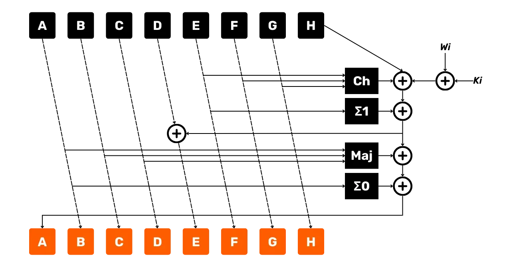

Далее мы обсудим работу алгоритмов цифровой подписи, которые вы используете каждый день для защиты ваших UTXO. Биткойн использует два: ECDSA и протокол Schnorr. Вы узнаете, какие математические примитивы лежат в основе этих алгоритмов и как они обеспечивают безопасность транзакций.

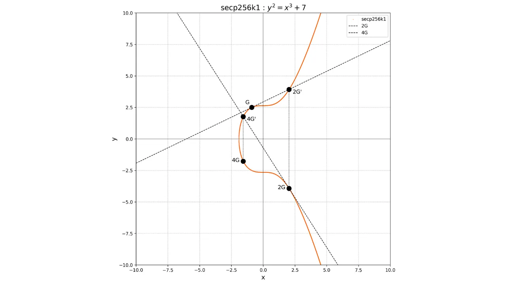

После того как мы хорошо разберемся с этими элементами криптографии, мы наконец перейдем к сердцу обучения: детерминированным и иерархическим кошелькам! Сначала будет раздел, посвященный мнемоническим фразам, этим последовательностям из 12 или 24 слов, которые позволяют вам создавать и восстанавливать ваши кошельки. Вы узнаете, как эти слова генерируются из источника энтропии и как они облегчают использование биткойна.

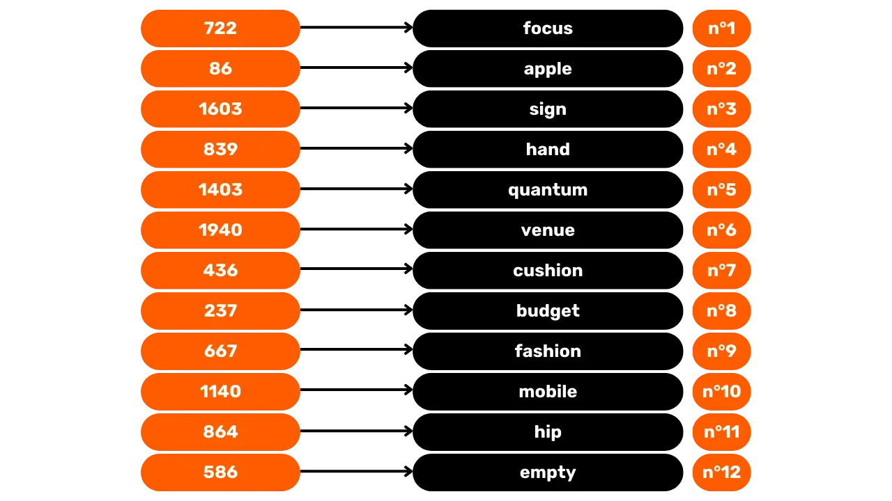
Обучение будет продолжено с изучением фразы-пароля BIP39, начальной фразы (не путать с мнемонической фразой), основного кода цепи и мастер-ключа. Мы подробно рассмотрим, что представляют собой эти элементы, их соответствующие роли и как они рассчитываются.
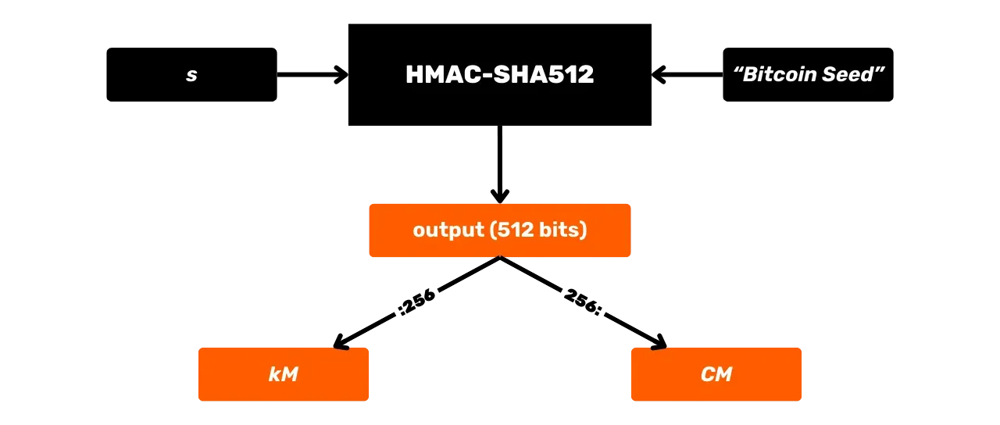

Наконец, начиная с мастер-ключа, мы узнаем, как производные криптографические пары ключей выводятся детерминированным и иерархическим способом до адресов получения.

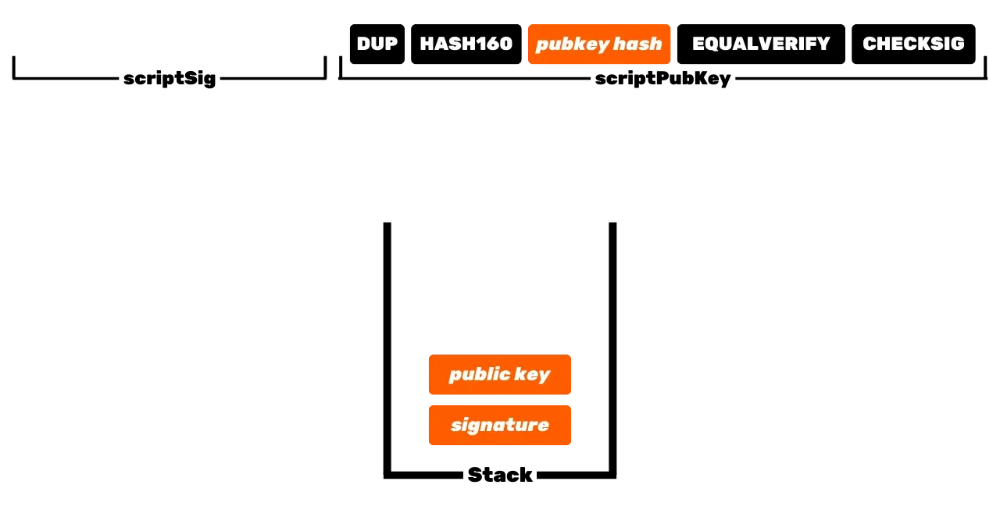

Это обучение позволит вам с уверенностью использовать программное обеспечение вашего кошелька, улучшая ваши навыки для идентификации и снижения рисков. Подготовьтесь стать настоящим экспертом в области Bitcoin кошельков!

# Хеш-функции

<partId>3713fee1-2ec2-512e-9e97-b6da9e4d2f17</partId>

## Введение в хеш-функции

<chapterId>dba011f5-1805-5a48-ac2b-4bd637c93703</chapterId>

Первый тип криптографических алгоритмов, используемых в Bitcoin, включает в себя хеш-функции. Они играют существенную роль на разных уровнях протокола, но также и внутри Bitcoin кошельков. Давайте вместе узнаем, что такое хеш-функция и для чего она используется в Bitcoin.

### Определение и принцип хеширования

Хеширование - это процесс, который преобразует информацию произвольной длины в другой фрагмент информации фиксированной длины с помощью криптографической хеш-функции. Другими словами, хеш-функция принимает на вход данные любого размера и преобразует их в отпечаток фиксированного размера, называемый "хеш".
Хеш также иногда называют "дайджест", "конденсат", "сжатый" или "хешированный".

Например, хеш-функция SHA256 производит хеш фиксированной длины 256 бит. Таким образом, если мы используем вход "_PlanB_", сообщение произвольной длины, сгенерированный хеш будет следующим 256-битным отпечатком:

```text
24f1b93b68026bfc24f5c8265f287b4c940fb1664b0d75053589d7a4f821b688
```


### Характеристики хеш-функций

Эти криптографические хеш-функции имеют несколько существенных характеристик, которые делают их особенно полезными в контексте Bitcoin и других компьютерных систем:

1. Необратимость (или устойчивость к нахождению прообраза)
2. Устойчивость к изменениям (эффект лавины)
3. Устойчивость к коллизиям
4. Устойчивость ко второму прообразу

#### 1. Необратимость (устойчивость к нахождению прообраза):

Необратимость означает, что легко вычислить хеш из входной информации, но обратный расчет, то есть нахождение входа по хешу, практически невозможен. Это свойство делает хеш-функции идеальными для создания уникальных цифровых отпечатков без компрометации исходной информации. Эта характеристика часто называется односторонней функцией или "функцией с ловушкой".

В данном примере, получение хеша `24f1b9…` зная вход "_PlanB_" просто и быстро. Однако, найти сообщение "_PlanB_" зная только `24f1b9…` невозможно.


Таким образом, невозможно найти прообраз $m$ для хеша $h$ так, чтобы $h = \text{HASH}(m)$, где $\text{HASH}$ является криптографической хеш-функцией.

#### 2. Устойчивость к изменениям (эффект лавины)

Второй характеристикой является устойчивость к внешним изменениям, также известная как **эффект лавины**. Эта характеристика наблюдается в хеш-функции, если небольшое изменение во входящем сообщении приводит к радикальному изменению в выходном хеше.
Если вернуться к нашему примеру с входным значением "_PlanB_" и функцией SHA256, мы видели, что сгенерированный хеш выглядит следующим образом:

```text
24f1b93b68026bfc24f5c8265f287b4c940fb1664b0d75053589d7a4f821b688
```

Если мы сделаем очень незначительное изменение во входных данных, используя на этот раз "_Planb_", то простое изменение "B" на строчную "b" полностью изменяет выходной хеш SHA256:

```text
bb038b4503ac5d90e1205788b00f8f314583c5e22f72bec84b8735ba5a36df3f
```


Это свойство гарантирует, что даже незначительное изменение исходного сообщения немедленно обнаруживается, поскольку изменяется не просто малая часть хеша, а весь хеш. Это может быть интересно в различных областях для проверки целостности сообщений, программного обеспечения или даже транзакций Bitcoin.

#### 3. Устойчивость к коллизиям

Третьей характеристикой является устойчивость к коллизиям. Хеш-функция считается устойчивой к коллизиям, если вычислительно невозможно найти 2 разных сообщения, которые производят одинаковый хеш-вывод из функции. Формально, сложно найти два различных сообщения $m_1$ и $m_2$ так, что:

$$
\text{HASH}(m_1) = \text{HASH}(m_2)
$$

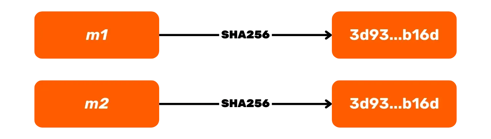

На практике математически неизбежно, что для хеш-функций существуют коллизии, поскольку размер входных данных может быть больше размера выходных данных. Это известно как принцип ящиков Дирихле: если $n$ объектов распределены по $m$ ящикам, при условии, что $m < n$, то по крайней мере один ящик обязательно будет содержать два или более объектов. Для хеш-функции этот принцип применим, потому что количество возможных сообщений (почти) бесконечно, в то время как количество возможных хешей конечно ($2^{256}$ в случае SHA256).

Таким образом, эта характеристика не означает, что для хеш-функций не существует коллизий, а скорее, что хорошая хеш-функция делает вероятность нахождения коллизии пренебрежимо малой. Например, эта характеристика уже не подтверждается для алгоритмов SHA-0 и SHA-1, предшественников SHA-2, для которых были найдены коллизии. Эти функции, следовательно, теперь не рекомендуются и часто считаются устаревшими.
Для хеш-функции из $n$ бит устойчивость к коллизиям имеет порядок $2^{\frac{n}{2}}$, в соответствии с атакой по методу дней рождения. Например, для SHA256 ($n = 256$) сложность нахождения коллизии имеет порядок $2^{128}$ попыток. На практике это означает, что если через функцию пройдет $2^{128}$ различных сообщений, вероятно, будет найдена коллизия.

#### 4. Устойчивость к второму прообразу

Устойчивость к второму прообразу - еще одна важная характеристика хеш-функций. Она утверждает, что, имея сообщение $m_1$ и его хеш $h$, вычислительно невозможно найти другое сообщение $m_2 \neq m_1$, так что:

$$
\text{HASH}(m_1) = \text{HASH}(m_2)
$$

Таким образом, устойчивость к второму прообразу в некотором смысле похожа на устойчивость к коллизиям, за исключением того, что здесь атака более сложная, потому что атакующий не может свободно выбирать $m_1$.

### Применение хеш-функций в Bitcoin

Наиболее используемая хеш-функция в Bitcoin — это **SHA256** ("_Secure Hash Algorithm 256 bits"_ — "Безопасный хеш-алгоритм, 256 бит"). Разработанная в начале 2000-х годов Агентством национальной безопасности (NSA) и стандартизированная Национальным институтом стандартов и технологий (NIST), она производит 256-битный хеш-вывод.

Эта функция используется во многих аспектах Bitcoin. На уровне протокола она участвует в механизме Proof-of-Work, где применяется двойное хеширование для поиска частичного столкновения между заголовком кандидата блока, созданного майнером, и целевым значением сложности. Если это частичное столкновение найдено, кандидат блок становится действительным и может быть добавлен в блокчейн.

SHA256 также используется при построении дерева Меркла, которое является аккумулятором, используемым для записи транзакций в блоках. Эта структура также найдена в протоколе Utreexo, который позволяет уменьшить размер набора UTXO. Кроме того, с введением Taproot в 2021 году, SHA256 используется в MAST (_Merkelised Alternative Script Tree_), что позволяет раскрывать только условия расходования, действительно использованные в скрипте, не раскрывая другие возможные варианты. Она также используется в расчете идентификаторов транзакций, при передаче пакетов по P2P-сети, в электронных подписях... Наконец, и это особенно интересно в рамках этого обучения, SHA256 используется на уровне приложений для построения кошельков Bitcoin и производства адресов.

Чаще всего, когда вы сталкиваетесь с использованием SHA256 в Bitcoin, это будет фактически двойной хеш SHA256, обозначаемый как "**HASH256**", который просто состоит из двукратного последовательного применения SHA256:
HASH256(m) = SHA256(SHA256(m))

Эта практика двойного хеширования добавляет дополнительный уровень безопасности против определенных потенциальных атак, хотя одиночный SHA256 сегодня считается криптографически безопасным.

Другая хеш-функция, доступная в языке Script и используемая для получения адресов, — это функция RIPEMD160. Эта функция производит 160-битный хеш (таким образом, короче, чем SHA256). Обычно она сочетается с SHA256 для формирования функции HASH160:

$$
\text{HASH160}(m) = \text{RIPEMD160}(\text{SHA256}(m))
$$

Эта комбинация используется для генерации более коротких хешей, в частности при создании некоторых адресов Bitcoin, которые представляют хеши ключей или хеши скриптов, а также для производства отпечатков ключей.

Наконец, только на уровне приложений иногда также используется функция SHA512, которая косвенно играет роль в производстве ключей для кошельков. Эта функция очень похожа на SHA256 в своей работе; обе принадлежат к одной семье SHA2, но SHA512 производит, как указывает ее название, 512-битный хеш, в сравнении с 256 битами для SHA256. Мы подробно рассмотрим ее использование в следующих главах.

Теперь вы знаете основные аспекты о хеш-функциях для дальнейшего изучения. В следующей главе я предлагаю подробнее рассмотреть работу функции, которая находится в самом сердце Bitcoin: SHA256. Мы разберем ее, чтобы понять, как она достигает описанных здесь характеристик. Следующая глава будет довольно длинной и технической, но она не является обязательной для продолжения обучения. Так что, если у вас возникнут трудности с пониманием, не беспокойтесь и переходите непосредственно к следующей главе, которая будет гораздо более доступной.

## Внутреннее устройство SHA256

<chapterId>905eb320-f15b-5fb6-8d2d-5bb447337deb</chapterId>
Мы ранее видели, что хеш-функции обладают важными характеристиками, которые оправдывают их использование в Bitcoin. Давайте теперь рассмотрим внутренние механизмы этих хеш-функций, которые придают им эти свойства, и для этого я предлагаю разобрать принцип работы SHA256.
Функции SHA256 и SHA512 принадлежат к одной и той же семье SHA2. Их механизм основан на специфической конструкции, называемой **конструкцией Меркла-Дамгора**. RIPEMD160 также использует этот же тип конструкции.

Напомним, что на вход SHA256 подается сообщение произвольного размера, и мы пропускаем его через функцию, чтобы получить на выходе 256-битный хеш.

### Предварительная обработка входных данных

Для начала нам нужно подготовить наше входное сообщение $m$ так, чтобы его длина была стандартной и кратной 512 битам. Этот шаг критически важен для правильной работы алгоритма в дальнейшем.
Для этого мы начинаем с шага добавления битов заполнения. Сначала мы добавляем к сообщению разделительный бит `1`, за которым следует определенное количество битов `0`. Количество добавляемых битов `0` рассчитывается так, чтобы общая длина сообщения после этого добавления была сравнима с 448 по модулю 512. Таким образом, длина $L$ сообщения с битами заполнения равна:

$$
L \equiv 448 \mod 512
$$

$\text{mod}$, для модуля, - это математическая операция, которая между двумя целыми числами возвращает остаток от Евклидова деления первого на второе. Например: $16 \mod 5 = 1$. Это операция широко используется в криптографии.

Здесь шаг заполнения гарантирует, что после добавления 64 бит в следующем шаге общая длина выровненного сообщения будет кратной 512 битам. Если исходное сообщение имеет длину $M$ бит, то количество ($N$) добавляемых битов `0` таково:

$$
N = (448 - (M + 1) \mod 512) \mod 512
$$

Например, если исходное сообщение составляет 950 бит, расчет будет следующим:

$$
\begin{align*}
M & = 950 \\
M + 1 & = 951 \\
(M + 1) \mod 512 & = 951 \mod 512 \\
& = 951 - 512 \cdot \left\lfloor \frac{951}{512} \right\rfloor \\
& = 951 - 512 \cdot 1 \\
& = 951 - 512 \\
& = 439 \\
\\
448 - (M + 1) \mod 512 & = 448 - 439 \\
& = 9 \\
\\
N & = (448 - (M + 1) \mod 512) \mod 512 \\
N & = 9 \mod 512 \\
& = 9
\end{align*}
$$

Таким образом, у нас было бы 9 битов `0` в дополнение к разделителю `1`. Наши биты заполнения, которые должны быть добавлены непосредственно после нашего сообщения $M$, таковы:

```text
1000 0000 00
```

После добавления битов заполнения к нашему сообщению $M$, мы также добавляем 64-битное представление исходной длины сообщения $M$, выраженное в двоичном виде. Это позволяет хеш-функции быть чувствительной к порядку битов и длине сообщения.
Если вернуться к нашему примеру с исходным сообщением из 950 бит, мы конвертируем десятичное число `950` в двоичное, что дает нам `1110 1101 10`. Мы дополняем это число нулями в основании, чтобы получить в сумме 64 бита. В нашем примере это будет выглядеть так:

```text
0000 0000 0000 0000 0000 0000 0000 0000 0000 0000 0000 0000 0000 0011 1011 0110
```

Этот размер дополнения добавляется в соответствии с дополнением битами. Таким образом, сообщение после нашей предварительной обработки состоит из трех частей:

1. Исходное сообщение $M$;
2. Бит `1`, за которым следует несколько бит `0`, чтобы сформировать дополнение битами;
3. 64-битное представление длины $M$ для формирования дополнения с размером.

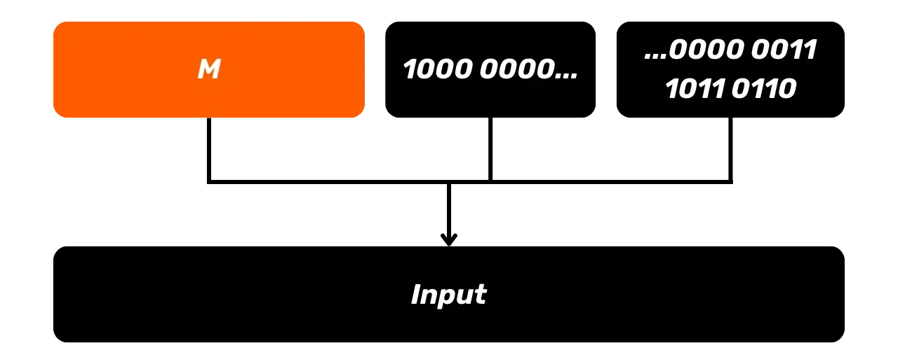

### Инициализация переменных

SHA256 использует восемь начальных переменных состояния, обозначенных $A$ до $H$, каждая из 32 бит. Эти переменные инициализируются специфическими константами, которые являются дробными частями квадратных корней из первых восьми простых чисел. Мы будем использовать эти значения в последующем процессе хеширования:

- $A = 0x6a09e667$
- $B = 0xbb67ae85$
- $C = 0x3c6ef372$
- $D = 0xa54ff53a$
- $E = 0x510e527f$
- $F = 0x9b05688c$
- $G = 0x1f83d9ab$
- $H = 0x5be0cd19$

SHA256 также использует 64 другие константы, обозначенные $K_0$ до $K_{63}$, которые являются дробными частями кубических корней из первых 64 простых чисел:

$$
K[0 \ldots 63] = \begin{pmatrix}
0x428a2f98, & 0x71374491, & 0xb5c0fbcf, & 0xe9b5dba5, \\
0x3956c25b, & 0x59f111f1, & 0x923f82a4, & 0xab1c5ed5, \\
0xd807aa98, & 0x12835b01, & 0x243185be, & 0x550c7dc3, \\
0x72be5d74, & 0x80deb1fe, & 0x9bdc06a7, & 0xc19bf174, \\
0xe49b69c1, & 0xefbe4786, & 0x0fc19dc6, & 0x240ca1cc, \\
0x2de92c6f, & 0x4a7484aa, & 0x5cb0a9dc, & 0x76f988da, \\
0x983e5152, & 0xa831c66d, & 0xb00327c8, & 0xbf597fc7, \\
0xc6e00bf3, & 0xd5a79147, & 0x06ca6351, & 0x14292967, \\
0x27b70a85, & 0x2e1b2138, & 0x4d2c6dfc, & 0x53380d13, \\
\end{pmatrix}
$$

0x650a7354, & 0x766a0abb, & 0x81c2c92e, & 0x92722c85, \\0xa2bfe8a1, & 0xa81a664b, & 0xc24b8b70, & 0xc76c51a3, \\0xd192e819, & 0xd6990624, & 0xf40e3585, & 0x106aa070, \\
0x19a4c116, & 0x1e376c08, & 0x2748774c, & 0x34b0bcb5, \\
0x391c0cb3, & 0x4ed8aa4a, & 0x5b9cca4f, & 0x682e6ff3, \\
0x748f82ee, & 0x78a5636f, & 0x84c87814, & 0x8cc70208, \\
0x90befffa, & 0xa4506ceb, & 0xbef9a3f7, & 0xc67178f2
\end{pmatrix}

$$

### Разделение входных данных

Теперь, когда у нас есть уравненный вход, мы перейдем к основной фазе обработки алгоритма SHA256: функции сжатия. Этот шаг очень важен, так как именно он придает хеш-функции криптографические свойства, которые мы изучали в предыдущей главе.

Сначала мы начинаем с разделения нашего уравненного сообщения (результат предварительной обработки) на несколько блоков $P$ по 512 бит каждый. Если наше уравненное сообщение имеет общий размер $n \times 512$ бит, у нас будет $n$ блоков, каждый по 512 бит. Каждый 512-битный блок будет обрабатываться индивидуально функцией сжатия, которая состоит из 64 раундов последовательных операций. Назовем эти блоки $P_1$, $P_2$, $P_3$...

### Логические операции

Прежде чем подробно изучать функцию сжатия, важно понимать основные логические операции, используемые в ней. Эти операции, основанные на булевой алгебре, работают на уровне битов. Основные логические операции, используемые:
- **Конъюнкция (И)**: обозначается $\land$, соответствует логическому "И".
- **Дизъюнкция (ИЛИ)**: обозначается $\lor$, соответствует логическому "ИЛИ".
- **Отрицание (НЕТ)**: обозначается $\lnot$, соответствует логическому "НЕТ".

Из этих базовых операций мы можем определить более сложные операции, такие как "Исключающее ИЛИ" (XOR) обозначается $\oplus$, которое широко используется в криптографии.
Каждую логическую операцию можно представить с помощью таблицы истинности, которая указывает результат для всех возможных комбинаций двоичных входных значений (два операнда $p$ и $q$).
Для XOR ($\oplus$):

| $p$ | $q$ | $p \oplus q$ |
| --- | --- | ------------ |
| 0   | 0   | 0            |
| 0   | 1   | 1            |
| 1   | 0   | 1            |
| 1   | 1   | 0            |

Для И ($\land$):

| $p$ | $q$ | $p \land q$ |
| --- | --- | ----------- |
| 0   | 0   | 0           |
| 0   | 1   | 0           || 1   | 0   | 0           |
| 1   | 1   | 1           |

Для НЕ ($\lnot p$):

| $p$ | $\lnot p$ |
| --- | --------- |
| 0   | 1         |
| 1   | 0         |

Давайте рассмотрим пример, чтобы понять операцию XOR на уровне битов. Если у нас есть два двоичных числа на 6 бит:

- $a = 101100$
- $b = 001000$

Тогда:


$$

a \oplus b = 101100 \oplus 001000 = 100100

$$

Применяя XOR по битам:

| Позиция бита | $a$ | $b$ | $a \oplus b$ |
| ------------ | --- | --- | ------------ |
| 1            | 1   | 0   | 1            |
| 2            | 0   | 0   | 0            |
| 3            | 1   | 1   | 0            |
| 4            | 1   | 0   | 1            |
| 5            | 0   | 0   | 0            |
| 6            | 0   | 0   | 0            |

В результате получается $100100$.

Помимо логических операций, функция сжатия использует операции сдвига битов, которые будут играть существенную роль в распространении битов в алгоритме.

Во-первых, есть операция логического сдвига вправо, обозначаемая $ShR_n(x)$, которая сдвигает все биты $x$ вправо на $n$ позиций, заполняя освободившиеся биты слева нулями.

Например, для $x = 101100001$ (на 9 битах) и $n = 4$:


$$

ShR_4(101100001) = 000010110

$$

Схематически операцию сдвига вправо можно представить так:

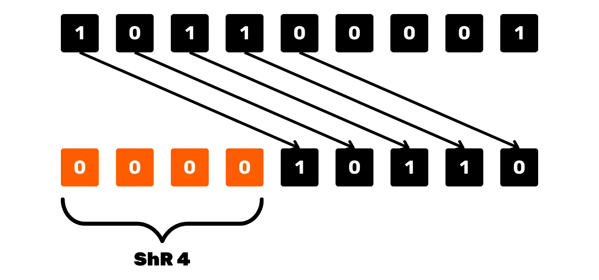
Другая операция, используемая в SHA256 для манипуляции с битами, - это правый циклический сдвиг, обозначаемый $RotR_n(x)$, который сдвигает биты $x$ вправо на $n$ позиций, возвращая сдвинутые биты в начало строки.
Например, для $x = 101100001$ (на 9 битах) и $n = 4$:


$$

RotR_4(101100001) = 000110110

$$

Схематически операцию правого циклического сдвига можно представить так:

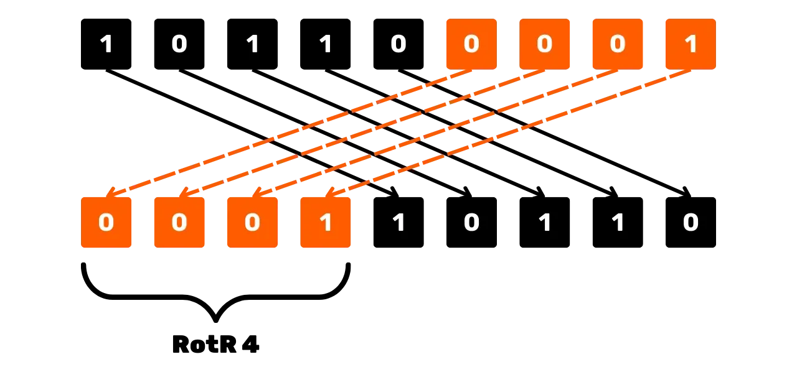

### Функция сжатия

Теперь, когда мы поняли основные операции, давайте подробнее рассмотрим функцию сжатия SHA256.

На предыдущем этапе мы разделили наш вход на несколько 512-битных блоков $P$. Для каждого 512-битного блока $P$ у нас есть:
- **Слова сообщения $W_i$**: для $i$ от 0 до 63.
- **Константы $K_i$**: для $i$ от 0 до 63, определенные на предыдущем этапе.
- **Переменные состояния $A, B, C, D, E, F, G, H$**: инициализированные значениями с предыдущего шага.
Первые 16 слов, $W_0$ до $W_{15}$, напрямую извлекаются из обработанного 512-битного блока $P$. Каждое слово $W_i$ состоит из 32 последовательных битов блока. Так, например, мы берем наш первый кусок входных данных $P_1$ и далее делим его на меньшие 32-битные части, которые мы называем словами.
Следующие 48 слов ($W_{16}$ до $W_{63}$) генерируются с использованием следующей формулы:


$$

W*i = W*{i-16} + \sigma*0(W*{i-15}) + W*{i-7} + \sigma_1(W*{i-2}) \mod 2^{32}

$$

Где:
- $\sigma_0(x) = RotR_7(x) \oplus RotR_{18}(x) \oplus ShR_3(x)$
- $\sigma_1(x) = RotR_{17}(x) \oplus RotR_{19}(x) \oplus ShR_{10}(x)$

В данном случае $x$ равно $W_{i-15}$ для $\sigma_0(x)$ и $W_{i-2}$ для $\sigma_1(x)$.

Как только мы определили все слова $W_i$ для нашего 512-битного куска, мы можем перейти к функции сжатия, которая состоит из выполнения 64 раундов.

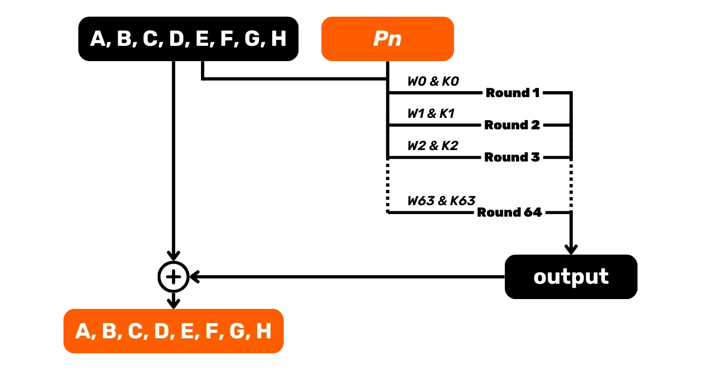
На каждом раунде $i$ от 0 до 63 у нас есть три разных типа входных данных. Во-первых, $W_i$, которые мы только что определили, частично состоящие из нашего куска сообщения $P_n$. Затем, 64 константы $K_i$. Наконец, мы используем переменные состояния $A$, $B$, $C$, $D$, $E$, $F$, $G$ и $H$, которые будут изменяться в процессе хеширования и модифицироваться с каждой функцией сжатия. Однако для первого куска $P_1$ мы используем начальные константы, данные ранее.
Затем мы выполняем следующие операции над нашими входными данными:

- **Функция $\Sigma_0$:**


$$

\Sigma*0(A) = RotR_2(A) \oplus RotR*{13}(A) \oplus RotR\_{22}(A)

$$

- **Функция $\Sigma_1$:**


$$

\Sigma*1(E) = RotR_6(E) \oplus RotR*{11}(E) \oplus RotR\_{25}(E)

$$

- **Функция $Ch$ ("*Выбор*"):**


$$

Ch(E, F, G) = (E \land F) \oplus (\lnot E \land G)

$$

- **Функция $Maj$ ("*Большинство*"):**


$$

Maj(A, B, C) = (A \land B) \oplus (A \land C) \oplus (B \land C)

$$

Затем мы вычисляем 2 временные переменные:

- $temp1$:


$$

temp1 = H + \Sigma_1(E) + Ch(E, F, G) + K_i + W_i \mod 2^{32}

$$

- $temp2$:


$$

temp2 = \Sigma_0(A) + Maj(A, B, C) \mod 2^{32}

$$

Далее мы обновляем переменные состояния следующим образом:


$$

\begin{cases}
H = G \\
G = F \\
F = E \\
E = D + temp1 \mod 2^{32} \\
D = C \\
C = B \\
B = A \\
A = temp1 + temp2 \mod 2^{32}
\end{cases}

$$

Следующая диаграмма представляет один раунд функции сжатия SHA256, который мы только что описали:


- Стрелки указывают направление потока данных;
- Блоки представляют выполняемые операции;
- Знак $+$ в окружении обозначает сложение по модулю $2^{32}$.

Мы уже можем наблюдать, что этот раунд выдает новые состояния переменных $A$, $B$, $C$, $D$, $E$, $F$, $G$ и $H$. Эти новые переменные будут служить входными данными для следующего раунда, который, в свою очередь, произведет новые переменные $A$, $B$, $C$, $D$, $E$, $F$, $G$ и $H$, которые будут использоваться для следующего раунда. Этот процесс продолжается до 64-го раунда.
После 64 раундов мы обновляем исходные значения состояний переменных, добавляя к ним их конечные значения в конце 64-го раунда:
$$

\begin{cases}
A = A*{\text{initial}} + A \mod 2^{32} \\
B = B*{\text{initial}} + B \mod 2^{32} \\
C = C*{\text{initial}} + C \mod 2^{32} \\
D = D*{\text{initial}} + D \mod 2^{32} \\
E = E*{\text{initial}} + E \mod 2^{32} \\
F = F*{\text{initial}} + F \mod 2^{32} \\
G = G*{\text{initial}} + G \mod 2^{32} \\
H = H*{\text{initial}} + H \mod 2^{32}
\end{cases}

$$

Эти новые значения переменных $A$, $B$, $C$, $D$, $E$, $F$, $G$ и $H$ будут служить исходными значениями для следующего блока, $P_2$. Для этого блока $P_2$ мы повторяем тот же процесс сжатия с 64 раундами, затем обновляем переменные для блока $P_3$ и так далее до последнего блока нашего выровненного ввода.

После обработки всех блоков сообщений мы конкатенируем конечные значения переменных $A$, $B$, $C$, $D$, $E$, $F$, $G$ и $H$, чтобы сформировать конечный 256-битный хеш нашей хеш-функции:


$$

\text{Hash} = A \Vert B \Vert C \Vert D \Vert E \Vert F \Vert G \Vert H

$$

Каждая переменная является 32-битным целым числом, поэтому их конкатенация всегда дает 256-битный результат, независимо от размера нашего сообщения, введенного в хеш-функцию.

### Обоснование криптографических свойств

Но как же эта функция обладает необратимостью, устойчивостью к коллизиям и защитой от вмешательства?

Что касается защиты от вмешательства, то понять это довольно просто. Выполняется так много вычислений каскадом, которые зависят как от ввода, так и от констант, что даже малейшее изменение исходного сообщения полностью меняет пройденный путь и, таким образом, полностью меняет выходной хеш. Это то, что называется эффектом лавины. Это свойство частично обеспечивается смешиванием промежуточных состояний с исходными состояниями для каждого куска.
Далее, когда обсуждается криптографическая хеш-функция, термин "обратимость" обычно не используется. Вместо этого мы говорим о "устойчивости к нахождению прообраза", что означает, что для любого данного $y$ трудно найти такой $x$, что $h(x) = y$. Эта устойчивость к нахождению прообраза обеспечивается алгебраической сложностью и сильной нелинейностью операций, выполняемых в функции сжатия, а также потерей определенной информации в процессе. Например, для данного результата сложения по модулю существует несколько возможных операндов:$$
3+2 \mod 10 = 5 \\
7+8 \mod 10 = 5 \\
5+10 \mod 10 = 5
$$

В этом примере, зная только используемый модуль (10) и результат (5), нельзя с уверенностью определить, какие именно операнды использовались в сложении. Говорят, что существует несколько конгруэнтностей по модулю 10.

Для операции XOR мы сталкиваемся с той же проблемой. Помните таблицу истинности для этой операции: любой 1-битный результат может быть определен двумя разными конфигурациями входных данных, которые имеют абсолютно одинаковую вероятность быть правильными значениями. Следовательно, нельзя с уверенностью определить операнды XOR, зная только его результат. Если мы увеличим размер операндов XOR, количество возможных входных данных, зная только результат, увеличивается экспоненциально. Более того, XOR часто используется вместе с другими операциями на уровне битов, такими как операция $\text{RotR}$, которые добавляют еще больше возможных интерпретаций к результату.

Функция сжатия также использует операцию $\text{ShR}$. Эта операция удаляет часть базовой информации, которую затем невозможно восстановить. Опять же, нет алгебраического способа обратить эту операцию. Все эти однонаправленные операции с потерей информации используются очень часто в функциях сжатия. Количество возможных входных данных для данного выхода таким образом почти бесконечно, и каждая попытка обратного расчета приведет к уравнениям с очень большим количеством неизвестных, которое будет экспоненциально увеличиваться на каждом шаге.

Наконец, для характеристики устойчивости к коллизиям в игру вступают несколько параметров. Предварительная обработка исходного сообщения играет существенную роль. Без этой предварительной обработки может быть легче найти коллизии на функции. Хотя теоретически коллизии существуют (из-за принципа Дирихле), структура хеш-функции в сочетании с упомянутыми свойствами делает вероятность нахождения коллизии крайне низкой.
Для того чтобы хеш-функция была устойчива к коллизиям, важно, чтобы:

- Результат был непредсказуемым: Любая предсказуемость может быть использована для более быстрого нахождения коллизий, чем при атаке методом грубой силы. Функция обеспечивает, что каждый бит выходных данных зависит нетривиальным образом от входных данных. Другими словами, функция разработана так, чтобы каждый бит конечного результата имел независимую вероятность быть 0 или 1, даже если на практике эта независимость не абсолютна.
- Распределение хешей псевдослучайно: Это обеспечивает равномерное распределение хешей.
- Размер хеша значителен: чем больше возможное пространство для результатов, тем сложнее найти коллизию.

Криптографы разрабатывают эти функции, оценивая лучшие возможные атаки для нахождения коллизий, затем корректируя параметры, чтобы сделать эти атаки неэффективными.

### Конструкция Меркла-Дамгора

Структура SHA256 основана на конструкции Меркла-Дамгора, которая позволяет преобразовать функцию сжатия в хеш-функцию, способную обрабатывать сообщения произвольной длины. Это именно то, что мы видели в этой главе.
Однако некоторые старые хеш-функции, такие как SHA1 или MD5, использующие эту конкретную конструкцию, уязвимы к атакам на расширение длины. Это техника, которая позволяет атакующему, знающему хеш сообщения $M$ и длину $M$ (не зная само сообщение), вычислить хеш сообщения $M'$, сформированного путем конкатенации $M$ с дополнительным содержимым.
SHA256, хотя и использует тот же тип конструкции, теоретически устойчив к этому типу атаки, в отличие от SHA1 и MD5. Это может объяснить загадку двойного хеширования, реализованного в Bitcoin Сатоши Накамото. Чтобы избежать этого типа атаки, Сатоши мог предпочесть использовать двойной SHA256:

$$
\text{HASH256}(m) = \text{SHA256}(\text{SHA256}(m))
$$

Это повышает безопасность против потенциальных атак, связанных с конструкцией Меркла-Дамгора, но это не увеличивает безопасность процесса хеширования с точки зрения устойчивости к коллизиям. Более того, даже если бы SHA256 был уязвим к этому типу атаки, это не имело бы серьезного влияния, так как все случаи использования хеш-функций в Bitcoin включают публичные данные. Однако атака на расширение длины могла бы быть полезной для атакующего только в том случае, если бы хешированные данные были приватными и пользователь использовал хеш-функцию в качестве механизма аутентификации этих данных, аналогично MAC. Таким образом, реализация двойного хеширования остается загадкой в дизайне Bitcoin.
Теперь, когда мы подробно рассмотрели принцип работы хеш-функций, особенно SHA256, которая широко используется в Bitcoin, мы более конкретно сосредоточимся на криптографических алгоритмах производных, используемых на уровне приложений, особенно для получения ключей для вашего кошелька.

## Алгоритмы, используемые для производных

<chapterId>cc668121-7789-5e99-bf5e-1ba085f4f5f2</chapterId>

На уровне приложений в Bitcoin, помимо хеш-функций, используются криптографические алгоритмы производных для генерации защищенных данных из исходных входных данных. Хотя эти алгоритмы опираются на хеш-функции, они служат разным целям, особенно в плане аутентификации и генерации ключей. Эти алгоритмы сохраняют некоторые характеристики хеш-функций, такие как необратимость, устойчивость к подделке и устойчивость к коллизиям.

В кошельках Bitcoin в основном используются 2 алгоритма производных:

1. **HMAC (_Hash-based Message Authentication Code_)**
2. **PBKDF2 (_Password-Based Key Derivation Function 2_)**

Мы вместе изучим функционирование и роль каждого из них.

### HMAC-SHA512

HMAC - это криптографический алгоритм, который вычисляет код аутентификации на основе комбинации хеш-функции и секретного ключа. Bitcoin использует HMAC-SHA512, вариант HMAC, который использует хеш-функцию SHA512. Мы уже видели в предыдущей главе, что SHA512 является частью той же семьи хеш-функций, что и SHA256, но производит 512-битный вывод.

Вот его общая схема работы с $m$ в качестве входного сообщения и $K$ секретного ключа:


Давайте подробнее рассмотрим, что происходит в этой черной коробке HMAC-SHA512. Функция HMAC-SHA512 с:

- $m$: произвольно выбранное пользователем сообщение (первый вход);
- $K$: произвольно выбранный пользователем секретный ключ (второй вход);
- $K'$: ключ $K$, скорректированный до размера $B$ блоков хеш-функции (1024 бита для SHA512, или 128 байт);
- $\text{SHA512}$: хеш-функция SHA512;
- $\oplus$: операция XOR (исключающее или);
- $\Vert$: оператор конкатенации, соединяющий битовые строки встык;
- $\text{opad}$: константа, состоящая из байта $0x5c$, повторяющегося 128 раз;
- $\text{ipad}$: константа, состоящая из байта $0x36$, повторяющегося 128 раз.
  Перед расчетом HMAC необходимо выровнять ключ и константы в соответствии с размером блока $B$. Например, если ключ $K$ короче 128 байтов, он дополняется нулями до размера $B$. Если $K$ длиннее 128 байтов, он сжимается с использованием SHA512, а затем добавляются нули до достижения 128 байтов. Таким образом, получается выровненный ключ $K'$.
  Значения $\text{opad}$ и $\text{ipad}$ получаются путем повторения их базового байта ($0x5c$ для $\text{opad}$, $0x36$ для $\text{ipad}$) до достижения размера $B$. Таким образом, при $B = 128$ байтах, мы имеем:

$$
\text{opad} = \underbrace{0x5c5c\ldots5c}_{128 \, \text{байтов}}
$$

После предварительной обработки алгоритм HMAC-SHA512 определяется следующим уравнением:

$$
\text {HMAC-SHA512}_K(m) = \text{SHA512} \left( (K' \oplus \text{opad}) \parallel \text{SHA512} \left( (K' \oplus \text{ipad}) \parallel m \right) \right)
$$

Это уравнение разбивается на следующие шаги:

1. Применить XOR к скорректированному ключу $K'$ с $\text{ipad}$, чтобы получить $\text{iKpad}$;
2. Применить XOR к скорректированному ключу $K'$ с $\text{opad}$, чтобы получить $\text{oKpad}$;
3. Конкатенировать $\text{iKpad}$ с сообщением $m$.
4. Хешировать этот результат с помощью SHA512, чтобы получить промежуточный хеш $H_1$.
5. Конкатенировать $\text{oKpad}$ с $H_1$.
6. Хешировать этот результат с помощью SHA512, чтобы получить окончательный результат $H_2$.

Эти шаги можно схематически изобразить следующим образом:

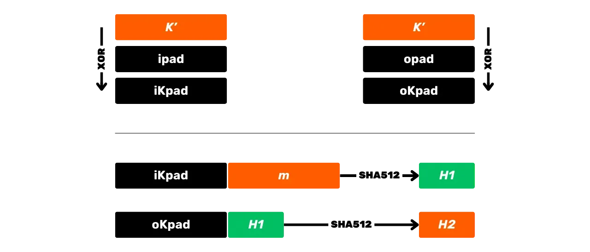

HMAC используется в Bitcoin, в частности, для производства ключей в HD (иерархически детерминированных) кошельках (об этом мы поговорим более подробно в следующих главах) и как компонент PBKDF2.

### PBKDF2

PBKDF2 (_Password-Based Key Derivation Function 2_) — это алгоритм производства ключей на основе пароля, предназначенный для повышения безопасности паролей. Алгоритм применяет псевдослучайную функцию (в данном случае HMAC-SHA512) к паролю и криптографической соли, а затем повторяет эту операцию определенное количество раз, чтобы произвести выходной ключ.

В Bitcoin PBKDF2 используется для генерации сида HD кошелька из мнемонической фразы и парольной фразы (но об этом мы поговорим более подробно в следующих главах).

Процесс PBKDF2 следующий, с:

- $m$: мнемоническая фраза пользователя;
- $s$: необязательная парольная фраза для повышения безопасности (пустое поле, если парольная фраза отсутствует);
- $n$: количество итераций функции, в нашем случае это 2048.
  Функция PBKDF2 определяется итеративно. Каждая итерация берет результат предыдущей, пропускает его через HMAC-SHA512 и объединяет последовательные результаты для производства конечного ключа:
  $$
  \text{PBKDF2}(m, s) = \text{HMAC-SHA512}^{2048}(m, s)
  $$

Схематически PBKDF2 можно представить следующим образом:

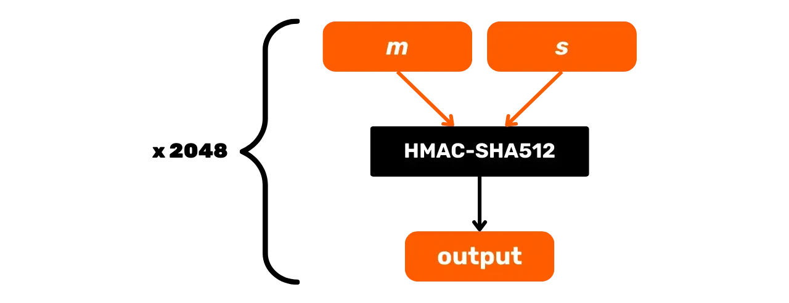

В этой главе мы рассмотрели функции HMAC-SHA512 и PBKDF2, которые используют хэш-функции для обеспечения целостности и безопасности производных ключей в протоколе Bitcoin. В следующей части мы рассмотрим цифровые подписи, другой криптографический метод, широко используемый в Bitcoin.

# Цифровые подписи

<partId>76b58a00-0c18-54b9-870d-6b7e34029db8</partId>

## Цифровые подписи и эллиптические кривые

<chapterId>c9dd9672-6da1-57f8-9871-8b28994d4c1a</chapterId>

Второй криптографический метод, используемый в Bitcoin, включает алгоритмы цифровой подписи. Давайте рассмотрим, что это такое и как это работает.

### Биткойны, UTXO и условия расходования

Термин "_кошелек_" в Bitcoin может быть довольно путанным для новичков. Действительно, то, что называется кошельком Bitcoin, это программное обеспечение, которое не хранит ваши биткойны напрямую, в отличие от физического кошелька, который может содержать монеты или купюры. Биткойны являются просто единицами учета. Эта единица учета представлена **UTXO** (_Unspent Transaction Outputs_, непотраченные выходы транзакций), которые являются непотраченными выходами транзакций. Если эти выходы не потрачены, это означает, что они принадлежат пользователю. UTXO, таким образом, являются частями биткойнов переменного размера, принадлежащими пользователю.

Протокол Bitcoin распределен и работает без центрального органа управления. Поэтому это не похоже на традиционные банковские записи, где евро, принадлежащие вам, просто ассоциированы с вашей личной идентичностью. В Bitcoin ваши UTXO принадлежат вам, потому что они защищены условиями расходования, указанными на языке Script. Упрощенно, существует два типа скриптов: скрипт блокировки (_scriptPubKey_), который защищает UTXO, и скрипт разблокировки (_scriptSig_), который позволяет разблокировать UTXO и, таким образом, потратить представляемые им единицы биткойна.
Первоначальная операция Bitcoin с использованием скриптов P2PK включает использование публичного ключа для блокировки средств, указывая в _scriptPubKey_, что лицо, желающее потратить этот UTXO, должно предоставить действительную подпись с приватным ключом, соответствующим этому публичному ключу. Для разблокировки этого UTXO, следовательно, необходимо предоставить действительную подпись в _scriptSig_. Как следует из их названий, публичный ключ известен всем, поскольку он транслируется в блокчейне, в то время как приватный ключ известен только законному владельцу средств.
Это базовая операция Bitcoin, но со временем эта операция стала более сложной. Во-первых, Сатоши также ввел скрипты P2PKH, которые используют адрес получения в _scriptPubKey_, представляющий хэш публичного ключа. Затем система стала еще более сложной с появлением SegWit, а затем Taproot. Однако общий принцип остается фундаментально тем же: публичный ключ или представление этого ключа используется для блокировки UTXO, и соответствующий приватный ключ требуется для их разблокировки и, таким образом, расходования.
Пользователь, желающий совершить транзакцию в Bitcoin, должен создать цифровую подпись с использованием своего приватного ключа по отношению к данной транзакции. Данную подпись могут проверить другие участники сети. Если она действительна, это означает, что пользователь, инициирующий транзакцию, действительно является владельцем приватного ключа, а следовательно, и владельцем биткоинов, которые он желает потратить. Другие пользователи могут затем принять и распространить транзакцию.

Таким образом, пользователь, владеющий биткоинами, заблокированными с помощью публичного ключа, должен найти способ безопасно хранить то, что позволяет разблокировать его средства: приватный ключ. Биткоин-кошелек - это именно то устройство, которое позволит вам легко хранить все ваши ключи так, чтобы другие люди не имели к ним доступа. Поэтому он больше похож на связку ключей, чем на кошелек.

Математическая связь между публичным и приватным ключом, а также возможность выполнения подписи для доказательства владения приватным ключом без его раскрытия, становятся возможными благодаря алгоритму цифровой подписи. В протоколе Bitcoin используются 2 алгоритма подписи: **ECDSA** (_Elliptic Curve Digital Signature Algorithm_) и **схема подписи Schnorr**. ECDSA является цифровым протоколом подписи, используемым в Bitcoin с самого начала. Schnorr более новый в Bitcoin, так как был введен в ноябре 2021 года с обновлением Taproot.
Эти два алгоритма довольно схожи по своим механизмам. Оба они основаны на криптографии эллиптических кривых. Основное различие между этими двумя протоколами заключается в структуре подписи и некоторых специфических математических свойствах. Поэтому мы изучим функционирование этих алгоритмов, начиная с самого старого: ECDSA.

### Криптография на эллиптических кривых

Криптография на эллиптических кривых (ECC) - это набор алгоритмов, использующих эллиптическую кривую для ее различных математических и геометрических свойств в криптографических целях. Безопасность этих алгоритмов основана на сложности задачи дискретного логарифма на эллиптических кривых. Эллиптические кривые, в частности, используются для обмена ключами, асимметричного шифрования или создания цифровых подписей.

Важным свойством этих кривых является их симметрия относительно оси x. Таким образом, любая невертикальная линия, пересекающая кривую в двух различных точках, всегда будет пересекать кривую в третьей точке. Кроме того, любая касательная к кривой в невырожденной точке будет пересекать кривую в другой точке. Эти свойства будут полезны для определения операций на кривой.

Вот представление эллиптической кривой над полем действительных чисел:

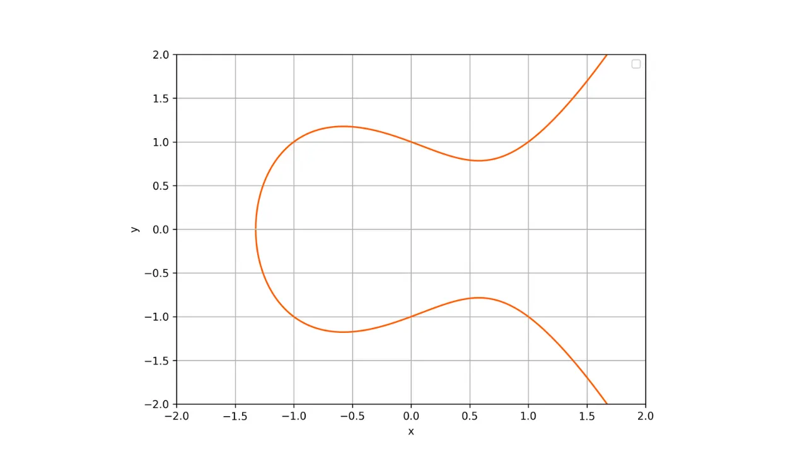

Каждая эллиптическая кривая определяется уравнением вида:

$$
y^2 = x^3 + ax + b
$$

### secp256k1

Для использования ECDSA или Schnorr необходимо выбрать параметры эллиптической кривой, то есть значения $a$ и $b$ в уравнении кривой. Существуют различные стандарты эллиптических кривых, которые считаются криптографически безопасными. Наиболее известной является кривая _secp256r1_, определенная и рекомендованная NIST (_Национальным институтом стандартов и технологий_).

Тем не менее, Сатоши Накамото, изобретатель Bitcoin, решил не использовать эту кривую. Причина этого выбора неизвестна, но некоторые считают, что он предпочел найти альтернативу, поскольку параметры этой кривой потенциально могли содержать заднюю дверь. Вместо этого протокол Bitcoin использует стандартную кривую **_secp256k1_**. Эта кривая определена параметрами $a = 0$ и $b = 7$. Ее уравнение, следовательно, имеет вид:

$$
y^2 = x^3 + 7
$$

Ее графическое представление над полем действительных чисел выглядит так:
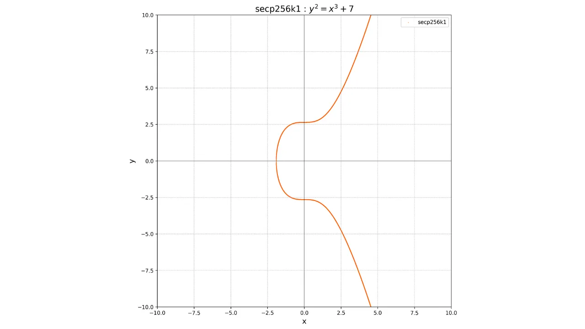
Однако в криптографии мы работаем с конечными множествами чисел. Более конкретно, мы работаем в конечном поле $\mathbb{F}_p$, которое является полем целых чисел по модулю простого числа $p$.
**Определение**: Простое число - это натуральное целое число, большее или равное 2, которое имеет только два различных положительных целочисленных делителя: 1 и само себя. Например, число 7 является простым числом, поскольку его можно разделить только на 1 и 7. С другой стороны, число 8 не является простым, потому что его можно разделить на 1, 2, 4 и 8.
В Bitcoin простое число $p$, используемое для определения конечного поля, очень велико. Оно выбрано таким образом, что порядок поля (то есть количество элементов в $\mathbb{F}_p$) достаточно велик, чтобы обеспечить криптографическую безопасность.

Используемое простое число $p$:

```text
p = 0xFFFFFFFFFFFFFFFFFFFFFFFFFFFFFFFFFFFFFFFFFFFFFFFFFFFFFFFEFFFFFC2F
```

В десятичной записи это соответствует:

$$
p = 2^{256} - 2^{32} - 977
$$

Таким образом, уравнение нашей эллиптической кривой на самом деле:

$$
y^2 \equiv x^3 + 7 \mod p
$$

Учитывая, что эта кривая определена над конечным полем $\mathbb{F}_p$, она больше не напоминает непрерывную кривую, а скорее дискретное множество точек. Например, вот как выглядит кривая, используемая в Bitcoin, для очень маленького $p = 17$:

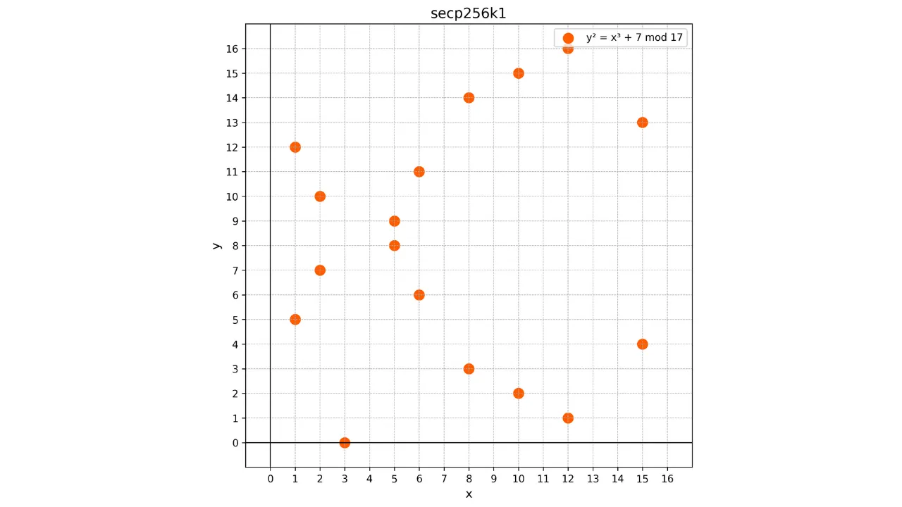

В этом примере я намеренно ограничил конечное поле $p = 17$ в образовательных целях, но нужно представлять, что используемое в Bitcoin намного больше, почти $2^{256}$.

Мы используем конечное поле целых чисел по модулю $p$, чтобы обеспечить точность операций на кривой. Действительно, эллиптические кривые над полем действительных чисел подвержены неточностям из-за ошибок округления во время вычислительных расчетов. Если выполняется множество операций на кривой, эти ошибки накапливаются, и конечный результат может быть неверным или трудно воспроизводимым. Исключительное использование положительных целых чисел обеспечивает идеальную точность расчетов и, таким образом, воспроизводимость результата.

Математика эллиптических кривых над конечными полями аналогична той, что над полем действительных чисел, с адаптацией, что все операции выполняются по модулю $p$. Для упрощения объяснений мы будем продолжать в следующих главах иллюстрировать концепции, используя кривую, определенную над действительными числами, имея в виду, что на практике кривая определена над конечным полем.

Если вы хотите узнать больше о математических основах современной криптографии, я также рекомендую проконсультироваться с этим другим курсом на Plan B Network:

https://planb.network/courses/cyp302

## Вычисление публичного ключа из приватного ключа

<chapterId>fcb2bd58-5dda-5ecf-bb8f-ad1a0561ab4a</chapterId>
Как было показано ранее, алгоритмы цифровой подписи в Bitcoin основаны на паре приватного и публичного ключей, которые математически связаны. Давайте вместе исследуем, в чем состоит эта математическая связь и как они генерируются.

### Приватный ключ

Приватный ключ - это просто случайное или псевдослучайное число. В случае с Bitcoin, это число имеет размер 256 бит. Таким образом, теоретическое количество возможностей для приватного ключа Bitcoin составляет $2^{256}$.
**Примечание**: "Псевдослучайное число" - это число, которое обладает свойствами, близкими к свойствам действительно случайного числа, но генерируется детерминированным алгоритмом.
Однако на практике на нашей эллиптической кривой secp256k1 существует только $n$ различных точек, где $n$ - порядок генераторной точки $G$ кривой. Мы увидим позже, чему соответствует это число, но просто запомните, что действительный приватный ключ - это целое число между $1$ и $n-1$, учитывая, что $n$ - это число, близкое к, но немного меньшее, чем $2^{256}$. Следовательно, существуют некоторые 256-битные числа, которые не являются допустимыми для использования в качестве приватного ключа в Bitcoin, а именно, все числа между $n$ и $2^{256}$. Если генерация случайного числа (приватного ключа) дает значение $k$ такое, что $k \geq n$, оно считается недействительным, и должно быть сгенерировано новое случайное значение.

Таким образом, количество возможностей для приватного ключа Bitcoin составляет примерно $n$, что является числом, близким к $1.158 \times 10^{77}$. Это число настолько велико, что если вы выберете приватный ключ случайным образом, статистически почти невозможно получить приватный ключ другого пользователя. Чтобы дать вам представление о масштабе, количество возможных приватных ключей в Bitcoin приблизительно равно количеству оценочных атомов в наблюдаемой вселенной.

Как мы увидим в следующих главах, сегодня большинство приватных ключей, используемых в Bitcoin, не генерируются случайным образом, а являются результатом детерминированного вывода из мнемонической фразы, самой по себе псевдослучайной (это знаменитая фраза из 12 или 24 слов). Эта информация ничего не меняет в использовании алгоритмов подписи, таких как ECDSA, но помогает сфокусировать наше популяризирование на Bitcoin.

Для продолжения объяснения приватный ключ будет обозначаться строчной буквой $k$.

### Публичный ключ

Публичный ключ - это точка на эллиптической кривой, обозначаемая заглавной буквой $K$, и вычисляется из приватного ключа $k$. Эта точка $K$ представлена парой координат $(x, y)$ на эллиптической кривой, каждая координата является целым числом по модулю $p$, простым числом, определяющим конечное поле $\mathbb{F}_p$.
На практике несжатый публичный ключ представлен 512 битами (или 64 байтами), соответствующими двум 256-битным числам ($x$ и $y$), расположенным друг за другом. Эти числа - абсцисса ($x$) и ордината ($y$) нашей точки на secp256k1. Если добавить префикс, публичный ключ в сумме составляет 520 бит.

Однако также возможно представить публичный ключ в сжатой форме, используя только 33 байта (264 бита), сохраняя только абсциссу $x$ нашей точки на кривой и байт, указывающий четность $y$. Это то, что известно как сжатый публичный ключ. Я расскажу об этом подробнее в последних главах этого обучения. Но что вам нужно запомнить, так это то, что публичный ключ $K$ - это точка, описываемая $x$ и $y$.

Для вычисления точки $K$, соответствующей нашему публичному ключу, мы используем операцию скалярного умножения на эллиптических кривых, определенную как повторное сложение ($k$ раз) генераторной точки $G$:

$$
K = k \cdot G
$$

где:

- $k$ - приватный ключ (случайное целое число между $1$ и $n-1$);
- $G$ является генерирующей точкой эллиптической кривой, используемой всеми участниками сети Bitcoin; - $\cdot$ представляет скалярное умножение на эллиптической кривой, что эквивалентно добавлению точки $G$ к самой себе $k$ раз.

Тот факт, что эта точка $G$ общая для всех публичных ключей в Bitcoin, позволяет нам быть уверенными, что один и тот же приватный ключ $k$ всегда даст нам один и тот же публичный ключ $K$:

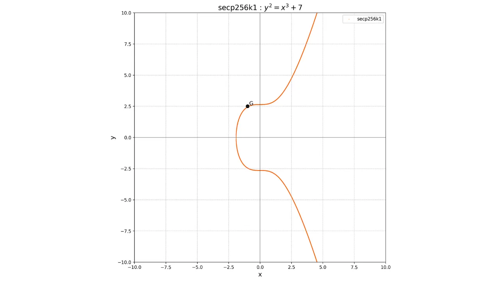

Основная характеристика этой операции заключается в том, что она является односторонней функцией. Легко вычислить публичный ключ $K$, зная приватный ключ $k$ и генерирующую точку $G$, но практически невозможно вычислить приватный ключ $k$, зная только публичный ключ $K$ и генерирующую точку $G$. Нахождение $k$ из $K$ и $G$ сводится к решению задачи дискретного логарифмирования на эллиптических кривых, математически сложной задаче, для которой не известен эффективный алгоритм. Даже самые мощные современные калькуляторы не способны решить эту задачу за разумное время.

### Сложение и удвоение точек на эллиптических кривых

Концепция сложения на эллиптических кривых определяется геометрически. Если у нас есть две точки $P$ и $Q$ на кривой, операция $P + Q$ вычисляется путем проведения линии, проходящей через $P$ и $Q$. Эта линия обязательно пересечет кривую в третьей точке $R'$. Затем мы берем зеркальное отображение этой точки относительно оси x, чтобы получить точку $R$, которая является результатом сложения:

$$
P + Q = R
$$

Графически это можно представить следующим образом:

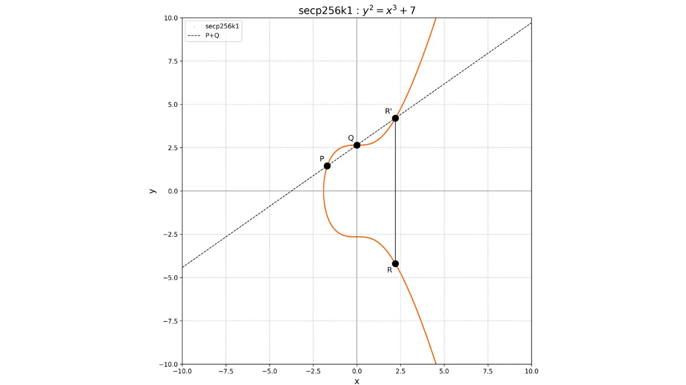

Для удвоения точки, то есть операции $P + P$, мы проводим касательную к кривой в точке $P$. Эта касательная пересекает кривую в другой точке $S'$. Затем мы берем зеркальное отображение этой точки относительно оси x, чтобы получить точку $S$, которая является результатом удвоения:

$$
2P = S
$$

Графически это показано как:

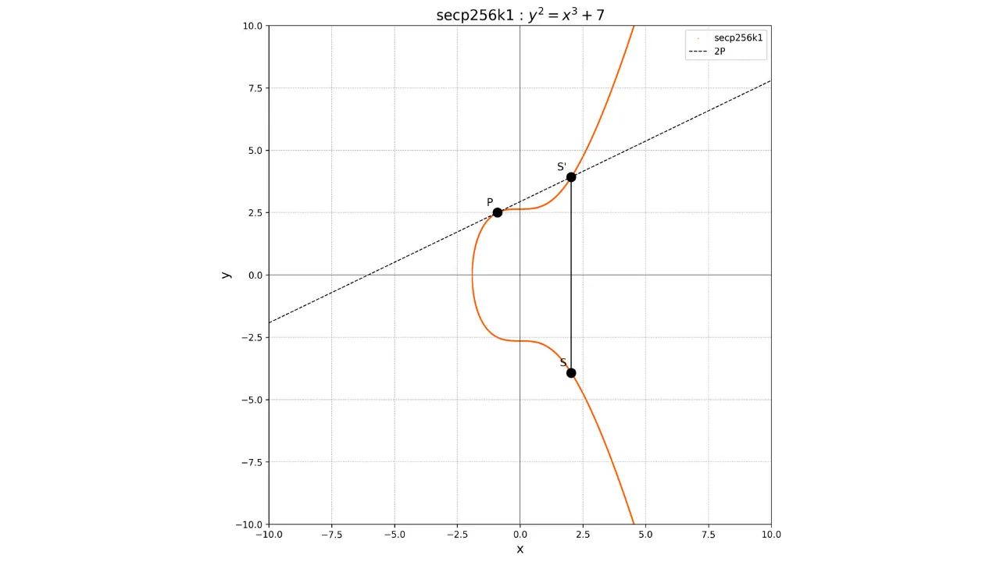

Используя эти операции сложения и удвоения, мы можем выполнить скалярное умножение точки на целое число $k$, обозначаемое как $kP$, выполняя повторные удвоения и сложения.

Например, предположим, что мы выбрали приватный ключ $k = 4$. Чтобы вычислить ассоциированный публичный ключ, мы выполняем:

$$
K = k \cdot G = 4G
$$

Графически это соответствует выполнению серии сложений и удвоений:

- Вычислите $2G$, удвоив $G$.
- Вычислите $4G$, удвоив $2G$.


Если мы хотим, например, вычислить точку $3G$, сначала мы должны вычислить точку $2G$, удвоив точку $G$, затем добавить $G$ и $2G$. Чтобы добавить $G$ и $2G$, просто проведите линию, соединяющую эти две точки, извлеките уникальную точку $-3G$ на пересечении этой линии и эллиптической кривой, а затем определите $3G$ как противоположность $-3G$.

У нас будет:

$$
G + G = 2G
$$

$$
2G + G = 3G
$$

Графически это будет представлено следующим образом:
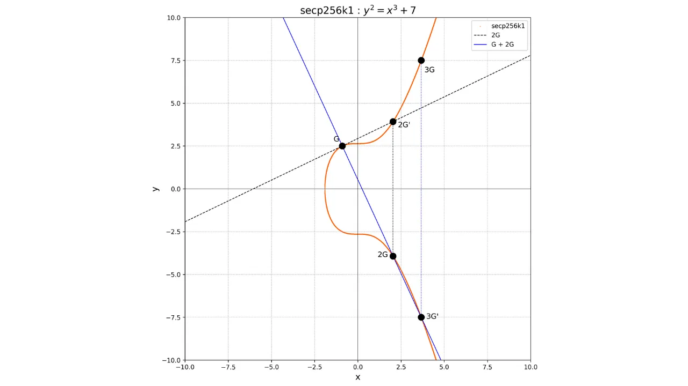

### Однонаправленная Функция

Благодаря этим операциям мы можем понять, почему легко получить публичный ключ из приватного ключа, но обратный процесс практически невозможен.

Давайте вернемся к нашему упрощенному примеру. Имея приватный ключ $k = 4$. Чтобы вычислить соответствующий публичный ключ, мы выполняем:
K = k \cdot G = 4G$$

Таким образом, мы смогли легко вычислить публичный ключ $K$, зная $k$ и $G$.

Теперь, если кто-то знает только публичный ключ $K$, он сталкивается с проблемой дискретного логарифма: найти $k$ такое, что $K = k \cdot G$. Эта проблема считается сложной, потому что нет эффективного алгоритма для ее решения на эллиптических кривых. Это обеспечивает безопасность алгоритмов ECDSA и Schnorr.

Конечно, в этом упрощенном примере с $k = 4$, было бы возможно найти $k$ методом проб и ошибок, так как количество возможностей невелико. Однако на практике в Bitcoin $k$ является 256-битным целым числом, что делает количество возможностей астрономически большим (примерно $1.158 \times 10^{77}$). Поэтому невозможно найти $k$ методом грубой силы.

## Подписание Приватным Ключом

<chapterId>bb07826f-826e-5905-b307-3d82001fb778</chapterId>

Теперь, когда вы знаете, как получить публичный ключ из приватного ключа, вы уже можете получать биткоины, используя эту пару ключей в качестве условия для расходования. Но как их потратить? Чтобы потратить биткоины, вам нужно разблокировать _scriptPubKey_, прикрепленный к вашему UTXO, чтобы доказать, что вы действительно его законный владелец. Для этого вы должны произвести подпись $s$, соответствующую публичному ключу $K$, присутствующему в _scriptPubKey_, используя приватный ключ $k$, который изначально использовался для вычисления $K$. Таким образом, цифровая подпись является неопровержимым доказательством того, что вы владеете приватным ключом, ассоциированным с заявленным публичным ключом.

### Параметры Эллиптической Кривой

Для выполнения цифровой подписи все участники должны сначала договориться о параметрах используемой эллиптической кривой. В случае с Bitcoin параметры **secp256k1** следующие:

Конечное поле $\mathbb{Z}_p$ определяется как:

$$
p = 2^{256} - 2^{32} - 977
$$

```text
p = 0xFFFFFFFFFFFFFFFFFFFFFFFFFFFFFFFFFFFFFFFFFFFFFFFFFFFFFFFEFFFFFC2F
```

$p$ является очень большим простым числом, немного меньшим $2^{256}$.

Эллиптическая кривая $y^2 = x^3 + ax + b$ над $\mathbb{Z}_p$ определяется как:

$$
a = 0, \quad b = 7
$$

Точка-генератор или начальная точка $G$:

```text
G = 0x0279BE667EF9DCBBAC55A06295CE870B07029BFCDB2DCE28D959F2815B16F81798
```

Это число является сжатой формой, которая дает только абсциссу точки $G$. Префикс `02` в начале определяет, какое из двух значений с этой абсциссой $x$ должно использоваться в качестве генерирующей точки.
Порядок $n$ точки $G$ (количество существующих точек) и кофактор $h$:

```text
n = 0xFFFFFFFFFFFFFFFFFFFFFFFFFFFFFFFEBAAEDCE6AF48A03BBFD25E8CD0364141
```

$n$ - это очень большое число, немного меньшее, чем $p$.

$$
h=1
$$

$h$ - это кофактор или количество подгрупп. Я не буду подробно останавливаться на том, что это представляет, поскольку это довольно сложно, и в случае с Bitcoin, нам не нужно это учитывать, так как он равен $1$.

Вся эта информация является общедоступной и известной всем участникам. Благодаря этому пользователи могут создавать цифровую подпись и проверять её.

### Подпись с использованием ECDSA

Алгоритм ECDSA позволяет пользователю подписать сообщение с использованием своего личного ключа таким образом, что любой, кто знает соответствующий публичный ключ, может проверить действительность подписи, без раскрытия личного ключа. В контексте Bitcoin, сообщение, которое нужно подписать, зависит от выбранного пользователем _sighash_. Именно _sighash_ определяет, какие части транзакции покрываются подписью. Об этом я расскажу подробнее в следующей главе.

Вот шаги для создания подписи ECDSA:

Сначала мы вычисляем хеш ($e$) сообщения, которое нужно подписать. Сообщение $m$ таким образом проходит через криптографическую хеш-функцию, обычно SHA256 или двойной SHA256 в случае с Bitcoin:

$$
e = \text{HASH}(m)
$$

Далее, мы вычисляем nonce. В криптографии nonce - это просто число, генерируемое случайным или псевдослучайным образом, которое используется только один раз. То есть, каждый раз, когда создается новая цифровая подпись с этой парой ключей, очень важно использовать другой nonce, иначе это может поставить под угрозу безопасность личного ключа. Поэтому достаточно определить случайное и уникальное целое число $r$ так, чтобы $1 \leq r \leq n-1$, где $n$ - порядок генерирующей точки $G$ эллиптической кривой.

Затем мы вычисляем точку $R$ на эллиптической кривой с координатами $(x_R, y_R)$ так, что:

$$
R = r \cdot G
$$

Мы извлекаем значение абсциссы точки $R$ ($x_R$). Это значение представляет первую часть подписи. И, наконец, мы вычисляем вторую часть подписи $s$ следующим образом:

$$
s = r^{-1} \left( e + k \cdot x_R \right) \mod n
$$

где:

- $r^{-1}$ - это модульный обратный к $r$ по модулю $n$, то есть целое число такое, что $r \cdot r^{-1} \equiv 1 \mod n$;
- $k$ - личный ключ пользователя;
- $e$ - хеш сообщения;
- $n$ - порядок генерирующей точки $G$ эллиптической кривой.

Подпись затем просто является конкатенацией $x_R$ и $s$:

$$
\text{SIG} = x_R \Vert s
$$

### Проверка подписи ECDSA

Для проверки подписи $(x_R, s)$ любой, кто знает публичный ключ $K$ и параметры эллиптической кривой, может поступить следующим образом:
Сначала проверьте, что $x_R$ и $s$ находятся в интервале $[1, n-1]$. Это гарантирует, что подпись соответствует математическим ограничениям эллиптической группы. Если это не так, верификатор немедленно отклоняет подпись как недействительную.
Затем вычислите хеш сообщения:

$$
e = \text{HASH}(m)
$$

Вычислите модульный обратный к $s$ по модулю $n$:

$$
s^{-1} \mod n
$$

Вычислите два скалярных значения $u_1$ и $u_2$ следующим образом:

$$
\begin{align*}
u_1 &= e \cdot s^{-1} \mod n \\
u_2 &= x_R \cdot s^{-1} \mod n
\end{align*}
$$

И, наконец, вычислите точку $V$ на эллиптической кривой так, чтобы:

$$
V = u_1 \cdot G + u_2 \cdot K
$$

Подпись является действительной только если $x_V \equiv x_R \mod n$, где $x_V$ — это $x$-координата точки $V$. Действительно, объединяя $u_1 \cdot G$ и $u_2 \cdot K$, получается точка $V$, которая, если подпись действительна, должна соответствовать точке $R$, использованной во время подписи (по модулю $n$).

### Подпись с использованием протокола Шнорра

Схема подписи Шнорра является альтернативой ECDSA и предлагает множество преимуществ. Ее использование на Bitcoin стало возможным с 2021 года и введением Taproot с шаблонами скриптов P2TR. Как и ECDSA, схема Шнорра позволяет подписывать сообщение с использованием закрытого ключа таким образом, что подпись может быть проверена любым, кто знает соответствующий открытый ключ.
В случае с Шнорром используется точно такая же кривая, как и в ECDSA, с теми же параметрами. Однако открытые ключи представлены немного иначе по сравнению с ECDSA. Действительно, они обозначаются только $x$-координатой точки на эллиптической кривой. В отличие от ECDSA, где сжатые открытые ключи представлены 33 байтами (с байтом префикса, указывающим четность $y$), Шнорр использует 32-байтовые открытые ключи, соответствующие только $x$-координате точки $K$, и предполагается, что $y$ по умолчанию четное. Это упрощенное представление уменьшает размер подписей и облегчает определенные оптимизации в алгоритмах верификации.
Открытый ключ тогда является $x$-координатой точки $K$:

$$
\text{pk} = K_x
$$

Первый шаг для генерации подписи - хеширование сообщения. Но в отличие от ECDSA, это делается с другими значениями, и используется маркированная хеш-функция, чтобы избежать коллизий в разных контекстах. Маркированная хеш-функция просто включает добавление произвольной метки к входным данным хеш-функции наряду с данными сообщения.

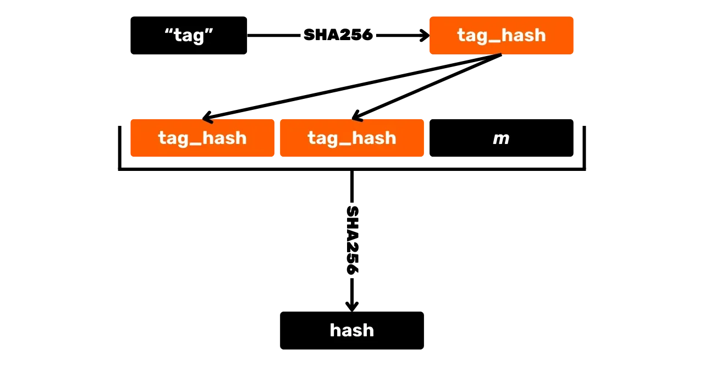

Помимо сообщения, в маркированную функцию также передаются $x$-координата открытого ключа $K_x$, а также точка $R$, вычисленная из nonce $r$ ($R=r \cdot G$), который сам является уникальным целым числом для каждой подписи, вычисляемым детерминированно из закрытого ключа и сообщения, чтобы избежать уязвимостей, связанных с повторным использованием nonce. Как и для открытого ключа, для описания точки сохраняется только $x$-координата точки nonce $R_x$.

Результат этого хеширования, обозначенный $e$, называется "вызовом":

$$
e = \text{HASH}(\text{``BIP0340/challenge''}, R_x \Vert K_x \Vert m) \mod n
$$

Здесь $\text{HASH}$ - это хеш-функция SHA256, а $\text{``BIP0340/challenge''}$ - это специфический тег для хеширования.

Наконец, параметр $s$ рассчитывается следующим образом из приватного ключа $k$, nonce $r$ и вызова $e$:

$$
s = (r + e \cdot k) \mod n
$$

Тогда подпись просто является парой $Rx$ и $s$.

$$
\text{SIG} = R_x \Vert s
$$

### Проверка подписи Шнорра

Проверка подписи Шнорра проще, чем проверка подписи ECDSA. Вот шаги для проверки подписи $(R_x, s)$ с использованием публичного ключа $K_x$ и сообщения $m$:
Сначала мы проверяем, что $K_x$ является действительным целым числом и меньше $p$. Если это так, мы извлекаем соответствующую точку на кривой, при этом $K_y$ является четным. Также мы извлекаем $R_x$ и $s$, разделяя подпись $\text{SIG}$. Затем мы проверяем, что $R_x < p$ и $s < n$ (порядок кривой).
Далее, мы рассчитываем вызов $e$ таким же образом, как и источник подписи:

$$
e = \text{HASH}(\text{``BIP0340/challenge''}, R_x \Vert K_x \Vert m) \mod n
$$

Затем мы рассчитываем опорную точку на кривой следующим образом:

$$
R' = s \cdot G - e \cdot K
$$

Наконец, мы проверяем, что $R'_x = R_x$. Если две координаты x совпадают, то подпись $(R_x, s)$ действительно является валидной с публичным ключом $K_x$.

### Почему это работает?

Подписывающий рассчитал $s = r + e \cdot k \mod n$, так что $R' = s \cdot G - e \cdot K$ должен быть равен исходной точке $R$, потому что:

$$
s \cdot G = (r + e \cdot k) \cdot G = r \cdot G + e \cdot k \cdot G
$$

Поскольку $K = k \cdot G$, у нас есть $e \cdot k \cdot G = e \cdot K$. Таким образом:

$$
R' = r \cdot G = R
$$

Следовательно, у нас есть:

$$
R'_x = R_x
$$

### Преимущества подписей Шнорра

Схема подписи Шнорра предлагает несколько преимуществ для Bitcoin по сравнению с оригинальным алгоритмом ECDSA. Во-первых, Шнорр позволяет агрегировать ключи и подписи. Это означает, что несколько публичных ключей могут быть объединены в один ключ.

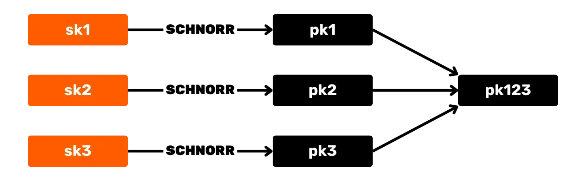

Аналогично, несколько подписей могут быть агрегированы в одну действительную подпись. Таким образом, в случае мультиподписной транзакции, набор участников может подписать одной подписью и одним агрегированным публичным ключом. Это значительно снижает затраты на хранение и вычисления для сети, поскольку каждому узлу нужно проверять только одну подпись.

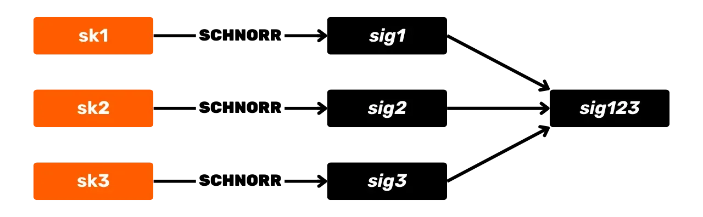

Более того, агрегация подписей улучшает конфиденциальность. С Шнорром становится невозможным отличить мультиподписную транзакцию от стандартной транзакции с одной подписью. Эта однородность затрудняет анализ цепочки, поскольку ограничивает возможность идентификации отпечатков кошельков.
Наконец, Schnorr также предлагает возможность пакетной проверки. Проверяя несколько подписей одновременно, узлы могут повысить эффективность, особенно для блоков, содержащих множество транзакций. Эта оптимизация сокращает время и ресурсы, необходимые для валидации блока. Кроме того, подписи Schnorr не являются изменяемыми, в отличие от подписей, созданных с использованием ECDSA. Это означает, что атакующий не может изменить действительную подпись, чтобы создать другую действительную подпись для того же сообщения и того же публичного ключа. Эта уязвимость ранее присутствовала в Bitcoin и заметно препятствовала безопасной реализации Lightning Network. Эта проблема была решена для ECDSA с помощью мягкого форка SegWit в 2017 году, который предполагает перемещение подписей в отдельную базу данных от транзакций, чтобы предотвратить их изменяемость.

### Почему Сатоши выбрал ECDSA?

Как мы видели, Сатоши изначально выбрал реализацию ECDSA для цифровых подписей в Bitcoin. Тем не менее, мы также видели, что Schnorr превосходит ECDSA во многих аспектах, и этот протокол был создан Клаусом-Петером Шнорром в 1989 году, за 20 лет до изобретения Bitcoin.

Ну, мы действительно не знаем, почему Сатоши не выбрал его, но вероятная гипотеза заключается в том, что этот протокол был запатентован до 2008 года. Хотя Bitcoin был создан годом позже, в январе 2009 года, в то время не было доступно открытой стандартизации для подписей Schnorr. Возможно, Сатоши посчитал безопаснее использовать ECDSA, который уже широко использовался и был протестирован в открытом программном обеспечении и имел несколько признанных реализаций (особенно библиотеку OpenSSL, использовавшуюся до 2015 года в Bitcoin Core, затем замененную на libsecp256k1 в версии 0.10.0). Или, возможно, он просто не знал, что этот патент истечет в 2008 году. В любом случае, наиболее вероятная гипотеза, по-видимому, связана с этим патентом и тем фактом, что ECDSA имела доказанную историю и была легче в реализации.

## Флаги sighash

<chapterId>231c41a2-aff2-4655-9048-47b6d2d83d64</chapterId>

Как мы видели в предыдущих главах, цифровые подписи часто используются для разблокировки скрипта входа. В процессе подписания необходимо включить подписанные данные в расчет, обозначенные в наших примерах как сообщение $m$. Эти данные, после подписания, не могут быть изменены без признания подписи недействительной. Действительно, как для ECDSA, так и для Schnorr, проверяющий подпись должен включить в свой расчет то же сообщение $m$. Если оно отличается от сообщения $m$, изначально использованного подписантом, результат будет неверным, и подпись будет признана недействительной. Тогда говорят, что подпись охватывает определенные данные и защищает их, в некотором роде, от несанкционированных изменений.

### Что такое флаг sighash?

В конкретном случае Bitcoin мы видели, что сообщение $m$ соответствует транзакции. Однако, на самом деле, это немного сложнее. Действительно, благодаря флагам sighash, можно выбрать конкретные данные внутри транзакции, которые будут или не будут покрыты подписью.
Таким образом, "флаг sighash" - это параметр, добавляемый к каждому входу, позволяющий определить компоненты транзакции, которые покрываются соответствующей подписью. Эти компоненты - это входы и выходы. Выбор флага sighash таким образом определяет, какие входы и выходы транзакции фиксируются подписью, а какие могут быть изменены без ее аннулирования. Этот механизм позволяет подписям фиксировать данные транзакции в соответствии с намерениями подписанта.
Очевидно, что как только транзакция подтверждается в блокчейне, она становится неизменяемой, независимо от использованных флагов sighash. Возможность модификации с помощью флагов sighash ограничена периодом между подписанием и подтверждением.
В целом, программное обеспечение для кошельков не предлагает вам возможность вручную изменять флаг sighash ваших входов при создании транзакции. По умолчанию устанавливается `SIGHASH_ALL`. Лично я знаю только о Sparrow Wallet, который позволяет эту модификацию через пользовательский интерфейс.

### Какие существуют флаги sighash в Bitcoin?

В Bitcoin, прежде всего, существуют 3 основных флага sighash:

- `SIGHASH_ALL` (`0x01`): Подпись применяется ко всем входам и всем выходам транзакции. Таким образом, транзакция полностью покрывается подписью и не может быть изменена. `SIGHASH_ALL` является наиболее часто используемым флагом sighash в повседневных транзакциях, когда кто-то просто хочет совершить транзакцию, не допуская ее изменения.

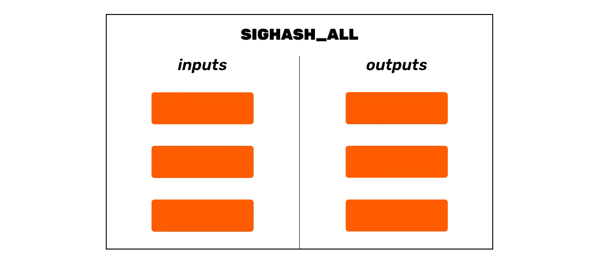

На всех диаграммах этой главы оранжевый цвет представляет элементы, покрытые подписью, в то время как черный цвет указывает на те, которые не покрыты.

- `SIGHASH_NONE` (`0x02`): Подпись покрывает все входы, но ни один из выходов, таким образом позволяя изменение выходов после подписи. Конкретно это похоже на бланковый чек. Подписывающий разблокирует UTXO на входах, но оставляет поле выходов полностью модифицируемым. Любой, кто знает эту транзакцию, может таким образом добавить выход по своему выбору, например, указав адрес получения для сбора средств, потраченных на входы, а затем транслировать транзакцию для восстановления биткоинов. Подпись владельца входов не будет аннулирована, так как она покрывает только входы.


- `SIGHASH_SINGLE` (`0x03`): Подпись покрывает все входы, а также один выход, соответствующий индексу подписанного входа. Например, если подпись разблокирует _scriptPubKey_ входа №0, то она также покрывает выход №0. Подпись также защищает все другие входы, которые больше не могут быть изменены. Однако любой может добавить дополнительный выход, не аннулируя подпись, при условии, что выход №0, который является единственным, покрытым ею, не изменен.
  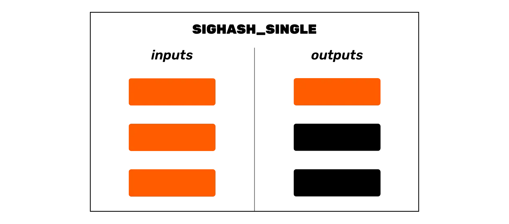

В дополнение к этим трем флагам sighash, существует также модификатор `SIGHASH_ANYONECANPAY` (`0x80`). Этот модификатор может быть объединен с базовым флагом sighash для создания трех новых флагов sighash:

- `SIGHASH_ALL | SIGHASH_ANYONECANPAY` (`0x81`): Подпись покрывает один вход, включая все выходы транзакции. Этот комбинированный флаг sighash позволяет, например, создание транзакции для краудфандинга. Организатор подготавливает выход с их адресом и целевой суммой, и каждый инвестор может затем добавить входы для финансирования этого выхода. Как только в входах собрано достаточно средств для удовлетворения выхода, транзакция может быть транслирована.

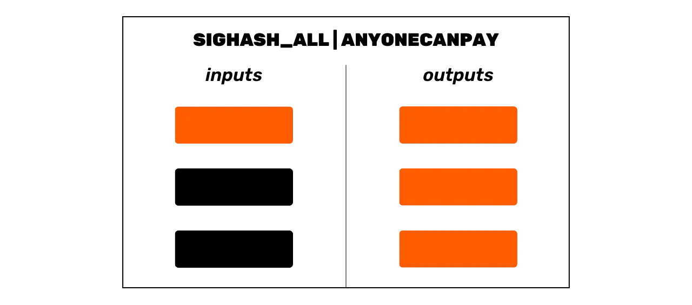

- `SIGHASH_NONE | SIGHASH_ANYONECANPAY` (`0x82`): Подпись покрывает один вход, не обязываясь ни к какому выходу;


- `SIGHASH_SINGLE | SIGHASH_ANYONECANPAY` (`0x83`): Подпись охватывает один вход, а также выход с тем же индексом, что и этот вход. Например, если подпись разблокирует _scriptPubKey_ входа №3, она также будет охватывать выход №3. Остальная часть транзакции остается модифицируемой, как в отношении других входов, так и других выходов.
  

### Проекты по добавлению новых флагов Sighash

На данный момент (2024 год), на Bitcoin можно использовать только флаги sighash, представленные в предыдущем разделе. Однако некоторые проекты рассматривают возможность добавления новых флагов sighash. Например, BIP118, предложенный Кристианом Декером и Энтони Таунсом, вводит два новых флага sighash: `SIGHASH_ANYPREVOUT` и `SIGHASH_ANYPREVOUTANYSCRIPT` (_AnyPrevOut = "Любой предыдущий выход"_).

Эти два флага sighash предложили бы дополнительную возможность на Bitcoin: создание подписей, которые не охватывают никакой конкретный вход транзакции.


Эта идея была изначально сформулирована Джозефом Пуном и Таддеусом Драйджой в Белой книге по Lightning Network. До переименования этот флаг sighash назывался `SIGHASH_NOINPUT`.
Если этот флаг sighash будет интегрирован в Bitcoin, он позволит использовать ковенанты, но также является обязательным предварительным условием для реализации Eltoo, общего протокола для вторых слоев, который определяет, как совместно управлять владением UTXO. Eltoo был специально разработан для решения проблем, связанных с механизмами согласования состояния каналов Lightning, то есть между открытием и закрытием.

Чтобы углубить свои знания о Lightning Network, после курса CYP201, я настоятельно рекомендую курс LNP201 от Фаниса Михалакиса, который подробно охватывает эту тему:

https://planb.network/courses/lnp201

В следующей части предлагаю узнать, как работает мнемоническая фраза, лежащая в основе вашего Bitcoin кошелька.

# Мнемоническая фраза

<partId>4070af16-c8a2-58b5-9871-a22c86c07458</partId>

## Эволюция Bitcoin кошельков

<chapterId>9d9acd5d-a0e5-5dfd-b544-f043fae8840f</chapterId>

Теперь, когда мы изучили принципы работы хеш-функций и цифровых подписей, мы можем изучить, как функционируют Bitcoin кошельки. Целью будет представить, как устроен кошелек на Bitcoin, как он декомпозируется и для чего используются различные составляющие его информации. Это понимание механизмов кошелька позволит вам улучшить использование Bitcoin с точки зрения безопасности и конфиденциальности.

Перед тем как погрузиться в технические детали, важно уточнить, что подразумевается под "Bitcoin кошельком" и понять его полезность.

### Что такое Bitcoin кошелек?

В отличие от традиционных кошельков, которые позволяют хранить физические купюры и монеты, Bitcoin кошелек как таковой не "содержит" биткоины. Действительно, биткоины не существуют в физической или цифровой форме, которую можно было бы хранить, но представлены в системе в виде **UTXO** (_Unspent Transaction Output_ - Непотраченный выход транзакции).
UTXO таким образом представляют собой фрагменты биткойнов различного размера, которые могут быть потрачены, при условии что их _scriptPubKey_ удовлетворен. Чтобы потратить свои биткойны, пользователь должен предоставить _scriptSig_, который разблокирует _scriptPubKey_, ассоциированный с его UTXO. Это доказательство обычно осуществляется через цифровую подпись, сгенерированную из приватного ключа, соответствующего публичному ключу, присутствующему в _scriptPubKey_. Таким образом, критически важным элементом, который пользователь должен защитить, является приватный ключ. Роль биткойн-кошелька заключается именно в безопасном управлении этими приватными ключами. На самом деле, его роль больше похожа на роль связки ключей, чем на кошелек в традиционном понимании.

### JBOK Кошельки (_Просто Куча Ключей_)

Первые кошельки, использованные в Биткойне, были JBOK (_Просто Куча Ключей_) кошельками, которые группировали вместе приватные ключи, сгенерированные независимо и без какой-либо связи между ними. Эти кошельки работали на простой модели, где каждый приватный ключ мог разблокировать уникальный адрес для получения Биткойнов.

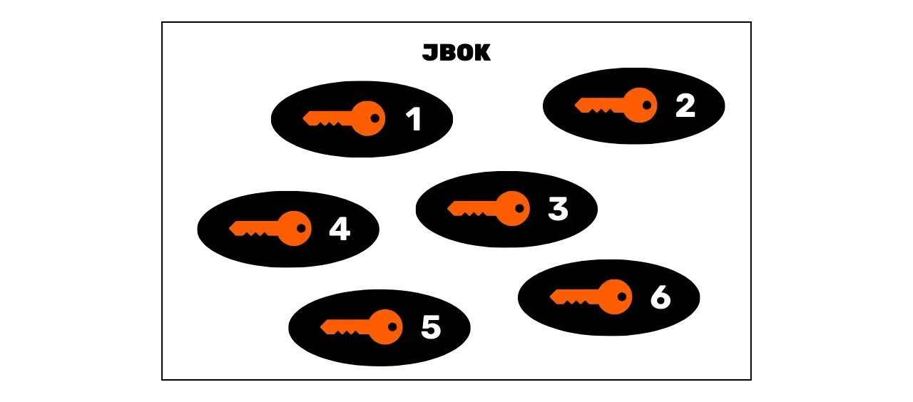

Если кто-то хотел использовать несколько приватных ключей, то ему необходимо было сделать столько же резервных копий, чтобы обеспечить доступ к средствам в случае проблем с устройством, на котором хранится кошелек. Если использовать один приватный ключ, такая структура кошелька может быть достаточной, поскольку достаточно одной резервной копии. Однако, это создает проблему: в Биткойне настоятельно не рекомендуется всегда использовать один и тот же приватный ключ. Действительно, приватный ключ ассоциируется с уникальным адресом, и адреса для получения Биткойнов обычно предназначены для однократного использования. Каждый раз, когда вы получаете средства, вы должны генерировать новый пустой адрес.

Это ограничение проистекает из модели конфиденциальности Биткойна. Повторное использование того же адреса упрощает внешним наблюдателям отслеживание всех моих транзакций в Биткойне. Вот почему настоятельно не рекомендуется повторно использовать адрес для получения. Однако, для того чтобы иметь несколько адресов и публично разделять наши транзакции, необходимо управлять несколькими приватными ключами. В случае с JBOK кошельками это подразумевает создание стольких резервных копий, сколько новых пар ключей, задача, которая может быстро стать сложной и трудной для поддержания пользователями.

Чтобы узнать больше о модели конфиденциальности Биткойна и открыть методы защиты вашей конфиденциальности, я также рекомендую пройти мой курс BTC204 на Plan B Network:

https://planb.network/courses/btc204

### HD Кошельки (_Иерархически Детерминированные_)

Чтобы преодолеть ограничение JBOK кошельков, впоследствии была использована новая структура кошелька. В 2012 году Питер Вилле представил улучшение с BIP32, которое вводит иерархически детерминированные кошельки. Принцип HD кошелька заключается в том, чтобы выводить все приватные ключи из единственного источника информации, называемого семенем, детерминированным и иерархическим образом. Это семя генерируется случайным образом при создании кошелька и составляет уникальную резервную копию, которая позволяет воссоздать все приватные ключи кошелька. Таким образом, пользователь может генерировать очень большое количество приватных ключей, чтобы избежать повторного использования адресов и сохранить свою конфиденциальность, при этом нуждаясь только в одной резервной копии своего кошелька через семя.
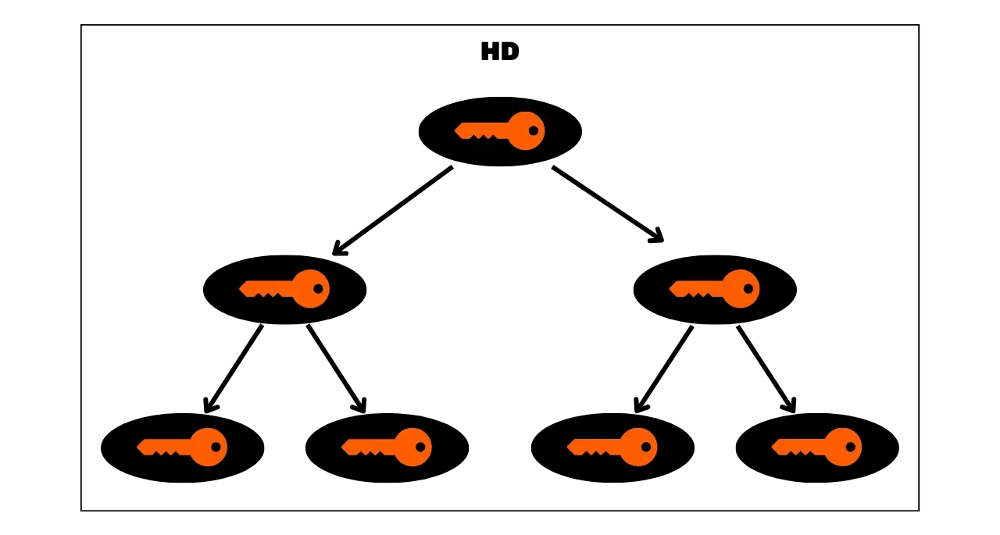

В HD кошельках производная ключей выполняется в соответствии с иерархической структурой, которая позволяет организовывать ключи в подпространства производных, каждое из которых может быть далее подразделено, чтобы облегчить управление средствами и взаимодействие между различным программным обеспечением для кошельков. На сегодняшний день этот стандарт принят большинством пользователей Биткойна. По этой причине мы рассмотрим его подробно в следующих главах.

### Стандарт BIP39: Мнемоническая Фраза

В дополнение к BIP32, BIP39 стандартизирует формат сида в виде мнемонической фразы, чтобы облегчить его резервное копирование и чтение пользователями. Мнемоническая фраза, также называемая фразой восстановления или 24-словной фразой, представляет собой последовательность слов, взятых из предопределенного списка, которая безопасно кодирует сид кошелька.

Мнемоническая фраза значительно упрощает процесс резервного копирования для пользователя. В случае потери, повреждения или кражи устройства, на котором хранится кошелек, достаточно знать эту мнемоническую фразу, чтобы воссоздать кошелек и восстановить доступ ко всем средствам, защищенным им.

В следующих главах мы исследуем внутреннее устройство HD-кошельков, включая механизмы производства ключей и различные возможные иерархические структуры. Это позволит вам лучше понять криптографические основы, на которых базируется безопасность средств в Bitcoin. И для начала, в следующей главе, предлагаю нам изучить роль энтропии в основе вашего кошелька.

## Энтропия и Псевдослучайное Число

<chapterId>b43c715d-affb-56d8-a697-ad5bc2fffd63</chapterId>
Современные HD-кошельки (детерминированные и иерархические) опираются на единственный начальный элемент информации, называемый "энтропией", для детерминированной генерации всего набора ключей кошелька. Эта энтропия представляет собой псевдослучайное число, уровень хаоса которого частично определяет безопасность кошелька.

### Определение Энтропии

Энтропия, в контексте криптографии и информации, является количественной мерой неопределенности или непредсказуемости, связанной с источником данных или случайным процессом. Она играет важную роль в безопасности криптографических систем, особенно в генерации ключей и случайных чисел. Высокая энтропия обеспечивает, что сгенерированные ключи достаточно непредсказуемы и устойчивы к атакам полным перебором, когда атакующий пробует все возможные комбинации, чтобы угадать ключ.

В контексте Bitcoin, энтропия используется для генерации сида. При создании детерминированного и иерархического кошелька, конструкция мнемонической фразы выполняется из случайного числа, полученного из источника энтропии. Затем фраза используется для генерации множества приватных ключей детерминированным и иерархическим способом, для создания условий расходования UTXO.

### Методы Генерации Энтропии

Исходная энтропия, используемая для HD-кошелька, обычно составляет 128 бит или 256 бит, где:

- **128 бит энтропии** соответствуют мнемонической фразе из **12 слов**;
- **256 бит энтропии** соответствуют мнемонической фразе из **24 слов**.

В большинстве случаев это случайное число генерируется автоматически программным обеспечением кошелька с использованием PRNG (_Pseudo-Random Number Generator_ - Псевдослучайный Генератор Чисел). PRNG - это категория алгоритмов, используемых для генерации последовательностей чисел из начального состояния, которые имеют характеристики, приближающиеся к случайному числу, но на самом деле таковым не являются. Хороший PRNG должен обладать такими свойствами, как равномерность вывода, непредсказуемость и устойчивость к предсказательным атакам. В отличие от генераторов истинно случайных чисел (TRNG), PRNG детерминированы и воспроизводимы.

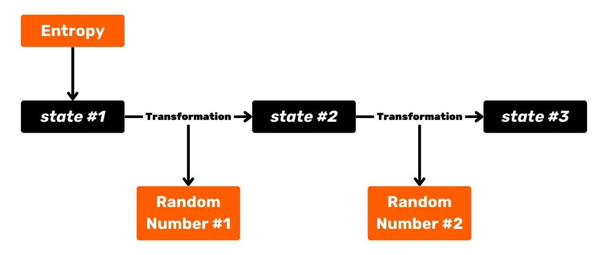

Альтернативой является ручная генерация энтропии, которая предлагает лучший контроль, но также намного рискованнее. Я настоятельно не рекомендую генерировать энтропию для вашего HD-кошелька самостоятельно.

В следующей главе мы увидим, как мы переходим от случайного числа к мнемонической фразе из 12 или 24 слов.

## Мнемоническая Фраза

<chapterId>8f9340c1-e6dc-5557-a2f2-26c9669987d5</chapterId>
Мнемоническая фраза, также называемая "сид-фразой", "фразой восстановления", "секретной фразой" или "24-словной фразой", представляет собой последовательность, обычно состоящую из 12 или 24 слов, которая генерируется из энтропии. Она используется для детерминированного вывода всех ключей HD-кошелька. Это означает, что из этой фразы можно детерминированно сгенерировать и воссоздать все приватные и публичные ключи Bitcoin-кошелька, и, следовательно, получить доступ к защищенным с его помощью средствам. Цель мнемонической фразы - предоставить средство резервного копирования и восстановления биткойнов, которое одновременно безопасно и просто в использовании. Она была введена в стандарты в 2013 году с BIP39.
Давайте вместе разберемся, как перейти от энтропии к мнемонической фразе.

### Контрольная сумма

Чтобы преобразовать энтропию в мнемоническую фразу, сначала необходимо добавить в конец энтропии контрольную сумму (или "контрольную сумму"). Эта контрольная сумма - это короткая последовательность битов, которая обеспечивает целостность данных, проверяя, что не было внесено случайных изменений.

Для расчета контрольной суммы к энтропии применяется хеш-функция SHA256 (только один раз; это один из редких случаев в Bitcoin, когда используется одинарный хеш SHA256 вместо двойного хеша). Эта операция производит 256-битный хеш. Контрольная сумма состоит из первых битов этого хеша, и ее длина зависит от длины энтропии согласно следующей формуле:

$$
\text{CS} = \frac{\text{ENT}}{32}
$$

где $\text{ENT}$ представляет длину энтропии в битах, а $\text{CS}$ - длину контрольной суммы в битах.

Например, для энтропии 256 бит первые 8 бит хеша берутся для формирования контрольной суммы:

$$
\text{CS} = \frac{256}{32} = 8 \text{ бит}
$$

После расчета контрольной суммы она конкатенируется с энтропией для получения расширенной битовой последовательности, обозначаемой как $\text{ENT} \Vert \text{CS}$ ("конкатенация" означает поставить одно за другим).


### Соответствие между энтропией и мнемонической фразой

Количество слов в мнемонической фразе зависит от размера исходной энтропии, как показано в следующей таблице с:

- $\text{ENT}$: размер в битах энтропии;
- $\text{CS}$: размер в битах контрольной суммы;
- $w$: количество слов в итоговой мнемонической фразе.

$$
\begin{array}{|c|c|c|c|}
\hline
Например, для энтропии 256 бит результат $\text{ENT} \Vert \text{CS}$ составляет 264 бита и дает мнемоническую фразу из 24 слов.

### Преобразование бинарной последовательности в мнемоническую фразу

Битовая последовательность $\text{ENT} \Vert \text{CS}$ затем делится на сегменты по 11 бит. Каждый 11-битный сегмент, после преобразования в десятичное число, соответствует числу между 0 и 2047, которое обозначает позицию слова [в списке из 2048 слов, стандартизированном BIP39](https://github.com/PlanB-Network/bitcoin-educational-content/blob/dev/resources/bet/bip39-wordlist/assets/BIP39-WORDLIST.pdf).

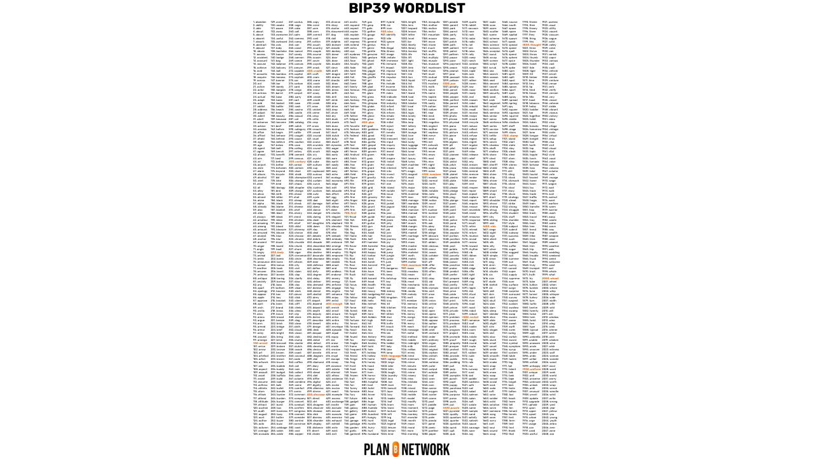
Например, для 128-битной энтропии контрольная сумма составляет 4 бита, и таким образом, общая последовательность измеряется в 132 бита. Она делится на 12 сегментов по 11 бит (оранжевые биты обозначают контрольную сумму):
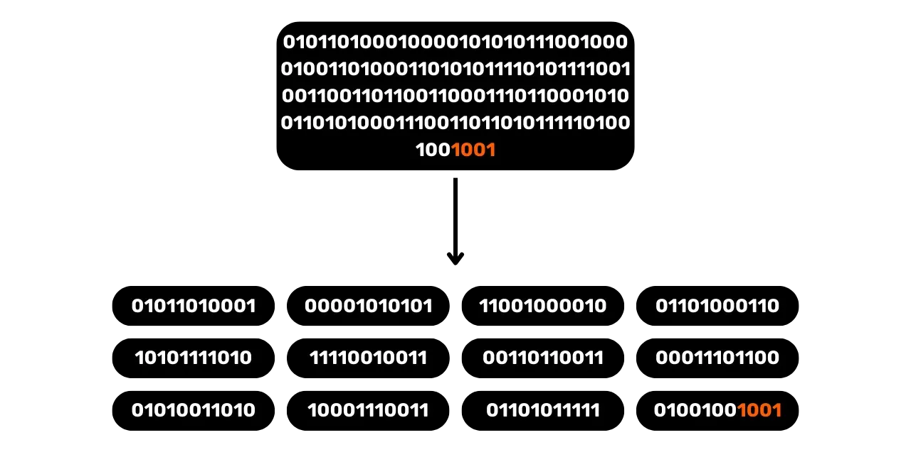

Каждый сегмент затем преобразуется в десятичное число, которое представляет слово из списка. Например, двоичный сегмент `01011010001` в десятичной системе эквивалентен `721`. Добавляя 1 для соответствия индексации списка (которая начинается с 1, а не с 0), мы получаем ранг слова `722`, что соответствует слову "*focus*" в списке.


Это соответствие повторяется для каждого из 12 сегментов, чтобы получить фразу из 12 слов.


### Особенности списка слов BIP39

Особенность списка слов BIP39 заключается в том, что ни одно слово не делится теми же первыми четырьмя буквами в том же порядке с другим словом. Это означает, что достаточно записать только первые четыре буквы каждого слова, чтобы сохранить мнемоническую фразу. Это может быть интересно для экономии места, особенно для тех, кто хочет выгравировать её на металлической основе.

Список из 2048 слов существует на нескольких языках. Это не простые переводы, а отдельные слова для каждого языка. Однако настоятельно рекомендуется придерживаться английской версии, так как версии на других языках обычно не поддерживаются программным обеспечением для кошельков.

### Какую длину выбрать для вашей мнемонической фразы?
Чтобы определить оптимальную длину вашей мнемонической фразы, необходимо учитывать фактическую безопасность, которую она обеспечивает. Фраза из 12 слов обеспечивает 128 бит безопасности, в то время как фраза из 24 слов предлагает 256 бит.

Однако это различие в безопасности на уровне фразы не улучшает общую безопасность биткойн-кошелька, поскольку производные от этой фразы приватные ключи получают только 128 бит безопасности. Действительно, как мы видели ранее, приватные ключи биткойна генерируются из случайных чисел (или производятся из случайного источника) в диапазоне от $1$ до $n-1$, где $n$ представляет порядок генераторной точки $G$ кривой secp256k1, число немного меньше $2^{256}$. Можно было бы подумать, что эти приватные ключи обеспечивают 256 бит безопасности. Однако их безопасность заключается в сложности нахождения приватного ключа по его ассоциированному публичному ключу, сложность, установленная математической проблемой дискретного логарифма на эллиптических кривых (*ECDLP*). На сегодняшний день лучший известный алгоритм для решения этой проблемы - алгоритм ро Полларда, который сокращает количество операций, необходимых для взлома ключа, до квадратного корня из его размера.

Для 256-битных ключей, таких как те, что используются в Bitcoin, алгоритм ро Полларда таким образом сокращает сложность до $2^{128}$ операций:


$$

O(\sqrt{2^{256}}) = O(2^{128})

$$

Следовательно, считается, что приватный ключ, используемый в Bitcoin, обеспечивает 128 бит безопасности.

В результате выбор фразы из 24 слов не обеспечивает дополнительной защиты для кошелька, поскольку 256 бит безопасности на фразе бессмысленны, если производные ключи обеспечивают только 128 бит безопасности. Чтобы проиллюстрировать этот принцип, это как иметь дом с двумя дверями: старой деревянной дверью и усиленной дверью. В случае взлома усиленная дверь была бы бесполезна, поскольку злоумышленник воспользовался бы деревянной дверью. Здесь аналогичная ситуация.
Фраза из 12 слов, которая также обеспечивает 128 бит безопасности, поэтому в настоящее время достаточна для защиты ваших биткойнов от любых попыток кражи. До тех пор, пока алгоритм цифровой подписи не изменится для использования более длинных ключей или для опоры на математическую проблему, отличную от ECDLP, фраза из 24 слов остается избыточной. Более того, более длинная фраза увеличивает риск потери при резервном копировании: резервная копия, которая в два раза короче, всегда легче управляема.
Чтобы углубиться и конкретно узнать, как вручную сгенерировать тестовую мнемоническую фразу, я советую вам ознакомиться с этим учебником:

https://planb.network/tutorials/wallet/generate-mnemonic-phrase
Прежде чем продолжить с выводом кошелька из этой мнемонической фразы, я представлю вам в следующей главе BIP39 парольную фразу, поскольку она играет роль в процессе вывода, и находится на том же уровне, что и мнемоническая фраза.
## Парольная фраза
<chapterId>6a51b397-f3b5-5084-b151-cef94bc9b93f</chapterId>

Как мы только что видели, HD кошельки генерируются из мнемонической фразы, состоящей обычно из 12 или 24 слов. Эта фраза очень важна, потому что она позволяет восстановить все ключи кошелька в случае потери его физического устройства (например, аппаратного кошелька). Однако, она составляет единственную точку отказа, потому что если она будет скомпрометирована, злоумышленник сможет украсть все биткойны. Вот где в игру вступает BIP39 парольная фраза.

### Что такое BIP39 парольная фраза?

Парольная фраза - это необязательный пароль, который вы можете свободно выбрать, добавляемый к мнемонической фразе в процессе вывода ключей для повышения безопасности кошелька.

Будьте осторожны, парольную фразу не следует путать с PIN-кодом вашего аппаратного кошелька или паролем, используемым для разблокировки доступа к вашему кошельку на компьютере. В отличие от всех этих элементов, парольная фраза играет роль в выводе ключей вашего кошелька. **Это означает, что без нее вы никогда не сможете восстановить свои биткойны.**

Парольная фраза работает вместе с мнемонической фразой, изменяя семя, из которого генерируются ключи. Таким образом, даже если кто-то получит вашу фразу из 12 или 24 слов, без парольной фразы он не сможет получить доступ к вашим средствам. Использование парольной фразы по сути создает новый кошелек с отличными ключами. Изменение (даже незначительное) парольной фразы приведет к генерации другого кошелька.

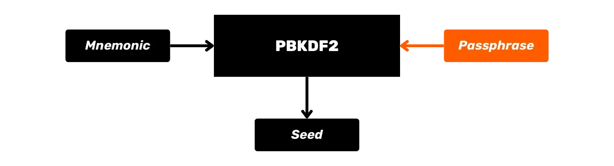

### Почему вам следует использовать парольную фразу?

Парольная фраза произвольна и может быть любой комбинацией символов, выбранной пользователем. Таким образом, использование парольной фразы предлагает несколько преимуществ. Прежде всего, это снижает все риски, связанные с компрометацией мнемонической фразы, требуя второго фактора для доступа к средствам (взлом, доступ в ваш дом и т.д.).

Далее, ее можно использовать стратегически для создания ложного кошелька, чтобы столкнуться с физическими ограничениями для кражи ваших средств, как в известной атаке "_$5 гаечный ключ_". В этом сценарии идея состоит в том, чтобы иметь кошелек без парольной фразы, содержащий только небольшое количество биткойнов, достаточное для удовлетворения потенциального агрессора, в то время как имеется скрытый кошелек. Этот последний использует ту же мнемоническую фразу, но защищен дополнительной парольной фразой.
Наконец, использование парольной фразы интересно, когда кто-то желает контролировать случайность генерации семени HD кошелька.
### Как выбрать хорошую парольную фразу?

Чтобы парольная фраза была эффективной, она должна быть достаточно длинной и случайной. Как и в случае с сильным паролем, я рекомендую выбирать парольную фразу, которая будет как можно более длинной и случайной, с разнообразием букв, цифр и символов, чтобы сделать любую атаку методом грубой силы невозможной.
Также важно правильно сохранить эту парольную фразу так же, как и мнемоническую фразу. **Потеря её означает потерю доступа к вашим биткоинам**. Я настоятельно советую не полагаться только на память, так как это необоснованно увеличивает риск потери. Идеально записать её на физический носитель (бумагу или металл), отдельный от мнемонической фразы. Этот резервный вариант, очевидно, должен храниться в другом месте, отличном от места хранения вашей мнемонической фразы, чтобы предотвратить одновременное компрометирование обоих.

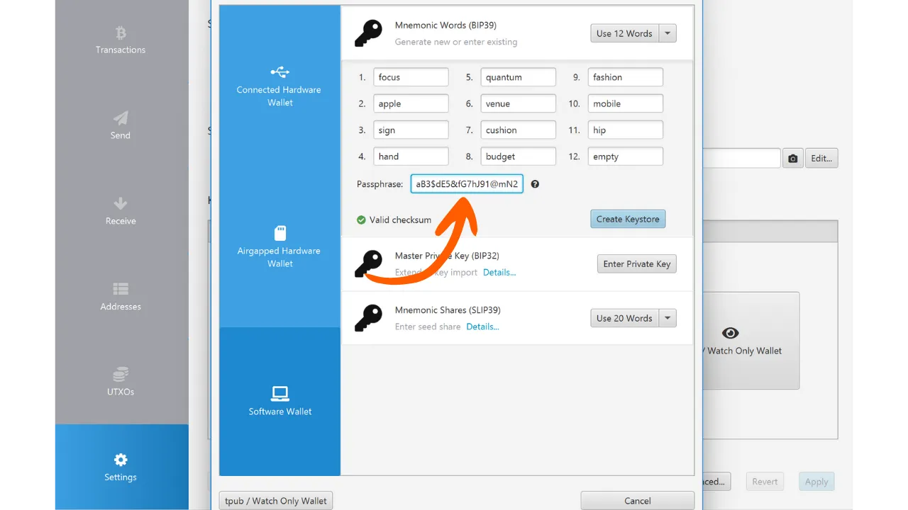

В следующем разделе мы узнаем, как эти два элемента, лежащие в основе вашего кошелька — мнемоническая фраза и парольная фраза — используются для получения пар ключей, используемых в *scriptPubKey*, которые блокируют ваши UTXO.

# Создание Биткоин Кошельков
<partId>9c25e767-7eae-50b8-8c5f-679d8fc83bab</partId>

## Создание Сида и Мастер-Ключа
<chapterId>63093760-2010-5691-8d0e-9a04732ae557</chapterId>

После генерации мнемонической фразы и необязательной парольной фразы начинается процесс получения Биткоин HD кошелька. Мнемоническая фраза сначала преобразуется в сид, который является основой всех ключей кошелька.

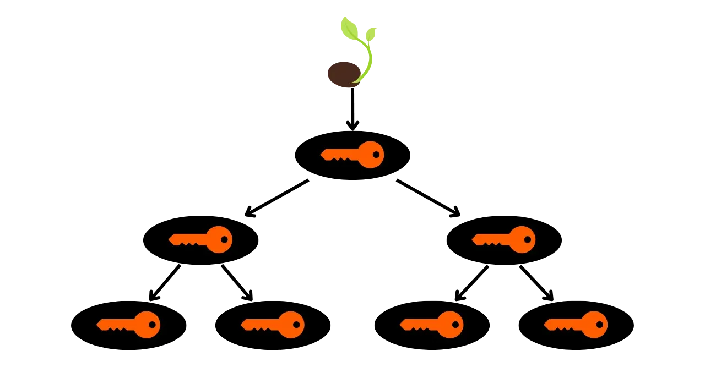

### Сид HD Кошелька

Стандарт BIP39 определяет сид как последовательность из 512 бит, которая служит отправной точкой для получения всех ключей HD кошелька. Сид получается из мнемонической фразы и возможной парольной фразы с использованием алгоритма **PBKDF2** (*Password-Based Key Derivation Function 2*), о котором мы уже говорили в главе 3.3. В этой функции получения мы будем использовать следующие параметры:

- $m$ : мнемоническая фраза;
- $p$ : необязательная парольная фраза, выбранная пользователем для повышения безопасности сида. Если парольная фраза отсутствует, это поле оставляется пустым;
- $\text{PBKDF2}$ : функция получения с $\text{HMAC-SHA512}$ и $2048$ итерациями;
- $s$: 512-битный сид кошелька.
Независимо от выбранной длины мнемонической фразы (132 бита или 264 бита), функция PBKDF2 всегда производит выходные данные размером 512 бит, и поэтому сид всегда будет этого размера.

### Схема Получения Сида с PBKDF2

Следующее уравнение иллюстрирует получение сида из мнемонической фразы и парольной фразы:


$$

s = \text{PBKDF2}\_{\text{HMAC-SHA512}}(m, p, 2048)

$$

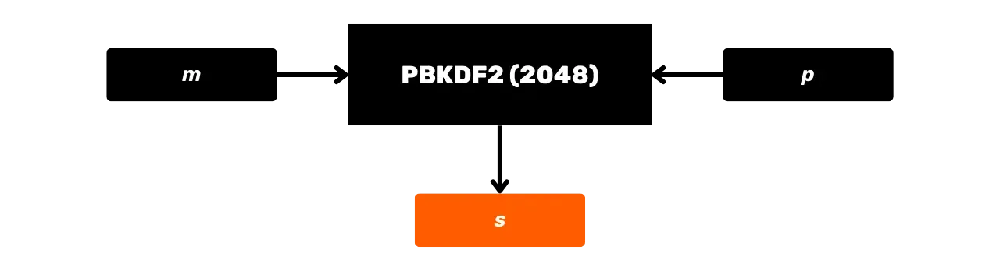

Таким образом, значение сида зависит от значения мнемонической фразы и парольной фразы. Изменяя парольную фразу, получается другой сид. Однако, при использовании одной и той же мнемонической фразы и парольной фразы, всегда генерируется один и тот же сид, поскольку PBKDF2 является детерминированной функцией. Это гарантирует, что те же пары ключей могут быть восстановлены через наши резервные копии.

**Примечание:** В обиходе термин "сид" часто используется, по ошибке, для обозначения мнемонической фразы. Действительно, в отсутствие парольной фразы одно является просто кодировкой другого. Однако, как мы видели, в технической реальности кошельков, сид и мнемоническая фраза действительно являются двумя различными элементами.

Теперь, когда у нас есть наш сид, мы можем продолжить с получением нашего Биткоин кошелька.
### Мастер-ключ и мастер-код цепочки
После получения сида следующим шагом в создании HD-кошелька является расчет мастер-приватного ключа и мастер-кода цепочки, которые будут представлять уровень 0 нашего кошелька.

Для получения мастер-приватного ключа и мастер-кода цепочки к сиду применяется функция HMAC-SHA512, используя фиксированный ключ "*Bitcoin Seed*", идентичный для всех пользователей Bitcoin. Эта константа выбрана для того, чтобы производные ключи были специфичны для Bitcoin. Вот элементы:
- $\text{HMAC-SHA512}$: функция производства;
- $s$: 512-битный сид кошелька;
- $\text{"Bitcoin Seed"}$: общая константа производства для всех Bitcoin-кошельков.


$$

\text{output} = \text{HMAC-SHA512}(\text{"Bitcoin Seed"}, s)

$$

Таким образом, выход этой функции составляет 512 бит. Затем он делится на 2 части:
- Левые 256 бит формируют **мастер-приватный ключ**;
- Правые 256 бит формируют **мастер-код цепочки**.
Математически эти два значения могут быть обозначены следующим образом, где $k_M$ является мастер-приватным ключом, а $C_M$ - мастер-кодом цепочки:
$$

k*M = \text{HMAC-SHA512}(\text{"Bitcoin Seed"}, s)*{[:256]}

$$


$$

C*M = \text{HMAC-SHA512}(\text{"Bitcoin Seed"}, s)*{[256:]}

$$


### Роль мастер-ключа и кода цепочки

Мастер-приватный ключ считается родительским ключом, из которого будут генерироваться все производные приватные ключи — дети, внуки, правнуки и т. д. Он представляет собой нулевой уровень в иерархии производства.

Мастер-код цепочки, с другой стороны, вносит дополнительный источник энтропии в процесс производства ключей для потомков, чтобы противостоять определенным потенциальным атакам. Более того, в HD-кошельке каждая пара ключей имеет уникальный код цепочки, ассоциированный с ней, который также используется для производства дочерних ключей из этой пары, но мы обсудим это более подробно в следующих главах.

Прежде чем продолжить с производством HD-кошелька со следующими элементами, я хочу в следующей главе представить вам расширенные ключи, которые часто путают с мастер-ключом. Мы увидим, как они создаются и какую роль играют в Bitcoin-кошельке.

## Расширенные ключи
<chapterId>8dcffce1-31bd-5e0b-965b-735f5f9e4602</chapterId>

Расширенный ключ - это просто конкатенация ключа (будь то приватный или публичный) и его ассоциированного кода цепочки. Этот код цепочки необходим для производства дочерних ключей, потому что без него невозможно произвести дочерние ключи из родительского ключа, но мы узнаем об этом процессе более точно в следующей главе. Таким образом, эти расширенные ключи позволяют агрегировать всю необходимую информацию для производства дочерних ключей, тем самым упрощая управление аккаунтами внутри HD-кошелька.

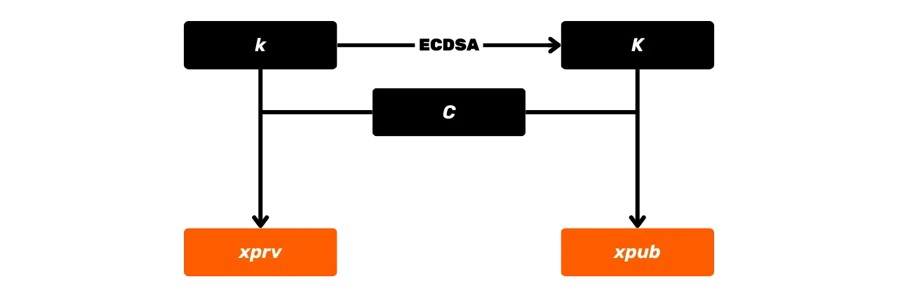

Расширенный ключ состоит из двух частей:
- Полезная нагрузка, которая содержит приватный или публичный ключ, а также ассоциированный код цепочки;
- Метаданные, которые являются различными частями информации для облегчения взаимодействия между программным обеспечением и улучшения понимания для пользователя.

### Как работают расширенные ключи
Когда расширенный ключ содержит приватный ключ, он называется расширенным приватным ключом. Он узнаваем по его префиксу, который содержит упоминание `prv`. В дополнение к приватному ключу, расширенный приватный ключ также содержит ассоциированный код цепи. С таким типом расширенного ключа возможно получить все типы дочерних приватных ключей, и, следовательно, за счет сложения и удвоения точек на эллиптических кривых, он также позволяет получить все дочерние публичные ключи.

Когда расширенный ключ не содержит приватный ключ, а вместо этого содержит публичный ключ, он называется расширенным публичным ключом. Он узнаваем по его префиксу, который содержит упоминание `pub`. Очевидно, что в дополнение к ключу, он также содержит ассоциированный код цепи. В отличие от расширенного приватного ключа, расширенный публичный ключ позволяет получить только "обычные" дочерние публичные ключи (то есть не может получить "усиленные" дочерние ключи). Мы увидим в следующей главе, что означают эти квалификаторы "обычный" и "усиленный".

Но в любом случае, расширенный публичный ключ не позволяет получить дочерние приватные ключи. Поэтому, даже если кто-то имеет доступ к `xpub`, он не сможет тратить ассоциированные средства, так как у него не будет доступа к соответствующим приватным ключам. Они могут только получить дочерние публичные ключи для наблюдения за ассоциированными транзакциями.

Для дальнейшего мы будем использовать следующую нотацию:
- $K_{\text{PAR}}$: родительский публичный ключ;
- $k_{\text{PAR}}$: родительский приватный ключ;
- $C_{\text{PAR}}$: родительский код цепи;
- $C_{\text{CHD}}$: дочерний код цепи;
- $K_{\text{CHD}}^n$: обычный дочерний публичный ключ;
- $k_{\text{CHD}}^n$: обычный дочерний приватный ключ;
- $K_{\text{CHD}}^h$: усиленный дочерний публичный ключ;
- $k_{\text{CHD}}^h$: усиленный дочерний приватный ключ.


### Структура расширенного ключа

Расширенный ключ структурирован следующим образом:
- **Version**: Код версии для идентификации природы ключа (`xprv`, `xpub`, `yprv`, `ypub`...). В конце этой главы мы увидим, что означают буквы `x`, `y` и `z`.
- **Depth**: Иерархический уровень в HD кошельке относительно мастер-ключа (0 для мастер-ключа).
- **Parent Fingerprint**: Первые 4 байта хеша HASH160 родительского публичного ключа, используемого для получения ключа, присутствующего в полезной нагрузке.
- **Index Number**: Идентификатор дочернего ключа среди ключей-братьев и сестер, то есть среди всех ключей на том же уровне производства, которые имеют те же родительские ключи.
- **Chain Code**: Уникальный 32-байтовый код для получения дочерних ключей.
- **Key**: Приватный ключ (с префиксом на 1 байт для размера) или публичный ключ.
- **Checksum**: Контрольная сумма, рассчитанная с помощью функции HASH256 (двойной SHA256), также добавляется, что позволяет проверить целостность расширенного ключа во время его передачи или хранения.

Полный формат расширенного ключа, таким образом, составляет 78 байт без контрольной суммы и 82 байта с контрольной суммой. Затем он преобразуется в Base58 для создания представления, которое легко читается пользователями. Формат Base58 такой же, как и для адресов получения *Legacy* (до *SegWit*).

| Элемент           | Описание                                                                                                        | Размер      |
| ----------------- | ------------------------------------------------------------------------------------------------------------------ | --------- |
| Версия            | Указывает, является ли ключ публичным (`xpub`, `ypub`) или приватным (`xprv`, `zprv`), а также версию расширенного ключа | 4 байта   |
| Глубина           | Уровень в иерархии относительно мастер-ключа                                                                        | 1 байт    |
| Отпечаток Родителя| Первые 4 байта из HASH160 публичного ключа родителя                                                                  | 4 байта   |
| Номер Индекса     | Позиция ключа в порядке детей                                                                                       | 4 байта   |
| Код Цепи          | Используется для получения дочерних ключей                                                                          | 32 байта  |
| Ключ              | Приватный ключ (с префиксом в 1 байт) или публичный ключ                                                           | 33 байта  |
| Контрольная Сумма | Контрольная сумма для проверки целостности                                                                          | 4 байта   |

Если к приватному ключу добавляется один байт, это связано с тем, что сжатый публичный ключ длиннее приватного ключа на один байт. Этот дополнительный байт, добавленный в начало приватного ключа как `0x00`, выравнивает их размер, обеспечивая одинаковую длину полезной нагрузки расширенного ключа, независимо от того, является ли это публичным или приватным ключом.

### Префиксы Расширенных Ключей
Как мы только что видели, расширенные ключи включают префикс, который указывает как на версию расширенного ключа, так и на его природу. Обозначение `pub` указывает, что это относится к расширенному публичному ключу, а обозначение `prv` указывает на расширенный приватный ключ. Дополнительная буква в основании расширенного ключа помогает указать, какому стандарту следует ключ, будь то Legacy, SegWit v0, SegWit v1 и т.д.
Вот краткое изложение используемых префиксов и их значений:

| Префикс Base 58 | Префикс Base 16 | Сеть     | Назначение            | Ассоциированные Скрипты | Производная               | Тип Ключа   |
|-----------------|-----------------|----------|-----------------------|--------------------------|---------------------------|-------------|
| `xpub`          | `0488b21e`      | Mainnet  | Legacy и SegWit V1    | P2PK / P2PKH / P2TR      | `m/44'/0'`, `m/86'/0'`    | публичный   |
| `xprv`          | `0488ade4`      | Mainnet  | Legacy и SegWit V1    | P2PK / P2PKH / P2TR      | `m/44'/0'`, `m/86'/0'`    | приватный   |
| `tpub`          | `043587cf`      | Testnet  | Legacy и SegWit V1    | P2PK / P2PKH / P2TR      | `m/44'/1'`, `m/86'/1'`    | публичный   |
| `tprv`          | `04358394`      | Testnet  | Legacy и SegWit V1    | P2PK / P2PKH / P2TR      | `m/44'/1'`, `m/86'/1'`    | приватный   |
| `ypub`          | `049d7cb2`      | Mainnet  | Nested SegWit         | P2WPKH in P2SH           | `m/49'/0'`                | публичный   |
| `yprv`         | `049d7878`         | Mainnet  | Вложенный SegWit        | P2WPKH в P2SH           | `m/49'/0'`                 | private     |
| `upub`         | `049d7cb2`         | Testnet  | Вложенный SegWit        | P2WPKH в P2SH           | `m/49'/1'`                 | public      |
| `uprv`         | `044a4e28`         | Testnet  | Вложенный SegWit        | P2WPKH в P2SH           | `m/49'/1'`                 | private     |
| `zpub`         | `04b24746`         | Mainnet  | SegWit V0            | P2WPKH                   | `m/84'/0'`                 | public      |

Эта таблица предоставляет полный обзор префиксов, используемых в расширенных ключах, детализируя их префиксы в base 58 и base 16, сеть, с которой они ассоциированы (Mainnet или Testnet), их назначение, ассоциированные с ними скрипты, их путь производного ключа и являются ли они публичными или приватными ключами.
| `zprv`          | `04b2430c`          | Mainnet  | SegWit V0            | P2WPKH                    | `m/84'/0'`                  | private     |
| `vpub`          | `045f1cf6`          | Testnet  | SegWit V0            | P2WPKH                    | `m/84'/1'`                  | public      |
| `vprv`          | `045f18bc`          | Testnet  | SegWit V0            | P2WPKH                    | `m/84'/1'`                  | private     |

### Детали элементов расширенного ключа

Чтобы лучше понять внутреннюю структуру расширенного ключа, давайте возьмем один в качестве примера и разберем его. Вот расширенный ключ:

- **В Base58**:

```text
xpub6CTNzMUkzpurBWaT4HQoYzLP4uBbGJuWY358Rj7rauiw4rMHCyq3Rfy9w4kyJXJzeFfyrKLUar2rUCukSiDQFa7roTwzjiAhyQAdPLEjqHT
```

- **В шестнадцатеричном формате**:

```text
0488B21E036D5601AD80000000C605DF9FBD77FD6965BD02B77831EC5C78646AD3ACA14DC3984186F72633A89303772CCB99F4EF346078D167065404EED8A58787DED31BFA479244824DF50658051F067C3A
```

Этот расширенный ключ разбивается на несколько отдельных элементов:

1. **Версия**: `0488B21E`

Первые 4 байта - это версия. Здесь она соответствует расширенному публичному ключу на Mainnet с целью производства либо _Legacy_, либо _SegWit v1_.

2. **Глубина**: `03`

Это поле указывает иерархический уровень ключа внутри HD кошелька. В данном случае глубина `03` означает, что этот ключ находится на трех уровнях производства ниже мастер-ключа.

3. **Отпечаток родителя**: `6D5601AD`
   Это первые 4 байта хеша HASH160 открытого ключа родителя, который использовался для получения данного `xpub`.
4. **Номер индекса**: `80000000`

Этот индекс указывает позицию ключа среди детей его родителя. Префикс `0x80` указывает на то, что ключ получен усиленным способом, и поскольку остальная часть заполнена нулями, это указывает на то, что этот ключ является первым среди его возможных братьев и сестер.

5. **Код цепи**: `C605DF9FBD77FD6965BD02B77831EC5C78646AD3ACA14DC3984186F72633A893`
6. **Открытый ключ**: `03772CCB99F4EF346078D167065404EED8A58787DED31BFA479244824DF5065805`
7. **Контрольная сумма**: `1F067C3A`

Контрольная сумма соответствует первым 4 байтам хеша (двойной SHA256) всего остального.

В этой главе мы узнали, что существует два различных типа дочерних ключей. Мы также узнали, что для получения этих дочерних ключей требуется ключ (либо приватный, либо публичный) и его код цепи. В следующей главе мы подробно рассмотрим природу этих различных типов ключей и как их получить из родительского ключа и кода цепи.

## Получение пар дочерних ключей

<chapterId>61c0807c-845b-5076-ad06-7f395b36adfd</chapterId>

Получение пар дочерних ключей в HD-кошельках Bitcoin основывается на иерархической структуре, которая позволяет генерировать большое количество ключей, одновременно организуя эти пары в разные группы через ветвления. Каждая пара, полученная от родительской пары, может использоваться непосредственно в _scriptPubKey_ для блокировки биткойнов или как отправная точка для генерации большего количества дочерних ключей и так далее, создавая дерево ключей.

Все эти производные начинаются с мастер-ключа и мастер-кода цепи, которые являются первыми родителями на уровне глубины 0. Они, по сути, являются Адамом и Евой ключей вашего кошелька, общими предками всех производных ключей.

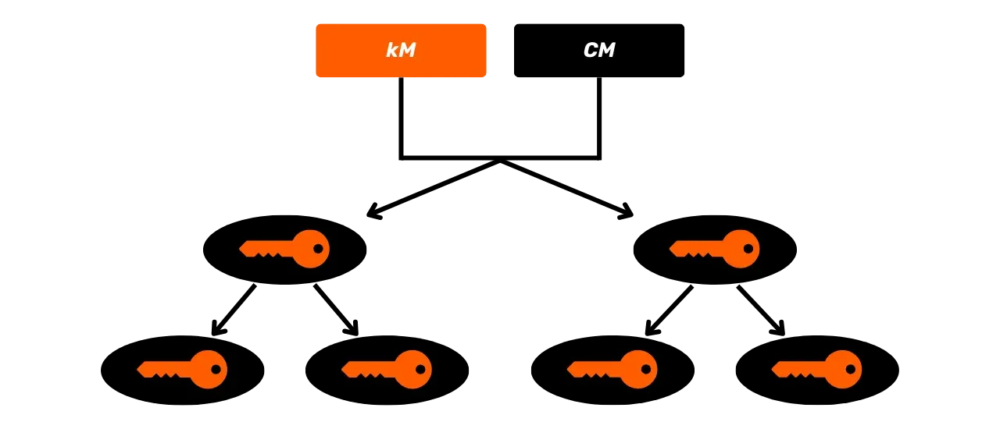

Давайте исследуем, как работает это детерминированное производство.

### Различные типы производных дочерних ключей

Как мы кратко упомянули в предыдущей главе: дочерние ключи делятся на два основных типа:

1. **Обычные дочерние ключи** ($k_{\text{CHD}}^n, K_{\text{CHD}}^n$): Они получаются из расширенного публичного ключа ($K_{\text{PAR}}$) или расширенного приватного ключа ($k_{\text{PAR}}$), сначала получая публичный ключ.
2. **Усиленные дочерние ключи** ($k_{\text{CHD}}^h, K_{\text{CHD}}^h$): Их можно получить только из расширенного приватного ключа ($k_{\text{PAR}}$), поэтому они невидимы для наблюдателей, которые имеют только расширенный публичный ключ.
   Каждая пара дочерних ключей идентифицируется 32-битным **индексом** (обозначенным $i$ в наших расчетах). Индексы для обычных ключей варьируются от $0$ до $2^{31}-1$, в то время как для усиленных ключей - от $2^{31}$ до $2^{32}-1$. Эти числа используются для различения пар дочерних ключей в процессе производства. Действительно, каждая пара родительских ключей должна быть способна производить множество пар дочерних ключей. Если бы мы применяли один и тот же расчет систематически от родительских ключей, все полученные дочерние ключи были бы идентичными, что нежелательно. Таким образом, индекс вводит переменную, которая модифицирует расчет производства, позволяя различать каждую пару дочерних ключей. За исключением специфического использования в определенных протоколах и стандартах производства, мы обычно начинаем с производства первого дочернего ключа с индексом `0`, второго с индексом `1` и так далее.

### Процесс производства с использованием HMAC-SHA512

Производство каждого дочернего ключа основано на функции HMAC-SHA512, о которой мы говорили в разделе 2 о хеш-функциях. Она принимает два входа: родительский код цепочки $C_{\text{PAR}}$ и конкатенацию родительского ключа (либо публичного ключа $K_{\text{PAR}}$, либо приватного ключа $k_{\text{PAR}}$, в зависимости от типа желаемого дочернего ключа) и индекса. Выход HMAC-SHA512 - это 512-битная последовательность, разделенная на две части:

- **Первые 32 байта** (или $h_1$) используются для расчета новой пары дочерних ключей.
- **Последние 32 байта** (или $h_2$) служат новым кодом цепочки $C_{\text{CHD}}$ для пары дочерних ключей.

Во всех наших расчетах я буду обозначать $\text{hash}$ выход функции HMAC-SHA512.

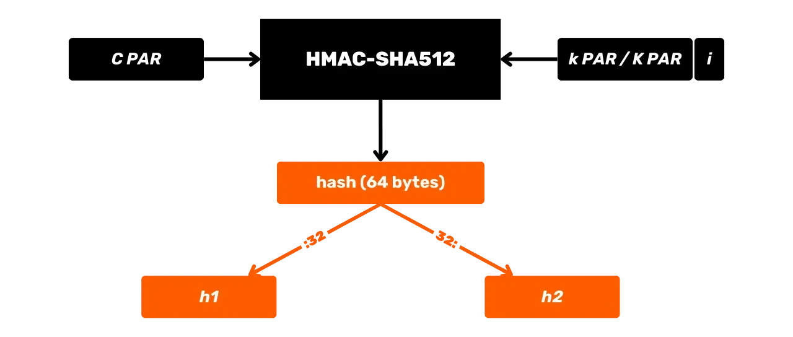

#### Производство дочернего приватного ключа из родительского приватного ключа

Для производства дочернего приватного ключа $k_{\text{CHD}}$ из родительского приватного ключа $k_{\text{PAR}}$ возможны два сценария в зависимости от того, требуется ли усиленный или обычный ключ.

Для **обычного дочернего ключа** ($i < 2^{31}$) расчет $\text{hash}$ следующий:


$$

\text{hash} = \text{HMAC-SHA512}(C*{\text{PAR}}, G \cdot k*{\text{PAR}} \Vert i)

$$

В этом расчете мы видим, что наша функция HMAC принимает два входа: сначала родительский код цепочки, а затем конкатенацию индекса с публичным ключом, связанным с родительским приватным ключом. Здесь используется родительский публичный ключ, поскольку мы стремимся произвести обычный дочерний ключ, а не усиленный.
Теперь у нас есть 64-байтный $\text{hash}$, который мы разделим на 2 части по 32 байта каждая: $h_1$ и $h_2$:


$$

\text{hash} = h_1 \Vert h_2

$$


$$

h*1 = \text{hash}*{[:32]} \quad, \quad h*2 = \text{hash}*{[32:]}

$$

Затем дочерний приватный ключ $k_{\text{CHD}}^n$ рассчитывается следующим образом:


$$

k*{\text{CHD}}^n = \text{parse256}(h_1) + k*{\text{PAR}} \mod n

$$

В этом расчете операция $\text{parse256}(h_1)$ состоит из интерпретации первых 32 байтов $\text{hash}$ как 256-битного целого числа. Это число затем добавляется к родительскому закрытому ключу, все берется по модулю $n$, чтобы оставаться в пределах порядка эллиптической кривой, как мы видели в разделе 3 о цифровых подписях. Таким образом, для получения обычного дочернего закрытого ключа, хотя родительский открытый ключ используется как основа для расчета во входных данных функции HMAC-SHA512, всегда необходимо иметь родительский закрытый ключ для завершения расчета.
Из этого дочернего закрытого ключа можно получить соответствующий открытый ключ, применив ECDSA или Schnorr. Таким образом, мы получаем полную пару ключей.

Затем вторая часть $\text{hash}$ просто интерпретируется как код цепочки для только что полученной пары дочерних ключей:


$$

C\_{\text{CHD}} = h_2

$$

Вот схематическое представление общего процесса получения:

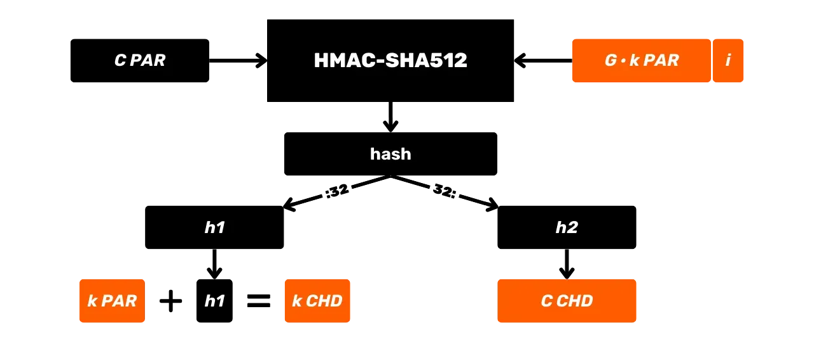

Для **усиленного дочернего ключа** ($i \geq 2^{31}$) расчет $\text{hash}$ происходит следующим образом:


$$

hash = \text{HMAC-SHA512}(C*{\text{PAR}}, 0x00 \Vert k*{\text{PAR}} \Vert i)

$$

В этом расчете мы видим, что наша функция HMAC принимает два входа: сначала код цепочки родителя, а затем конкатенацию индекса с родительским закрытым ключом. Здесь используется родительский закрытый ключ, поскольку мы стремимся получить усиленный дочерний ключ. Кроме того, в начало ключа добавляется байт, равный `0x00`, чтобы его длина соответствовала длине сжатого открытого ключа.
Таким образом, у нас есть 64-байтный $\text{hash}$, который мы разделим на 2 части по 32 байта каждая: $h_1$ и $h_2$:


$$

\text{hash} = h_1 \Vert h_2

$$


$$

h_1 = \text{hash}[:32] \quad, \quad h_2 = \text{hash}[32:]

$$

Затем дочерний закрытый ключ $k_{\text{CHD}}^h$ рассчитывается следующим образом:


$$

k*{\text{CHD}}^h = \text{parse256}(h_1) + k*{\text{PAR}} \mod n

$$

Далее мы просто интерпретируем вторую часть $\text{hash}$ как код цепочки для только что полученной пары дочерних ключей:


$$

C\_{\text{CHD}} = h_2

$$

Вот схематическое представление общего процесса получения:

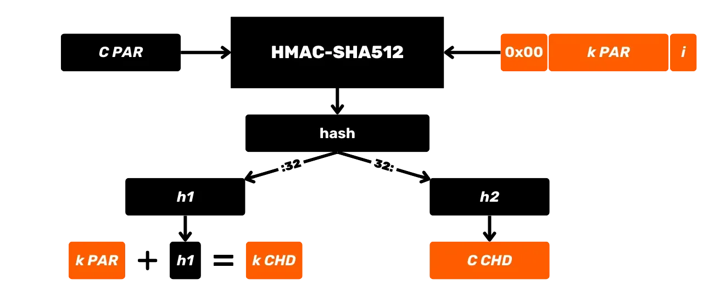

Мы видим, что обычное получение и усиленное получение функционируют одинаково, с этим отличием: обычное получение использует родительский открытый ключ в качестве входа для функции HMAC, в то время как усиленное получение использует родительский закрытый ключ.

#### Получение дочернего открытого ключа из родительского открытого ключа

Если мы знаем только родительский публичный ключ $K_{\text{PAR}}$ и связанный с ним код цепочки $C_{\text{PAR}}$, то есть расширенный публичный ключ, возможно получить дочерние публичные ключи $K_{\text{CHD}}^n$, но только для обычных (не усиленных) дочерних ключей. Этот принцип, в частности, позволяет отслеживать движения по счету в Bitcoin-кошельке с помощью `xpub` (_только для просмотра_).
Для выполнения этого расчета мы вычислим $\text{hash}$ с индексом $i < 2^{31}$ (обычное производное):


$$

\text{hash} = \text{HMAC-SHA512}(C*{\text{PAR}}, K*{\text{PAR}} \Vert i)

$$

В этом расчете мы видим, что наша функция HMAC принимает два входа: сначала код цепочки родителя, затем конкатенацию индекса с родительским публичным ключом.

Таким образом, у нас есть $hash$ из 64 байтов, который мы разделим на 2 части по 32 байта каждая: $h_1$ и $h_2$:


$$

\text{hash} = h_1 \Vert h_2

$$


$$

h_1 = \text{hash}[:32] \quad, \quad h_2 = \text{hash}[32:]

$$

Затем дочерний публичный ключ $K_{\text{CHD}}^n$ рассчитывается следующим образом:


$$

K*{\text{CHD}}^n = G \cdot \text{parse256}(h_1) + K*{\text{PAR}}

$$

Если $\text{parse256}(h_1) \geq n$ (порядок эллиптической кривой) или если $K_{\text{CHD}}^n$ является точкой на бесконечности, производное является недействительным, и должен быть выбран другой индекс.
В этом расчете операция $\text{parse256}(h_1)$ включает интерпретацию первых 32 байтов $\text{hash}$ как 256-битное целое число. Это число используется для расчета точки на эллиптической кривой через сложение и удвоение от точки генератора $G$. Эта точка затем добавляется к родительскому публичному ключу для получения обычного дочернего публичного ключа. Таким образом, для получения обычного дочернего публичного ключа необходимы только родительский публичный ключ и код цепочки родителя; родительский приватный ключ никогда не участвует в этом процессе, в отличие от расчета дочернего приватного ключа, который мы видели ранее.

Далее, код цепочки дочернего элемента просто:


$$

C\_{\text{CHD}} = h_2

$$

Вот схематическое представление общего производного:

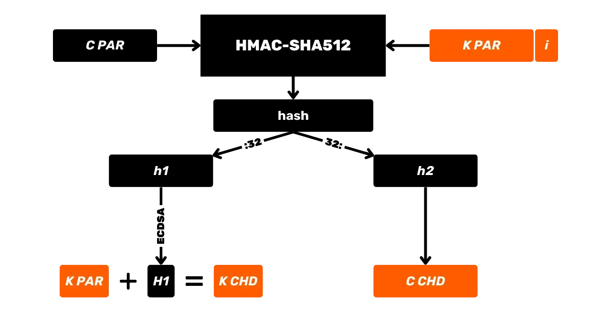

### Соответствие между дочерними публичными и приватными ключами

Вопрос, который может возникнуть, это как обычный дочерний публичный ключ, полученный из родительского публичного ключа, может соответствовать обычному дочернему приватному ключу, полученному из соответствующего родительского приватного ключа. Эта связь точно обеспечивается свойствами эллиптических кривых. Действительно, для получения обычного дочернего публичного ключа применяется HMAC-SHA512 тем же способом, но его вывод используется по-другому:

- **Обычный дочерний приватный ключ**: $k_{\text{CHD}}^n = \text{parse256}(h_1) + k_{\text{PAR}} \mod n$
- **Обычный дочерний публичный ключ**: $K_{\text{CHD}}^n = G \cdot \text{parse256}(h_1) + K_{\text{PAR}}$
  Благодаря операциям сложения и удвоения на эллиптической кривой, оба метода дают согласованные результаты: публичный ключ, полученный из дочернего приватного ключа, идентичен дочернему публичному ключу, полученному напрямую из родительского публичного ключа.

### Сводка типов производных

Для обобщения, вот различные возможные типы производных:


$$

\begin{array}{|c|c|c|c|}
\hline
\rightarrow & \text{PAR} & \text{CHD} & \text{n/h} \\
\hline
k*{\text{PAR}} \rightarrow k*{\text{CHD}} & k*{\text{PAR}} & \{ k*{\text{CHD}}^n, k\_{\text{CHD}}^h \} & \{ n, h \} \\
\end{array}

$$


$$

k*{\text{PAR}} \rightarrow K*{\text{CHD}} & k*{\text{PAR}} & \{ K*{\text{CHD}}^n, K*{\text{CHD}}^h \} & \{ n, h \} \\
K*{\text{PAR}} \rightarrow k*{\text{CHD}} & K*{\text{PAR}} & \times & \times \\
K*{\text{PAR}} \rightarrow K*{\text{CHD}} & K*{\text{PAR}} & K*{\text{CHD}}^n & n \\
\hline
\end{array}

$$

Подводя итог, до сих пор вы узнали, как создать базовые элементы HD кошелька: мнемоническую фразу, сид и затем мастер-ключ и мастер-код цепочки. Вы также открыли для себя, как производить дочерние пары ключей в этой главе. В следующей главе мы исследуем, как эти производные организованы в биткойн-кошельках и какую структуру следует соблюдать, чтобы конкретно получить адреса для получения, а также пары ключей, используемые в _scriptPubKey_ и _scriptSig_.

## Структура кошелька и пути производных

<chapterId>34e1bbda-67de-5493-b268-1fded8d67689</chapterId>

Иерархическая структура HD кошельков в биткойне позволяет организовывать пары ключей различными способами. Идея состоит в том, чтобы производить, из мастер-приватного ключа и мастер-кода цепочки, несколько уровней глубины. Каждый добавленный уровень соответствует производству дочерней пары ключей из родительской пары ключей.

Со временем различные BIP (Bitcoin Improvement Proposals - Предложения по улучшению биткойна) ввели стандарты для этих путей производных, с целью стандартизации их использования в различном программном обеспечении. Таким образом, в этой главе мы узнаем значение каждого уровня производных в HD кошельках, согласно этим стандартам.

### Глубины производных HD кошелька

Пути производных организованы в слои глубины, начиная с глубины 0, которая представляет мастер-ключ и мастер-код цепочки, до слоев подуровней для производства адресов, используемых для блокировки UTXO. BIP определяют стандарты для каждого слоя, что помогает гармонизировать практики между различным программным обеспечением управления кошельками.

Таким образом, путь производных относится к последовательности индексов, используемых для производства дочерних ключей из мастер-ключа.

**Глубина 0: Мастер-ключ (BIP32)**

Эта глубина соответствует мастер-приватному ключу и мастер-коду цепочки кошелька. Она представлена нотацией $m/$.

**Глубина 1: Цель (BIP43)**
Цель определяет логическую структуру вывода. Например, адрес P2WPKH будет иметь $/84'/$ на глубине 1 (согласно BIP84), в то время как адрес P2TR будет иметь $/86'/$ (согласно BIP86). Этот слой обеспечивает совместимость между кошельками, указывая индексные номера, соответствующие номерам BIP.
Другими словами, как только у вас есть мастер-ключ и мастер-код цепочки, они служат как родительская пара ключей для вывода дочерней пары ключей. Индекс, используемый в этом выводе, может быть, например, $/84'/$, если кошелек предназначен для использования скриптов типа SegWit v0. Эта пара ключей находится на глубине 1. Ее роль не в блокировке биткойнов, а просто в служении как промежуточный пункт в иерархии вывода.

**Глубина 2: Тип валюты (BIP44)**

Из пары ключей на глубине 1 производится новый вывод для получения пары ключей на глубине 2. Эта глубина позволяет различать счета Bitcoin от счетов других криптовалют в одном и том же кошельке.

Каждая валюта имеет уникальный индекс для обеспечения совместимости в мультивалютных кошельках. Например, для Bitcoin индекс составляет $/0'/$ (или `0x80000000` в шестнадцатеричной записи). Индексы валют выбираются в диапазоне от $2^{31}$ до $2^{32}-1$ для обеспечения усиленного вывода.

Чтобы дать вам другие примеры, вот индексы некоторых валют:

- $1'$ (`0x80000001`) для тестовых биткойнов;
- $2'$ (`0x80000002`) для Litecoin;
- $60'$ (`0x8000003c`) для Ethereum...

**Глубина 3: Счет (BIP32)**

Каждый кошелек может быть разделен на несколько счетов, пронумерованных от $2^{31}$, и представленных на глубине 3 индексом $/0'/$ для первого счета, $/1'/$ для второго и так далее. Обычно, когда говорится о расширенном ключе `xpub`, имеются в виду ключи на этой глубине вывода.

Это разделение на разные счета является необязательным. Его цель - упростить организацию кошелька для пользователей. На практике часто используется только один счет, обычно первый по умолчанию. Однако в некоторых случаях, если хочется четко различать пары ключей для разных целей, это может быть полезно. Например, можно создать личный счет и профессиональный счет из одного и того же семени, с полностью отличными группами ключей на этой глубине вывода.
**Глубина 4: Цепь (BIP32)**
Каждый счет, определенный на глубине 3, затем структурируется на две цепи:

- **Внешняя цепь**: В этой цепи выводятся так называемые "публичные" адреса. Эти адреса для получения предназначены для блокировки UTXO, поступающих из внешних транзакций (то есть, происходящих от потребления UTXO, которые не принадлежат вам). Проще говоря, эту внешнюю цепь используют, когда хотят получить биткойны. Когда вы нажимаете "_получить_" в программном обеспечении вашего кошелька, вам всегда предлагается адрес из внешней цепи. Эта цепь представлена парой ключей, выводимых с индексом $/0/$.
- **Внутренняя цепь (сдача)**: Эта цепь зарезервирована для адресов получения, которые блокируют биткойны, поступающие от потребления UTXO, принадлежащих вам, другими словами, адреса для сдачи. Она идентифицируется индексом $/1/$.

**Глубина 5: Индекс адреса (BIP32)**
Наконец, глубина 5 представляет последний этап производного процесса в кошельке. Хотя технически возможно продолжать бесконечно, текущие стандарты останавливаются на этом этапе. На этой последней глубине производятся пары ключей, которые будут использоваться для блокировки и разблокировки UTXO. Каждый индекс позволяет различать пары ключей-братьев: таким образом, первый адрес для получения будет использовать индекс $/0/$, второй - индекс $/1/$, и так далее.


### Обозначение путей производства

Путь производства записывается с разделением каждого уровня слешем ($/$). Таким образом, каждый слеш указывает на производство из родительской пары ключей ($k_{\text{PAR}}$, $K_{\text{PAR}}$, $C_{\text{PAR}}$) в дочернюю пару ключей ($k_{\text{CHD}}$, $K_{\text{CHD}}$, $C_{\text{CHD}}$). Число, указанное на каждой глубине, соответствует индексу, используемому для производства этого ключа от его родителей. Апостроф ($'$), иногда помещаемый справа от индекса, указывает на усиленное производство ($k_{\text{CHD}}^h$, $K_{\text{CHD}}^h$). Иногда этот апостроф заменяется на $h$. В отсутствие апострофа или $h$ это, следовательно, обычное производство ($k_{\text{CHD}}^n$, $K_{\text{CHD}}^n$).
Как мы видели в предыдущих главах, индексы усиленных ключей начинаются с $2^{31}$, или `0x80000000` в шестнадцатеричной системе. Следовательно, когда в пути производства индекс сопровождается апострофом, к указанному числу должно быть добавлено $2^{31}$, чтобы получить фактическое значение, используемое в функции HMAC-SHA512. Например, если путь производства указывает $/44'/$, фактический индекс будет:


$$

i = 44 + 2^{31} = 2\,147\,483\,692

$$

В шестнадцатеричной системе это `0x8000002C`.

Теперь, когда мы поняли основные принципы путей производства, давайте рассмотрим пример! Вот путь производства для адреса получения Bitcoin:


$$

m / 84' / 0' / 1' / 0 / 7

$$

В этом примере:

- $84'$ указывает на стандарт P2WPKH (SegWit v0);
- $0'$ указывает на валюту Bitcoin в основной сети;
- $1'$ соответствует второму аккаунту в кошельке;
- $0$ указывает, что адрес находится на внешней цепочке;
- $7$ указывает на 8-й внешний адрес этого аккаунта.

### Сводка структуры производства

| Глубина | Описание      | Пример стандарта                  |
| ------- | ------------- | --------------------------------- |
| 0       | Мастер-ключ   | $m/$                              |
| 1       | Цель          | $/86'/$ (P2TR)                    |
| 2       | Валюта        | $/0'/$ (Bitcoin)                  |
| 3       | Аккаунт       | $/0'/$ (Первый аккаунт)           |
| 4       | Цепочка       | $/0/$ (внешняя) или $/1/$ (сдача) |
| 5       | Индекс адреса | $/0/$ (первый адрес)              |

В следующей главе мы узнаем, что такое "_дескрипторы выходных скриптов_" - это недавно введенное новшество в Bitcoin Core, которое упрощает резервное копирование биткойн-кошелька.

## Дескрипторы выходных скриптов

<chapterId>e4f1c2d3-9b8a-4d3e-8f2a-7b6c5d4e3f2a</chapterId>
Часто говорят, что мнемоническая фраза сама по себе достаточна для восстановления доступа к кошельку. На самом деле, все немного сложнее. В предыдущей главе мы рассмотрели структуру производных HD-кошельков, и вы могли заметить, что этот процесс довольно сложен. Пути производных указывают программному обеспечению, какое направление следовать для получения ключей пользователя. Однако, при восстановлении биткойн-кошелька, если не знать эти пути, мнемоническая фраза сама по себе недостаточна. Она позволяет получить мастер-ключ и мастер-код цепочки, но затем необходимо знать индексы, использованные для достижения дочерних ключей.

Теоретически, необходимо сохранять не только мнемоническую фразу нашего кошелька, но и пути к используемым нами счетам. На практике часто возможно восстановить доступ к дочерним ключам без этой информации, при условии, что были соблюдены стандарты. Путем последовательного тестирования каждого стандарта, обычно можно восстановить доступ к биткойнам. Однако это не гарантировано и особенно сложно для новичков. Также, с диверсификацией типов скриптов и появлением более сложных конфигураций, эта информация может стать сложной для экстраполяции, превращая эти данные в частную информацию и трудную для восстановления методом перебора. Вот почему недавно было введено новшество, которое начинает интегрироваться в ваше любимое программное обеспечение для кошельков: _дескрипторы выходных скриптов_.

### Что такое "дескриптор"?

"_Дескрипторы выходных скриптов_", или просто "_дескрипторы_", - это структурированные выражения, которые полностью описывают выходной скрипт (_scriptPubKey_) и предоставляют всю необходимую информацию для отслеживания транзакций, связанных с конкретным скриптом. Они облегчают управление ключами в HD-кошельках, предлагая стандартизированное и полное описание структуры кошелька и используемых типов адресов.

Основное преимущество дескрипторов заключается в их способности инкапсулировать всю необходимую информацию для восстановления кошелька в одной строке (в дополнение к фразе восстановления). Сохраняя дескриптор вместе с ассоциированными мнемоническими фразами, становится возможным восстановить приватные ключи, точно зная их позицию в иерархии. Для мультисиг-кошельков, чье резервное копирование изначально было более сложным, дескриптор включает `xpub` каждого фактора, тем самым обеспечивая возможность регенерации адресов в случае проблемы.

### Строение дескриптора

Дескриптор состоит из нескольких элементов:

- Функции скрипта, такие как `pk` (_Pay-to-PubKey_), `pkh` (_Pay-to-PubKey-Hash_), `wpkh` (_Pay-to-Witness-PubKey-Hash_), `sh` (_Pay-to-Script-Hash_), `wsh` (_Pay-to-Witness-Script-Hash_), `tr` (_Pay-to-Taproot_), `multi` (_Мультиподпись_), и `sortedmulti` (_Мультиподпись с сортированными ключами_);
- Пути производных, например, `[d34db33f/44h/0h/0h]`, которые указывают на производный путь счета и конкретный отпечаток мастер-ключа;
- Ключи в различных форматах, таких как шестнадцатеричные публичные ключи или расширенные публичные ключи (`xpub`);
- Контрольная сумма, предшествующая знаку хэша, для проверки целостности дескриптора.
  Например, дескриптор для кошелька P2WPKH (SegWit v0) может выглядеть так:

```text
wpkh([cdeab12f/84h/0h/0h]xpub6CUGRUonZSQ4TWtTMmzXdrXDtyPWKiKbERr4d5qkSmh5h17C1TjvMt7DJ9Qve4dRxm91CDv6cNfKsq2mK1rMsJKhtRUPZz7MQtp3y6atC1U/<0;1>/*)#jy0l7nr4
```

В этом дескрипторе функция производной `wpkh` указывает на тип скрипта _Pay-to-Witness-Public-Key-Hash_. За ней следует путь производной, который содержит:

- `cdeab12f`: отпечаток мастер-ключа;
- `84h`: что означает использование цели BIP84, предназначенной для адресов SegWit v0;
- `0h`: что указывает, что это валюта BTC на основной сети;
- `0h`: что относится к конкретному номеру счета, используемому в кошельке.

Дескриптор также включает расширенный публичный ключ, используемый в этом кошельке:

```text
xpub6CUGRUonZSQ4TWtTMmzXdrXDtyPWKiKbERr4d5qkSmh5h17C1TjvMt7DJ9Qve4dRxm91CDv6cNfKsq2mK1rMsJKhtRUPZz7MQtp3y6atC1U
```

Далее, запись `/<0;1>/*` указывает, что дескриптор может генерировать адреса из внешней цепи (`0`) и внутренней цепи (`1`), с использованием подстановочного знака (`*`), что позволяет последовательно выводить множество адресов в настраиваемом порядке, аналогично управлению "пределом пропуска" в традиционном программном обеспечении для кошельков.
Наконец, `#jy0l7nr4` представляет контрольную сумму для проверки целостности дескриптора.
Теперь вы знаете все о работе HD-кошелька на Bitcoin и процессе производства пар ключей. Однако, в последних главах мы ограничились генерацией приватных и публичных ключей, не затрагивая создание адресов для получения. Это именно то, чем мы займемся в следующей главе!

## Адреса для получения

<chapterId>ca80a89d-f8da-4e09-8c35-43179b65bced</chapterId>

Адреса для получения - это части информации, встроенные в _scriptPubKey_, для блокировки вновь созданных UTXO. Проще говоря, адрес служит для получения биткоинов. Давайте исследуем их работу в связи с тем, что мы изучили в предыдущих главах.

### Роль биткоин-адресов в скриптах

Как было объяснено ранее, роль транзакции заключается в передаче права собственности на биткоины от входов к выходам. Этот процесс включает использование UTXO в качестве входов при создании новых UTXO в качестве выходов. Эти UTXO защищены скриптами, которые определяют необходимые условия для разблокировки средств.
Когда пользователь получает биткойны, отправитель создает выходной UTXO и блокирует его с помощью _scriptPubKey_. Этот скрипт содержит правила, обычно указывающие на необходимость подписей и публичных ключей для разблокировки этого UTXO. Чтобы потратить этот UTXO в новой транзакции, пользователь должен предоставить запрошенную информацию через _scriptSig_. Выполнение _scriptSig_ в сочетании с _scriptPubKey_ должно возвращать "true" или `1`. Если это условие выполнено, UTXO может быть потрачено для создания нового UTXO, который, в свою очередь, блокируется новым _scriptPubKey_, и так далее.
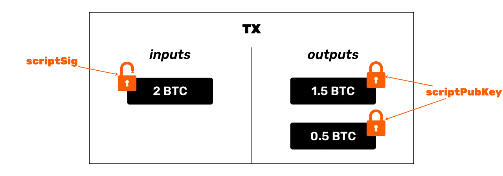

Именно в _scriptPubKey_ находятся адреса получения. Однако их использование варьируется в зависимости от принятого стандарта скрипта. Вот сводная таблица информации, содержащейся в _scriptPubKey_ в соответствии с используемым стандартом, а также информации, ожидаемой в _scriptSig_ для разблокировки _scriptPubKey_.

| Стандарт             | _scriptPubKey_                                              | _scriptSig_                     | _redeem script_     | _witness_                                |
| -------------------- | ----------------------------------------------------------- | ------------------------------- | ------------------- | ---------------------------------------- |
| P2PK                 | `<pubkey> OP_CHECKSIG`                                      | `<signature>`                   |                     |                                          |
| P2PKH                | `OP_DUP OP_HASH160 <pubKeyHash> OP_EQUALVERIFY OP_CHECKSIG` | `<signature> <public key>`      |                     |                                          |
| P2SH                 | `OP_HASH160 <scriptHash> OP_EQUAL`                          | `<data pushes> <redeem script>` | Произвольные данные |                                          |
| P2WPKH               | `0 <pubKeyHash>`                                            |                                 |                     | `<signature> <public key>`               |
| P2WSH                | `0 <witnessScriptHash>`                                     |                                 |                     | `<data pushes> <witness script>`         |
| P2SH-P2WPKH          | `OP_HASH160 <redeemScriptHash> OP_EQUAL`                    | `<redeem script>`               | `0 <pubKeyHash>`    | `<signature> <public key>`               |
| P2SH-P2WSH           | `OP_HASH160 <redeemScriptHash> OP_EQUAL`                    | `<redeem script>`               | `0 <scriptHash>`    | `<data pushes> <witness script>`         |
| P2TR (ключевой путь) | `1 <public key>`                                            |                                 |                     | `<signature>`                            |
| P2TR (путь скрипта)  | `1 <public key>`                                            |                                 |                     | `<data pushes> <script> <control block>` |

_Источник: Bitcoin Core PR review club, 7 июля 2021 года - Gloria Zhao_

Опкоды, используемые в скрипте, предназначены для манипулирования информацией и, при необходимости, для её сравнения или проверки. Рассмотрим на примере скрипта P2PKH, который выглядит следующим образом:

```text
OP_DUP OP_HASH160 OP_PUSHBYTES_20 <pubKeyHash> OP_EQUALVERIFY OP_CHECKSIG
```

Как мы увидим в этой главе, `<pubKeyHash>` на самом деле представляет собой полезную нагрузку получающего адреса, используемого для блокировки UTXO. Для разблокировки _scriptPubKey_ необходимо предоставить _scriptSig_, содержащий:

```text
<signature> <public key>
```

В языке скриптов "стек" - это структура данных "_LIFO_" ("_Last In, First Out_" - "Последним пришёл, первым вышел"), используемая для временного хранения элементов во время выполнения скрипта. Каждая операция в скрипте манипулирует этим стеком, где элементы могут быть добавлены (_push_) или удалены (_pop_). Скрипты используют эти стеки для вычисления выражений, хранения временных переменных и управления условиями.
Выполнение скрипта, который я только что привёл в качестве примера, следует этому процессу:

- У нас есть _scriptSig_, _ScriptPubKey_ и стек:

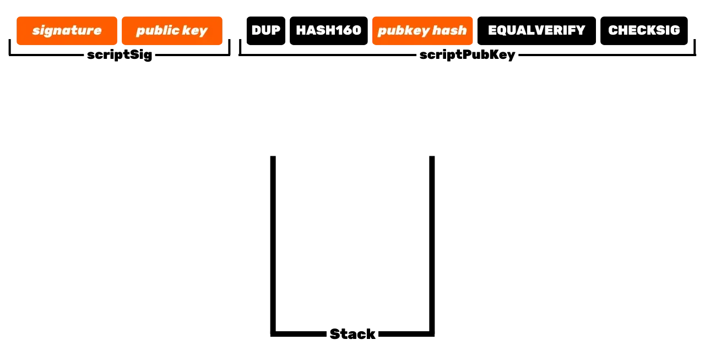

- _scriptSig_ помещается на стек:


- `OP_DUP` дублирует публичный ключ, предоставленный в _scriptSig_, на стеке:

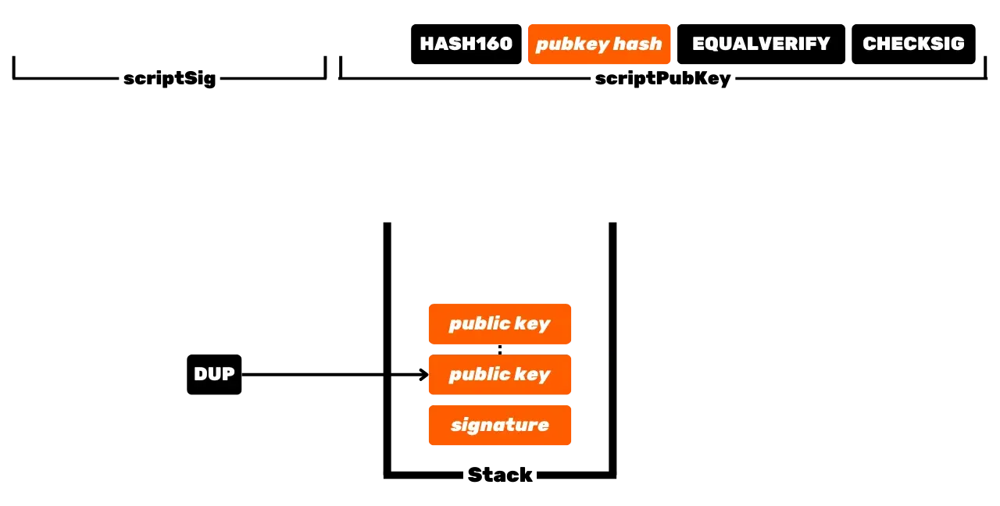

- `OP_HASH160` возвращает хеш только что дублированного публичного ключа:

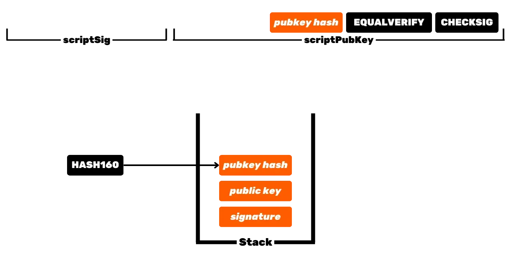

- `OP_PUSHBYTES_20 <pubKeyHash>` помещает Bitcoin-адрес, содержащийся в _scriptPubKey_, на стек:

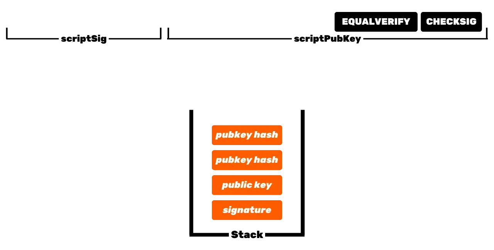

- `OP_EQUALVERIFY` проверяет, что хешированный публичный ключ соответствует предоставленному адресу получателя:

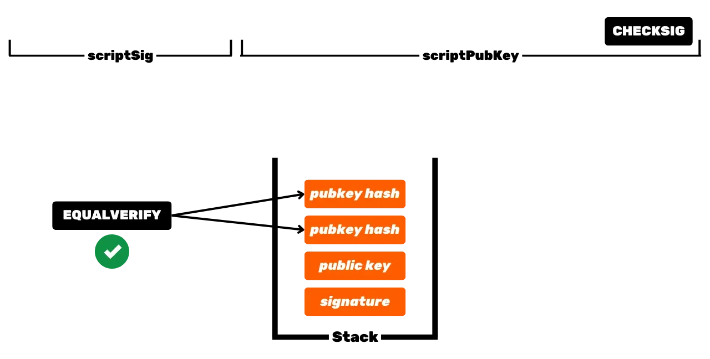
`OP_CHECKSIG` проверяет подпись, содержащуюся в _scriptSig_, используя публичный ключ. Этот оператор, по сути, выполняет проверку подписи, как мы описали в третьей части этого обучения:


- Если на стеке остаётся `1`, то скрипт действителен:


Таким образом, подводя итог, этот скрипт позволяет проверять с помощью цифровой подписи, что пользователь, заявляющий о владении этим UTXO и желающий его потратить, действительно обладает приватным ключом, ассоциированным с адресом получателя, использованным при создании этого UTXO.

### Различные типы Bitcoin-адресов

С течением времени в Bitcoin было добавлено несколько стандартных моделей скриптов. Каждая из них использует отдельный тип адреса получателя. Вот обзор основных доступных на данный момент моделей скриптов:

**P2PK (_Pay-to-PubKey_)**:

Эта модель скрипта была введена в первой версии Bitcoin Сатоши Накамото. Скрипт P2PK блокирует биткоины непосредственно с использованием сырого публичного ключа (таким образом, с этой моделью не используется адрес получателя). Его структура проста: он содержит публичный ключ и требует соответствующей цифровой подписи для разблокировки средств. Этот скрипт является частью стандарта "_Legacy_".

**P2PKH (_Pay-to-PubKey-Hash_)**:

Как и P2PK, скрипт P2PKH был введён при запуске Bitcoin. В отличие от своего предшественника, он блокирует биткоины с использованием хеша публичного ключа, а не непосредственно сырого публичного ключа. _scriptSig_ должен затем предоставить публичный ключ, ассоциированный с адресом получателя, а также действительную подпись. Адреса, соответствующие этой модели, начинаются с `1` и кодируются в _base58check_. Этот скрипт также принадлежит к стандарту "_Legacy_".

**P2SH (_Pay-to-Script-Hash_)**:
Введенная в 2012 году с BIP16, модель P2SH позволяет использовать хеш произвольного скрипта в _scriptPubKey_. Этот хешированный скрипт, называемый "_redeemScript_", содержит условия для разблокировки средств. Для того чтобы потратить UTXO, заблокированный с помощью P2SH, необходимо предоставить _scriptSig_, содержащий оригинальный _redeemScript_, а также необходимые данные для его проверки. Эта модель особенно используется для старых мультисигнатур. Адреса, ассоциированные с P2SH, начинаются с `3` и кодируются в _base58check_. Этот скрипт также относится к стандарту "_Legacy_".

**P2WPKH (_Pay-to-Witness-PubKey-Hash_)**:
Этот скрипт похож на P2PKH, так как он также блокирует биткойны, используя хеш публичного ключа. Однако, в отличие от P2PKH, _scriptSig_ перемещается в отдельный раздел, называемый "_Witness_". Иногда это также называют "_scriptWitness_", чтобы обозначить набор, состоящий из подписи и публичного ключа. У каждого входа SegWit есть свой _scriptWitness_, и совокупность _scriptWitnesses_ составляет поле _Witness_ транзакции. Это перемещение данных подписи является инновацией, введенной обновлением SegWit, направленной в частности на предотвращение изменчивости транзакций из-за подписей ECDSA.
Адреса P2WPKH используют кодировку _bech32_ и всегда начинаются с `bc1q`. Этот тип скрипта соответствует выходам SegWit версии 0.

**P2WSH (_Pay-to-Witness-Script-Hash_)**:

Модель P2WSH также была введена с обновлением SegWit в августе 2017 года. Похожа на модель P2SH, она блокирует биткойны, используя хеш скрипта. Основное отличие заключается в том, как подписи и скрипты включаются в транзакцию. Для того чтобы потратить биткойны, заблокированные этим типом скрипта, получатель должен предоставить оригинальный скрипт, называемый _witnessScript_ (эквивалент _redeemScript_ в P2SH), вместе с необходимыми данными для проверки этого _witnessScript_. Этот механизм позволяет реализовать более сложные условия расходования, такие как мультисигнатуры.

Адреса P2WSH используют кодировку _bech32_ и всегда начинаются с `bc1q`. Этот скрипт также соответствует выходам SegWit версии 0.

**P2TR (_Pay-to-Taproot_)**:

Модель P2TR была введена с реализацией Taproot в ноябре 2021 года. Она основана на протоколе Schnorr для агрегации криптографических ключей, а также на дереве Меркла для альтернативных скриптов, называемых MAST (_Merkelized Alternative Script Tree_). В отличие от других типов скриптов, где условия расходования публично обнародуются (либо при получении, либо при расходовании), P2TR позволяет скрывать сложные скрипты за одним, видимым публичным ключом.

Технически, скрипт P2TR блокирует биткойны на уникальном публичном ключе Schnorr, обозначаемом как $Q$. Этот ключ $Q$ на самом деле является агрегатом публичного ключа $P$ и публичного ключа $M$, последний из которых рассчитывается из корня Меркла списка _scriptPubKey_. Биткойны, заблокированные этим типом скрипта, могут быть потрачены двумя способами:

- Публикацией подписи для публичного ключа $P$ (_key path_).
- Удовлетворением одного из скриптов, содержащихся в дереве Меркла (_script path_).
  P2TR, таким образом, предлагает большую гибкость, поскольку позволяет блокировать биткойны либо с уникальным публичным ключом, либо с несколькими выбранными скриптами, либо одновременно с обоими. Преимущество этой структуры дерева Меркла заключается в том, что во время транзакции раскрывается только используемый скрипт расходования, но все другие альтернативные скрипты остаются секретными. 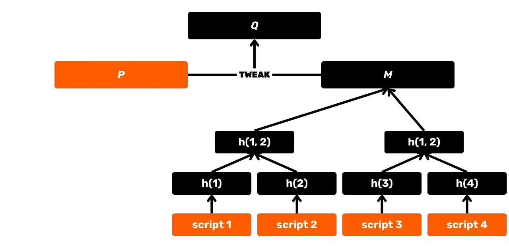

P2TR соответствует выходам SegWit версии 1, что означает, что подписи для входов P2TR хранятся в разделе _Witness_ транзакции, а не в _scriptSig_. Адреса P2TR используют кодировку _bech32m_ и начинаются с `bc1p`, но они довольно уникальны, поскольку для их создания не используется хеш-функция. Действительно, они напрямую представляют публичный ключ $Q$, который просто форматируется с метаданными. Таким образом, это модель скрипта, близкая к P2PK.

Теперь, когда мы рассмотрели теорию, перейдем к практике! В следующей главе я предлагаю вывести как адрес SegWit v0, так и адрес SegWit v1 из пары ключей.

## Производство Адреса

<chapterId>3ebdc750-4135-4881-b07e-08965941b93e</chapterId>

Давайте вместе разберемся, как генерировать адрес для получения из пары ключей, расположенных, например, на глубине 5 HD-кошелька. Этот адрес затем может быть использован в программном обеспечении кошелька для блокировки UTXO.

Поскольку процесс генерации адреса зависит от принятой модели скрипта, давайте сосредоточимся на двух конкретных случаях: генерации адреса SegWit v0 в P2WPKH и адреса SegWit v1 в P2TR. Эти два типа адресов охватывают подавляющее большинство сегодняшних использований.

### Сжатие Публичного Ключа

После выполнения всех шагов производства от мастер-ключа до глубины 5 с использованием соответствующих индексов, мы получаем пару ключей ($k$, $K$), где $K = k \cdot G$. Хотя этот публичный ключ можно использовать как есть для блокировки средств по стандарту P2PK, это не наша цель здесь. Вместо этого мы стремимся создать адрес в P2WPKH в первом случае, а затем в P2TR для другого примера.

Первый шаг - сжать публичный ключ $K$. Чтобы хорошо понять этот процесс, давайте сначала вспомним некоторые основы, рассмотренные в части 3.
Публичный ключ в Bitcoin - это точка $K$, расположенная на эллиптической кривой. Он представлен в виде $(x, y)$, где $x$ и $y$ - координаты точки. В несжатом виде этот публичный ключ имеет размер 520 бит: 8 бит для префикса (начальное значение `0x04`), 256 бит для координаты $x$ и 256 бит для координаты $y$.
Однако эллиптические кривые имеют свойство симметрии относительно оси x: для данной координаты $x$ существуют только два возможных значения для $y$: $y$ и $-y$. Эти две точки расположены по разные стороны от оси x. Другими словами, если мы знаем $x$, достаточно указать, четное или нечетное значение $y$, чтобы идентифицировать точное положение точки на кривой.

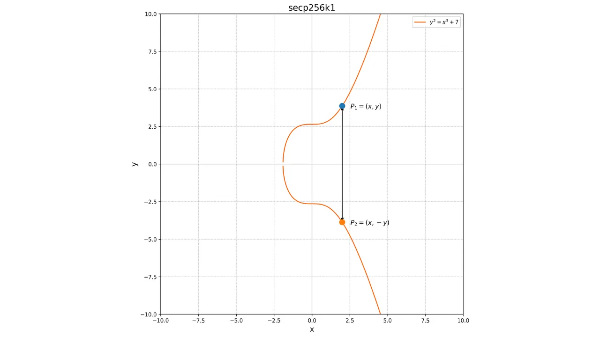
Для сжатия публичного ключа кодируется только $x$, который занимает 256 бит, и добавляется префикс для указания четности $y$. Этот метод уменьшает размер публичного ключа до 264 бит вместо исходных 520. Префикс `0x02` указывает, что $y$ четное, а префикс `0x03` указывает, что $y$ нечетное.
Давайте рассмотрим пример для лучшего понимания, с исходным публичным ключом в несжатом представлении:

```text
K = 04678afdb0fe5548271967f1a67130b7105cd6a828e03909a67962e0ea1f61deb649f6bc3f4cef38c4f35504e51ec112de5c384df7ba0b8d578a4c702b6bf11d5f
```

Если мы разложим этот ключ, у нас есть:

- Префикс: `04`;
- $x$: `678afdb0fe5548271967f1a67130b7105cd6a828e03909a67962e0ea1f61deb6`;
- $y$: `49f6bc3f4cef38c4f35504e51ec112de5c384df7ba0b8d578a4c702b6bf11d5f`

Последний шестнадцатеричный символ $y$ - `f`. В десятичной системе `f = 15`, что соответствует нечетному числу. Следовательно, $y$ нечетное, и префикс будет `0x03`, чтобы указать это.

Сжатый публичный ключ становится:

```text
K = 03678afdb0fe5548271967f1a67130b7105cd6a828e03909a67962e0ea1f61deb6
```

Эта операция применяется ко всем моделям скриптов, основанным на ECDSA, то есть ко всем, кроме P2TR, который использует Schnorr. В случае с Schnorr, как объясняется в части 3, мы сохраняем только значение $x$, не добавляя префикс для указания четности $y$, в отличие от ECDSA. Это стало возможным благодаря тому, что для всех ключей произвольно выбрана уникальная четность. Это позволяет немного сократить необходимое пространство для хранения публичных ключей.

### Получение адреса SegWit v0 (bech32)

Теперь, когда мы получили наш сжатый публичный ключ, мы можем получить из него адрес для получения SegWit v0.

Первый шаг - применение хеш-функции HASH160 к сжатому публичному ключу. HASH160 - это композиция двух последовательных хеш-функций: SHA256, за которой следует RIPEMD160:


$$

\text{HASH160}(K) = \text{RIPEMD160}(\text{SHA256}(K))

$$

Сначала мы пропускаем ключ через SHA256:

```text
SHA256(K) = C489EBD66E4103B3C4B5EAFF462B92F5847CA2DCE0825F4997C7CF57DF35BF3A
```

Затем мы пропускаем результат через RIPEMD160:

```text
RIPEMD160(SHA256(K)) = 9F81322CC88622CA4CCB2A52A21E2888727AA535
```

Мы получили 160-битный хеш публичного ключа, который составляет то, что называется полезной нагрузкой адреса. Эта полезная нагрузка представляет собой центральную и наиболее важную часть адреса. Она также используется в _scriptPubKey_ для блокировки UTXO.

Однако, чтобы сделать эту полезную нагрузку более удобной для использования людьми, к ней добавляются метаданные. Следующий шаг включает кодирование этого хеша в группы по 5 бит в десятичной системе. Это преобразование в десятичные числа будет полезно для конвертации в _bech32_, используемый адресами после SegWit. Таким образом, 160-битный двоичный хеш делится на 32 группы по 5 бит:


$$

\begin{array}{|c|c|}
\hline
\text{5-битные группы} & \text{Десятичное значение} \\
\hline
10011 & 19 \\
11110 & 30 \\
00000 & 0 \\
10011 & 19 \\
00100 & 4 \\
01011 & 11 \\
00110 & 6 \\
01000 & 8 \\
10000 & 16 \\
11000 & 24 \\
10001 & 17 \\
01100 & 12 \\
10100 & 20 \\
10011 & 19 \\
00110 & 6 \\
01011 & 11 \\
00101 & 5 \\
01001 & 9 \\
01001 & 9 \\
01010 & 10 \\
00100 & 4 \\
00111 & 7 \\
10001 & 17 \\
\end{array}

$$

Итак, у нас есть:

```text
HASH = 19 30 00 19 04 11 06 08 16 24 17 12 20 19 06 11 05 09 09 10 04 07 17 08 17 01 25 07 21 09 09 21
```

После кодирования хеша в группы по 5 бит к адресу добавляется контрольная сумма. Эта контрольная сумма используется для проверки того, что полезная нагрузка адреса не была изменена во время её хранения или передачи. Например, она позволяет программному обеспечению кошелька убедиться, что вы не сделали опечатку при вводе адреса получателя. Без этой проверки вы могли бы случайно отправить биткоины на неправильный адрес, что привело бы к безвозвратной потере средств, так как вы не владеете соответствующим публичным или приватным ключом. Таким образом, контрольная сумма является защитой от человеческих ошибок.

Для старых адресов Bitcoin _Legacy_ контрольная сумма просто вычислялась с начала хеша адреса с помощью функции HASH256. С введением SegWit и формата _bech32_ теперь используются коды BCH (_Bose, Ray-Chaudhuri и Hocquenghem_). Эти коды для исправления ошибок используются для обнаружения и исправления ошибок в последовательностях данных. Они обеспечивают целостность передаваемой информации при её доставке в пункт назначения, даже в случае незначительных изменений. Коды BCH используются во многих областях, таких как SSD, DVD и QR-коды. Например, благодаря этим кодам BCH частично закрытый QR-код все еще может быть прочитан и декодирован.

В контексте Bitcoin коды BCH предлагают лучший компромисс между размером и способностью обнаружения ошибок по сравнению с простыми хеш-функциями, используемыми для адресов _Legacy_. Однако на Bitcoin коды BCH используются только для обнаружения ошибок, а не для их исправления. Таким образом, программное обеспечение кошелька будет сигнализировать о неправильном адресе получателя, но не будет автоматически исправлять его. Это ограничение намеренное: разрешение автоматического исправления снизило бы способность обнаружения ошибок.

Для расчета контрольной суммы с использованием кодов BCH нам нужно подготовить несколько элементов:

- **Человекочитаемая часть (HRP)**: Для основной сети Bitcoin, HRP это `bc`;
  HRP должен быть расширен путем разделения каждого символа на две части:
- Взятие символов HRP в ASCII:
  - `b`: `01100010`
- `c`: `01100011`
- Извлечение 3 наиболее значимых битов и 5 наименее значимых битов:
  - 3 наиболее значимых бита: `011` (3 в десятичной системе)
  - 3 наиболее значимых бита: `011` (3 в десятичной системе)
  - 5 наименее значимых битов: `00010` (2 в десятичной системе)
  - 5 наименее значимых битов: `00011` (3 в десятичной системе)

С разделителем `0` между двумя символами, расширение HRP, следовательно, будет:

```text
03 03 00 02 03
```

- **Версия свидетеля (witness version)**: Для SegWit версии 0, это `00`;

- **Полезная нагрузка (payload)**: Десятичные значения хеша публичного ключа;

- **Резервирование для контрольной суммы**: Мы добавляем 6 нулей `[0, 0, 0, 0, 0, 0]` в конец последовательности.

Все данные, объединенные для ввода в программу для расчета контрольной суммы, следующие:

```text
HRP = 03 03 00 02 03
SEGWIT v0 = 00
HASH = 19 30 00 19 04 11 06 08 16 24 17 12 20 19 06 11 05 09 09 10 04 07 17 08 17 01 25 07 21 09 09 21
CHECKSUM = 00 00 00 00 00 00

INPUT = 03 03 00 02 03 00 19 30 00 19 04 11 06 08 16 24 17 12 20 19 06 11 05 09 09 10 04 07 17 08 17 01 25 07 21 09 09 21 00 00 00 00 00 00
```

Расчет контрольной суммы довольно сложен. Он включает в себя арифметику конечных полей полиномов. Мы не будем подробно останавливаться на этом расчете здесь и перейдем непосредственно к результату. В нашем примере полученная контрольная сумма в десятичной системе:

```text
10 16 11 04 13 18
```

Теперь мы можем построить адрес получателя, последовательно соединив следующие элементы:

- **Версия SegWit**: `00`
- **Полезная нагрузка**: Хеш публичного ключа
- **Контрольная сумма**: Значения, полученные на предыдущем шаге (`10 16 11 04 13 18`)

Это дает нам в десятичной системе:

```text
00 19 30 00 19 04 11 06 08 16 24 17 12 20 19 06 11 05 09 09 10 04 07 17 08 17 01 25 07 21 09 09 21 10 16 11 04 13 18
```

Затем каждое десятичное значение должно быть сопоставлено с его символом _bech32_ с использованием следующей таблицы преобразования:


$$

Для преобразования значения в символ _bech32_ с использованием этой таблицы, просто найдите значения в первом столбце и первой строке, которые, будучи сложенными вместе, дают желаемый результат. Затем извлеките соответствующий символ. Например, десятичное число `19` будет преобразовано в букву `n`, потому что $19 = 16 + 3$.
Отображая все наши значения, мы получаем следующий адрес:

```
qn7qnytxgsc3v5nxt9ff2y83g3pe849942stydj
```

Остается только добавить HRP `bc`, который указывает, что это адрес для основной сети Bitcoin, а также разделитель `1`, чтобы получить полный адрес получения:

```
bc1qn7qnytxgsc3v5nxt9ff2y83g3pe849942stydj
```

Особенность алфавита _bech32_ заключается в том, что он включает все алфавитно-цифровые символы, кроме `1`, `b`, `i` и `o`, чтобы избежать визуальной путаницы между похожими символами, особенно во время их ввода или чтения человеком.

В качестве резюме, вот процесс вывода:

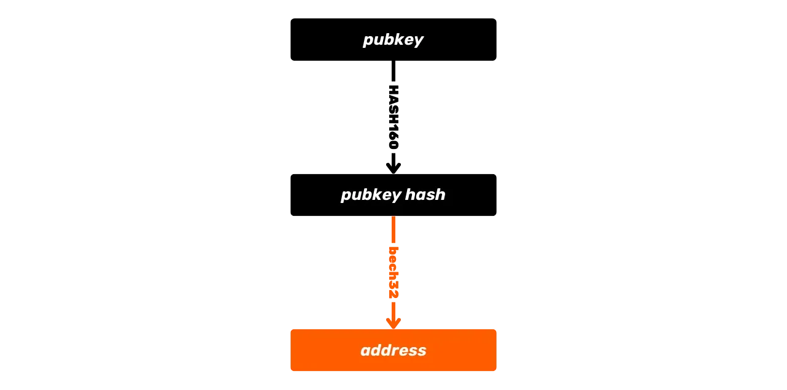

Вот как получить адрес получения P2WPKH (SegWit v0) из пары ключей. Теперь перейдем к адресам P2TR (SegWit v1 / Taproot) и рассмотрим их процесс генерации.

### Вывод адреса SegWit v1 (bech32m)

Для адресов Taproot процесс генерации немного отличается. Давайте рассмотрим это вместе!

С этапа сжатия публичного ключа появляется первое отличие по сравнению с ECDSA: публичные ключи, используемые для Schnorr в Bitcoin, представлены только их абсциссой ($x$). Поэтому нет префикса, и сжатый ключ точно измеряет 256 бит.
Как мы видели в предыдущей главе, скрипт P2TR блокирует биткойны на уникальном публичном ключе Schnorr, обозначенном как $Q$. Этот ключ $Q$ является агрегатом двух публичных ключей: $P$, основного внутреннего публичного ключа, и $M$, публичного ключа, полученного из корня Меркла списка _scriptPubKey_. Биткойны, заблокированные с этим типом скрипта, могут быть потрачены двумя способами:

- Публикацией подписи для публичного ключа $P$ (_путь ключа_);
- Удовлетворением одного из скриптов, включенных в дерево Меркла (_путь скрипта_).

На самом деле, эти два ключа не "агрегированы" в прямом смысле. Вместо этого ключ $P$ модифицируется ключом $M$. В криптографии "модифицировать" публичный ключ означает изменить этот ключ, применив добавочное значение, называемое "модификатором". Эта операция позволяет модифицированному ключу оставаться совместимым с оригинальным приватным ключом и модификатором. Технически, модификатор - это скалярное значение $t$, которое добавляется к исходному публичному ключу. Если $P$ - оригинальный публичный ключ, модифицированный ключ становится:

$$

P' = P + tG


$$

Где $G$ - генератор эллиптической кривой, используемой. Эта операция производит новый публичный ключ, производный от оригинального ключа, сохраняя при этом криптографические свойства, позволяющие его использовать.
Если вам не нужно добавлять альтернативные скрипты (траты исключительно через _ключевой путь_), вы можете сгенерировать адрес Taproot, основанный только на публичном ключе, находящемся на глубине 5 вашего кошелька. В этом случае необходимо создать неиспользуемый скрипт для _скриптового пути_, чтобы удовлетворить требованиям структуры. Затем корректировка $t$ рассчитывается путем применения функции хеширования с тегом, **`TapTweak`**, к внутреннему публичному ключу $P$:

$$

t = \text{H}\_{\text{TapTweak}}(P)


$$

где:

- **$\text{H}_{\text{TapTweak}}$** - это хеш-функция SHA256 с тегом `TapTweak`. Если вы не знакомы с тем, что такое хеш-функция с тегом, я приглашаю вас ознакомиться с разделом 3.3;
- $P$ - это внутренний публичный ключ, представленный в его сжатом 256-битном формате, использующий только координату $x$.

Публичный ключ Taproot $Q$ затем рассчитывается путем добавления корректировки $t$, умноженной на генератор эллиптической кривой $G$, к внутреннему публичному ключу $P$:

$$

Q = P + t \cdot G


$$

После получения публичного ключа Taproot $Q$ мы можем сгенерировать соответствующий адрес получения. В отличие от других форматов, адреса Taproot не основаны на хеше публичного ключа. Следовательно, ключ $Q$ вставляется непосредственно в адрес в необработанном виде.

Для начала мы извлекаем координату $x$ точки $Q$, чтобы получить сжатый публичный ключ. На этом полезной нагрузке рассчитывается контрольная сумма с использованием кодов BCH, как и в адресах SegWit v0. Однако программа, используемая для адресов Taproot, немного отличается. Действительно, после введения формата _bech32_ с SegWit был обнаружен баг: когда последний символ адреса является `p`, вставка или удаление `q` непосредственно перед этим `p` не делает контрольную сумму недействительной. Хотя этот баг не имеет последствий для SegWit v0 (благодаря ограничению размера), в будущем он мог бы стать проблемой. Этот баг, таким образом, был исправлен для адресов Taproot, и новый исправленный формат называется "_bech32m_".

Адрес Taproot генерируется путем кодирования координаты $x$ $Q$ в формате _bech32m_, с следующими элементами:

- **HRP (_Human Readable Part_)**: `bc`, чтобы указать основную сеть Bitcoin;
- **Версия**: `1` для указания Taproot / SegWit v1;
- **Контрольная сумма**.

Итак, конечный адрес будет иметь формат:

```
bc1p[Qx][checksum]
```

С другой стороны, если вы хотите добавить альтернативные скрипты в дополнение к тратам с внутренним публичным ключом (_скриптовый путь_), расчет адреса получения будет немного отличаться. Вам нужно будет включить хеш альтернативных скриптов в расчет корректировки. В Taproot каждый альтернативный скрипт, расположенный в конце дерева Меркла, называется "листом".

После написания различных альтернативных скриптов, вы должны пропустить их индивидуально через функцию хеширования с тегом `TapLeaf`, сопровождаемую некоторыми метаданными:

$$

\text{h}_{\text{leaf}} = \text{H}_{\text{TapLeaf}} (v \Vert sz \Vert S)


$$

С:

- $v$: номер версии скрипта (по умолчанию `0xC0` для Taproot);
- $sz$: размер скрипта, закодированный в формате _CompactSize_;
- $S$: скрипт.

Различные хеши скриптов ($\text{h}_{\text{leaf}}$) сначала сортируются в лексикографическом порядке. Затем они конкатенируются попарно и передаются через функцию хеширования с тегом `TapBranch`. Этот процесс повторяется итеративно для пошагового построения дерева Меркла:
Хеш ветви \(\text{h}_{\text{branch}}\) вычисляется как функция хеширования с тегом `TapBranch`, применяемая к конкатенации хешей листьев \(\text{h}_{\text{leaf1}} \Vert \text{h}\_{\text{leaf2}}\):

Затем мы продолжаем конкатенацию результатов попарно, передавая их на каждом шаге через функцию хеширования с тегом `TapBranch`, пока не получим корень дерева Меркла:

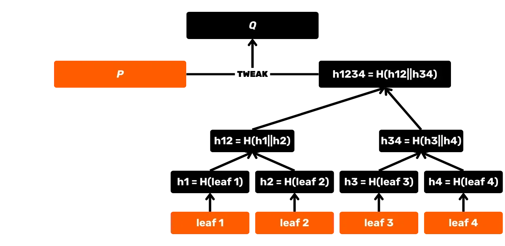

После вычисления корня Меркла \(h*{\text{root}}\) мы можем вычислить модификацию. Для этого мы конкатенируем внутренний публичный ключ кошелька \(P\) с корнем \(h*{\text{root}}\), а затем пропускаем все через функцию хеширования с тегом `TapTweak`:

\[
t = \text{H}_{\text{TapTweak}}(P \Vert h_{\text{root}})
\]

Наконец, как и ранее, публичный ключ Taproot \(Q\) получается путем добавления внутреннего публичного ключа \(P\) к произведению модификации \(t\) на точку генератора \(G\):

\[
Q = P + t \cdot G
\]

Затем генерация адреса следует тому же процессу, используя сырой публичный ключ \(Q\) в качестве полезной нагрузки, сопровождаемой некоторыми дополнительными метаданными.

И вот мы достигли конца этого курса CYP201. Если вы нашли этот курс полезным, я был бы очень благодарен, если бы вы уделили несколько минут, чтобы дать ему хорошую оценку в следующей главе оценки. Не стесняйтесь также делиться им с вашими близкими или в ваших социальных сетях. Наконец, если вы хотите получить ваш диплом по этому курсу, вы можете сдать итоговый экзамен сразу после главы оценки.

# Заключение

<partId>58111408-b734-54db-9ea7-0d5b67f99f99</partId>

## Оцените этот курс

<chapterId>0cd71541-a7fd-53db-b66a-8611b6a28b04</chapterId>
<isCourseReview>true</isCourseReview>

## Итоговый экзамен

<chapterId>a53ea27d-0f84-56cd-b37c-a66210a4b31d</chapterId>
<isCourseExam>true</isCourseExam>

## Заключение

<chapterId>d291428b-3cfa-5394-930e-4b514be82d5a</chapterId>

Мы достигли конца курса CYP201. Надеюсь, он был полезен в вашем обучении о Bitcoin и позволил вам лучше понять функционирование HD-кошельков, которыми вы пользуетесь каждый день. Спасибо, что следили за этим курсом до конца!
На мой взгляд, знания о кошельках фундаментальны, поскольку они соединяют теоретический аспект Bitcoin с его практическим использованием. Действительно, если вы используете Bitcoin, вы неизбежно обращаетесь с программным обеспечением кошелька. Понимание того, как они работают, позволяет вам реализовывать эффективные стратегии безопасности, владея при этом механизмами, рисками и потенциальными слабыми местами. Таким образом, вы можете использовать Bitcoin более безопасно и уверенно.
Если вы еще не сделали этого, приглашаю вас оценить и оставить комментарий к этому курсу. Это бы очень помогло мне. Вы также можете поделиться этим курсом в своих социальных сетях, чтобы распространить эти знания среди как можно большего числа людей.
Чтобы продолжить ваше путешествие вглубь кроличьей норы, я настоятельно рекомендую курс **BTC204**, который я также создал на сети Plan B. Он посвящен конфиденциальности в Bitcoin и исследует ключевые темы: Какова модель приватности? Как работает анализ цепочек? Как использовать Bitcoin оптимально, чтобы максимизировать вашу конфиденциальность? Логичный следующий шаг для углубления ваших навыков!

https://planb.network/courses/btc204
