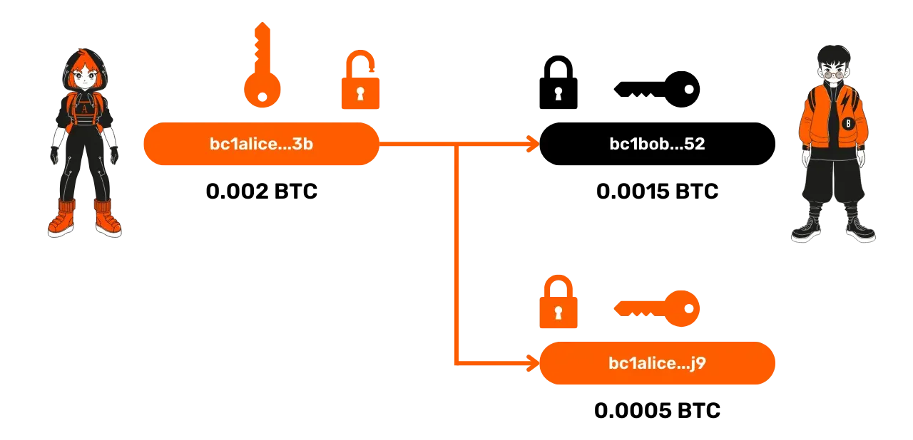
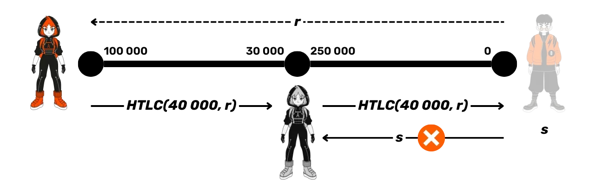
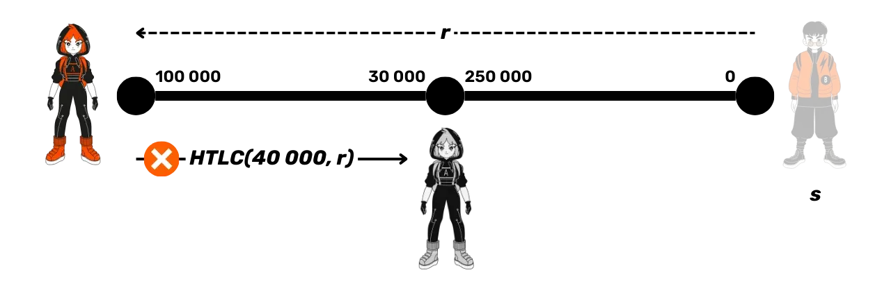
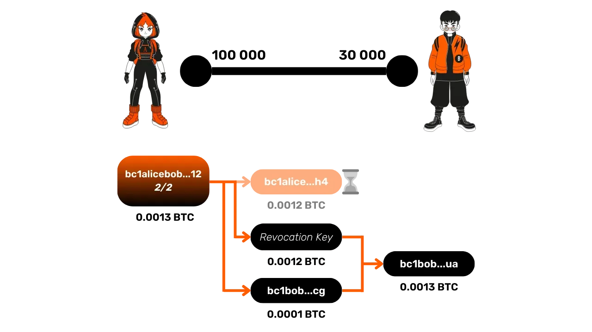
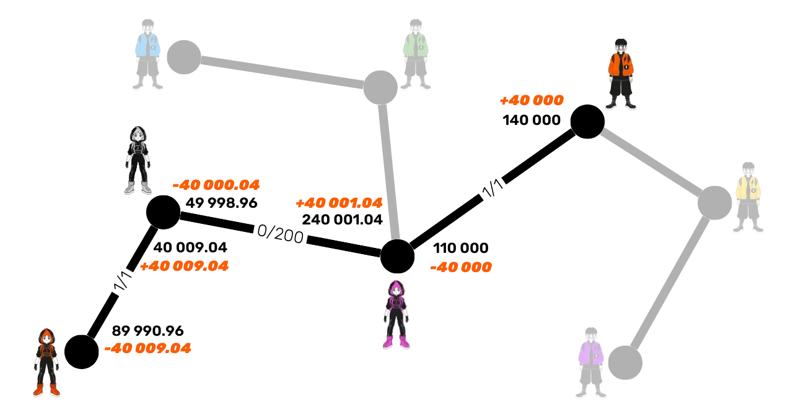
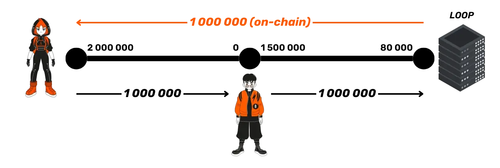

# Un voyage vers la seconde couche de Bitcoin


Plongez au cœur du Lightning Network, un système essentiel pour le futur des transactions Bitcoin. LNP201 est un cours théorique sur le fonctionnement technique de Lightning. Il vous dévoile les fondements et les rouages de ce réseau de seconde couche, conçu pour rendre les paiements en bitcoins rapides, économiques et scalables. 


Grâce à son réseau de canaux de paiements, Lightning permet d'effectuer des transactions rapides et sécurisées sans enregistrer chaque échange sur la blockchain Bitcoin. Au fil des chapitres, vous apprendrez comment fonctionnent l'ouverture, la gestion et la fermeture des canaux, comment les paiements sont acheminés via des nœuds intermédiaires de manière sécurisée tout en minimisant le besoin de confiance, ou encore comment gérer la liquidité. Vous découvrirez ce que sont les transactions d'engagement, les HTLC, les clés de révocation, les mécanismes de punition, le routage en oignon et les invoices.

Que vous soyez un utilisateur de Bitcoin débutant ou plus expérimenté, ce parcours vous apportera des informations précieuses pour comprendre et utiliser le Lightning Network. Bien que nous abordions ensemble certains fondamentaux sur le fonctionnement de Bitcoin dans les premières parties, il est essentiel de maîtriser les bases de l'invention de Satoshi avant de plonger dans LNP201.

Bonne découverte !

+++

# Les fondamentaux

<partId>32647d62-102b-509f-a3ba-ad1d6a4345f1</partId>

## Comprendre le Lightning Network

<chapterId>df6230ae-ff35-56ea-8651-8e65580730a8</chapterId>


Bienvenue dans la formation LNP201 qui vise à expliquer le fonctionnement technique du Lightning Network.

Le Lightning Network est un réseau de canaux de paiement construit au-dessus du protocole Bitcoin, visant à permettre des transactions rapides et à faible coût. Il permet la création de canaux de paiement entre les participants, au sein desquels les transactions peuvent être effectuées presque instantanément et avec des frais minimes, sans avoir à enregistrer chaque transaction individuellement sur la blockchain. Le Lightning Network vise ainsi à améliorer la scalabilité de Bitcoin et à rendre possible son utilisation pour des paiements de faible valeur.

Avant d’explorer l'aspect "réseau", il est important de comprendre le concept de **canal de paiement** sur Lightning, son fonctionnement et ses spécificités. C'est l'objet de ce premier chapitre.

### Le concept de canal de paiement

Un canal de paiement permet à deux parties, ici **Alice** et **Bob**, d'échanger des fonds sur le réseau Lightning. Chaque protagoniste possède un nœud, symbolisé par un cercle, et le canal entre eux est représenté par un segment.


Dans notre exemple, Alice a 100 000 satoshis de son côté du canal, et Bob en possède 30 000, pour un total de 130 000 satoshis, ce qui constitue la **capacité du canal**.

**Mais qu'est-ce qu'un satoshi ?**

Le **satoshi** (ou "sat") est une unité de compte sur Bitcoin. À l’instar d’un centime pour l’euro, un satoshi est simplement une fraction de Bitcoin. Un satoshi équivaut à **0,00000001 Bitcoin**, soit un cent millionième de Bitcoin. Utiliser le satoshi devient de plus en plus pratique à mesure que la valeur de Bitcoin augmente.

### L'allocation des fonds dans le canal

Revenons au canal de paiement. La notion clé ici est celle de "**côté du canal**". Chaque participant possède des fonds de son côté du canal : Alice 100 000 satoshis et Bob 30 000. Comme nous l'avons vu, la somme de ces fonds représente la capacité totale du canal, un élément fixé lors de son ouverture.


Prenons un exemple de transaction Lightning. Si Alice souhaite envoyer 40 000 satoshis à Bob, cela est possible, car elle dispose de suffisamment de fonds (100 000 satoshis). Après cette transaction, Alice aura 60 000 satoshis de son côté et Bob 70 000.


La **capacité du canal**, soit 130 000 satoshis, reste constante. Ce qui change, c'est l'allocation des fonds. Ce système ne permet pas d'envoyer plus de fonds que ce que l'on possède. Par exemple, si Bob souhaitait renvoyer 80 000 satoshis à Alice, il ne pourrait pas, car il n'en possède que 70 000.

Une autre manière d'imaginer l'allocation des fonds est d'imaginer un **curseur** qui indique où se trouvent les fonds dans le canal. Au départ, avec 100 000 satoshis pour Alice et 30 000 pour Bob, le curseur est logiquement du côté d'Alice. Après la transaction de 40 000 satoshis, le curseur se déplacera légèrement du côté de Bob, qui possède désormais 70 000 satoshis.


Cette représentation peut être utile pour imaginer l'équilibre des fonds dans un canal.

### Les règles fondamentales d’un canal de paiement

Le premier point à retenir est que la **capacité du canal** est fixe. C’est un peu comme le diamètre d’un tuyau : il détermine la quantité maximale de fonds que l’on peut envoyer en une seule fois à travers le canal.

Prenons un exemple : si Alice possède 130 000 satoshis de son côté, elle ne peut envoyer à Bob que 130 000 satoshis au maximum en une seule transaction. Cependant, Bob pourra ensuite renvoyer ces fonds à Alice, partiellement ou en totalité.

Ce qu’il est important de comprendre, c’est que la capacité fixe du canal limite le montant maximal d’une transaction, mais pas le nombre total de transactions possibles, ni le volume global de fonds échangés au sein du canal.

**Que devez-vous retenir de ce chapitre ?**
- La capacité d’un canal est fixe et détermine le montant maximal pouvant être envoyé en une seule transaction.
- Les fonds d’un canal sont répartis entre les deux participants, et chacun ne peut envoyer à l'autre que les fonds qu'il possède de son côté.
- Le Lightning Network permet ainsi d’échanger des fonds de manière rapide et efficace, tout en respectant les limitations imposées par la capacité des canaux.

C’est la fin de ce premier chapitre, où nous avons posé les bases du Lightning Network. Nous verrons dans les prochains comment ouvrir un canal et approfondirons les concepts abordés ici.

## Bitcoin, adresses, UTXO et transactions

<chapterId>0cfb7e6b-96f0-508b-9210-90bc1e28649d</chapterId>


Ce chapitre est un peu particulier puisqu'il ne sera pas directement consacré à Lightning, mais à Bitcoin. En effet, le Lightning Network est une surcouche de Bitcoin. Il est donc essentiel de bien comprendre certains concepts fondamentaux de Bitcoin pour appréhender correctement le fonctionnement de Lightning par la suite dans les prochains chapitres. Dans ce chapitre, nous allons revoir les bases sur les adresses de réception Bitcoin, les UTXOs, ainsi que le fonctionnement des transactions Bitcoin.

### Les adresses Bitcoin, les clés privées et les clés publiques

Une adresse Bitcoin est une suite de caractères dérivée d'une **clé publique**, elle-même calculée à partir d'une **clé privée**. Comme vous le savez sûrement, on l'utilise pour verrouiller des bitcoins, ce qui équivaut à les recevoir sur notre portefeuille.

La clé privée est un élément secret qui **ne doit jamais être partagé**, alors que la clé publique et l'adresse peuvent être partagées sans risque de sécurité (leur divulgation représente seulement un risque pour votre confidentialité). Voici une représentation commune que nous adopterons tout au long de cette formation : 
- Les **clés privées** seront représentées **à la verticale**.
- Les **clés publiques** seront représentées **à l'horizontale**.
- Leur couleur permet d'indiquer qui en a la possession (Alice en orange et Bob en noir...).

### Les transactions Bitcoin : envoi de fonds et scripts

Sur Bitcoin, une transaction consiste à envoyer des fonds d'une adresse à une autre. Prenons l'exemple d'Alice qui envoie 0,002 Bitcoin à Bob. Alice utilise la clé privée associée à son adresse pour **signer** la transaction, prouvant ainsi qu'elle est bien en mesure de dépenser ces fonds. Mais que se passe-t-il exactement derrière cette transaction ? Les fonds sur une adresse Bitcoin sont verrouillés par un **script**, une sorte de mini-programme qui impose certaines conditions pour dépenser les fonds.

Le script le plus courant demande une signature avec la clé privée associée à l'adresse. Lorsque Alice signe une transaction avec sa clé privée, elle **déverrouille le script** qui bloque les fonds, et ces derniers peuvent alors être transférés. Le transfert des fonds implique l'ajout d'un nouveau script sur ces fonds, stipulant que pour les dépenser, il faudra cette fois-ci la signature avec la clé privée de **Bob**.


### Les UTXO : Unspent Transaction Outputs

Sur Bitcoin, ce que nous échangeons réellement ne sont pas directement des bitcoins, mais des **UTXO** (*Unspent Transaction Outputs*), c'est-à-dire des "sorties de transactions non dépensées". 

Un UTXO est un morceau de bitcoin qui peut être de n'importe quelle valeur, par exemple **2 000 bitcoins**, **8 bitcoins** ou encore **8 000 sats**. Chaque UTXO est bloqué par un script, et pour le dépenser, il faut satisfaire les conditions du script, souvent une signature avec la clé privée correspondant à une adresse de réception donnée.

Les UTXO ne peuvent pas être divisés. Chaque fois qu'ils sont utilisés pour dépenser le montant en bitcoins qu'ils représentent, il faut le faire en totalité. C'est un peu comme un billet de banque : si vous avez un billet de 10 € et que vous devez 5 € au boulanger, vous ne pouvez pas simplement couper le billet en deux. Vous devez lui donner le billet de 10 €, et il vous rendra 5 € de monnaie. C'est exactement le même principe pour les UTXO sur Bitcoin ! Par exemple, lorsque Alice débloque un script avec sa clé privée, elle déverrouille l'UTXO entier. Si elle souhaite n'envoyer qu'une partie des fonds représentés par cet UTXO à Bob, elle peut le "fragmenter" en plusieurs plus petits. Elle enverra alors 0.0015 BTC à Bob et se renverra le reste, 0.0005 BTC sur une **adresse de change**.

Voici un exemple de transaction avec 2 sorties :

- Un UTXO de 0.0015 BTC pour Bob, bloqué par un script exigeant la signature avec la clé privée de Bob.
- Un UTXO de 0.0005 BTC pour Alice, bloqué par un script nécessitant sa propre signature.



### Les adresses multisignatures

En plus des adresses simples générées à partir d'une seule clé publique, il est possible de créer des **adresses multisignatures** à partir de plusieurs clés publiques. Un cas particulier intéressant pour le Lightning Network est l'**adresse multisignature 2/2**, générée à partir de deux clés publiques :


Pour dépenser les fonds verrouillés avec cette adresse multisignature 2/2, il faut signer avec les deux clés privées associées aux clés publiques.


Ce type d'adresse est justement la représentation sur la blockchain Bitcoin des canaux de paiement sur le Lightning Network.

**Que devez-vous retenir de ce chapitre ?**
- Une **adresse Bitcoin** est dérivée d'une clé publique, elle-même dérivée d'une clé privée.
- Les fonds sur Bitcoin sont verrouillés par des **scripts**, et pour dépenser ces fonds, il faut satisfaire le script, ce qui revient généralement à fournir une signature avec la clé privée correspondante.
- Les **UTXO** sont des morceaux de bitcoins bloqués par des scripts, et chaque transaction sur Bitcoin consiste à déverrouiller un UTXO puis à en créer un ou plusieurs nouveaux en contrepartie.
- Les **adresses multisignatures 2/2** nécessitent la signature de deux clés privées pour dépenser les fonds. Ce sont ces adresses spécifiques que l'on utilise dans le cadre de Lightning pour créer des canaux de paiement.

Ce chapitre sur Bitcoin nous a permis de revoir quelques notions essentielles pour la suite. Dans le prochain chapitre, nous allons justement découvrir comment fonctionne l'ouverture des canaux sur le Lightning Network.


# Ouverture et fermeture des canaux

<partId>900b5b6b-ccd0-5b2f-9424-4b191d0e935d</partId>

## Ouverture de canal

<chapterId>96243eb0-f6b5-5b68-af1f-fffa0cc16bfe</chapterId>


Dans ce chapitre, nous allons voir plus précisément comment ouvrir un canal de paiement sur le Lightning Network et comprendre le lien entre cette opération et le système Bitcoin sous-jacent.

### Les canaux Lightning

Comme nous l'avons vu dans le premier chapitre, un **canal de paiement** sur Lightning peut être comparé à un "tuyau" d’échange de fonds entre deux participants (**Alice** et **Bob** dans nos exemples). La capacité de ce canal correspond à la somme des fonds disponibles de chaque côté. Dans notre exemple, Alice dispose de **100 000 satoshis** et Bob de **30 000 satoshis**, ce qui donne une **capacité totale** de **130 000 satoshis**.


### Les niveaux d’échange d’informations

Il est important de bien distinguer les différents niveaux d’échange sur Lightning :
- **Les communications pair-à-pair (protocole Lightning)** : ce sont les messages que les nœuds Lightning s’envoient pour communiquer. Nous représenterons ces messages en ligne noire pointillée sur nos schémas.
- **Les canaux de paiement (protocole Lightning)** : ce sont les chemins pour échanger des fonds sur Lightning, que nous représenterons en ligne noire.
- **Les transactions Bitcoin (protocole Bitcoin)** : ce sont les transactions effectuées onchain, que nous représenterons en ligne orange.


Notons qu'il est possible pour un nœud Lightning de communiquer via le protocole P2P sans ouvrir de canal, mais pour échanger des fonds, un canal est nécessaire.

### Les étapes pour ouvrir un canal Lightning

1. **Échange de messages** : Alice souhaite ouvrir un canal avec Bob. Elle lui envoie un message contenant le montant qu'elle veut déposer dans le canal (130 000 sats) et sa clé publique. Bob répond en partageant sa propre clé publique.


2. **Création de l’adresse multisignature** : Avec ces deux clés publiques, Alice crée une **adresse multisignature 2/2**, ce qui signifie que les fonds qui seront plus tard déposés sur cette adresse nécessiteront les deux signatures (Alice et Bob) pour être dépensés.


3. **Transaction de dépôt** : Alice prépare une transaction Bitcoin pour déposer des fonds sur cette adresse multisignature. Par exemple, elle peut décider d’envoyer **130 000 satoshis** sur cette adresse multisignature. Cette transaction est **construite mais pas encore publiée** sur la blockchain.


4. **Transaction de retrait** : Avant de publier la transaction de dépôt, Alice construit une transaction de retrait pour pouvoir récupérer ses fonds en cas de problème avec Bob. En effet, lorsque Alice publiera la transaction de dépôt, ses sats seront verrouillés sur une adresse multisignature 2/2 qui nécessite à la fois sa signature, mais également la signature de Bob pour être débloquée. Alice s'assure contre ce risque de perte en construisant la transaction de retrait qui lui permet de récupérer ses fonds.


5. **Signature de Bob** : Alice envoie à Bob la transaction de dépôt pour preuve et lui demande de signer la transaction de retrait. Une fois la signature de Bob obtenue sur la transaction de retrait, Alice est assurée de pouvoir récupérer ses fonds à tout moment, car il ne manque plus que sa propre signature pour déverrouiller le multisignature.


6. **Publication de la transaction de dépôt** : Une fois la signature de Bob obtenue, Alice peut publier la transaction de dépôt sur la blockchain Bitcoin, ce qui marque ainsi l'ouverture officielle du canal Lightning entre les 2 utilisateurs.


### Quand le canal est-il ouvert ?

Le canal est considéré comme ouvert une fois que la transaction de dépôt est incluse dans un bloc Bitcoin et qu'elle a atteint une certaine profondeur de confirmations (nombre de blocs suivants).

**Que devez-vous retenir de ce chapitre ?**
- L'ouverture d’un canal commence par l'échange de **messages** entre les deux parties (échange de montants et de clés publiques).
- Un canal est formé en créant une **adresse multisignature 2/2** et en y déposant des fonds via une transaction Bitcoin.
- La personne qui ouvre le canal s’assure de pouvoir **récupérer ses fonds** grâce à une transaction de retrait signée par l’autre partie avant de publier la transaction de dépôt.

Dans le chapitre suivant, nous allons étudier le fonctionnement technique d'une transaction Lightning dans un canal.

## Transaction d’engagement

<chapterId>7d3fd135-129d-5c5a-b306-d5f2f1e63340</chapterId>


Dans ce chapitre, nous allons découvrir le fonctionnement technique d'une transaction au sein d’un canal sur le Lightning Network, c'est-à-dire lorsque des fonds sont déplacés d'un côté à l'autre du canal.

### Rappel du cycle de vie d’un canal

Comme vu précédemment, un canal Lightning commence par une **ouverture** via une transaction Bitcoin. Le canal peut être **fermé** à tout moment, également via une transaction Bitcoin. Entre ces deux moments, on peut effectuer une quasi-infinité de transactions au sein du canal, sans passer par la blockchain Bitcoin. Voyons ce qui se passe lors d'une transaction dans le canal.


### L'état initial du canal

Au moment de l’ouverture du canal, Alice a déposé **130 000 satoshis** sur l'adresse multisignature du canal. Ainsi, à l'état initial, tous les fonds sont du côté d'Alice. Avant d’ouvrir le canal, Alice avait aussi fait signer à Bob une **transaction de retrait**, qui lui permettrait de récupérer ses fonds si elle souhaitait fermer le canal.


### Transactions non publiées : les transactions d'engagement

Lorsque Alice fait une transaction dans le canal pour envoyer des fonds à Bob, une nouvelle transaction Bitcoin est créée pour refléter ce changement dans la répartition des fonds. Cette transaction, appelée **transaction d’engagement**, n’est pas publiée sur la blockchain, mais représente le nouvel état du canal suite à la transaction Lightning. 

Prenons un exemple avec Alice qui envoie 30 000 satoshis à Bob :
- **Initialement** : Alice possède 130 000 satoshis.
- **Après la transaction** : Alice possède 100 000 satoshis, et Bob 30 000 satoshis.

Pour valider ce transfert, Alice et Bob créent une nouvelle **transaction Bitcoin non publiée** qui enverrait **100 000 satoshis à Alice** et **30 000 satoshis à Bob** depuis l’adresse multisignature. Les deux parties construisent cette transaction de manière indépendante, mais avec les mêmes données (montants et adresses). Une fois construite, chacun signe la transaction et échange sa signature avec l'autre. Cela permet à chacun de publier la transaction à tout moment si nécessaire pour récupérer sa part du canal sur la blockchain principale de Bitcoin.


### Processus de transfert : la facture (invoice)

Lorsque Bob souhaite recevoir des fonds, il envoie à Alice une ***invoice*** pour 30 000 satoshis. Alice procède alors au paiement de cette facture en commençant le transfert au sein du canal. Comme nous l’avons vu, ce processus repose sur la création et la signature d'une nouvelle **transaction d’engagement**.

Chaque transaction d’engagement représente la nouvelle répartition des fonds dans le canal après le transfert. Dans cet exemple, après la transaction, Bob dispose de 30 000 satoshis et Alice de 100 000 satoshis. Si l’un des deux participants décidait de publier cette transaction d'engagement sur la blockchain, elle entraînerait la fermeture du canal et les fonds seraient distribués conformément à cette dernière répartition.


### Nouvel état après une seconde transaction

Prenons un autre exemple : après la première transaction où Alice a envoyé 30 000 satoshis à Bob, Bob décide de renvoyer **10 000 satoshis à Alice**. Cela crée un nouvel état du canal. La nouvelle **transaction d'engagement** représentera cette répartition actualisée : 
- **Alice** possède maintenant **110 000 satoshis**.
- **Bob** possède **20 000 satoshis**.


Encore une fois, cette transaction n’est pas publiée sur la blockchain, mais peut l’être à tout moment en cas de fermeture du canal.

En résumé, lorsque des fonds sont transférés au sein d’un canal Lightning :
- Alice et Bob créent une nouvelle **transaction d'engagement**, qui reflète la nouvelle répartition des fonds.
- Cette transaction Bitcoin est **signée** par les deux parties, mais **non publiée** sur la blockchain Bitcoin tant que le canal reste ouvert.
- Les transactions d’engagement garantissent que chacun des participants peut récupérer ses fonds à tout moment sur la blockchain Bitcoin en publiant la dernière transaction signée.

Cependant, ce système présente une faille potentielle, que nous aborderons dans le prochain chapitre. Nous y verrons comment chaque participant peut se protéger contre une tentative de tricherie de l’autre partie.

## Clé de révocation

<chapterId>f2f61e5b-badb-5947-9a81-7aa530b44e59</chapterId>


Dans ce chapitre, nous allons approfondir le fonctionnement des transactions sur le Lightning Network en abordant les mécanismes de protection contre la tricherie, pour garantir que chaque partie respecte les règles au sein d’un canal.

### Rappel : les transactions d’engagement

Comme vu précédemment, les transactions sur Lightning reposent sur des **transactions d'engagement** non publiées. Ces transactions reflètent la répartition actuelle des fonds dans le canal. Lorsqu'une nouvelle transaction Lightning est effectuée, une nouvelle transaction d'engagement est créée et signée par les deux parties pour refléter le nouvel état du canal.

Prenons un exemple simple :
- **État initial** : Alice possède **100 000 satoshis**, Bob **30 000 satoshis**.
- Après une transaction où Alice envoie **40 000 satoshis** à Bob, la nouvelle transaction d'engagement répartit les fonds ainsi :
  - Alice : **60 000 satoshis**
  - Bob : **70 000 satoshis**


Les deux parties peuvent, à tout moment, publier la **dernière transaction d'engagement** signée pour fermer le canal et récupérer leurs fonds.

### La faille : tricher en publiant une ancienne transaction

Un problème potentiel apparaît si l'une des parties décide de **tricher** en publiant une ancienne transaction d'engagement. Par exemple, Alice pourrait publier une transaction d'engagement plus ancienne où elle possédait **100 000 satoshis**, même si elle n'en a plus que **60 000** dans la réalité. Cela lui permettrait de voler **40 000 satoshis** à Bob.


Pire encore, Alice pourrait publier la toute première transaction de retrait, celle avant l'ouverture du canal, où elle possédait **130 000 satoshis**, et ainsi voler l'intégralité des fonds du canal.


### Solution : la clé de révocation et le timelock

Pour éviter cette tricherie d'Alice, sur le Lightning Network, on ajoute des **mécanismes de sécurité** dans les transactions d’engagement :
1. **Le timelock** : Chaque transaction d'engagement inclut un timelock pour les fonds d'Alice. Le timelock est une primitive de contrat intelligent qui permet de définir une condition temporelle à remplir pour qu'une transaction puisse être ajoutée à un bloc. Cela signifie qu'Alice ne pourra pas récupérer ses fonds avant un certain nombre de blocs si elle publie une des transactions d'engagement. Ce timelock commence à s'appliquer dès la confirmation de la transaction d'engagement. Sa durée est généralement proportionnelle à la taille du canal, mais elle peut également être configurée manuellement.
2. **La clé de révocation** : Les fonds d'Alice peuvent également être dépensés immédiatement par Bob s’il possède la **clé de révocation**. Cette clé est composée d'un secret détenu par Alice et d'un secret détenu par Bob. Notons que ce secret est différent pour chaque transaction d'engagement.

Grâce à ces 2 mécanismes combinés, Bob a le temps de détecter la tentative de tricherie d'Alice, et de la punir en récupérant son output grâce à la clé de révocation, ce qui revient pour Bob à récupérer l'intégralité des fonds du canal. Notre nouvelle transaction d'engagement va donc dorénavant ressembler à cela :


Détaillons ensemble le fonctionnement de ce mécanisme.

### Processus de mise à jour des transactions

Lorsque Alice et Bob mettent à jour l'état du canal avec une nouvelle transaction Lightning, ils s'échangent en amont leurs **secrets** respectifs pour la transaction d'engagement précédente (celle qui va devenir obsolète et qui pourrait permettre à l'un des deux de tricher). Cela signifie que, dans le nouvel état du canal :
- Alice et Bob ont une nouvelle transaction d'engagement représentant la répartition actuelle des fonds après la transaction Lightning.
- Chacun dispose du secret de l'autre pour la transaction précédente, ce qui leur permet d'utiliser la clé de révocation uniquement si l'un d'eux tente de tricher en publiant une transaction avec un ancien état dans les mempools des nœuds Bitcoin. En effet, pour punir l'autre partie, il est nécessaire de détenir à la fois les deux secrets et la transaction d'engagement de l'autre, qui inclut l'input signé. Sans cette transaction, la clé de révocation seule est inutile. La seule façon d'obtenir cette transaction est de la récupérer dans les mempools (dans les transactions en attente de confirmation) ou bien dans les transactions confirmées sur la blockchain pendant le timelock, ce qui prouve que l'autre partie tente de tricher, que ce soit volontairement ou non.

Prenons un exemple pour bien comprendre ce processus :
1. **État initial** : Alice possède **100 000 satoshis**, Bob **30 000 satoshis**.


2. Bob souhaite recevoir 40 000 satoshis d'Alice via leur canal Lightning. Pour ce faire :
	- Il lui envoie une invoice ainsi que son secret pour la clé de révocation de sa transaction d'engagement précédente. 
	- En réponse, Alice lui fournit sa signature pour la nouvelle transaction d'engagement de Bob, ainsi que son secret pour la clé de révocation de sa transaction précédente.
	- Enfin, Bob envoie sa signature pour la nouvelle transaction d'engagement d'Alice. 
	- Ces échanges permettent à Alice d'envoyer **40 000 satoshis** à Bob sur Lightning via leur canal, et les nouvelles transactions d'engagement reflètent désormais cette nouvelle répartition des fonds.


3. Si Alice tente de publier l’ancienne transaction d'engagement où elle possédait encore **100 000 satoshis**, Bob, ayant obtenu la clé de révocation, peut immédiatement récupérer les fonds grâce à cette clé, tandis qu'Alice est bloquée par le timelock.


Même si, dans ce cas, Bob n'a aucun intérêt économique à tenter de tricher, s'il le fait malgré tout, Alice bénéficie également d'une protection symétrique lui offrant les mêmes garanties.

**Que devez-vous retenir de ce chapitre ?**

Les **transactions d'engagement** sur le Lightning Network incluent des mécanismes de sécurité qui réduisent à la fois le risque de tricherie et les incitations à y recourir. Avant de signer une nouvelle transaction d'engagement, Alice et Bob s'échangent leurs **secrets** respectifs pour les transactions d'engagement précédentes. Si Alice tente de publier une ancienne transaction d'engagement, Bob peut utiliser la **clé de révocation** pour récupérer l'intégralité des fonds avant qu’Alice ne le puisse (car elle est bloquée par le timelock), ce qui la punit pour avoir tenté de tricher.

Ce système de sécurité garantit que les participants respectent les règles du Lightning Network, et qu'ils ne peuvent pas tirer profit de la publication d'anciennes transactions d'engagement.

À ce stade de la formation, vous savez donc comment sont ouverts les canaux Lightning et comment fonctionnent les transactions dans ces canaux. Dans le prochain chapitre, nous découvrirons les différentes manières de fermer un canal et de récupérer ses bitcoins sur la blockchain principale.


## Fermeture de canal

<chapterId>29a72223-2249-5400-96f0-3756b1629bc2</chapterId>


Dans ce chapitre, nous allons aborder la **fermeture d'un canal** sur le Lightning Network, qui se réalise au travers d’une transaction Bitcoin, tout comme l’ouverture d’un canal. Après avoir vu comment fonctionnent les transactions au sein d’un canal, il est maintenant temps de voir comment clôturer un canal et récupérer les fonds sur la blockchain Bitcoin.

### Rappel du cycle de vie d'un canal

Le **cycle de vie d’un canal** commence par son **ouverture**, via une transaction Bitcoin, puis on effectue des transactions Lightning au sein de celui-ci, et enfin, lorsque les parties souhaitent récupérer leurs fonds, le canal est **fermé** grâce à une seconde transaction Bitcoin. Les transactions intermédiaires effectuées sur Lightning sont représentées par des **transactions d’engagement** non publiées.


### Les trois types de fermeture de canal

Il existe trois manières principales de fermer ce canal, que l’on peut appeler **le bon, la brute et le truand** (inspiré par Andreas Antonopoulos dans *Mastering the Lightning Network*) :

1. **Le bon** : la **fermeture coopérative**, où Alice et Bob se mettent d'accord pour fermer le canal.
2. **La brute** : la **fermeture forcée**, où l’une des parties décide de fermer le canal de manière honnête, mais sans l'accord de l'autre.
3. **Le truand** : la **fermeture avec tricherie**, où l'une des parties tente de voler des fonds en publiant une ancienne transaction d’engagement (n'importe laquelle, mais pas la dernière, qui reflète la répartition réelle et juste des fonds).

Prenons un exemple :
- Alice possède **100 000 satoshis** et Bob **30 000 satoshis**.
- Cette répartition est reflétée dans **2 transactions d’engagement** (une par utilisateur) qui ne sont pas publiées, mais qui pourraient l’être en cas de fermeture du canal.


### Le bon : la fermeture coopérative

Dans une **fermeture coopérative**, Alice et Bob se mettent d’accord pour fermer le canal. Voici comment cela se passe :

1. Alice envoie un message à Bob via le protocole de communication Lightning pour proposer la fermeture du canal.
2. Bob accepte, et les deux parties ne font plus aucune nouvelle transaction dans le canal.


3. Alice et Bob négocient ensemble les frais de la **transaction de fermeture**. Ces frais sont généralement calculés en fonction du marché de frais de Bitcoin du moment de la fermeture. Il est important de noter que **c’est toujours la personne qui a ouvert le canal** (Alice dans notre exemple) qui paie les frais de fermeture.
4. Ils construisent une nouvelle **transaction de fermeture**. Cette transaction ressemble à une transaction d’engagement, mais sans timelock ni mécanismes de révocation, puisque les deux parties coopèrent et qu’il n’y a aucun risque de tricherie. Cette transaction de fermeture coopérative est donc une transaction différente des transactions d'engagement.

Par exemple, si Alice possède **100 000 satoshis** et Bob **30 000 satoshis**, la transaction de fermeture enverra **100 000 satoshis** à l’adresse d’Alice et **30 000 satoshis** à l’adresse de Bob, sans contraintes de timelock. Une fois cette transaction signée par les deux parties, elle est publiée par Alice. Une fois la transaction confirmée sur la blockchain Bitcoin, le canal Lightning sera officiellement fermé.


La **fermeture coopérative** est la méthode de fermeture à privilégier, car elle est rapide (sans timelock) et les frais de transaction sont ajustés en fonction des conditions actuelles du marché Bitcoin. Cela évite de payer trop peu, ce qui risquerait de bloquer la transaction dans les mempools, ou de surpayer inutilement, ce qui entraine une perte financière inutile pour les participants.

### La brute : la fermeture forcée

Lorsque le nœud d'Alice envoi un message à celui de Bob pour lui demander une fermeture coopérative, si celui-ci ne répond pas (par exemple, en raison d'une coupure Internet ou d'un problème technique), Alice peut procéder à une **fermeture forcée** en publiant la **dernière transaction d'engagement** signée.

Dans ce cas, Alice va simplement publier la dernière transaction d’engagement, qui reflète l'état du canal au moment où la dernière transaction Lightning a eu lieu avec la bonne répartition des fonds.


Cette transaction inclut un **timelock** pour les fonds d'Alice, ce qui rend la fermeture plus lente.


Aussi, les frais de la transaction d’engagement peuvent être inadaptés au moment de la fermeture, car ils ont été définis à l'époque où la transaction a été créée, parfois plusieurs mois auparavant. En général, les clients Lightning surévaluent les frais pour éviter les problèmes futurs, mais cela peut entraîner des frais excessifs, ou bien à l'inverse trop faibles.

En résumé, la **fermeture forcée** est une option de dernier recourt lorsque le pair ne répond plus. Elle est plus lente et moins économique qu'une fermeture coopérative. Elle est donc à éviter autant que possible.

### Le truand : la tricherie

Enfin, une fermeture avec **tricherie** survient lorsque l'une des parties tente de publier une ancienne transaction d’engagement, souvent où elle détenait plus de fonds qu’elle ne devrait. Par exemple, Alice pourrait publier une ancienne transaction où elle possédait **120 000 satoshis**, alors qu’elle n’en possède plus que **100 000** en réalité.


Bob, pour éviter cette triche, surveille la blockchain Bitcoin et son mempool pour s’assurer qu’Alice ne publie pas une ancienne transaction. Si Bob détecte une tentative de tricherie, il peut utiliser la **clé de révocation** pour récupérer les fonds d’Alice et la punir en prenant l’intégralité des fonds du canal. Puisque Alice est bloquée par le timelock sur son output, Bob a le temps de le dépenser sans timelock de son côté pour récupérer toute la somme sur une adresse lui appartenant.


Évidemment, la tricherie peut potentiellement aboutir si Bob ne se manifeste pas dans le délai imposé par le timelock sur l'output d'Alice. Dans ce cas, l'output d'Alice est débloqué, ce qui lui permet de le consommer pour créer un nouvel output vers une adresse qu'elle contrôle.

**Que devez-vous retenir de ce chapitre ?**

Il y a trois façons de fermer un canal :
1. **La fermeture coopérative** : rapide et moins coûteuse, où les deux parties s’entendent pour fermer le canal et publier une transaction de fermeture adaptée.
2. **La fermeture forcée** : moins souhaitable, car elle repose sur la publication d'une transaction d’engagement, avec des frais potentiellement inadaptés et un timelock, ce qui ralentit la fermeture.
3. **La tricherie** : si l'une des parties tente de voler des fonds en publiant une ancienne transaction, l'autre peut utiliser la clé de révocation pour punir cette tricherie.

Dans les prochains chapitres, nous allons découvrir le Lightning Network sous un angle plus large, en étudiant notamment le fonctionnement de son réseau.


# Un réseau de liquidité

<partId>a873f1cb-751f-5f4a-9ed7-25092bfdef11</partId>

## Lightning le Réseau

<chapterId>45a7252c-fa4f-554b-b8bb-47449532918e</chapterId>


Dans ce chapitre, nous allons explorer comment les paiements sur le Lightning Network peuvent atteindre un destinataire même si celui-ci n'est pas directement connecté par un canal de paiement. Lightning est, en effet, un **réseau de canaux de paiement**, ce qui permet d'envoyer des fonds vers un nœud distant en passant par des canaux d'autres participants. Nous allons découvrir comment les paiements sont routés sur le réseau, comment la liquidité se déplace entre les canaux, et comment les frais de transaction sont calculés.

### Le réseau de canaux de paiements

Sur le Lightning Network, une transaction correspond à un transfert de fonds entre deux nœuds. Comme vu dans les chapitres précédents, il est nécessaire d'ouvrir un canal avec une personne pour effectuer des transactions Lightning. Ce canal permet de réaliser une quasi-infinité de transactions off-chain avant de le refermer pour récupérer le solde on-chain. Cependant, cette méthode présente l'inconvénient d'exiger un canal direct avec l'autre personne pour recevoir ou envoyer des fonds, ce qui implique une transaction d'ouverture et une transaction de fermeture pour chaque canal. Si je prévois de réaliser un grand nombre de paiements avec cette personne, l'ouverture et la fermeture d'un canal deviennent rentables. En revanche, si je ne dois effectuer que quelques transactions Lightning, ouvrir un canal direct n'est pas avantageux, car cela me coûterait 2 transactions on-chain pour un nombre limité de transactions off-chain. Ce cas peut se présenter, par exemple, lorsque l'on souhaite payer avec Lightning chez un commerçant sans prévoir d'y retourner.

Pour résoudre cette problématique, le Lightning Network permet de router un paiement via plusieurs canaux et nœuds intermédiaires, ce qui permet ainsi d'effectuer une transaction sans canal direct avec l'autre personne.

Par exemple, imaginons que :

- **Alice** (en orange) a un canal avec **Suzie** (en gris) avec **100 000 satoshis** de son côté et **30 000 satoshis** du côté de Suzie.
- **Suzie** a un canal avec **Bob** dans lequel elle possède **250 000 satoshis** et où Bob n'a aucun satoshi.


Si Alice souhaite envoyer des fonds à Bob sans ouvrir un canal direct avec celui-ci, elle devra passer par Suzie, et chaque canal devra ajuster la liquidité de chaque côté. **Les satoshis envoyés restent bien dans leurs canaux respectifs** ; ils ne "traversent" pas réellement les canaux, mais le transfert se fait via un ajustement des liquidités internes à chaque canal.

Supposons qu’Alice veuille envoyer **50 000 satoshis** à Bob :
1. **Alice** envoie 50 000 satoshis à **Suzie** dans leur canal commun.
2. **Suzie** réplique ce transfert en envoyant 50 000 satoshis à **Bob** dans leur canal.


Ainsi, le paiement est acheminé à Bob via un déplacement de liquidité dans chaque canal. À la fin de l'opération, Alice se retrouve avec 50 000 sats. Elle a donc bien transféré 50 000 sats puisque au départ, elle en avait 100 000. Bob, de son côté, se retrouve avec 50 000 sats supplémentaires. Pour Suzie (le nœud intermédiaire), cette opération est neutre : initialement, elle disposait de 30 000 sats dans son canal avec Alice et de 250 000 sats dans son canal avec Bob, soit un total de 280 000 sats. Après l'opération, elle détient 80 000 sats dans son canal avec Alice et 200 000 sats dans son canal avec Bob, c'est-à-dire la même somme qu'au départ.

Ce transfert est ainsi limité par la **liquidité disponible** dans le sens du transfert.

### Calcul de la route et des limites de liquidité

Prenons un exemple théorique d'un autre réseau avec :
- **130 000 satoshis** du côté d'Alice (en orange) dans son canal avec **Suzie** (en gris).
- **90 000 satoshis** du côté de **Suzie** et **200 000 satoshis** du côté de **Carol** (en rose).
- **150 000 satoshis** du côté de **Carol** et **100 000 satoshis** du côté de **Bob**.


Le maximum qu’Alice peut envoyer à Bob dans cette configuration est **90 000 satoshis**, car elle est limitée par la plus petite liquidité disponible dans le canal de **Suzie vers Carol**. En sens inverse (de Bob vers Alice), aucun paiement n’est possible car le côté de **Suzie** dans le canal avec **Alice** ne contient aucun satoshi. Il n’y a donc **pas de route** utilisable pour un transfert dans ce sens.

Alice envoie **40 000 satoshis** à Bob en empruntant les canaux :
1. Alice transfère 40 000 satoshis dans son canal avec Suzie.
2. Suzie transfère 40 000 satoshis à Carol dans leur canal commun.
3. Carol transfère finalement 40 000 satoshis à Bob.


Les **satoshis envoyés** dans chaque canal **restent dans le canal**, donc les satoshis envoyés par Carol à Bob ne sont pas les mêmes que ceux envoyés par Alice à Suzie. Le transfert se fait uniquement par ajustement des liquidités à l'intérieur de chaque canal. Par ailleurs, la capacité totale des canaux reste inchangée.


Comme dans l'exemple précédent, après la transaction, le nœud source (Alice) possède 40 000 satoshis en moins. Les nœuds intermédiaires (Suzie et Carol) conservent le même montant total, ce qui rend l'opération neutre pour eux. Enfin, le nœud destinataire (Bob) reçoit 40 000 satoshis supplémentaires.

Le rôle des nœuds intermédiaire est donc très important dans le fonctionnement du réseau Lightning. Ils permettent de fluidifier les transferts en proposant plusieurs chemins pour les paiements. Pour inciter ces nœuds à fournir leur liquidité et participer au routage des paiements, des **frais de routage** leur sont versés.

### Les frais de routage

Les nœuds intermédiaires appliquent des frais pour permettre aux paiements de transiter par leurs canaux. Ces frais sont définis par **chaque nœud pour chaque canal**. Les frais comportent 2 éléments :
1. "**Base fee**" : un montant fixe par canal, souvent **1 sat** par défaut, mais personnalisable.
2. "**Fee variable**" : un pourcentage du montant transféré, calculé en **parts par million (ppm)**. Par défaut, il est de **1 ppm** (1 sat par million de satoshis transférés), mais il peut également être ajusté.

Les frais sont également différents selon le sens du transfert. Par exemple, pour un transfert d'Alice vers Suzie, ce sont les frais d’Alice qui s’appliquent. Inversement, de Suzie vers Alice, ce sont les frais de Suzie qui sont utilisés.

Par exemple pour un canal entre Alice et Suzie, on pourrait avoir :

- **Alice** : frais de base de 1 sat et 1 ppm pour les frais variables.
- **Suzie** : frais de base de 0.5 sat et 10 ppm pour les frais variables.


Pour bien comprendre le fonctionnement des frais, étudions ensemble le même réseau Lightning que précédemment, mais dorénavant avec les frais de routage suivants :
- Canal **Alice - Suzie** : base fee de 1 satoshi et 1 ppm pour Alice.
- Canal **Suzie - Carol** : base fee de 0 satoshi et 200 ppm pour Suzie 1.
- Canal **Carol - Bob** : base fee de 1 satoshi et 1 ppm pour Suzie 2.


Pour le même paiement de **40 000 satoshis** à Bob, Alice va devoir envoyer un petit peu plus, car chaque nœud intermédiaire va prélever ses frais :
- **Carol** prélève 1,04 satoshis sur le canal avec Bob :
$$ f_{\text{Carol-Bob}} = \text{base fee} + \left(\frac{\text{ppm} \times \text{amount}}{10^6}\right) $$ 
$$ f_{\text{Carol-Bob}} = 1 + \frac{1 \times 40000}{10^6} = 1 + 0.04 = 1.04 \text{ sats} $$

- **Suzie** prélève 8 satoshis de frais sur le canal avec Carol :
$$ f_{\text{Suzie-Carol}} = \text{base fee} + \left(\frac{\text{ppm} \times \text{amount}}{10^6}\right) $$ 
$$ f_{\text{Suzie-Carol}} = 0 + \frac{200 \times 40001.04}{10^6} = 0 + 8.0002 \approx 8 \text{ sats} $$

Le total des frais pour ce paiement sur ce chemin est donc de **9,04 satoshis**. Ainsi, Alice doit envoyer **40 009,04 satoshis** pour que Bob reçoive exactement **40 000 satoshis**.


Les liquidités sont donc mises à jour :


### Le routage en oignon

Pour acheminer un paiement de l’émetteur vers le destinataire, le Lightning Network utilise une méthode appelée "**routage en oignon**". Contrairement à l’acheminement de données classiques, où chaque routeur décide de la direction des données en fonction de leur destination, le routage en oignon fonctionne différemment :
- **Le nœud émetteur calcule toute la route** : Alice, par exemple, détermine que son paiement doit passer par Suzie et Carol avant d’arriver à Bob.
- **Chaque nœud intermédiaire ne connaît que son voisin immédiat** : Suzie sait seulement qu’elle a reçu des fonds d’Alice et qu’elle doit les transférer à Carol. Cependant, Suzie ignore si Alice est le nœud source ou un nœud intermédiaire, et elle ne sait pas non plus si Carol est le nœud destinataire ou simplement un autre nœud intermédiaire. Ce principe s'applique également à Carol et à tous les autres nœuds du chemin. Le routage en oignon préserve ainsi la confidentialité des transactions en masquant l’identité de l’émetteur et du destinataire final.

Pour que le nœud émetteur puisse calculer une route complète jusqu'au destinataire en routage en oignon, il doit maintenir un **graphe du réseau** pour connaître sa topologie et déterminer les routes possibles.

**Que devez-vous retenir de ce chapitre ?**

1. Sur Lightning, les paiements peuvent être acheminés entre nœuds connectés indirectement par des canaux intermédiaires. Chacun de ces nœuds intermédiaires assure le relais de la liquidité.
2. Les nœuds intermédiaires reçoivent une commission pour leur service, composée de frais fixes et variables.
3. Le routage en oignon permet au nœud émetteur de calculer la route complète sans que les nœuds intermédiaires connaissent la source ou la destination finale.

Dans ce chapitre, nous avons découvert le routage des paiements sur le Lightning Network. Mais une question se pose : qu'est-ce qui empêche les nœuds intermédiaires d'accepter un paiement entrant sans le transmettre à la destination suivante, dans le but d'intercepter la transaction ? C'est justement le rôle des HTLC que nous allons étudier dans le chapitre suivant.


## HTLC – Hashed Time Locked Contract

<chapterId>4369b85a-1365-55d8-99e1-509088210116</chapterId>


Dans ce chapitre, nous allons découvrir comment Lightning permet de faire transiter des paiements par des nœuds intermédiaires sans avoir besoin de leur faire confiance, grâce aux **HTLC** (*Hashed Time-Locked Contracts*). Ces contrats intelligents permettent de garantir que chaque nœud intermédiaire ne recevra les fonds de son canal que s'il envoie le paiement vers le destinataire final, sans quoi le paiement ne sera pas validé.

La problématique qui se pose pour le routage d'un paiement est donc la confiance nécessaire dans les nœuds intermédiaires, et entre les nœuds intermédiaires eux-mêmes. Pour illustrer cela, reprenons notre exemple de réseau Lightning simplifié avec 3 nœuds et 2 canaux :
- Alice dispose d'un canal avec Suzie.
- Suzie dispose d'un canal avec Bob.

Alice souhaite envoyer 40 000 sats à Bob mais elle ne dispose pas d'un canal direct avec celui-ci et ne souhaite pas en ouvrir un. Elle recherche une route et choisit de passer par le nœud de Suzie.


Si Alice envoie naïvement 40 000 satoshis à Suzie en espérant que Suzie transfère cette somme à Bob, Suzie pourrait garder les fonds pour elle et ne rien transmettre à Bob.


Pour éviter cette situation, sur Lightning on utilise les HTLC, qui rendent le paiement au nœud intermédiaire conditionnel, c'est-à-dire que Suzie doit obligatoirement compléter certaines conditions pour accéder aux fonds d’Alice et les transmettre à Bob.

### Fonctionnement des HTLC (*Hashed Time-Locked Contracts*)

Un HTLC est un contrat spécial qui repose sur deux principes :
- **La condition d’accès** : Le destinataire doit révéler un secret pour déverrouiller le paiement qui lui est du.
- **L'expiration** : Si le paiement n’est pas entièrement complété dans un délai défini, il est annulé et les fonds retournent à l’expéditeur.

Voici comment ce processus fonctionne dans notre exemple avec Alice, Suzie et Bob :


**Création du secret** : Bob génère un secret aléatoire noté *s* (la préimage), et en calcule le hachage noté *r* avec la fonction de hachage notée *h*. On a donc :

$$
r = h(s)
$$

L'utilisation d'une fonction de hachage rend impossible de retrouver *s* uniquement avec *h(s)*, mais si *s* est fourni, il est facile de vérifier qu’il correspond à *h(s)*.


**Envoi de la demande de paiement** : Bob envoie une **invoice** à Alice pour lui demander un paiement. Dans cette invoice, il y a notamment le hachage *r*.


**Envoi du paiement conditionnel** : Alice envoie un HTLC de 40 000 satoshis à Suzie. La condition pour que Suzie reçoive ces fonds est qu’elle fournisse à Alice un secret *s'* qui vérifie l'équation suivante :

$$
h(s') = r
$$


**Transmission du HTLC vers le destinataire final** : Suzie, pour obtenir les 40 000 satoshis d’Alice, doit transférer un HTLC similaire de 40 000 satoshis à Bob, qui dispose de la même condition, à savoir qu'il doit fournir à Suzie un secret *s'* qui vérifie l'équation :

$$
h(s') = r
$$


**Validation par le secret *s*** : Bob fournit *s* à Suzie pour recevoir les 40 000 satoshis promis dans le HTLC. Avec ce secret, Suzie peut alors débloquer le HTLC d’Alice et obtenir les 40 000 satoshis d’Alice. Le paiement est alors routé correctement jusqu'à Bob.


Ce processus rend Suzie incapable de conserver les fonds d’Alice sans compléter le transfert à Bob, car elle doit impérativement envoyer le paiement à Bob pour obtenir le secret *s* et donc débloquer le HTLC d'Alice. Le fonctionnement reste identique même si la route comprend plusieurs nœuds intermédiaires : il suffit de répéter les étapes de Suzie pour chaque nœud intermédiaire. Chaque nœud est protégé par les conditions des HTLC, car le déblocage du dernier HTLC par le destinataire déclenche automatiquement le déblocage de tous les autres HTLC en cascade.

### Expiration et gestion des HTLC en cas de problème


Si au cours du processus de paiement, un des nœuds intermédiaires, ou bien le nœud destinataire, ne répond plus, notamment en cas de coupure internet ou d'électricité, alors le paiement ne peut pas aboutir, car le secret permettant de débloquer les HTLC n'est pas transmis. Si l'on reprend notre exemple avec Alice, Suzie et Bob, ce problème survient, par exemple, si Bob ne transmet pas le secret *s* à Suzie. Dans ce cas, tous les HTLC en amont du chemin sont bloqués, et les fonds qu'ils sécurisent également.



Pour éviter cela, les HTLC sur Lightning disposent d'une expiration qui permet de supprimer le HTLC si celui-ci n'est pas complété au bout d'un certain temps. L’expiration suit un ordre spécifique puisqu'on commence d'abord avec le HTLC le plus proche du destinataire, puis on remonte progressivement jusqu'à l'émetteur de la transaction. Dans notre exemple, si jamais Bob ne donne jamais le secret *s* à Suzie, cela ferait d’abord expirer le HTLC de Suzie vers Bob.


Puis le HTLC d’Alice vers Suzie.




Si l’ordre d’expiration était inversé, Alice pourrait récupérer son paiement avant que Suzie puisse se protéger d’une tricherie potentielle. En effet, si Bob revient réclamer son HTLC alors qu'Alice a déjà supprimé le sien, Suzie se retrouverait lésée. Cet ordre d’expiration en cascade des HTLC garantit donc qu’aucun nœud intermédiaire ne subit de pertes injustes.

### Représentation des HTLC dans les transactions d’engagement

Les transactions d’engagement représentent les HTLC de manière à ce que les conditions qu'ils imposent sur Lightning soient transférables sur Bitcoin en cas de fermeture forcée du canal durant la durée de vie d'un HTLC. Pour rappel, les transactions d'engagement représentent l'état actuel du canal entre les 2 utilisateurs et permettent de réaliser une fermeture forcée unilatérale en cas de problème. À chaque nouvel état du canal, 2 transactions d'engagement sont créées : une pour chaque partie. Reprenons notre exemple avec Alice, Suzie et Bob, mais regardons plus précisément ce qu'il se passe au niveau du canal entre Alice et Suzie au moment où le HTLC est créé.


Avant le début du paiement de 40 000 sats entre Alice et Bob, Alice possède 100 000 sats dans son canal avec Suzie, tandis que Suzie en détient 30 000. Leurs transactions d'engagement sont donc les suivantes :


Alice vient de recevoir l'invoice de Bob qui contient notamment *r*, le hachage du secret. Elle peut donc construire un HTLC de 40 000 satoshis avec Suzie. Cet HTLC est représenté dans les dernières transactions d’engagement sous la forme d’un output appelé "***HTLC Out***" du côté d’Alice, puisque les fonds sont sortants, et "***HTLC In***" du côté de Suzie, puisque les fond son entrant. 


Ces outputs associés aux HTLC partagent exactement les mêmes conditions, à savoir :
- Si Suzie est capable de fournir le secret *s*, elle peut déverrouiller cet output immédiatement et le transférer vers une adresse qu'elle contrôle.
- Si Suzie ne possède pas le secret *s*, elle ne peut pas déverrouiller cet output, et Alice pourra le déverrouiller après un timelock pour l'envoyer vers une adresse qu'elle contrôle. Le timelock accorde ainsi à Suzie un délai pour réagir si elle obtient *s*.

Ces conditions s'appliquent uniquement si le canal est fermé (qu'une transaction d'engagement est publiée on-chain) alors que le HTLC est encore actif sur Lightning, c'est-à-dire que le paiement entre Alice et Bob n'a pas encore été finalisé, et que les HTLC n'ont pas encore expiré. Grâce à ces conditions, Suzie peut récupérer les 40 000 satoshis du HTLC qui lui sont dus en fournissant *s*. Sinon, Alice récupère les fonds après l'expiration du timelock, car si Suzie ne connaît pas *s*, cela signifie qu'elle n'a pas transmis les 40 000 satoshis à Bob, et que les fonds d'Alice ne lui sont donc pas dus.

Par ailleurs, si le canal est fermé alors que plusieurs HTLC sont en attente, il y aura autant d'output en plus que de HTLC en cours.

Si le canal n'est pas fermé, alors après l'expiration ou la réussite du paiement Lightning, de nouvelles transactions d'engagement sont créées pour refléter le nouvel état du canal, désormais stable, c'est-à-dire sans HTLC en attente. Les outputs liés aux HTLC peuvent donc être supprimés des transactions d'engagement.


Enfin, en cas de fermeture coopérative du canal alors qu'un HTLC est actif, Alice et Suzie arrêtent d’accepter de nouveaux paiements et attendent la résolution ou l’expiration des HTLC en cours. Cela leur permet de publier une transaction de fermeture plus légère, sans les outputs liés aux HTLC, ce qui réduit ainsi les frais et évite l'attente d'un éventuel timelock.

**Que devez-vous retenir de ce chapitre ?**

Les HTLC permettent d’acheminer des paiements Lightning par plusieurs nœuds sans avoir à leur faire confiance. Voici les points clés à retenir :

1. Les HTLC garantissent la sécurité des paiements via un secret (préimage) et un délai d’expiration.
2. La résolution ou l'expiration des HTLC suit un ordre spécifique : puis la destination vers la source, afin de protéger chaque nœud.
3. Tant qu'un HTLC n'est ni résolu ni expiré, il est maintenu comme output dans les transactions d'engagement les plus récentes.

Dans le chapitre suivant, nous allons découvrir comment un nœud émetteur d'une transaction Lightning trouve et sélectionne des routes pour que son paiement atteigne le nœud destinataire.

## Trouver sa voie

<chapterId>7e2ae959-c2a1-512e-b5d6-8fd962e819da</chapterId>


Dans les chapitres précédents, nous avons vu comment utiliser les canaux d’autres nœuds pour acheminer des paiements et atteindre un nœud sans être directement connecté avec celui-ci via un canal. Nous avons également abordé la manière de garantir la sécurité du transfert sans faire confiance aux nœuds intermédiaires. Dans ce chapitre, nous allons nous intéresser à la recherche de la meilleure route possible pour atteindre un nœud cible.

### La problématique du routage dans Lightning

Nous l'avons vu, sur Lightning, c’est le nœud émetteur du paiement qui doit calculer la route complète jusqu’au destinataire, car on utilise un système de routage en oignon. Les nœuds intermédiaires ne connaissent ni le point d'origine ni la destination finale. Ils savent seulement d’où provient le paiement et à quel nœud ils doivent le transférer ensuite. Cela signifie que le nœud émetteur doit maintenir une topologie dynamique locale du réseau, avec les nœuds Lightning existants et les canaux entre chacun, en tenant compte des ouvertures, des fermetures et des mises à jour des états.


Même avec cette topologie du réseau Lightning, il y a une information essentielle pour le routage qui reste pourtant inaccessible pour le nœud émetteur, c'est la répartition exacte de la liquidité dans les canaux à un instant donné. En effet, chaque canal n’affiche que sa **capacité totale**, mais la répartition interne des fonds n'est connue que des deux nœuds participants. Cela pose des défis pour faire un routage efficace, car le succès du paiement dépend notamment du fait que son montant soit inférieur à la plus faible liquidité sur la route choisie. Cependant, les liquidités ne sont pas toutes visibles pour le nœud émetteur.


### Mise à jour de la carte du réseau

Pour tenir leur carte du réseau à jour, les nœuds échangent régulièrement des messages grâce à un algorithme que l'on appelle le "***gossip***". C'est un algorithme distribué utilisé pour diffuser l'information de manière épidémique à tous les nœuds du réseau, ce qui permet d'échanger et de synchroniser l'état global des canaux en peu de cycles de communication. Chaque nœud propage des informations à un ou plusieurs voisins choisis aléatoirement ou non, ces derniers, à leur tour, propagent l'information à d'autres voisins et ainsi de suite jusqu'à arriver à un état synchronisé globalement.

Les 2 principaux messages échangés entre les nœuds Lightning sont les suivants :
- "**Channel Announcements**" : messages signalant l’ouverture d’un nouveau canal.
- "**Channel Updates**" : messages de mise à jour sur l'état d'un canal, notamment sur l’évolution des frais (mais pas sur la répartition des liquidités).
  
Les nœuds Lightning surveillent également la blockchain Bitcoin pour détecter les transactions de fermeture des canaux. Le canal fermé est alors retiré de la carte puisque l'on ne pourra plus l'utiliser pour router nos paiements.

### Le routage d’un paiement

Prenons un exemple d'un petit réseau Lightning avec 7 nœuds : Alice, Bob, 1, 2, 3, 4, et 5. Imaginons qu’Alice souhaite envoyer un paiement à Bob, mais doit passer par des nœuds intermédiaires.


Voici la répartition réelle des fonds dans ces canaux :
- **Canal entre Alice et 1** : 250 000 sats côté Alice, 80 000 côté 1 (capacité totale de 330 000 sats).
- **Canal entre 1 et 2** : 300 000 sats côté 1, 200 000 côté 2 (capacité totale de 500 000 sats).
- **Canal entre 2 et 3** : 50 000 sats côté 2, 60 000 côté 3 (capacité totale de 110 000 sats).
- **Canal entre 2 et 5** : 90 000 sats côté 2, 160 000 côté 5 (capacité totale de 250 000 sats).
- **Canal entre 2 et 4** : 180 000 sats côté 2, 110 000 côté 4 (capacité totale de 290 000 sats).
- **Canal entre 4 et 5** : 200 000 sats côté 4, 10 000 côté 5 (capacité totale de 210 000 sats).
- **Canal entre 3 et Bob** : 50 000 sats côté 3, 250 000 côté Bob (capacité totale de 300 000 sats).
- **Canal entre 5 et Bob** : 260 000 sats côté 5, 100 000 côté Bob (capacité totale de 360 000 sats).


Pour effectuer un paiement de 100 000 sats d’Alice vers Bob, les options de routage sont limitées par la liquidité disponible dans chaque canal. La route optimale pour Alice, basée sur les répartitions de liquidités connues, pourrait être la séquence `Alice → 1 → 2 → 4 → 5 → Bob` :


Mais comme Alice ne connaît pas la répartition exacte des fonds dans chaque canal, elle doit estimer la route optimale de manière probabiliste, en tenant compte des critères suivants :
- **Probabilité de succès** : un canal avec une capacité totale plus élevée est plus susceptible de contenir la liquidité suffisante. Par exemple, le canal entre le nœud 2 et le nœud 3 dispose d'une capacité totale de 110 000 sats, il est donc peu probable que l'on y trouve 100 000 sats ou plus du côté du nœud 2, même si cela reste possible.
- **Frais de transaction** : dans le choix de la meilleure route, le nœud émetteur prend également en compte les frais appliqués par chaque nœud intermédiaire et cherche à minimiser le coût total du routage.
- **Expiration des HTLC** : pour éviter des paiements bloqués, le délai d’expiration des HTLC est également un paramètre à prendre en compte.
- **Nombre de nœuds intermédiaires** : enfin, de manière plus globale, le nœud émetteur va chercher à trouver une route avec le moins de nœuds possible afin de réduire le risque de défaillance et de limiter les frais de transaction Lightning.

En analysant ces critères, le nœud émetteur peut tester les routes les plus probables et tenter de les optimiser. Dans notre exemple, Alice pourrait établir le classement des meilleures routes comme suit :
1. `Alice → 1 → 2 → 5 → Bob`, car c'est la route la plus courte avec la capacité la plus élevée.
2. `Alice → 1 → 2 → 4 → 5 → Bob`, car cette route offre de bonnes capacités, bien qu'elle soit plus longue que la première.
3. `Alice → 1 → 2 → 3 → Bob`, car cette route inclut le canal `2 → 3`, qui est très limité en capacité, mais reste potentiellement utilisable.

### L'exécution du paiement

Alice décide de tester sa première route (`Alice → 1 → 2 → 5 → Bob`). Elle envoie donc un HTLC de 100 000 sats au nœud 1. Celui-ci vérifie qu’il a la liquidité suffisante avec le nœud 2, et continue la transmission. Le nœud 2 reçoit ensuite le HTLC du nœud 1, mais réalise qu'il ne dispose pas de suffisamment de liquidités dans son canal avec le nœud 5 pour router un paiement de 100 000 sats. Il renvoie alors un message d'erreur au nœud 1, qui le transmet à Alice. Cette route a échoué.


Alice tente alors de router son paiement en utilisant sa deuxième route (`Alice → 1 → 2 → 4 → 5 → Bob`). Elle envoie un HTLC de 100 000 sats au nœud 1, qui le transmet au nœud 2, puis au nœud 4, au nœud 5, et enfin à Bob. Cette fois-ci, les liquidités sont suffisantes, et la route est fonctionnelle. Chaque nœud débloque son HTLC en cascade en utilisant la préimage fournie par Bob (le secret *s*), ce qui permet de finaliser le paiement d'Alice vers Bob avec succès.


La recherche d'une route s'effectue ainsi : le nœud émetteur commence par identifier les meilleures routes possibles, puis tente les paiements successivement jusqu'à ce qu'une route fonctionnelle soit trouvée.

Notons que Bob peut fournir à Alice des informations dans l’**invoice** pour faciliter le routage. Par exemple, il peut indiquer les canaux proches avec des liquidités suffisantes ou révéler l’existence de canaux privés. Ces indications permettent à Alice d’éviter des routes avec peu de chance de succès et de tenter d’abord les chemins recommandés par Bob.

**Que devez-vous retenir de ce chapitre ?**

1. Les nœuds maintiennent une carte de la topologie du réseau grâce aux annonces et en surveillant les fermetures de canaux sur la blockchain Bitcoin.
2. La recherche d’une route optimale pour un paiement reste probabiliste et dépend de nombreux critères.
3. Bob peut fournir des indications dans l’**invoice** pour guider le routage d’Alice et lui éviter de tester des routes peu probables.

Dans le chapitre suivant, nous allons justement étudier plus précisément le fonctionnement des invoices, en plus de certains autres outils utilisés sur le Lightning Network.


# Les outils du Lightning Network
<partId>74d6c334-ec5d-55d9-8598-f05694703bf6</partId>
## Invoice, LNURL et Keysend

<chapterId>e34c7ecd-2327-52e3-b61e-c837d9e5e8b0</chapterId>


Dans ce chapitre, nous allons étudier plus en détail le fonctionnement des **invoices** Lightning, c’est-à-dire des requêtes de paiement envoyées par le nœud destinataire au nœud émetteur. L’objectif est de comprendre comment payer et recevoir des paiements sur Lightning. Nous allons parler également de 2 alternatives aux invoices classiques : LNURL et Keysend.


### La structure des Invoices Lightning

Comme expliqué dans le chapitre sur les HTLC, chaque paiement commence par la génération d'une **invoice** par le destinataire. Cette invoice est ensuite transmise au payeur (via un QR code ou par copier-coller) pour lancer le paiement. Une invoice se compose de deux parties principales :
1. **La partie lisible par l'Homme** (*Human Readable Part*) : cette section contient des métadonnées clairement visibles pour améliorer l'expérience utilisateur.
2. **La charge utile** : cette section inclut les informations destinées aux machines pour le traitement du paiement.

La structure typique d'une invoice commence par un identifiant `ln` pour "Lightning", suivi de `bc` pour Bitcoin, puis du montant de l'invoice. Un séparateur `1` distingue la partie lisible par l'humain de la partie data (payload).

Prenons en exemple l'invoice suivante : 

```invoice
lnbc100u1p0x7x7dpp5l7r9y50wrzz0lwnsqgxdks50lxtwkl0mhd9lslr4rcgdtt2n6lssp5l3pkhdx0cmc9gfsqvw5xjhph84my2frzjqxqyz5vq9qsp5k4mkzv5jd8u5n89d2yc50x7ptkl0zprx0dfjh3km7g0x98g70hsqq7sqqqgqqyqqqqlgqqvnv2k5ehwnylq3rhpd9g2y0sq9ujyxsqqypjqqyqqqqqqqqqqqsqqqqq9qsq3vql5f6e45xztgj7y6xw6ghrcz3vmh8msrz8myvhsarxg42ce9yyn53lgnryx0m6qqld8fql
```

On peut déjà la séparer en 2 parties. Tout d'abord, il y a la partie lisible par l'Homme :

```invoice
lnbc100u
```

Puis la partie destinée à la charge utile :

```invoice
p0x7x7dpp5l7r9y50wrzz0lwnsqgxdks50lxtwkl0mhd9lslr4rcgdtt2n6lssp5l3pkhdx0cmc9gfsqvw5xjhph84my2frzjqxqyz5vq9qsp5k4mkzv5jd8u5n89d2yc50x7ptkl0zprx0dfjh3km7g0x98g70hsqq7sqqqgqqyqqqqlgqqvnv2k5ehwnylq3rhpd9g2y0sq9ujyxsqqypjqqyqqqqqqqqqqqsqqqqq9qsq3vql5f6e45xztgj7y6xw6ghrcz3vmh8msrz8myvhsarxg42ce9yyn53lgnryx0m6qqld8fql
```

Les deux parties sont séparées par un `1`. Ce séparateur a été choisi plutôt qu'un caractère spécial pour permettre de copier-coller facilement l'invoice entière en effectuant un double-clic.

Dans la première partie, on peut voir que :

- `ln` indique que c’est une transaction Lightning.
- `bc` indique que le réseau Lighnting est sur la blockchain Bitcoin (et pas sur le testnet ou bien sur Litecoin).
- `100u` indique le montant de l’invoice, exprimé en **microsatoshis** (`u` signifie "micro"), ce qui équivaut ici à 10 000 sats.

Pour désigner le montant du paiement, on l'exprime en sous-unités de bitcoin. Voici les unités utilisées :

- **Millibitcoin (noté `m`) :** Représente un millième de bitcoin.
$$
1 \, \text{mBTC} = 10^{-3} \, \text{BTC} = 10^5 \, \text{satoshis}
$$

- **Microbitcoin (noté `u`) :** Aussi parfois appelé "bit", représente un millionième de bitcoin.
$$
1 \, \mu\text{BTC} = 10^{-6} \, \text{BTC} = 100 \, \text{satoshis}
$$

- **Nanobitcoin (noté `n`) :** Représente un milliardième de bitcoin.
$$
1 \, \text{nBTC} = 10^{-9} \, \text{BTC} = 0.1 \, \text{satoshis}
$$

- **Picobitcoin (noté `p`) :** Représente un billionième de bitcoin.
$$
1 \, \text{pBTC} = 10^{-12} \, \text{BTC} = 0.0001 \, \text{satoshis}
$$

### Le payload d'une Invoice

La charge utile d'une invoice inclut plusieurs informations permettant de traiter le paiement :
- **Le timestamp** : Le moment de la création de l’invoice, exprimé en Timestamp Unix (le nombre de secondes écoulées depuis le 1er janvier 1970).
- **Le hachage du secret** : Comme nous l'avons vu dans la partie sur les HTLC, le nœud destinataire doit donner au nœud émetteur le hachage de la préimage. Celui-ci sera utilisé dans les HTLC pour sécuriser la transaction. Nous l'avions nommé "*r*".
- **Le secret de paiement** : Un autre secret est généré par le destinataire, mais cette fois-ci transmis au nœud émetteur. Il est utilisé dans le routage en oignon pour empêcher les nœuds intermédiaires de deviner si le nœud suivant est le destinataire final ou non. Cela permet donc de maintenir une forme de confidentialité pour le destinataire vis-à-vis du dernier nœud intermédiaire sur la route.
- **La clé publique du destinataire** : Indique au payeur l'identifiant de la personne à payer.
- **La durée d’expiration** : Temps maximal pour que l’invoice soit payée (1 heure par défaut).
- **Les indications de routage** : Informations supplémentaires fournies par le destinataire pour aider l'émetteur à optimiser la route de paiement.
- **La signature** : Garantit l’intégrité de l’invoice en authentifiant toutes les informations.

Les invoices sont ensuite encodées en **bech32**, le même format que pour les adresses Bitcoin SegWit (format commençant par `bc1`).

### Retrait LNURL

Dans une transaction classique, comme un achat en magasin par exemple, l'invoice est générée pour le montant total à payer. Une fois l’invoice présentée (sous forme de QR code ou chaîne de caractères), le client peut la scanner et finaliser la transaction. Le paiement suit alors le processus classique que nous avons étudié dans la section précédente. Toutefois, ce processus peut parfois être très embêtant pour l'expérience utilisateur, car il nécessite que le receveur envoi des informations à l'émetteur via l'invoice.

Pour certaines situations, comme par exemple le retrait de bitcoins d’un service en ligne, le processus traditionnel est trop contraignant. On peut alors utiliser la solution de retrait **LNURL** qui simplifie ce processus en affichant un QR code que le wallet du destinataire scanne pour créer automatiquement l’invoice. Le service paie ensuite l’invoice, et l’utilisateur voit simplement un retrait instantané.


LNURL est un protocole de communication qui spécifie un ensemble de fonctionnalités conçues pour simplifier les interactions entre les nœuds et les clients Lightning, ainsi que les applications tierces. Le retrait LNURL, que nous venons de voir, n'est donc qu'un exemple parmi d'autres fonctionnalités.

Ce protocole repose sur HTTP et permet de créer des liens pour diverses opérations, comme une demande de paiement, une demande de retrait, ou d'autres fonctionnalités qui permettent d'améliorer l'expérience utilisateur. Chaque LNURL est une URL encodée en bech32 avec le préfixe lnurl, qui, une fois scannée, déclenche une série d’actions automatiques sur le portefeuille Lightning.

Par exemple, la fonctionnalité LNURL-withdraw (LUD-03) permet de retirer des fonds depuis un service en scannant un QR code, sans avoir besoin de générer manuellement une invoice. Ou encore, LNURL-auth (LUD-04) permet de se connecter à des services en ligne en utilisant une clé privée sur son portefeuille Lightning à la place du mot de passe.

### Envoi d'un paiement Lightning sans Invoice : Keysend

Un autre cas intéressant est le transfert de fonds sans avoir reçu d'invoice au préalable, connu sous le nom de "**Keysend**". Ce protocole permet d’envoyer des fonds en ajoutant une préimage dans les données chiffrées du paiement, accessible uniquement par le destinataire. Cette préimage permet au destinataire de débloquer le HTLC, et donc de récupérer les fonds sans avoir généré d’invoice au préalable. 

Pour simplifier, dans ce protocole, c'est donc l'émetteur qui génère le secret utilisé dans les HTLC, plutôt que le destinataire. Concrètement, cela permet à l'émetteur d'envoyer un paiement sans avoir eu à interagir au préalable avec le destinataire.


**Que devez-vous retenir de ce chapitre ?**

1. Une **Invoice** Lightning est une demande de paiement constituée d'une partie lisible pour l’humain et d'une partie data pour les machines.
2. L’invoice est encodée en **bech32**, avec un séparateur `1` pour faciliter la copie et une partie data contenant toutes les informations nécessaires pour traiter le paiement.
3. D'autres processus de paiement existent sur Lightning, notamment **LNURL-Withdraw** pour faciliter les retraits, et **Keysend** pour les transferts directs sans invoice.

Dans le chapitre suivant, nous allons voir comment un opérateur de nœud peut gérer la liquidité dans ses canaux, afin de ne jamais être bloqué et de toujours pouvoir envoyer et recevoir des paiements sur le Lightning Network.

## Gérer sa liquidité

<chapterId>cc76d0c4-d958-57f5-84bf-177e21393f48</chapterId>


Dans ce chapitre, nous allons découvrir les stratégies pour gérer efficacement sa liquidité sur le Lightning Network. La gestion de la liquidité varie selon le type d’utilisateur et le contexte. Nous allons voir les grands principes et les techniques existantes pour mieux comprendre comment optimiser cette gestion.

### Les besoins de liquidités

Il existe trois principaux profils d’utilisateurs sur Lightning, chacun avec des besoins spécifiques en liquidités :
1. **Le Payeur** : C'est celui qui fait les paiements. Il a des besoins en liquidité sortante pour pouvoir transférer des fonds vers d'autres utilisateurs. Par exemple, cela peut être un consommateur.
2. **Le Vendeur (ou Payé)** : C'est celui qui reçoit les paiements. Il a un besoin de liquidité entrante pour pouvoir accepter les paiements vers son nœud. Par exemple, cela peut être un commerce ou une boutique en ligne.
3. **Le Routeur** : Un nœud intermédiaire, souvent spécialisé dans le routage de paiements, qui doit optimiser sa liquidité dans chaque canal pour router un maximum de paiements et gagner des frais.

Ces profils ne sont évidemment pas figés ; un utilisateur peut alterner entre payeur et payé en fonction des transactions. Par exemple, Bob pourrait recevoir son salaire sur Lightning de la part de son employeur, ce qui le place alors dans la position de "vendeur" nécessitant de la liquidité entrante. Par la suite, s'il souhaite utiliser son salaire pour acheter de la nourriture, il devient "payeur" et doit alors disposer de liquidité sortante.

Pour mieux comprendre, prenons l'exemple d'un réseau simple composé de trois nœuds : l'acheteur (Alice), le routeur (Suzie) et le vendeur (Bob).


Imaginons que l'acheteur souhaite envoyer 30 000 sats au vendeur et que le paiement passe par le nœud du routeur. Chaque partie doit alors disposer d'un minimum de liquidité dans le sens du paiement :
- Le payeur doit avoir au moins 30 000 satoshis de son côté du canal avec le routeur.
- Le vendeur doit disposer d'un canal où 30 000 satoshis se trouvent du côté opposé afin de pouvoir les recevoir.
- Le routeur doit avoir 30 000 satoshis du côté du payeur dans leur canal, et également 30 000 satoshis de son côté dans le canal avec le vendeur, afin de pouvoir acheminer le paiement.


### Les stratégies de gestion de la liquidité

Les payeurs doivent veiller à maintenir une liquidité suffisante de leur côté des canaux pour garantir une liquidité sortante. Cela s'avère relativement simple, puisqu'il suffit d'ouvrir de nouveaux canaux Lightning pour disposer de cette liquidité. En effet, les fonds initiaux bloqués dans le multisig on-chain se trouvent entièrement du côté du payeur sur le canal Lightning au départ. La capacité de paiement est donc assurée tant que des canaux sont ouverts avec suffisamment de fonds. Lorsque la liquidité sortante est épuisée, il suffit d'ouvrir de nouveaux canaux.

En revanche, pour le vendeur, la tâche est plus complexe. Pour pouvoir recevoir des paiements, il doit disposer de liquidité du côté opposé de ses canaux. Ouvrir un canal ne suffit donc pas : il doit également effectuer un paiement dans ce canal pour déplacer les liquidités de l'autre côté avant de pouvoir lui-même recevoir des paiements. Pour certains profils d'utilisateurs Lightning, comme les commerçants, il existe une nette disproportion entre ce que leur nœud envoie et ce qu'il reçoit, puisque le but d'un commerce est avant tout d'encaisser plus qu'il ne dépense, afin de dégager un bénéfice. Heureusement, pour ces utilisateurs ayant des besoins spécifiques en matière de liquidité entrante, plusieurs solutions existent :

- **Attirer des canaux** : Le commerçant bénéficie d'un avantage en raison du volume de paiements entrant attendu sur son nœud. En tenant compte de cela, il peut tenter d'attirer des nœuds routeurs qui recherchent des revenus en frais de transaction et qui pourraient ouvrir des canaux vers lui, dans l'espoir de router ses paiements et d'encaisser les frais associés.

- **Déplacement de liquidité** : Le vendeur peut également ouvrir un canal et transférer une partie des fonds vers le côté opposé en effectuant des paiements fictifs vers un autre nœud, qui lui restituera l'argent d'une autre manière. Nous verrons dans la partie suivante comment réaliser cette opération.

- **Ouverture en triangle** : Des plateformes de mise en relation existent pour les nœuds souhaitant ouvrir des canaux collaborativement, permettant à chacun de bénéficier de liquidité entrante et sortante immédiatement. Par exemple, [LightningNetwork+](https://lightningnetwork.plus/) propose ce service. Si Alice, Bob et Suzie souhaitent ouvrir un canal de 100 000 sats, ils peuvent s'accorder sur cette plateforme pour qu'Alice ouvre un canal vers Bob, Bob vers Suzie, et Suzie vers Alice. De cette façon, chacun dispose de 100 000 sats de liquidité sortante et 100 000 sats de liquidité entrante, tout en ayant immobilisé seulement 100 000 sats.


- **Achat de canaux** : Des services de location de canaux Lightning existent également pour obtenir de la liquidité entrante, comme [Bitrefill Thor](https://www.bitrefill.com/thor-lightning-network-channels/) ou bien [Pool de Lightning Labs](https://lightning.engineering/pool/). Par exemple, Alice peut acheter un canal d'un million de satoshis vers son nœud afin de pouvoir recevoir des paiements.


Enfin, pour les routeurs, dont l'objectif est de maximiser le nombre de paiements traités et les frais perçus, ils doivent :
- Ouvrir des canaux bien approvisionnés avec des nœuds stratégiques.
- Ajuster régulièrement la répartition des fonds dans les canaux en fonction des besoins du réseau.

### Le service Loop Out

Le service [Loop Out](https://lightning.engineering/loop/), proposé par Lightning Labs, permet de déplacer de la liquidité vers le côté opposé du canal tout en récupérant les fonds sur la blockchain Bitcoin. Par exemple, Alice envoie 1 million de satoshis via Lightning à un nœud de loop, qui lui retourne ces fonds en bitcoins on-chain. Cela équilibre son canal avec 1 million de satoshis de chaque côté, ce qui permet d'optimiser la capacité à recevoir des paiements.


Ce service permet donc d'avoir de la liquidité entrante, tout en récupérant ses bitcoins on-chain, ce qui permet de limiter l'immobilisation de trésorerie pour accepter des paiements avec Lightning.

**Que devez-vous retenir de ce chapitre ?**

- Pour envoyer des paiements sur Lightning, il faut disposer de suffisamment de liquidité de son côté dans ses canaux. Pour augmenter cette capacité d'envoi, il suffit d'ouvrir de nouveaux canaux.
- Pour recevoir des paiements, il faut avoir de la liquidité du côté opposé dans ses canaux. Augmenter cette capacité de réception est plus complexe, car cela nécessite que d'autres ouvrent des canaux vers vous, ou d'effectuer des paiements (fictifs ou non) pour déplacer la liquidité de l'autre côté.
- Maintenir la liquidité là où on le souhaite peut s'avérer encore plus difficile selon l'utilisation des canaux. C'est pourquoi des outils et services existent pour aider à équilibrer les canaux comme souhaité.

Dans le chapitre suivant, je vous propose de revoir les concepts les plus importants de cette formation.

# Allez plus loin

<partId>6bbf107d-a224-5916-9f0c-2b4d30dd0b17</partId>

## Conclusion de la formation

<chapterId>a65a571c-561b-5e1c-87bf-494644653c22</chapterId>


Dans ce dernier chapitre qui marque la fin de la formation LNP201, je vous propose de revenir sur les concepts importants que nous avons vus ensemble.

Le but de cette formation était de vous fournir une compréhension globale et technique du Lightning Network. Nous avons découvert comment le Lightning Network s'appuie sur la blockchain Bitcoin pour réaliser des transactions off-chain, tout en conservant les caractéristiques fondamentales de Bitcoin, notamment l'absence de besoin de confiance envers les autres nœuds.

### Les canaux de paiement

Dans les premiers chapitres, nous avons vu comment deux parties, en ouvrant un canal de paiement, peuvent réaliser des transactions en dehors de la blockchain Bitcoin. Voici les étapes abordées :
1. **Ouverture du canal** : La création du canal se fait via une transaction Bitcoin qui verouille les fonds sur une adresse multisignature 2/2. Ce dépôt est la représentation du canal Lightning sur la blockchain.


2. **Transactions dans le canal** : Dans ce canal, il est ensuite possible de réaliser de nombreuses transactions sans avoir à les publier sur la blockchain. Chaque transaction Lightning crée un nouvel état du canal reflété dans une transaction d’engagement.


3. **Sécurisation et fermeture** : Les participants s'engagent sur le nouvel état du canal en échangeant des clés de révocation pour sécuriser les fonds et prévenir toute tricherie. Les deux parties peuvent fermer le canal en coopération en effectuant une nouvelle transaction sur la blockchain Bitcoin, ou en dernier recours par une fermeture forcée. Cette dernière option, bien que moins efficace, car plus longue et parfois mal évaluée en termes de frais, permet tout de même de récupérer ses fonds. En cas de tricherie, la victime peut punir le tricheur en récupérant l'intégralité des fonds du canal sur la blockchain.



### Le réseau de canaux

Après avoir étudié les canaux isolés, nous avons étendu notre analyse au réseau de canaux :
- **Le routage** : Lorsque deux parties ne sont pas directement connectées par un canal, le réseau permet de passer par des nœuds intermédiaires. Les paiements transitent alors d’un nœud à un autre.



- **Les HTLC** : Les paiements transitant par des nœuds intermédiaires sont sécurisés par des "*Hash Time-Locked Contracts*" (HTLC), qui permettent de bloquer les fonds jusqu'à ce que le paiement soit complété de bout en bout.


- **Le routage en oignon** : Pour garantir la confidentialité du paiement, le routage en oignon masque la destination finale aux nœuds intermédiaires. Le nœud émetteur doit donc calculer toute la route, mais en l'absence d’informations complètes sur la liquidité des canaux, il procède par essais successifs pour acheminer le paiement.


### La gestion de la liquidité

Nous avons vu que la gestion de la liquidité est un défi sur Lightning pour assurer la fluidité des paiements. Envoyer des paiements est relativement simple : il suffit d’ouvrir un canal. Cependant, recevoir des paiements demande d’avoir de la liquidité du côté opposé de ses canaux. Voici quelques stratégies abordées :


- **Attirer des canaux** : En incitant d’autres nœuds à ouvrir des canaux vers soi, un utilisateur obtient une liquidité entrante.

- **Déplacement de la liquidité** : En envoyant des paiements vers d’autres canaux, la liquidité se déplace du côté opposé.


- **Utilisation de services comme Loop et Pool** : Ces services permettent de rééquilibrer ou d’acheter des canaux avec une liquidité du côté opposé.



- **Ouvertures collaboratives** : Il existe également des plateformes de mise en relation pour réaliser des ouvertures en triangle et disposer de liquidité entrante.


### Remerciements

Je tiens à remercier chacun d’entre vous pour votre intérêt, votre soutien et vos questions au fil de cette série. À l’origine, mon idée était de créer du contenu francophone autour des aspects techniques de Lightning, face au manque de ressources disponibles. C’était un défi personnel que je souhaitais relever en combinant rigueur technique et accessibilité. Si cette formation gratuite vous a plu, n'hésitez pas à la noter dans la section "*Évaluez ce cours*" et à la partager à vos proches et sur vos réseaux sociaux.

Merci, à très bientôt !

### Bonus : Interview de Fanis


### Bonus : Interview de Fanis


## Évaluez ce cours

<chapterId>38814c99-eb7b-5772-af49-4386ee2ce9b0</chapterId>
<isCourseReview>true</isCourseReview>

## Examen final

<chapterId>7ed33400-aef7-5f3e-bfb1-7867e445d708</chapterId>
<isCourseExam>true</isCourseExam>

## Remerciements

<chapterId>afc0d72b-4fbc-5893-90b2-e27fb519ad02</chapterId>

Félicitations ! 🎉

Vous avez terminé la formation LN 201 – Introduction au Lightning Network ! Vous pouvez être fier de vous, car ce n’est pas un sujet facile. Peu de personnes descendent aussi profondément dans le terrier de Bitcoin.

Un grand merci à **Fanis Michalakis** pour nous avoir offert ce super cours gratuit sur le fonctionnement technique du Lightning Network. N’hésitez pas à le suivre sur [Twitter](https://x.com/FanisMichalakis), sur [son blog](https://fanismichalakis.fr/) ou via son travail chez [LN Markets](https://lnmarkets.com/).

Maintenant que vous maîtrisez le Lightning Network, je vous invite à explorer [nos autres cours gratuits sur PlanB Network](https://planb.network/courses) pour approfondir les autres aspects de l'invention de Satoshi Nakamoto.

Rogzy
