# En reise til Bitcoins andre lag

Dykk ned i hjertet av Lightning Network, et essensielt system for fremtiden til Bitcoin-transaksjoner. LNP201 er et teoretisk kurs om de tekniske arbeidsmetodene til Lightning. Det avdekker grunnlaget og mekanismene til dette andre-lags nettverket, designet for å gjøre Bitcoin-betalinger raske, økonomiske og skalerbare.

Takket være sitt nettverk av betalingskanaler, muliggjør Lightning raske og sikre transaksjoner uten å registrere hver utveksling på Bitcoin-blockchainen. Gjennom kapitlene vil du lære hvordan åpning, håndtering og lukking av kanaler fungerer, hvordan betalinger rutes gjennom mellomliggende noder på en sikker måte mens behovet for tillit minimeres, og hvordan man håndterer likviditet. Du vil oppdage hva forpliktelsestransaksjoner, HTLC-er, tilbakekallingsnøkler, straffemekanismer, løkruting og fakturaer er.

Enten du er en Bitcoin-nybegynner eller en mer erfaren bruker, vil dette kurset gi verdifull informasjon for å forstå og bruke Lightning Network. Selv om vi vil dekke noen grunnleggende om Bitcoins funksjon i de første delene, er det essensielt å mestre grunnlaget til Satoshis oppfinnelse før man dykker inn i LNP201.

Nyt oppdagelsen!

+++

# Grunnleggende

<partId>32647d62-102b-509f-a3ba-ad1d6a4345f1</partId>

## Forstå Lightning Network

<chapterId>df6230ae-ff35-56ea-8651-8e65580730a8</chapterId>


Velkommen til LNP201-kurset, som har som mål å forklare den tekniske funksjonen til Lightning Network.

Lightning Network er et nettverk av betalingskanaler bygget på toppen av Bitcoin-protokollen, med mål om å muliggjøre raske og kostnadseffektive transaksjoner. Det tillater opprettelsen av betalingskanaler mellom deltakere, hvor transaksjoner kan gjøres nesten øyeblikkelig og med minimale gebyrer, uten å måtte registrere hver transaksjon individuelt på blockchainen. Dermed søker Lightning Network å forbedre Bitcoins skalerbarhet og gjøre den brukbar for betalinger av lav verdi.

Før vi utforsker "nettverks"-aspektet, er det viktig å forstå konseptet med en **betalingskanal** på Lightning, hvordan den fungerer, og dens spesifikasjoner. Dette er temaet for dette første kapittelet.

### Konseptet med Betalingskanal

En betalingskanal lar to parter, her **Alice** og **Bob**, utveksle midler over Lightning Network. Hver protagonist har en node, symbolisert med en sirkel, og kanalen mellom dem er representert med et linjesegment.


I vårt eksempel har Alice 100 000 satoshier på sin side av kanalen, og Bob har 30 000, for en total på 130 000 satoshier, som utgjør **kanalkapasiteten**.

**Men hva er en satoshi?**

**Satoshi** (eller "sat") er en enhet for konto på Bitcoin. Likt en cent for euroen, er en satoshi rett og slett en brøkdel av Bitcoin. En satoshi er lik **0.00000001 Bitcoin**, eller en hundredel milliondel av en Bitcoin. Bruken av satoshi blir stadig mer praktisk ettersom verdien av Bitcoin stiger.

### Fordelingen av Midler i Kanalen
La oss gå tilbake til betalingskanalen. Det nøkkelkonseptet her er "**siden av kanalen**". Hver deltaker har midler på sin side av kanalen: Alice 100 000 satoshis og Bob 30 000. Som vi har sett, representerer summen av disse midlene den totale kapasiteten til kanalen, et tall som settes når den åpnes.


La oss ta et eksempel på en Lightning-transaksjon. Hvis Alice ønsker å sende 40 000 satoshis til Bob, er dette mulig fordi hun har nok midler (100 000 satoshis). Etter denne transaksjonen vil Alice ha 60 000 satoshis på sin side og Bob 70 000.


**Kanalkapasiteten**, på 130 000 satoshis, forblir konstant. Det som endres er tildelingen av midler. Dette systemet tillater ikke å sende flere midler enn det man eier. For eksempel, hvis Bob ønsket å sende tilbake 80 000 satoshis til Alice, kunne han ikke, fordi han bare har 70 000.

En annen måte å forestille seg tildelingen av midler på er å tenke på en **glidebryter** som indikerer hvor midlene er i kanalen. I utgangspunktet, med 100 000 satoshis for Alice og 30 000 for Bob, er glidebryteren logisk på Alices side. Etter transaksjonen på 40 000 satoshis, vil glidebryteren flytte seg litt mot Bobs side, som nå har 70 000 satoshis.

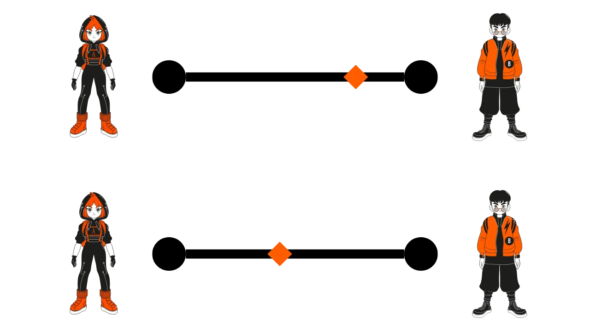

Denne representasjonen kan være nyttig for å forestille seg balansen av midler i en kanal.

### De grunnleggende reglene for en betalingskanal

Det første punktet å huske på er at **kanalkapasiteten** er fast. Det er litt som diameteren på et rør: det bestemmer det maksimale beløpet av midler som kan sendes gjennom kanalen på en gang.
La oss ta et eksempel: hvis Alice har 130 000 satoshis på sin side, kan hun bare sende maksimalt 130 000 satoshis til Bob i en enkelt transaksjon. Men Bob kan deretter sende disse midlene tilbake til Alice, enten delvis eller i sin helhet.

Det som er viktig å forstå er at den faste kapasiteten til kanalen begrenser det maksimale beløpet for en enkelt transaksjon, men ikke det totale antallet mulige transaksjoner, eller det samlede volumet av midler utvekslet innenfor kanalen.

**Hva bør du ta med deg fra dette kapittelet?**

- Kapasiteten til en kanal er fast og bestemmer det maksimale beløpet som kan sendes i en enkelt transaksjon.
- Midlene i en kanal er fordelt mellom de to deltakerne, og hver kan bare sende til den andre de midlene de eier på sin side.
- Lightning Network tillater dermed rask og effektiv utveksling av midler, samtidig som det respekterer begrensningene som er pålagt av kanalens kapasitet.

Dette er slutten på dette første kapittelet, hvor vi har lagt grunnlaget for Lightning Network. I de kommende kapitlene vil vi se hvordan man åpner en kanal og dykke dypere inn i konseptene som er diskutert her.

## Bitcoin, adresser, UTXO og transaksjoner

<chapterId>0cfb7e6b-96f0-508b-9210-90bc1e28649d</chapterId>


Dette kapittelet er litt spesielt siden det ikke vil være direkte viet til Lightning, men til Bitcoin. Faktisk er Lightning Network et lag på toppen av Bitcoin. Det er derfor essensielt å forstå visse grunnleggende konsepter av Bitcoin for å ordentlig forstå hvordan Lightning fungerer i de påfølgende kapitlene. I dette kapittelet vil vi gå gjennom grunnleggende om Bitcoin mottaksadresser, UTXOer, samt funksjonen til Bitcoin-transaksjoner.
### Bitcoin-adresser, private nøkler og offentlige nøkler

En Bitcoin-adresse er en serie tegn som er avledet fra en **offentlig nøkkel**, som selv er beregnet fra en **privat nøkkel**. Som du sikkert vet, brukes den til å låse bitcoins, noe som tilsvarer å motta dem i vår lommebok.

Den private nøkkelen er et hemmelig element som **aldri bør deles**, mens den offentlige nøkkelen og adressen kan deles uten sikkerhetsrisiko (deres avsløring representerer kun en risiko for ditt privatliv). Her er en vanlig representasjon som vi vil adoptere gjennom denne opplæringen:

- De **private nøklene** vil bli representert **vertikalt**.
- De **offentlige nøklene** vil bli representert **horisontalt**.
- Deres farge indikerer hvem som besitter dem (Alice i oransje og Bob i svart...).

### Bitcoin-transaksjoner: Å sende midler og skript

På Bitcoin involverer en transaksjon å sende midler fra en adresse til en annen. La oss ta eksempelet med Alice som sender 0,002 Bitcoin til Bob. Alice bruker den private nøkkelen assosiert med hennes adresse for å **signere** transaksjonen, og beviser dermed at hun faktisk er i stand til å bruke disse midlene. Men hva skjer egentlig bak denne transaksjonen? Midlene på en Bitcoin-adresse er låst av et **skript**, en slags mini-program som pålegger visse betingelser for å bruke midlene.

Det mest vanlige skriptet krever en signatur med den private nøkkelen assosiert med adressen. Når Alice signerer en transaksjon med sin private nøkkel, **låser hun opp skriptet** som blokkerer midlene, og de kan deretter overføres. Overføringen av midler innebærer å legge til et nytt skript til disse midlene, som stipulerer at for å bruke dem denne gangen, vil **Bobs** private nøkkelsignatur være nødvendig.


### UTXOer: Ubrente Transaksjonsutganger

På Bitcoin, det vi faktisk utveksler er ikke direkte bitcoins, men **UTXOer** (_Unspent Transaction Outputs_), som betyr "ubrente transaksjonsutganger".

En UTXO er en bit av bitcoin som kan være av hvilken som helst verdi, for eksempel, **2 000 bitcoins**, **8 bitcoins**, eller til og med **8 000 sats**. Hver UTXO er låst av et skript, og for å bruke den, må man tilfredsstille skriptets betingelser, ofte en signatur med den private nøkkelen som tilsvarer en gitt mottaksadresse.

UTXOer kan ikke deles. Hver gang de brukes til å bruke beløpet i bitcoins de representerer, må det gjøres i sin helhet. Det er litt som en seddel: hvis du har en €10 seddel og du skylder bakeren €5, kan du ikke bare klippe seddelen i to. Du må gi ham €10 seddelen, og han vil gi deg €5 i veksel. Dette er nøyaktig samme prinsipp for UTXOer på Bitcoin! For eksempel, når Alice låser opp et skript med sin private nøkkel, låser hun opp hele UTXOen. Hvis hun ønsker å sende bare en del av midlene representert av denne UTXOen til Bob, kan hun "fragmentere" den til flere mindre. Hun vil da sende 0,0015 BTC til Bob og sende resten, 0,0005 BTC, til en **endringsadresse**.

Her er et eksempel på en transaksjon med 2 utganger:
- En UTXO på 0.0015 BTC for Bob, låst av et skript som krever Bobs private nøkkelsignatur.
- En UTXO på 0.0005 BTC for Alice, låst av et skript som krever hennes egen signatur.


### Multi-signaturadresser

I tillegg til enkle adresser generert fra en enkelt offentlig nøkkel, er det mulig å opprette **multi-signaturadresser** fra flere offentlige nøkler. Et spesielt interessant tilfelle for Lightning Network er **2/2 multi-signaturadressen**, generert fra to offentlige nøkler:


For å bruke midlene låst med denne 2/2 multi-signaturadressen, er det nødvendig å signere med de to private nøklene som er assosiert med de offentlige nøklene.


Denne typen adresse er nettopp representasjonen på Bitcoin-blockchainen av betalingskanaler på Lightning Network.

**Hva bør du ta med deg fra dette kapittelet?**

- En **Bitcoin-adresse** er avledet fra en offentlig nøkkel, som selv er avledet fra en privat nøkkel.
- Midler på Bitcoin er låst av **skript**, og for å bruke disse midlene, må man tilfredsstille skriptet, som vanligvis innebærer å gi en signatur med den tilsvarende private nøkkelen.
- **UTXOer** er biter av bitcoins låst av skript, og hver transaksjon på Bitcoin består av å låse opp en UTXO og deretter skape en eller flere nye i retur.
- **2/2 multi-signaturadresser** krever signaturen til to private nøkler for å bruke midlene. Disse spesifikke adressene brukes i konteksten av Lightning for å opprette betalingskanaler.

Dette kapittelet om Bitcoin har tillatt oss å gjennomgå noen essensielle begreper for det som følger. I neste kapittel vil vi spesifikt oppdage hvordan åpningen av kanaler på Lightning Network fungerer.

# Åpning og Lukking av Kanaler

<partId>900b5b6b-ccd0-5b2f-9424-4b191d0e935d</partId>

## Kanalåpning

<chapterId>96243eb0-f6b5-5b68-af1f-fffa0cc16bfe</chapterId>


I dette kapittelet vil vi se mer presist hvordan man åpner en betalingskanal på Lightning Network og forstå koblingen mellom denne operasjonen og det underliggende Bitcoin-systemet.

### Lightning-kanaler

Som vi så i det første kapittelet, kan en **betalingskanal** på Lightning sammenlignes med et "rør" for utveksling av midler mellom to deltakere (**Alice** og **Bob** i våre eksempler). Kapasiteten til denne kanalen tilsvarer summen av de tilgjengelige midlene på hver side. I vårt eksempel har Alice **100 000 satoshier** og Bob har **30 000 satoshier**, noe som gir en **total kapasitet** på **130 000 satoshier**.


### Nivåer av Informasjonsutveksling

Det er avgjørende å klart skille de forskjellige nivåene av utveksling på Lightning Network:

- **Peer-to-peer-kommunikasjon (Lightning-protokollen)**: Dette er meldingene som Lightning-noder sender til hverandre for å kommunisere. Vi vil representere disse meldingene med stiplede svarte linjer i våre diagrammer.
- **Betalingskanaler (Lightning-protokollen)**: Dette er veiene for utveksling av midler på Lightning, som vi vil representere med solide svarte linjer.
- **Bitcoin-transaksjoner (Bitcoin-protokollen)**: Dette er transaksjonene som gjøres onchain, som vi vil representere med oransje linjer.


Det er verdt å merke seg at en Lightning-node kan kommunisere via P2P-protokollen uten å åpne en kanal, men for å utveksle midler, er en kanal nødvendig.
### Steg for å åpne en Lightning-kanal

1. **Meldingsutveksling**: Alice ønsker å åpne en kanal med Bob. Hun sender ham en melding som inneholder beløpet hun ønsker å sette inn i kanalen (130 000 sats) og hennes offentlige nøkkel. Bob svarer ved å dele sin egen offentlige nøkkel.


2. **Opprettelse av multisignaturadressen**: Med disse to offentlige nøklene skaper Alice en **2/2 multisignaturadresse**, noe som betyr at midlene som senere blir satt inn på denne adressen vil kreve begge signaturene (Alice og Bob) for å bli brukt.


3. **Innskuddstransaksjon**: Alice forbereder en Bitcoin-transaksjon for å sette inn midler på denne multisignaturadressen. For eksempel kan hun bestemme seg for å sende **130 000 satoshier** til denne multisignaturadressen. Denne transaksjonen er **konstruert, men ikke ennå publisert** på blokkjeden.

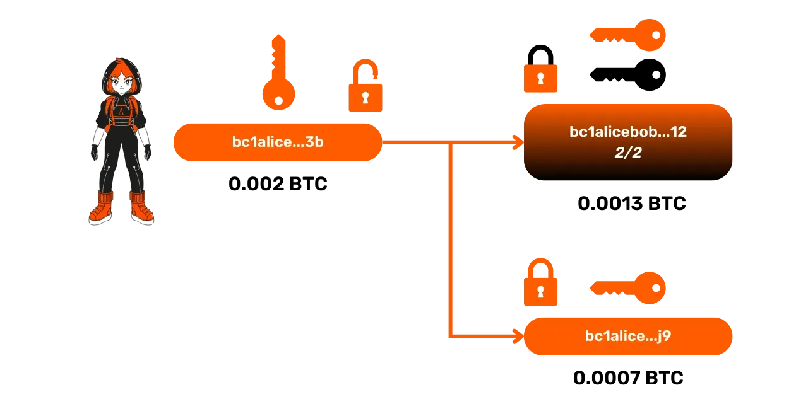

4. **Uttakstransaksjon**: Før hun publiserer innskuddstransaksjonen, konstruerer Alice en uttakstransaksjon slik at hun kan gjenvinne sine midler i tilfelle et problem med Bob. Faktisk, når Alice publiserer innskuddstransaksjonen, vil hennes sats være låst på en 2/2 multisignaturadresse som krever begge hennes signatur og Bobs signatur for å bli låst opp. Alice beskytter seg mot dette tapet ved å konstruere uttakstransaksjonen som lar henne gjenvinne sine midler.

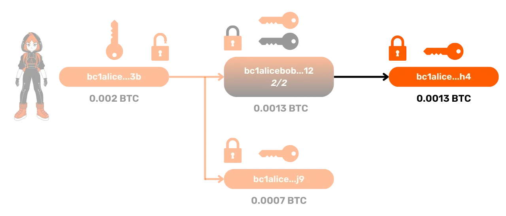

5. **Bobs signatur**: Alice sender innskuddstransaksjonen til Bob som bevis og ber ham om å signere uttakstransaksjonen. Når Bobs signatur er oppnådd på uttakstransaksjonen, er Alice sikret at hun kan gjenvinne sine midler når som helst, ettersom nå kun hennes egen signatur er nødvendig for å låse opp multisignaturen.


6. **Publisering av innskuddstransaksjonen**: Når Bobs signatur er oppnådd, kan Alice publisere innskuddstransaksjonen på Bitcoin-blokkjeden, og dermed offisielt åpne Lightning-kanalen mellom de to brukerne.


### Når er kanalen åpen?

Kanalen anses som åpen når innskuddstransaksjonen er inkludert i en Bitcoin-blokk og den har nådd en viss dybde av bekreftelser (antall påfølgende blokker).

**Hva bør du huske fra dette kapittelet?**

- Å åpne en kanal starter med utveksling av **meldinger** mellom de to partene (utveksling av beløp og offentlige nøkler).
- En kanal dannes ved å opprette en **2/2 multisignaturadresse** og sette inn midler i den via en Bitcoin-transaksjon.
- Personen som åpner kanalen sikrer at de kan **gjenvinne sine midler** gjennom en uttakstransaksjon signert av den andre parten før de publiserer innskuddstransaksjonen.

I neste kapittel vil vi utforske den tekniske funksjonen av en Lightning-transaksjon innenfor en kanal.

## Forpliktelsestransaksjon

<chapterId>7d3fd135-129d-5c5a-b306-d5f2f1e63340</chapterId>


I dette kapittelet vil vi oppdage den tekniske funksjonen av en transaksjon innenfor en kanal på Lightning-nettverket, det vil si når midler flyttes fra den ene siden av kanalen til den andre.

### Påminnelse om kanalens livssyklus
Som tidligere sett, begynner en Lightning-kanal med en **åpning** via en Bitcoin-transaksjon. Kanalen kan **lukkes** når som helst, også via en Bitcoin-transaksjon. Mellom disse to øyeblikkene kan et nesten uendelig antall transaksjoner utføres innenfor kanalen, uten å gå gjennom Bitcoin-blockchainen. La oss se hva som skjer under en transaksjon i kanalen.
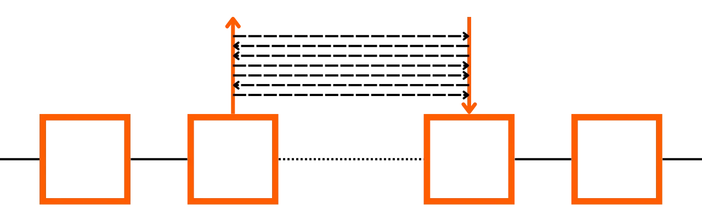

### Kanalens opprinnelige tilstand

På tidspunktet for åpningen av kanalen, deponerte Alice **130 000 satoshis** på den multisignaturadressen til kanalen. Dermed, i den opprinnelige tilstanden, er alle midlene på Alices side. Før åpningen av kanalen, fikk Alice også Bob til å signere en **uttaks-transaksjon**, som ville tillate henne å gjenvinne sine midler hvis hun ønsket å lukke kanalen.

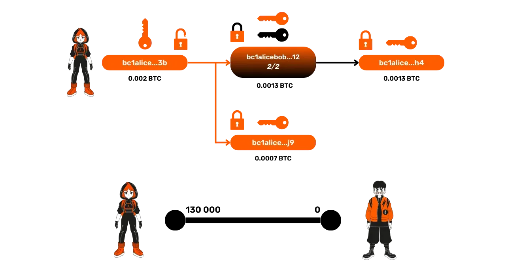

### Upubliserte Transaksjoner: Forpliktelsestransaksjonene

Når Alice utfører en transaksjon i kanalen for å sende midler til Bob, blir en ny Bitcoin-transaksjon opprettet for å reflektere denne endringen i fordelingen av midler. Denne transaksjonen, kalt en **forpliktelsestransaksjon**, publiseres ikke på blockchainen, men representerer den nye tilstanden til kanalen etter Lightning-transaksjonen.

La oss ta et eksempel med Alice som sender 30 000 satoshis til Bob:

- **Opprinnelig**: Alice har 130 000 satoshis.
- **Etter transaksjonen**: Alice har 100 000 satoshis, og Bob 30 000 satoshis.
  For å validere denne overføringen, skaper Alice og Bob en ny **upublisert Bitcoin-transaksjon** som ville sende **100 000 satoshis til Alice** og **30 000 satoshis til Bob** fra den multisignaturadressen. Begge parter konstruerer denne transaksjonen uavhengig, men med samme data (beløp og adresser). Når konstruert, signerer hver sin transaksjon og utveksler sin signatur med den andre. Dette tillater enten part å publisere transaksjonen når som helst hvis nødvendig for å gjenopprette sin del av kanalen på hoved Bitcoin-blockchainen.
  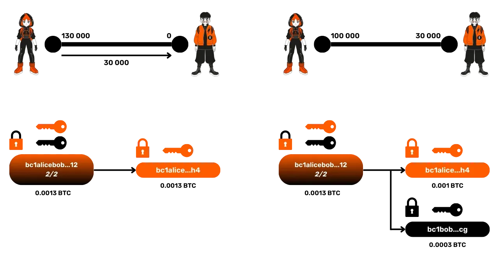

### Overføringsprosess: Fakturaen

Når Bob ønsker å motta midler, sender han Alice en **_faktura_** for 30 000 satoshis. Alice fortsetter deretter med å betale denne fakturaen ved å starte overføringen innenfor kanalen. Som vi har sett, er denne prosessen avhengig av opprettelsen og signeringen av en ny **forpliktelsestransaksjon**.

Hver forpliktelsestransaksjon representerer den nye fordelingen av midler i kanalen etter overføringen. I dette eksemplet, etter transaksjonen, har Bob 30 000 satoshis og Alice har 100 000 satoshis. Hvis en av de to deltakerne bestemte seg for å publisere denne forpliktelsestransaksjonen på blockchainen, ville det resultere i lukkingen av kanalen og midlene ville bli fordelt i henhold til denne siste fordelingen.

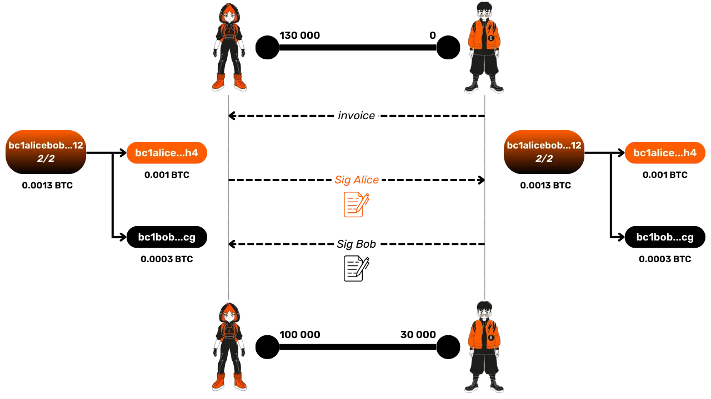

### Ny Tilstand Etter en Andre Transaksjon

La oss ta et annet eksempel: etter den første transaksjonen der Alice sendte 30 000 satoshis til Bob, bestemmer Bob seg for å sende **10 000 satoshis tilbake til Alice**. Dette skaper en ny tilstand av kanalen. Den nye **forpliktelsestransaksjonen** vil representere denne oppdaterte fordelingen:

- **Alice** har nå **110 000 satoshis**.
- **Bob** har **20 000 satoshis**.

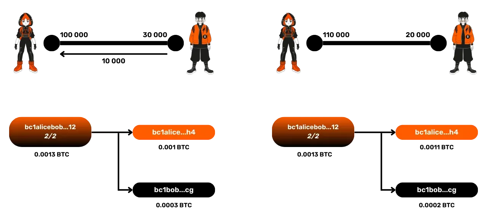

Igjen, denne transaksjonen publiseres ikke på blockchainen, men kan publiseres når som helst i tilfelle kanalen lukkes.

Oppsummert, når midler overføres innenfor en Lightning-kanal:
- Alice og Bob oppretter en ny **forpliktelsestransaksjon**, som reflekterer den nye fordelingen av midler. - Denne Bitcoin-transaksjonen er **signert** av begge parter, men **ikke publisert** på Bitcoin-blockchainen så lenge kanalen forblir åpen.
- Forpliktelsestransaksjonene sikrer at hver deltaker kan gjenopprette sine midler når som helst på Bitcoin-blockchainen ved å publisere den siste signerte transaksjonen.

Imidlertid har dette systemet en potensiell feil, som vi vil adressere i neste kapittel. Vi vil se hvordan hver deltaker kan beskytte seg mot et forsøk på juks fra den andre partens side.

## Tilbakekallingsnøkkel

<chapterId>f2f61e5b-badb-5947-9a81-7aa530b44e59</chapterId>

I dette kapittelet vil vi gå dypere inn i hvordan transaksjoner fungerer på Lightning Network ved å diskutere mekanismene som er på plass for å beskytte mot juks, og sikre at hver part følger reglene innenfor en kanal.

### Påminnelse: Forpliktelsestransaksjoner

Som tidligere sett, er transaksjoner på Lightning avhengige av upubliserte **forpliktelsestransaksjoner**. Disse transaksjonene reflekterer den nåværende fordelingen av midler i kanalen. Når en ny Lightning-transaksjon blir gjort, opprettes en ny forpliktelsestransaksjon og signeres av begge parter for å reflektere den nye tilstanden til kanalen.

La oss ta et enkelt eksempel:

- **Utgangspunkt**: Alice har **100 000 satoshis**, Bob **30 000 satoshis**.
- Etter en transaksjon hvor Alice sender **40 000 satoshis** til Bob, distribueres midlene i den nye forpliktelsestransaksjonen som følger:
  - Alice: **60 000 satoshis**
  - Bob: **70 000 satoshis**


Når som helst kan begge parter publisere den **siste forpliktelsestransaksjonen** signert for å lukke kanalen og gjenopprette sine midler.

### Feilen: Juks ved å Publisere en Gammel Transaksjon

Et potensielt problem oppstår hvis en av partene bestemmer seg for å **juks** ved å publisere en gammel forpliktelsestransaksjon. For eksempel kunne Alice publisere en eldre forpliktelsestransaksjon hvor hun hadde **100 000 satoshis**, selv om hun nå kun har **60 000** i virkeligheten. Dette ville tillate henne å stjele **40 000 satoshis** fra Bob.

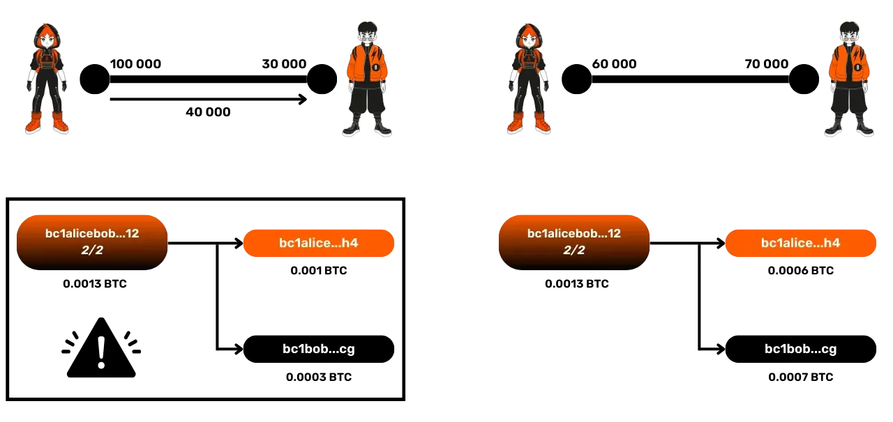

Enda verre, Alice kunne publisere den aller første uttakstransaksjonen, den før kanalen ble åpnet, hvor hun hadde **130 000 satoshis**, og dermed stjele hele kanalens midler.

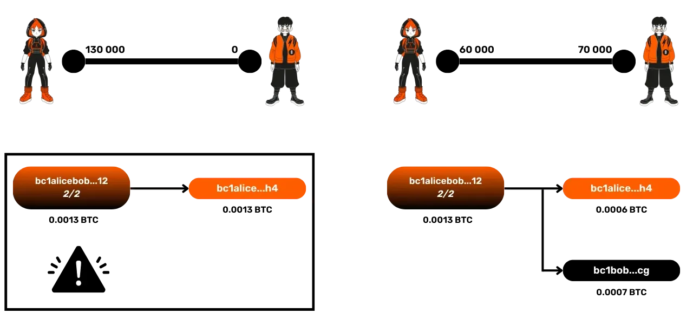

### Løsning: Tilbakekallingsnøkkel og Tidsbegrensning

For å forhindre denne typen juks fra Alice, på Lightning Network, legges **sikkerhetsmekanismer** til forpliktelsestransaksjonene:

1. **Tidsbegrensningen**: Hver forpliktelsestransaksjon inkluderer en tidsbegrensning for Alices midler. Tidsbegrensningen er en smart kontrakt-primitiv som setter en tidsbetingelse som må oppfylles for at en transaksjon skal legges til i en blokk. Dette betyr at Alice ikke kan gjenopprette sine midler før et visst antall blokker har passert hvis hun publiserer en av forpliktelsestransaksjonene. Denne tidsbegrensningen begynner å gjelde fra bekreftelsen av forpliktelsestransaksjonen. Varigheten er generelt proporsjonal med størrelsen på kanalen, men den kan også manuelt konfigureres.
2. **Tilbakekallingsnøkkelen**: Alices midler kan også umiddelbart brukes av Bob hvis han besitter **tilbakekallingsnøkkelen**. Denne nøkkelen består av en hemmelighet holdt av Alice og en hemmelighet holdt av Bob. Merk at denne hemmeligheten er forskjellig for hver forpliktelsestransaksjon.
Takket være disse to kombinerte mekanismene, har Bob tid til å oppdage Alices forsøk på å jukse, og straffe henne ved å hente ut sitt resultat med tilbakekallingsnøkkelen, noe som for Bob betyr å gjenvinne alle midlene i kanalen. Vår nye forpliktelsestransaksjon vil nå se slik ut:
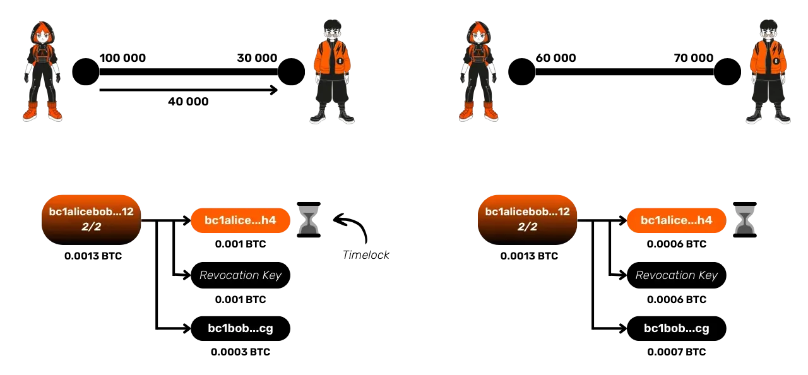

La oss detaljere funksjonen av denne mekanismen sammen.

### Oppdateringsprosess for Transaksjon

Når Alice og Bob oppdaterer tilstanden til kanalen med en ny Lightning-transaksjon, utveksler de på forhånd sine respektive **hemmeligheter** for den forrige forpliktelsestransaksjonen (den som vil bli foreldet og kunne tillate en av dem å jukse). Dette betyr at, i den nye tilstanden til kanalen:

- Alice og Bob har en ny forpliktelsestransaksjon som representerer den nåværende fordelingen av midler etter Lightning-transaksjonen.
- Hver av dem har den andres hemmelighet for den forrige transaksjonen, noe som gjør det mulig for dem å bruke tilbakekallingsnøkkelen kun hvis en av dem prøver å jukse ved å publisere en transaksjon med en gammel tilstand i Bitcoin-noders mempooler. Faktisk, for å straffe den andre parten, er det nødvendig å holde begge hemmelighetene og den andres forpliktelsestransaksjon, som inkluderer den signerte inngangen. Uten denne transaksjonen er tilbakekallingsnøkkelen alene ubrukelig. Den eneste måten å skaffe denne transaksjonen på er å hente den fra mempoolene (i transaksjonene som venter på bekreftelse) eller i de bekreftede transaksjonene på blokkjeden under tidsbegrensningen, noe som beviser at den andre parten prøver å jukse, enten det er med vilje eller ikke.

La oss ta et eksempel for å forstå denne prosessen godt:

1. **Opprinnelig Tilstand**: Alice har **100,000 satoshis**, Bob **30,000 satoshis**.

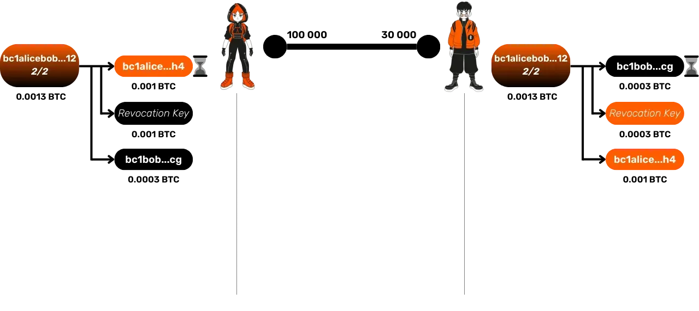

2. Bob ønsker å motta 40,000 satoshis fra Alice via deres Lightning-kanal. For å gjøre dette:
   - Han sender henne en faktura sammen med sin hemmelighet for tilbakekallingsnøkkelen til hans forrige forpliktelsestransaksjon.
   - Som svar gir Alice sin signatur for Bobs nye forpliktelsestransaksjon, samt hennes hemmelighet for tilbakekallingsnøkkelen til hennes forrige transaksjon.
   - Til slutt sender Bob sin signatur for Alices nye forpliktelsestransaksjon.
   - Disse utvekslingene gjør det mulig for Alice å sende **40,000 satoshis** til Bob på Lightning via deres kanal, og de nye forpliktelsestransaksjonene reflekterer nå denne nye fordelingen av midler.


3. Hvis Alice forsøker å publisere den gamle forpliktelsestransaksjonen der hun fortsatt eide **100,000 satoshis**, kan Bob, etter å ha fått tilbakekallingsnøkkelen, umiddelbart gjenvinne midlene ved å bruke denne nøkkelen, mens Alice er blokkert av tidsbegrensningen.

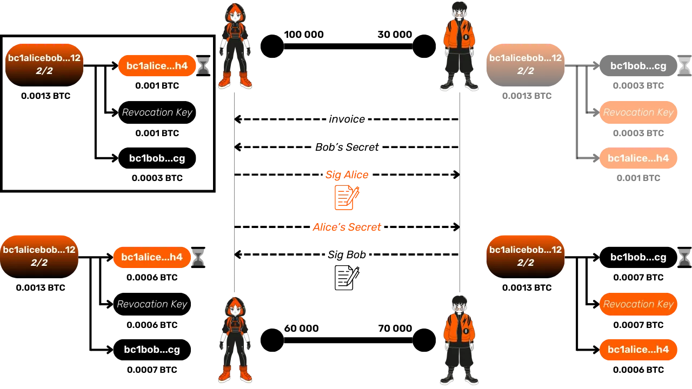

Selv om Bob i dette tilfellet ikke har noen økonomisk interesse i å prøve å jukse, hvis han likevel gjør det, nyter Alice også av symmetrisk beskyttelse som gir henne de samme garantiene.

**Hva bør du ta med deg fra dette kapittelet?**

**Forpliktelsestransaksjonene** på Lightning Network inkluderer sikkerhetsmekanismer som reduserer både risikoen for juks og insentivene til å gjøre det. Før de signerer en ny forpliktelsestransaksjon, utveksler Alice og Bob sine respektive **hemmeligheter** for de forrige forpliktelsestransaksjonene. Hvis Alice prøver å publisere en gammel forpliktelsestransaksjon, kan Bob bruke **tilbakekallingsnøkkelen** for å gjenvinne alle midlene før Alice kan (fordi hun er blokkert av tidsbegrensningen), noe som straffer henne for å forsøke å jukse.

Dette sikkerhetssystemet sikrer at deltakerne overholder reglene til Lightning Network, og de kan ikke tjene på å publisere gamle forpliktelsestransaksjoner.
På dette tidspunktet i opplæringen vet du nå hvordan Lightning-kanaler åpnes og hvordan transaksjoner innenfor disse kanalene fungerer. I neste kapittel vil vi oppdage de forskjellige måtene å lukke en kanal på og gjenopprette dine bitcoins på hovedblokkjeden.
## Kanallukking

<chapterId>29a72223-2249-5400-96f0-3756b1629bc2</chapterId>


I dette kapittelet skal vi diskutere **å lukke en kanal** på Lightning-nettverket, som gjøres gjennom en Bitcoin-transaksjon, akkurat som å åpne en kanal. Etter å ha sett hvordan transaksjoner innenfor en kanal fungerer, er det nå på tide å se hvordan man lukker en kanal og gjenoppretter midlene på Bitcoin-blokkjeden.

### Påminnelse om kanalens livssyklus

**Livssyklusen til en kanal** begynner med **åpningen** av den, via en Bitcoin-transaksjon, deretter gjøres Lightning-transaksjoner innenfor den, og til slutt, når partene ønsker å gjenopprette sine midler, blir kanalen **lukket** gjennom en andre Bitcoin-transaksjon. De mellomliggende transaksjonene som gjøres på Lightning, representeres av upubliserte **forpliktelsestransaksjoner**.

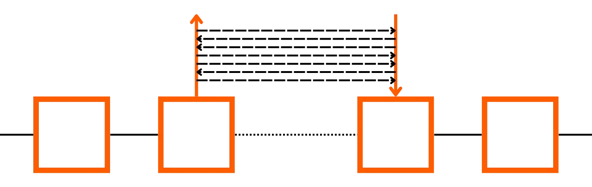

### De tre typene kanallukking

Det er tre hovedmåter å lukke denne kanalen på, som kan kalles **den gode, den brutale og den unnvikende** (inspirert av Andreas Antonopoulos i _Mastering the Lightning Network_):

1. **Den Gode**: den **kooperative lukkingen**, hvor Alice og Bob er enige om å lukke kanalen.
2. **Den Dårlige**: den **tvungne lukkingen**, hvor en av partene bestemmer seg for å lukke kanalen ærlig, men uten den andres samtykke.
3. **Den Stygge**: lukkingen med **juks**, hvor en av partene forsøker å stjele midler ved å publisere en gammel forpliktelsestransaksjon (enhver, men ikke den siste, som reflekterer den faktiske og rettferdige fordelingen av midler).

La oss ta et eksempel:

- Alice eier **100 000 satoshis** og Bob **30 000 satoshis**.
- Denne fordelingen reflekteres i **2 forpliktelsestransaksjoner** (én per bruker) som ikke er publisert, men som kunne blitt det i tilfelle kanallukking.

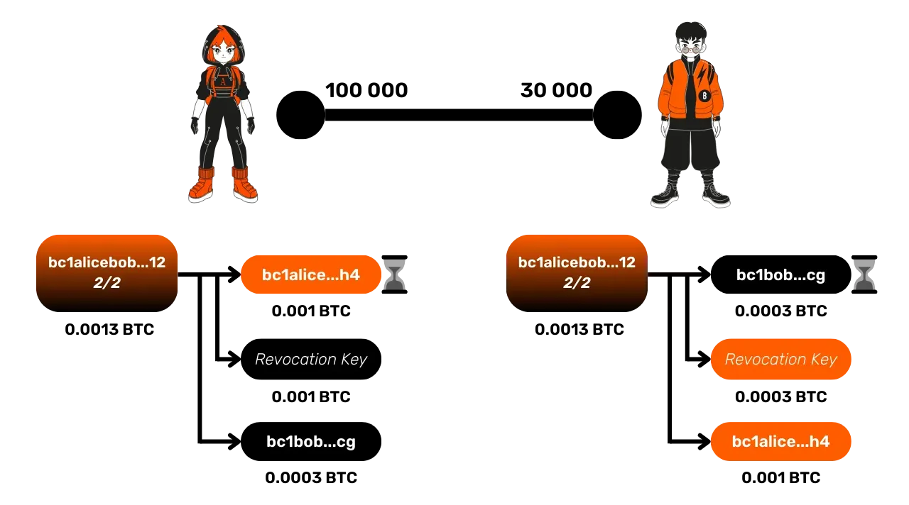

### Den Gode: den kooperative lukkingen

I en **kooperativ lukking** er Alice og Bob enige om å lukke kanalen. Slik går det til:

1. Alice sender en melding til Bob via Lightning-kommunikasjonsprotokollen for å foreslå å lukke kanalen.
2. Bob er enig, og de to partene gjør ingen ytterligere transaksjoner i kanalen.


3. Alice og Bob forhandler sammen om gebyrene for **lukkingstransaksjonen**. Disse gebyrene beregnes generelt basert på Bitcoin-gebyrmarkedet på tidspunktet for lukking. Det er viktig å merke seg at **det alltid er personen som åpnet kanalen** (Alice i vårt eksempel) som betaler lukkegebyrene.
4. De konstruerer en ny **lukkingstransaksjon**. Denne transaksjonen ligner en forpliktelsestransaksjon, men uten tidsbegrensninger eller tilbakekallingsmekanismer, siden begge parter samarbeider og det er ingen risiko for juks. Denne kooperative lukkingstransaksjonen er derfor forskjellig fra forpliktelsestransaksjoner.
For eksempel, hvis Alice eier **100,000 satoshis** og Bob **30,000 satoshis**, vil den avsluttende transaksjonen sende **100,000 satoshis** til Alices adresse og **30,000 satoshis** til Bobs adresse, uten tidsbegrensninger. Når denne transaksjonen er signert av begge parter, publiseres den av Alice. Når transaksjonen er bekreftet på Bitcoin-blockchainen, vil Lightning-kanalen offisielt være lukket.
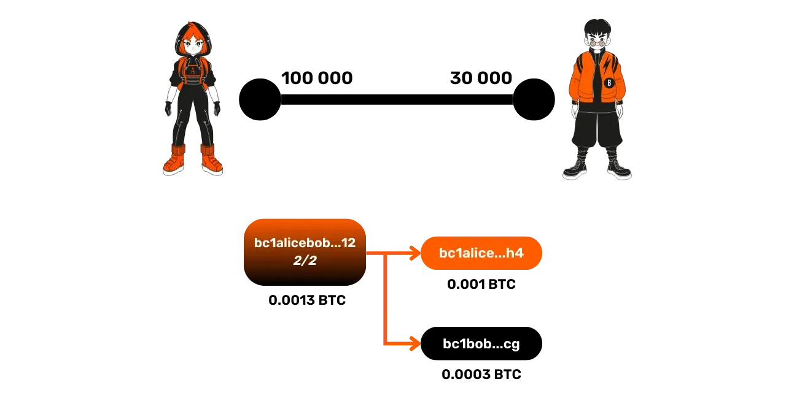

**Samarbeidslukking** er den foretrukne metoden for å lukke fordi den er rask (ingen tidsbegrensning) og transaksjonsgebyrene justeres i henhold til de nåværende Bitcoin-markedsforholdene. Dette unngår å betale for lite, noe som kunne risikere å blokkere transaksjonen i mempoolene, eller å betale for mye unødvendig, noe som fører til unødvendig økonomisk tap for deltakerne.

### Det dårlige: tvungen lukking

Når Alices node sender en melding til Bobs og ber om en samarbeidslukking, hvis han ikke svarer (for eksempel på grunn av et internettavbrudd eller et teknisk problem), kan Alice fortsette med en **tvungen lukking** ved å publisere **den siste signerte forpliktelsestransaksjonen**.
I dette tilfellet vil Alice ganske enkelt publisere den siste forpliktelsestransaksjonen, som reflekterer tilstanden til kanalen på tidspunktet den siste Lightning-transaksjonen fant sted med riktig fordeling av midler.

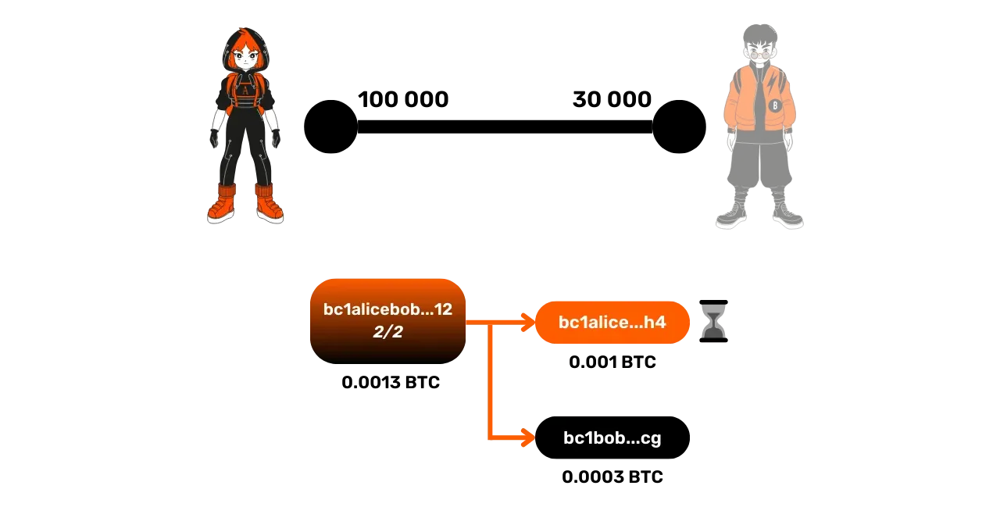

Denne transaksjonen inkluderer en **tidsbegrensning** for Alices midler, noe som gjør lukkingen tregere.

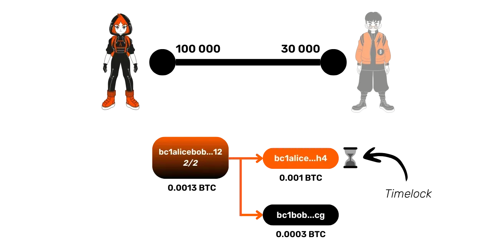

Også kan gebyrene for forpliktelsestransaksjonen være uegnede på tidspunktet for lukking, ettersom de ble satt da transaksjonen ble opprettet, noen ganger flere måneder før. Generelt overvurderer Lightning-klienter gebyrer for å unngå fremtidige problemer, men dette kan føre til overdrevne gebyrer, eller omvendt for lave.

Sammenfattet er **tvungen lukking** en siste utvei når motparten ikke lenger svarer. Det er tregere og mindre økonomisk enn en samarbeidslukking. Derfor bør det unngås så mye som mulig.

### Jukset: å jukse

Til slutt skjer en lukking med **juks** når en av partene prøver å publisere en gammel forpliktelsestransaksjon, ofte hvor de hadde flere midler enn de burde. For eksempel kan Alice publisere en gammel transaksjon hvor hun eide **120,000 satoshis**, mens hun faktisk bare eier **100,000** nå.

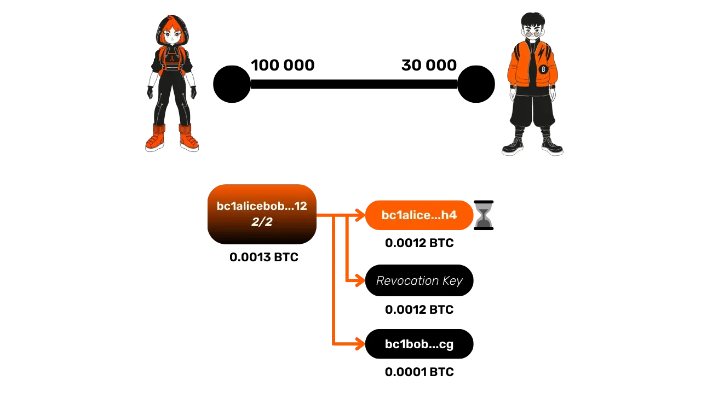

Bob, for å forhindre dette juks, overvåker Bitcoin-blockchainen og dens mempool for å sikre at Alice ikke publiserer en gammel transaksjon. Hvis Bob oppdager et forsøk på juks, kan han bruke **tilbakekallingsnøkkelen** for å gjenopprette Alices midler og straffe henne ved å ta hele midlene i kanalen. Siden Alice er blokkert av tidsbegrensningen på hennes utgang, har Bob tid til å bruke den uten en tidsbegrensning på sin side for å gjenopprette hele summen på en adresse han eier.

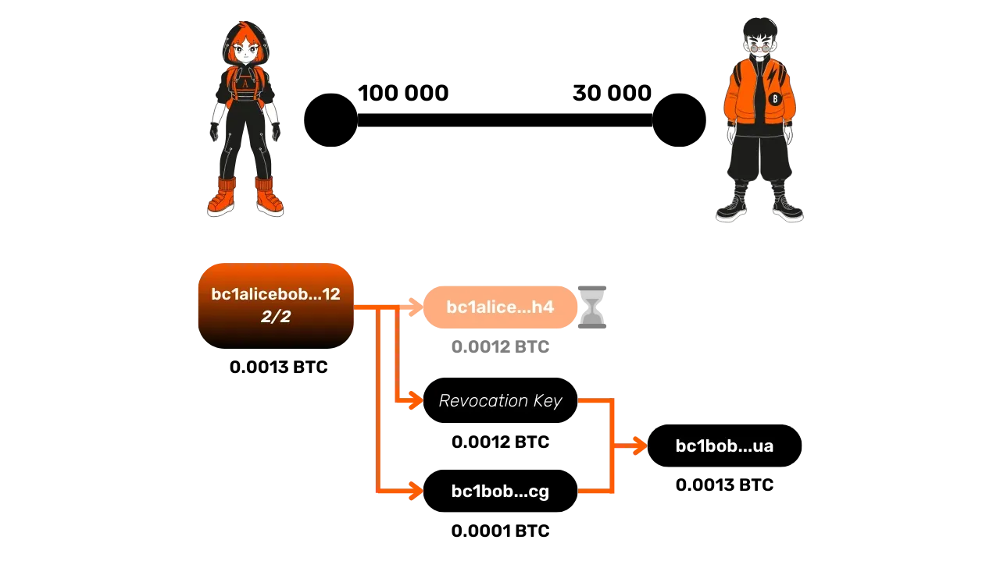

Åpenbart kan juks potensielt lykkes hvis Bob ikke handler innenfor den tiden som er pålagt av tidsbegrensningen på Alices utgang. I dette tilfellet er Alices utgang ulåst, noe som tillater henne å bruke den til å skape en ny utgang til en adresse hun kontrollerer.

**Hva bør du ta med deg fra dette kapittelet?**

Det er tre måter å lukke en kanal på:

1. **Samarbeidslukking**: Rask og mindre kostbar, hvor begge parter er enige om å lukke kanalen og publisere en skreddersydd avsluttende transaksjon.
2. **Tvungen Lukking**: Mindre ønskelig, ettersom den er avhengig av å publisere en forpliktelsestransaksjon, med potensielt uegnede gebyrer og en tidsbegrensning, som bremser ned lukkingen.
3. **Juks**: Hvis en av partene prøver å stjele midler ved å publisere en gammel transaksjon, kan den andre bruke tilbakekallingsnøkkelen til å straffe dette juksinget.
I de kommende kapitlene vil vi utforske Lightning Network fra et bredere perspektiv, med fokus på hvordan nettverket opererer.

# Et Likviditetsnettverk

<partId>a873f1cb-751f-5f4a-9ed7-25092bfdef11</partId>

## Lightning Network

<chapterId>45a7252c-fa4f-554b-b8bb-47449532918e</chapterId>


I dette kapittelet skal vi utforske hvordan betalinger på Lightning Network kan nå en mottaker selv om de ikke er direkte koblet gjennom en betalingskanal. Lightning er faktisk et **nettverk av betalingskanaler**, som tillater at midler sendes til en fjern node gjennom kanalene til andre deltakere. Vi vil oppdage hvordan betalinger rutes gjennom nettverket, hvordan likviditet beveger seg mellom kanaler, og hvordan transaksjonsgebyrer beregnes.

### Nettverket av Betalingskanaler

På Lightning Network tilsvarer en transaksjon en overføring av midler mellom to noder. Som sett i tidligere kapitler, er det nødvendig å åpne en kanal med noen for å utføre Lightning-transaksjoner. Denne kanalen tillater et nesten uendelig antall off-chain transaksjoner før man lukker den for å kreve tilbake on-chain saldoen. Imidlertid har denne metoden ulempen av å kreve en direkte kanal med den andre personen for å motta eller sende midler, noe som innebærer en åpningstransaksjon og en lukkingstransaksjon for hver kanal. Hvis jeg planlegger å gjøre et stort antall betalinger med denne personen, blir det kostnadseffektivt å åpne og lukke en kanal. Omvendt, hvis jeg bare trenger å utføre noen få Lightning-transaksjoner, er det ikke fordelaktig å åpne en direkte kanal, da det ville koste meg 2 on-chain transaksjoner for et begrenset antall off-chain transaksjoner. Dette tilfellet kan oppstå, for eksempel, når man ønsker å betale med Lightning hos en handlende uten å planlegge å returnere.

For å løse dette problemet tillater Lightning Network å rute en betaling gjennom flere kanaler og mellomliggende noder, og dermed muliggjøre en transaksjon uten en direkte kanal med den andre personen.

For eksempel, forestill deg at:

- **Alice** (i oransje) har en kanal med **Suzie** (i grått) med **100,000 satoshis** på hennes side og **30,000 satoshis** på Suzies side.
- **Suzie** har en kanal med **Bob** der hun eier **250,000 satoshis** og hvor Bob ikke har noen satoshis.


Hvis Alice ønsker å sende midler til Bob uten å åpne en direkte kanal med ham, må hun gå gjennom Suzie, og hver kanal må justere likviditeten på hver side. **De sendte satoshisene forblir innenfor deres respektive kanaler**; de krysser faktisk ikke kanalene, men overføringen gjøres via en justering av den interne likviditeten i hver kanal.

Anta at Alice ønsker å sende **50,000 satoshis** til Bob:

1. **Alice** sender 50,000 satoshis til **Suzie** i deres felles kanal.
2. **Suzie** replikerer denne overføringen ved å sende 50,000 satoshis til **Bob** i deres kanal.

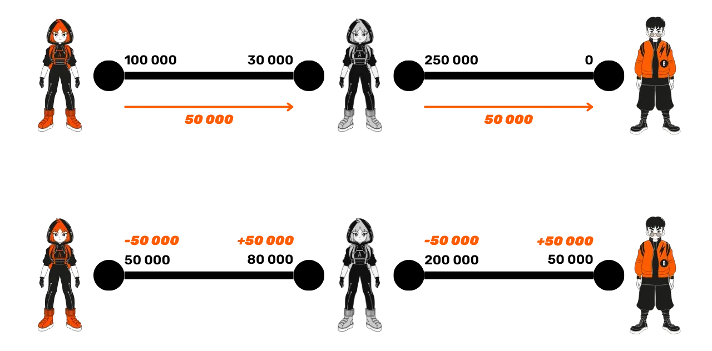
Således blir betalingen sendt til Bob via en bevegelse av likviditet i hver kanal. Ved slutten av operasjonen, ender Alice opp med 50 000 sats. Hun har faktisk overført 50 000 sats siden hun opprinnelig hadde 100 000. Bob, på sin side, ender opp med en ekstra 50 000 sats. For Suzie (den mellomliggende noden), er denne operasjonen nøytral: opprinnelig hadde hun 30 000 sats i sin kanal med Alice og 250 000 sats i sin kanal med Bob, en total på 280 000 sats. Etter operasjonen, holder hun 80 000 sats i sin kanal med Alice og 200 000 sats i sin kanal med Bob, som er det samme summen som i starten.
Denne overføringen er altså begrenset av den **tilgjengelige likviditeten** i overføringens retning.

### Beregning av Ruten og Likviditetsgrenser

La oss ta et teoretisk eksempel på et annet nettverk med:

- **130 000 satoshis** på Alices side (i oransje) i hennes kanal med **Suzie** (i grått).
- **90 000 satoshis** på **Suzies** side og **200 000 satoshis** på **Carols** side (i rosa).
- **150 000 satoshis** på **Carols** side og **100 000 satoshis** på **Bobs** side.

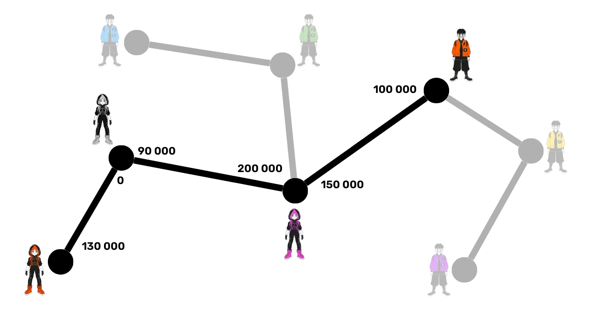

Det maksimale Alice kan sende til Bob i denne konfigurasjonen er **90 000 satoshis**, ettersom hun er begrenset av den minste tilgjengelige likviditeten i kanalen fra **Suzie til Carol**. I motsatt retning (fra Bob til Alice) er ingen betaling mulig fordi **Suzies** side i kanalen med **Alice** ikke inneholder noen satoshis. Derfor er det **ingen rute** som kan brukes for en overføring i denne retningen.
Alice sender **40 000 satoshis** til Bob gjennom kanalene:

1. Alice overfører 40 000 satoshis til sin kanal med Suzie.
2. Suzie overfører 40 000 satoshis til Carol i deres felles kanal.
3. Carol overfører til slutt 40 000 satoshis til Bob.

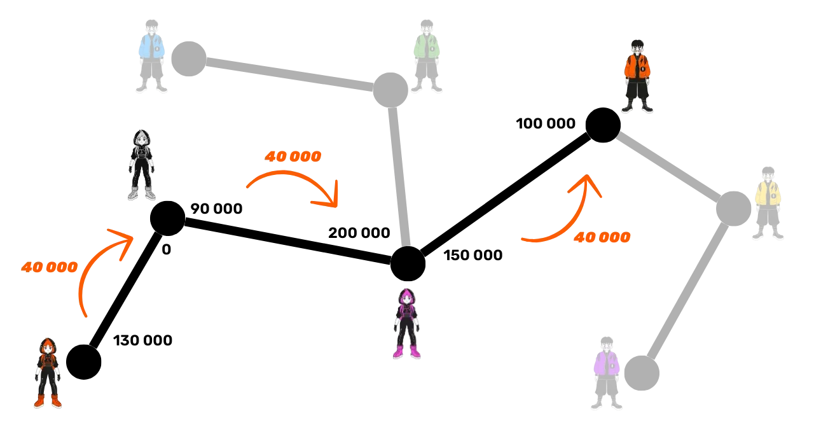

De **satoshis som sendes** i hver kanal **forblir i kanalen**, så satoshis sendt av Carol til Bob er ikke de samme som de som ble sendt av Alice til Suzie. Overføringen gjøres kun ved å justere likviditeten inne i hver kanal. Videre forblir den totale kapasiteten til kanalene uendret.

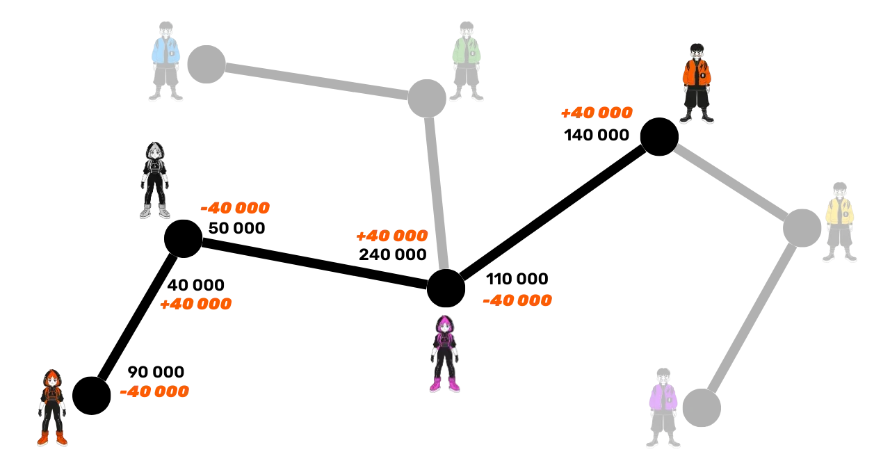

Som i det forrige eksemplet, etter transaksjonen, har kildenoden (Alice) 40 000 satoshis mindre. De mellomliggende nodene (Suzie og Carol) beholder det samme totale beløpet, noe som gjør operasjonen nøytral for dem. Til slutt mottar destinasjonsnoden (Bob) en ekstra 40 000 satoshis.

Rollen til de mellomliggende nodene er derfor veldig viktig i funksjonen til Lightning Network. De letter overføringer ved å tilby flere veier for betalinger. For å oppmuntre disse nodene til å tilby sin likviditet og delta i ruting av betalinger, betales **ruteravgifter** til dem.

### Ruteravgifter

De mellomliggende nodene pålegger avgifter for å tillate betalinger å passere gjennom deres kanaler. Disse avgiftene er satt av **hver node for hver kanal**. Avgiftene består av 2 elementer:

1. "**Base fee**": et fast beløp per kanal, ofte **1 sat** som standard, men tilpassbart.
2. "**Variabel avgift**": en prosentandel av det overførte beløpet, beregnet i **deler per million (ppm)**. Som standard er den **1 ppm** (1 sat per million satoshier overført), men den kan også justeres.
Avgiftene varierer også avhengig av overføringens retning. For eksempel, for en overføring fra Alice til Suzie, gjelder Alices avgifter. Omvendt, fra Suzie til Alice, brukes Suzies avgifter.

For eksempel, for en kanal mellom Alice og Suzie, kunne vi ha:

- **Alice**: grunnavgift på 1 sat og 1 ppm for variable avgifter.
- **Suzie**: grunnavgift på 0,5 sat og 10 ppm for variable avgifter.

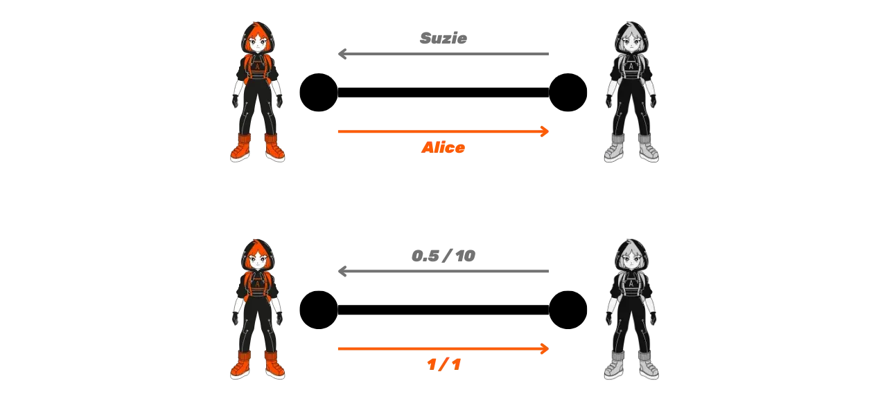

For å bedre forstå hvordan avgifter fungerer, la oss studere det samme Lightning Network som før, men nå med følgende ruteavgifter:

- Kanal **Alice - Suzie**: grunnavgift på 1 satoshi og 1 ppm for Alice.
- Kanal **Suzie - Carol**: grunnavgift på 0 satoshi og 200 ppm for Suzie.
- **Carol - Bob** Kanal: grunnavgift på 1 satoshi og 1 ppm for Suzie 2.
  

For den samme betalingen på **40,000 satoshier** til Bob, må Alice sende litt mer, ettersom hver mellomliggende node vil trekke fra sine avgifter:

- **Carol** trekker fra 1.04 satoshier på kanalen med Bob:
  $$ f*{\text{Carol-Bob}} = \text{grunnavgift} + \left(\frac{\text{ppm} \times \text{beløp}}{10^6}\right) $$
  $$ f*{\text{Carol-Bob}} = 1 + \frac{1 \times 40000}{10^6} = 1 + 0.04 = 1.04 \text{ sats} $$

- **Suzie** trekker fra 8 satoshier i avgifter på kanalen med Carol:
  $$ f*{\text{Suzie-Carol}} = \text{grunnavgift} + \left(\frac{\text{ppm} \times \text{beløp}}{10^6}\right) $$
  $$ f*{\text{Suzie-Carol}} = 0 + \frac{200 \times 40001.04}{10^6} = 0 + 8.0002 \approx 8 \text{ sats} $$

De totale avgiftene for denne betalingen på denne ruten er derfor **9.04 satoshier**. Dermed må Alice sende **40,009.04 satoshier** for at Bob skal motta nøyaktig **40,000 satoshier**.

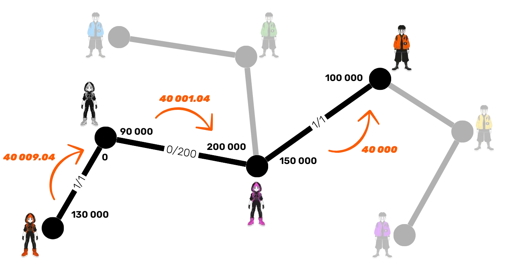

Likviditeten er derfor oppdatert:

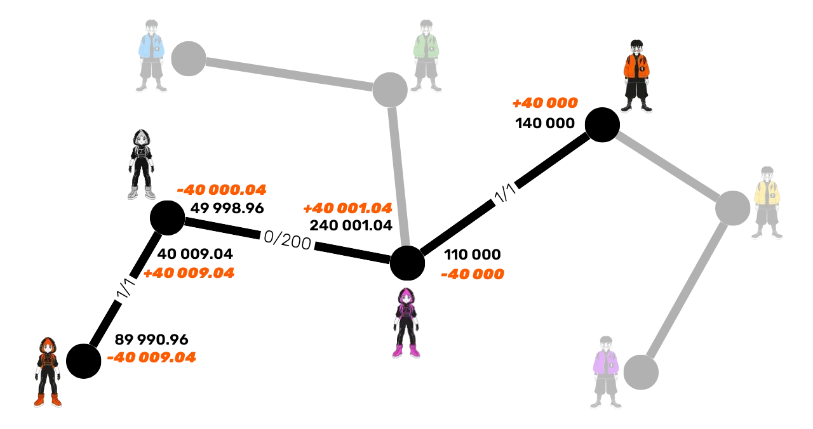

### Løkruting

For å rute en betaling fra avsenderen til mottakeren, bruker Lightning Network en metode kalt "**løkruting**". I motsetning til ruting av klassiske data, der hver ruter bestemmer retningen på dataene basert på deres destinasjon, fungerer løkruting annerledes:

- **Avsendernoden beregner hele ruten**: Alice, for eksempel, bestemmer at hennes betaling må gå gjennom Suzie og Carol før den når Bob.
- **Hver mellomliggende node kjenner bare sin umiddelbare nabo**: Suzie vet bare at hun mottok midler fra Alice og at hun må overføre dem til Carol. Suzie vet imidlertid ikke om Alice er kildenoden eller en mellomliggende node, og hun vet heller ikke om Carol er mottakernoden eller bare en annen mellomliggende node. Dette prinsippet gjelder også for Carol og alle andre noder på veien. Løkruting (Onion routing) bevarer dermed konfidensialiteten til transaksjonene ved å maskere identiteten til avsenderen og den endelige mottakeren. For å sikre at den sendende noden kan beregne en komplett rute til mottakeren i løkruting, må den opprettholde et **nettverkskart** for å kjenne sin topologi og bestemme mulige ruter.
  **Hva bør du ta med deg fra dette kapittelet?**

1. På Lightning kan betalinger rutes mellom noder som ikke er direkte koblet gjennom mellomliggende kanaler. Hver av disse mellomliggende nodene letter likviditetsstafetten.
2. Mellomliggende noder mottar en kommisjon for tjenesten sin, som består av faste og variable gebyrer.
3. Løkruting lar den sendende noden beregne den komplette ruten uten at mellomliggende noder kjenner kilden eller det endelige bestemmelsesstedet.

I dette kapittelet utforsket vi betalingsruting på Lightning-nettverket. Men et spørsmål oppstår: hva hindrer mellomliggende noder i å akseptere en innkommende betaling uten å videresende den til neste destinasjon, med mål om å avskjære transaksjonen? Dette er nettopp rollen til HTLC-er som vi vil studere i det følgende kapittelet.

## HTLC – Hashed Time Locked Contract

<chapterId>4369b85a-1365-55d8-99e1-509088210116</chapterId>


I dette kapittelet vil vi oppdage hvordan Lightning tillater betalinger å transittere gjennom mellomliggende noder uten å måtte stole på dem, takket være **HTLC** (_Hashed Time-Locked Contracts_). Disse smartkontraktene sikrer at hver mellomliggende node bare vil motta midlene fra sin kanal hvis den videresender betalingen til den endelige mottakeren, ellers vil ikke betalingen bli validert.

Problemet som oppstår for betalingsruting er derfor det nødvendige tillitsforholdet i mellomliggende noder, og blant de mellomliggende nodene selv. For å illustrere dette, la oss gjenbesøke vårt forenklede Lightning-nettverkseksempel med 3 noder og 2 kanaler:

- Alice har en kanal med Suzie.
- Suzie har en kanal med Bob.

Alice ønsker å sende 40 000 sats til Bob, men hun har ikke en direkte kanal med ham og ønsker ikke å åpne en. Hun ser etter en rute og bestemmer seg for å gå gjennom Suzies node.

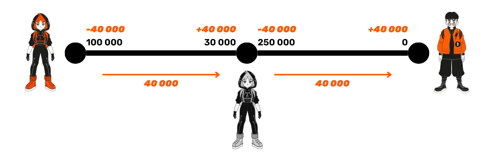

Hvis Alice naivt sender 40 000 satoshi til Suzie i håp om at Suzie vil overføre denne summen til Bob, kunne Suzie beholde midlene for seg selv og ikke overføre noe til Bob.

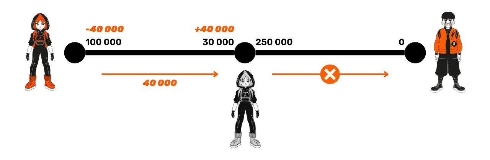
For å unngå denne situasjonen, på Lightning, bruker vi HTLC-er (Hashed Time-Locked Contracts), som gjør betalingen til den mellomliggende noden betinget, noe som betyr at Suzie må oppfylle visse betingelser for å få tilgang til Alices midler og overføre dem til Bob.

### Hvordan HTLC-er Fungerer

En HTLC er en spesiell kontrakt basert på to prinsipper:

- **Tilgangsbetingelse**: Mottakeren må avsløre en hemmelighet for å låse opp betalingen som skyldes dem.
- **Utløp**: Hvis betalingen ikke er fullstendig fullført innen en definert periode, blir den kansellert, og midlene returnerer til avsenderen.

Her er hvordan denne prosessen fungerer i vårt eksempel med Alice, Suzie og Bob:

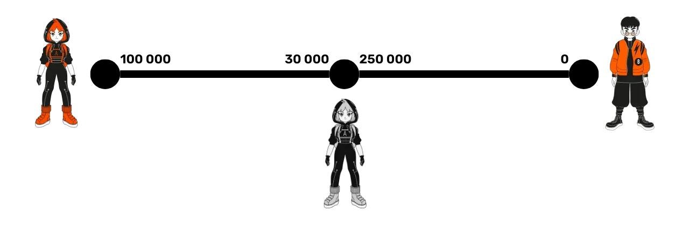
**Opprette hemmeligheten**: Bob genererer en tilfeldig hemmelighet notert som _s_ (forhåndsbildet), og beregner hashen notert som _r_ med hashfunksjonen notert som _h_. Vi har:
$$
r = h(s)
$$

Å bruke en hashfunksjon gjør det umulig å finne _s_ med bare _h(s)_, men hvis _s_ er oppgitt, er det enkelt å verifisere at den tilsvarer _h(s)_.


**Sende betalingsforespørselen**: Bob sender en **faktura** til Alice som ber om en betaling. Denne fakturaen inkluderer spesielt hashen _r_.


**Sende den betingede betalingen**: Alice sender en HTLC på 40 000 satoshis til Suzie. Betingelsen for at Suzie skal motta disse midlene er at hun gir Alice en hemmelighet _s'_ som tilfredsstiller følgende ligning:

$$
h(s') = r
$$

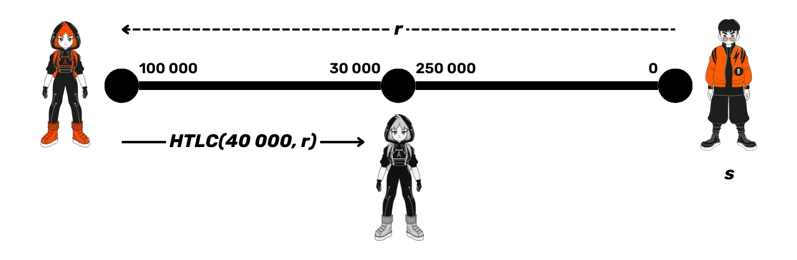

**Overføre HTLC til den endelige mottakeren**: Suzie, for å få de 40 000 satoshis fra Alice, må overføre en lignende HTLC på 40 000 satoshis til Bob, som har samme betingelse, nemlig at han må gi Suzie en hemmelighet _s'_ som tilfredsstiller ligningen:

$$
h(s') = r
$$

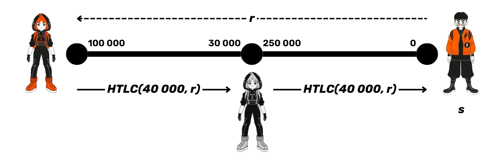

**Validering ved hemmeligheten _s_**: Bob gir _s_ til Suzie for å motta de 40 000 satoshis lovet i HTLC. Med denne hemmeligheten kan Suzie deretter låse opp Alices HTLC og få de 40 000 satoshis fra Alice. Betalingen blir deretter korrekt rutet til Bob.


Denne prosessen hindrer Suzie i å beholde Alices midler uten å fullføre overføringen til Bob, ettersom hun må sende betalingen til Bob for å få hemmeligheten _s_ og dermed låse opp Alices HTLC. Operasjonen forblir den samme selv om ruten inkluderer flere mellomliggende noder: det er bare et spørsmål om å gjenta Suzies trinn for hver mellomliggende node. Hver node er beskyttet av betingelsene til HTLC-ene, fordi opplåsing av den siste HTLC-en av mottakeren automatisk utløser opplåsing av alle andre HTLC-er i en kaskade.

### Utløp og håndtering av HTLC-er i tilfelle problemer

Hvis det under betalingsprosessen, en av de mellomliggende nodene, eller mottakernoden, slutter å svare, spesielt i tilfelle av internett- eller strømbrudd, kan ikke betalingen fullføres, fordi hemmeligheten som trengs for å låse opp HTLC-ene ikke overføres. Tar vårt eksempel med Alice, Suzie og Bob, oppstår dette problemet, for eksempel, hvis Bob ikke overfører hemmeligheten _s_ til Suzie. I dette tilfellet blir alle HTLC-ene oppstrøms i banen blokkert, og midlene de sikrer også.


For å unngå dette, har HTLC-er på Lightning en utløpstid som tillater fjerning av HTLC-en hvis den ikke er fullført etter en viss tid. Utløpet følger en spesifikk rekkefølge siden det starter først med HTLC-en nærmest mottakeren, og deretter gradvis beveger seg opp til transaksjonens utsteder. I vårt eksempel, hvis Bob aldri gir hemmeligheten _s_ til Suzie, ville dette først forårsake at Suzies HTLC mot Bob utløper.

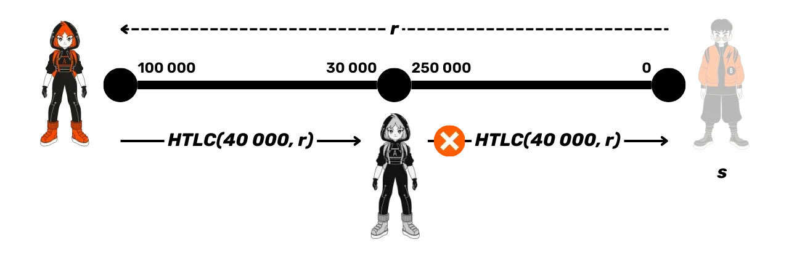

Deretter HTLC-en fra Alice til Suzie.

Hvis rekkefølgen av utløpstidene ble reversert, kunne Alice ha gjenvunnet betalingen sin før Suzie kunne beskytte seg mot potensiell juks. Faktisk, hvis Bob kommer tilbake for å kreve sin HTLC mens Alice allerede har fjernet hennes, ville Suzie være i en ulempe. Denne kaskaderende rekkefølgen av HTLC-utløp sikrer dermed at ingen mellomliggende node lider av urettferdige tap.

### Representasjon av HTLCs i forpliktelsestransaksjoner

Forpliktelsestransaksjoner representerer HTLCs på en slik måte at betingelsene de pålegger Lightning kan overføres til Bitcoin i tilfelle en tvungen kanallukking under levetiden til en HTLC. Som en påminnelse representerer forpliktelsestransaksjoner den nåværende tilstanden til kanalen mellom de to brukerne og tillater en ensidig tvungen lukking i tilfelle problemer. Med hver ny tilstand av kanalen, skapes 2 forpliktelsestransaksjoner: én for hver part. La oss gjenbesøke vårt eksempel med Alice, Suzie og Bob, men se nærmere på hva som skjer på kanalnivået mellom Alice og Suzie når HTLCen opprettes.
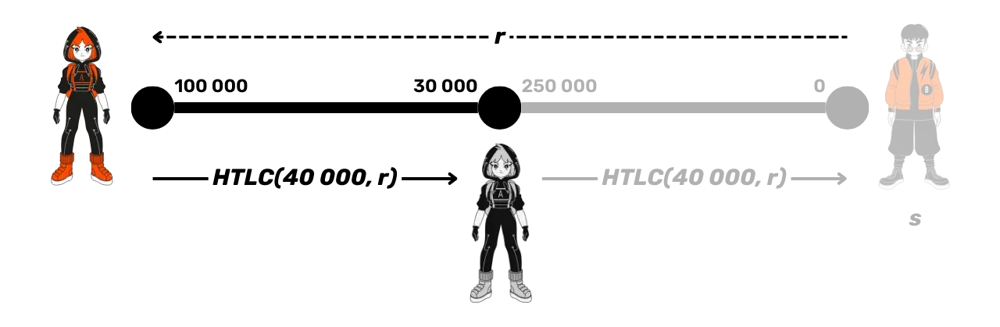

Før starten av 40 000 sats betalingen mellom Alice og Bob, har Alice 100 000 sats i sin kanal med Suzie, mens Suzie holder 30 000. Deres forpliktelsestransaksjoner er som følger:

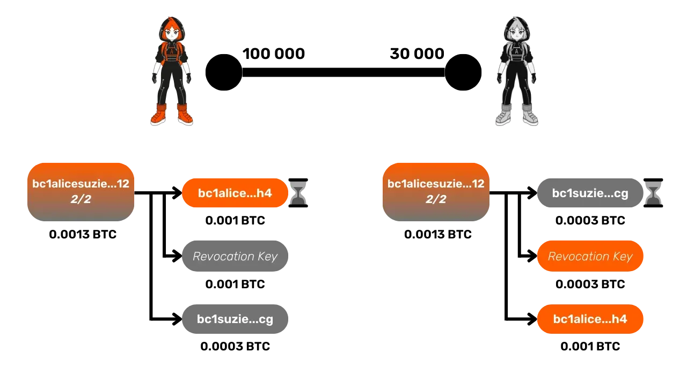

Alice har nettopp mottatt Bobs faktura, som spesielt inneholder _r_, hashen av hemmeligheten. Hun kan dermed konstruere en HTLC på 40 000 satoshier med Suzie. Denne HTLCen er representert i de siste forpliktelsestransaksjonene som en utgang kalt "**_HTLC Ut_**" på Alices side, siden midlene er utgående, og "**_HTLC Inn_**" på Suzies side, siden midlene er inngående.

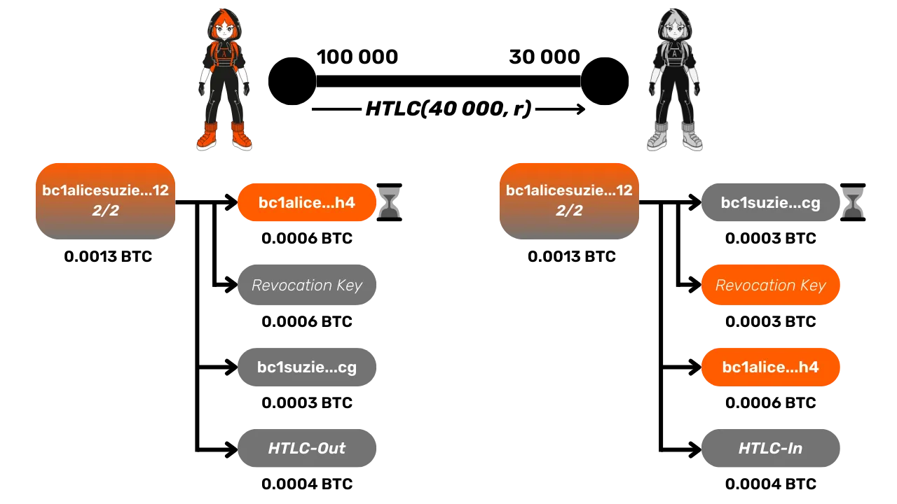

Disse utgangene assosiert med HTLCen deler nøyaktig de samme betingelsene, nemlig:

- Hvis Suzie er i stand til å gi hemmeligheten _s_, kan hun umiddelbart låse opp denne utgangen og overføre den til en adresse hun kontrollerer.
- Hvis Suzie ikke besitter hemmeligheten _s_, kan hun ikke låse opp denne utgangen, og Alice vil kunne låse den opp etter en tidsbegrensning for å sende den til en adresse hun kontrollerer. Tidsbegrensningen gir dermed Suzie en periode til å reagere hvis hun oppnår _s_.

Disse betingelsene gjelder kun hvis kanalen er lukket (dvs. en forpliktelsestransaksjon er publisert på kjeden) mens HTLCen fortsatt er aktiv på Lightning, noe som betyr at betalingen mellom Alice og Bob ikke ennå er avsluttet, og HTLCene ikke har utløpt ennå. Takket være disse betingelsene kan Suzie gjenvinne de 40 000 satoshiene av HTLCen skyldt til henne ved å gi _s_. Ellers gjenvinner Alice midlene etter utløpet av tidsbegrensningen, fordi hvis Suzie ikke kjenner _s_, betyr det at hun ikke har overført de 40 000 satoshiene til Bob, og derfor er Alices midler ikke skyldt til henne.

Videre, hvis kanalen lukkes mens flere HTLCer er ventende, vil det være like mange ekstra utganger som det er pågående HTLCer.
Hvis kanalen ikke er lukket, så etter utløpet eller suksessen til Lightning-betalingen, skapes nye forpliktelsestransaksjoner for å reflektere den nye, nå stabile, tilstanden til kanalen, det vil si uten noen ventende HTLCer. Ugangene relatert til HTLCene kan derfor fjernes fra forpliktelsestransaksjonene.
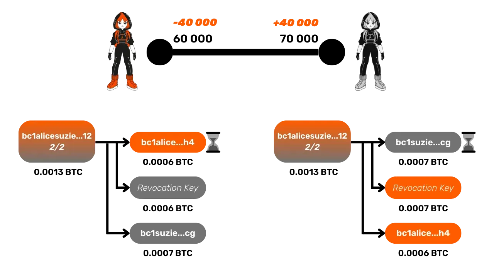
Til slutt, i tilfellet med en samarbeidsvillig kanallukking mens en HTLC er aktiv, stopper Alice og Suzie å akseptere nye betalinger og venter på løsningen eller utløpet av de pågående HTLC-ene. Dette lar dem publisere en lettere avslutningstransaksjon, uten utgangene relatert til HTLC-ene, dermed reduserer de gebyrer og unngår ventetiden for en mulig tidsbegrensning.
**Hva bør du ta med deg fra dette kapittelet?**

HTLC-er muliggjør ruting av Lightning-betalinger gjennom flere noder uten å måtte stole på dem. Her er de viktigste punktene å huske:

1. HTLC-er sikrer sikkerheten til betalinger gjennom en hemmelighet (preimage) og en utløpstid.
2. Løsningen eller utløpet av HTLC-er følger en spesifikk rekkefølge: deretter fra destinasjonen mot kilden, for å beskytte hver node.
3. Så lenge en HTLC verken er løst eller utløpt, opprettholdes den som en utgang i de mest nylige forpliktelsestransaksjonene.

I neste kapittel vil vi oppdage hvordan en node som utsteder en Lightning-transaksjon finner og velger ruter for sin betaling for å nå mottakernoden.

## Finne Veien

<chapterId>7e2ae959-c2a1-512e-b5d6-8fd962e819da</chapterId>


I de foregående kapitlene så vi hvordan man kan bruke andre noders kanaler for å rute betalinger og nå en node uten å være direkte koblet til den via en kanal. Vi diskuterte også hvordan man sikrer sikkerheten til overføringen uten å stole på mellomliggende noder. I dette kapittelet vil vi fokusere på å finne den best mulige ruten for å nå en målnode.

### Problemet med Ruting i Lightning

Som vi har sett, i Lightning, er det noden som sender betalingen som må beregne den komplette ruten til mottakeren, fordi vi bruker et løksrutingssystem. De mellomliggende nodene vet verken opprinnelsespunktet eller det endelige bestemmelsesstedet. De vet bare hvor betalingen kommer fra og til hvilken node de må overføre den videre. Dette betyr at den sendende noden må opprettholde en dynamisk lokal topologi av nettverket, med de eksisterende Lightning-nodene og kanalene mellom hver, og ta hensyn til åpninger, lukkinger og statusoppdateringer.


Selv med denne topologien av Lightning-nettverket, er det essensiell informasjon for ruting som forblir utilgjengelig for den sendende noden, som er den eksakte fordelingen av likviditet i kanalene i et gitt øyeblikk. Faktisk viser hver kanal bare sin **totale kapasitet**, men den interne fordelingen av midler er bare kjent for de to deltakende nodene. Dette utgjør utfordringer for effektiv ruting, ettersom suksessen til betalingen avhenger spesielt av om beløpet er mindre enn den laveste likviditeten på den valgte ruten. Imidlertid er ikke likviditetene alle synlige for den sendende noden.


### Nettverkskartoppdatering

For å holde nettverkskartet sitt oppdatert, utveksler noder regelmessig meldinger gjennom en algoritme kalt "**_gossip_**". Dette er en distribuert algoritme som brukes til å spre informasjon på en epidemiologisk måte til alle nodene i nettverket, som tillater utveksling og synkronisering av den globale tilstanden til kanalene i noen kommunikasjonssykluser. Hver node formidler informasjon til en eller flere naboer valgt tilfeldig eller ikke, disse igjen formidler informasjonen til andre naboer og så videre til en globalt synkronisert tilstand er oppnådd.

De 2 hovedmeldingene utvekslet mellom Lightning-noder er som følger:

- "**Channel Announcements**": meldinger som signaliserer åpningen av en ny kanal.
- "**Kanaloppdateringer**": oppdateringsmeldinger om tilstanden til en kanal, spesielt om utviklingen av gebyrer (men ikke om fordelingen av likviditet).
Lightning-noder overvåker også Bitcoin-blockchainen for å oppdage transaksjoner som lukker kanaler. Den lukkede kanalen fjernes deretter fra kartet siden den ikke lenger kan brukes til å rute våre betalinger.

### Ruting av en Betaling

La oss ta et eksempel på et lite Lightning Network med 7 noder: Alice, Bob, 1, 2, 3, 4, og 5. Forestill deg at Alice ønsker å sende en betaling til Bob, men må gå gjennom mellomliggende noder.

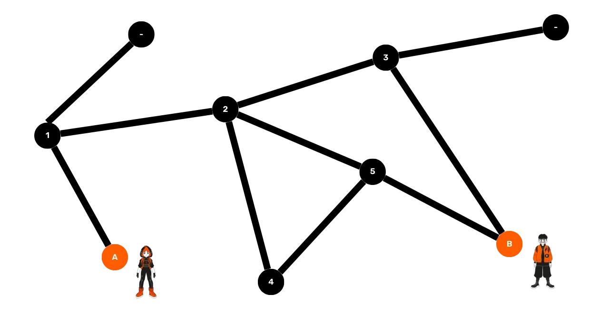

Her er den faktiske fordelingen av midler i disse kanalene:

- **Kanal mellom Alice og 1**: 250 000 sats på Alices side, 80 000 på 1s side (total kapasitet på 330 000 sats).
- **Kanal mellom 1 og 2**: 300 000 sats på 1s side, 200 000 på 2s side (total kapasitet på 500 000 sats).
- **Kanal mellom 2 og 3**: 50 000 sats på 2s side, 60 000 på 3s side (total kapasitet på 110 000 sats).
- **Kanal mellom 2 og 5**: 90 000 sats på side 2, 160 000 på side 5 (total kapasitet på 250 000 sats).
- **Kanal mellom 2 og 4**: 180 000 sats på side 2, 110 000 på side 4 (total kapasitet på 290 000 sats).
- **Kanal mellom 4 og 5**: 200 000 sats på side 4, 10 000 på side 5 (total kapasitet på 210 000 sats).
- **Kanal mellom 3 og Bob**: 50 000 sats på side 3, 250 000 på side Bob (total kapasitet på 300 000 sats).
- **Kanal mellom 5 og Bob**: 260 000 sats på side 5, 100 000 på side Bob (total kapasitet på 360 000 sats).

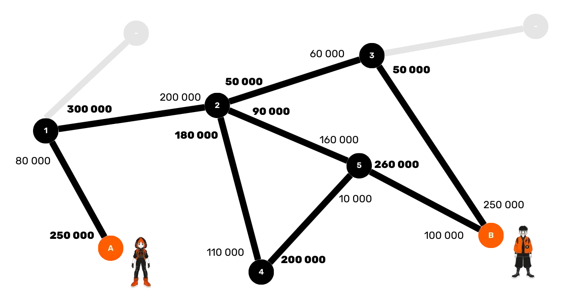

For å gjøre en betaling på 100 000 sats fra Alice til Bob, er rutealternativene begrenset av den tilgjengelige likviditeten i hver kanal. Den optimale ruten for Alice, basert på den kjente likviditetsfordelingen, kunne være sekvensen `Alice → 1 → 2 → 4 → 5 → Bob`:


Men siden Alice ikke kjenner den eksakte fordelingen av midler i hver kanal, må hun estimere den optimale ruten sannsynlighetsmessig, med tanke på følgende kriterier:

- **Sannsynlighet for suksess**: en kanal med en høyere total kapasitet er mer sannsynlig å inneholde tilstrekkelig likviditet. For eksempel har kanalen mellom node 2 og node 3 en total kapasitet på 110 000 sats, så det er usannsynlig å finne 100 000 sats eller mer på siden av node 2, selv om det fortsatt er mulig.
- **Transaksjonsgebyrer**: ved valg av den beste ruten vurderer også den sendende noden gebyrene som pålegges av hver mellomliggende node og søker å minimere de totale rutekostnadene.
- **Utløp av HTLC-er**: for å unngå blokkerte betalinger, er også utløpstiden for HTLC-er en parameter å vurdere.
- **Antall mellomliggende noder**: til slutt, mer generelt, vil den sendende noden forsøke å finne en rute med færrest mulige noder for å redusere risikoen for feil og begrense Lightning-transaksjonsgebyrer.
Ved å analysere disse kriteriene, kan den sendende noden teste de mest sannsynlige rutene og forsøke å optimalisere dem. I vårt eksempel kunne Alice rangere de beste rutene som følger:

1. `Alice → 1 → 2 → 5 → Bob`, fordi det er den korteste ruten med høyest kapasitet.
2. `Alice → 1 → 2 → 4 → 5 → Bob`, fordi denne ruten tilbyr gode kapasiteter, selv om den er lengre enn den første.
3. `Alice → 1 → 2 → 3 → Bob`, fordi denne ruten inkluderer kanalen `2 → 3`, som har veldig begrenset kapasitet, men forblir potensielt brukbar.

### Utførelse av betaling

Alice bestemmer seg for å teste sin første rute (`Alice → 1 → 2 → 5 → Bob`). Hun sender derfor en HTLC på 100 000 sats til node 1. Denne noden sjekker at den har tilstrekkelig likviditet med node 2, og fortsetter overføringen. Node 2 mottar så HTLC fra node 1, men innser at den ikke har nok likviditet i sin kanal med node 5 for å rute en betaling på 100 000 sats. Den sender deretter en feilmelding tilbake til node 1, som overfører den til Alice. Denne ruten har mislyktes.

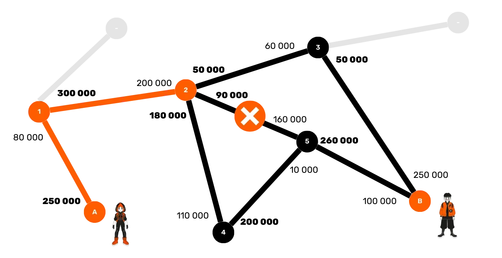

Alice forsøker deretter å rute betalingen sin ved hjelp av sin andre rute (`Alice → 1 → 2 → 4 → 5 → Bob`). Hun sender en HTLC på 100 000 sats til node 1, som overfører den til node 2, deretter til node 4, til node 5, og til slutt til Bob. Denne gangen er likviditeten tilstrekkelig, og ruten er funksjonell. Hver node låser opp sin HTLC i kaskade ved å bruke forhåndsbildet levert av Bob (hemmeligheten _s_), som lar Alices betaling til Bob bli vellykket fullført.


Søket etter en rute utføres som følger: den sendende noden starter med å identifisere de best mulige rutene, og forsøker deretter betalinger suksessivt til en funksjonell rute er funnet.

Det er verdt å merke seg at Bob kan gi Alice informasjon i **fakturaen** for å lette rutingen. For eksempel kan han indikere nærliggende kanaler med tilstrekkelig likviditet eller avsløre eksistensen av private kanaler. Disse indikasjonene lar Alice unngå ruter med liten sjanse for suksess og først forsøke stiene anbefalt av Bob.

**Hva bør du ta med deg fra dette kapittelet?**

1. Noder opprettholder et kart over nettverkstopologien gjennom kunngjøringer og ved å overvåke kanallukninger på Bitcoin-blockchainen.
2. Søket etter en optimal rute for en betaling forblir sannsynlig og avhenger av mange kriterier.
3. Bob kan gi indikasjoner i **fakturaen** for å veilede Alices ruting og spare henne for å teste usannsynlige ruter.

I det følgende kapittelet vil vi spesifikt studere funksjonen av fakturaer, i tillegg til noen andre verktøy som brukes på Lightning Network.

# Verktøyene til Lightning Network

<partId>74d6c334-ec5d-55d9-8598-f05694703bf6</partId>

## Faktura, LNURL, og Keysend

<chapterId>e34c7ecd-2327-52e3-b61e-c837d9e5e8b0</chapterId>

I dette kapittelet vil vi ta en nærmere titt på hvordan **fakturaer** i Lightning fungerer, det vil si betalingsforespørsler sendt av mottaker-noden til sender-noden. Målet er å forstå hvordan man betaler og mottar betalinger på Lightning. Vi vil også diskutere 2 alternativer til klassiske fakturaer: LNURL og Keysend.


### Strukturen til Lightning-fakturaer

Som forklart i kapittelet om HTLCs, begynner hver betaling med at mottakeren genererer en **faktura**. Denne fakturaen blir deretter overført til betaleren (via en QR-kode eller ved å kopiere og lime inn) for å initiere betalingen. En faktura består av to hoveddeler:

1. **Den menneskelesbare delen**: denne seksjonen inneholder tydelig synlig metadata for å forbedre brukeropplevelsen.
2. **Nyttelasten**: denne seksjonen inkluderer informasjon ment for maskiner for å behandle betalingen.

Den typiske strukturen til en faktura starter med en identifikator `ln` for "Lightning", etterfulgt av `bc` for Bitcoin, deretter beløpet på fakturaen. En separator `1` skiller den menneskelesbare delen fra data (nyttelast) delen.

La oss ta følgende faktura som et eksempel:

```invoice
lnbc100u1p0x7x7dpp5l7r9y50wrzz0lwnsqgxdks50lxtwkl0mhd9lslr4rcgdtt2n6lssp5l3pkhdx0cmc9gfsqvw5xjhph84my2frzjqxqyz5vq9qsp5k4mkzv5jd8u5n89d2yc50x7ptkl0zprx0dfjh3km7g0x98g70hsqq7sqqqgqqyqqqqlgqqvnv2k5ehwnylq3rhpd9g2y0sq9ujyxsqqypjqqyqqqqqqqqqqqsqqqqq9qsq3vql5f6e45xztgj7y6xw6ghrcz3vmh8msrz8myvhsarxg42ce9yyn53lgnryx0m6qqld8fql
```

Vi kan allerede dele den inn i 2 deler. Først er det den menneskelesbare delen:

```invoice
lnbc100u
```

Deretter delen ment for nyttelasten:

```invoice

p0x7x7dpp5l7r9y50wrzz0lwnsqgxdks50lxtwkl0mhd9lslr4rcgdtt2n6lssp5l3pkhdx0cmc9gfsqvw5xjhph84my2frzjqxqyz5vq9qsp5k4mkzv5jd8u5n89d2yc50x7ptkl0zprx0dfjh3km7g0x98g70hsqq7sqqqgqqyqqqqlgqqvnv2k5ehwnylq3rhpd9g2y0sq9ujyxsqqypjqqyqqqqqqqqqqqsqqqqq9qsq3vql5f6e45xztgj7y6xw6ghrcz3vmh8msrz8myvhsarxg42ce9yyn53lgnryx0m6qqld8fql
```
De to delene er separert av en `1`. Denne separasjonen ble valgt i stedet for et spesialtegn for å tillate enkel kopiering og liming av hele fakturaen ved å dobbeltklikke.

I den første delen kan vi se at:

- `ln` indikerer at det er en Lightning-transaksjon.
- `bc` indikerer at Lightning-nettverket er på Bitcoin blockchain (og ikke på testnet eller på Litecoin).
- `100u` indikerer mengden av fakturaen, uttrykt i **mikrosatoshi** (`u` som betyr "mikro"), som her tilsvarer 10 000 sats.

For å angi betalingsbeløpet, uttrykkes det i sub-enheter av bitcoin. Her er enhetene som brukes:

- **Millibitcoin (betegnet `m`):** Representerer ett tusendels bitcoin.

  $$
  1 \, \text{mBTC} = 10^{-3} \, \text{BTC} = 10^5 \, \text{satoshi}
  $$

- **Mikrobitcoin (betegnet `u`):** Også noen ganger kalt "bit", representerer ett milliondels bitcoin.

  $$
  1 \, \mu\text{BTC} = 10^{-6} \, \text{BTC} = 100 \, \text{satoshi}
  $$

- **Nanobitcoin (betegnet `n`):** Representerer ett milliarddels bitcoin.

  $$
  1 \, \text{nBTC} = 10^{-9} \, \text{BTC} = 0.1 \, \text{satoshi}
  $$

- **Picobitcoin (betegnet `p`):** Representerer ett billiondels bitcoin.
  $$
  1 \, \text{pBTC} = 10^{-12} \, \text{BTC} = 0.0001 \, \text{satoshi}
  $$

### Innholdet i en Faktura

Innholdet i en faktura inkluderer flere biter av informasjon nødvendig for å behandle betalingen:

- **Tidsstempelet:** Øyeblikket fakturaen ble opprettet, uttrykt i Unix Timestamp (antall sekunder som har gått siden 1. januar 1970).
- **Hashing av Hemmeligheten**: Som vi så i seksjonen om HTLCs, må mottakerens node gi senderens node hashen av forhåndsbildet. Dette brukes i HTLCs for å sikre transaksjonen. Vi refererte til det som "_r_".
- **Betalingshemmeligheten**: En annen hemmelighet genereres av mottakeren, men denne gangen overføres den til senderens node. Den brukes i løkruting for å hindre mellomliggende noder i å gjette om neste node er den endelige mottakeren eller ikke. Dette opprettholder dermed en form for konfidensialitet for mottakeren med hensyn til den siste mellomliggende noden på ruten.
- **Mottakerens Offentlige Nøkkel**: Indikerer til betaleren identifikatoren til personen som skal betales.
- **Utløpstiden**: Maksimal tid for fakturaen å bli betalt (1 time som standard).
- **Rutehint**: Tilleggsinformasjon gitt av mottakeren for å hjelpe senderen med å optimalisere betalingsruten.
- **Signaturen**: Garanterer integriteten til fakturaen ved å autentisere all informasjonen.

Fakturaene er deretter kodet i **bech32**, samme format som for Bitcoin SegWit-adresser (format som starter med `bc1`).

### LNURL Uttak
I en tradisjonell transaksjon, som et kjøp i en butikk, genereres fakturaen for det totale beløpet som skal betales. Når fakturaen presenteres (i form av en QR-kode eller en streng med tegn), kan kunden skanne den og fullføre transaksjonen. Betalingen følger deretter den tradisjonelle prosessen som vi studerte i forrige avsnitt. Imidlertid kan denne prosessen noen ganger være veldig tungvint for brukeropplevelsen, ettersom den krever at mottakeren sender informasjon til avsenderen via fakturaen.
For visse situasjoner, som å ta ut bitcoins fra en nettjeneste, er den tradisjonelle prosessen for tungvint. I slike tilfeller forenkler **LNURL** uttaksløsningen denne prosessen ved å vise en QR-kode som mottakerens lommebok skanner for automatisk å opprette fakturaen. Tjenesten betaler deretter fakturaen, og brukeren ser ganske enkelt et øyeblikkelig uttak.


LNURL er et kommunikasjonsprotokoll som spesifiserer et sett med funksjonaliteter designet for å forenkle interaksjoner mellom Lightning-noder og klienter, samt tredjepartsapplikasjoner. LNURL-uttaket, som vi nettopp har sett, er dermed bare ett eksempel blant andre funksjonaliteter.
Denne protokollen er basert på HTTP og tillater oppretting av lenker for ulike operasjoner, som en betalingsforespørsel, en uttaksforespørsel, eller andre funksjonaliteter som forbedrer brukeropplevelsen. Hver LNURL er en bech32-kodet URL med lnurl-prefikset, som, når den skannes, utløser en serie automatiske handlinger i Lightning-lommeboken.
For eksempel, LNURL-uttak (LUD-03) funksjonen tillater å ta ut midler fra en tjeneste ved å skanne en QR-kode, uten behov for å manuelt generere en faktura. På samme måte muliggjør LNURL-auth (LUD-04) innlogging på nettjenester ved bruk av en privat nøkkel i ens Lightning-lommebok i stedet for et passord.

### Å sende en Lightning-betaling uten en faktura: Keysend

Et annet interessant tilfelle er overføring av midler uten å ha mottatt en faktura på forhånd, kjent som "**Keysend**". Denne protokollen tillater å sende midler ved å legge til et preimage i de krypterte betalingsdataene, tilgjengelig kun for mottakeren. Dette preimage gjør det mulig for mottakeren å låse opp HTLC-en, og dermed hente midlene uten å ha generert en faktura på forhånd.

For å forenkle, i denne protokollen, er det avsenderen som genererer hemmeligheten som brukes i HTLC-ene, i stedet for mottakeren. Praktisk sett tillater dette avsenderen å gjøre en betaling uten å ha måttet samhandle med mottakeren på forhånd.


**Hva bør du ta med deg fra dette kapittelet?**

1. En **Lightning-faktura** er en betalingsforespørsel bestående av en menneskelesbar del og en maskindatadel.
2. Fakturaen er kodet i **bech32**, med en `1` separator for å lette kopiering og en datadel som inneholder all informasjonen som er nødvendig for å behandle betalingen.
3. Andre betalingsprosesser eksisterer på Lightning, spesielt **LNURL-Withdraw** for å forenkle uttak, og **Keysend** for direkte overføringer uten en faktura.

I det følgende kapittelet vil vi se hvordan en nodeoperatør kan håndtere likviditet i sine kanaler, for aldri å bli blokkert og alltid kunne sende og motta betalinger på Lightning-nettverket.

## Administrere din likviditet

<chapterId>cc76d0c4-d958-57f5-84bf-177e21393f48</chapterId>


I dette kapittelet vil vi utforske strategier for effektiv håndtering av likviditet på Lightning-nettverket. Likviditetsstyring varierer avhengig av brukertype og kontekst. Vi vil se på hovedprinsippene og eksisterende teknikker for å bedre forstå hvordan man kan optimalisere denne styringen.

### Likviditetsbehov
Det er tre hovedbrukerprofiler på Lightning, hver med spesifikke likviditetsbehov:
1. **Betalende**: Dette er den som utfører betalinger. De trenger utgående likviditet for å kunne overføre midler til andre brukere. For eksempel kan dette være en forbruker.
2. **Selgeren (eller Mottakeren)**: Dette er den som mottar betalinger. De trenger innkommende likviditet for å kunne akseptere betalinger til sin node. For eksempel kan dette være en bedrift eller en nettbutikk.
3. **Ruteren**: En mellomliggende node, ofte spesialisert i å rute betalinger, som må optimalisere sin likviditet i hver kanal for å rute så mange betalinger som mulig og tjene avgifter.

Disse profilene er åpenbart ikke faste; en bruker kan bytte mellom betaler og mottaker avhengig av transaksjonene. For eksempel kan Bob motta sin lønn på Lightning fra sin arbeidsgiver, noe som plasserer ham i posisjonen som en "selger" som krever innkommende likviditet. Deretter, hvis han ønsker å bruke sin lønn til å kjøpe mat, blir han en "betalende" og må da ha utgående likviditet.

For å bedre forstå, la oss ta eksemplet med et enkelt nettverk bestående av tre noder: kjøperen (Alice), ruteren (Suzie) og selgeren (Bob).


Forestil deg at kjøperen ønsker å sende 30 000 sats til selgeren og at betalingen går gjennom ruternodens node. Hver part må da ha et minimumsbeløp av likviditet i betalingsretningen:

- Betaleren må ha minst 30 000 satoshis på sin side av kanalen med ruteren.
- Selgeren må ha en kanal der 30 000 satoshis er på motsatt side for å kunne motta dem.
- Ruteren må ha 30 000 satoshis på betalerens side i sin kanal, og også 30 000 satoshis på sin side i kanalen med selgeren, for å kunne rute betalingen.


### Strategier for Likviditetsstyring

Betalende må sørge for å opprettholde tilstrekkelig likviditet på sin side av kanalene for å garantere utgående likviditet. Dette viser seg å være relativt enkelt, da det er nok å åpne nye Lightning-kanaler for å ha denne likviditeten. Faktisk er de opprinnelige midlene låst i multisig on-chain helt på betalerens side i Lightning-kanalen ved starten. Betalingskapasiteten er dermed sikret så lenge kanaler åpnes med nok midler. Når den utgående likviditeten er uttømt, er det nok å åpne nye kanaler.
På den annen side, for selgeren, er oppgaven mer kompleks. For å kunne motta betalinger, må de ha likviditet på motsatt side av sine kanaler. Derfor er det ikke nok å åpne en kanal: de må også gjøre en betaling i denne kanalen for å flytte likviditeten til den andre siden før de selv kan motta betalinger. For visse Lightning-brukerprofiler, som handelsdrivende, er det en klar ubalanse mellom hva deres node sender og hva den mottar, siden målet med en virksomhet primært er å samle mer enn den bruker, for å generere en fortjeneste. Heldigvis, for disse brukerne med spesifikke behov for innkommende likviditet, finnes det flere løsninger:

- **Tiltrekke kanaler**: Handelsdrivende drar nytte av en fordel på grunn av volumet av innkommende betalinger forventet på deres node. Med dette i betraktning kan de prøve å tiltrekke seg rutenoder som ser etter inntekt fra transaksjonsavgifter og som kanskje åpner kanaler mot dem, i håp om å rute deres betalinger og samle de tilknyttede avgiftene.
- **Likviditetsbevegelse**: Selgeren kan også åpne en kanal og overføre noe av midlene til den motsatte siden ved å gjøre fiktive betalinger til en annen node, som vil returnere pengene på en annen måte. Vi vil se i neste del hvordan man utfører denne operasjonen.
- **Triangulær åpning**: Plattformer eksisterer for noder som ønsker å åpne kanaler i samarbeid, noe som lar hver av dem dra nytte av umiddelbar innkommende og utgående likviditet. For eksempel tilbyr [LightningNetwork+](https://lightningnetwork.plus/) denne tjenesten. Hvis Alice, Bob og Suzie ønsker å åpne en kanal med 100 000 sats, kan de bli enige på denne plattformen om at Alice skal åpne en kanal mot Bob, Bob mot Suzie, og Suzie mot Alice. På denne måten har hver av dem 100 000 sats med utgående likviditet og 100 000 sats med innkommende likviditet, samtidig som de kun har låst 100 000 sats.


- **Kjøp av kanaler**: Tjenester for å leie Lightning-kanaler eksisterer også for å oppnå innkommende likviditet, som [Bitrefill Thor](https://www.bitrefill.com/thor-lightning-network-channels/) eller [Lightning Labs Pool](https://lightning.engineering/pool/). For eksempel kan Alice kjøpe en kanal på en million satoshis mot sin node for å kunne motta betalinger.

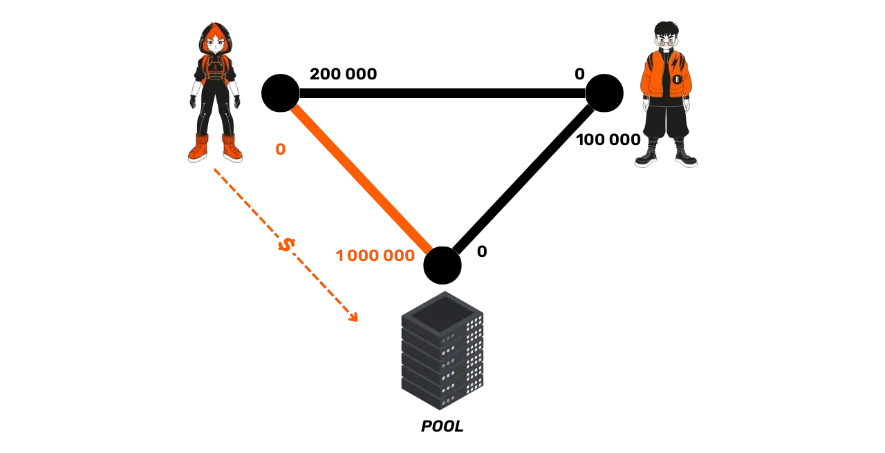

Til slutt, for rutere, hvis mål er å maksimere antall behandlete betalinger og de innsamlede avgiftene, må de:

- Åpne godt finansierte kanaler med strategiske noder.
- Justere fordelingen av midler i kanalene regelmessig i henhold til nettverkets behov.

### Loop Out-tjenesten

[Loop Out](https://lightning.engineering/loop/)-tjenesten, tilbudt av Lightning Labs, gjør det mulig å flytte likviditet til den motsatte siden av kanalen samtidig som man tar tilbake midlene på Bitcoin-blockchainen. For eksempel sender Alice 1 million satoshis via Lightning til en loop-node, som deretter returnerer disse midlene til henne i on-chain bitcoins. Dette balanserer hennes kanal med 1 million satoshis på hver side, og optimaliserer hennes kapasitet til å motta betalinger.


Derfor muliggjør denne tjenesten innkommende likviditet samtidig som man tar tilbake sine bitcoins on-chain, noe som bidrar til å begrense immobiliseringen av kontanter som er nødvendig for å akseptere betalinger med Lightning.

**Hva bør du ta med deg fra dette kapittelet?**

- For å sende betalinger på Lightning, må du ha nok likviditet på din side i dine kanaler. For å øke denne sendekapasiteten, åpne rett og slett nye kanaler.
- For å motta betalinger, trenger du å ha likviditet på den motsatte siden i dine kanaler. Å øke denne mottakskapasiteten er mer komplekst, da det krever at andre åpner kanaler mot deg, eller å gjøre (fiktive eller reelle) betalinger for å flytte likviditeten til den andre siden.
- Å opprettholde likviditet der det er ønsket kan være enda mer utfordrende avhengig av bruken av kanalene. Det er derfor verktøy og tjenester eksisterer for å hjelpe med å balansere kanalene som ønsket.

I neste kapittel foreslår jeg å gjennomgå de viktigste konseptene fra denne opplæringen.

# Gå Videre

<partId>6bbf107d-a224-5916-9f0c-2b4d30dd0b17</partId>

## Opplæringens Konklusjon

<chapterId>a65a571c-561b-5e1c-87bf-494644653c22</chapterId>


I dette siste kapittelet som markerer slutten på LNP201-opplæringen, foreslår jeg å gjenoppta de viktige konseptene vi har dekket sammen.
Målet med denne opplæringen var å gi deg en omfattende og teknisk forståelse av Lightning Network. Vi oppdaget hvordan Lightning Network stoler på Bitcoin-blockchainen for å utføre transaksjoner utenfor kjeden, samtidig som de grunnleggende egenskapene til Bitcoin beholdes, spesielt fraværet av behovet for å stole på andre noder.

### Betalingskanaler

I de innledende kapitlene utforsket vi hvordan to parter, ved å åpne en betalingskanal, kan gjennomføre transaksjoner utenfor Bitcoin-blockchainen. Her er trinnene som ble dekket:

1. **Kanalåpning**: Opprettelsen av kanalen gjøres gjennom en Bitcoin-transaksjon som låser midlene i en 2/2 multisignaturadresse. Dette innskuddet representerer Lightning-kanalen på blockchainen.

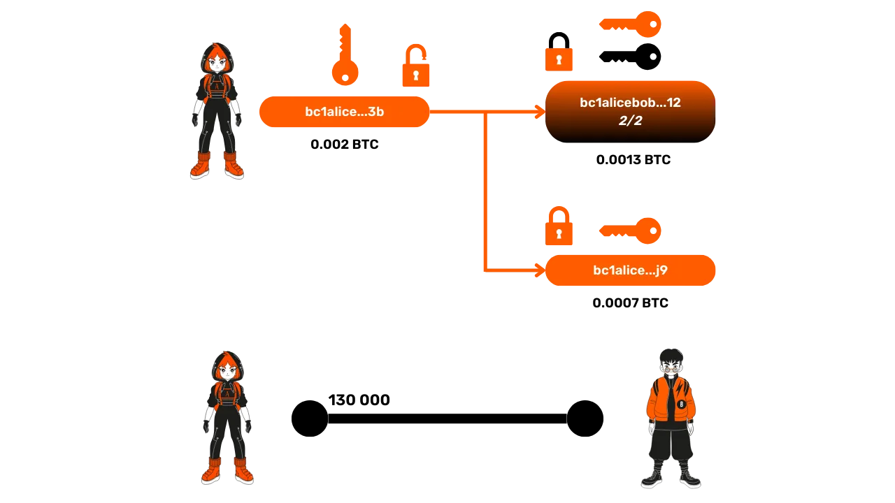 2. **Transaksjoner i Kanalen**: I denne kanalen er det deretter mulig å utføre tallrike transaksjoner uten å måtte publisere dem på blockchainen. Hver Lightning-transaksjon skaper en ny tilstand av kanalen reflektert i en forpliktelsestransaksjon.
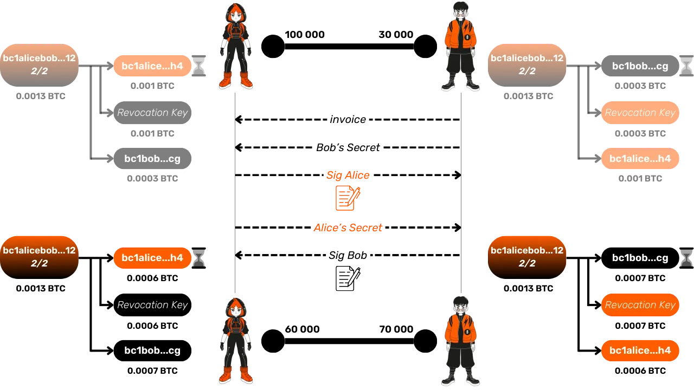

3. **Sikring og Lukking**: Deltakerne forplikter seg til den nye tilstanden av kanalen ved å utveksle tilbakekallingsnøkler for å sikre midlene og forhindre juks. Begge parter kan lukke kanalen samarbeidsvillig ved å lage en ny transaksjon på Bitcoin-blockchainen, eller som en siste utvei gjennom en tvungen lukking. Denne siste muligheten, selv om den er mindre effektiv fordi den er lengre og noen ganger dårlig vurdert i form av gebyrer, tillater fortsatt gjenoppretting av midler. I tilfelle juks, kan offeret straffe juksemakeren ved å gjenopprette alle midlene fra kanalen på blockchainen.


### Nettverket av Kanaler

Etter å ha studert isolerte kanaler, utvidet vi analysen vår til nettverket av kanaler:

- **Ruting**: Når to parter ikke er direkte koblet av en kanal, tillater nettverket ruting gjennom mellomliggende noder. Betalinger transitterer da fra en node til en annen.


- **HTLCs**: Betalinger som transitterer gjennom mellomliggende noder sikres av "_Hash Time-Locked Contracts_" (HTLC), som tillater at midlene blir låst til betalingen er fullført fra ende til ende.

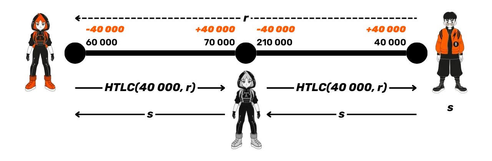

- **Onion Routing**: For å sikre konfidensialiteten til betalingen, maskerer onion routing den endelige destinasjonen for mellomliggende noder. Den sendende noden må derfor beregne hele ruten, men i fravær av fullstendig informasjon om likviditeten i kanalene, fortsetter den gjennom suksessive forsøk for å rute betalingen.


### Likviditetsstyring

Vi har sett at likviditetsstyring er en utfordring på Lightning for å sikre en jevn flyt av betalinger. Å sende betalinger er relativt enkelt: det krever bare å åpne en kanal. Imidlertid krever mottak av betalinger å ha likviditet på motsatt side av ens kanaler. Her er noen strategier som ble diskutert:

- **Tiltrekke Kanaler**: Ved å oppmuntre andre noder til å åpne kanaler mot seg selv, oppnår en bruker innkommende likviditet.

- **Flytte Likviditet**: Ved å sende betalinger til andre kanaler, flyttes likviditeten til motsatt side.


- **Bruke Tjenester som Loop og Pool**: Disse tjenestene tillater rebalansering eller kjøp av kanaler med likviditet på motsatt side.
  
- **Samarbeidsåpninger**: Det finnes også plattformer tilgjengelig for å koble seg til for å utføre trekantede åpninger og for å ha innkommende likviditet.


### Anerkjennelser
Jeg vil gjerne takke hver og en av dere for deres interesse, støtte og spørsmål gjennom denne serien. Opprinnelig var ideen min å skape franskspråklig innhold rundt de tekniske aspektene ved Lightning, gitt mangelen på tilgjengelige ressurser. Det var en personlig utfordring jeg ønsket å ta på meg ved å kombinere teknisk rigor med tilgjengelighet. Hvis du likte dette gratis kurset, er du velkommen til å vurdere det i "_Rate this course_"-seksjonen og dele det med dine kjære og på dine sosiale nettverk.
Takk, vi sees snart!

### Bonus: Intervju med Fanis


## Vurder dette kurset

<chapterId>38814c99-eb7b-5772-af49-4386ee2ce9b0</chapterId>
<isCourseReview>true</isCourseReview>

## Avsluttende eksamen

<chapterId>7ed33400-aef7-5f3e-bfb1-7867e445d708</chapterId>
<isCourseExam>true</isCourseExam>

## Konklusjon

<chapterId>afc0d72b-4fbc-5893-90b2-e27fb519ad02</chapterId>

**Gratulerer med fullføringen av dette kurset!**

Vennligst merk at dette kapittelet for øyeblikket er under konstruksjon og en forbedret versjon vil snart ankomme. I mellomtiden, hvis du er ivrig etter å fortsette din Bitcoin-reise, inviterer vi deg til å utforske de andre kursene og opplæringene som er tilgjengelige på vår plattform. Fortsett det gode arbeidet og lykke til med læringen!