# Teekond läbi vabaduse filosoofilise ajaloo

Vabaduse filosoofiline ajalugu uurib vabadust läbi ajaloo. Damien Theillier vaatleb kahte poliitilist filosoofiat: vabadust ja võimu. Ta analüüsib mõtlejaid nagu Frédéric Bastiat, Lord Acton, Karl Marx ja Murray Rothbard, tuues esile nende vaateid tootmisele, röövimisele, klassivõitlusele ja riigile.

Kursus naaseb vabaduse alguste juurde antiikajal, kreeklased ja roomlased, läbi keskaja, kus inimvabadust arutatakse religioosses ja poliitilises kontekstis. See näitab, kuidas vabaduse ideed arenesid koos ülikoolide sünni ja kapitalismi esimeste vormidega Itaalia linnades.

Renessansist valgustusajastuni uurib kursus vabaduse tõusu, mida iseloomustab religioosne sallivus ja majandusvabadus, kulmineerudes 1776. aastal suurte sündmustega nagu Philadelphia Kongress. 19. ja 20. sajand tunnistavad vabaduse tipphetke ja langust, silmitsi kapitalismi kriitikaga ja kollektivismi ohtudega, pannes perspektiivi tänapäeva väljakutsed vabadusele.

+++

# Vabadus või Võim

<partId>e59475e9-3ae4-5e66-a17e-218de0281b06</partId>

## Sissejuhatus: On olemas ainult kaks poliitilist filosoofiat

<chapterId>ffa60c0d-ee2b-575d-a4ac-4e9ccdad396f</chapterId>

Miks nimetada seda kursust vabaduse ajalooks? Sest me peame mõistma ideede ja sündmuste vahelist suhet, et paremini hinnata meie ajastut ja tegutseda otsustavalt. Just minevikust leiame elemendid paremaks mõistmiseks, mis on vabadus ja miks me peame seda hindama.

> Kui minevik ei valgusta enam tulevikku, kõnnib vaim pimeduses (Alexis de Tocqueville - _Demokraatia Ameerikas_.)

Samal ajal ütles Auguste Comte: "Üks ei tunne täielikult teadust enne, kui ta tunneb selle ajalugu." Seda tõde võib rakendada vabaduse ideele.
Tõepoolest, vabadus ei ole uus idee. See on pärand, mis on antud edasi põlvest põlve. Kogu tsivilisatsiooni ajalugu tunnistab pidevat võitlust vabaduse eest.
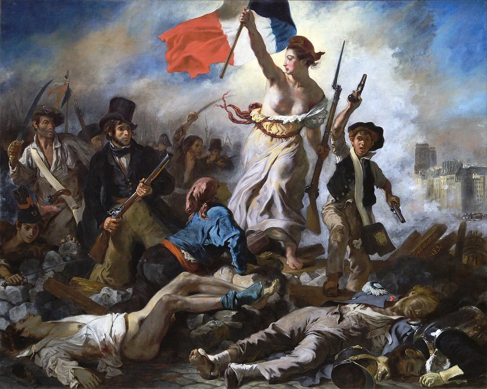

Siiski, selle kursuse eesmärk ei ole ainult valgustada vabaduse ajalugu, vaid ka, ja mis veelgi tähtsam, arendada kriitilist otsustusvõimet. Tõepoolest, ajalugu üksi ei piisa oleviku ja tuleviku hindamiseks. Sellele peab kaasnema kriitiline mõtlemine ja mineviku vigade üle otsustamine. See on filosoofia panus. Seepärast olen nimetanud selle kursuse: vabaduse filosoofiline ajalugu. Tõepoolest, tegemist on uurimusega sellest, kuidas filosoofid on läbi aegade vabadust mõistnud.

### Filosoofia ülesanne

Sellel on algusest peale kaks eesmärki:

- Esiteks on see anda tähendus ebamäärastele ja segadusse ajavatele mõistetele. Mis on hea, tõene, õiglane, ilus? Nagu ajaloo ülesanne on valgustada minevikku, nii on filosoofia kunst õigesti määratleda mõisteid. Seepärast peame selles kursuses alustama mõistmisest, mis on vabadus.

Vabadus on mõiste, mis hõlmab paljusid variante, mis on sama reaalsuse võimalikud deklinatsioonid: poliitiline vabadus, majanduslik vabadus, südametunnistuse vabadus, sõnavabadus, usuvabadus, ühinemisvabadus jne. Millisest reaalsusest me räägime?
Vabadust võib lihtsalt defineerida kui valikuõigust, mis kuulub inimesele endale. See on inimolendi omane võime. See on põhimõtteliselt individuaalne reaalsus. Ainult üksikisik saab mõelda ja tegutseda, st teha valikuid. See ei tähenda, et üksikisik on üksi, et ta ei võlgne midagi teistele. Vastupidi, ta elab ühiskonnas ja peab teistega koostööd tegema omaenda hüvanguks. Kuid igaüks jääb vabaks koostööd teha või mitte ja peab võtma vastutuse oma valikute eest.

Vastutuse mõiste on vabadusega kaasnev, sest iga valikul on tagajärjed. Vastutav isik on see, kes võtab oma valikute kulud enda kanda ja ei veereta neid teistele. Teisisõnu, vabadus on nõudlik. See on moraalne mõiste, mis tähendab õigusi, kuid ka kohustusi teiste suhtes, sealhulgas kohustust austada nende vabadust.

- Teiseks, filosoofia on normatiivne, erinevalt ajaloost, mis on lihtsalt kirjeldav. Seega on poliitiline filosoofia erinev poliitikateadustest. Poliitiline filosoofia on normatiivne, mis tähendab, et see määrab väärtusi ja hindab inimtegevust õigluse kriteeriumi alusel. Teisest küljest piirduvad poliitikateadused režiimide kirjeldamisega, institutsioonide ajaloo tegemisega, ilma väärtushinnanguid andmata.

### Vabaduse filosoofia ja võimu filosoofia

Sellest perspektiivist lähtudes on ainult kahte liiki poliitilisi filosoofiaid: vabaduse filosoofia ja võimu filosoofia.

- Vabaduse filosoofia põhineb omandiõiguse loomulikul õigusel ja väidab, et seaduse ainus eesmärk on kaitsta eraomandit ja lepinguid. Igaühel peaks olema võimalus teha, mida ta soovib oma varaga, eeldusel, et ta ei tee kellelegi kahju. See on filosoofia, mis kaitseb võrdset vabadust kõigile enda ja oma vara üle otsustamiseks vastutuse tingimusel. See on vaba turu filosoofia.
- Võimu filosoofia õigustab teatud kollektiivsete üksuste, nagu riik või ühiskond, autoriteeti otsustada turu ja omandi piirangute üle ja seega ka vabaduse üle. Selles raamistikus on seaduse ülesanne korraldada majandust, tervishoidu, eluaset, kultuuri, haridust... See konstruktivistlik filosoofia on alati oma kaitsjaid leidnud, kollektiivse huvi, võrdsuse, kaitse ja heaolu nimel.

Need kaks filosoofiat on antagonistlikud kõigil aegadel. Kuid me võime seda illustreerida valgustusajastu filosoofiaga. Selgelt on olemas eraldusjoon kahe mõtlejatüübi vahel.

Need, kes kaitsevad esimest filosoofiat Prantsusmaal, on füsiokraadid, kelle eesotsas on François Quesnay. Nad nimetavad end füsiokraatideks (nimi pärineb kreeka keelest Physis, mis tähendab loodust, ja Kratos, mis tähendab valitsemist), sest nad arendavad majanduslikku ja sotsiaalset mõtet, mis põhineb inimese loomulikel õigustel. Nende jaoks eksisteerivad ühiskond, inimesed ja varad enne seadusi. Selles süsteemis selgitab Bastiat,

> Mitte seadused ei loo omandit, vaid omandi olemasolu tõttu on seadused. (_Omand ja Seadus_).

Turgot'ile ja Say'le, Quesnay õpilastele, eksisteerib loomulik seadus, mis on sõltumatu seadusandjate kapriisidest ja kehtib kõigi inimeste jaoks ning eelneb igasugusele ühiskonnale. See filosoofia pärineb otse keskaegsest skolastikast, stoikidest, Aristotelesest ja Sophoklesest. Kirjutamata seadused on nii varasemad kui ka ülemad kirjutatud seadustele, kuna need tulenevad inimloomusest ja mõistusest.

Teine filosoofia leidub autorite seas nagu Rousseau, Robespierre või Kant, kes kehastavad vabariiklikku traditsiooni, mille jaoks üldise tahte suveräänsus on tõeline seaduse allikas. Quesnay kaasaegne Rousseau on anti-füsiokraat. Tema jaoks peab seadusandja korraldama ühiskonda, nagu mehaanik, kes leiutab masina inertsest ainest.

> "See, kes julgeb ette võtta rahva rajamise," ütleb Rousseau, "peab tundma end võimelisena muutma, nii öelda, inimloomust, muundama iga üksikisiku, kes iseenesest on täiuslik ja üksildane tervik, osaks suuremast tervikust, millest see üksikisik saab omamoodi oma elu ja olemise." (_Sotsiaalleping_)

Sellest perspektiivist lähtuvalt on seadusandja missioon korraldada, muuta, isegi kaotada omand, kui ta peab seda heaks. Rousseau jaoks ei ole omand loomulik, vaid konventsionaalne, nagu ühiskond ise. Omakorda kehtestab Robespierre põhimõtte, et "Omand on iga kodaniku õigus nautida ja käsutada seadusega talle tagatud varade osa." Loomulikku õigust omandile ei ole; on ainult lõputu arv võimalikke ja juhuslikke korraldusi.

## Frédéric Bastiat: tootmine versus röövimine

<chapterId>5a8a3452-9970-51a0-a5ea-f367b63137bc</chapterId>

Kui keegi avab õpikuid, märkis Bastiat, saab ta teada, et inimkond oleks hukule määratud ilma võimu sekkumiseta:

> "Piisab peaaegu suvalise filosoofia, poliitika või ajaloo raamatu avamisest, et näha, kui sügavalt on meie maal juurdunud see idee, mis on sündinud klassikaliste õpingute ja sotsialismi emana, et inimkond on inertne aine, mis saab võimult elu, korralduse, moraali ja rikkuse; — või veel hullem, et inimkond ise kaldub oma allakäigu poole ja ainult seadusandja müstiline käsi peatab sellel nõlval." ([_Seadus_](http://bastiat.org/fr/la_loi.html)).

Teisisõnu, Lääne filosoofias ning historiograafias domineeriv kultuuriline eelarvamus on see, et me võlgname kõik võimule: vabaduse, tervise, hariduse, turvalisuse, jõukuse. Inimkonda kirjeldatakse kui "inertset ainet", mis võtab kuju tänu seadusandjale.

Kuid võimu tegelikkus on Bastiati sõnul hoopis teistsugune. Võim on rõhumine. Ta kirjutab:
Avage suvaliselt inimkonna annaalid! Konsulteerige iidse või kaasaegse ajaloo, püha või ilmalikuga, ja küsige endalt, kust tulevad kõik need rassi, klassi, rahvaste ja perede sõjad! Saate alati selle muutumatu vastuse: Võimu janust. ([_Parlamendi Ühildamatud Ametid_](http://bastiat.org/fr/incompatibilites_parlementaires.html))
Võimu janu on kõigi ajaloo rõhumisvormide juur. Kirjas proua Chevreux'le, mis on dateeritud 23. juuniga 1850, kirjeldab Bastiat rõhumise faase: "Võitluse ajad, üle selle, kes haarab riigi; ja vaherahu ajad, mis on triumfeeriva rõhumise efemeerne valitsusaeg, uue võitluse eelkäija." Esiteks võimu vallutamine sõja kaudu, seejärel riigi loomine, mis elatub oma kodanike rikkuse röövimisest.
Ajalugu on seega võitlus kahe põhimõtte vahel: vabadus ja rõhumine:

> Vabadus! See on lõppkokkuvõttes harmooniline põhimõte. Rõhumine! See on dissonantne põhimõte; nende kahe jõu võitlus täidab inimkonna annaale. ([_Economic Harmonies_](http://bastiat.org/fr/conclusion_eo_harmonies.html), originaalväljaande järeldus).

### Mis on rõhumine?

Ühe sõnaga, see on röövimine. Bastiat kirjeldab peamisi röövimise tüüpe, mis tulevad valitsevatelt eliitidelt: sõda, orjus, teokraatia ja monopol. Tõepoolest, tema sõnul: "Elu säilitamiseks, kaunistamiseks ja parandamiseks on ainult kaks viisi: TOOTMINE ja RÖÖVIMINE." ([_The Physiology of Plunder_](http://bastiat.org/fr/physiologie_de_la_spoliation.html))

Mis vahe on tootmisel ja röövimisel? Siin on Bastiati vastus:

> Tootmiseks tuleb suunata kõik oma võimed looduse valitsemisele; sest just loodusega tuleb võidelda, seda taltsutada ja orjastada. Seepärast on raud, mis on muudetud adrahõlmaks, tootmise sümboliks. Röövimiseks tuleb suunata kõik oma võimed inimeste valitsemisele; sest just nemad on need, kellega tuleb võidelda, neid tappa või orjastada. Seepärast on raud, mis on muudetud mõõgaks, röövimise sümboliks. ([_Economic Harmonies_](http://bastiat.org/fr/guerre.html), Sõda).

Teisisõnu, tootmine on võim looduse üle. Röövimine on võim inimeste üle. Siiski on röövimisel kaks vormi: ebaseaduslik ja seaduslik.
Ebaseaduslik röövimine on vargus või kuritegu, mille üks kodanik paneb toime teise vastu. See on bandiidi või petise tegevus. Kuid kõige hullem röövimise vorm on see, mis saavutatakse seaduse abil: "On inimesi, kes arvavad, et röövimine kaotab kogu oma ebaeetilisuse, kui see on seaduslik. Minu jaoks ei suuda ma ette kujutada raskendavamat asjaolu." ([_What is Seen and What is Not Seen_](http://bastiat.org/fr/cqovecqonvp.html#RESTRICTION)).

Bastiat ütleb meile, et on veel kaks seadusliku röövimise vormi:

> Väline röövimine on sõda, vallutused, kolooniad. Sisemine röövimine on maksud, ametikohad, monopolid. ([_Cobden and the League_](http://bastiat.org/fr/introduction_cobden_ligue.html), Sissejuhatus).

[_The Physiology of Plunder_](http://bastiat.org/fr/physiologie_de_la_spoliation.html)'is ta selgitab:
Inimeste tõeline ja õiglane seadus on: Teenuse vahetamine teenuse vastu vabalt arutatud alusel. Röövimine seisneb vabaduse arutelu jõuga või pettusega keelamises, et saada teenust ilma vastuteenust osutamata. Jõuga röövimine toimub järgmiselt: Oodatakse, kuni inimene midagi toodab, seejärel röövitakse see temalt, relv käes. See on formaalselt hukka mõistetud Dekaloogis: Sa ei tohi varastada. Kui see juhtub üksikisikult üksikisikule, nimetatakse seda varguseks ja see viib vangistuseni; kui see on rahvuselt rahvusele, nimetatakse seda vallutuseks ja see viib hiilguseni.

### Röövimise ajalugu

Ajalooliselt on valitsevad eliidid alati elanud röövimisest. Bastiat märgib:

> Jõu rakendamine röövimiseks on inimkroonikate alus. Selle ajaloo jälgimine oleks peaaegu täielikult kõigi rahvaste ajaloo taasesitamine: Assüürlased, Babüloonlased, Meedlased, Pärsialased, Egiptlased, Kreeklased, Roomlased, Goote, Frangid, Hunnid, Türgid, Araablased, Mongolid, Tatarlased, rääkimata hispaanlastest Ameerikas, inglased Indias, prantslased Aafrikas, venelased Aasias jne.
>
> ([_Economic Sophisms_](http://bastiat.org/fr/conclusion_sophismes.html), esimese köite järeldus).
> Röövimine, oma kõige brutaalsemas vormis, tõrviku ja mõõgaga, täidab inimajaloo annaale. Millised nimed võtavad kokku ajaloo? Küros, Sesostris, Aleksander, Scipio, Caesar, Attila, Tamerlan, Muhammad, Pizarro, William Vallutaja; see on naiivne röövimine vallutuste kaudu. Sellele kuuluvad loorberid, monumendid, kujud ja triumfikaared. ([_Economic Harmonies_](http://bastiat.org/fr/conclusion_eo_harmonies.html), originaaleditsiooni järeldus).
> Maailma ajalugu on lugu sellest, kuidas üks inimrühm teisi süstemaatiliselt röövis, sageli sõja, orjuse, teokraatia kaudu. Tänapäeval on see monopol, st majanduslikud privileegid, mida riik jagab oma klientidele.

Mõni päev enne oma surma Roomas 1850. aastal usaldas Bastiat oma sõbrale Prosper Paillottet'ile:

> Poliitilise ökonoomia oluline ülesanne on kirjutada Röövimise ajalugu. See on pikk lugu, milles algusest peale ilmuvad vallutused, rahvaste ränded, invasioonid ja kõik jõu katastroofilised liialdused konfliktis õiglusega. Kõigest sellest on tänapäeval veel elavaid jälgi ja see on suur raskus meie sajandi küsimuste lahendamisel. Me ei jõua selle lahenduseni enne, kui oleme selgelt kindlaks teinud, milles ja kuidas ebaõiglus, võttes meie seas oma osa, on juurdunud meie kommetesse ja seadustesse.
>
> (P. Paillottet, _Üheksa päeva sureva mehe lähedal_)

## Lord Acton: Vabadus on ajaloo mootor

<chapterId>de971d92-4e26-5870-a961-18dfa06497cf</chapterId>

On teada, et ajalugu kirjutavad võitjad. Tähelepanu keskendub sageli võimu vallutamisele, võimul olevate juhtide eludele ja konfliktidele, mis neid nende vastu seavad, kes soovivad nende kohta võtta.

See kehtib eriti riigi poolt tööle võetud professorite poolt kirjutatud avalikele koolidele mõeldud õpikute kohta.
See ei kehti teose kohta, mis koosneb kahest köitest ja mille on kirjutanud 19. sajandi Cambridge'i ajaloolane, [Lord Acton](https://www.lesbelleslettres.com/livre/9782251447858/le-pouvoir-corrompt). Tema täisnimi on John Emerich Edward Dalberg, Actoni parun (1834-1902). Ta on _Vabaduse ajaloo vanas ajas ja kristluses_ autor. Tema tööd peetakse üheks olulisemaks antud teemal ja ta pühendas sellele suure osa oma karjäärist. Kuigi tema töö jäi lõpetamata, on see võimas hoiatus võimu kuritarvitamise ohtude eest ning tema vabaduse ja individuaalse vastutuse eest seismine on tänapäevalgi asjakohane.

See autor on kõige tuntum oma maksimiga: "Võim kipub riknema ja absoluutne võim rikub absoluutselt." See on valem, mis kajastab Montesquieu oma teoses [_Seaduste Vaim_](https://fr.wikisource.org/wiki/Page:Montesquieu_-_Esprit_des_Lois_-_Tome_1.djvu/316):

> On igavene kogemus, et igaühel, kellel on võim, on kiusatus seda kuritarvitada.

### Actoni tees

Actoni jaoks on vabaduse ja võimu konflikt inimajaloo keskne teema ning vabadus on progressi ja ühiskondade arengu ajam. Acton püüdis mõista tegureid, mis aitasid kaasa vabaduse tõusule Läänes. Tema eesmärk oli kindlaks teha tingimused, mis on vajalikud selle säilitamiseks ja arendamiseks. Ta uuris filosoofilisi ideid, sotsiaalseid struktuure ja poliitilisi kontekste, mis soosisid selle esilekerkimist ajas.

Tema keskne tees on, et "vabadus on loodud võimude konfliktist." Actoni sõnul oli sajandeid pärast Lääne-Rooma impeeriumi langemist Katoliku Kirik ainus jõud, mis suutis väljakutse esitada feodaalsetele isandatele, monarhidele ja keisritele. See võimuvõitlus Kiriku ja Riigi vahel osutus vabaduse tõusu jaoks otsustavaks. Euroopal oli tugev Jumal ja nõrk võim, tänu keskaja paavstide ja kuningate vahelisele tülile. Seevastu Hiinas oli nõrk jumalus ja tugev bürokraatlik võim.

> Vabaduse all mõtlen ma kindlust, et iga inimene kaitstakse, kui ta teeb seda, mida ta peab oma kohuseks, võimu ja enamuste, kombe ja arvamuse mõju eest. Riik on pädev määrama kohustusi ja eristama head ja kurja ainult oma vahetus sfääris.
>
> (Lord Acton)
> Teisisõnu, vabadus on õigus üksikisikutel järgida oma südametunnistust, ja riigi roll ei ole dikteerida inimese käitumist filosoofilistes, moraalsetes ja religioossetes küsimustes.
> Friedrich Hayek kaalus algselt Mont Pelerini Seltsi nimetamist "Acton-Tocqueville'i Seltsiks", austusavaldusena kahele mõtlejale, keda ta sügavalt imetles: Lord Acton ja Alexis de Tocqueville. Lõpuks valiti seltsi esimese kohtumise toimumiskoha, Šveitsis asuva Mont Pelerini järgi.

### Voltaire ja Condorcet

Kuid idee, et Euroopa vabadus sündis sisemistest võitlustest erinevate võimupretendentide vahel, mis takistas absoluutse domineerimise kehtestamist, ei ole ainuomane Actonile. Seda võib juba leida mõtlejatelt nagu Voltaire ja Condorcet.

Nii omistab Voltaire oma [_Filosoofilistes kirjades_](https://fr.wikisource.org/wiki/Lettres_philosophiques/Lettre_6) Inglise vabaduse kuningate ja aadlike vahelistele konfliktidele, mis takistasid liigset võimu koondumist. Ja ta märgib:
Kui Inglismaal oleks ainult üks religioon, oleks selle despootiat karta; kui oleks ainult kaks, lõikaksid nad teineteise kõrid läbi; kuid on kolmkümmend ja nad elavad rahus ja õnnes. ([Presbüterlastest](https://fr.wikisource.org/wiki/Lettres_philosophiques/Lettre_6))
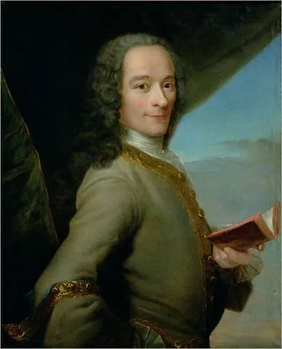

Condorcet omistab oma teoses [_Inimvaimu arengu ajaloolise pildi visand_](https://fr.wikisource.org/wiki/Esquisse_d%E2%80%99un_tableau_historique_des_progr%C3%A8s_de_l%E2%80%99esprit_humain) Itaalia võimu detsentraliseeritud struktuuri paavsti ja keisri vahelisele rivaliteedile, mis võimaldas paljudel sõltumatutel linnriikidel ellu jääda.

Seda teesi käsitletakse ka monumentaalses teoses, mis pärineb aastast 1983: _Õigus ja revolutsioon: Lääne õigustraditsiooni kujunemine_, autoriks Harold J. Berman ([Prantsuse tõlge Raoul Audouini poolt](https://www.eyrolles.com/Entreprise/Livre/droit-et-revolution-9782903449667/), avaldatud Aix en Provence'i Ülikooli raamatupoes 2002. aastal). Bermani analüüs rõhutab õigusliku pluralismi olulist rolli Lääne ajaloos. See süsteem, kaugel olemast lihtsalt keerukuse allikas, oli arengu, vabaduse ja innovatsiooni mootoriks, kujundades püsivalt Lääne õigustraditsioone.

## Marx: Ajalugu kui klassivõitlus

<chapterId>438100e6-a385-55c6-b2c5-ad192c564757</chapterId>
Siiski eksisteerib ajaloo suhtes ka teine vaatenurk. See on olnud üsna edukas ja pikka aega nautinud Lääne intellektuaalide ning Globaalse Lõuna esindajate toetust. See on sotsialistlik ja marksistlik ajaloo vaade.

See selgitab Euroopa erakordset kasvu peamiselt tehnoloogia arengu ja kapitali "primitiivse akumulatsiooni" kaudu, mis tulenes imperialismist, orjusest, kolmnurkkaubandusest, väikeste talupoegade väljatõrjumisest ja töölisklassi ärakasutamisest. Järeldus on selge. See erakordne Euroopa kasv saavutati miljonite ja miljonite orjade ning rõhutute arvelt.

Alguses on Marx ühes asjas õige: ajalugu on klassivõitluste ja ärakasutamise ajalugu. Tsitaat on tuntud, see on esimene lause _Kommunistliku Manifesti_ esimesest peatükist: "Kõigi seni eksisteerinud ühiskondade ajalugu on klassivõitluste ajalugu." Marx tunnistas ise, et oli oma klassivõitluse teooria laenanud varasematelt autoritelt:

> Mul pole au avastada klasse ja klassivõitlusi kaasaegses ühiskonnas. Ammu enne mind kirjeldasid kodanlikud ajaloolased selle klassivõitluse ajaloolist arengut ja kodanlikud majandusteadlased klasside majandusanatoomiat.
>
> (_Kiri J. Weydemeyerile_, 5. märts 1852).

Kuid ta eksib ühes fundamentaalses punktis töölisklassi osas: mitte kapital ei too kaasa ärakasutamist. Teisisõnu, klassivõitlus ei toimu tootmise sees, vaid maksude maksjate ja nende kogujate vahel.

Marxi sõnul on ärakasutamine protsess, mis seisneb töötaja loodud väärtuse osa väljavõtmises ilma selle eest tasumata, mis võimaldab kapitalistidel kasumit teenida. Teisisõnu, ärakasutamine oleks mehhanism, mis võimaldab kapitalistidel rikastuda, varastades proletariaadi tööd.
See analüüs peegeldab arusaamatust ülejääkväärtuse ning majanduselu koostöölise ja dünaamilise olemuse osas. Tõepoolest, ettevõtja saadav kasum on kompensatsioon riski eest, mida nad võtavad, ning töötaja või palgatöötaja ei ole ori. Konkurentsitingimustes võivad nad lepingu oma tööandjaga kas vastu võtta või keelduda. Nad teevad valiku, mis peegeldab kulude-tulude analüüsi.

### Tööstusrevolutsiooni Küsimus

Tegelikult moonutab marksistlik analüüs tööstusrevolutsiooni ajaloolist reaalsust. Ludwig von Mises selgitas seda küsimust oma majandusteaduse traktaadis [_Human Action_](http://herve.dequengo.free.fr/Mises/AH/AHTDM.htm) (vaata eriti peatükki pealkirjaga [Popular Interpretation of the Industrial Revolution](http://herve.dequengo.free.fr/Mises/AH/AH21.htm#inter2)) ning samuti sarjas loenguid, mis avaldati pealkirja all: [_Economic Policy: Thoughts for Today and Tomorrow_](http://herve.dequengo.free.fr/Mises/PE/PE_TDM.htm). (Samuti väärib lugemist, Antikapitalistlik Mentaliteet [siin](https://www.institutcoppet.org/wp-content/uploads/2011/05/La-Mentalit%C3%A9-anticapitaliste.pdf) ja [siin](http://herve.dequengo.free.fr/Mises/MAC/MAC_TDM.htm)).
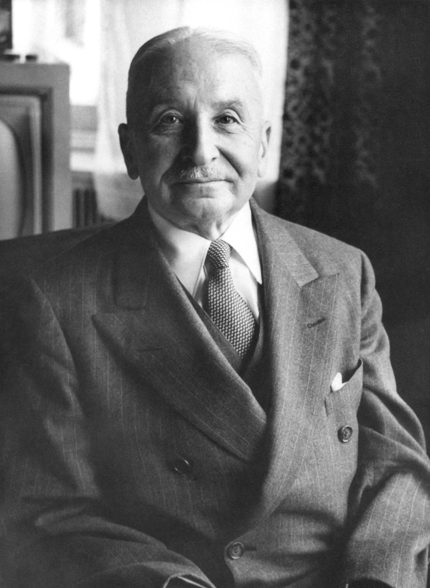

Mises selgitab, et kuigi meie standardite järgi olid tehase töökohad õnnetud, esindasid need tolleaegsete tööliste jaoks parimat võimalikku võimalust.

Loeme katkendi _Human Action_'ist:

> Tööstusrevolutsiooni esimestel aastakümnetel olid tehase töötajate elustandardid skandaalselt madalad võrreldes nende kaasaegsete ülemklasside tingimustega ja võrreldes praeguse tööstusrahvastiku olukorraga. Töötunnid olid pikad, töökodade sanitaartingimused jõledad. Üksikisikute töövõime ammendus kiiresti. Kuid fakt jääb, et ülejääkrahvastiku jaoks, keda ühiskasutatavate karjamaade (aedade) omastamine oli viinud kõige hullemasse õnnetusse ja kellel sõna otseses mõttes polnud kohta valitseva tootmissüsteemi raames, oli tehase töö päästeks. Need inimesed kogunesid töökodadesse ainult ühel põhjusel - nad vajasid hädasti oma elustandardi parandamist.

Mises lisab, et inimolukorra paranemine sai võimalikuks tänu kapitali kogunemisele:

> Radikaalne muutus olukorras, mis on andnud Lääne massidele praeguse elustandardi (tõepoolest kõrge elustandard, võrreldes sellega, mis see oli enne kapitalismi, ja sellega, mis see on Nõukogude Venemaal), oli kapitali kogunemise tulemus säästmise ja kaugelenägelike ettevõtjate tarkade investeeringute kaudu. Ükski tehnoloogiline täiustus ei oleks olnud saavutatav, kui uute leiutiste praktiliseks kasutamiseks vajalikud lisamateriaalsed kapitalid poleks olnud teostatavad eelneva säästmise kaudu.
> Marksistliku historiograafia osas võime samuti viidata Friedrich Hayekile teoses _Capitalism and the Historians_ (Chicago Ülikooli Press, 1954) ja tema peatükile pealkirjaga "Ajalugu ja poliitika". Hayeki sõnul ei teinud industrialiseerimine töölisi õnnetuks, nagu kapitalismi tumeda legendi poolt, mida marksism levitab, väidetakse. Ta märgib:
> Kapitalismi ja proletariaadi tõusu vahelise seose tegelik ajalugu on peaaegu vastupidine sellele, mida nende masside väljatõrjumise teooriad vihjavad.
> Enne tööstusrevolutsiooni elas enamik inimesi maapiirkondades ja sõltus oma ellujäämiseks põllumajandusest. Neil oli turul vähe müüa, mis piiras nende võimalusi ja elatustaset. Kõik eeldasid, et nad elavad absoluutses vaesuses ja nägid ette sarnast saatust oma järeltulijatele. Keegi ei olnud väljaspoolt pahandatud olukorra pärast, mis tundus paratamatu.

Tööstustsivilisatsiooni saabumisega tekkisid uued võimalused, luues kasvava nõudluse tööjõu järele. Esimest korda ajaloos said maata või oluliste ressurssideta inimesed müüa oma tööjõudu tehastele ja tootmisettevõtetele vastutasuks palga eest, tagades tuleviku kindlustuse.

See uus sissetulekuallikas võimaldas neil end toita ja majutada isegi kiiresti laienevates linnades. Seega soodustas tööstusrevolutsioon rahvastiku plahvatuslikku kasvu, mis poleks olnud võimalik enne tööstusajastu majandusliku seisaku tingimustes.

Nii märkis Hayek, et "majanduslik kannatus muutus nii nähtavamaks kui ka tundus vähem õigustatuna, kuna üldine rikkus kasvas kiiremini kui kunagi varem."

Seega ei olnud tööline ärakasutatud, isegi kui palgad olid madalad, tänu maalt põgeneva tööjõu rohkusele.

Tegelikkuses on ärakasutamine mõistetav ainult kui rünnak eraomandi vastu. Selles mõttes on ärakasutamine alati riigi tegevus. Sest riik on ainus institutsioon, mis saab oma tulusid sunni kaudu, st jõuga. Seega, nagu me oleme Bastiat'ga näinud, on tõeline ärakasutamine produktiivsete klasside ärakasutamine riigiametnike klassi poolt. Oleks täpsem öelda, et kogu senise ühiskonna ajalugu on midagi muud kui võitlus röövlite ja produktiivsete klasside vahel.

### "Euroopa ime"

Seejärel võimaldab Marxist erinev peenem ajalooline analüüs meil vaidlustada ettekujutust röövellikust Euroopast, mis võlgneb oma edu ainult imperialismile ja orjusele. Süvenedes võrdlevasse majandusajalukku, on mõned kaasaegsed ajaloolased otsinud Euroopa arengu algupära selles, mis eristas seda teistest suurtest tsivilisatsioonidest, eriti Hiina, India ja Islami omadest. Neid omadusi on uurinud [David Landes](https://www.eyrolles.com/Entreprise/Livre/richesse-et-pauvrete-des-nations-9782226110381/), [Jean Baechler](https://academiesciencesmoralesetpolitiques.fr/publications/publications-de-lacademie/jean-baechler/), [François Crouzet](https://www.cairn.info/revue-entreprises-et-histoire-2010-4-page-219.htm) ja [Douglass North](https://www.iedm.org/fr/65134-douglass-north-l-un-des-economistes-les-plus-originaux/). Need uurijad on püüdnud mõista seda, mida nimetatakse "Euroopa imeks". Nad keskendusid asjaolule, et Euroopa oli killustatud ja konkureerivate jurisdiktsioonide mosaiik, kus pärast Rooma langemist ei olnud ükski keskne poliitiline jõud suuteline oma tahet peale suruma.

Nagu Jean Baechler, Akadeemia vooruslike ja poliitiliste teaduste liige, ütleb teoses _Kapitalismi päritolu_ (1971):

> Majandusliku efektiivsuse maksimeerimise esimene tingimus on tsiviilühiskonna vabastamine riigist (...) Kapitalismi laienemine võlgneb oma päritolu ja raison d'être poliitilisele anarhiale.

Teisisõnu, suur "mittesündmus", mis domineeris Euroopa saatust, oli hegemoonilise impeeriumi puudumine, nagu see, mis domineeris Hiinas.
See radikaalselt detsentraliseeritud Euroopa, mis andis parlamendid, seisused ja Üldriigid. See sünnitas hartad nagu kuulus Magna Carta inglise keeles, kuid see tõi kaasa ka Põhja-Itaalia ja Flandria vabad linnad: Veneetsia, Firenze, Genova, Amsterdam, Gent ja Brugge. Lõpuks arendas see välja loomuliku õiguse kontseptsiooni, samuti põhimõtte, et isegi Prints ei ole seadusest kõrgemal, doktriini, mis juurdus keskaegsetes ülikoolides Bolognas, Oxfordis ja Pariisis, ulatudes Viini ja Krakovini. Selle peatüki lõpetuseks ei olnud Euroopa majanduslik ja kultuuriline hüpe tingitud ülejäänud maailma vallutamisest ja ärakasutamisest. See domineeris maailmas tänu oma majanduslikule edule. Mida on nimetatud "imperialismiks", on Euroopa majandusliku edu tagajärg, mitte põhjus. Kuid naastes Lord Actoni juurde, mis eristab Lääne tsivilisatsiooni veelgi enam kõigist teistest, on selle kinnitamine üksikisiku väärtusele. Selles mõttes on südametunnistuse vabadus, eriti usuküsimustes, olnud selle tsivilisatsiooni põhialus. Me pöördume selle juurde järgmises jaotises tagasi.

## Murray Rothbard: Riik versus Ühiskond

<chapterId>5a0020ca-2bbd-5e09-8389-d57c57542cb2</chapterId>

_Anatomy of the State_ (tõlgitud prantsuse keelde kui _L’anatomie de l’Etat_, Résurgence väljaannetes) viimases peatükis pakub Murray Rothbard välja ajaloo teooria. See väga lühike peatükk on pealkirjaga: Ajalugu, võidujooks riigivõimu ja sotsiaalse võimu vahel. Rothbardi sõnul võib ajalugu mõista kui igavest konflikti kahe fundamentaalse põhimõtte vahel:

- Rahumeelne koostöö ja tootmine, mis esindavad vabatahtlikku vahetust ja rikkuse loomist töö ja innovatsiooni kaudu.
- Sunniviisiline ärakasutamine ja röövimine, mida kehastab riigi domineerimine, mis omastab jõuga üksikisikute töö vilju.

Viidates Albert J. Nockile, kasutab Rothbard mõisteid "sotsiaalne võim" ja "riigivõim" nende kahe vastanduva jõu tähistamiseks:

- Sotsiaalne võim: tekib vabade üksikisikute koostööst ja leidlikkusest, viies majandusliku eduni ja jõukuseni. See on võim looduse üle, inimese loov võime muuta loodus ressurssideks ja teadmisteks, ühiskonna kollektiivseks hüvanguks.
- Riigivõim: kehtestatakse sunni ja vägivalla kaudu, püüdes kontrollida ja ärakasutada ühiskonda oma kasuks. See on võim inimese üle. See seisneb "ühiskonna viljade äravoolamises mitteproduktiivsete (tegelikult antiproduktiivsete) juhtide kasuks."

### Riik kui Parasiit

Rothbard peab riiki parasiidiks, mis elab produktiivse ühiskonna arvelt. See haarab strateegiliselt "käsklusalasid", et omastada rikkust ja võimu. Jõu, õiguse, hariduse, infrastruktuuri monopool. Ja ta lisab: "Kaasaegses majanduses on raha oluline käsklusalus."
Rothbardi jaoks peaks vabaduse põhimõte kehtima ka raha suhtes. Kui me oleme teistes sektorites vabaduse poolt, kui me tahame kaitsta vara ja isikut riigi sekkumise eest, peab meie kõige pakilisem ülesanne olema uurida vaba turu võimalust raha jaoks. (Vaata sel teemal tema esseed: _Riik, mida olete teinud meie rahaga?_ Tõlkinud Stéphane Couvreur Institut Coppet'ile, 2011).

### Riigi Piiramise Katsete Ebaõnnestumine

Rothbard hoiatab mõtte eest, et kirjalikud konstitutsioonid iseenesest võiksid tagada vabaduse ja võimu piiramise:
Viimased sajandid olid ajad, mil inimesed püüdsid riigile kehtestada põhiseaduslikke ja muid piiranguid, ainult selleks, et avastada, et sellised piirangud, nagu kõik muudki katsed, ebaõnnestusid. Kõigist paljudest režiimivormidest, mis sajandite jooksul võeti, kõigist katsetatud kontseptsioonidest ja institutsioonidest ei õnnestunud ühelgi hoida riiki kontrolli all.

Kirjalikul põhiseadusel on kindlasti palju eeliseid, kuid oleks tõsine viga eeldada, et see oleks piisav. Tõepoolest, enamuse partei, oma võimuga, võib omaks võtta laia tõlgenduse, et suurendada oma võimu. Ilma konkreetsete mehhanismideta õiguste jõustamiseks ja silmitsi domineeriva parteiga, mis on otsustanud oma võimu laiendada, riskivad põhiseadused muutuda ebatõhusateks, eksitavateks vahenditeks.

### 20. sajand: Taganemise sajand

Rothbardi sõnul ei ole ajalugu lineaarne protsess, vaid pigem kõikumine sotsiaalse võimu edenemise ja riigi kontrolli taastekke vahel:

- Vabaduse perioodid: kui sotsiaalne võim õitseb, suurenevad vabadus, rahu ja jõukus.
- Riigi domineerimise perioodid: kui riik saavutab ülekaalu, viib see rõhumise, sõja ja regressioonini.

17. sajandist 19. sajandini oli paljudes Lääne riikides sotsiaalse võimu kiirenemise perioode ja vastavat vabaduse, rahu ja materiaalse heaolu suurenemist. Kuid Rothbard meenutab meile, et 20. sajandit iseloomustas riigi võimu taastõus, millel olid kohutavad tagajärjed: orjuse, sõja ja hävingu suurenemine:

> Sellel sajandil seisab inimkond taas silmitsi riigi virulendi valitsemisega; riik, mis on nüüd relvastatud inimese loova jõuga, konfiskeeritud ja oma eesmärkide jaoks pööratud.
> Mis on üldse vaba ühiskond? See on ühiskond ilma monopolita. Oma poliitilise filosoofia teoses _Ethics of Liberty_ (1982) vastab Rothbard: "ühiskond, kus ei ole seaduslikku võimalust sundagressiooniks üksikisiku isiku või vara vastu." Seepärast on tema sõnul poliitiline filosoofia, mis peab määratlema õiglase ühiskonna põhimõtted, taandatav ühele küsimusele: "Kes legitiimselt omab mida?"
> 

Rothbardi jaoks võib sotsiaalne kord valitseda, kui see on varaõiguste vaba vahetuse lepinguliste protseduuride üldistamise tulemus, privatiseerides kõik majandustegevused ja isegi suveräänsed funktsioonid (keskpank, kohtud) ning pöördudes kaitseagentuuride vahelise konkurentsi poole.

Ja ta lisab:

> Oleme nüüd maitsnud kõiki riigismi variante ja kõik on ebaõnnestunud. 20. sajandi alguses hakkasid ärijuhid, poliitikud ja intellektuaalid Lääne maailmas kutsuma üles "uue" segamajanduse süsteemi, riigi domineerimise, loomisele eelmise sajandi suhtelise laissez-faire'i asemel. Uued imerohud, esmapilgul atraktiivsed, nagu sotsialism, korporatiivne riik, heaolu-sõjaseisukorra riik jne, on proovitud ja kõik on ilmselgelt ebaõnnestunud. Sotsialismi ja riigi planeerimise pooldamise argumendid tunduvad nüüd kui vananeva, kurnatud ja ebaõnnestunud süsteemi palved. Mis on jäänud proovida, kui mitte vabadus?
>
> (_Ethics of Liberty_)

# Vabaduse päritolu: Antiikajast

<partId>d7a9d251-6d44-5f2f-9cc5-88796c84f61b</partId>

## Kriitilise ratsionaalsuse leiutamine kreeklaste poolt

<chapterId>5b5f65e6-f980-5971-b9f6-a37244503325</chapterId>
Ateena demokraatia kogemus on jätnud püsiva jälje poliitilise mõtte ajaloos ja jätkab tänapäeval demokraatia ja kodanikuosaluse ideaalide inspireerimist.

Ateena demokraatiat iseloomustas elav avalik arutelu linnaasjade üle, mis toimus peamiselt agoras, turuplatsil. See toimimisviis, mis põhines mõistusel ja kriitilisel arutelul, erines teravalt varasematest tavadest, kus seadusi ja kombeid peeti pühaks ja muutumatuks, mis olid esivanematelt päritud ja jumalate poolt kaitstud.

### Poliitika sünni linn

Ateena demokraatia esindab suurt murdepunkti varasematest traditsioonidest. Tõepoolest, varasemates ühiskondades ei saanud olla "poliitikat" mõttes, mis hõlmaks arutelu sotsiaalsete reeglite üle, kuna need olid müüdi kaudu transtsendentselt peale surutud.
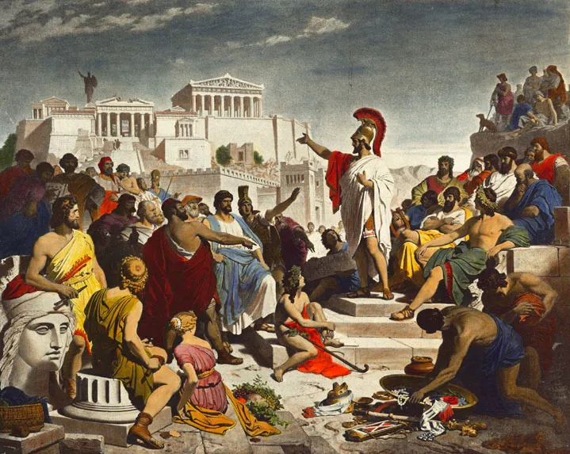

Ajaloolane Jean-Pierre Vernant kirjutab:

> Polise tekkimine kujutab endast Kreeka mõtte ajaloos otsustavat sündmust. Kindlasti, intellektuaalse arengu ja institutsioonide valdkonnas, saavutaksid selle täielikud tagajärjed alles pikemas perspektiivis; polis läbiks mitmeid etappe, erinevaid vorme. Siiski, alates selle ilmumisest, mida võib paigutada 8. ja 7. sajandi vahele, märgib see algust, tõelist leiutist; läbi selle võtavad sotsiaalne elu ja suhted inimeste vahel uue vormi, mille originaalsust kreeklased täielikult tunnetaksid. (...) Mida polise süsteem esmajoones tähendab, on kõne erakordne ülekaal kõigi teiste võimuinstrumentide üle. See muutub poliitiliseks tööriistaks par excellence, võimu kõigi vormide võtmeks riigis, vahendiks käskude andmiseks ja teiste üle domineerimiseks. (...) Polise teine iseloomulik joon on täieliku avalikkuse olemasolu kõige olulisemate sotsiaalse elu ilmingute puhul. Võiks isegi öelda, et polis eksisteerib ainult niivõrd, kuivõrd avalik sfäär on tekkinud, kahes erinevas, kuid omavahel seotud tähenduses: ühishuvi sektor, erinevalt eraasjadest; avatud praktikad, mis on loodud täielikus päevavalguses, erinevalt salajastest protseduuridest. (...) Seega muutuvad arutelu, argumentatsioon, vaidlus intellektuaalse mängu, samuti poliitilise mängu reegliteks. Pidev kogukonna kontroll teostatakse nii vaimsete loomingu kui ka riigi magistraatide üle.
>
> (Jean Pierre Vernant, _Kreeka mõtte päritolu_, Pariis, P.U.F, 1962)

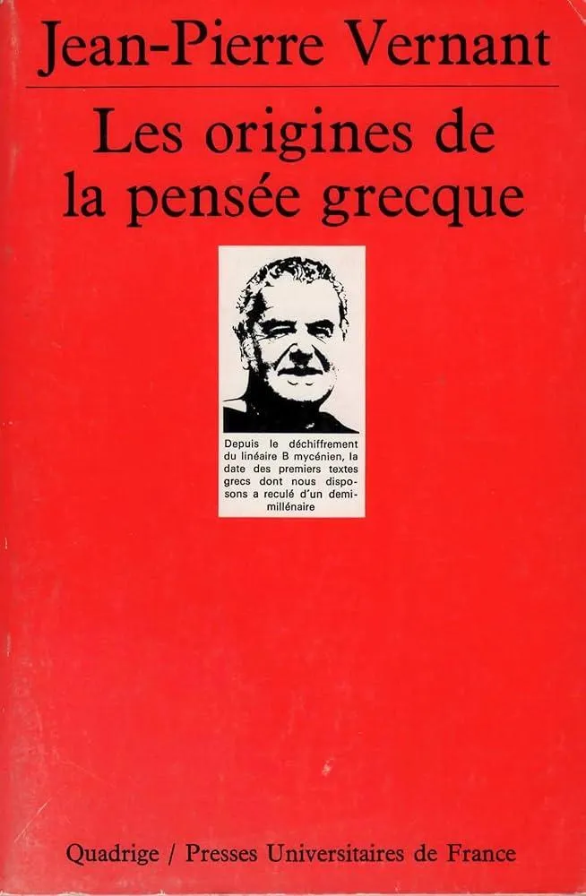

Kreeka sõna "polis", mis annab prantsuse keeles "poliitika", tähendab linnriiki. Kui Aristoteles kirjutab, et "inimene on loomult poliitiline olend", ei tähenda see, et ta on loodud võimu jaoks. Poliitikaga viitab ta inimeste võimele arutleda avalikul väljakul selle üle, mis on õiglane ja ebaõiglane.

See uudsus põhineb kahe kreeka keele termini, "phusis" ja "nomos", mis tähistavad kahte tüüpi seadusi, fundamentaalsel eristamisel:

- _Phusis_ on loodusseadus (mis annab prantsuse keeles sõna "füüsika").
- _Nomos_ on inimseadus (termin, mida leidub sõnas "autonoomia", mis tähendab "oma seadusele allumist").
  Linn (polis) tekib ideega, et seadus (nomos) on inimlikku päritolu, et seda saab inimeste poolt vabalt muuta, erinevalt loodusest, ja see võib kehtida kõigile. Kreeklased saavad siis teadlikuks sotsiaalse ja poliitilise korra autonoomiast loodusliku korra suhtes.
  See tähistab poliitika ilmumist: pidev arutelu sotsiaalse elu väga reeglite üle. Edaspidi lahendatakse probleeme ühise tegevuse kaudu, mitte muutumatu püha korra abil.
  Ja Jean-Pierre Vernant lisab:

> Kreeka mõistus on see, mis positiivsel, reflektiivsel, meetodilisel viisil võimaldab meil tegutseda inimeste, mitte looduse muutmise nimel. Oma piirides nagu ka uuendustes, on see linna tütar.

### Vabaduse Idee Seaduse All

Sotsiaalne harmoonia ei teki jumalate tahtlikust tegevusest, vaid kõigi kodanike samale isikupäratule seadusele kuuletumisest. Võim ei ole enam preestrite asi, see on kõigi asi. Nii kerkib esile seaduse ees võrdsuse mõiste: "_isonomia_," aga ka retoorika. Kõnekunsti valdamine oli oluline, et veenda oma kaaskodanikke kogunemistel ja kohtutes.

Aristotelese jaoks on türannia kuuletumine inimesele ja vabadus on kuuletumine seadusele. Talle omistatakse see tsitaat:

> Seaduse valitsemist ihaldada tähendab ihaldada mõistuse ainuvalitsemist. Inimese valitsemist ihaldada tähendab lisada sellele metsiku looma valitsemist, sest soov ja viha moonutavad valitsejate otsustusvõimet, isegi kui nad on parimatest parimad.

Tema sõnul tagavad seadused, olles isikupäratud ja püsivad, õigluse ja võrdsuse kõigile kodanikele.

Cicero, kuulus Rooma oraator ja filosoof 1. sajandist eKr, võttis selle idee üles: "Me oleme seaduste orjad, et me võiksime olla vabad" (_De Republica_, Raamat III, peatükk 13). Selles lõigus arendab Cicero argumenti vabariigi kasuks, mis on valitsetud seaduste, mitte ühe inimese või väikese inimrühma poolt.
Vabariigi idee on see, mis pärineb Kreeka filosoofiast. Seda on sageli vastandatud demokraatiale, mida peetakse liiga riskantseks. Platon nimetas oma peamist poliitilise filosoofia teost: _Vabariik_, ja ta hindab demokraatiat väga karmilt. Kui rahvas valitseb, on suur oht seadustada oma soovide seadus ja segi ajada hea meeldivaga. Sellest tuleneb Sokratese traagiline surm, kes mõisteti surma populaarse žürii poolt, mida manipuleerisid sofistid. Platon õppis sellest kõik õppetunnid.

Aristoteles kasutaks vabariigi terminit, et tähistada õiglast konstitutsiooni, mis taotleb ühist huvi ja kohtleb kodanikke vabade meestena. Tõeline vabaduse režiim on see, kus seadus on üldine, kõigile võrdne, anonüümne ja mitte isiklik käsk.

Vabaduse idee seaduse all leidub ka anglosaksi terminis "Rule of Law".

### Poliitiline Vabadus

Võib öelda, et kreeklased leiutasid poliitilise vabaduse mõiste, vastandades selle türannilisele domineerimisele. Tol ajastu kreeklased pidasid orjandust loomulikuks institutsiooniks ja arvasid, et orjadel ei ole sama staatus kui kodanikel. See võib tunduda vabaduse ideega vastuolus, kuid nende jaoks oli vabadus seotud kodakondsusega, mitte orjuse puudumisega.

Herodotos _Historias_ ja Aischylos oma tragöödias _Pärsialased_ illustreerivad suurepäraselt kontrasti Xerxese absoluutse ja türannilise monarhia ning kreeklaste vabaduse vaimu vahel. See rahvas, mida iseloomustab isandate puudumine ja keeldumine alistumast barbarite orjusele, olenemata nende arvukusest, leiab oma jõu seadusest, "nomosest", oma tõelisest isandast, mis tagab nende vabaduse. Ja see seadus tuleneb kõigi tahtest.

Jacqueline de Romilly järgi:
Kreeklased ise paistavad seda originaalsust mõõtnud ja sellest teadlikuks saanud olevat 5. sajandi alguses, šokis, mis vastandus neid Pärsia sissetungijatega. Ja esimene fakt, mis neid tabas, oli see, et nende ja nende vastaste vahel oli poliitiline erinevus, mis juhtis kõike muud. Pärsialased kuuletusid absoluutsele valitsejale, kes oli nende peremees, keda nad kartsid ja kelle ees nad langesid kummardusse: neid tavasid ei olnud Kreekas levinud. Herodotoses on hämmastav dialoog, mis vastandab Xerxest Sparta endisele kuningale. See kuningas teatab Xerxesele, et kreeklased ei alistu, sest Kreeka võitleb alati orjastamise vastu peremehele. Ta võitleb, olenemata oma vastaste arvust. Sest, kui kreeklased on vabad, "ei ole nad kõiges vabad: neil on peremees, seadus, mida nad kardavad isegi rohkem kui teie alamad kardavad teid."
(_Vana-Kreeka vabaduse avastamisel, Pariis, Editions de Fallois, 1989_)

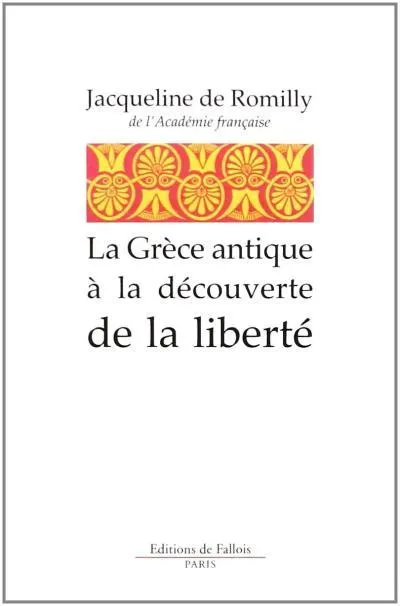

Herodotos on veendunud, et vabade inimeste rahvas on rahvas, kes kuuletub seadusele, mitte peremehele, nagu Pärsia impeeriumis, kus vaba on ainult üks mees ja kõik teised on orjad. See kehtib Ateena, demokraatia, kohta, kuid see kehtib ka Sparta kohta. Kuningas ei loo seadust, ta ei kehtesta oma tahet. Ta tagab seaduse austamise, ta on selle teenistuses ja sureb, kui vajalik, selle kaitsmiseks.

### Tõe ja pluralismi otsing

Mütoloogilisest mõtlemisest eemaldudes olid Thales, Anaximander, Anaximenes ja hiljem Demokritos ja Empedokles esimesed, kes püüdsid mõista phusist (loodust) läbi mõistuse, mitte üleloomulike olendite kaudu.

Põhimõte, mille need varased eelsokraatlikud filosoofid esitasid, on see, et kosmose (universumi) elemendid püsivad paigal, kuna nad on kõik võrdselt allutatud samale "looduse seadusele" (phusis), mida saab väljendada universaalsel ja vajalikul viisil. Universum on ratsionaalne, see moodustab struktureeritud terviku, mille inimene võib avastada oma mõistusega (logos vastandina mutosele, müüt).

Karl Popperi sõnul võlgneme me vanakreeka filosoofidele, eriti eelsokraatikutele, kriitilise ratsionalismi leiutamise, st lääne traditsiooni kriitilisest arutelust, teadusliku mõtte ja pluralismi allikast. Ta selgitab seda peatükis _Conjectures and Refutations_ pealkirjaga "Tagasi eelsokraatikute juurde":
Esimeste kriitilise suhtumise märkide, uue mõttevabaduse ilmnemise kohta, ilmuvad Anaximanderi kriitikas Thalese vastu. See on üsna erakordne nähtus, mõtleja, keda Anaximander kritiseerib, on tema õpetaja, tema kaasmaalane, üks Seitsmest Targast, see, kes asutas Joonia Kooli. Traditsiooni kohaselt oli Anaximander Thalesest ainult neljateistkümne aasta võrra noorem ja ta tõenäoliselt formuleeris oma kriitikad ja esitles oma uusi kontseptsioone oma õpetaja eluajal (nad surid, tundub, mõne aasta vahega). Siiski ei leidu allikates mingit tõendit lahkhelide, tüli või lõhe kohta.

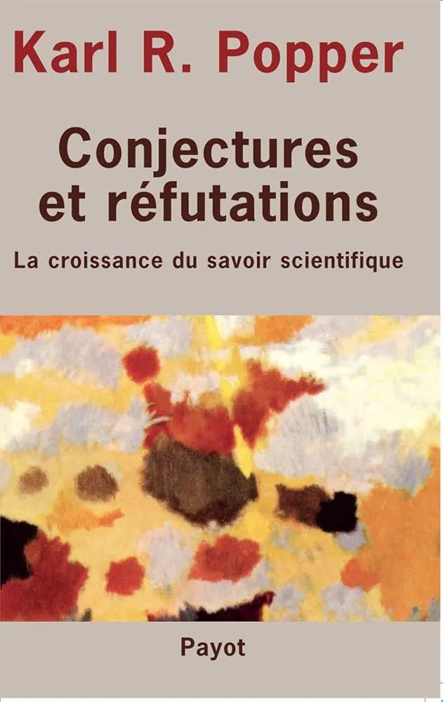
Need tõendid näitavad tema sõnul, et just Thales oli see, kes algatas uue vabaduse traditsiooni, mis põhines algupärasel suhtel õpetaja ja õpilase vahel. Thales suutis taluda kriitikat ja lisaks lõi ta traditsiooni seda tunnustada. Popper tuvastab siin murdepunkti dogmaatilisest traditsioonist, mis lubab ainult ühe koolkonna doktriini, asendamaks selle pluralismi ja ekslikkusega.

> Meie katsed tõde haarata ja avastada ei ole lõplikud, vaid on võimelised paranema, meie teadmised, meie doktriinid on oletuslikud, need koosnevad eeldustest, hüpoteesidest, mitte kindlatest ja lõplikest tõdedest.

Ainus vahend, mis meil tõele lähenemiseks on, on kriitika ja arutelu. Seega pärineb antiik-Kreekast see traditsioon:

> Mis seisneb julgete oletuste esitamises ja vaba kriitika harjutamises, traditsioon, mis oli ratsionaalse ja teadusliku lähenemise ning sellest tulenevalt meie Lääne kultuuri alguses, mis on ainus, mis põhineb teadusel, isegi kui ilmselgelt ei ole see selle ainus alus.

## Õiguse leiutamine roomlaste poolt

<chapterId>e9337ad6-5a75-5894-a017-9a507939cb51</chapterId>

Rooma impeerium oli tohutu kosmopoliitne üksus. Oma tipphetkel, umbes 117 aastal pKr, oli see tohutu multi-etniline ja mitmekeelne riik:

- Läänes ulatus see Suurbritanniast (tänapäeva Inglismaa) Hispaaniani, läbides Galliat (tänapäeva Prantsusmaa) ja Põhja-Aafrikat.
- Põhjas jõudis see Reinini ja Doonau jõeni, hõlmates osi Saksamaast, Hollandist, Šveitsist, Austriast, Ungarist, Rumeeniast ja Bulgaariast.
- Lõunas piirnes see Vahemerega, hõlmates Itaaliat, Kreekat, Balkani poolsaart, Väike-Aasiat (tänapäeva Türgi), Süüriat, Liibanoni, Palestiinat, Egiptust ja Kürēnaikat (tänapäeva Liibüa osa).
- Idas ulatus see Mesopotaamiani (tänapäeva Iraak) ja Armeeniasse.

Sellest ajast alates viisid roomlased õiguse arengu kreeklasest, kes elasid väikestes, etniliselt homogeensetes linnriikides, kaugemale. Juba Rooma Vabariigi ajal oli olemas vara ja individuaalsete õiguste õiguslik kaitse.

Tõepoolest, õiguse funktsioon oli teha rahumeelne kooselu ja vahetus inimeste vahel võimalikuks, määratledes "minu" ja "sinu" piirid.

Eraomand võttis Rooma tsivilisatsioonis uue mõõtme, mida see ei olnud varem tundnud, isegi mitte Kreeka tsivilisatsioonis.

Rooma õigus saaks kõigi kaasaegsete Lääne õiguste aluseks keskajal ja kuni meie ajani.

### Individuaalsete õiguste kaitse

Lõpuks pööras Rooma õigus suurt tähtsust üksikisikute õigustele ja vabadustele ning Rooma kodanikud olid oma kodaniku staatuse üle uhked. Kaheteistkümne Laua Seadus (450 eKr) moodustas esimese kirjalike seaduste kogumi, mis oli kättesaadav kõigile Rooma kodanikele, nii patriitsidele kui plebeidele. See kodeerimine aitas selgitada ja standardiseerida õigust, mis oli varem hajutatud ja sageli tavapärane, tagades teatud taseme läbipaistvuse õiguse rakendamisel abielluda, osta, müüa jne.

See seadus vastab hämmastavalt loodusõiguse põhiprintsiipidele, nagu John Locke need kaks tuhat aastat hiljem teoreetiliselt sõnastas. See võimaldab kaitsta üksikisikute õigusi omavoli ja võimu kuritarvitamise eest.

Kindlasti olid naised, orjad ja võõramaalased endiselt täieliku õiguskaitse alt välja jäetud. Siiski esindas Kaheteistkümne Laua Seadus olulist edasiminekut ja alust edasiseks individuaalsete õiguste arendamiseks, mis laiendati kõigile.

Kaheteistkümne Laua Seadus omistab erilist tähtsust omandiõigustele:

- See määratleb erinevad omandiliigid (maa, liikuv vara jne.)
- See jaotab omandi kasutusõiguseks (usus), viljaõiguseks (fructus) ja võõrandamisõiguseks (abusus)
- See täpsustab nende hüvede omandamise, ülekandmise ja kaitse tingimusi.

Kokkuvõttes aitab see kaasa tehingute turvalisusele ja kaitseb isikuid meelevaldsete võõrandamiste eest, võimaldades vaidluse korral pöörduda.

### Humanismi ja eraelu sünd

See, kes keegi on, sõltub sellest, mis tal on. Olemine ei ole nii sõltumatu omamisest, nagu mõnikord öeldakse, sest see, mida me omame, eristab meid sellest, mida teised omavad. Ja meie elu kuulub meile, me omame esmalt oma võimeid, oma keha enne materiaalsete hüvede omamist.

Rooma ühiskonnas võis igaüks üha enam eristuda teistest ja seeläbi saada oma elu tegijaks. Inimene mängib nüüd ainulaadset rolli ja Cicero kasutab teda tähistamiseks sõna "persona". "Persona" oli mask, mida kandsid Rooma näitlejad, kuid see viitas ka üksikisiku õiguslikule ja sotsiaalsele isiksusele. Persona mõiste tähendas, et üksikisikud olid eristatavad entiteedid oma õiguste ja kohustustega. Sündis inimisiku (ego) mõiste koos oma sisemise elu ja ainulaadse saatusega, mis areneks koos kristlusega.

Peale selle sisaldab Rooma kirjandus ja filosoofia palju mõtisklusi üksikisiku olemuse, õnne, tarkuse ja ühiskonnaeluga seotud teemadel.

### Seneca ja õnnelik elu

Mõtte tasakaalu mudel on Seneca, Rooma stoiline filosoof, kes kirjutas vooruse, mõistuse ja enesekontrolli tähtsusest. Ta oli Jeesuse kaasaegne, samal ajal Nero õpetaja, jõukas pankur ja kuulus Rooma kirjanik.

Traktaat õnnelikust elust (_De Vita Beata_) on stoilise moraali eestkõne. Õnn, ütleb Seneca, "on vaba hing \[...\] kättesaamatu hirmule \[...\] kelle jaoks ainus kurjus on moraalne alatus." Sokratese jünger, stoiline tark ei karda füüsilist kurja, surma ega isegi ebaõigluse all kannatamist. Tema jaoks on ainus kurjus moraalne kurjus. Seega peitub kõrgeim hüve vooruses.

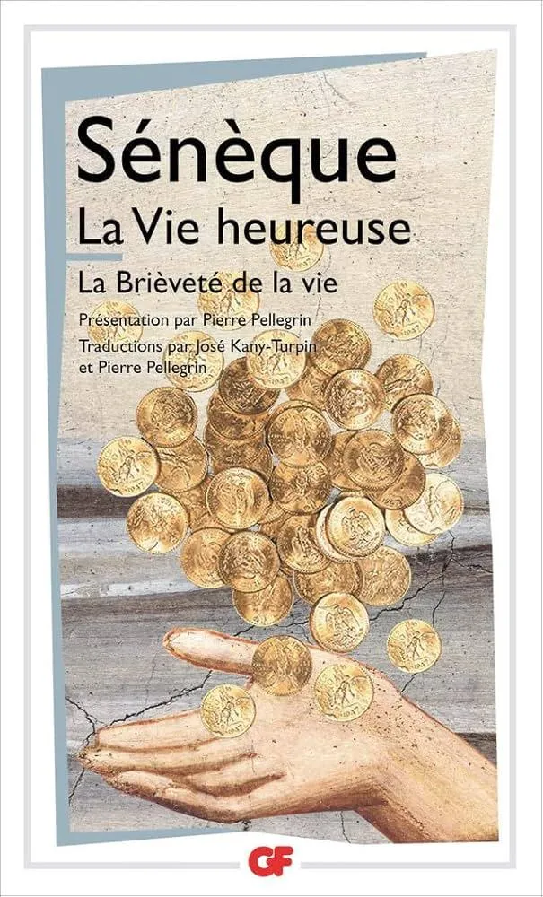

Siiski ei ole nauding voorusega vastuolus:

> Vanad soovitasid elada parimat elu, mitte kõige meeldivamat, nii et nauding ei oleks õige tahte juht, vaid selle kaaslane teel.

Seepärast ei tõrju tark mees õnne kingitusi:

> Ta ei armasta rikkusi, ta eelistab neid; ta ei võta neid oma südamesse, vaid oma majja; ta ei tõrju seda, mida ta omab, ta valitseb neid ja soovib, et need annaksid tema voorusele piisavalt ainet.

Seneca läheb veelgi kaugemale. Targa jaoks on rikkused võimalus ja vahend vooruse harjutamiseks:
Vaesuses [...] on ainult üks vooruse liik: mitte kõikuda ega lasta end masendada; rikkuse keskel on mõõdukus, heldus, eristusvõime, majanduslikkus ja suursugusus vabad.

### Kõrgema seaduse kontseptsioon

Mõiste "inimõigused", mille ümber koondub palju juriste, eeldab kaudselt kõrgema seaduse ideed, kuna see sihib õigusi, mis on seotud inimkonnaga iseeneses enne igasugust positiivset seadusandlust. Ilma selle ülema moraalinormita ei oleks enam kriitilist autoriteeti, kes suudaks õiguskorda tõlgendada ja küsitleda.
See idee meenutab meile, et Prints (nagu ka poliitilised juhid) ei oma õiglust iseeneses, vaid on ise allutatud seadusele, mis ületab teda ja peab reguleerima tema otsust. Seda nimetasid antiikaja filosoofid, eriti roomlased nagu Cicero või stoikud, loomulikuks õiguseks. Selle päritolu leitakse Kreeka mõttest, Sophoklese ja Aristotelese juurest.

Aristoteles teeb vahet loomulikul õiglusel ja seaduslikul õiglusel. Loomulik õiglus on see, mis on universaalselt kehtiv, igas kohas ja igal ajal. See on kirjutamata seadus, mida tuntakse mõistuse kaudu. Seaduslik õiglus on see, mis iseenesest on ükskõikne, kuid muutub kõigi jaoks kohustuslikuks tavapärase valiku tulemusena ja on kirjas seadustekstis. Teisisõnu tehakse vahet loomuliku õiguse ja positiivse õiguse vahel.

Näitekirjanik Sophokles lavastab oma näidendis _Antigone_ konflikti jumaliku seaduse ja inimseaduse vahel. Antigone keeldub allumast kuningas Kreoni dekreedile, mis keelab tema venna matmise, väites, et jumalikud seadused, muutumatud ja ülemad, on inimseadustest tähtsamad.

Kui Antigone Kreonile allumatust ilmutab, seab ta positiivse seaduse vastu, et järgida oma moraalset ja religioosset südametunnistust. Kui on olemas ainult positiivne seadus, ütleb Aristoteles, on Kreon alati õige, isegi kui ta eksib. Kuid kui me hoiame kinni loomuliku või jumaliku seaduse reguleerivast ideest, võib Antigone seista vastu, kui aeg saabub, ja esitada ebaõiglase seaduse vastu ülima õiguse, kirjutamata seaduse.

### Cicero ja Loomulik Õigus

Cicero elas 1. sajandil eKr ja peetakse Rooma impeeriumi ladina keele suurimaks kõnelejaks. Ta on ka moraalne ja poliitiline filosoof, kes on lähedane stoikudele. Tema esseesid on haritud eurooplased lugenud paljude sajandite vältel.

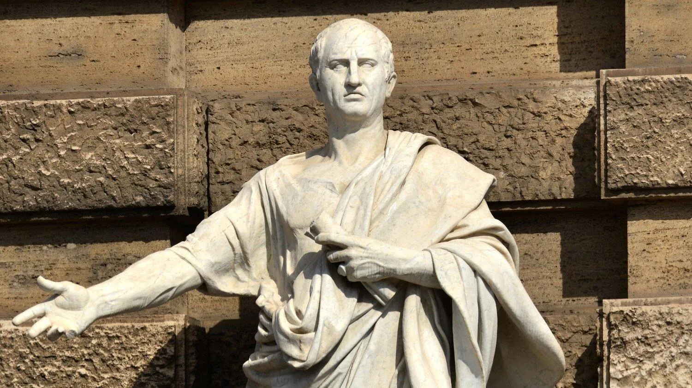
Oma traktaadis _Seaduste Üle_ (_De Legibus_) mõtiskleb ta seaduse aluse üle. Tema sõnul ei saa positiivne seadus, ühiskonna poolt vastu võetud konventsioonide või kirjutatud seaduste kogum, luua nime väärilist õiglust. Olemas on loomulik õiglus, mis on kirjutatud inimmõistusesse: "seadusel on alus looduses endas." Öelda, et õiglane ja ebaõiglane on konventsiooni tulemus, on öelda, et tõde on dekreet. Siiski ei saa tõde dekreetida, isegi mitte enamuse poolt, see juhib meie otsuseid.
Cicero lükkab tagasi ka kasulikkuse kui seaduse aluse. Tõepoolest, ta kirjutab:

> Kui õiglus on kirjutatud seaduste ja rahvaste institutsioonidele kuuletumine ja kui, nagu need, kes seda väidavad, ütlevad, on kasulikkus kõikide asjade mõõt, siis põlgab ja rikub seadusi see, kes usub nägevat selles oma eelist. Nii kaob õiglus, kui ei ole töös õigluse olemust; kui see põhineb kasulikkusel, siis teine kasulikkus tühistab selle. Kui seega õigus ei põhine loodusel, kaovad kõik voorused. Mis saab, tõepoolest, heldusest, isamaa armastusest, austusest asjade vastu, mis peavad meile pühad olema, soovist teisi teenida, valmisolekust tunnustada osutatud teenust? Kõik need voorused tulenevad kalduvusest armastada inimesi, mis on seaduse aluseks.

Seega, tema sõnul, on olemas universaalne õiglus, mis on kirjutatud mõistusesse ja loodusesse. Cicero kirjutab _De Republica_'s:
Tõeline seadus on õige mõistus kooskõlas loodusega; see on universaalselt kohaldatav, muutumatu ja igavene; see kutsub kohustusele oma käskudega ja hoiab eemale valest teest oma keeldudega \[…\]. Ei Senatil ega rahval pole võimu meid sellele kuuletumisest vabastada \[…\]. See ei ole üks asi Ateenas ja teine Roomas, mitte üks asi täna ja teine homme. Kuid see on üks ja sama seadus, igavene, muutumatu, kehtiv igal ajal ja kõigi rahvaste seas \[…\]. Kes iganes ei kuuletu sellele seadusele, põgeneb iseenda eest ja põlgab oma inimloomust.
See seadus on ülejäänud seadusandlusest kõrgemal, seega "sedaa ei saa teiste seadustega tühistada, ühtegi selle ettekirjutust ei saa kõrvale jätta, ega seda täielikult tühistada," lisab Cicero. Poliitilisel võimul ei ole selle üle mingit mõju.

Ei tõde ega õiglust ei saa määrata isegi mitte enamuse poolt, sest muidu muutuvad need kõigi manipulatsioonide objektiks. Seetõttu, isegi kui valitsejaks on rahvas, ei ole õige loodusõiguse põhimõtetest üle astuda.
Väites, et seadust ei saa vähendada ainult seadusandliku võimu poolt vastu võetud seadusteni, püüdis Cicero võidelda seadusandliku omavoli vastu ja pakkuda välja poliitilise moraali. Sellel ideel on olnud püsiv mõju Lääne mõttele.

## Rooma langus

<chapterId>1b0f3de8-696a-5dbc-bb5e-e03ddafb4ebf</chapterId>

Miks Rooma allakäik ja lõplik langus? Paljud arvavad, et Rooma impeerium varises järsku kokku, barbaaride invasioonide mõjul. Siiski, Rooma impeeriumi kokkuvarisemise põhjused tuleb leida palju varasemast ajast, imperialismist ning majandus- ja rahapoliitilisest dirigismist.

1734. aastal oma teoses _Mõtisklused roomlaste suuruse ja nende allakäigu põhjustest_ arendas Montesquieu välja originaalse ja ühtse teesi Rooma võimu tõusu ja languse selgitamiseks: vabadus, mis saavutati Vabariigi ajal ja seejärel kaotati Impeeriumi ajal. Hetkest, mil Rooma domineerimine laienes, kaotati vabadus ja algas allakäik.

Rooma impeerium oli parasiitlik sõjaväeline režiim, mis suutis ellu jääda ainult tänu pidevale röövitud rikkuse sissevoolule väljastpoolt, orjastatud vangidele ja varastatud maadele.

Tõepoolest, Rooma aadli rikastumine tuli ainult invasioonide saagist ja mitte mingist väärtuse loomisest. Kuid vallutuste lõppedes ja röövimisest saadava tulu vähenemisega pidi administratsioon üha enam pöörduma maksutõusude poole, et rahuldada oma rikkuse vajadust, mis viis impeeriumi elanikkonna üldise vaesumiseni.

### Leib ja tsirkused

Umbes 140. aastal kirjutas Rooma ajaloolane Fronto:

> Rooma ühiskonda huvitavad peamiselt kaks asja, selle toiduvarud ja selle vaatemängud.

Gladiaatorite võitlused, vankrisõidud ja teatrietendused, tihti tasuta, meelitasid ligi tohutuid rahvahulki ja võimaldasid eliidil võita rahva soosingu. Võim pakkus oma kodanikele mänge, aga ka nisu, leiba, sealiha ja oliiviõli. See strateegia teenis poliitilist strateegiat, et leevendada sotsiaalseid pingeid, juhtida tähelepanu kõrvale majandusprobleemidest ja tugevdada keisrite võimu.

Keiser Antoninus Piusi valitsemisajal (138 kuni 161) jõudis Rooma bürokraatia hiiglaslike mõõtmeteni.
Kuid kuna maksutulud ei olnud piisavad administratsiooni ja garnisonide ülalpidamiseks, hakkasid keisrid välja andma üha rohkem valuutat, vähendades iga mündi hõbedasisaldust. Denarius, Rooma peamine valuuta, nägi oma hõbedasisalduse langust 100%-lt 0,5%-le aastatel 235 kuni 284 pKr. Valuuta devalveerimisega kaasnes kontrollimatu hinnatõus, mis viis tarbimise, kaubanduse ja usalduse vähenemiseni.
Rooma impeeriumi langus oli aeglane protsess, mis oli otseselt seotud korrumpeerunud rahandussüsteemi pankrotiga. Järgnenud hüperinflatsioon põhjustas majanduse kokkuvarisemise ja inimeste usalduse kaotuse valuuta vastu.

Seejärel lisandus majanduslikule ebastabiilsusele poliitiline ebastabiilsus, kus 50 aasta jooksul oli troonil üle 50 erineva keisri.

### Hinnakontroll

Klassikaline sekkumismi näide ilmnes Roomas, kui keiser Diocletian tahtis hindu piirata. Sekkumismi määratletakse kui võimu tegevust, mis ületab tema rolli korra säilitamisel ja kodanike kaitsmisel. See on katse kontrollida turgu, eesmärgiga muuta hindu, palku, intressimäärasid ja kasumeid.

Järjestikuste keisrite korduvad rahalised emissioonid, et toime tulla sõjaliste kulutuste suurenemisega, olid põhjustanud hinnatõusu. 301. aastal kuulutas Diocletian välja Maksimumedikti, üritades hindu piirata. See oli läbikukkumine.

Ludwig von Mises kirjeldab seda episoodi, mis illustreerib hästi sekkumismi kahjulikke mõjusid:
Rooma keiser Diocletian on tuntud kui viimane Rooma keiser, kes kristlasi taga kiusas. Rooma keisritel oli kolmanda sajandi teisel poolel ainult üks finantsmeetod, mis oli valuuta devalveerimine. Nendel primitiivsetel aegadel, enne trükikunsti leiutamist, oli inflatsioon iseenesest primitiivne, nii öelda. See hõlmas pettust müntide vermimisel, eriti hõbedaga, kuni sulami värv muutus ja kaal oluliselt vähenes. Selle valuutade devalveerimise tulemus, koos vastavalt suurenenud ringlusega, oli hinnatõus, millele järgnes hinnakontrolli eeskiri. Ja Rooma keisrid ei hoidnud tagasi seaduste jõustamisel; nad ei pidanud liiga kõrge hinna küsimise eest surmanuhtlust liiga karmiks karistuseks. Nad jõustasid hinnakontrolli, kuid selle tagajärjel viisid nad ühiskonna allakäigule. See viis lõpuks Rooma impeeriumi lagunemiseni ja samuti tööjaotuse kokkuvarisemiseni.
([Economic Policy, Reflections for Today and Tomorrow](http://herve.dequengo.free.fr/Mises/PE/PE_3.htm))

### Liberalismist sotsialismini

Järgides Montesquieu jälgedes, demonstreerib Philippe Fabry, et Rooma koges trajektoori liberalismist sotsialismini. Philippe Fabry on õiguse, institutsioonide ja poliitiliste ideede ajaloolane. Ta on õpetanud Toulouse 1 Capitole'i ülikoolis ja on mitme raamatu autor, sealhulgas _Rooma, liberalismist sotsialismini_, 2014.

Kas Rooma oli antiikmaailma suurim liberaalne jõud? Kas seejärel langes see sotsialismi vormi? Määratleme esmalt terminid:

Liberalism: usaldus üksikisikute tegevuse vastu, mis loob spontaanse korra, lihtsalt seetõttu, et see tuleneb nende vabatahtlikest suhetest, turu vabast mängust ja nende võõrandamatute õiguste austamisest.

Sotsialism: riigi poolt ühiskonna kui terviku korraldamine tootmise ja tarbimise planeerimise kaudu.
Philippe Fabry raamatu tees on, et "Rooma impeeriumi langus on tagajärg ummikseisule, millesse keiserlik sotsialism oli viinud muistse maailma." See oli Rooma keisririigi dirigism, mis viis selle kokkuvarisemiseni. Rooma Vabariik, mis oli muistse maailma suurim liberaalne jõud, kestis 510 eKr kuni 23 eKr, peaaegu 500 aastat. Siiski, järk-järgult kadus Rooma Vabariigile iseloomulik kodanike kollegiaalsus, asendudes isikliku võimuga, mida kehastasid keisrid, kes võtsid üle valitsemisstiili iidse Egiptuse ja Pärsia idamaistelt valitsejatelt. Varasemast mõõdukast välispoliitikast kõrvale kaldudes allutas Rooma äkitselt suured rahvahulgad sõja kaudu, pakkudes rikkatele Rooma investoritele orjavoogusid, hävitades keskklassi. Vastutasuks nõudis Rooma rahvastik üha rohkem toetusi.

Oma suuruse algusaegadel pidas iga roomlane ennast oma sissetuleku peamiseks allikaks. See, mida ta turult vabatahtlikult omandada suutis, oli tema elatise allikas. Rooma allakäik algas siis, kui suur hulk kodanikke avastas teise sissetuleku allika: poliitilise protsessi või ümberjaotava riigi.

Roomlased loobusid seejärel vabadusest ja isiklikust vastutusest valitsuse poolt otse jagatud privileegide ja rikkuse lubaduste vastu. Kodanikud võtsid omaks idee, et sissetuleku saamine poliitiliste vahendite kaudu oli kasulikum kui töö kaudu.

Philippe Fabry võtab kokku:

> täheldatud nõrkused keiserlikus süsteemis \[…\] on kõigi totalitaarsete režiimide omad: "Absoluutne prioriteet olemasoleva süsteemi säilitamisele, majandusliku tootmise ebatõhusus, korruptsioon, kliendisüsteem.

Ja ta lisab:

> Kokkuvõttes pidi majanduslik, poliitiline, kunstiline ja usuline elu Rooma impeeriumis 4. sajandil olema üsna sarnane sellega, mis oli Brežnevi ajal NSV Liidus (ja halvimatel hetkedel Stalini all) või mis see võib olla tänapäeval Põhja-Koreas: kogu Rooma maailma elanikkond oli keiserliku sotsialismi poolt reglementeeritud ja kannatas, otseselt või kaudselt, selle mõjude all.

# Vabaduse päritolu: keskaeg

<partId>f47bd5fc-c4a7-5d3b-b102-7b948bb43268</partId>

## Inimvabaduse kinnitamine

<chapterId>96ca5622-f8e4-58ef-b358-7f7d25543104</chapterId>

Kristlik vabaduse idee arenes välja keskaegses teoloogias, alates pühast Augustinusest 4. sajandil kuni püha Thomas Aquinase juurde 13. sajandil. Mis on see idee?

### Vabadus on seotud patu ideega

Kohe algusest peale õpetab kristlus, et patt on isiklik asi, mitte rühmale omane, vaid iga üksikisik peab võtma vastutuse omaenda päästmise eest. "Jumal on oma loodud olendile andnud vaba tahte, võime teha valesti ja seeläbi vastutuse patu eest," väidab püha Augustinus oma vabast tahtest kõnelevas traktaadis, _De Libero Arbitrio_.
Patt ei saa eksisteerida ilma vabaduseta. Tõepoolest, kristlik Jumal on kohtunik, kes premeerib "voorust" ja karistab "patu" eest. Kuid see Jumala kontseptsioon on täielikult vastuolus fatalismiga, sest inimene ei saaks olla süüdi ega tunnistada oma süüd, kui ta ei oleks esmalt vaba oma käitumist määrama. Oma moraalse vea, oma süü tunnistamine tähendab tunnistada, et oleks võinud käituda teisiti.
"Miks me teeme valesti?" küsib püha Augustinus. Kui ma ei eksi, on argument näidanud, et me käitume nii vaba tahte läbi. Kuid selle vaba tahte, millele me võlgneme oma võime patustada, oleme veendunud, ma imestan, kas Tema, kes meid lõi, tegi õigesti, andes selle meile. Tundub tõesti, et me poleks olnud patule avatud, kui meilt see oleks ära võetud; kuid kardetav on, et sel viisil paistab Jumal ka meie halbade tegude autorina. (_De libero arbitrio_, I, 16, 35.)

Kui Jumal tahtis, et inimene saaks teha valesti, kas Ta siis pole kaudselt vastutav kurja eest? Miks Jumal tahtis kurja võimalikkust? Püha Augustinus vastab:

> vaba tahe, ilma milleta keegi ei saa hästi elada, peate tunnistama, et see on hea, ja et see on Jumala kingitus, ning et neid, kes seda head kurjasti kasutavad, tuleks hukka mõista pigem kui öelda sellele, kes selle andis, et ta ei oleks pidanud seda andma.

Püha Augustinuse vastus probleemile on öelda, et Jumal vastutab kurja võimalikkuse eest, kuid mitte selle teostumise eest. Ta soovib kurja võimalikkust, sest see võimalikkus on vajalik vabaduse jaoks, ilma milleta pole vastutust, st pole juurdepääsu moraalse elu väärikusele.

Kuid moraalse kurja teostamine on inimese töö, kes kasutab oma vabadust halvasti, mitte Jumala, kes soovib, et inimene valiks hea.

Kokkuvõttes on vabadus hea, sest see võimaldab inimesel suunata ennast heale ja Jumalale, kes on absoluutne hea, kuid see tähendab paratamatult ja samal ajal võimalust valida kurja ja hüljata Jumal.

### Jumal ei tee head meie eest

Keskaegses teoloogias ei ole providents pidev Jumala sekkumine inimeste ellu, nagu Jumal tegutseks meie eest ja ilma meie nõusolekuta. Vastupidi, Jumal annab igale olendile vastavalt selle olemusele võimed, mis võimaldavad tal enda eest hoolitseda ja seeläbi saavutada oma täieliku arengu. Jumal ei tee head olendi eest tema asemel.

Ja mida kõrgemale me olendite skaalal läheme, mineraalist inimeseni, seda rohkem delegeerib Jumal oma olendile võimu tegutseda iseseisvalt. Ta usaldab inimesele vabaduse valitseda iseennast ja valitseda maailma oma mõistusega, vastavalt voorusele, mida nimetatakse ettevaatlikkuseks.

Nii kirjutab püha Thomas (_Summa contra Gentiles_, III, 69 ja 122):

> Olendite täiuslikkusest ilma jätmine on Jumaliku võimu täiuslikkuse vähendamine (...) Jumal on meie poolt solvatud ainult seetõttu, et me tegutseme omaenda hüve vastu.

Seega annab providents meile vahendid olla omaenda providents. Ja ta lisab:

> Inimene suudab juhtida ja valitseda oma tegusid. Seega osaleb ratsionaalne olend jumalikus providentsis mitte ainult valitsetuna, vaid ka valitsedes.

Selleks, et inimene saaks oma vabadust parimal võimalikul viisil kasutada, annab Jumal talle tööriista, mis on tema mõistus, ja juhendi, mis valgustab teda, mis on loomulik seadus.

Loomulik seadus avaldub meis kalduvustena nagu tõe armastamine, mõistusele kuuletumine või kuulus kuldreegel: "Ära tee teistele seda, mida sa ei soovi, et sulle tehakse." Need kalduvused on tema sõnul kaasasündinud. Tõepoolest, püha Thomas kirjutab, "tuleb arvestada, et loomulik õiglus on see, mille poole inimese loomus kaldub."
Siiski, see sisemine valgus ei ole piisav, et tegutseda õigesti. On vajalik konkreetsete tegutsemisnormide väljatöötamine ja nende rakendamine spetsiifilistes olukordades. Seejärel lasub juristidel nende normide määratlemine kooskõlas loomuliku õigusega: need on inimseadused. Kuid loomulik õigus on inimseadustest kõrgemal ja see kehtib universaalselt, sealhulgas printside üle.
Püha Thomas Aquinase sõnul:

> Loomuliku õiguse tundmine annab inimesele otse juurdepääsu üldisele mõistuse korrale, enne ja kõrgemal poliitilisest korrast, millele ta kuulub kui konkreetse ühiskonna kodanik.
> Seega eksisteerib õigus enne riigi moodustamist, üldiste põhimõtete kogum, mida mõistus saab artikuleerida uurides inimese loomust, nagu Jumal on selle loonud. See õigus kehtib monarhi, võimu üle, mis peab seejärel seda austama. Ja poliitilise võimu poolt kehtestatud seadused on siduvad ainult niivõrd, kuivõrd need vastavad loomulikule õigusele.

## Mõistus ja usk: avatud konkurents

<chapterId>ca379c2e-57cb-541d-8ddb-4b925032a779</chapterId>

Keskaegadel konkureerivad mõistus ja usk tõe juurdepääsu nimel. Järgides Abélardit ja Albert Suurt, valis Thomas Aquinas 13. sajandil kaitsta mõistuse õigusi ja selle autonoomiat usuga suhtes.

Ta laenab Aristotelese mõttest idee autonoomsest loomulikust korrast, mis on sõltumatu taevakorrast. See loomulik kord on tõepoolest ületatud üleloomuliku korra poolt, kuid see eksisteerib eraldi ja on sellele eelnev. Seega, tema jaoks on kaks viisi tõe kohta maailma ja eriti Jumala kohta juurde pääseda:

- Ühelt poolt **mõistus**, mis algab loodusest, tajutavast kogemusest, mis arendab ideid ja jõuab oma mõtlemise kaudu ratsionaalsete kindlusteni.
- Teiselt poolt **usk**, mis algab Ilmutusest, see tähendab, Jumala poolt inspireeritud pühast tekstist. Lähenemine on vastupidine, see ei ole reaalsus ega inimlik omadus (mõtlemine), mis viib kindlusteni, vaid ülalt antud tõed Jumala poolt, mis selgitavad reaalsust.

Kuidas siis kahte ühendada? Keskaegadel saab tuvastada kahte traditsiooni mõistuse/usu suhte artikuleerimiseks: müstitsism ja usuline ratsionalism.

### Müstitsismi ja usulise ratsionalismi vaheline rivaliteet

Müstitsism seisneb mõistuse usust väljajätmises. Usk on absoluutne, üle mõistuse, ja seda ei tohiks kunagi allutada mõistusele. Kui see mõistusele vastu räägib, on see normaalne, ja püüda ilmutatud tõdesid mõistuse raamistikku sobitada on ketserlus. Jumal on kaugel üle mõistuse, teisisõnu, pole mõtet püüda teda seletada. Seega on filosoofia väga halvas seisus. Jumal oleks isegi inimkeelest kaugemal: Ta oleks nimetamatu, täiesti Teine. Tema tahe on absoluutne ja meelevaldne. Seetõttu ei peaks üritama mõista, miks Jumal seda või teist tegi, kuulekus on ainus sobiv suhtumine.
Islamis öeldakse samuti, et ei tohiks Jumalat kujutada ega Talle pilti anda. Kristlikus maailmas kirjutas müstik nagu Meister Eckhart ühes jutluses: "Kõigil asjadel on miks, aga Jumalal ei ole miks." Müstikute jaoks on ainus kehtiv filosoofia see, mis tuleb otse Ilmutusest. Kõik, mis ei tule sellest, ei ole ei tõene ega väär, vaid ilma igasuguse tõeväärtuseta.
Selle mõtte täielik vastand on see, mis väidab, et ainult mõistus on õige ja et kogu usk on mõttetu. See on absoluutne ratsionalism, mis viib ateismini. Siiski selline vool ei olnud keskajal veel esile kerkinud.
Usundi ratsionalismi pooldajate jaoks on mõistuse ja usu vahel komplementaarsus: see on kesktee. Tõde on võimalik tunda nii usu kui ka mõistuse kaudu. Seega, mis on tõsi usus, peab olema tõsi ka mõistuses ja vastupidi. Tõde on üks, kuid see on kättesaadav kahel viisil. Seetõttu on kaks teadust, mis ei saa üksteisele vastu rääkida, vaid täiendavad teineteist: loodusteadus ehk filosoofia ja püha teadus ehk teoloogia. Kui see nii ei ole, kui mõistuse ja usu vahel ilmneb vastuolu, on kas mõtlemine puudulik või Piibli tõlgendamine vale.

Nii Thomas Aquinase jaoks "Usk on mõistuse nõustumine tahte poolt liigutatuna tõendite puudumisel." Teisisõnu, mõistus on võimeline maailma ja Jumalat ratsionaalselt mõistma kuni teatud punktini. Selles punktis ei kohta ta enam tõendeid. Tahe võib siis valida uskuda ja seeläbi liikuda usu kaudu tõe poole edasi, või mitte uskuda. Kuid usk ei ole hüpe absurdi, see ei ole mõistuse alandamine.

See on kesktee, mis püüab lepitada usku ja mõistust. Tõeline ratsionalism ei ole kõige tagasilükkamine, mida mõistus ei mõista, vaid mõtlemine mõistuse piiride üle. See, mis ületab mõistuse, ei ole tingimata mõistuse vastu. Pascal'i tsitaat **_Pensées_**'ist illustreerib seda mõtteviisi väga hästi: "Kaks äärmust: välistada mõistus, tunnistada ainult mõistust."

### Ülikoolide Sünd

Kristlik keskaeg oli 13. sajandi alguses märgitud ülikoolide sünni ja paljususega Läänes. Ülikool on sama linna õpilaste ja meistrite kogukond kiriku kontrolli all ja hõlmab põhimõtteliselt nelja teaduskonda: kunstid, teoloogia, õigusteadus, meditsiin. Teoloogiat käsitatakse teadusena, Kreeka teaduse eeskujul.

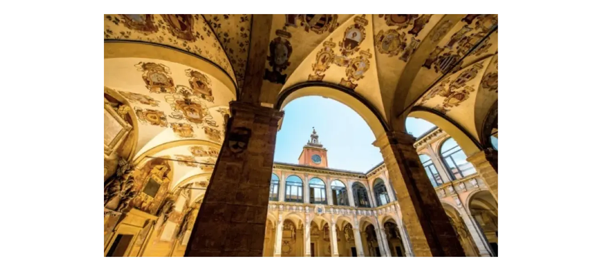 1200. aastal asutas Philippe-Auguste Pariisi Ülikooli, mis sai kiiresti Euroopa tuntuimaks ülikooliks. 1257. aastal asutas Robert de Sorbon Pariisi Ülikoolis teoloogiakolledži, mida hiljem hakati nimetama Sorbonne'iks. Nendes ülikoolides tekkis uus õpetamis- ja uurimismeetod, mida tuntakse skolastikana (ladina keeles schola, kool). See hõlmas "disputatsiooni", omamoodi vastuolulist debatti publiku ees. Esitati tees, millele järgnesid vastuväited, millele tuli vastata. Kui kõik argumendid olid ammendatud, lahendas meister arutelu põhjendatud lahendusega.

Selle ajastu suurte aristotellike meistrite seas võime mainida Albert Suurt (1200-1280) ja Thomas Aquinast (1224-1274). Viimane, seades mõistuse õigustesse, tõi esile filosoofilise tarkuse eripära ja autonoomia teoloogiaga võrreldes. Nagu arm andis eelduse loomusele ja täitis selle, eeldab ja täiustab usk mõistust.

Sellest ajast alates valitseks usuline ratsionalism kindlalt müstitsismi üle.

## Religioon ja Poliitika: Suveräänse Riigi Sünd

<chapterId>a925ea80-9f66-5f0b-8ab0-f428ae5c12dc</chapterId>

Keskaegses Euroopas päris Kirik ja kristlikud monarhiad poliitilise mudeli Rooma Impeeriumilt, mida ajaloolased nimetavad teoloogilis-poliitiliseks süsteemiks, tähendades süsteemi, kus võim on püha, st poliitiline juht on ka usuline juht.
Sellepärast iseloomustavad keskaegseid ühiskondi politiilis-religioosne üksmeelsus. Poliitiline võim rajab oma legitiimsuse, autoriteedi ja ühtsuse kristlikule (või moslemi) usule. See peab end kultuurilise ja religioosse õigeusu kaitsjaks ning kohtleb pariaatidena neid, kes sellest üksmeelsusest kõrvale kaldub. Selles kontekstis, isegi kui teatud tolerants võidi lubada neile, kes eraldusid ühisest kultuurilisest visioonist (nagu juudid), ei tunnustatud neile pluralismi õigust. Alles keskaja lõpus, Ameerika vallutamisega, muutus tsiviilvabaduste probleem Kiriku jaoks kriitiliseks ning nägi esimese õigusfilosoofia tekkimist, mis kinnitas ja kaitses individuaalseid vabadusi, legitimeeris pluralismi ja mõistis riikliku sunduse hukka.

### Püha Augustinus ja Teokraatlik Kiusatus

Poliitika ja religiooni suhte küsimus võttis kuju Püha Augustinuse teose _Civitas Dei_ (_Jumala Linn_) kaudu. Selles selgitab ta, et kaks sfääri eksisteerivad koos:
Seega on kaks armastust loonud kaks linna: enese armastus Jumala põlgamisega, maine linn; Jumala armastus enese põlgamisega, taevane linn.

Meil on seega:

- Vaimne võim, mis on pärit Jumalalt ja mida kehastab paavst, ning mida harjutatakse üle kogu kristluse (see on Jumala Linn).
- Inimeste linn, mis on maine ja koosneb kohalikust ja ajalisest võimust. See pärineb algsest patust, Kurjast.

Augustinuse jaoks on see maine linn siiski vajalik. See on vajalik, sest see tagab rahu. Seega tuleb religioossete kooselamist hästi hallata ja seda tuleks reguleerida vaimse võimu ülekaaluga ajalise võimu üle. Kuid ei tohiks olla radikaalset eraldatust ega avalikku konflikti, ja mõlemad üksused peaksid koostööd tegema. Ajaloolased on seda doktriini nimetanud poliitiliseks augustiinluseks.

### Ajalise võimu ja vaimse võimu rivaliteet

Siiski ei olnud ei paavstid ega kuningad selle liiduga rahul. Kirik püüdis nõuda oma autoriteeti poliitilise võimu üle, samal ajal kui poliitiline võim püüdis vabastada ennast, et kinnitada oma suveräänsust.

Seega arendab Kirik oma seadust ja kohtuid ning postuleerib, et paavst saab lahendada mainelisi vaidlusi. Omalt poolt hakkavad kuningad arendama nii võimsat riigiaparaati kui võimalik. Nad püüavad samuti tsentraliseerida õiguslike konfliktide lahendamist, seejärel järk-järgult üldistada maksustamist, arendada territoriaalset haldust ja tõsta armeesid: nad panevad aluse kaasaegsele Riigile.

Tegelikkuses viis võimude vaheline konkurents arvukate konfliktideni. Iga Prints või iga Paavst püüdis alati viimast sõna öelda ja veenda, et tema hoidis ülimat autoriteeti, kui viimane abinõu. Seega kuulutas paavst Gregorius VII:

> Paavst on ainus mees, kelle jalgu kõik vürstid peavad suudlema.

Oma poolel ei kõhelnud Püha Louis vastu seista paavst Innocent IV-le, kes oli ekskommunikeerinud ja tagandanud keiser Frederick II, jättes teda kogu tema rahva seas usaldusväärsuseta. Tema lapselaps, Philip Ilus, teeks sama.

Kiriku teokraatlik kiusatus põrkub samuti kokku "jumaliku õiguse" teooriaga. Kui Prantsusmaa kuningad kuulutavad end "jumaliku õiguse" alusel monarhideks, on see selleks, et pääseda paavsti haardest ja tõmmata oma autoriteet otse Jumalalt, ilma et peaksid klergilt korraldusi vastu võtma.

## Piibellik Eetika: Inimese Püha Väärtus

<chapterId>7a27494d-8481-52ea-a551-e430bdb5315f</chapterId>

Vanas mõttemaailmas allutati inimene jumalikule kosmosele, see tähendab täiuslikule universumile, mille osa ta vaid oli. Monoteism seevastu väidab inimese lõpmatult ülekaalukamat väärtust looduse üle, kuna inimene on loodud Jumala näo järgi. See oluline punkt on tõelise eetilise revolutsiooni alguseks. Piibel kinnitab iga inimolendi püha ja lõpmatut väärtust.
Seetõttu muudab piibellik eetika meie suhet kurjusega. See toob kaasa terava ja enneolematu tundlikkuse inimkannatuste suhtes. Seega julgustab see meid pidama ebanormaalseks ja talumatuks kurjust, mida inimkond seni oli täiesti talutavaks pidanud, eriti kurjust, mis tehakse teistele, nõrkadele, süütutele.

### Üleminek sümmeetriliselt eetikalt asümmeetrilisele eetikale

Sümmeetriline eetika seisneb range võrdsuse kehtestamises inimsuhetes või range vastastikkuse saavutamises. See ilmneb õigluse vooruses, mis on kreeklaste jaoks ülim voorus. Õiglus tähendab teistele nende võlgu andmist: igale oma. Ja aja tsüklilisena tajumine viib selleni, et ei tunta end vastutavana teiste poolt tehtud kurja eest. Maal on kurjust, kuid see on alati olemas olnud ja jääb alati olema. Seda tuleb käsitleda kui kasumi ja kahjumi arvestust, mille summa on püsiv. Midagi ei ole teha, nii jääb see alati olema, see on Kreeka ja Rooma fatalism.

Piibellik eetika on asümmeetriline, tähendades, et tuleb anda rohkem kui võlgu ollakse. Igaüks tunneb end vastutavana kurja eest, isegi selle eest, mida nad ise ei ole toime pannud. Andmise eetika, andestamise eetika, kaastunde eetika. Ükskõikseks jäämine teiste kannatuste suhtes ei ole võimalik ja me ei tohi taluda põhjendamatut kannatust, isegi kui see ei tule meilt. Stoilise targa rahu, kes aktsepteerib saatust, muutub võimatuks. See on hea samaarlase tähendamissõna mõte. Midagi ei kohusta teda peatuma ja hoolitsema röövlite poolt haavatud mehe eest. Piiblist tulenevast eetilisest revolutsioonist saab kogu inimkond omamoodi hea samaarlane. See on kutsutud mitte taluma teistele tehtud kurja ja võitlema selle vastu.
Pealegi, kuna Jumal on looja, näeme uue kontseptsiooni tekkimist, nimelt võrdsuse kontseptsiooni: Jumala ees on kõik mehed võrdsed. Jumala transtsendentse suuruse ees ei ole privileegitud isikuid ja kõik mehed on võrdsed.

### Indiaanlaste õigused

Selle tekkiva doktriini kõige tuntum kehastus on 16. sajandi Hispaanias asuv Salamanca kool. Selle esindaja Francisco de Vitoria väidab, et kui iga inimene on loodud Jumala näo järgi, ei saa ühtegi inimest teisele allutatuks kuulutada, ei juuti, musta orja ega indiaanlast.

Ameerika avastamine kujutas endast tõelist kultuurishokki, esimest mõra antiikajast päritud poliitilis-religioosse üksmeelsuse kaitsekihis. Kuulus vaidlus indiaanlaste õiguste üle jagas teoloogid tõepoolest kahte vastandlikku ja lepitamatut leeri.

Ühes leeris olid kultuurilise monolitismi ja sunni põhimõtte pooldajad. Nende jaoks elasid indiaanlased väljaspool piiblisõnumit. See võis tähendada, et Jumal ei soovinud ennast neile ilmutada. Miks? Siis on kaks võimalikku hüpoteesi: 1° Nad on suured patustajad (kannibalism) 2° Nad on tagurlikud ja lähemal loomale kui inimesele. Seetõttu on neil õigus neid orjadena kohelda ja nende maid jõuga võtta, põhjendades seda sellega, et nad on nii uskmatud kui ka barbarid.
Teises leeris olid pluralismi ja kodanikuvabaduste pooldajad: need on Salamanca Kooli teoloogid, püha Thomase jüngrid. Francisco de Vitoria ja Bartolomeo de Las Casase sõnul tuleb indiaanlastele tunnustada õigusi kui inimestele, mitte sellepärast, kas nad on või ei ole katoliiklikku usku omaks võtnud. Mitte ainult ei tohiks neid jõuga pöörata, vaid ka nende omandit ei tohiks võtta, ega tohiks neid mingil kujul orjastada. Nende argumentatsioon põhineb Thomase loomuliku õiguse kontseptsioonil, mis erineb jumalikust seadusest.
_Summa Theologica_'s esitab püha Thomas järgmise küsimuse: kas tuleks kuuletuda uskmatule Printsiile, kes ei usu Jumalasse? Ja ta vastab jah, sest legitiimne autoriteet on loomuliku õiguse järgi, ja Printsi uskmatuse või ateism ei ole mässu põhjuseks. Poliitiline kord on eelkõige loomulik kord. Ta küsib edasi: kas sõda tuleks pidada uskmatute vastu ja usk neile peale suruda? Ta vastab ei: sõda on õiglane ainult siis, kui see on kaitsev. Lõpuks saab usk olla ainult vaba tegu.
Salamanca õpetlased rakendasid seda põhjendust põlisrahvaste juhtumi puhul: omand on loomulik õigus. Seega, põlisrahvastelt maade võtmine on vargus, justkui nad oleksid kristlased. Samuti ei ole lubatud neile sõda kuulutada, arvestades, et agressioon ei tule nende, vaid meie poolt.

Põlisrahvaste küsimus oli esimene mõra poliitilis-usulises monoliidis. See näitas, et poliitilise ühiskonna ühtsus võib põhineda muul alusel kui sama territooriumi elanike usuline ühtsus, põhinedes ühisel kuuluvusel inimloomuse juurde.

Inimkonna idee areneb. Tõepoolest jõuti arusaamisele, et on olemas ainult üks inimkond, millele on loomulikult seotud võrdsed õigused. Kuid selle aktsepteerimine kõigi poolt võtab veel aega. Selleks on eriti vaja loodusteaduste panust inimliigi kontseptsiooniga.

## Kapitalismi esimesed visandid

<chapterId>236bdeeb-7bd3-536a-9df1-8791800bf31e</chapterId>

Oleme näinud, et kristlus paneb inimestele moraalse kohustuse töötada maailma paremaks muutmise nimel. Jumal soovib, et inimene oleks õnnelik, kuid ei taha tema heaolu tema eest saavutada. Seega on kristlase ülesanne võidelda moraalse kurjuse vastu, armastada oma ligimest, aidata ohvreid, lühidalt öeldes töötada õiglasema ja inimlikuma maailma nimel. Kas kapitalism, st vaba majandus, mis põhineb eraomandil ja lepinguvabadusel, on kooskõlas kristliku kohustusega?

Osa vastusest peitub faktis, et kapitalism sai alguse religioosses kontekstis, palju enne protestantlikku reformatsiooni. Teine osa vastusest seisneb fakti täheldamises, et kapitalism on parim vahend üksikisikute materiaalse ja moraalse seisundi parandamiseks. Ainult vaba majandus, mis põhineb omandiõigustel ja vabatahtlikul koostööl, suudab inimesi jätkusuutlikult vaesusest välja tõsta.

Keskendugem esimesele punktile. Teine punkt käsitletakse järgmises jaotises.

### Itaalia linnade tõus

Henri Pirenne, varase 20. sajandi Belgia ajaloolane, pühendas osa oma tööst kapitalismi tekkimise analüüsile Euroopas. Oma raamatus _Euroopa ajalugu_ väidab ta:
Kõik kapitalismile omased põhijooned — individuaalne ettevõtlus, krediidi areng, kaubanduslikud kasumid, spekulatsioon jne — eksisteerisid juba 12. sajandil Itaalia linnriikides, nagu Veneetsia, Genova või Firenze. Pirenne'i sõnul arendasid need kaubanduslikult dünaamilised linnad ja nende strateegiline asukoht mereteedel majanduspraktikaid, mis on iseloomulikud tekkivale kapitalismile. Ta toob eriti esile:

- **Individuaalse ettevõtluse tõusu:** Itaalia kaupmehed, sageli jõukatest peredest, investeerisid oma vahendeid kaugematesse kaubaretkedesse, võttes seeläbi enda kanda riskid ja oodates märkimisväärseid kasumeid.
- **Krediidi laienemine:** Rahvusvahelise kaubanduse areng stimuleeris erinevate krediidivahendite, nagu vekslite ja pangatehingute kasutamist, võimaldades tehingute rahastamist ja hõlbustades kapitali liikumist.
- **Kasumi taotlemine:** Itaalia kaupmeeste peamine motivatsioon oli kaubanduslike kasumite taotlemine. Nad osalesid riskantsetes ettevõtmistes, lootes maksimeerida oma tulu, kaubeldes väärtuslike toodetega kaugturgudel.
- **Spekulatsiooni tekkimine:** Merereiside ja hinna kõikumistega kaasnev ebakindlus andis tõuke spekulatiivsetele praktikatele, kus kaupmehed panustasid kaupade hindade arengule.

Pirenne märgib, et kuigi need praktikad olid olemas ka Euroopa teistes piirkondades, kogesid need eriti varajast ja intensiivset arengut Itaalia linnriikides. Ta omistab selle nähtuse mitmele tegurile, sealhulgas merenduskaubanduse tõusule, ristisõdade mõjule, feodaalstruktuuride nõrgenemisele ja nende kaubanduslinnadele omasele uuenduslikule vaimule.

### Intressiga laenude probleem

Piibel mõistab hukka intressiga laenud, mida nimetatakse usuraadiks, kuna raha laenamine intressiga võrdus haavatavate laenuvõtjate ärakasutamisega. Siiski suhtus kirik praktikasse mööndustega.

Jacques Le Goff on prantsuse ajaloolane, kes on spetsialiseerunud keskaja kultuuri ja mentaliteetide uurimisele. Järgides Pirenne'i, tunnistab ta kapitalismi seemnete olemasolu juba keskajal, eriti Itaalia linnades, kus praktikad nagu individuaalne ettevõtlus, kasumi taotlemine ja krediidivahendite kasutamine olid juba olemas.
Le Goff toob esile teoses _L'usure au Moyen Âge_ (1967, uuesti avaldatud 1986 pealkirja all: _La bourse et la vie; économie et religion au moyen-age_), et juba 13. sajandil teoretiseeris Püha Albert Suur "legitiimse intressi" mõistet, mida edasi arendas pärast teda Püha Thomas Aquinas. Hoolimata religioossetest keeldudest eksisteeris laenupraktika ja rahuldas reaalseid majandusvajadusi. Palju enne Adam Smithi mõistsid nad, et laenude intress ei ole usura, vaid viis võimaldada laenuandjale riski eest tasu ja laenuvõtjale investeeringut, mis on kapitalismi aluseks.

Siiski, prantsuse ajaloolase sõnul tuleb kapitalismi tõusu paigutada laiemasse majanduslike, sotsiaalsete ja kultuuriliste transformatsioonide konteksti, mis lahti rullusid mitme sajandi vältel. Le Goff rõhutab eriti 15. ja 16. sajandi Kaubandusrevolutsiooni tähtsust, mida iseloomustas merenduskaubanduse laienemine ja uute kaubateede avastamine, mis stimuleeris kapitali kogunemist ja turulogika ülekaalu.

### Monetaarsete manipulatsioonide kriitika

Süstemaatiline majandusseaduste uurimine algab kõrgkeskajal. Esimesed majandusteadlased on Pariisi Kooli skolastilised teoloogid. Neist esimene, kes kirjutas teadusliku traktaadi, mis oli täielikult pühendatud majandusteemale, on Nicolas Oresme (1325-1382). Umbes 1360. aastal koostas ta oma _Traktaadi raha päritolu, olemuse, seaduse ja muutuste kohta_, mis võtab kokku ja arendab oma aja skolastikute ideid.

Tema rahandusanalüüsi keskmes on "muutuste" probleem rahas, see tähendab muutusi müntide metallisisalduses ja nende nimiväärtuses. Need muutused on toimunud aegade algusest peale ja on hästi dokumenteeritud nii antiikajast kui ka keskajast. Nende kõige nähtavam mõju on muuta rahaühiku ostujõudu, eriti seda vähendada. See on primitiivne inflatsiooni vorm, mida Oresme selgelt kurjaks peab.

Oresme tõstatab kohe keskse küsimuse: kas inflatsioon on kogukonnale kasulik? Ta vastab eitavalt, väites, et inflatsioon ei muuda raha vahetustehingute jaoks ei kasulikumaks ega vähem kasulikuks. Majandus võib toimida hästi sõltumata hinnatasemest ja seega sõltumata nominaalsest rahapakkumisest.
Kuid kui see on nii, tekib ilmselgelt veel üks küsimus: miks siis raha väärtuse muutused üldse eksisteerivad? Ja eriti, miks püüelda rahapakkumise suurendamise poole? Oresme vastab, et neil muutustel ei ole kogukonna erinevatele liikmetele samu tagajärgi. Need toovad kasu teatud inimestele teiste arvelt. Raha väärtuse muutuste võitjatel on materiaalne huvi neid rakendada. Üldiselt on need võitjad võimul olevad inimesed. Oresme kirjutab:

> Minu arvates on peamine ja lõplik põhjus, miks prints tahab haarata võimu muuta valuutasid, kasu või tulu, mida ta sellest saab, sest muidu poleks tal põhjust teha nii palju ja nii olulisi muutusi.

Seejärel lisab ta need üksikasjad:

> Ükskõik milline kasu prints sellest saab, on see tingimata kogukonna arvelt. Nüüd, ükskõik mida prints teeb kogukonna arvelt, on see ülekohus ja tegu, mitte kuninga, vaid türanni poolt, nagu Aristoteles ütleb (...) Kui prints võib õigustatult teha valuutas lihtsa muudatuse ja saada sellest mingit kasu, võib ta sarnasel põhjusel teha suurema muudatuse ja saada rohkem kasu (...) Seega võiks prints lõpuks enda kätte koondada peaaegu kogu oma alamate raha või varanduse ja viia nad orjusesse, mis tõestaks täielikult türanniat ja isegi tõelist ja täiuslikku türanniat, nagu see ilmneb filosoofidelt ja muistsete lugudest.

Oresme rõhutab, et raha väärtuse muutused ei ole lihtsalt ümberjaotamise mäng võimu kasuks ülejäänud kogukonna arvelt. Need viivad üldiste kaotusteni - mäng on negatiivse summa mäng. Sagedasti muutuv valuuta segab kaubandust ja kutsub võltsijaid üldisest segadusest kasu lõikama.

Pealegi, kui kaks erinevat valuutat naudivad seaduslikku maksevahendit, siis agendid koguvad seda, mis on rohkem väärt, nii et ringlusesse jääb ainult halvem valuuta. (Oresme siin ennustab kuulsat "Greshami seadust": halb raha tõrjub hea seadusliku maksevahendi režiimis välja.) Ta jõuab järeldusele, et valuutamanipulatsioonid on hullemad kui usura ja et tõenäoliselt olid need oluline Rooma impeeriumi languse põhjus, nagu me varem nägime.

# Vabaduse Tõus: Renessansist Valgustusajastuni

<partId>58793f94-f217-530a-a877-b5b6df70a5fe</partId>

## Palve Usutolerantsi Eest

<chapterId>c4c9a729-4a0f-5814-8e32-9aff4d373018</chapterId>
Renessansist alates oli Euroopat laastamas ususõjad. Tolerantsus sai seega Valgustusajastu üheks suureks võitluseks.

Mõne jaoks pidi teaduslik meetod inimesi eelarvamustest üle viima ühise maailmavaatega. Kas universaalne tõmme pole sama katoliiklase, protestandi, juudi või ateisti jaoks? Seega esindab Diderot' ja d’Alembert'i "Entsüklopeedia" katset edendada universaalset teadmist, mis on võimeline inimesi ühendama.

Voltaire arvas sama kaubanduse kohta. See võiks luua tolerantsust palju paremini kui ükski poliitiline institutsioon.

### Kasum kui "rahu usk"

Voltaire'i jaoks on just inimese ekslikkus tolerantsi ja poliitilise vabaduse doktriini aluseks. Ta kirjutab oma _Filosoofilises sõnaraamatus_ (1764):

> Tolerantsus on meie teadlikkuse vältimatu tagajärg, et oleme ekslikud. Eksimine on inimlik ja me kõik teeme pidevalt vigu. Andkem üksteisele andeks meie rumalused; see on looduse esimene seadus.

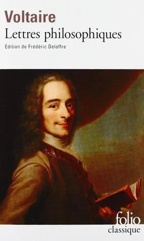

Kuid oma _Filosoofilistes kirjades_ (1734) pakub Voltaire teist vaatenurka. Ta märgib, et Inglismaal soodustab kaubandus usulist tolerantsust, mis on tsiviilrahu ja seega õnne oluline komponent. Ta kirjutab neid kirju, et kritiseerida Prantsusmaal ususõdasid, mida õhutab absoluutne ja pealetükkiv poliitiline võim. See esindab esimest radikaalset kriitikat Ancien Régime'i suhtes.

Voltaire'i jaoks on üksikisiku või rahva õnne aluseks režiim, milles inimesed elavad üksteisega rahus, teatud materiaalses mugavuses. Seepärast on ühiskond seda vabam ja õnnelikum, mida rohkem see põhineb kaubandusel majandusvahetuse mõttes.

Voltaire'i sõnul tuleb arvestada kolme punktiga:

1. Rahva õnn nõuab lihtsat materiaalset elu, mis soodustab kunste.
2. Luksus ja kaubandus on vabaduste tagatised.
3. Lõpuks on kaubandus hea, sest see edendab tsiviliseeritud ja seega rahumeelseid suhteid inimeste vahel.

Mida rohkem kaubandust hinnatakse, seda rohkem hajuvad eelarvamused majandushuvide ees. Hoolimata oma usulistest erinevustest, on kõigil kauplejatel keskmes sama mureobjekt: kasum. Ühine kasumi tagaajamine viib koostööni ja teiste arvamuste, eriti nende usuliste veendumuste austamiseni.
_Kuuendas kirjas_, _"Presbüterlastest"_, toob Voltaire näite Londoni börsist. Selles rahvusvahelise kaubanduse tipus "teevad juut, moslem ja kristlane" omavahel äri, "nagu oleksid nad samast usust". Nad reserveerivad "uskmatute" nime ainult neile, kes lähevad pankrotti.

See lõik on tsiteerimist väärt tervikuna, sest see on nii kuulus:
Astuge Londoni börsile, koht, mis on austusväärsem kui paljud kohtud; seal näete kõikide rahvuste esindajaid koos inimkonna hüvanguks. Seal kohtlevad juut, moslem ja kristlane üksteist justkui oleksid nad samast usust, ja nimetavad ainult pankrotti läinuid uskmatuteks; seal usaldab presbüteriaanlane anabaptisti ja anglikaan aktsepteerib kvaakri lubadust. Nendest rahumeelsetest ja vabadest koosolekutest lahkudes lähevad mõned sünagoogi, teised jooma; üks läheb lastakse suures vannis Isa, Poja ja Püha Vaimu nimel ristida; teine laseb oma poja eesnaha lõigata ja pomiseb lapse üle heebrea keeles sõnu, mida ta ise ei mõista; teised lähevad oma kirikusse, et oodata Jumala inspiratsiooni, mütsid peas, ja kõik on rahul.
Seega ühendab kaubandus inimesi ümber "sama usundi", kasumi. Ja see võimaldab üksikisikutel eirata usulisi või klassierinevusi, mis on konfliktide algpõhjused. Inglismaal on kasum seega rahumeelne usund. Aga mis on olukord Prantsusmaal?

_Kümnendas Kirjas_, "Kaubandusest", kirjeldab Voltaire prantslaste mõtteviisi järgnevalt: "kaupmees kuuleb tihti oma ameti kohta põlgust, nii et ta on piisavalt rumal, et häbeneda seda." Erinevalt Inglismaal tunneb kaupmees "õigustatud uhkust" ja võrdleb ennast "mitte ilmaasjata Rooma kodanikuga". Voltaire avaldab austust Inglise keskklassile, nende kaubandusele ja rahumeelsele ühiskonnale.

### Tõde Nõuab Vabadust

Prantsusmaal ei puudunud suured mõistused. See on vähe teada, kuid Anne Robert Jacques Turgot, Laulne'i parun oli esmajoones juhtiv mõtleja enne kui sai Louis XVI all finantsjuhiks. Ta oli poliitilise ökonoomia meistriteose, _Mõtisklused Rikkuse Kujunemise ja Jaotumise Üle_ (1766), autor, mis eelnes Adam Smithi _Rahvaste Rikkusele_ (1776).

Tema varased kirjutised peegeldavad tema pühendumust valgustusfilosoofiale. 1754. aastal avaldas ta oma _Kirjad Tsiviiltolerantsusest_ ja 1757. aastal mitu artiklit, mis kirjutatud _Entsüklopeedia_ jaoks Diderot' ja d'Alembert'i poolt.
Oma kirjades esitab Turgot tolerantsuse definitsiooni. Tolerants tähendab keeldumist kasutada vägivalda eksimuse vastu. Teisisõnu, tolerants ei ole eksimuse aktsepteerimine. Võib selle vastu võidelda, kuid veendumuse ja mõistuse relvadega, mitte vägivallaga.

Seejärel püüdis Turgot veenda Louis XVI eemaldama fraasi: "Ma vannun, et surun maha kõik hereesiad" vande tekstist, mida antakse kroonimispäeval. _Mälestus Kuningale Tolerantsist_ (1775), kirjutab ta:
Kas sallimatuse kaitsjad ütlevad, et printsil on õigus käskida, kui tema usk on tõene ja et siis tuleb talle alluda? Ei, isegi siis ei saa ega tohiks talle alluda; sest kui tuleb järgida usku, mida ta ette kirjutab, siis mitte seetõttu, et ta seda käskis, vaid seetõttu, et see on tõene; ja see ei ole ega saa olla tõene seetõttu, et prints seda ette kirjutab. Pole ühtegi inimest, kes oleks piisavalt rumal, et uskuda usku tõeks sellisel põhjusel. Seega, kes sellele heas usus allub, ei allu printsi käsule, ta allub ainult oma südametunnistusele; ja printsi käsk ei lisa midagi sellele kohustusele, mida see südametunnistus temale peale paneb. Olgu prints usklik või mitte, käskigu ta järgida usku või mitte, see ei muuda seda, mis see on, tõene või väär. Printsi arvamus on seega täiesti võõras usu tõele ja seega ka kohustusele seda järgida: printsil, seega kui printsil, pole õigust kohut mõista, pole õigust selles suhtes käskida; tema pädevus on absoluutne sellistes küsimustes, mis ei kuulu tema pädevusse, ja milles iga üksiku inimese südametunnistusel võib ja peab olema ainult Jumal kui ainus kohtunik.
Teisisõnu, sallivus ei tähenda vaenulikkust religiooni vastu. See tähendab, et usuline uskumus ei kuulu poliitilise võimu alla, vaid iga üksiku inimese südametunnistuse alla. Tõde nõuab vabadust; seda ei tohi kunagi peale suruda, muidu see rikutakse.

- Ideid tuleks vahetada, nagu kaupu

## Majandusvabaduse eestkõne

<chapterId>23fbb745-4fd1-5322-8fba-3ff2e998c7e2</chapterId>
Majandusliberalism on sageli seostatud anglosaksi traditsiooniga, mis pärineb Adam Smithilt, erinevalt "poliitilisest liberalismist", mida väidetakse pärinevat mandri Euroopa valgustusajastust, eriti Prantsusmaalt. See vaade on vale.

Majandusteadus sündis Prantsusmaal reaktsioonina merkantilismile ja laiemalt Ancien Régime'i ideedele. Valgustusajastul hakkasid filosoofid end nimetama "ökonomistideks", need olid füsiokraadid.

Nad panid aluse liberaalsele majandusele. Füsiokraatliku koolkonna peamised esindajad on François Quesnay, markii de Mirabeau, Lemercier de la Rivière, Abbé Nicolas Baudeau, Louis-Paul Abeille ja Pierre-Samuel Dupont de Nemours.

> Poliitiline ökonoomia, Dupont de Nemours võtab kokku, on loodusõiguse teadus, mis on rakendatud tsiviliseeritud ühiskondadele. (_Kirjavahetus J.-B. Sayga_).

Nad pooldasid "Laissez-faire'i", mis soovitab, et riik ei tohiks majandusse sekkuda.

Sellest punktist alates hakkas valgustusajastul tekkima kaks väga erinevat kontseptsiooni:

- Ühelt poolt on neid, kes usuvad, et see sotsiaalne harmoonia tuleb kunstlikult saavutada ja riigi sunni kaudu; need on lepinguteooriad.
- Teiselt poolt on neid, kes usuvad, et valitsemist saab saavutada huvide kaudu, tähendades, et lubatakse individuaalsetel huvidel harmooniasse jõuda mängureeglite raamistikus, mis on kõigile teada ja aktsepteeritud: need on turuteooriad.

### Colbertismi vastu

See fraas ilmus, kui Jean-Baptiste Colbert, Louis XIV peanõunik, küsis ühel päeval kaupmeestelt: "Mida ma teie heaks teha saan?" Üks neist, nimega François Legendre, vastas: "Laske meil tegutseda!"
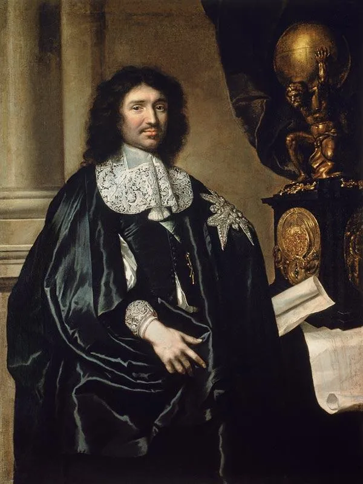
Fraasi võtsid omaks füsiokraadid, François Quesnay, markii d'Argenson ja seejärel Vincent de Gournay: "Laissez-faire, laissez passer." See sai nende motoks.

Viidates loomulikule seadusele (termin pärineb sõnadest _phusis_, loodus, ja _cratos_, võim või valitsus), uskusid füsiokraadid, et on olemas majandusseadused, mis ei sõltu poliitilisest või religioossest võimust, vaid inimese ja ühiskondade olemusest. Majanduskord on ühiskondade loomulik kord. Poliitiline võim peab sellele alluma.
Füsiokraadid püüdsid tõestada, et merkantilism, majanduspoliitika nii Prantsusmaal kui ka Inglismaal, ei olnud mitte ainult ebatõhus, vaid ka ebaeetiline. Colbert oli üks esimesi kaasaegseid riigimehi. Ta oli veendunud, et valitsuse regulatsioon võib tekitada rahvuslikku jõukust. Riik tegutses pankurina, kaupmehe ja tarnijana. See kontrollis valuutat, suunas kaubandust ja jaotas ümber rikkust.
Colberti sõnul oli eesmärk "rikkuse suurendamine tööstuse edendamise teel." Ja ta lisas veel: "Prantsusmaa saab rikastuda ainult Inglismaa ja Hollandi arvelt."

Vastupidi, füsiokraatide jaoks oli vabakaubandus ainus hea majanduspoliitika, kuna see oli positiivse summa mäng ja majandust juhtisid loodusseadused, mida ei tohiks häirida meelevaldsete seadustega.

### Vaba Turu Eelised

Kuni Prantsuse revolutsioonini elas ühiskond aristokraatlikus majanduses, mis põhines kingitusel ja privileegidel. Meelvaldsed teod ja tüütused tegid tavalistele kodanikele turule pääsu raskeks.

Siiski, nagu me oleme näinud, alates keskajast, arenes turumajandus. Kaupmehed muutusid jõukamaks ja said üha rohkem majandusvabadust.

Turg on vabatahtlik vahetus kokkulepitud hinnaga. Turg parandab kõigi materiaalset, intellektuaalset ja poliitilist seisundit, kuna see võimaldab omandada autonoomia ja algatusvõime ruume.

Tõepoolest, inimesed loomulikult soovivad parandada omaenda olukorda ja oma lähedaste olukorda, vahetades kaupu ja teenuseid. Seega oli nende uute filosoofide, "majandusteadlaste," soov võimaldada inimestel hankida endale piisav sissetulek ja seeläbi saavutada see, mida Kant oma pamfletis _Mis on valgustus?_ nimetab nende "enamuseks," nende otsustus- ja tegutsemisautonoomiaks.

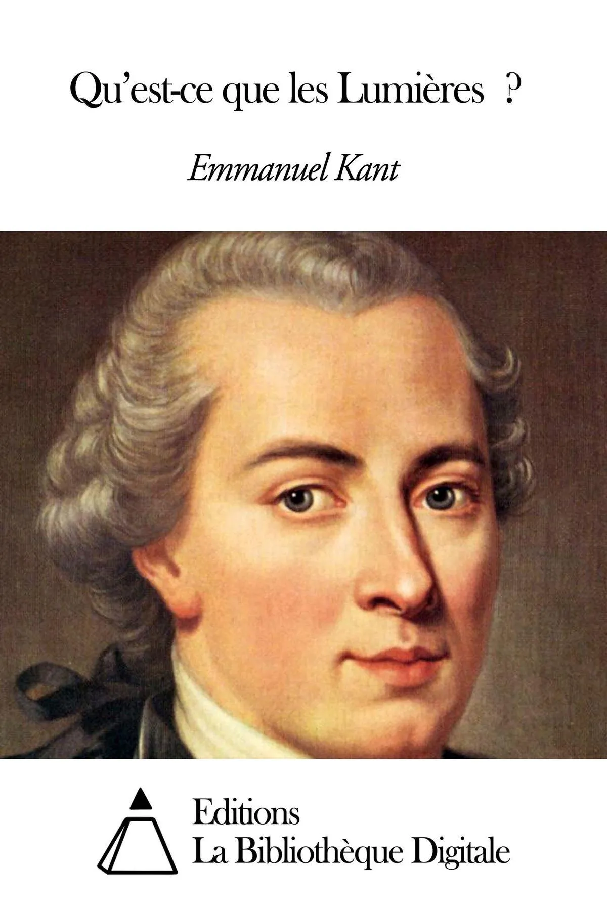

Füsiokraatide jaoks ei jaga vabadus. Poliitiliste privileegide vastu võitlemine ja majanduslike rentide vastu võitlemine on üks ja seesama. Kaasaegsete majandusteadlaste suur uudsus 18. sajandi alguses oli see, et nad keskendusid igale üksikisikule kavatsusega taastada nende tegutsemisvõime, mõeldes samal ajal, kuidas vaba turu kaudu ohjeldada kirgi ja huvisid.

Tõepoolest, kuidas panna kokku elama erinevate huvidega inimesed? Mida teha, kui inimesed satuvad konflikti, kui nad teevad vigu, kui nad on ahned ja isekad?

Füsiokraadid vastasid kolmes etapis:

1. See on lepinguvabadus, mis võimaldab huvide konflikte lahendada, mitte sotsiaalne leping, mis on pseudo-leping, kuna seda ei saa katkestada. Sotsiaalsete probleemide analüüsimine turu ja vahetuse mõistetes võimaldab meil vaadelda suhteid üksikisikute ja rahvaste vahel positiivse summa mänguna ning käsitleda nii institutsiooni küsimusi kui ka ühiskonna reguleerimist, väites, et vajadus ja huvi üksi valitsevad inimeste vahelisi suhteid.
2. Loomulik vabadus on õigus iseenda ja oma varade üle otsustada. Seetõttu on huvide harmoonia võimalik legitiimse omandi austamise alusel, mis on omandatud töö kaudu ja tuleneb meie võimete kasutamisest. Ja just see omandil põhinev vabadus on sotsiaalse probleemi võti, mitte seaduse piirang.

3. Riigi roll on lepingute täitmise tagamine ja inimeste ning vara turvalisuse garantii. See on kuulus "Laissez faire," füsiokraatide moto. Riik valitseb paremini, kui see valitseb vähem ja lubab üksikisikutel võtta initsiatiive ja võtta vastutust.

Lühidalt, kui kõik saavad vabalt järgida oma eraõiguslikku huvi loodusõiguse austamisel, tagatakse kõigi rahu ja jõukus paremini kui poliitilise organisatsiooni poolt, mis määratleks üldise huvi ülalt alla ja kehtestaks selle seaduse piirangute kaudu. Poliitiline vabadus on kasulik asi, kuid see ei ole piisav, et anda üksikisikutele otsustus- ja tegutsemisautonoomia, mida nad vajavad. Selline on füsiokraatide õppetund. Prantsuse liberaalne kool 19. sajandil, Say, Constant, Dunoyer, Bastiat ja Molinari, mäletavad seda ja kaitsevad seda pärandit hiilgavalt tekkiva sotsialismi vastu.

## Vaba Maailma jaoks Võtmeaasta: 1776

<chapterId>c1ba85f8-e8d1-5794-b198-8c683efb0d9b</chapterId>

1776 on aasta, mis jääb sageli ajalooõpikutes märkamatuks. Kuid kolmes riigis, Prantsusmaal, Šotimaal ja Põhja-Ameerikas, jätavad mitmed sündmused vabaduse ajaloos kustutamatu jälje.

### Turgoti Häbistamine

Oma lühikese ametiaja jooksul Rahandusministrina (Kontrolöri Üldine) augustist 1774 kuni maini 1776 üritas Ann-Robert Jacques Turgot teha suuri reforme, et lõpetada liigne kulutamine, arvukad kohalikud monopolid ja naasta vabakaubanduse juurde. Ta läks isegi nii kaugele, et manitses kuningas Louis XVI sellistes sõnades:

> Te peate, Sire, oma lahkuselt relvastuma oma lahkus ise, arvestades, kust tuleb raha, mida saate oma õukondlastele jagada. 1774. aastal avaldas ta oma Kuus Eediti, et kaotada tsunftid ja meistrivõimud (korporatsioonid, mis olid muutunud monopolideks ja takistusteks tööturul), kaotada sisemised tollimaksud teraviljakaubanduselt, kaotada sunnitöö (korvee) ja kehtestada sallivus protestantide suhtes.

Kahjuks põhjustasid nisu hinnatõusud, mis järgnesid kehvadele saakidele, kahtlusi tema reformides. Turgot kirjutas oma kaitseks:

> Kui provintsides oleks endiselt näljahädasid, ei tohiks seda võtta vabaduse vastu argumendina; tuleks järeldada ainult, et vabadus ei ole olnud piisavalt kaua kehtestatud, et toota kõiki oma mõjusid.

Siiski kohtas ta peamiselt aadlike viha, kes üritasid kaitsta oma privileege. Krahv Conti poolt üles seatud vandenõuga silmitsi seistes eelistas ta mais 1776 tagasi astuda, mitte järele anda selles, mida ta pidas monarhia ja Prantsusmaa päästmiseks. Tema langemine lõpetas Prantsusmaal esimese katse vabaturumajandusega (Lisalugemiseks vaata Edgar Faure, _La disgrâce de Turgot_).
Turgot'i peateos, _Mõtisklused Rikkuse Kujunemise ja Jaotumise Üle_ (1766), võlgneb palju füsiokraatide doktriinile. Turgot külastab uuesti ja laiendab vabaturu mudelit, mida pakkus välja Quesnay ja enne teda Boisguilbert vastukaaluks merkantilistidele. Kuid tema ideid mõjutab vähemalt sama palju tema sõber Jacques Vincent de Gournay, kes määrati kaubandusintendandiks 1751. aastal. Turgot reisis temaga mööda riiki tema inspektsioonireisidel.

Turgot on loomuliku õiguse apostel, mida ta nimetab ka "vabaduse süsteemiks". Ta rõhutab sageli, et konkurents vabal turul reguleerib loomulikult hindu ja hoiab ära kuritarvitused. Lisaks teeb ta kaupmehest turumehhanismi nurgakivi. Tõepoolest, riigiametnikud on vähem motiveeritud ja eriti vähem informeeritud kui kaupmehed. Seetõttu on kaubanduse jätmine eraõiguslike huvide kätte tõhusam.

Pole vaja tõestada, et iga üksikisik on ainus, kes suudab kõige kasulikumalt otsustada oma mõistuse ja käte kasutamise üle. Nemad üksi omavad kohalikku teadmist, ilma milleta kõige valgustatum inimene saab vaid pimedalt arutleda. Nemad üksi omavad kogemust, mis on seda usaldusväärsem, kuna see piirdub ühe objektiga. Nad õpivad oma korduvatest katsetest, edusammudest, kaotustest ja omandavad taju, mille peensus, teravdatud vajaduse tundest, ületab kaugelt kõik ükskõikse spekulandi teooriad. (_Vincent de Gournay kiituseks_).

Siin Turgot suuresti ette näeb Mises'i ja Hayeki argumenti majandusliku arvutuse võimatuse kohta sotsialistlikus majandussüsteemis.

Pühendades peatüki "Turgot'i Hiilgusele", rõhutab Murray Rothbard oma majandusajaloos Austria perspektiivist, et "Turgot'i mõju järgnevale majandusmõttele oli tõsiselt piiratud (...) järgneva müüdiga, et Adam Smith oli poliitilise ökonoomia rajaja." Ja ta lisab, "see oli prantslane J.B. Say, ametlikult Smithi järgija, kellele Turgot lõpuks kõige rohkem mõju avaldas, eriti oma kasulikkuse väärtuse teooriaga."

### Condillac'i Meistriteos

1776. aastal avaldas filosoof Étienne Bonnot de Condillac teose _Kaubandus ja Valitsus_, mis on vaieldamatult üks tolle ajastu suurejoonelisemaid üleskutseid vabakaubanduse ja individuaalse vabaduse nimel.

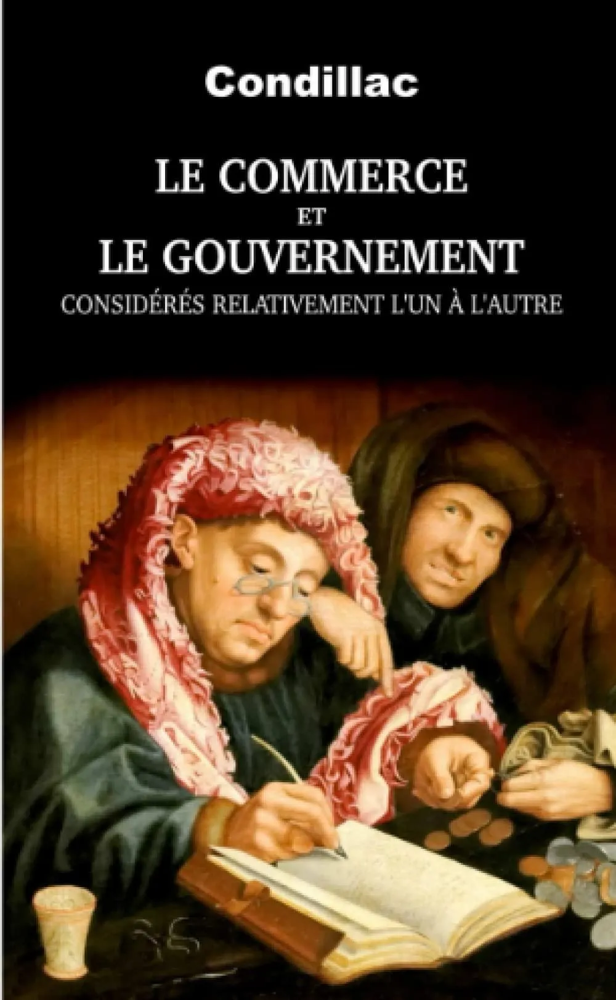

_Kaubandus ja Valitsus_ sisaldab seda, mida hiljem nimetataks väärtuse subjektiivsuse teooriaks, mis tõi talle Austria majandusteadlaste, alustades Mengerist, kõik kiidusõnad. Järgides Turgot'i, kuid suurema selgusega, väidab Condillac, et väärtus ei peitu töös, vaid asjaolus, et igaüks leiab vahetuses huvi:

> Asjade väärtus, kirjutab ta, põhineb nende kasulikkusel, või, mis tuleb sama välja, meie vajadusel nende järele; või, mis jällegi tuleb sama välja, kasutusel, mida me neist teha saame. Ja ta lisab: "Asjal ei ole väärtust sellepärast, et see maksab, nagu arvatakse; vaid see maksab, sest sellel on väärtus.

Seega ei peitu väärtus asja sees töö hulga kujul, mis oleks pidanud olema toodetud (tööväärtuse tees, mis oleks olnud Adam Smithi ja Ricardo oma), vaid asja väljaspool, teisisõnu, ostja kogemuses oleva soovi intensiivsuses.
See on ka filosoofia traktaat, kuna see demonstreerib, kuidas vaba ja vabatahtlik vahetus on emantsipatsiooni vahend, mis on õiglasem kui riigi sekkumine, kuna see on egalitaarne ja antihierarhiline. See on võimeline looma küpseid ja vastutustundlikke kodanikke ning on vastus Ancien Régime'i türannilistele kalduvustele. Tõepoolest, kui individualismi liialdusi saab turu kaudu reguleerida, siis ei saa midagi reguleerida keskvõimu kuritarvitusi. Seetõttu kutsub Condillac võimu vabastama kaubandust igasugusest takistusest ja loobuma igasugusest sekkumisest majandussfääri.

### Vabaduse manifest Ameerikas

1776. aastal avaldas inglise mees nimega Thomas Paine Ameerikas terava pamfleti, milles kritiseeris Inglise monarhiat ja pooldas Ameerika kolonistide iseseisvust: _Common Sense_.

Paine väidab, et:

- Tsiviilühiskond eksisteerib enne valitsust
- Monarhia on iganenud ja despootlik poliitiline süsteem.
- Ameerika kannatab Briti domineerimise all.
- Ameerika revolutsioon on universaalne põhjus, mis kaitseb vabaduse, võrdsuse ja vastutuse väärtusi.
- Ameerika peab Inglismaast eralduma ja looma vabariigi, et kehastada neid väärtusi.

Autor teeb vahet tsiviilühiskonna ja riigi vahel:

> Ühiskond on meie vajaduste tulemus, valitsus on meie pahede tulemus. \[…\] Sotsiaalne seisund on hea igas hüpoteesis. Valitsus, isegi oma täiuslikkuses, on vaid vajalik kurjus; oma puudulikkuses on see talumatu kurjus.

Raamatu edu on tohutu. Mõne kuu jooksul müüdi umbes 100 000 eksemplari riigis, kus elab kolm miljonit inimest, ja see aitas kaasa Ameerika iseseisvusmeelsuse tugevnemisele.

Thomas Paine mängis oma pamfleti kaudu olulist rolli Ameerika revolutsioonis ja vabaduse ning demokraatia ideaalide inspireerimisel. Ta mõjutas otseselt mõni kuu hiljem vastu võetud Ameerika Iseseisvusdeklaratsiooni.

### Philadelphia kongress

1776. aasta 4. juulil Philadelphias, kus nad on kogunenud kongressile (inglise keeles "Convention"), võtavad Põhja-Ameerika Kolmeteistkümne Inglise Koloonia esindajad vastu resolutsiooni, milles öeldakse, et "Ameerika Ühendriigid on ja õigusega peaksid olema vabad ja sõltumatud riigid". Resolutsiooni toetavad John Adams (üks Tea Party inspiraatoritest) ja Benjamin Franklin, Massachusettsi delegaadid. Iseseisvusdeklaratsiooni koostab Thomas Jefferson, Virginia delegaat.

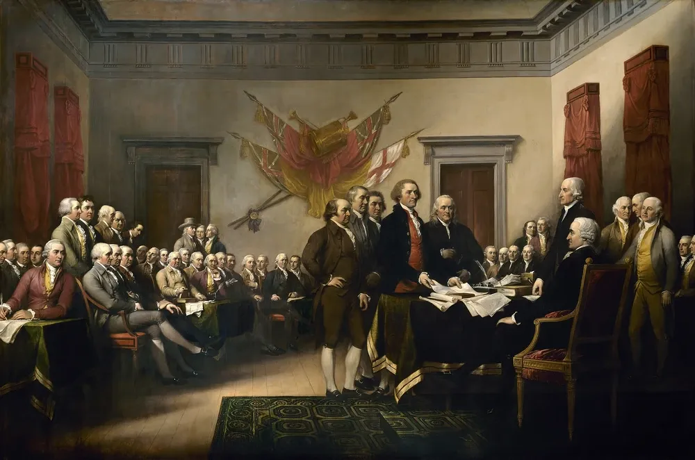
Järgnevatel aastatel võitlesid prantslased La Fayette, Rochambeau, admiral de Grasse, krahv d'Estaing, kindral Duportail, markii de la Rouerie, komandör Pierre L'Enfant, kirjanik Beaumarchais ja paljud teised mässajate kõrval, et vabastada nad Inglismaa kuninga ikkest.
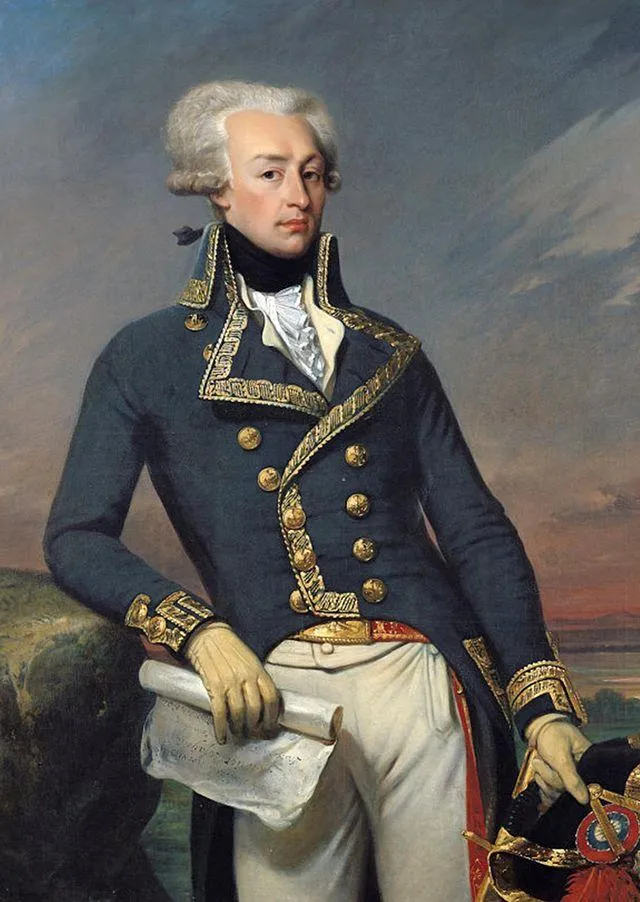

141 aastat hiljem, 1917. aasta 4. juulil, Esimese maailmasõja keskel, korraldati Pariisis Picpus'i kalmistul La Fayette'i haua juures tseremoonia AEF-i esimestele sõduritele, kes saabusid Pariisi. Sel puhul pidas kuulsa kõne kapten Charles E. Stanton kindral Pershingi staabist.
Kahetsen, et ei saa pöörduda Prantsuse rahva poole selle kauni keeles, mis on nende ustava maa keel. Ei saa unustada, et teie rahvas oli meie sõber, kui Ameerika võitles oma olemasolu eest, kui käputäis vapraid ja patriootlikke mehi oli otsustanud kaitsta õigusi, mille nende Looja oli neile andnud – et Prantsusmaa, Lafayette'i isikus, tuli meile appi nii sõnades kui tegudes. Oleks tänamatu seda mitte mäletada, ja Ameerika ei jäta oma kohustusi täitmata...

Seetõttu on meil suur uhkus, et me võtame omaks värvid austuse avaldamiseks sellele teie suure Vabariigi kodanikule, ja siin ja praegu illustreerunud surnute varjus kinnitame talle meie südamest ja au andmist, et anda sellele sõjale soodne tulemus.

Lafayette, me oleme siin!

1789. aastal oli jällegi La Fayette, koos Jeffersoniga, kes lõid esimesed alused Inimõiguste Deklaratsioonile 1789. aastal.

### Rahvaste Rikkus

Adam Smith avaldas 1776. aastal _Uurimus Rahvaste Rikkuse Loodusest ja Põhjustest_. See on viljakas töö, mis sageli liigitab teda majandusteadlasena, kuigi ta õpetas moraalifilosoofiat Glasgow Ülikoolis. Karikatuurses mõttes mäletatakse teda kui modernse majanduse isa.

Tegelikkuses oli Smithil suur võlg ökonomistide Quesnay ja Turgot ees, kellega ta kohtus oma enam kui aasta kestnud reisil Prantsusmaal. Selles raamatus kirjeldab ta muuhulgas "lihtsat loomuliku vabaduse süsteemi", milles üksikisikud, järgides oma huve, juhitakse "nähtamatu käe" poolt edendama ühiskonna terviklikku heaolu.

Siin on kõige kuulsam lõik:
Eelistades rahvusliku tööstuse edu võõraste tööstuste ees, mõtleb ta ainult oma suurema turvalisuse peale; ja suunates seda tööstust nii, et selle toode oleks võimalikult kõrge väärtusega, mõtleb ta ainult oma kasule; selles, nagu paljudes teisteski juhtudel, juhib teda nähtamatu käsi saavutama eesmärki, mis pole üldse osa tema kavatsustest; ja see, et see eesmärk pole osa tema kavatsustest, ei ole alati ühiskonnale halvim. (_Rahvaste Rikkus_)

See kuulus nähtamatu käsi illustreerib ideed, et vaba konkurents vabal turul viib ressursside efektiivse jaotumiseni ja üldise heaolu maksimeerimiseni.

Smithi kõige olulisem panus vabadusse oli spontaanse korra idee selgitamine. Tõepoolest, Smith väidab, et üksikisikud, püüdes rahuldada oma vajadusi ja soove, on julgustatud tootma ja vahetama kaupu ja teenuseid viisil, mis rahuldab ühiskonna vajadusi tõhusamalt kui keskne planeerimine suudaks.

See spontaanse korra idee saab Friedrich Hayeki töö võtmekontseptsiooniks, kes tunnistab oma võlga Šoti Valgustusajale ja eriti Adam Smithile.

## Revolutsioonide Ajastu

<chapterId>c260e3ab-31a2-5ad7-b775-4bdcdc13b859</chapterId>

Suur uudsus sellel modernsel perioodil Lääne ajaloos on ühiskonna esilekerkimine, mis korraldab end väljaspool religioosset sõltuvust. See ei tähenda religioosse uskumuse kadumist ega Jumala surma. Kuid Jumalast saab eraasi, mis ei segune enam poliitiliste asjadega. Religioon ei kao, kuid selle juhtiv roll troonitakse. See muutub individuaalsete uskumuste süsteemiks.

Lääne maailma sekulariseerumine ei toimunud üleöö. Sellele valmistasid ette ideed. Nagu sageli, on filosoofia suurte kultuurimuutuste eesliinil.
Alates Machiavellist ja Hobbesist on inimest mõistetud kui kirgede olendit, keda elustavad vastuolulised kalduvused. Seetõttu oli vajalik leida nende kirgede reguleerimise põhimõtted, et vältida konflikte ja vägivalda, millele need viivad.
Oleme rääkinud majandusteadlastest ja nende vabaturu pooldamisest. Kuid paljude filosoofide jaoks eeldab probleemi lahendus pigem suveräänse võimu loomist õigusliku lepingu kaudu.

Kuni 18. sajandini on nende filosoofide jaoks peamine poliitiline probleem seega suveräänsuse küsimus. See on eelkõige õigluse küsimus: kes võib legitiimselt suveräänsust teostada?

### Rahva Suveräänsus

Ideed inspireeris 17. sajandil Locke ja seejärel võttis selle üle Rousseau. Suveräänne võim peab tulema mitte ainult rahva vabast tahtest, vaid ka selles resideeruma. See on Rousseau teooria üldise tahte suveräänsusest, mida me tänapäeval nimetame demokraatiaks.
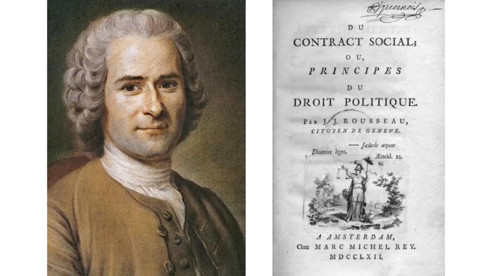

Rousseau käsitleb rahvast kui autonoomset isikut, kes on võimeline allutama end seadustele, mille nad kehtestavad. Rahva vaba tahe moodustab suveräänsuse ainuõige aluse. Rousseau arendaks seda õiguslikku humanismi, mis on modernsusele iseloomulik, lõpuni välja, käsitledes rahvast kui isikut, kes on võimeline vabalt enesemääramisele või kui üldist tahet. Seega hõlmab leping allumist seadustele, mida inimene kui üldine tahe annab endale kui erilisele tahtele. Üldise tahte või rahva suveräänsuse teooria võimaldab seega vabaduse ja allumise lepitamist. Seaduse enesekehtestamine või poliitiline autonoomia on tõepoolest olnud demokraatia oluline komponent alates Rousseau'st.

Kuid suveräänsuse päritolu küsimus pole ainus. Mõtisklus võib võtta uue suuna, suveräänsuse teostamise viisi suunas. Kas üldine tahe on alati õiglane? Ja mis peamine, kas tal on õigus sekkuda kodanikuühiskonda ja millistes piirides?

### Piiratud võimu teooria

Üks valgustusfilosoofidest, kelle mõju oli Prantsusmaal ja Ameerikas väga tugev, on John Locke. Ta oli Ameerika Ühendriikide asutajaisade, aga ka Inimese ja Kodaniku Õiguste Deklaratsiooni inspiratsiooniks 1789. aastal

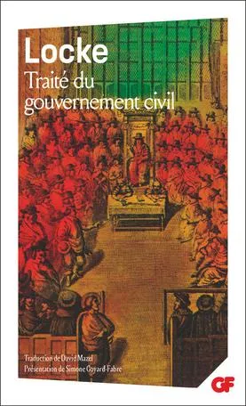

Kõik eelnevad süsteemid olid arvanud, et vabadused on ainult privileegid, mida võim annab loa alusel ja mida võib igal ajal tühistada. Locke'i jaoks on inimese elu tema enda oma loomuõiguse alusel (tähendus: moraalse põhimõtte alusel, mis on inimloomuses olemuslik) ja et valitsuse ainus moraalne eesmärk on kaitsta üksikisiku õigusi.

Locke määrab riigile ülesande kaitsta üksikisiku vara, tähendades "elu, vabadust ja omandit":

> Suur ja peamine eesmärk, milleks inimesed ühinevad ühiskondadeks ja allutavad end valitsusele, on nende vara säilitamine. (Kaks valitsemise traktaati, § 87).

Thomas Jefferson kirjutas Locke'i teooria võõrandamatutest õigustest sisse Iseseisvusdeklaratsiooni:
Me peame neid tõdesid iseenesestmõistetavaks, et kõik inimesed on loodud võrdsena, et nad on oma Looja poolt varustatud teatud võõrandamatute õigustega, nende hulgas elu, vabadus ja õnne poole püüdlemine.

Lisaks ammutab 1789. aasta Prantsuse Inim- ja Kodanikuõiguste Deklaratsiooni artikkel 2 inspiratsiooni sellest Lockea loomuõiguse traditsioonist:

> Iga poliitilise ühenduse eesmärk on inimese loomulike ja tühistamatute õiguste säilitamine. Need õigused on vabadus, omand, turvalisus ja vastupanu rõhumisele.

### Kahe Revolutsiooni Võrdlus

Ameerika revolutsiooni juhtisid mehed, kes rääkisid põhiõigustest, mida ei saa võtta. See viis detsentraliseeritud ja piiratud õigusriigi loomiseni. Atlandi ookeani teisel kaldal toimus teine poliitiline eksperiment: Prantsuse revolutsioon, mis algas rahva julge ülestõusuna, lõppes veriste massimõrvade, veriste sisemiste konfliktidega ja sillutas tee Napoleon Bonaparte'i sõjaväelise diktatuuri jaoks. Miks selline erinevus? 19. sajandil üritas prantsuse poliitiline filosoof Alexis de Tocqueville tuvastada neid erinevusi kahe õerevolutsiooni vahel. Ta omistab Ameerika revolutsiooni edu mitmele tegurile.

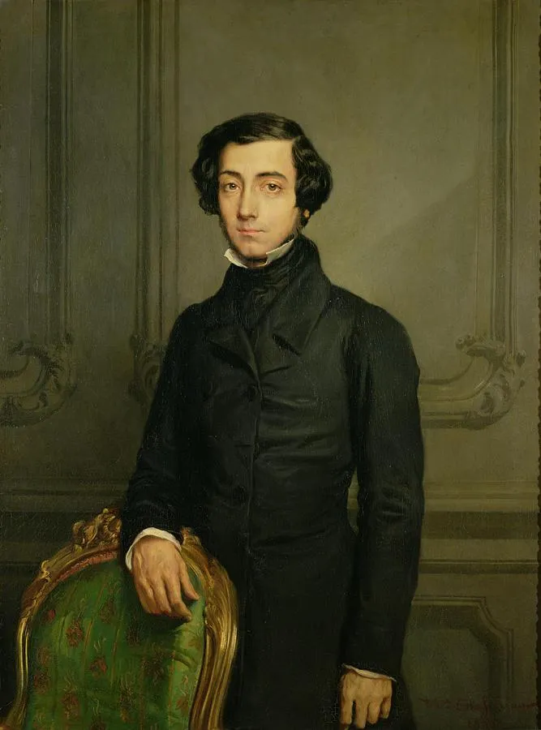

Esiteks, vabariigi määratlemise viisis. Prantsuse Vabariik on üks ja jagamatu. Ameerika Vabariik koosneb suveräänsetest osariikidest, millest igaühel on oma jurisdiktsioon ja kohalikud huvid. Föderalismi peetakse Prantsusmaal reetmiseks. Ameerikas oleks reetmine soovida peale suruda ühtsust. Vähemalt Ameerika kodusõjani oli Liidu tugevus osariikide mitmekesisuses.

Ta väidab ka, et Ameerika usk kõrgemasse seadusesse mängis otsustavat rolli. Iseseisvusdeklaratsioon kuulutab, et kõik inimesed on loodud võrdselt, et neile on antud teatud võõrandamatud õigused (elu, vabadus, omand ja õnne poole püüdlemine) ning et valitsuse ainus eesmärk on neid õigusi tagada. Tegemist oli põhimõtete ja ideaalide taastamisega, mida Briti kroon oli tallanud.

Ameerika põhiseaduse esimene parandus, mis koostati 1789. aastal, sätestab:
Kongress ei tohi vastu võtta ühtegi seadust, mis puudutab religiooni asutamist või keelab selle vaba harjutamise; või piirab sõnavabadust või ajakirjandusvabadust; või rahva õigust rahumeelselt koguneda ja esitada valitsusele kaebusi.

See sõnastus kaitseb selgelt enamuse türannia eest. Prantsuse revolutsioon oli aga hoopis teistsugune. Prantslased tahtsid minevikust täielikult lahti öelda. Kristliku pärandi aegunud põhimõtted ei vastanud enam revolutsionääride nagu Robespierre ootustele.

### Kolmanda seisuse ülestõusust jakobiinide terrorini

Abbé Sieyès (1748-1836) peetakse Prantsuse revolutsiooni isaks. Ta on _Mis on kolmas seisus?_ autor, jaanuaris 1789

Kolmas seisus hõlmas kõiki neid, kes ei kuulunud klerusse ega aadlisse. Oma kuulsas pamfletis juba esimestest ridadest alates kiitis Abbé Sieyès individuaalseid vabadusi ja vaba konkurentsi:

> Kas monopoli mõju ei ole teada? Kui see heidutab neid, kes on välja jäetud, kas pole teada, et see muudab need, keda see soosib, vähem oskuslikuks? Kas pole teada, et igasugune töö, millest on eemaldatud vaba konkurents, tehakse kallimalt ja halvemini?

4. augusti 1789 öö on Prantsuse revolutsiooni alustala, veelgi enam kui 14. juuli, mis valiti rahvuspühaks. Tõepoolest, siis toimunud istungil lõpetas Konstitutsiooniline Assamblee feodaalsüsteemi. Privileegid kaotati, nii aadlike kui ka kleruse omad. 1791. aasta märtsis, pärast mitmeid kuid omamoodi õiguslikus vaakumis, kaotati ka tsunftid ja kehtestati täielik töövabadus. Revolutsioon kinnitas Turgoti tööd. Kuid mitte kauaks...
   Prantsusmaal, 1791. aasta lõpuks, süvendas näljahäda rahutusi. Mässud halvasid teraviljakaubanduse ja leib oli napp. Ulatuslik liikumine nõudis agrariaadiseadust, see tähendab riigi poolt nisutootmise jaotamist. Assamblee siiski vastustas seda kollektiviseerimise katset. Alguses hääletas see kirikuvarade konfiskeerimise poolt ja teises etapis Vaimulikkonna Tsiviilkonstitutsiooni.

Kirikuvarade konfiskeerimise eesmärk oli vältida finantskriisi; see oli mõeldud tagatiseks Assignaatidele, tähendades massilist paberraha emiteerimist.

Pealegi, nagu Dupont de Nemours oli ennustanud, süvendas võltsraha emiteerimine kriisi veelgi, põhjustades ulatuslikku inflatsiooni ja Assignaatide väärtuse järsu languse. Augustis 1792 viisid näljarahutused omakorda Pariisi ülestõusuni, Louis XVI hukkamiseni jaanuaris 1793 ja seejärel Terrori Valitsusajani.

1795. aastal, viis aastat pärast esimest emiteerimist, oli paberraha kaotanud 99% oma väärtusest. Prantsuse Revolutsioon jätkus Direktooriumi all kuni 1799. aastani, mil Napoleon haaras võimu läbi riigipöörde. Ta sai Prantsuse Vabariigi Esimeseks Konsuliks enne kui krooniti 1804. aastal keisriks. See oli üks esimesi silmatorkavaid vastuolusid Inimõiguste Deklaratsiooniga, mis kuulutas, et eraomand on puutumatu.

Ameerikas ei olnud majanduslikku dirigismi ega rahanduslikku pankrotti nagu Assignaatide puhul. Ja mis peamine, ei olnud hukkamõistmisi, massilisi emigratsioone, giljotiini, massimõrvu ega Terrori Valitsusaega. Kohe on näha tegevusviiside erinevust, mis eraldab Ameerika Revolutsiooni Prantsuse Revolutsioonist.

Rousseau ja Robespierre'iga tahtsid prantslased uskuda, et Rahvas või üldine tahe omab piiramatut võimu ja õigustab kõike. Asjaolust, et rahvas valitses, järeldati, et neil on kõik õigused. Selgelt oli vastuolu suurte revolutsioonipõhimõtete ja nende võidule viimiseks kasutatud vahendite vahel.

See on ka Friedrich Hayeki raamatu _Vabaduse Konstitutsioon_ mõtte mõte:

> Otsustav tegur, mis muutis revolutsiooni pingutused individuaalse vabaduse edendamisel asjatuks, oli illusioon, et kuna kogu võim oli antud rahvale, oli kõik ettevaatusabinõud selle võimu kuritarvitamise vastu muutunud tarbetuks.

# Tipp ja Allakäik: 19. sajandist 20. sajandini

<partId>39810d57-19e3-5166-8f2e-40b763154148</partId>

## Modernsete Vabadus

<chapterId>e575f4c1-7144-591b-ab98-d976ec4102fb</chapterId>
Benjamin Constanti sõnul ei saa vabadust meie modernsetes ühiskondades enam mõista nagu antiikühiskondades otsest osalust linna asjades.

### Vabadus Eraelus

Muistsel ajal oli üksikisik suveräänne avalikes asjades, kuid orjastatud kõigis oma eraelulistest suhetest. Individuaalse vabaduse ohverdamine kompenseeriti poliitiliste õiguste kasutamisega: õigus otse osaleda suveräänsuse erinevates osades, arutleda avalikul väljakul, hääletada seaduste üle, langetada otsuseid, hinnata ja kohtu mõista ametnike üle. See on poliitiline ja kollektiivne vabadus:
Vabadus, mida antiikajal hinnati, seisnes aktiivses ja pidevas osalemises kollektiivses võimus. Meie vabadus seevastu peab seisnema rahulikus eraisikliku sõltumatuse nautimises; sellest järeldub, et peame olema palju rohkem kinnitatud oma individuaalse sõltumatuse külge kui antiikajal. (_On the Liberty of the Ancients Compared with that of the Moderns_ (1819))
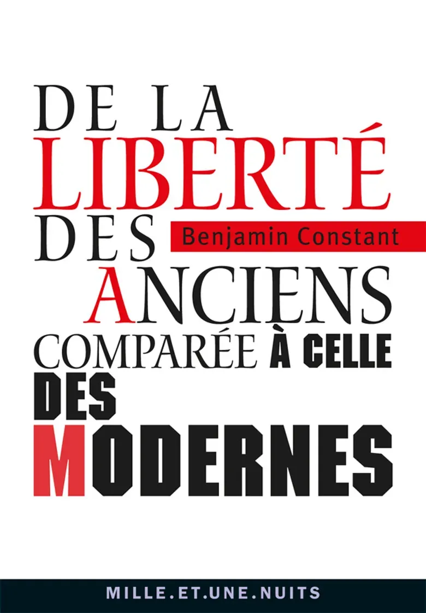

Kaasaegne vabadus on tsiviilvabadus, mis hõlmab majandusvabadust ja põhineb privaatsusõigusel. See on õigus mitte alluda ühelegi meelevaldsusele, õigus väljendusele, kogunemisele, liikumisele, usule ja tööstusele. Vabadust ei ole ilma võimaluseta valida oma elustiili ja väärtusi, seega ei ole vabadust ilma võimaluseta kogukonnast taanduda ja järelikult ei ole vabadust ilma riigi piiranguteta, mis lubavad selle eraelu ruumi olemasolu. See on vabadus, mis vastab sellele, mida ameeriklased nimetavad kodanikuõigusteks.

See vabaduse definitsioon leidub John Stuart Millis:

> Ainus vabadus, mis väärivad seda nime, on meie enda hüve tagaajamine meie enda viisil, nii kaua kui me ei ürita teistelt nende oma ära võtta või takistada nende püüdlusi seda saavutada. (...) Inimkond võidab rohkem, lastes igal inimesel elada nii, nagu nad ise sobivaks peavad, kui sundides neid elama nii, nagu teistele tundub hea. (_On Liberty_, 1859)

Mill piiritleb riigi suveräänsuse piire: see peatub seal, kus algab üksikisiku suveräänsus. Kui üksikisiku tegevusel ei ole teistele kahjulikke tagajärgi, siis on üksikisikul täielik vabadus seda teha. Riik peab reguleerima inimestevahelisi suhteid, kuid ei saa minna kaugemale, sekkudes üksikisikute eraellu. Kui üksikisik teeb endale kahju, ei saa riik teha muud, kui "manitseda" või üritada "veenda" või "mõjutada" neid: see ei saa sundida ega karistada. Sest Mill lisab: "Ainus legitiimne põhjus, mille jaoks riik võib kasutada jõudu ühe oma liikme vastu, vastu nende tahtele, on ära hoida kahju tegemist teistele."
Kaasaegsetele vastav poliitiline võim on seega piiratud võim: "Las võim piirdub õiglusega, me hoolitseme oma õnne eest," kuulutab Benjamin Constant. Riik ei tohi meile öelda, kuidas olla õnnelik.

### Rousseau'lik Segadus

Constanti sõnul "oli nende kahe vabaduse tüübi segiajamine meie seas, meie revolutsiooni liiga kuulsatel ajastutel, paljude hädade põhjuseks." Jean-Jacques Rousseau, käsitledes vabadust ainult kodanike kollektiivse osalusena poliitilises tegevuses, julgustas Robespierre'i kodanikke terrori abil piirama. Revolutsiooni komistuskivid on seega kaasaegsete poliitiliste põhimõtete rakendamise tulemus, mis kehtisid antiikajal.

Kuid see ei tähenda poliitilise vabaduse ohverdamist, osalemist võimus. Constant täpsustab, et kui kaasaegne vabadus erineb antiiksest vabadusest, siis on see ohustatud erineva liiki ohuga. Antiiksete vabaduse oht oli meelevaldsus. Kaasaegsete vabaduse oht oleks loobuda selle vabaduse poliitilistest tagatistest läbi teatud ükskõiksuse avaliku hüve suhtes. Teisisõnu, kodanikel on kohustus oma esindajate üle pidevalt valvsust harjutada.

Tõepoolest, oma _Poliitika Põhimõtetes_ väidab Benjamin Constant:

> Rahva suveräänsus ei ole piiramatu, see on piiritletud õigluse ja üksikisikute õiguste poolt tõmmatud piiridega. Kogu rahva tahe ei saa muuta õiglaseks seda, mis on ebaõiglane.
> See on uus kriitika Rousseau ja _Sotsiaallepingu_ suhtes: isegi üldine tahe on piiratud ning see ei saa muuta seda, mis kuulub loomuliku õiguse alla. Olemas on õigus, mis on poliitilisest autoriteedist varasem ja ülem: see on loomulik õigus. See õigus seab poliitilise võimu piirid ja piirab individuaalseid vabadusi.
> Öelda, et kõik legitiimne võim peab põhinema üldisel tahtel, ei tähenda, et kõik, mida üldine tahe otsustab, on legitiimne. Constant seostab end seega 1789. aasta Inimõiguste Deklaratsiooni artikliga II, mis sätestab, et riik on asutatud ainult loomulike õiguste säilitamiseks, see tähendab vabadust, vastutust ja omandit. Seega on valdkondi, kus poliitilisel võimul ei ole mõju: moraal ja religioon, aga ka teadused, mis kuuluvad teadmiste autoriteedi alla ja lõpuks tööstus, lisab Constant.

### Poliitiline Vabadus ja Majanduslik Vabadus

Benjamin Constanti sõnul on poliitiline vabadus ilma teiste vabadusteta lihtsalt illusioon. Poliitiline vabadus on vabadus osaleda võimu teostamises. Siiski võib rahva või masside võim olla vabadusi hävitav, kuna see annab hääletusenamusele õiguse peale suruda oma tahe kogu ühiskonnale, sealhulgas oma kapriisid või hetke ideoloogia: konfiskeerivad maksud ilma kompensatsioonita, ühe mõtte pealesurumine, tsensuur, repressioonid ja intellektuaalne terrorism. Seetõttu ei saa tõelist vabadust olla ilma kodanikuõigusteta, sealhulgas usuvabaduse ja majandusvabaduseta. Benjamin Constant ei eralda poliitilist liberalismi majanduslikust liberalismist:

> Nelikümmend aastat olen ma kaitsnud sama põhimõtet, vabadust kõiges, religioonis, filosoofias, kirjanduses, tööstuses, poliitikas: ja vabaduse all mõtlen ma individuaalsuse triumfi nii autoriteedi üle, mis tahaks valitseda despotismiga, kui ka masside üle, mis nõuavad õigust orjastada vähemust enamusele. Despotismil ei ole õigust. Enamusel on õigus sundida vähemust austama korda: kuid kõik, mis ei häiri korda, kõik, mis on ainult sisemine, nagu arvamus; kõik, mis arvamuse avaldamisel ei kahjusta teisi, kas provotseerides materiaalset vägivalda või vastandudes vastupidisele avaldusele; kõik, mis tööstuse valdkonnas võimaldab konkureerival tööstusel vabalt tegutseda, on individuaalne ja ei saa legitiimselt olla sotsiaalse võimu allutatud.

Teisisõnu, vabas ühiskonnas on vajalik kehtestada range piir avaliku ja eraelu vahel. Selle piiri põhimõte seisneb teistele kahju mitte tekitamises, see tähendab, et ei rikuta nende omandit.

## Demokraatia Tugevused ja Nõrkused

<chapterId>753e065d-dbee-5d61-aa56-b1c074c95499</chapterId>

Alexis de Tocqueville oli demokraatia terav vaatleja ja demokraatliku individualismi kriitik.

Tocqueville'i demokraatia analüüs laiendab põhimõtteliselt Constanti tehtud vahet Vanaaegsete ja Modernsete vabaduse vahel. 1836. aasta artiklis (_Prantsusmaa Sotsiaalne ja Poliitiline Seisund Enne ja Pärast 1789. aastat_) võrdleb Tocqueville metoodiliselt aristokraatlikku vabadust demokraatliku vabadusega. Esimest määratletakse kui "privileegi nautimist" ja Tocqueville toob näiteks Rooma kodaniku, kes saab oma vabaduse mitte loodusest, vaid kuulumisest Rooma.
Teine kontseptsioon, mis on "õige vabaduse mõiste", seisneb "võrdses ja võõrandamatus õiguses elada sõltumatult oma eakaaslastest". See kaasaegne vabaduse mõiste ei ole seega nagu esimene poliitiline mõiste; see põhineb loomulikul õigusel ja see on "õige", kuna see laieneb võrdselt igale mehele. On kirjutatud:
Kaasaegse, demokraatliku ja julgen öelda õige vabaduse mõiste kohaselt on iga inimene, eeldades, et ta on looduselt saanud vajaliku valgustatuse enda juhtimiseks, sünnist saati võrdne ja võõrandamatu õigus elada sõltumatult oma eakaaslastest kõiges, mis puudutab ainult teda ennast, ja reguleerida oma saatust nii, nagu ta ise sobivaks peab.
Tocqueville on hoolikas, et tuvastada kõik poliitilised ja kultuurilised mõjud sellest uuest olemise viisist, mis on tüüpiliselt kaasaegne. Pascal'i imetlejana püüab ta kujutada demokraatia suurust ja viletsusi.

1841. aastal teoses _Demokraatia Ameerikas_ analüüsib ta seda demokraatlikku põhimõtet, mis avaldub tingimuste võrdsustumises klassihierarhia ja traditsioonide autoriteedi vastu. Ja ta täheldab, et see protsess loogiliselt kaasneb sotsiaalsete mõjude lahustumisega, sõltuvussidemete kadumisega ja atomiseerib sotsiaalse sideme, ähvardades seeläbi kodaniku vabaduse ja poliitilise vastutuse väga harjutamist. Pealegi viib suurte iidsete ideaalide (vooruse, ühise hüve) kaotus elu mõtte vaesumiseni, "väikeste ja labaste naudinguteni", igavuseni ja rahutuseni.

Tõepoolest, tingimuste võrdsus, mis iseloomustab demokraatiat, tähendab, et iga inimene kipub tõmbuma endasse, ilma sidemeta, mis neid teistega seoks. See uus vabadus, mida iseseisvus pühitseb, muudab kodanikuvooruste harjutamise raskeks, soodustades ükskõiksust avaliku hüve suhtes. Selle tulemusena avavad kaasaegsed demokraatiad end "pehmele ja korrapärasele" riigivõimu despotismile, see uus orjuse vorm, mida võimaldab rahva kasvav huvi poliitilise elu vastu. Demokraatia kaldub seega sümmeetriliselt kahe liialduse poole, mis toidavad teineteist:

Ühelt poolt individualism, see tähendab "huvi puudumine avalike asjade vastu" ja "materiaalsete naudingute armastus". Tocqueville määratleb individualismi täpselt kui enesepiisavuse tunnet, mis viib kodaniku end teistest eraldama ja endasse tõmbuma. See on hedonistlik nartsissism.

Ja teiselt poolt riigivõim, mis hävitab indiviidid, hoides neid lapsepõlve seisundis. Riik "töötab hea meelega nende õnne nimel, kuid soovib olla ainus agent."
Tõepoolest, võrdsustumisega kaasneb indiviidide suurem haavatavus, kes muutuvad isoleerituks ja üksteisest eraldatuks. Anarhia vältimiseks ja oma varade kaitsmiseks toetuvad nad ainulaadsele ja kesksele võimule, kellele nad delegeerivad kõik oma õigused. Seetõttu on Tocqueville'i sõnul vajalik arendada kodanikuühendusi ja "kohalikku demokraatiat", et säilitada vastujõud ja seeläbi võidelda nii individualismi kui ka despotismi vastu, mis mõlemad on vabadust tapvad.

_Demokraatia Ameerikas_ autor hoiatab meid:

> Tõepoolest, on olemas üllas ja legitiimne võrdsuse iha, mis ärgitab inimesi soovima olla kõik tugevad ja austatud. See kirg kipub tõstma väikeseid suurte hulka; kuid inimhinges on ka rikutud maitse võrdsuse järele, mis viib nõrgad soovima tuua tugevad oma tasemele ja mis paneb inimesi eelistama võrdsust orjuses ebavõrdsusele vabaduses. (...) Meie päevade rahvad ei saa teha nii, et tingimused nende seas ei oleks võrdsed; kuid neist sõltub, kas võrdsus viib neid orjusesse või vabadusse, valgustatusse või barbaarsusesse, jõukusse või viletsusse.
> Tocqueville'i jaoks on inimene palju rohkem võrduse kui vabaduse poole kaldu. Ja ta näeb selles demokraatia suurt ohtu. Miks eelistab inimene kahe vahel võrduse kirge? Sest vabadus toob kaasa otse nähtavad kulud ja selle hüved on kaugemal, pikemas perspektiivis (vabadus ei paku sisu, vaid ainult võimekust otsida õnne oma hinnangu järgi). Vastupidi, võrdsus toob kohe nähtavad positiivsed tulemused ja selle puudused ilmnevad alles pikemas perspektiivis.

### Tööõigus

Tööõigus on hea näide demokraatliku egalitarismi kõrvalekalletest. 1848. aasta põhiseaduslikus assamblees peetud kõnes võttis Tocqueville seisukoha tööõiguse vastu põhiseaduse eelnõus. Kui riik võtab endale kohustuse pakkuda tööd kõigile töötajatele, või kui see tagab, et nad alati leiavad selle tööturult, nagu sotsialistid soovivad, siis viib see riigi olukorda, kus see muutub "suureks ja ainulaadseks töö korraldajaks."

Selles kõnes võrdleb Tocqueville sotsialismi Ancien Régime'iga, kelle jaoks "tema alamad on nõrgad ja abitud olendid, keda tuleb alati käest kinni hoida, et nad ei kukuks ega vigastaks end." Seega on sotsialism "uus orjuse vorm" kolmel põhjusel:

1. Moraalselt edendab sotsialism vastutustundetust oma direktiivse ja kollektivistliku riigikontrolli kaudu. See iseloomustab alati "sügavat põlgust indiviidi kui sellise vastu."

2. Poliitiliselt on see despootlik, sest õnne nimel püüab see saada "iga inimese isandaks, tema eestkostjaks ja haridusandjaks."

3. Majanduslikult on see ebaefektiivne, sest see kõrvaldab konkurentsi oma regulatsioonide ja eraomandi tagasilükkamise kaudu.

### Seadus ja selle kuritarvitused

Mida arvas Frédéric Bastiat demokraatiast? Ta vastas juba 1846. aastal:

> Ma olen demokraatia poolt, kui selle sõnaga mõeldakse: Igaühele tema töö omand, vabadus kõigile, võrdsus kõigile, õiglus kõigile ja rahu kõigi vahel. (_Vabakaubandus_).

Kuid 1848. aastal, pärast veebruarirevolutsiooni, valiti Bastiat Landes'i deputaadiks assambleesse, kus sotsialistid tegid triumfeeriva sissekande. Need viimased nõudsid ainult üht: et seadus sätestaks vendluse põhimõtte. Teisisõnu, et seadustega tagataks kõigile töö, haridus ja tervishoid.

Sotsialistlike ideede valitsemisajal täheldas Bastiat, et valimismasinat kasutati avaliku raha röövimiseks, seega kodanik:

> Avalikud finantsid ei jää pikaks ajaks täielikku segadusse. Kuidas saakski olla teisiti, kui riik on võtnud endale kohustuse pakkuda kõike kõigile? Inimesed purustatakse maksudega, laen järgneb laenule; pärast oleviku ammendamist neelatakse tulevik. Lõpuks, kuna põhimõtteliselt aktsepteeritakse, et riik vastutab kodanikele vendluse loomise eest, muutub kogu rahvas palujateks. Maavaldus, põllumajandus, tööstus, kaubandus, laevastik, tööstusettevõtted, kõik hakkavad nõudma riigi soosinguid. Avalikku kassat rüüstatakse sõna otseses mõttes. ([_Õiglus ja vendlus_](http://bastiat.org/fr/justice_fraternite.html))

Riik muutub siis Bastiati sõnade kohaselt

> suureks fiktsiooniks, mille kaudu kõik püüavad elada teiste arvelt. ([_Riik_](http://bastiat.org/fr/l_etat.html))
> Bastiat arendab ka mõtet, et konflikt tekib siis, kui seadus kaldub kõrvale oma õiguspärasest rollist. Oma kuulsas pamfletis [_Seadus_](http://bastiat.org/fr/la_loi.html) näitab ta, miks ja kuidas seadus on muutunud "kõigi ahnuse lahinguväljaks", tähendades privileegide, situatsiooniliste rentide ja suvalise maksustamise allikat. Niipea, kui põhimõtteliselt tunnistatakse, et seadust saab kõrvale juhtida selle tõelisest missioonist, et see võib rikkuda varasid selle asemel, et neid tagada, järgneb paratamatult klassivõitlus, kas kaitseks röövimise vastu või selle korraldamiseks oma kasuks.
> 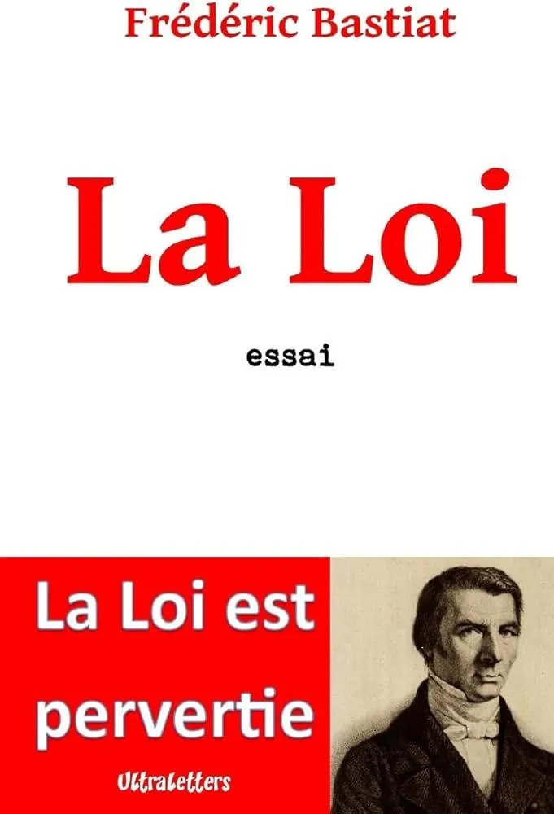

Juhtudel, kui seadus lihtsalt jõustab iga üksikisiku õigusi ja tagab _"üksikisiku õiguse legitiimsele kaitsele kollektiivse korralduse,"_ ei ole keegi positsioonis seda oma kasuks ära kasutada kõigi arvelt, nii et valitsusvorm muutub teisejärguliseks küsimuseks.

Ainult siis, kui seadus ületab oma õiguspärased piirid, muutub seadusandja korrumpeeruvaks. Seejärel viib see raevuka võitluseni erinevate kategooriliste huvide vahel, kõik ihaldavad seadusandlikku aparaati vallutada, et saada privileege, mis on definitsiooni järgi röövellikud.

Bastiat'i sõnul viib sotsialistlik demokraatia püsivasse eelarvepuudujääki ja lõpuks vägivallani. Tõepoolest, väsimatult lubadusi korrutades ja olles võimetu neid täitma, arendab valimismasin meelehärmi, mis loob revolutsioonide jaoks viljaka pinnase. Ta kirjutab:

> Kuid kui valitsus võtab enda peale ülesande tõsta ja reguleerida palku ning ei suuda seda teha; kui ta võtab enda peale ülesande aidata kõiki õnnetusi ja ei suuda seda teha; kui ta võtab enda peale ülesande pakkuda pensione kõigile töötajatele ja ei suuda seda teha... kas me ei näe, et iga pettumuse lõpus, ohh! tõenäoliselt, on samuti vältimatu revolutsioon? ([_Seadus_](http://bastiat.org/fr/la_loi.html))

Bastiat'i järeldus:
Vaadake maakera. Millised on õnnelikumad, moraalsemad ja rahumeelsemad rahvad? Need, kus Seadus sekkub kõige vähem eraelu; kus valitsuse mõju on kõige vähem tuntav; kus individuaalsusel on kõige rohkem vastupanuvõimet ja avalikul arvamusel kõige rohkem mõju; kus administratiivsed mehhanismid on kõige vähem ja kõige vähem keerulised; maksud kõige vähem koormavad ja kõige vähem ebavõrdsed; rahva rahulolematus kõige vähem esile kutsutud ja kõige vähem õigustatud; kus üksikisikute ja klasside vastutus on kõige aktiivsem ja kus seetõttu, kui moraal pole täiuslik, püüdleb see paratamatult iseennast parandama; kus tehingud, kokkulepped, ühendused on kõige vähem takistatud; kus töö, kapital ja rahvastik kannatavad kõige vähem kunstlike nihete all ([_Seadus_](http://bastiat.org/fr/la_loi.html))

## Kapitalismi marksistlik kriitika

<chapterId>16c82521-7c51-5d84-b660-0b358447e3bd</chapterId>

19. sajandil tekkis kapitalismi, eriti marksistliku kriitika, kriitika.

Mis kasu on õigusest rääkida, kirjutada ja hääletada, hüüatas Marx, kui igapäevane elu on ellujäämise võitlus? Teatud piirist alates võrdub vaesus orjusega. Sotsiaalne kord toob kasu kõigile ainult siis, kui rakendatakse kaupade õiglase jaotamise põhimõtet. Just see liberalismi kriitika viis Marxi mõttele vajadusest ratsionaalse ja planeeritud sotsiaalse korra kontrolli järele. Edaspidi peab liberaalide minimaalne riik asenduma tugeva riigiga, mis suudab luua tõelist võrdsust, mis Marxi sõnul ulatub eraomandi kaotamiseni ja selle kollektiviseerimiseni. Leebemas versioonis, "sotsiaaldemokraatias", palutakse riigil tagada mitte ainult inimese abstraktsed õigused, vaid ka konkreetsed inimõigused. Loodakse uued õigused, sotsiaalsed ja majanduslikud õigused, mida riik tagab: õigus tööle, õigus eluasemele, õigus tervishoiule (tasuta), õigus haridusele (tasuta).

### Riigi erapooletuse müüt

Marxi fundamentaalne kriitika poliitilise liberalismi suhtes, eriti tema varastes kirjutistes (_Hegeli õigusfilosoofia kriitika_ ja _Juudi küsimusel_), keskendub tsiviilühiskonna ja riigi eraldatusele. Seda kriitikat tuleb mõista tema "Burgessi revolutsiooni" tõlgendamise üldises raamistikus. Just see revolutsioon viib riigi moodustumiseni, mis on eraldatud tsiviilühiskonnast ja mis peaks püüdlema universaalse poole, tähendades ühist huvi, mängides erapooletu vahendaja rolli.

Siiski on kõik see Marxi jaoks vaid petlik välimus. Tegelikkuses ei ole riik muud kui vahend, mille eesmärk on teenida valitseva klassi erihuvisid. Teisisõnu, riik ei ole erapooletu; see ei ole eraldatud tsiviilühiskonnast. Tegelikult on liberaalne riik kahekordse illusiooni paik. Universaalsuse illusioon, nagu me just nägime, ja sellest tulenevalt, emantsipatsiooni illusioon. Tõepoolest, revolutsioon emantsipeeris kodaniku, kehtestades rahva suveräänsuse ja seaduse ees võrdsuse, kuid see vabadus ja võrdsus jäävad puhtalt ideaalseks ja abstraktseks. On vale, ütleb Marx, mõelda nagu Rousseau või Hegel, et inimene realiseerib täielikult oma ratsionaalse olemuse, saades kodanikuks. Tegelikkuses võib inimene saada kodanikuks ja jääda siiski ärakasutatuks, orjastatuks, kapriiside meelevalda, isekuse anarhiasse ja tugevaima seaduse alla.

Kodaniku emantsipatsioon, Marxi sõnul, ei tähenda sugugi inimese emantsipatsiooni, nagu 1789. aasta deklaratsioon vihjab, vaid pigem hävitava individualismi ja seega ebavõrdsuse triumfi. Vabadus kui võim teha kõike, mis ei kahjusta teisi, inimõiguste nurgakivi, on puhtalt negatiivne vabadus, mis ei loo suhet inimeste vahel, vaid vastupidi, soodustab nende eraldatust, antagonismi ja lõpuks nende orjastamist. Inimõiguste vabadus on formaalne vabadus.

See poliitiline illusioon liberalismist on religioosse illusiooni ilmalik külg, lisab Marx. Valem on tuntud: "religioon on rahva oopium." Religioon on lohutus, see pakub eufooriat ja lubab emantsipatsiooni teispoolsuses. Kuid see juhib inimest eemale tema tõelisest emantsipatsioonist siin maapeal. Kodakondsus on, võrreldes töölise tegevusega, nagu Jumala riik võrreldes õnnetu eksistentsiga siin maa peal. See ei realiseeru kunagi. See kahekordne eraldatus kujutab endast kahekordset võõrandumist, tähendades inimese inimlikkuse mittetäitmist või tema kujuteldavat saavutust.

### Majanduslik võõrandumine

Tegelikult, Marx'i ja ajaloolise materialismi kohaselt, on majanduslik võõrandumine poliitilise võõrandumise ning samuti usulise võõrandumise juur. Majanduslikus võõrandumises, mis on kapitalismi (määratletud kui tootmisvahendite eraomand) tulemus, on töötaja sunnitud müüma oma tööjõudu kui kaupa. Lisaks on ta ilma jäetud oma töö viljast, mis kuulub tööandjale. Ta on seega võõrandunud, tähendades eraldatud iseendast, kuna tema töö muutub talle võõraks, mida ta teeb jõuga, ellujäämiseks. Ometi on töö Marx'i jaoks inimliku tegevuse kvintessents, see, mille kaudu inimese olemuse tuum, nimelt vabadus, realiseerub. Seetõttu tähendab töö vabastamine ka inimese taastamist tema väärikusesse ja inimlikkusesse.

Polüitiline revolutsioon on seega illusioon, tema sõnul, niikaua kui see ei käi käsikäes majandusliku ja sotsiaalse revolutsiooniga, mis suudab vabastada inimese kapitalistlikust orjusest ja seeläbi saavutada ühtsuse töötaja ja kodaniku, ühiskonna ja riigi, era- ja avaliku sfääri vahel. Kodaniku formaalne vabadus ja võrdsus muutuvad seega reaalseks, klassideta ühiskonnas.

## Austria Kriitika Marxismi Suhtes

<chapterId>f05dae71-c478-5de1-996e-1b7b4255d373</chapterId>

Austria Majanduskool, mille asutas Carl Menger 19. sajandi lõpus, oli Karl Marx'i teooriatele algusest peale vastu.

### Klassivõitlus

Austria majandusteadlased lükkavad tagasi Marxistliku klassivõitluse mõiste, mille kohaselt kapitalistliku klassi ja töölisklassi vaheline konflikt oleks vältimatu ja oleks sotsiaalse muutuse mootoriks.

**Kõik sotsiaalne muutus on võimalik ainult üksikisikute tegevuse kaudu, mitte abstraktsetest sotsiaalsetest jõududest nagu klassid.**

Austriakad väidavad, et ühiskond ei ole jagatud kaheks antagonistlikuks klassiks, vaid koosneb erinevate huvide ja vajadustega isikutest. Nad rõhutavad, et majandussuhted üksikisikute vahel on üldiselt vastastikku kasulikud, mitte ekspluateerivad.

Näiteks palkab tööandja töötaja, sest ta vajab tema oskusi toote või teenuse tootmiseks, mida tarbijad soovivad. Töötaja omakorda nõustub tööga, sest ta vajab sissetulekut oma vajaduste rahuldamiseks. See suhe on vastastikku kasulik, mitte konfliktne.
Ludwig von Mises rõhutas, et Marx ei suutnud eristada, mis kuulub kodanliku ideoloogia juurde inimõigustes ja mida need praktikas tähendavad, milliseid ümberkorraldusi need toovad kaasa sotsiaalses elus. Paljud inimõiguste kriitilised mõtlejad on teinud sama vea. See kehtis ka vasturevolutsionääride, nagu Joseph de Maistre või Louis de Bonald puhul.

_The Ethics of Liberty_ ja _Anatomy of the State_ raamatutes selgitas Murray Rothbard, et ekspluateerimine on mõistetav ainult kui rünnak eraomandi vastu ja et ainult riik saab oma tulusid läbi agressiooni, see tähendab maksustamise, võla, raha trükkimise ja seeläbi inflatsiooni kaudu. Tegelikkuses on just riigi sekkumine, mitte klassivõitlus, vägivalla ja konfliktide allikas ühiskonnas. Riik, omastades ressursse ja reguleerides majandust, loob moonutusi ja ebaõiglust, mis viib konfliktide ja repressioonideni. Ekspluateerimise lõpetamine nõuab seega röövelliku kasti - riigi - võimu vähendamist.
Sellel teemal vaata ka: _Marxistlik ja Austria klassianalüüs_, Hans Hermann Hoppe, Journal of Libertarian Studies, Vol IX No. 2, Sügis 1990. [Tõlkinud François Guillaumat](https://fr.liberpedia.org/L%E2%80%99analyse_de_classe_marxiste_et_celle_des_Autrichiens). Lisatud peatükina teosesse _The Economics and Ethics of Private Property_ (Boston: Kluwer Academic Publishers, 1993).

### Polülogism

Klassivõitluse kontseptsioon võib viia ka mõtteni, et kõik on lubatud. Marx väitis, et headuse, kurjuse, õigluse, õiguse, tõe mõisted on klassiti suhtelised. Inimlik mõistus, tema sõnul, on kaasasündinult võimetu tõde leidma. Mõtte loogiline struktuur erineb sõltuvalt sotsiaalsetest klassidest. Universaalselt kehtivat loogikat ei ole olemas.

Mises lõi termini "polülogism", et selgitada seda sofismi. "Polü" tähendab paljusid ja "logism" viitab ratsionaalsele diskursusele ja loogikale. Marxi järgi oleks olemas mitu üksteisega kokkusobimatut loogikat, proletariaadi oma ja buržuaasia oma.

Ometi kuni 19. sajandi keskpaigani ei julgenud keegi vaidlustada asjaolu, et mõtte loogiline struktuur oli identne ja ühine kõigile inimolenditele. Kõik inimsuhted põhinevad eeldusel, et loogilise struktuuri on ühtne. Inimesed saavad arutelus osaleda, sest nad saavad pöörduda millegi poole, mis on ühine kõigile, nimelt mõistuse loogilise struktuuri poole.

Mises kirjutab:
Marx ja marksistid (...) on õpetanud, et mõtlemist määrab mõtleja klassiolukord. Mõtteprodukt ei ole tõde, vaid ideoloogiad. Marksistlikus filosoofias tähendab see sõna klassi isekate huvide maskeeringut, kuhu mõtlev isik kuulub. Seetõttu on mõttetu arutada midagi inimestega teisest sotsiaalsest klassist. Ideoloogiaid ei pea lükkama ümber deduktiivse põhjendusega; neid tuleb paljastada, denuntseerides nende autorite klassiolukorda, sotsiaalset tausta. Seega marksistid ei arutle füüsikateooriate vooruste üle; nad lihtsalt paljastavad füüsikute buržuaalse päritolu. (_The Omnipotent Government_).

Marksistide silmis on Ricardo, Freud, Bergson ja Einstein ekslikud, sest nad on buržuaad. Seega väidavad marksistid, et mõtte loogiline struktuur oleks erinev sõltuvalt klassikuuluvusest. Igal klassil oleks oma loogika ja seega oma majandus, matemaatika, füüsika jne. Ainsad loogika ja ainsad täpsed, õiged ja igavesed teadused oleksid marksistide omad.

Sellepärast ütles Georges Sorel, kes tõi marksismi Prantsusmaale, et vägivald on kasulik, eeldusel, et see on "proletariaadi" oma. Pole üllatav, et sama põhjendust leidub ka Lenini ja seejärel Trotski kirjutistes. Kuna klassikaline moraal ja seadus on valitseva klassi leiutised, on kõik lubatud.

### Töö ja Kasum

Austria koolkond väidab, et Marxi tööjõu väärtusteooria, mille kohaselt kauba väärtus määratakse tootmiseks vajaliku töö hulga järgi, on ekslik. Nad väidavad, et väärtus on subjektiivne ja määratud tarbija eelistuste, mitte tootmiskulude järgi.

Eugen von Böhm-Bawerk, üks varajastest Austria majandusteadlastest, kritiseeris oma teoses _Wert, Kapital und Zins_ (1886) Marxi tööjõu väärtusteooriat. Böhm-Bawerk väitis, et Marxi teooria põhineb fundamentaalsel eksimusel, nimelt eeldusel, et kõik tööühikud on identsed. Tegelikkuses, väitis ta, on mõni töö raskem või produktiivsem kui teine, ja just see määrab kauba väärtuse. Kasumi teooriat puudutades väitis Marx, et kasum on varguse vorm. See on ekspluateerimise kontseptsioon, mille kohaselt kapitalistid saavad töölistelt ebaõiglaselt lisaväärtust. Austria majandusteadlased lükkavad selle idee ümber, väites, et palgad määratakse töötajate ettevõttele toodud väärtuse järgi ja et kasumid on preemia ettevõtjatele, kes võtavad riske ja investeerivad tõhusalt. Kasum on seega preemia ettevõtjale, kes võtab riske ja investeerib uutesse toodetesse ja protsessidesse.
Friedrich Hayek arendas kasumiteooriat, mis põhineb ebakindluse kontseptsioonil, mis on märkimisväärselt juurdunud Jean-Baptiste Say töös. Hayeki sõnul teenivad ettevõtjad kasumit, kuna nad suudavad paremini ennustada tarbijate tulevikuvajadusi kui teised majandusosalised.

### Majandusarvutuste Võimatus

Marksistid usuvad, et sotsialism, majandussüsteem, milles tootmisvahendid kuuluvad ja on tööliste kontrolli all, on paratamatult kapitalismist üle. Austria majandusteadlased seevastu väidavad, et sotsialismi on praktikas võimatu saavutada, kuna see nõuaks ebarealistlikku keskplaneerimise astet.

Juba 1922. aastal oma raamatus _Sotsialism_ näitas Ludwig von Mises, et sotsialism viiks laialdaste puudusteni, kuna keskplaneerijad ei suudaks ilma turu poolt pakutava hinnasüsteemita teha täpseid majandusarvutusi.

## Tee Orjusesse

<chapterId>3f92f346-3062-5f76-8c54-3a9075e2b030</chapterId>

Valitsussekkumise suurenemisest Lääne demokraatiate majandustes häirituna kirjutas Hayek _Tee Orjusesse_ kui filosoofilise kriitika kollektivismi vastu, olgu see siis parem- või vasakpoolne. Tänu _Reader’s Digest_'ile mitme miljoni eksemplari tiraažis avaldatud raamat on suuresti kaasa aidanud Hayeki kuulsusele Ameerika Ühendriikides.

### Kollektivismi Ahvatlus

Kirjutatud aastatel 1940 kuni 1943, on see lühiessee eesmärgiks anda esialgne hinnang 1930. aastate teisel poolel katsetatud dirigistlikele eksperimentidele: rahvastamistele ja Keynesi nõudluse juhtimisele, mis leidis koha sotsiaaldemokraatlikus Euroopas ja New Deali Ameerikas. Pühendatud "kõikide parteide sotsialistidele", püüab see näidata, et "Lääs on järk-järgult loobunud majandusvabaduse põhimõttest, ilma milleta pole varem olnud võimalik ükski individuaalne või poliitiline vabadus."
Tõepoolest, poliitilise tsentraliseerimise sama protsess ja sama soov asendada dirigistlik organisatsioon turu traditsiooniliste mehhanismidega leidub kõikjal. Nii Suurbritannias kui ka Ameerika Ühendriikides väidetakse, et avalik võim peab kõike planeerima ja suudab kõike lahendada.

Autentse liberalismi puhul on mure õigluse pärast. Kuid Hayek meenutab meile, et see solidaarsus kuulub tsiviilühiskonnale, mitte riigile korraldada. Liberalismi ja sotsialismi eristavad mitte eesmärgid, vaid vahendid. Hayeki sõnul,

> Liberalism soovib, et me kasutaksime konkurentsi jõude inimjõupingutuste koordineerimise vahendina võimalikult hästi; see ei taha, et me jätaksime asjad nii nagu need on.
> Sellepärast, lisab Hayek, on riigil eitamatu tegevusvaldkond:
> Luua tingimused, kus konkurents oleks võimalikult efektiivne, asendada see seal, kus see ei saa efektiivne olla, pakkuda teenuseid, mis on sellist laadi, et kasum, Smithi valemile toetudes, ei suuda katta kulusid ühelegi grupile.

Vastupidi, majanduse ja ühiskonna üldine planeerimine, sotsialismi olemus, on suunatud konkurentsi vastu iseenesest. Siiski, Hayeki sõnul on sotsialismi eesmärkide (sotsiaalne õiglus, võrdsus ja turvalisus) ja sotsialismi poolt nende saavutamiseks ette nähtud vahendite (eraomandi kaotamine, tootmisvahendite kollektiviseerimine, planeeritud majandus) vahel vastuolu.

### Sotsialismi juured natsismis

Esimestest lehekülgedest alates loob Hayek paralleeli läänes valitsevate sotsialistlike ideaalide triumfi ja totalitaarsete utoopiate samaaegse edu vahel.

> Vähesed inimesed, hoiatab ta oma eessõnas, on nõus tunnistama, et fašismi ja natsismi tõus ei olnud reaktsioon eelmise perioodi suundumustele (...), vaid nende suundumuste paratamatu tulemus. See on midagi, mida enamik inimesi on keeldunud nägemast, isegi hetkel, kui nad mõistsid sarnasust, mida pakkusid teatud negatiivsed jooned kommunistliku Venemaa ja natsi-Saksamaa kodurežiimides. Tulemuseks on, et paljud inimesed, kes peavad end väga kõrgel natsismi kõrvalekallete suhtes ja kes siiralt vihkavad kõiki selle ilminguid, töötavad samal ajal ideaalide nimel, mille teostumine viiks otse selle vihatud türanniani.
> Hayeki sõnul jagavad sotsialism ja natsism mitmeid fundamentaalseid ühisjooni, eriti individualismi ja turu spontaanse korra tagasilükkamist. Mõlemad ideoloogiad eelistavad grupi heaolu üksikisikute õiguste ja vabaduste ees ning püüavad luua ühiste väärtuste ja eesmärkidega ühtset ühiskonda. Ei sotsialistid ega natsid kõhkle kasutamast jõudu ja sundi oma eesmärkide saavutamiseks. Nad on valmis allasuruma individuaalseid vabadusi ja maha suruma eriarvamusi ühiskonna suurema hüve nimel.
> Peatükis "Sotsialismi juured natsismis" osutab Hayek, et natsism nõuab sotsialistlikku planeerimist (seega selle nimi, rahvussotsialism) majanduses kui vahendit täieliku kontrolli kehtestamiseks elanikkonna üle.

Saksa ja Itaalia sotsialistid lihtsalt sillutasid teed natsismile, luues poliitilised parteid, mis suunasid kõiki üksikisiku tegevusi sünnist surmani, dikteerides nende arvamusi kõige kohta. Mitte fašistid, vaid sotsialistid hakkasid esimesena lapsi poliitilistesse organisatsioonidesse rühmitama, kontrollima nende eraelu ja mõtteid.

Natsid võtsid lihtsalt omaks juba marksistide poolt populariseeritud riikliku, dirigistliku ja sekkumist nõudva diskursuse. Paljud fašistlikud liidrid, nagu Mussolini Itaalias, Laval Prantsusmaal ja Oswald Mosley Suurbritannias, alustasid oma poliitilist karjääri vasakpoolsete aktivistidena enne fašismi või hitlerismi pöördumist ideoloogilise läheduse tõttu.

Kokkuvõttes kutsub Hayek oma kaasaegseid pöörama selga "hullusele" ja "kaasaegsele obskurantismile", et vabastada inimkond "vigadest, mis on domineerinud meie eludes hiljutises minevikus." Tema sõnul on vabaduse parim tagatis eraomand. Kui kõik tootmisvahendid on koondatud mõne korraldaja kätte, allume me täielikule võimule, sest see majanduslik võim muutub poliitiliseks kontrollivahendiks meie kogu elu üle.

# Heaoluriigi tõus 20. sajandil

<partId>49e581cb-3dca-5f10-ac34-5b4cbd3d7c36</partId>

## Keynesi triumf

<chapterId>f40fc495-bcf7-5b7a-95ad-3a3ccba3e3ba</chapterId>

Kapitalismi süüdistatakse tihti käskluses: "me peame alati rohkem tootma," või valemis: "tarbimine on hea majanduskasvuks." Siiski, need ideed ei pärine traditsioonilisest kapitalismist, vaid Keynesianismist, mis on domineerinud majandusteaduse valdkonnas ja poliitilises klassis alates 1930ndatest.

### 1929. aasta kriisi analüüs

1936. aastal avaldatud raamat, mille autoriks on John Maynard Keynes: _Üldteooria tööhõive, intressi ja raha kohta_, pühkis kõik enda teelt. Küsitledes Suure Depressiooni põhjuseid ja viise sellest väljumiseks, kirjeldab ta uut majandusparadigmat, mis muudaks majandusteadlaste ja poliitikute põlvkondi.

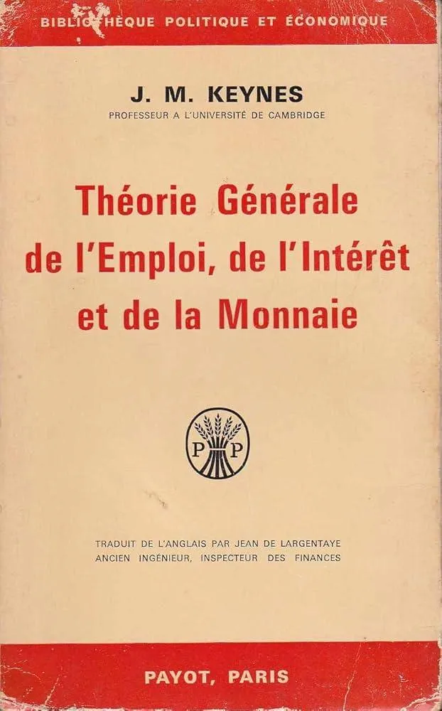

Laias laastus kokku võttes, avalikud kulutused toodavad kasvu ja eelarvepuudujäägi toetamiseks tuleb rakendada madalate intressimäärade rahapoliitikat. Nii alguses avaliku kulutamise diskretsiooniline suurendamine avaldaks majandustegevusele kordistavat mõju, võimeline piirama langust ja kiirendama taastumist. Seejärel teises faasis käsitletaks raha kui majanduspoliitika vahendit, mida avalik võim peaks kasutama makromajandusliku stabiliseerimise eesmärgil.

Keynesianism on seega väide, et avaliku kulutamise ja tarbimise kaudu on võimalik tagada tugev kasv ja täielik tööhõive. Ja see kasvuplaan põhineb raha kontrollil.

Tõepoolest, Keynesi sõnul on pikaajalised säästud tarbimisele ja seega kasvule piduriks. Seega peab raha aja jooksul kaotama oma ostujõu, et julgustada inimesi üha rohkem ja kiiremini tarbima, mis on majandusele hea. Keynesi stiimulipoliitika loogikas on peamine vaenlane säästmine.

Keynesi sõnul võib seda vaenlast võidelda madala intressiga likviidsusega. Seetõttu peavad keskpangad raha monopoliseerima ja kontrollima.

Keynesiga sai 20. sajandist usalduse sajand ekspertide ja planeerimise vastu. Sotsiaalinsenerid valitsuse ja rahapoliitika roolis saavad tõmmata kangid, mis on mõeldud jõukuse taastamiseks, kuna neil on makro-majanduslik maailmavaade.

### Keynesi vastuoluline pärand

Keynesi jaoks on riigi sekkumine vajalik nõudluse stimuleerimiseks ja majandusmootori taaskäivitamiseks. See doktriin on võidutsenud ülikoolides ja õpikutes. Siiski on riigi sekkumisel oma puudused ja see võib pikas perspektiivis kriise süvendada nende lahendamise asemel.

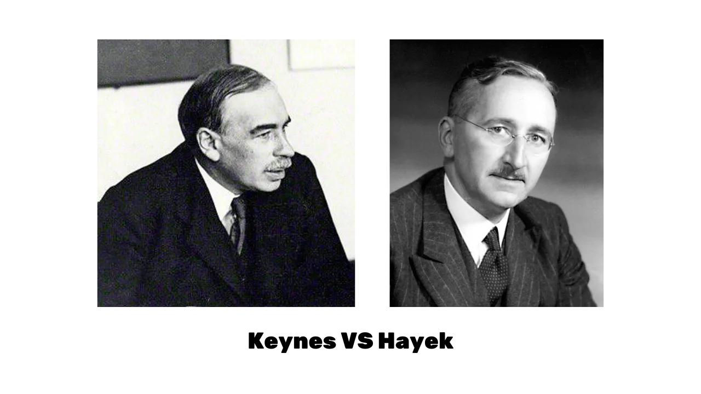

Seetõttu kritiseerivad mõned majandusteadlased, kes on vähemuses, Keynesi lühiajalisuse pärast ja pooldavad turumehhanismidele naasmist kui paremat alternatiivi riigi sekkumisele.
Nii selgitas Friedrich Hayek, et keskpankade pidev intressimäärade vähendamine ja kunstliku krediidi laiendamine võib ainult eksitada majandustegelasi, pannes neid investeerima nagu oleks palju säästetud ressursse olemas (kuna intressimäärad loomulikult vähenevad vastusena säästude suurenemisele). See ressursside vale jaotamine siis toidab kunstlikku kasvu tõusu, mulli, millele järgneb järsk langus. Just see panus tsükliteooriasse tõi Hayekile 1974. aastal Nobeli majanduspreemia.
Koos teistega tõi ta esile ka keskse ja manipuleeriva valuuta ohtlikkuse. Seda tegi märkimisväärselt prantslane Jacques Rueff, samuti Ludwig von Misesi jünger ja sõber.

Lõpetades École Polytechnique'i 1919. aastal, oli Rueff kõrge riigiametniku karjääri jooksul majandusnõustaja mitmetele valitsustele 1920ndatel ja 30ndatel. Tema peateos ilmus 1945. aastal: _L’ordre social_ (Sotsiaalne kord), milles ta arendab välja veenva argumendi vaba turu kasuks majanduslikust, filosoofilisest ja moraalsest vaatenurgast.

See raamat sisaldab võtmepeatükki pealkirjaga: "Terve raha või totalitaarne riik". Selles peatükis arendab ta kahte väidet. Esimene: "Vale raha toob kaasa sotsiaalse korra häire". Teine väide tuleneb esimesest: "Sotsiaalne korra häire toob kaasa sotsiaalse orjuse". Vale raha on paberraha, mis on lahti ühendatud igasugusest füüsilisest reaalsusest ja mida manipuleerib valitsev võim. Sotsiaalne korra häire on sellest tulenev inflatsioon ja tarbimine. Sotsiaalne orjus on ühiskonna sõltuvus riigist, kõigi finantsiliste, moraalsete ja poliitiliste autonoomiate kaotus.

1947. aastal, viis aastat pärast _The General Theory_ prantsusekeelset tõlget, avaldas ta artikli pealkirjaga: _The Errors of the General Theory of Lord Keynes_. Ta andis järgmised hoiatused:
      On tõenäoline, et järgmine depressiooniperiood viib Lord Keynesi poolt soovitatud poliitika laialdase rakendamiseni üle maailma. Ma ei karda eksida, öeldes, et see poliitika vähendab töötust vaid vähesel määral, kuid sellel on sügavad tagajärjed riikide arengule, kus seda rakendatakse. (...) Lord Keynesi tõttu saab järgmisest tsüklist sügavate poliitiliste muutuste võimalus, mida mõned loodavad, samas kui teised kardavad. Igatahes, valel teoorial põhinevad abinõud, mida rakendatakse, omavad sügavalt erinevaid tagajärgi nendest, mida oli kavatsetud edendada. Nende ebatõhusus on suure osa avaliku arvamuse jaoks uus põhjus nõuda režiimi asendamist, mis, eitades ennast, on ennast hävitanud.
      Alates 1958. aastast viiakse Jacques Rueffi poolt inspireeritud Prantsuse majanduse korrigeerimise poliitikat läbi kindral de Gaulle'i autoriteedi all. See viib kuulsa "Trente Glorieuses'i" (Kolmkümmend Hiilgavat Aastat) saavutamiseni.

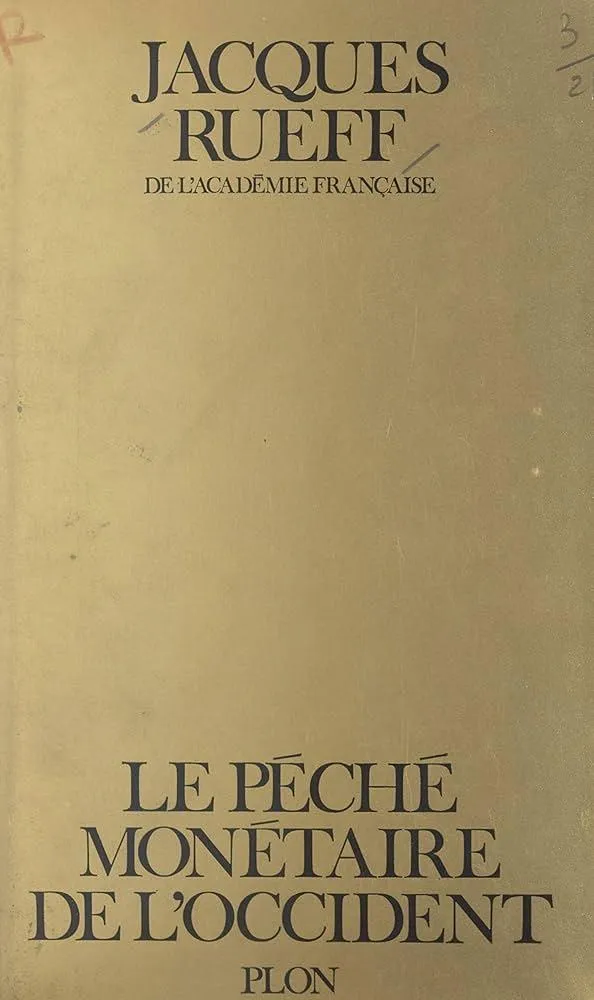

_Teoses "Lääne rahanduslik patt"_ 1971. aastal kirjutab Rueff:

> See on eelarvepuudujäägi kaudu, et inimesed kaotavad oma vabaduse.

Ta lisab: "Inflatsioon on kulutuste subsideerimine, mis ei too midagi sisse rahaga, mida ei eksisteeri." Tema sõnul: "Vaadeldes rahvusvahelise rahandussüsteemi arengut, võiks arvata, et Lääs rakendab Lenini nõuannet, mille kohaselt: Bourgeois režiimi hävitamiseks piisab selle valuuta korrumpeerimisest.

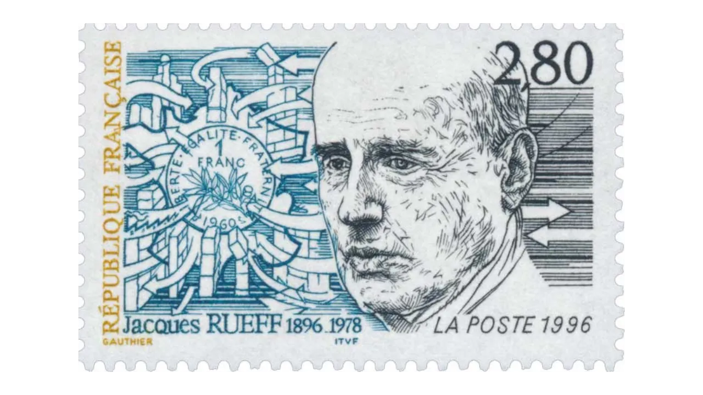

1976. aastal ründab ta viimast korda Keynesianismi artiklis ajalehele _Le Monde_.
      Ükski religioon pole maailmas nii kiiresti levinud kui tööhõive usk. Ajendatuna töötuse tragöödiate mälestusest, mis laastasid Inglismaad ja Saksamaad 1920. aastatel, on see saanud peaaegu iga riigi majanduspoliitika väljendatud või mõistetud põhimõtteks. Peites oma eesmärki nutika ja petliku "üldteooria" varju all, mille entusiastlikud ja pimedad jüngrid on tõstnud valitsuste tegevuse piibli staatusesse, on see varjanud inflatsioonipoliitikate tõelist palet, mida see kattis. Selle kaudse tee kaudu on see andnud hea südametunnistuse valitsustele, mis, olles ammendanud oma maksustamise ja laenamise võimalused, pöördusid rahaloomise petlike naudingute poole. (_Keynesia ajastu lõpp ehk: Millal pikk jooks otsa sai_, Euromoney, aprill 1976, lk 70-7.)

## Kullastandardist loobumine

<chapterId>f52da9ae-c4bc-5d1a-8fd0-8fcae5948e34</chapterId>

Raha on vahend, mis on võimaldanud inimestel liikuda kaupade vahetamisest kaugemale, säästa ja koordineerida suurel määral turu kaudu. See on teinud võimalikuks tööjõu spetsialiseerumise, võrdlevad eelised, kaubandusest saadavad kasud, majandusliku arvestuse. Ilma rahata pole kaasaegset tsivilisatsiooni.

### Kuld kui globaalne standard

Ja selgub, et teatud raha vorm on järk-järgult eristunud teistest, et saada sajandite jooksul globaalseks referentsstandardiks, milleks on kuld.

Tõepoolest, kuld on raske valuuta, mida on raske toota, kallis võltsida. Turg on valinud kulla kõige usaldusväärsemaks, kõige vastupidavamaks ja vähim manipuleeritavaks valuutaks. Ajalugu näitab, et kui inimesed saavad valida kasutatava valuuta, eelistavad nad tavaliselt kulda.

Sellepärast kirjutab Ludwig von Mises teoses _Inimtegevus_:

> Kullastandard oli kapitalistliku ajastu maailmastandard, kasvava jõukuse, vabaduse ja demokraatia ajastu \[…\] See oli rahvusvaheline standard, mida rahvusvaheline kaubandus ja maailma kapitaliturud vajasid \[…\] See viis tööstuse, kapitali ja Lääne tsivilisatsiooni planeedi kõige kaugematesse nurkadesse, luues varem tundmatut rikkust.
> Kuid kullastandard piirab valitsusi oma kulutuste rahastamisel maksude kaudu, mitte inflatsiooni kaudu, mis selgitab teatud vaenulikkust poliitiliste ja majanduseliitide poolt selle süsteemi vastu. Sest valuuta sidumine väärismetalliga piirab keskpankade võimet rahastada heaoluriigi kasvu inflatsiooni kaudu, mis on kaudne maks.
> Seepärast kuulutas Keynes juba 1923. aastal:

> Tõde on see, et kullastandard on juba barbaarne reliikvia. (...) Vana standardi kaitsjad ei märka, kui kaugele see on nüüdseks uue ajastu vaimust ja vajadustest eemaldunud. (J.M. Keynes, _Rahareform_).

### "Nixoni šokk"

Bretton Woodsi süsteem, mis kavandati 1944. aastal ja rakendati täielikult 1959. aastal, põhines nii kullal kui ka dollaril, ainus valuuta, mida sai kullaks vahetada. Seega oli vajalik koguda dollareid, et saada kulda.

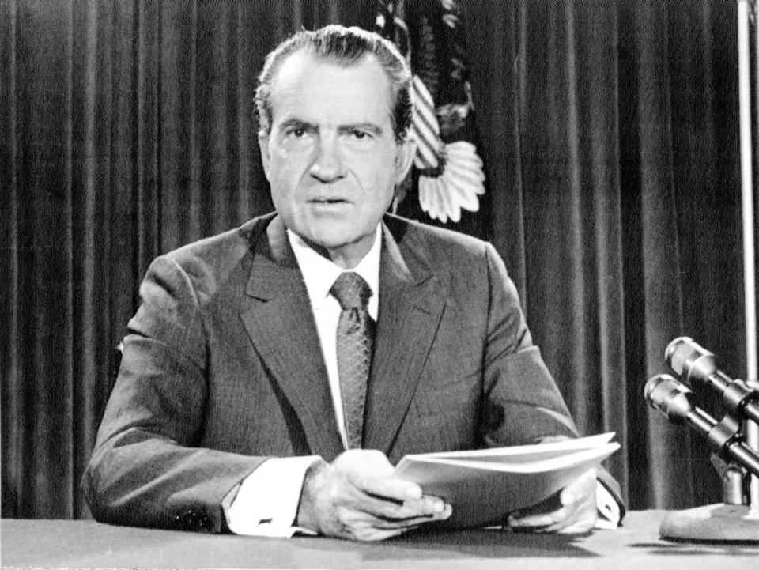
Sel ajal, eriti Vietnamis toimunud sõja ajal, viis USA valitsuse defitsiidi suurenemine paljud välisriigid, sealhulgas Prantsusmaa, soovima oma dollareid FEDis kullaks vahetada. 15. augustil 1971 otsustas president Nixon tühistada dollari vahetatavuse lubaduse kullaks, luues sellega Ameerika Ühendriikide ajaloo esimese täielikult paberil põhineva valuuta. Sellest päevast alates saab dateerida hetke, mil raha täielikult läks keskpankade kontrolli alla. Intervjuus väidetakse, et Richard Nixon on öelnud:

> Me oleme kõik tänapäeval Keynesi järgijad.

Tõepoolest, paljude Keynesi majandusteadlaste jaoks andis kullastandardist loobumine valitsustele vajaliku paindlikkuse majanduskriisidele reageerimiseks või nende ärahoidmiseks.

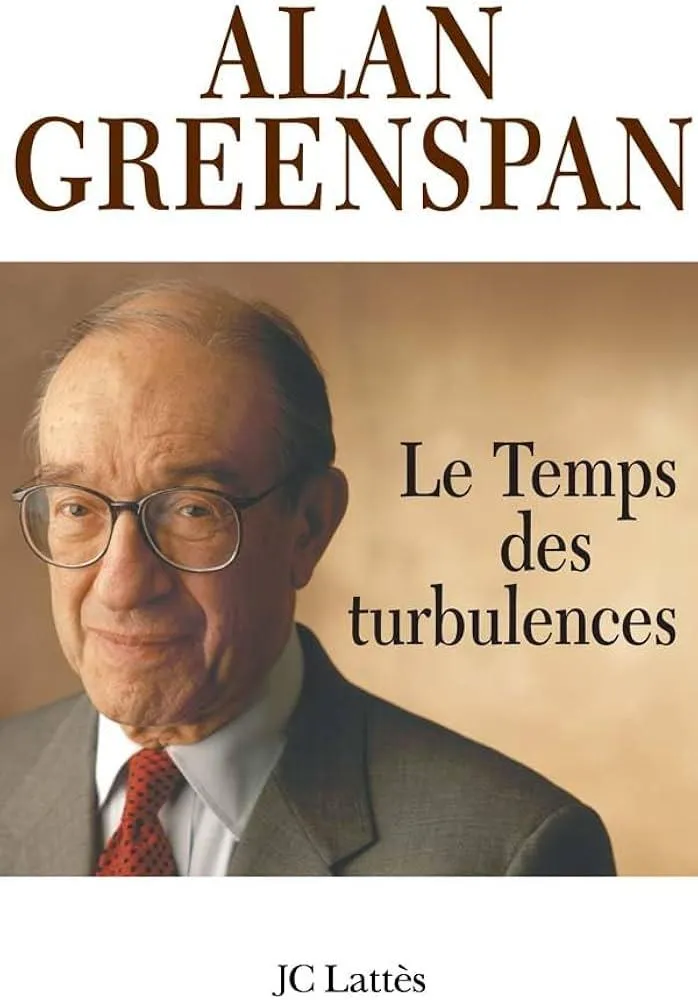

Alan Greenspani, endise FEDi esimehe, Ameerika keskpanga, sõnul on kullastandard riigivõlaga ja heaoluriigi rahastamisega kokkusobimatu:

> Ma olen alati igatsenud hinnastabiilsuse järele, mis on kullastandardi omane; stabiilne valuuta oli selle peamine eesmärk. Kuid ma olen ammu tunnistanud, et kullastandard ei sobitu kergesti valitseva arusaamaga valitsuse funktsioonist, eriti kohustusest tagada sotsiaalkindlustussüsteem. \[…\] Enamik ameeriklasi on inflatsiooni talunud kui hinda, mida maksta kaasaegse heaoluriigi eest. Kullastandardi pooldajaid enam ei ole ja ma näen selle naasmise võimalust vähe. (_The Age of Turbulence_).
> Vastupidi, inimeste nagu Jacques Rueff jaoks on väärtuslike metallide hülgamine viga, mis võib viia ainult ostujõu pideva vähenemiseni, millega kaasneb elatustaseme langus, sissetulekute ebavõrdsuse suurenemine ja kasvav majanduslik ebastabiilsus.
> 

Veebruaris 1965, televisioonis üle kantud pressikonverentsil, oli kindral de Gaulle, kes oli otseselt Rueffist inspireeritud, pakkunud välja naasmise kullastandardi juurde. Ta väitis:

> Kuld, mis ei muuda oma olemust, millel puudub rahvus, mida peetakse igavesti ja universaalselt muutumatu väärtuse etaloniks.

### Riigimonopoolita rahaturg on võimalik

1976. aastal pakkus Hayek välja alternatiivi riigi monopolile valuuta loomisel: valuutade vaheline konkurents. Oma raamatus _Pour une vraie concurrence des monnaies_ (_Raha denatsionaliseerimine_) kujutas ta ette riigimonopoolita rahaturgu, kus eksisteeriks mitu eraõiguslikku valuutat. Erinevate valuutade loomine ja haldamine eraõiguslike üksuste poolt võimaldaks inimestel valida kõige stabiilsema ja usaldusväärsema valuuta, ergutades seeläbi konkurentsi ja distsipliini emiteerijate seas.

Ta kirjutab:

> Niikaua kui me ei ole taastanud olukorda, kus valitsused (samuti muud avalikud asutused) teavad, et kui nad kulutavad liiga palju, ei suuda nad, nagu iga teinegi, oma kohustusi täita, ei peatu see protsess, mis asendades kollektiivse tegevuse eraalgatusega, ähvardab lämmatada individuaalset initsiatiivi. Praeguses piiramatus demokraatias, kus valitsusel on võim anda erilisi materiaalseid hüvesid teatud rühmadele, on see sunnitud ostma piisavalt toetust, et moodustada enamus. (Ch. XXI, Rahanduse ja avaliku kulutamise mõjud).

Hayeki jaoks tuleneb turumajanduse varasem ebastabiilsus asjaolust, et turumehhanismide kõige olulisem regulaator, nimelt raha, ei saanud ise olla turuprotsessi toode.

Hayek uskus, et eraomanduses olevate valuutade vaba turg viiks suurema rahalise stabiilsuseni. Peaaegu 50 aastat hiljem kehastab krüptoraha nagu Bitcoin Hayeki konkurentsivõimelist visiooni, pakkudes detsentraliseeritud alternatiivi keskpankade monopolistlikule süsteemile. Bitcoin, mille emiteerimislimiit on 21 miljonit ühikut, on garantii inflatsiooni ja regulaatorite meelevaldsuse vastu.

## Hinda kursust

<chapterId>6759868f-749d-5fe7-bbb1-24f603e8b34e</chapterId>
<isCourseReview>true</isCourseReview>

## Järeldus: ideede jõud

<chapterId>50676155-c071-5bee-a14e-0c251f0375da</chapterId>
Kriis, mida me läbime, on tsivilisatsiooni kriis, see tähendab intellektuaalne kriis moraalsete, poliitiliste ja majanduslike tagajärgedega.

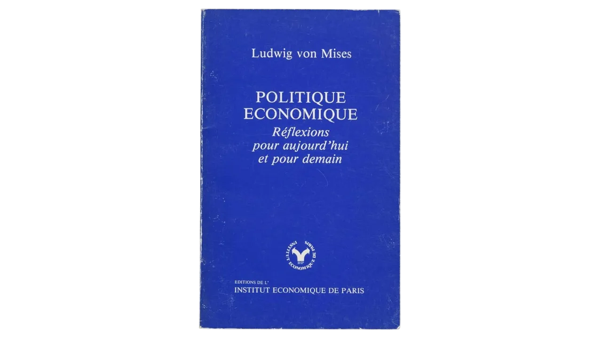

Räägitakse palju poliitika kriisist, parlamendiaristokraatia langusest, esindusvalitsusest ja seeläbi vabadusest. Seda kriisi omistatakse suhteliselt kergesti kapitalismile ja "turgude diktatuurile".

See olukord on tegelikult radikaalse intellektuaalse muutuse ideedes tagajärg. Alates 19. sajandi lõpust on Euroopa loobunud ideedest, mis olid võimaldanud tal saada jõukaks ja valgustatuks kontinendiks. Mõnda aega vastas selle vanim tütar, Ameerika, kollektivismi tuultele enne, kui ka see neisse mattus.

1941. aastal tegi George Orwell selle hinnangu:

> On selge, et vaba kapitalismi ajastu on lõppemas ja et üks riik teise järel võtab omaks tsentraliseeritud majanduse, mida võib nimetada sotsialismiks või riigikapitalismiks, nagu soovite. Selles süsteemis kaob majanduslik vabadus individuaal ja suures osas ka tema üldine vabadus - tegutsemisvabadus, töö valimise vabadus, liikumisvabadus. Alles väga hiljuti oleme hakanud aimama selle nähtuse tagajärgi. Varem ei olnud kunagi ette kujutatud, et majandusvabaduse kadumine võiks mõjutada intellektuaalset vabadust. Tavaliselt arvati, et sotsialism on omamoodi liberalism, millele on lisatud moraal. Riik võtaks enda kanda teie majanduselu ja vabastaks teid vaesuse, töötuse jms hirmust, kuid tal ei oleks vajadust sekkuda teie era intellektuaalellu. Nüüd on tõestatud, et need vaated olid valed.

Kuid vastupidiselt hukatuse prohvetite kuulutustele, ei ole Lääne tsivilisatsioon määratud 21. sajandil kaduma. See ei ole oma potentsiaali ammendanud. Vabadus on veel ees.

Seda vihjas Murray Rothbard 1982. aastal:
Oleme nüüd kogenud kõiki riigismi variante ja need on kõik läbi kukkunud. Kõikjal Lääne maailmas 20. sajandi alguses hakkasid ettevõtete juhid, poliitikud ja intellektuaalid kutsuma üles "uue" segamajanduse süsteemi poole, riigi domineerimise poole, eelmise sajandi suhtelise laissez-faire'i asemel. Uued imerohud, esmapilgul atraktiivsed, nagu sotsialism, korporatiivne riik, heaolu-sõjaseisukorra riik jne, prooviti läbi ja kõik on ilmselgelt läbi kukkunud. Sotsialismi ja riigi planeerimise pooldamise argumendid tunduvad nüüd kui palved vananeva, kurnatud ja läbikukkunud süsteemi eest. Mis jääb proovida, kui mitte vabadus?
Teatud mõttes on meie olukord parem kui minevikus. Pärast mitmesuguste sotsialistlike, kommunistlike ja sotsiaaldemokraatlike eksperimentide järjestikuseid läbikukkumisi teame täna, kuidas eristada tõelisi ideid valedest paremini kui eile. Ja valed ideed saab ümber lükata ja asendada tõestega. Nagu Mises ütles:
Kõik, mis toimub meie globaalses ühiskonnas, on ideede tulemus. Nii heade kui halbade. Vajalik on võidelda valede ideedega. (...) Meie tsivilisatsioon võib ellu jääda, ja see peab ellu jääma. Ja see jääb ellu tänu parematele ideedele kui need, mis täna maailma juhivad; ja need paremad ideed arendab välja tõusev põlvkond.
(_Majanduspoliitika: Mõtteid tänaseks ja homseks_, 1979).
