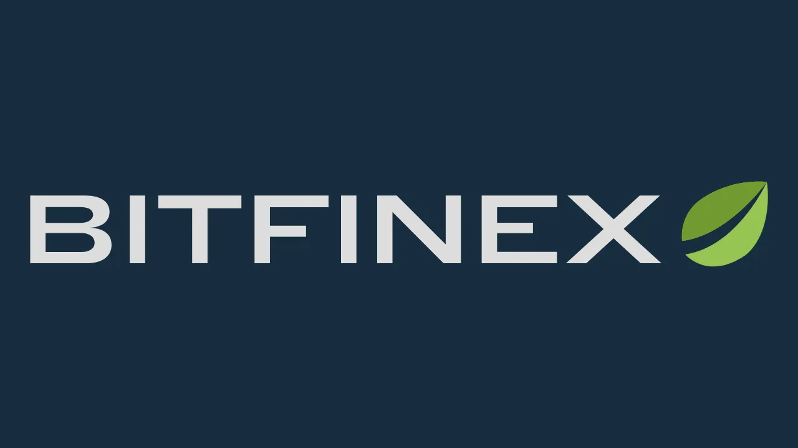
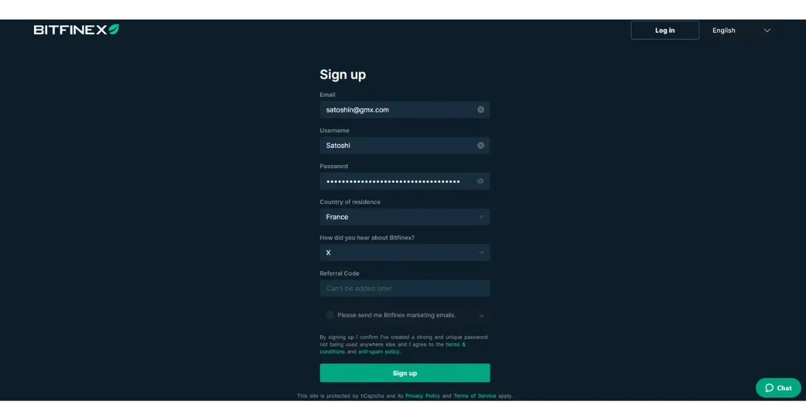

Fondée en 2012, Bitfinex est l'une des premières plateformes d'échange de bitcoin et d'altcoins. Initialement centrée sur des échanges P2P de bitcoins, la plateforme a rapidement élargi ses services pour inclure le trading sur marge, le financement P2P, le trading de produits dérivés, et un marché OTC ("*over-the-counter*") pour les transactions de gros volumes.

Aujourd'hui, Bitfinex est une plateforme complète, permettant aussi bien des achats simples de bitcoins que l'utilisation de fonctionnalités de trading avancées avec des outils de gestion de risque. Elle est accessible en version web, et pour des transactions simples, une application mobile facile à prendre en main est également disponible.

Bitfinex soutient activement le développement de Bitcoin, en investissant dans des technologies comme le Lightning Network et en promouvant des solutions peer-to-peer favorisant la liberté financière.

## Comment acheter du bitcoin sur Bitfinex ?

Pour acheter du bitcoin sur Bitfinex, commencez par [créer un compte sur la plateforme](https://www.bitfinex.com/sign-up/). Assurez-vous d'utiliser un mot de passe unique et fort, c'est-à-dire le plus aléatoire possible, comprenant une grande diversité de caractères et d'une longueur suffisante.

Pour sécuriser vos mots de passe et garantir l'utilisation de mots de passe forts pour vos comptes en ligne, notamment sur Bitfinex, je vous conseille fortement d'utiliser un gestionnaire de mots de passe. Découvrez notre tutoriel sur Bitwarden pour apprendre à l'installer et à l'utiliser au quotidien :

https://planb.network/tutorials/others/bitwarden

Vous pouvez ensuite faire un dépôt avec le moyen de paiement de votre choix puis acheter du bitcoin.

https://youtu.be/z2YlJr9sF20

Vous pouvez également configurer un achat récurrent de bitcoins afin de lisser votre prix d'acquisition dans le temps (*DCA*).

https://youtu.be/8uoBacYSn08

Après l'achat de vos premiers bitcoins, vous avez la possibilité de les laisser sur la plateforme, mais je vous recommande fortement de les transférer vers votre propre portefeuille en self-custody. Si vous ne savez pas encore comment utiliser un portefeuille Bitcoin, je vous invite à explorer [la section "Wallet" sur PlanB Network](https://planb.network/tutorials/wallet).

## Comment sécuriser son compte Bitfinex ?

Après avoir créé votre compte, je vous recommande de le sécuriser en ajoutant un second facteur d'authentification (2FA), soit à l'aide d'une clé physique, soit via une application d'authentification.

https://youtu.be/_Ah34kG6tng

Si vous ne savez pas comment utiliser ces solutions de double authentification pour sécuriser vos comptes en ligne, je vous recommande de consulter notre tutoriel sur l'application Authy :

https://planb.network/tutorials/others/authy

Ou, si vous préférez utiliser une clé physique, vous pouvez consulter notre tutoriel sur Yubikey :

https://planb.network/tutorials/others/security-key

## Comment utiliser les fonctionnalités de trading ?

Enfin, si vous souhaitez utiliser les fonctionnalités plus avancées de trading sur Bitfinex, vous pouvez mettre en place vos propres templates de Trade Desk :

https://youtu.be/byIyWgLGejI

Vous pouvez également créer des sous-comptes afin de ségréguer différentes utilisations de Bitfinex.

https://youtu.be/aOBXgcuJ5fI

