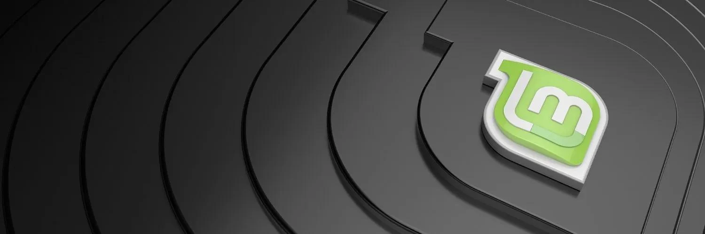

## Hva er galt med å bruke en vanlig datamaskin?

Når du utfører Bitcoin-transaksjoner, er det ideelt om datamaskinen din ikke har skadelig programvare. Åpenbart.

Hvis du holder din Bitcoin seed phrase (vanligvis 12 eller 24 ord) utenfor datamaskinen med en signeringsenhet (f.eks. en hardware wallet – som er dens hovedformål), så kan du tenke at det ikke er så viktig å ha en "ren" datamaskin – ikke sant.

En datamaskin infisert med skadelig programvare kan lese dine Bitcoin-adresser, og eksponere din saldo for en angriper – de kan ikke ta bitcoin bare ved å kjenne adressen, men de kan se hvor mye du har, og beregne ut fra det om du er et verdig mål. De kan også på en eller annen måte finne ut hvor du bor, for eksempel, og utpresse deg ved å true med å skade dine nærmeste.

## Hva er løsningen?

Jeg oppfordrer de fleste Bitcoin-brukere til å bruke en dedikert datamaskin uten skadelig programvare (med internett-tilgang) for å utføre Bitcoin-transaksjoner. Jeg foreslår at folk bruker et åpen kildekode-operativsystem som Linux Mint, men bruk Windows eller Mac hvis du må – det er bedre enn å bruke en vanlig, mye brukt datamaskin som uunngåelig har skjult skadelig programvare i seg.

En hindring folk ofte møter er å installere et nytt operativsystem på slike datamaskiner. Denne guiden er til hjelp for det.

Det finnes mange varianter av Linux, og jeg har prøvd flere. Min anbefaling for Bitcoin-brukere er Linux Mint, fordi det er enkelt å installere, veldig raskt (spesielt ved oppstart og nedstengning), ikke oppblåst (hver ekstra programvare er en risiko), og har sjelden krasjet for meg eller oppført seg merkelig (sammenlignet med andre versjoner som Ubuntu og Debian).

Noen kan være veldig motvillige til et nytt operativsystem, og foretrekker Windows eller Mac OS. Jeg forstår, men Windows og Apple sine operativsystemer er lukket kildekode, så vi må stole på hva de gjør; Jeg tror ikke det er en god politikk, men det er ikke alt eller ingenting. Jeg foretrekker mye heller at folk bruker en dedikert, nylig installert Windows eller Mac OS-datamaskin i stedet for en mye brukt datamaskin (med hvem vet hva av skadelig programvare som har samlet seg på den). Et skritt bedre er å bruke en nylig installert Linux-datamaskin, som er det jeg vil demonstrere.

Hvis du er nervøs for å bruke Linux på grunn av det ukjente, er det naturlig, men det er også naturlig å bruke litt tid på å lære. Det er så mye informasjon tilgjengelig på nettet. Her er en utmerket kort video som introduserer grunnleggende om kommandolinjen som jeg sterkt anbefaler.
Velg en datamaskin

Jeg starter med det jeg tror er det beste alternativet. Deretter gir jeg min mening om alternativene.

Ideelt alternativ:

Min anbefaling, hvis du har råd til det, og hvis størrelsen på din bitcoin-beholdning rettferdiggjør det, er å skaffe en helt ny inngangsmodell laptop. Den mest grunnleggende modellen som bygges i disse dager er god nok for det den skal brukes til. Spesifikasjonene for prosessor og RAM er ikke relevante, fordi de vil alle være gode nok.

Unngå:

- Enhver tabletkombo, inkludert Surface Pro
- Chromebooks – ofte er lagringskapasiteten for lav
- Enhver datamaskin med en eMMC-disk; Hvis den har en SSD-disk, er det perfekt
- Macs – de er dyre, og maskinvaren fungerer ikke godt med Linux-operativsystemer etter min erfaring
- Alt som er oppusset eller brukt (ikke en absolutt deal-breaker, though)

I stedet, se etter en Windows 11 laptop (For øyeblikket er Windows 11 den nyeste utgivelsen. Vi skal bli kvitt den programvaren, ikke bekymre deg.). Jeg søkte på amazon.com etter "Windows 11 Laptop" og fant dette gode eksemplet:

Prisen på denne ovenfor er god. Spesifikasjonene er gode nok. Den har et innebygd kamera som vi kan bruke for QR-kode PSBT-transaksjoner (ellers måtte du kjøpt et USB-kamera for å gjøre det). Ikke bekymre deg for at det ikke er et velkjent merke (det er billig). Hvis du vil ha et bedre merke, vil det koste deg, for eksempel:


Noen av de billigere har bare 64 GB lagringsplass; Jeg har ikke testet bærbare datamaskiner med så lite lagringsplass – det er sannsynligvis OK å ha 64 GB, men det kan være i grenseland.

## Andre alternativer – Tails

Tails er et operativsystem som starter fra en USB-minnepinne og midlertidig tar over maskinvaren til enhver datamaskin. Det bruker kun Tor-tilkoblinger, så du må være komfortabel med å bruke Tor. Ingen av dataene du skriver til minnet under økten lagres på disken (den starter frisk hver gang) med mindre du justerer innstillingene og oppretter et permanent lagringsalternativ (på USB-minnepinnen) – som du låser med et passord.

Det er ikke et dårlig alternativ, og det er gratis, men det er litt klønete for vårt formål. Å installere ny programvare på det er ikke enkelt. En god funksjon er at det kommer med Electrum, men ulempen med dette er at du ikke installerte det selv. Sørg for at USB-minnepinnen du bruker er på minst 8 GB.

Din fleksibilitet reduseres hvis du bruker Tails. Du vil kanskje ikke kunne følge ulike veiledninger for å sette opp det du trenger og få det til å fungere ordentlig. For eksempel, hvis du følger min veiledning for å installere Bitcoin Core, er det nødvendig med modifikasjoner for å få det til å fungere. Jeg tror ikke jeg kommer til å lage en Tails-spesifikk veiledning, så du må bygge dine ferdigheter og gjøre det alene.

Jeg er heller ikke sikker på hvor godt maskinvare lommebøker vil samhandle med dette OS.

Etter å ha sagt alt dette, er en Tails-datamaskin for Bitcoin-transaksjoner et fint tilleggsmulighet, og vil absolutt hjelpe dine generelle personvernferdigheter til å lære å bruke Tails.

## Andre alternativer – Live OS Boot

Dette er veldig likt Tails, bortsett fra at operativsystemet ikke er dedikert til personvern. Den grunnleggende måten å bruke dette på er å flashe en USB-minnepinne med Linux-operativsystemet du foretrekker og få datamaskinen til å starte fra det i stedet for den interne disken. Hvordan du gjør dette forklares senere.

Fordelen er at du er mindre begrenset og ting vil fungere uten avanserte justeringer.

Jeg er ikke sikker på hvor godt et slikt system isolerer skadelig programvare på den eksisterende datamaskinen fra USB-startdisken du bruker som holder det nye operativsystemet. Det gjør sannsynligvis en fin jobb og er sannsynligvis ikke like bra som Tails. Fordi jeg ikke vet, er min preferanse den dedikerte bærbare datamaskinen.
Andre alternativer – Din egen brukte bærbare eller stasjonære datamaskin

Å bruke en brukt datamaskin er ikke ideelt, hovedsakelig fordi jeg ikke kjenner til de indre arbeidene til sofistikert skadelig programvare, eller om det å tørke en disk er tilstrekkelig for å bli kvitt den. Det er sannsynligvis det, men jeg vil ikke undervurdere hvor smarte ondsinnede hackere kan være. Du kan bestemme, jeg vil ikke forplikte meg.

Hvis du velger å bruke en gammel stasjonær i stedet for en gammel bærbar datamaskin, vil dette være greit, bortsett fra at den permanent vil ta opp plass for dine sannsynligvis sjeldne bitcoin-transaksjoner; du bør ikke bruke den til noe annet. Mens med en bærbar datamaskin, kan du bare legge den bort, og til og med gjemme den for ekstra sikkerhet.

## Installere Linux Mint på hvilken som helst datamaskin
Dette er instruksjoner for å slette ethvert operativsystem fra din nye bærbare datamaskin og installere Linux Mint, men du kan tilpasse det for å installere nesten hvilken som helst Linux-versjon på nesten hvilken som helst datamaskin.
Vi skal bruke en hvilken som helst datamaskin til å flashe operativsystemet til en form for minnepinne. Det spiller ingen rolle hvilken minnepinne, så lenge den er kompatibel med en USB-port, og jeg foreslår minimum 16Gb.

Skaff deg en av disse tingene:


Eller du kan bruke noe som dette:


Naviger deretter til linuxmint.com


Hold musepekeren over nedlastingsmenyen øverst og klikk deretter på lenken, “Linux Mint 20.3” eller hvilken som helst versjon som er den nyeste anbefalte på det tidspunktet du gjør dette.


Det vil være noen få “smaker” å velge mellom. Gå med “Cinnamon” for å følge denne guiden. Klikk på nedlastingsknappen.


På neste side kan du bla ned for å se speilene (Speil er forskjellige servere som holder en kopi av filen vi ønsker). Du kan verifisere nedlastingen ved hjelp av SHA256 og gpg (anbefalt), men jeg kommer til å hoppe over å forklare det her siden jeg allerede har skrevet guider om dette.


Velg et speil som er nærmest deg og klikk på lenken (den grønne teksten i speilkolonnen). Filen vil begynne å laste ned – versjonen jeg laster ned er 2.1 gigabyte.

Når den er lastet ned, kan du flashe filen til en bærbar minneenhet og gjøre den oppstartbar. For å gjøre dette, er den enkleste måten å bruke Balena Etcher. Last ned og installer det hvis du ikke har det.

Kjør det deretter:


Klikk på flash fra fil, og velg LinuxMint-filen du lastet ned.

Klikk deretter Velg mål. Sørg for at minneenheten er koblet til og sørg for at du velger riktig stasjon, ellers kan du ødelegge innholdet på feil stasjon!

Etter det, velg Flash! Du må kanskje oppgi passordet ditt. Når det er fullført, vil stasjonen sannsynligvis ikke kunne leses av din Windows- eller Mac-datamaskin fordi den har blitt transformert til en Linux-enhet. Bare trekk den ut.
Forbereder måldatamaskinen

Slå på den nye bærbare datamaskinen, og mens den starter opp, hold nede BIOS-tasten. Dette er typisk F2, men det kan være F1, F8, F10, F11, F12 eller Slett. Prøv hver enkelt til du får det til, eller søk på internett etter datamaskinens modell og still det riktige spørsmålet.

F.eks. “BIOS-tast Dell bærbare datamaskiner”.

Hver datamaskin vil ha en forskjellig BIOS-meny. Utforsk og finn hvilken meny som lar deg konfigurere oppstartsrekkefølgen. For vårt formål ønsker vi at datamaskinen skal prøve å starte fra en USB-tilkoblet enhet (hvis det er en tilkoblet), før den prøver å starte fra den interne harddisken (ellers vil Windows laste). Når du har satt det, må du kanskje lagre før du avslutter, eller det kan lagre automatisk.

Start datamaskinen på nytt, og den skal laste fra USB-minneenheten. Vi kan nå installere Linux på den interne disken, og Windows vil bli fjernet for godt.

Når du kommer til følgende skjerm, velg “OEM install (for produsenter)”. Hvis du i stedet velger “Start Linux Mint”, vil du få en Linux Mint-økt lastet fra minneenheten, men når du slår av datamaskinen, blir ingen av informasjonen din lagret – det er i hovedsak en midlertidig økt slik at du kan prøve det ut.
Du vil bli tatt gjennom en grafisk veiviser som vil stille deg en rekke spørsmål som burde være greie. Ett vil være språkinnstillinger, et annet vil være din hjemme internettforbindelse og passord. Hvis du blir bedt om å installere tilleggsprogramvare, avvis det. Når du kommer til spørsmålet om installasjonstype, kan noen nøle – du må velge "Slett disk og installer Linux Mint". Ikke krypter også disken og ikke velg LVM.

Du vil til slutt komme til skrivebordet. På dette tidspunktet er du ikke helt ferdig. Du handler faktisk som produsenten (dvs. noen som bygger en datamaskin og setter opp Linux for kunden). Du må dobbeltklikke på skrivebordsikonet, "Installer Linux Mint", for å fullføre det.

Husk å fjerne minnepinnen, og deretter omstart. Etter omstart, vil du bruke operativsystemet for første gang som en ny bruker. Gratulerer.

En av de første tingene å gjøre (og å gjøre regelmessig), er å holde systemet oppdatert.

Åpne Terminal-applikasjonen, og skriv følgende:

```bash
sudo apt-get update
```

trykk <enter>, bekreft ditt valg, og deretter denne kommandoen:

```bash
sudo apt-get upgrade
```

trykk <enter> og bekreft ditt valg.

La det gjøre sin ting, det kan ta flere minutter.

Neste, liker jeg å installere Tor (store og små bokstaver er viktig):

```bash
sudo apt-get install tor
```

> _TILLEGG: Du kan også kjøre Linux Mint oppstart fra "OEM install" (Sørg for at du er koblet til internett, ellers kan du få feil). Hvis du gjør dette, må du senere klikke på "send til sluttbruker"-ikonet som burde være på skrivebordet. Du omstarter deretter og starter operativsystemet som om du åpner datamaskinen for første gang._

Denne guiden forklarte hvorfor du kan trenge en dedikert datamaskin for Bitcoin-transaksjoner, og hvordan du installerer et ferskt Linux Mint operativsystem på den.