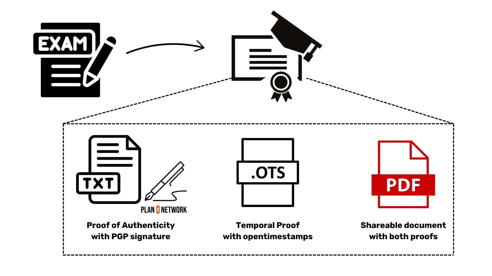
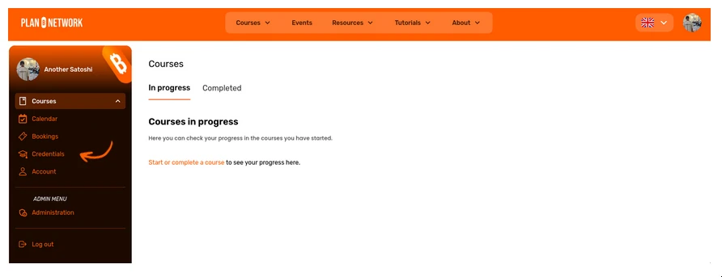
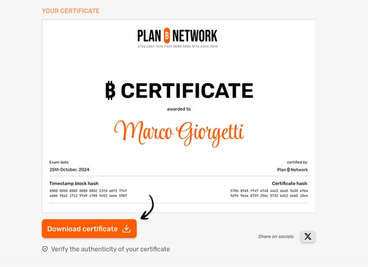
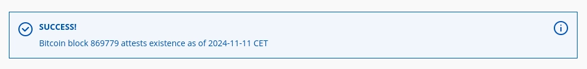

If you are reading this, there is a high probability to you receive either a Bitcoin Certificate or a diploma of completion for one of the course you did on Plan ₿ Network, so congratulation for this achievement!

In this tutorial, we are going to see how Plan ₿ Network issue verifiable for
your Bitcoin Certificate or any Diploma of Course Completion. Then in a second part we will see how to verify the authenticity of these proofs.

# Plan ₿ Network proof mechanism

At Plan ₿ Network, we offer you a certificate and diplomas that are cryptographically signed by us, and time-stamped on the Timechain (ie. The Bitcoin blockchain). In order to achieve this, we had to come with a proof mechanism that rely on 2 cryptographic operations:

1. A GPG-signature on a text file that synthesize your achievements
2. The timestamping of this signed file via [opentimestamps](https://opentimestamps.org/).

Basically the first operation allow you to verify who issue the certificate (or diploma) whereas the second one allow you to verify when it was issued.
We believe that this simple proof mechanism enables us to issue certificate and diploma with undeniable proofs that anyone can verify on their own.



Note that thanks to this proof mechanism, any attempt to alter even the smallest detail of your certificate or diploma will create a completely different sha256 hash of the signed file, which would instantly revealing tampering because the signature and the timestamping will not be valid anymore. Furthermore, if anyone tries to maliciously forge some certificates or diplomas on behalf of Plan ₿ Network, a simple verification of the signature would reveal the fraud.

## How does the GPG-signature work?

The GPG signature is obtained with the use of an open-source software name GNU Private Guard. This software allows anyone to easily create private keys, sign and verify signature and also encrypt and decrypt files. For this scope of this tutorial, know that Plan ₿ Network use GPG to create its private/public key and to sign any Bitcoin Certificate or Diploma of Course Completion.

On the other hand, if someone wants to verify the authenticity of a signed file they can use GPG to import the public key of the issuer and verify. In the second part of the tutorial we will see how to do it with a terminal.

For those who are curious and want to learn more about this fantastic software, you can refer to ["The GNU Privacy Handbook"](https://www.gnupg.org/gph/en/manual/x135.html)

## How does time-stamping work?

Anyone can use OpenTimestamps to time-stamp a file, and obtain a verifiable proof of file existence. In other words, it does not provide you a proof of when the file was created but a proof of existence no later than a certain moment.
OpenTimestamps is able to offer this service for free thanks to a highly efficient way to store such proof in the Bitcoin Blockchain. It uses the sha256 has of the file as a unique identifier of your file and build a merkle tree with other hashes of submitted files from other users and only anchor the hash of the Merkle Tree structure in an OpReturn Transaction.
Once this transaction is in some block, anyone with the initial file and the `.ots` file associated to it can verify the authencity of the timestamping. In the second part of the tutorial we will see how to verify your Bitcoin Certificate or any Diploma of Course Completion with a teminal and with a graphical interface via the website of OpenTimestamps.

# How to verify a Plan ₿ Network Certificate or Diploma

## Step 1. Download your Certificate or Diploma

Log into your personal PBN dashboard.


Go to Credentials page by clicking on the lefthand-side menu, and select on your exam session or your Diploma of Course Completion.



Download the zip file.



Extract the contents by right-clicking on the `.zip` file and selecting "Extract". You will find three different files inside:

- Signed text file (e.g., certificate.txt)
- Open timestamp (OTS) file (e.g., certificate.txt.ots)
- PDF certificate (e.g., certificate.pdf)

## Step 2: Verifying the Signature of the Text File

First open a terminal in the folder where the files are (right-clicking on the folder window and clik on "Open in Teminal"). Then follow the below instructions

1. Import Plan ₿ Network public PGP key with the following command:

```bash
curl -s https://raw.githubusercontent.com/Asi0Flammeus/pgp-public-keys/master/planb-network-pk.asc | gpg --import
```

You should see a message like the following if you successfully imported the PGP Key

```
gpg: key 8F12D0C63B1A606E: public key "PlanB Network (used for PBN platform) <admin@planb.network>" imported
gpg: Total number processed: 1
gpg:               imported: 1
```

NOTE: if you see that 1 key is processed and 0 imported, most likely you already imported the same key previously and it's fine.

2. Verify the signature of the certificate or diploma with following command:

```bash
gpg --verify certificate.txt
```

This command should show you details about the signature, including:

- Who signed it (Plan ₿ Network)
- When it was signed
- Whether the signature is valid

This is an example of the result:

```
gpg: Signature made lun 11 nov 2024, 00:39:04 CET
gpg:                using RSA key 5720CD577E7894C98DBD580E8F12D0C63B1A606E
gpg:                issuer "admin@planb.network"
gpg: Good signature from "PlanB Network (used for PBN platform) <admin@planb.network>" [unknown]
```

If you see a message like "BAD signature", that means that the file has been tampered.

## Step 3: Verifying the Open Timestamp

### Verifying via a Graphical Interface

1. Visit the OpenTimestamps website: https://opentimestamps.org/
2. Click on the "Stamp & Verify" tab.
3. Drag and drop the OTS file (e.g., `certificate.txt.ots`) into the designated area.
4. Drag and drop the timestamped file (e.g. `certificate.txt`) into the designated area.
5. The website will automatically verify the open timestamp and display the result.

If you see a message like the following you time timestamp is valid:



### CLI Method

NOTE: this procedure **will require a local Bitcoin node running**

1. Install the OpenTimestamps client from the official repository: https://github.com/opentimestamps/opentimestamps-client by running the following command:

```
pip install opentimestamps-client
```

2. Navigate to the directory containing the extracted certificate files.

3. Run the following command to verify the open timestamp:

```
ots verify certificate.txt.ots
```

This command will:

- Check the timestamp against Bitcoin's blockchain
- Show you when exactly the file was timestamped
- Confirm the timestamp's authenticity

### Final results

Note that the verification is successful if following **both** message are displayed:

1. The GPG signature is reported as **"Good signature from Plan ₿ Network"**
2. The OpenTimestamps verification shows a specific Bitcoin block timestamp and reports **"Success! Bitcoin block [blockheight] attests data existed as of [timestamp]"**

Now that you know how Plan ₿ Network issue verifiable proof for any Bitcoin Certificate and Diploma of Course Completion, you can easily verify the integrity of it.
