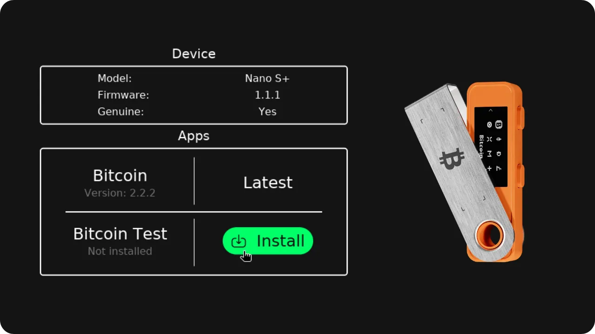
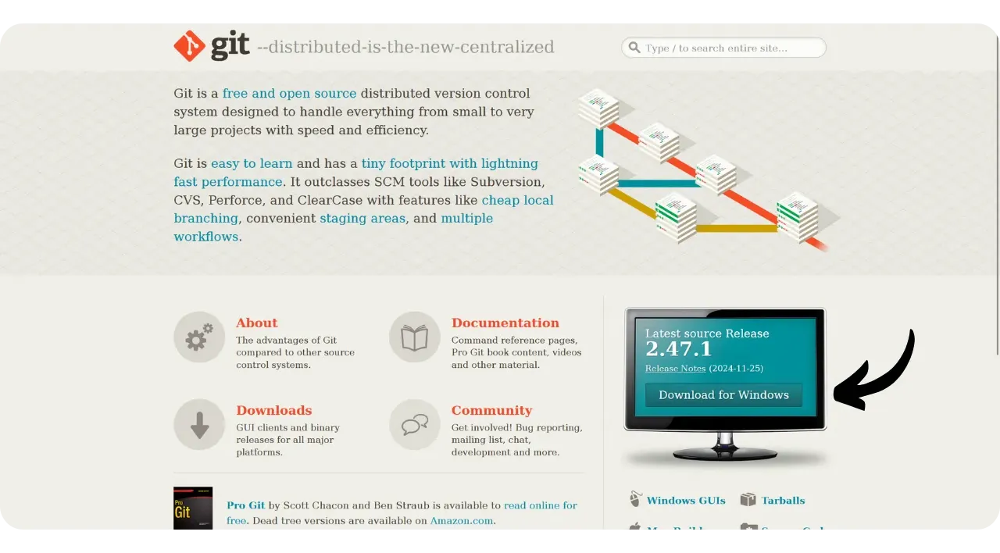
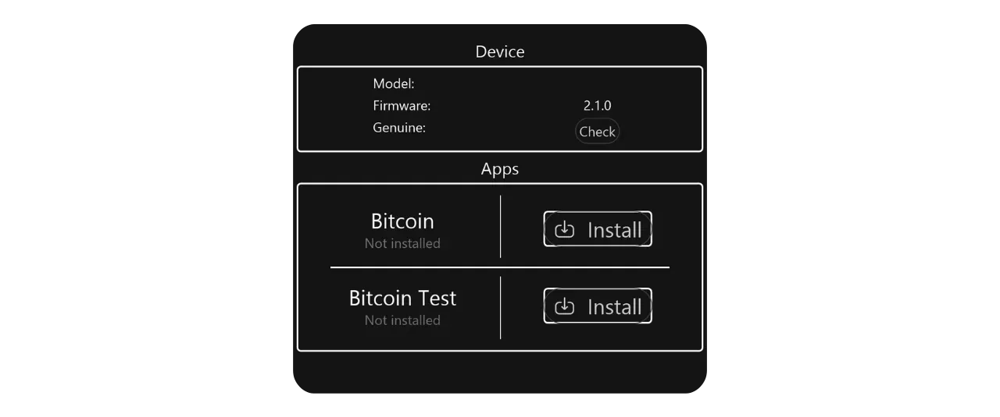
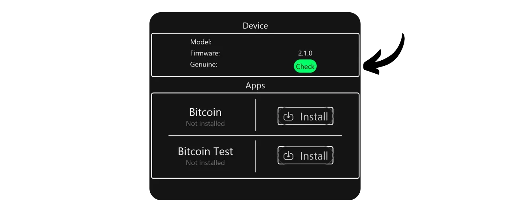
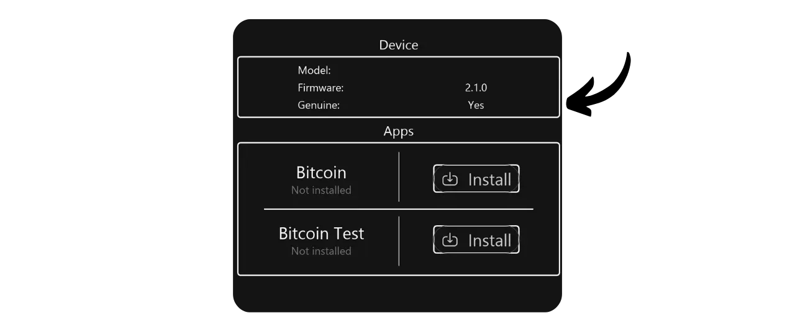
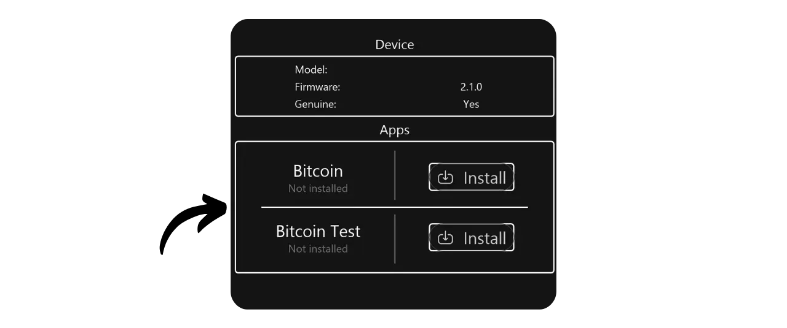
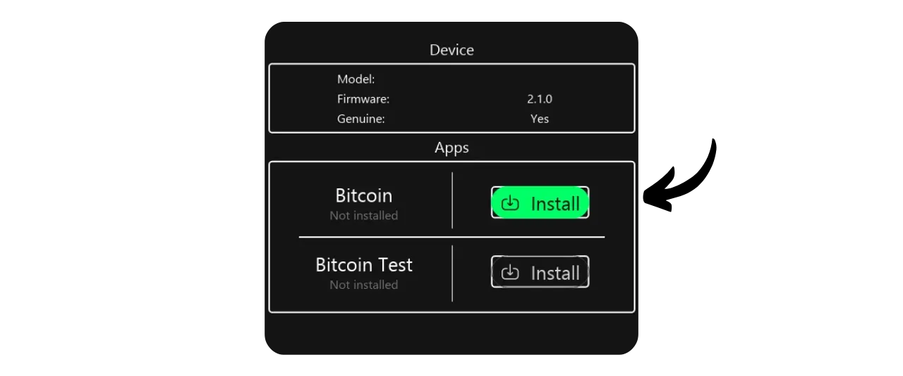
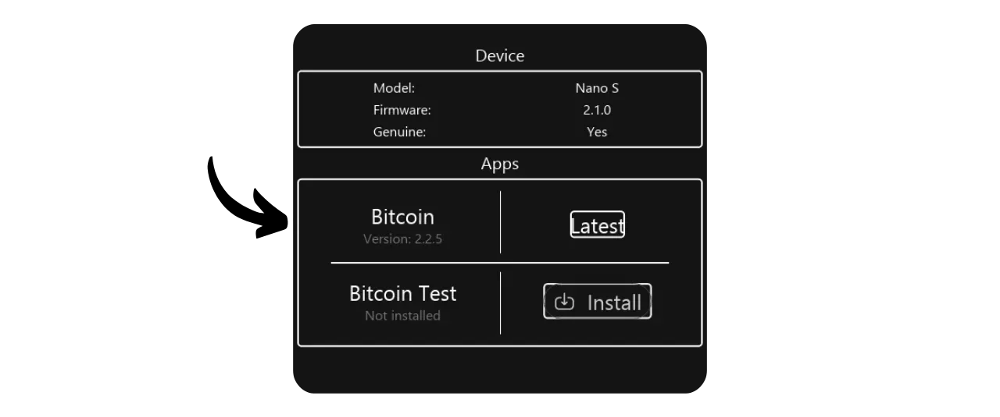
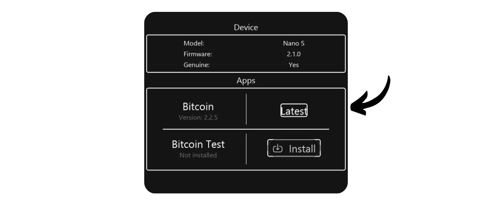

Si vous utilisez une Ledger, vous avez probablement constaté que vous deviez passer par le logiciel Ledger Live, au moins pour la configuration initiale de l'appareil, afin de vérifier son authenticité et d'y installer l'application Bitcoin. Cependant, après cette configuration, beaucoup de bitcoiners préfèrent utiliser des logiciels de gestion de portefeuille Bitcoin spécialisés tels que Sparrow ou Liana plutôt que Ledger Live. Bien que Ledger produise d'excellents hardware wallets qui incluent rapidement les dernières fonctionnalités sur Bitcoin, leur logiciel n'est pas forcément adapté aux besoins spécifiques des bitcoiners. En effet, Ledger Live inclut de nombreuses fonctionnalités destinées aux altcoins, tandis que les options dédiées à la gestion de portefeuille Bitcoin sont limitées. Mais le problème de Sparrow et Liana (pour le moment), est qu'ils ne permettent pas d'installer l'application Bitcoin sur la Ledger.

Pour contourner le besoin d'utiliser Ledger Live lors de la configuration initiale de votre Ledger, vous pouvez utiliser l'outil Bacca, (ou "Ledger Installer"). Ce logiciel vous permet d'installer et de mettre à jour l'application Bitcoin, de vérifier l'authenticité de votre Ledger, et même plus tard de mettre à jour le firmware de l'appareil. Bacca a été créé par Antoine Poinsot (Darosior), développeur Bitcoin Core chez Chaincode Labs, cofondateur [de Revault et de Liana](https://wizardsardine.com/), et par Pythcoiner.

Dans ce tutoriel, je vous propose de découvrir comment utiliser cet outil pour pouvoir vous passer définitivement du logiciel Ledger Live, tout en profitant des appareils de chez Ledger. Il fonctionne sur tous les appareils : Nano S classique, Nano S Plus, Nano X, Flex et Stax.

---

*Attention, cet outil est assez récent et ses développeurs précisent qu'il est encore **en phase de test**. Ils recommandent de l'utiliser uniquement à des fins de test, et non pour un appareil destiné à héberger un véritable portefeuille Bitcoin, bien que cela soit possible de le faire. À ce sujet, je vous recommande de suivre les recommandations des développeurs de cet outil, qui sont précisées [sur le README de leur dépôt GitHub](https://github.com/darosior/ledger_installer).*

---

## Prérequis

Sur votre ordinateur, vous allez avoir besoin de deux outils pour utiliser Bacca : 
- Git ;
- Rust.

Si vous les avez déjà installés, vous pouvez passer cette étape.

**Linux :**

Sur une distribution Linux, Git est généralement préinstallé. Pour vérifier si Git est installé sur votre système, vous pouvez taper la commande suivante dans le terminal :

```bash
git --version
```

Si jamais Git n'est pas installé sur votre système, voici la commande pour l'installer sur un Debian : 

```bash
sudo apt install git
```

Enfin, pour installer votre environnement de développement Rust, utilisez la commande :

```bash
curl --proto '=https' --tlsv1.2 -sSf https://sh.rustup.rs | sh
```


**Windows :**

Pour installer Git, rendez-vous sur [le site officiel du projet](https://git-scm.com/). Téléchargez le logiciel et suivez les instructions d'installation.



Procédez de la même manière pour installer Rust à partir [du site officiel](https://www.rust-lang.org/tools/install).


**MacOS :**

Si Git n'est pas déjà installé sur votre système, ouvrez un terminal et exécutez la commande suivante pour l'installer :

```bash
git --version
```

Si Git n'est pas installé sur votre système, une fenêtre s'ouvrira pour vous proposer d'installer Xcode, qui inclut Git. Il vous suffit de suivre les instructions à l'écran pour procéder à l'installation.

Pour installer Rust, exécutez la commande suivante :

```bash
curl --proto '=https' --tlsv1.2 -sSf https://sh.rustup.rs | sh
```

## Installation de Bacca

Ouvrez un terminal et placez vous sur le dossier dans lequel vous souhaitez enregistrer le logiciel, puis exécutez la commande suivante :

```bash
git clone https://github.com/darosior/ledger_installer.git
```

Naviguez jusqu'au répertoire du logiciel :

```bash
cd ledger_installer
```

Puis utilisez Cargo pour compiler le projet et exécuter la GUI de Bacca :

```bash
cargo run -p ledger_manager_gui
```

Vous avez maintenant accès à l'interface du logiciel.


## Configurer la Ledger

Avant de commencer, si votre Ledger est neuve, assurez-vous d'avoir configuré le code PIN et sauvegardé la phrase de récupération. Vous n'avez pas besoin de Ledger Live pour ces étapes initiales. Il suffit de connecter votre Ledger via le câble USB pour l'alimenter. Si vous n'êtes pas sûr de savoir comment procéder pour ces deux étapes, vous pouvez consulter le début du tutoriel spécifique à votre modèle :

https://planb.network/tutorials/wallet/hardware/ledger-c6fc7d82-91e7-4c74-bad7-cbff7fea7a88

https://planb.network/tutorials/wallet/hardware/ledger-c6fc7d82-91e7-4c74-bad7-cbff7fea7a88-nano-s-plus

https://planb.network/tutorials/wallet/hardware/ledger-c6fc7d82-91e7-4c74-bad7-cbff7fea7a88-flex

## Utilisation de Bacca

Branchez votre Ledger à votre ordinateur et déverrouillez-la en utilisant le code PIN que vous avez configuré. Bacca devrait automatiquement détecter votre Ledger.



Pour confirmer l'authenticité de votre Ledger, cliquez sur le bouton "*Check*". Vous devrez autoriser la connexion sur votre appareil Ledger pour continuer.



Bacca vous informera ensuite si votre Ledger est authentique. Si ce n'est pas le cas, cela indique soit que l'appareil a été compromis, soit qu'il s'agit d'une contrefaçon. Dans ce cas, arrêtez immédiatement de l'utiliser.



Dans le menu "*Apps*", vous pouvez consulter la liste des applications déjà installées sur votre Ledger.



Pour installer l'application Bitcoin, cliquez sur "*Install*", puis autorisez l'installation sur votre Ledger.



L'application est bien installée.



Si vous n'avez pas la dernière version de l'application Bitcoin installée, Bacca affichera un bouton "*Update*" au lieu de l'indication "*Latest*". Cliquez simplement sur ce bouton pour mettre à jour l'application.



Maintenant que votre Ledger est correctement configurée avec la dernière version de l'application Bitcoin, vous êtes prêt à importer puis utiliser votre portefeuille sur un logiciel de gestion tel que Sparrow ou Liana, sans avoir eu besoin de passer par Ledger Live !

Si vous avez trouvé ce tutoriel utile, je vous serais reconnaissant de laisser un pouce vert ci-dessous. N'hésitez pas à partager cet article sur vos réseaux sociaux. Merci beaucoup !

Je vous recommande également de consulter ce tutoriel sur GnuPG, qui vous expliquera comment vérifier l'intégrité et l'authenticité de vos logiciels avant leur installation. C'est une pratique importante, notamment lorsque vous installez des logiciels de gestion de portefeuille tels que Liana ou Sparrow :

https://planb.network/tutorials/others/general/integrity-authenticity-21d0420a-be02-4663-94a3-8d487f23becc
