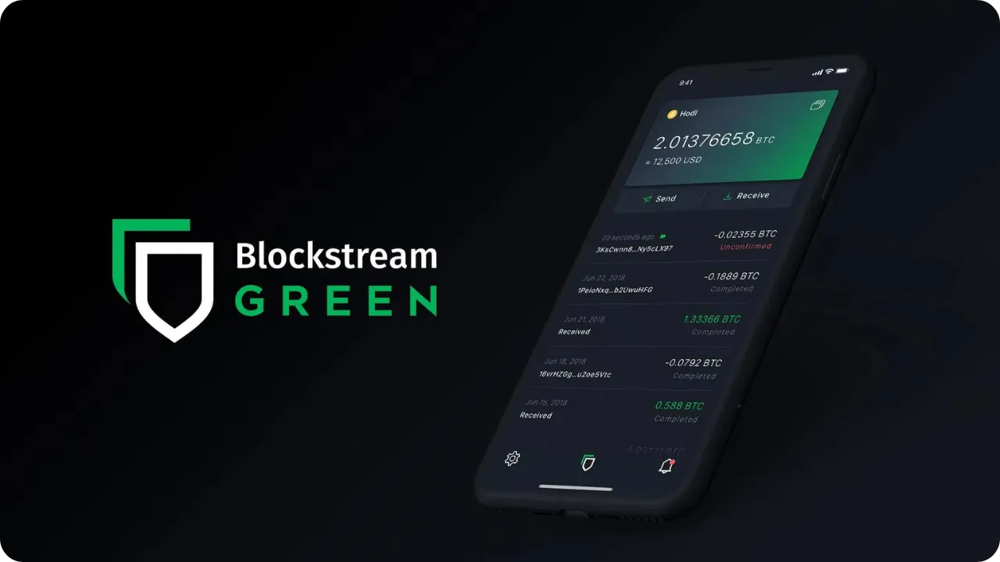

Un portefeuille logiciel est une application installée sur un ordinateur, un smartphone ou tout autre appareil connecté à Internet, permettant de gérer et de sécuriser les clés de son portefeuille Bitcoin. Contrairement aux hardware wallets, qui isolent les clés privées, les portefeuilles "**chauds**" fonctionnent donc dans un environnement potentiellement exposé aux cyberattaques, ce qui augmente les risques de piratage et de vol.

Les portefeuilles logiciels sont à utiliser pour gérer des montants raisonnables de bitcoins, notamment pour les transactions du quotidien. Cela peut être une option intéressante également pour les personnes possédant un patrimoine limité en bitcoins, pour qui l'investissement dans un hardware wallet peut sembler disproportionné. Cependant, leur exposition constante à Internet les rend moins sûrs pour stocker votre épargne de long terme ou des fonds importants. Pour ces derniers, il est préférable d'opter pour des solutions plus sécurisées, comme les hardware wallets.

Dans ce tutoriel, je vous propose de découvrir comment améliorer la sécurité d'un portefeuille chaud en utilisant l'option "*2FA*" sur Blockstream Green.

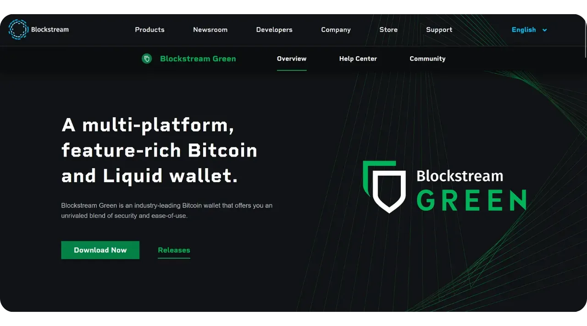

## Présentation de Blockstream Green

Blockstream Green est un portefeuille logiciel disponible sur mobile et sur ordinateur. Anciennement connu sous le nom de *Green Address*, ce portefeuille est devenu un projet Blockstream suite à son acquisition en 2016.

Green est une application particulièrement facile à utiliser, ce qui la rend intéressante pour les débutants. Elle propose toutes les fonctionnalités essentielles d'un bon portefeuille Bitcoin, notamment RBF (*Replace-by-Fee*), une option de connexion via Tor, la capacité de connecter son propre nœud, l'option SPV (*Simple Payment Verification*), l'étiquetage et le contrôle des pièces.

Blockstream Green supporte aussi le réseau Liquid, une sidechain de Bitcoin développée par Blockstream pour réaliser des transactions rapides et confidentielles en dehors de la blockchain principale. Dans ce tutoriel, on se concentre exclusivement sur Bitcoin, mais j'ai également fait un autre tutoriel pour apprendre à utiliser Liquid sur Green :

https://planb.network/tutorials/wallet/blockstream-green-liquid

## L'option multisig 2/2 (2FA)

Sur Green, vous pouvez tout à fait créer un portefeuille chaud classique "*singlesig*". Mais vous avez également l'option "*2FA multisig*", qui permet d'améliorer la sécurité de votre portefeuille chaud sans trop compliquer sa gestion quotidienne.

Vous allez donc configurer un portefeuille multisig 2/2, ce qui signifie que chaque transaction requerra la signature de deux clés. La première clé, dérivée de votre phrase mnémonique de 12 ou 24 mots, est sécurisée localement avec un code PIN sur votre téléphone. Vous contrôlez entièrement cette clé. La seconde clé est conservée par les serveurs de Blockstream et son utilisation pour signer nécessite une authentification, qui peut être réalisée via un code reçu par email, SMS, appel téléphonique, ou, comme nous le verrons dans ce tutoriel, via une application d'authentification (Authy, Google Authenticator, etc.).

Pour assurer votre autonomie en cas de défaillance de Blockstream (par exemple, en cas de faillite de l'entreprise ou de destruction des serveurs détenant la seconde clé), un mécanisme de timelock est appliqué sur votre multisig. Ce mécanisme transforme le multisig 2/2 en multisig 1/2 après environ un an (ou précisément 51 840 blocs, mais cette valeur est modifiable), après quoi votre portefeuille n'aura besoin plus que de votre clé locale pour dépenser les bitcoins. Ainsi, si vous perdez l'accès aux serveurs de Blockstream ou à l'authentification 2FA, il suffit d'attendre au maximum un an pour pouvoir utiliser librement vos bitcoins avec votre application, sans dépendre de Blockstream.

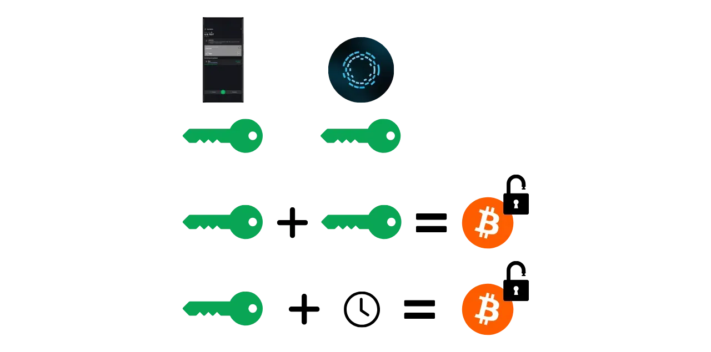

Cette méthode augmente significativement la sécurité de votre portefeuille chaud, tout en vous laissant le contrôle de vos bitcoins et en facilitant son utilisation quotidienne. Cependant, elle impose de rafraîchir régulièrement le timelock pour maintenir la sécurité du 2FA. Le décompte de 360 jours, durant lequel vos fonds sont protégés par le 2FA, commence dès que vous recevez des bitcoins. Si, 360 jours après cette réception, vous n'avez pas effectué de transaction dépensant ces fonds, vos bitcoins ne seront protégés que par votre clé locale, sans le 2FA.

Cette contrainte rend l'option 2FA plus adaptée à un portefeuille de dépense, où les transactions régulières renouvellent automatiquement les timelocks. Pour un portefeuille d'épargne à long terme, cela peut être problématique, car il faudra penser à effectuer une transaction de balayage vers vous-même chaque année avant l'expiration du timelock.

Un autre inconvénient de cette méthode de sécurisation est que vous devrez utiliser des modèles de scripts minoritaires. Cela signifie que, du point de vue de la confidentialité, les choses se compliquent : très peu de personnes utilisent le même type de script que vous, ce qui permet ainsi à un observateur extérieur d'identifier plus facilement votre empreinte de portefeuille. De plus, ces scripts entraîneront des frais de transaction plus élevés en raison de leur taille plus importante.

Si vous préférez ne pas utiliser l'option 2FA et souhaitez simplement configurer un portefeuille "*singlesig*" sur Green, je vous invite à consulter cet autre tutoriel :

https://planb.network/tutorials/wallet/blockstream-green-liquid

## Installer et paramétrer le logiciel Blockstream Green

La première étape est naturellement de télécharger l'application Green. Rendez-vous sur votre store d'applications :
- [Pour Android](https://play.google.com/store/apps/details?id=com.greenaddress.greenbits_android_wallet) ;
- [Pour Apple](https://apps.apple.com/us/app/green-bitcoin-wallet/id1402243590).

Pour les utilisateurs Android, vous avez aussi la possibilité d'installer l'application via le fichier `.apk` [disponible sur le GitHub de Blockstream](https://github.com/Blockstream/green_android/releases).

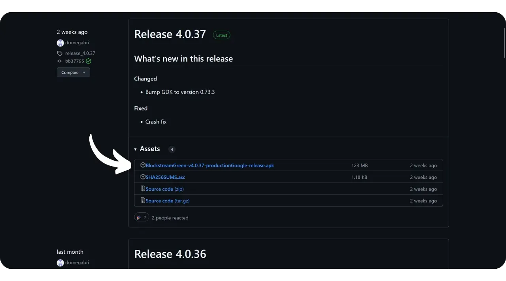

Lancez l'application, puis cochez la case "*J'accepte les conditions...*".

Lorsque vous ouvrez Green pour la première fois, l’écran d’accueil s’affiche sans portefeuille configuré. Plus tard, si vous créez ou importez des portefeuilles, ils apparaîtront dans cette interface. Avant de passer à la création d’un portefeuille, je vous conseille d’ajuster les paramètres de l’application en fonction de vos attentes. Cliquez sur "*Paramètres de l'application*".

L’option "*Enhanced Privacy*", disponible uniquement sur Android, améliore la confidentialité en désactivant les captures d’écran et en masquant les aperçus d’application. Elle verrouille également automatiquement l’accès à l’application dès que votre téléphone est verrouillé, ce qui rend vos données plus difficiles à exposer.

Pour ceux qui souhaitent renforcer leur confidentialité, l’application propose de rooter votre trafic via Tor, un réseau permettant de chiffrer toutes vos connexions et de rendre vos activités difficiles à tracer. Bien que cette option puisse légèrement ralentir le fonctionnement de l’application, elle est fortement recommandée pour protéger votre vie privée, surtout si vous n'utilisez pas votre propre nœud complet.

Pour les utilisateurs qui disposent de leur nœud complet, Green Wallet offre la possibilité de s'y connecter via un serveur Electrum, ce qui garantit un contrôle total sur les informations du réseau Bitcoin et sur la diffusion des transactions. 

Une autre fonctionnalité alternative est l’option "*SPV Verification*", qui permet de vérifier directement certaines données de la blockchain et donc de réduire le besoin de confiance envers le nœud par défaut de Blockstream, bien que cette méthode ne fournisse pas toutes les garanties d’un nœud complet.

Une fois ces paramètres ajustés selon vos besoins, cliquez sur le bouton "*Sauvegarder*" et redémarrez l’application.

## Créer un portefeuille Bitcoin sur Blockstream Green

Vous êtes maintenant prêt à créer un portefeuille Bitcoin. Cliquez sur le bouton "*Get Started*".

Vous avez le choix entre créer un portefeuille logiciel en local ou gérer un portefeuille froid via un hardware wallet. Pour ce tutoriel, nous nous concentrons sur la création d'un portefeuille chaud, donc vous devrez sélectionner l'option "*On This Device*".

Vous pouvez ensuite choisir de restaurer un portefeuille Bitcoin existant ou d'en créer un nouveau. Pour les besoins de ce tutoriel, nous allons créer un nouveau portefeuille. Cependant, si vous devez régénérer un portefeuille Bitcoin déjà existant à partir de sa phrase mnémonique, par exemple suite à la perte de votre ancien téléphone, vous devrez choisir la seconde option.

Vous avez ensuite le choix entre une phrase mnémonique de 12 mots ou de 24 mots. Cette phrase vous permettra de récupérer l'accès à votre portefeuille depuis n'importe quel logiciel compatible en cas de problème sur votre téléphone. Actuellement, opter pour une phrase de 24 mots n'offre pas plus de sécurité qu'une phrase de 12 mots. Je vous recommande donc de choisir une phrase mnémonique de **12 mots**.

Green vous fournira ensuite votre phrase mnémonique. Avant de continuer, assurez-vous de ne pas être observé. Cliquez sur "*Afficher la phrase de récupération*" pour l'afficher à l'écran.

**Cette phrase mnémonique donne un accès complet et non restreint à tous vos bitcoins**. N'importe qui en possession de cette phrase peut subtiliser vos fonds, même sans accès physique à votre téléphone (sous condition de timelock expiré ou de 2FA dans le cadre d'un portefeuille 2/2 sur Green).

Elle permet de restaurer l'accès à vos clés locales en cas de perte, de vol ou de casse de votre téléphone. Il est donc très important de la sauvegarder soigneusement **sur un support physique (pas numérique)** et de la stocker dans un endroit sécurisé. Vous pouvez l'inscrire sur un bout de papier, ou bien pour plus de sécurité, si ce portefeuille est important, je vous recommande de la graver sur un support en acier inoxydable afin de la protéger contre les risques d'incendies, d'inondations ou d'écroulements (pour un portefeuille chaud destiné à sécuriser une petite quantité de bitcoins, une simple sauvegarde sur papier est probablement suffisante).

*Évidemment, vous ne devez jamais partager ces mots sur internet, contrairement à ce que je fais dans ce tutoriel. Ce portefeuille en exemple sera utilisé uniquement sur le Testnet et sera supprimé à l'issue du tutoriel.*

Après avoir correctement noté votre phrase mnémonique sur un support physique, cliquez sur "*Continuez*". Green Wallet vous demandera ensuite de confirmer certains mots de votre phrase pour vérifier que vous les avez bien enregistrés. Complétez les espaces avec les mots manquants.

Choisissez le code PIN de votre appareil, qui vous servira à déverrouiller votre portefeuille Green. C'est donc une protection contre les accès physiques non autorisés. Ce code PIN n'intervient pas dans la dérivation des clés cryptographiques de votre portefeuille. Ainsi, même sans accès à ce code PIN, la possession de votre phrase mnémonique de 12 ou 24 mots vous permettra de retrouver l'accès à vos clés locales.

Il est recommandé de choisir un code PIN de 6 chiffres le plus aléatoire possible. Assurez-vous également de sauvegarder ce code pour ne pas l'oublier, sans quoi vous serez contraint de récupérer votre portefeuille depuis la phrase mnémonique. Vous pourrez par la suite ajouter une option de blocage par biométrie afin d’éviter de rentrer le PIN à chaque utilisation. De façon générale, la biométrie est bien moins sécurisée que le PIN en lui-même. Ainsi, par défaut, je vous déconseille de mettre en place cette option de déverrouillage.

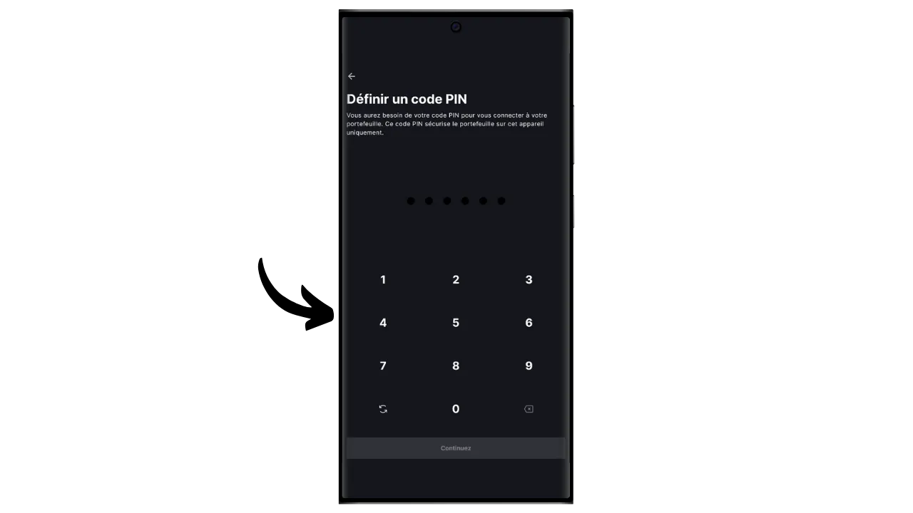

Entrez votre PIN une seconde fois pour le confirmer.

Patientez le temps de la création de votre portefeuille, puis cliquez sur le bouton "*Créer un compte*".

Vous avez ensuite le choix entre un portefeuille standard à signature unique ou un portefeuille protégé par une authentification à deux facteurs (2FA). Dans ce tutoriel, nous allons choisir la seconde option.

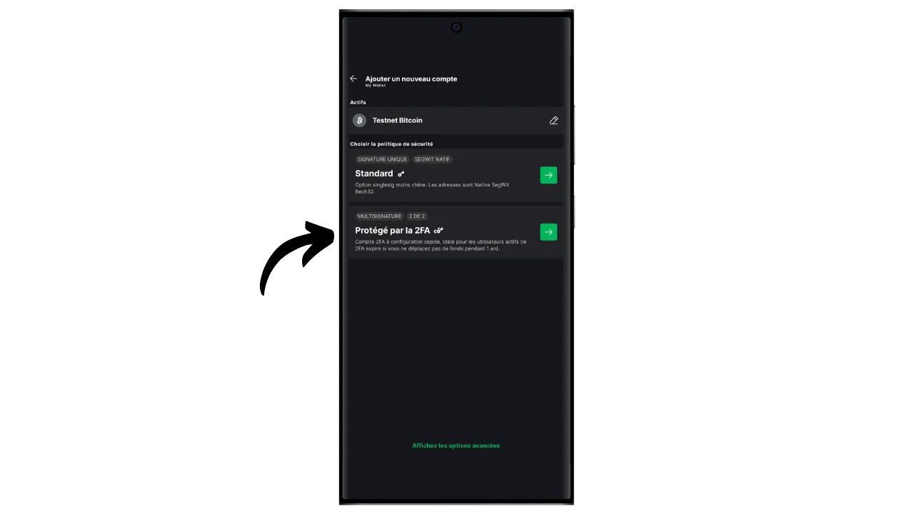

Et voilà, votre portefeuille Bitcoin multisig a bien été créé à l'aide de l'application Green !

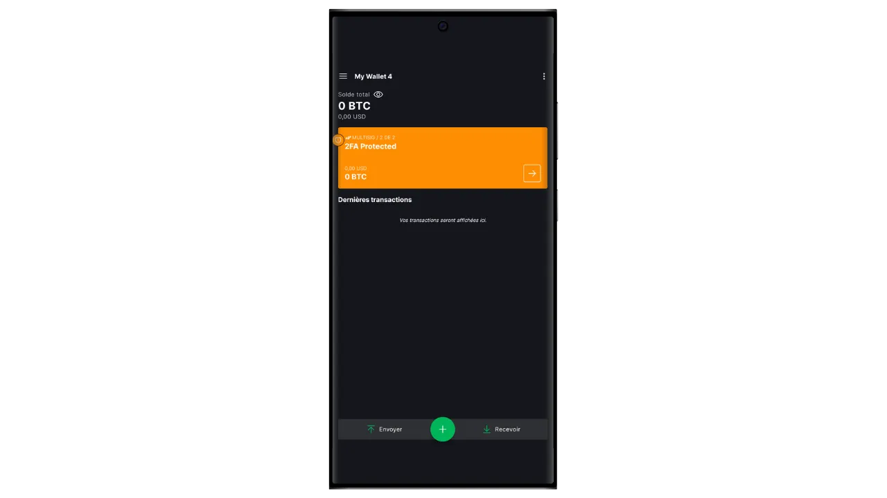

## Mettre en place le 2FA

Cliquez sur votre compte.

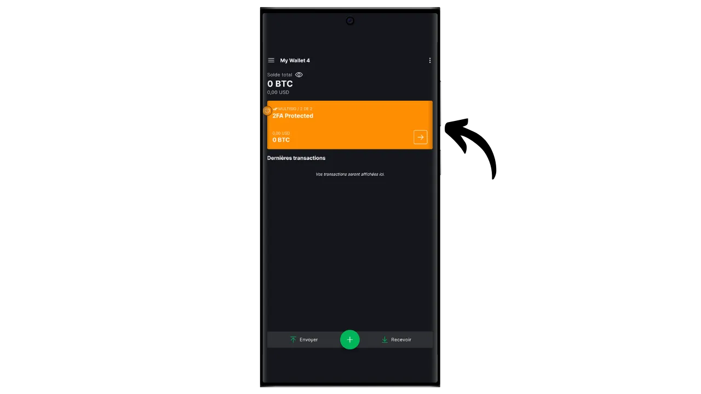

Cliquez sur le bouton vert "*Augmentez la sécurité de votre compte en ajoutant le 2FA*".

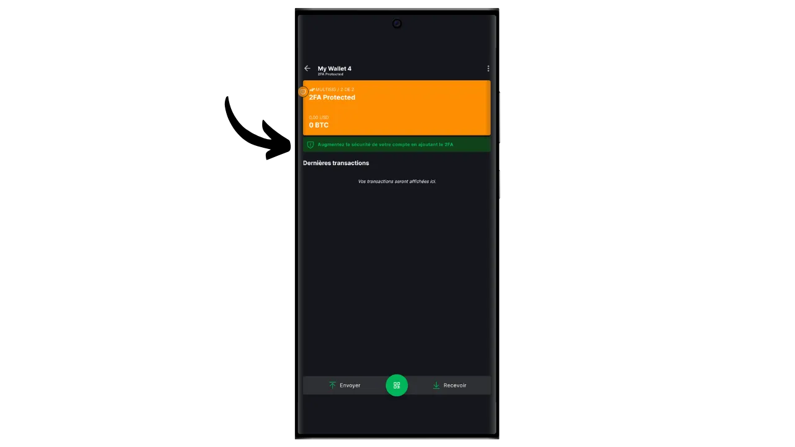

Vous aurez ensuite la possibilité de choisir la méthode d'authentification pour accéder à la seconde clé de votre multisig 2/2. Pour ce tutoriel, nous utiliserons une application d'authentification. Si vous n'êtes pas familier avec ce type d'application, je vous recommande de consulter notre tutoriel sur Authy :

https://planb.network/tutorials/others/authy

Sélectionnez "*Authentificateur Application*".

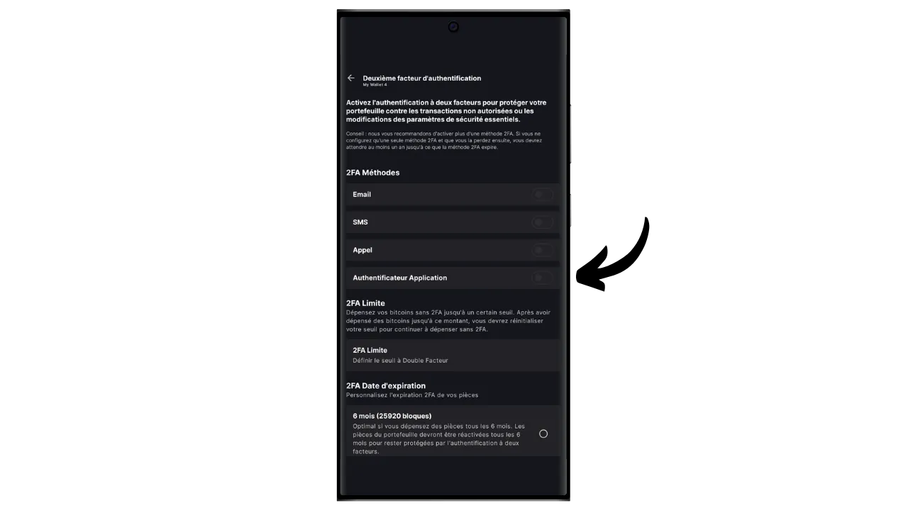

Green affichera ensuite un QR code et une clé de récupération. Cette clé vous permet de restaurer l'accès à votre 2FA en cas de perte de votre application Authy. Il est recommandé de faire une sauvegarde sécurisée de cette clé, bien que vous puissiez toujours récupérer l'accès à vos bitcoins après l'expiration du timelock, comme expliqué précédemment.

Dans votre application d'authentification, ajoutez un nouveau code, puis scannez le QR code fourni par Green.

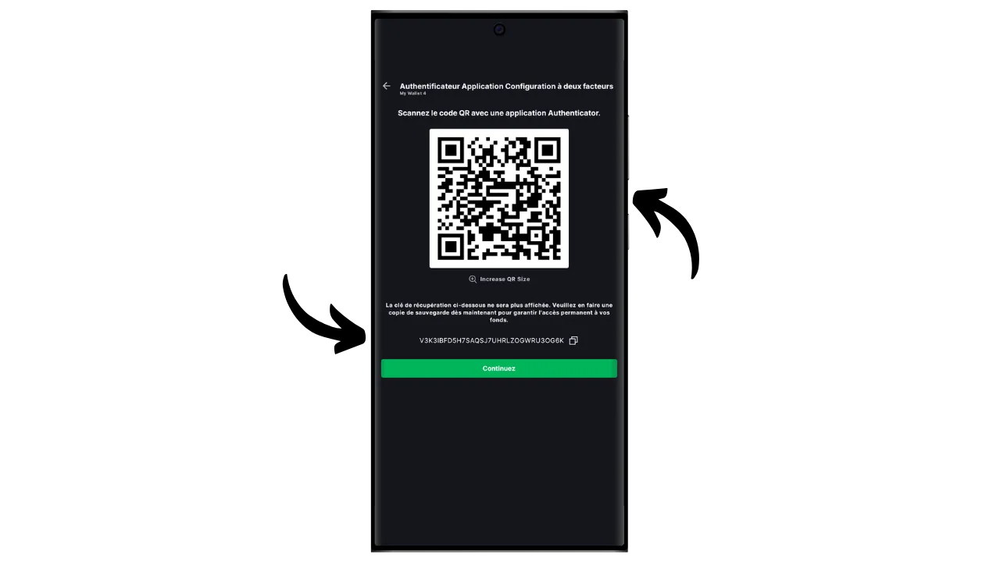

*Évidemment, vous ne devez jamais partager cette clé et ce QR code sur internet, contrairement à ce que je fais dans ce tutoriel. Ce portefeuille en exemple sera utilisé uniquement sur le Testnet et sera supprimé à l'issue du tutoriel.*

Cliquez sur le bouton "*Continuez*".

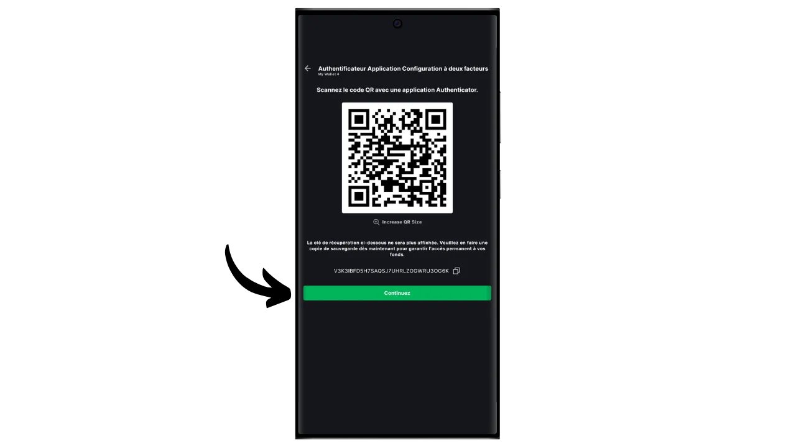

Renseignez le code dynamique à 6 chiffres présent sur votre application d'authentification.

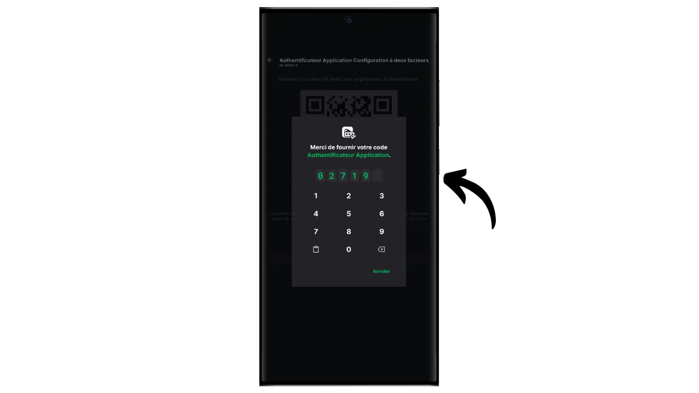

L'authentification à 2 facteurs est désormais activée.

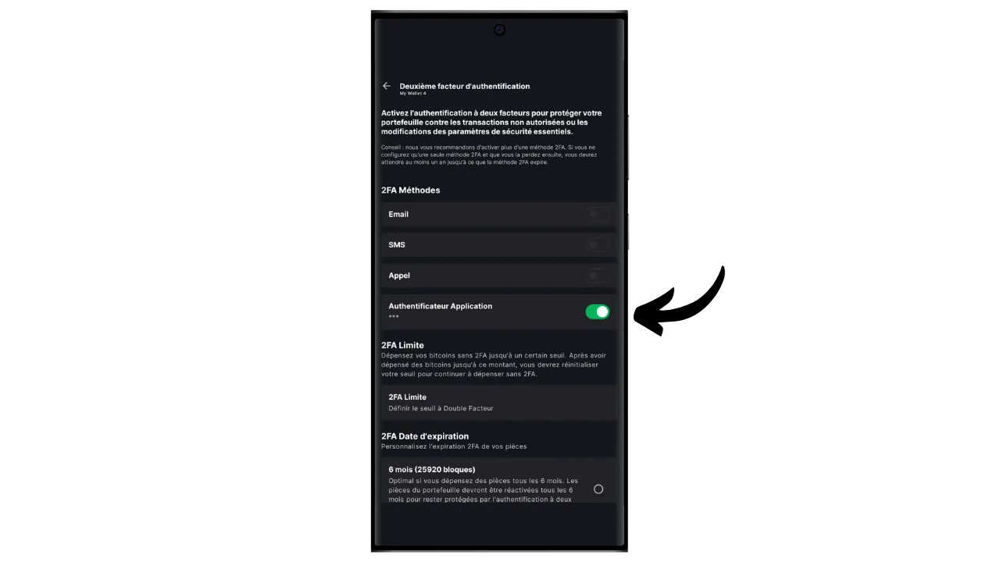

En parcourant ce menu, vous pouvez aussi régler la durée du timelock. Ce décompte débute dès la réception des bitcoins, et une fois le timelock expiré, vos fonds peuvent être dépensés uniquement avec votre clé locale, sans nécessiter le 2FA. La durée par défaut est fixée à 12 mois, mais pour un portefeuille d'épargne, il peut être judicieux de choisir 15 mois pour minimiser la fréquence de renouvellement des timelocks. Inversement, pour un portefeuille de dépenses, un timelock de 6 mois peut être préférable, car il sera fréquemment renouvelé avec vos transactions quotidiennes, et un timelock plus court réduit l'attente en cas de problème avec le 2FA. À vous de déterminer la durée de timelock qui vous convient le mieux.

Vous pouvez maintenant quitter ce menu. Votre portefeuille multisig est prêt !

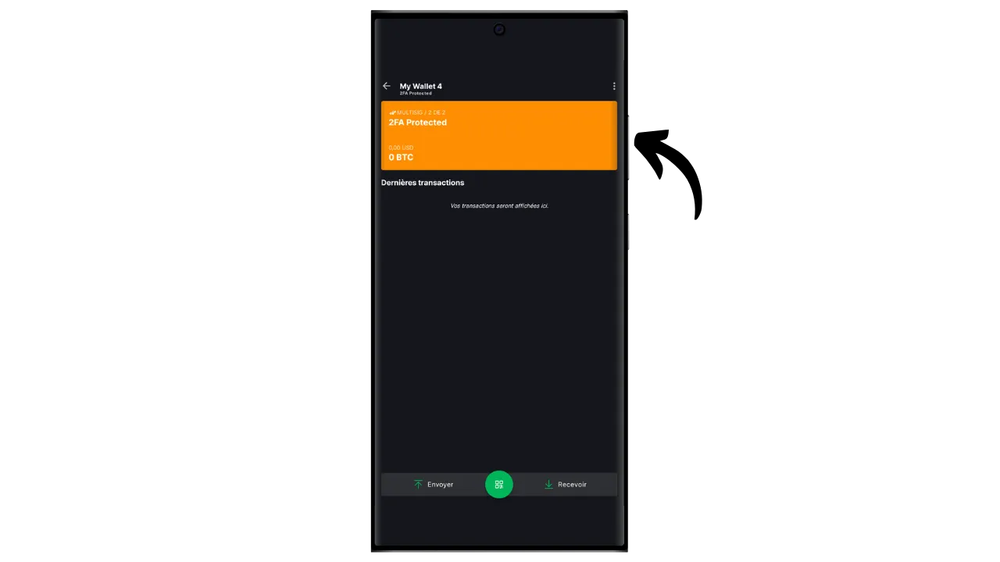

## Paramétrer votre portefeuille sur Blockstream Green

Si vous souhaitez personnaliser votre portefeuille, cliquez sur les trois petits points en haut à droite.

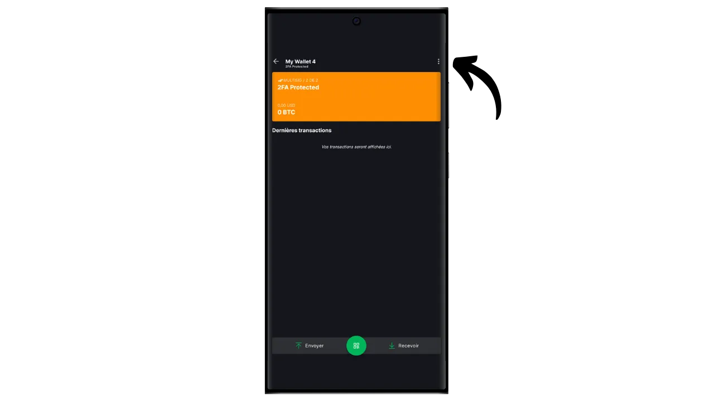

L'option "*Renommer*" vous permet de personnaliser le nom de votre portefeuille, ce qui est particulièrement utile si vous gérez plusieurs portefeuilles sur la même application.

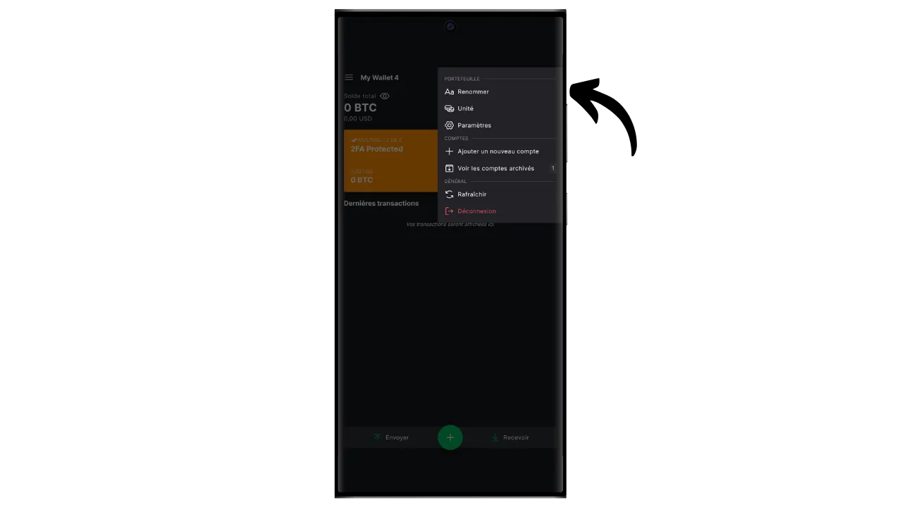

Le menu "*Unité*" vous donne la possibilité de changer l'unité de base de votre portefeuille. Vous pouvez par exemple choisir de l'afficher en satoshis plutôt qu'en bitcoins.

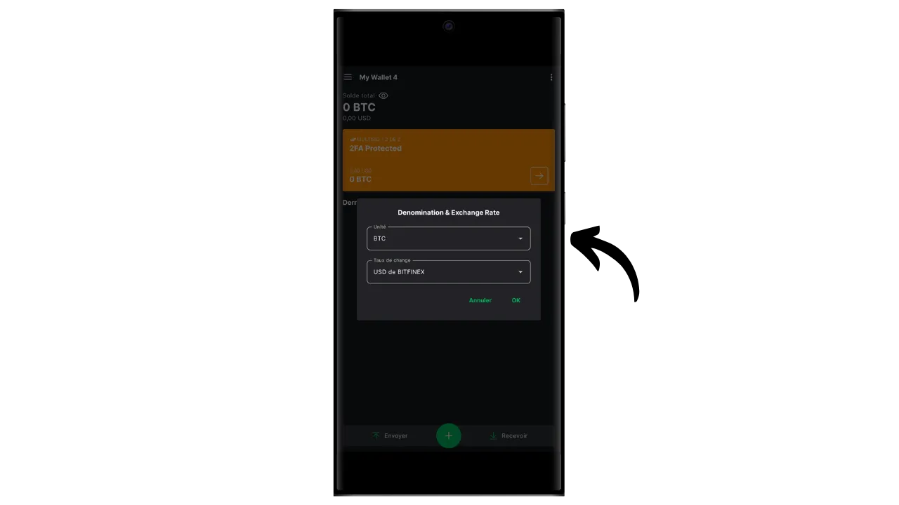

Le menu "*Paramètres*" offre un accès aux différentes options de votre portefeuille Bitcoin.

Vous y trouverez par exemple votre clé publique étendue et son *descriptor*, utiles si vous envisagez de configurer un portefeuille en mode watch-only à partir de ce portefeuille.

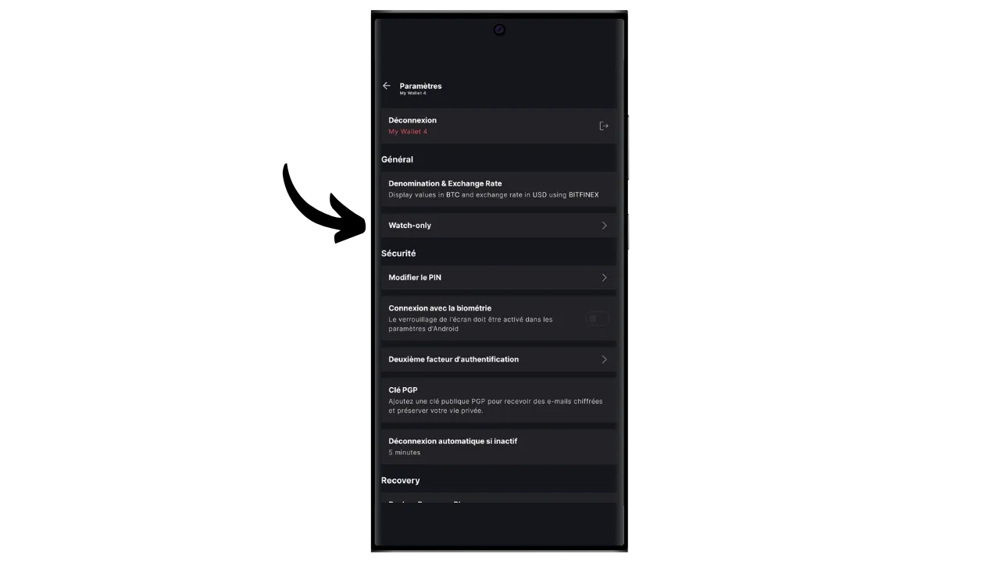

Vous pouvez aussi y modifier le code PIN de votre portefeuille et activer une connexion par biométrie.

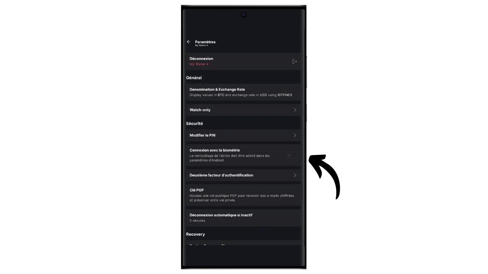

## Utiliser Blockstream Green

Maintenant que votre portefeuille Bitcoin est configuré, vous êtes prêt à recevoir vos premiers sats ! Pour cela, cliquez simplement sur le bouton "*Recevoir*".

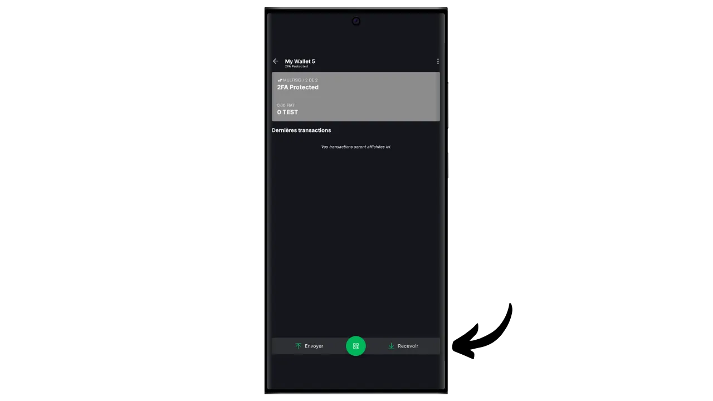

Green affichera alors la première adresse de réception vierge de votre portefeuille. Vous pouvez soit scanner le QR code associé, soit copier l'adresse directement pour y envoyer des bitcoins. Ce type d'adresse ne spécifie pas le montant à envoyer par le payeur. Vous pouvez toutefois générer une adresse qui demande un montant spécifique, en cliquant sur les trois petits points en haut à droite, puis sur "*Montant de la demande*", et en saisissant le montant désiré.

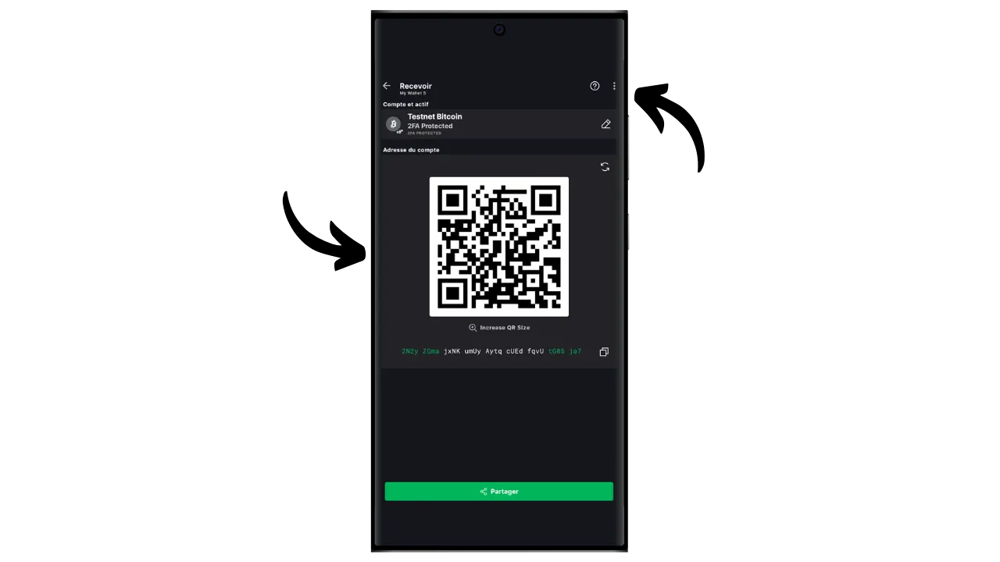

Quand la transaction est diffusée sur le réseau, elle apparaîtra dans votre portefeuille.

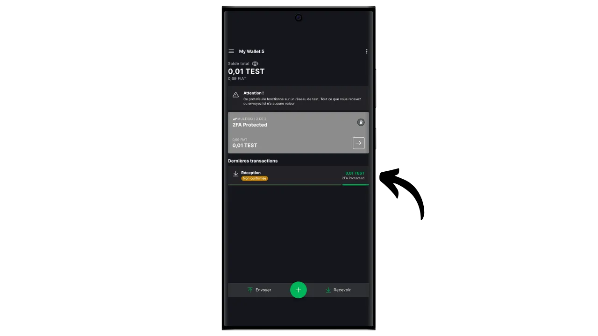

Attendez d'obtenir suffisamment de confirmations pour considérer la transaction comme définitive.

Avec des bitcoins dans votre portefeuille, vous pouvez maintenant également en envoyer. Cliquez sur "*Envoyer*".

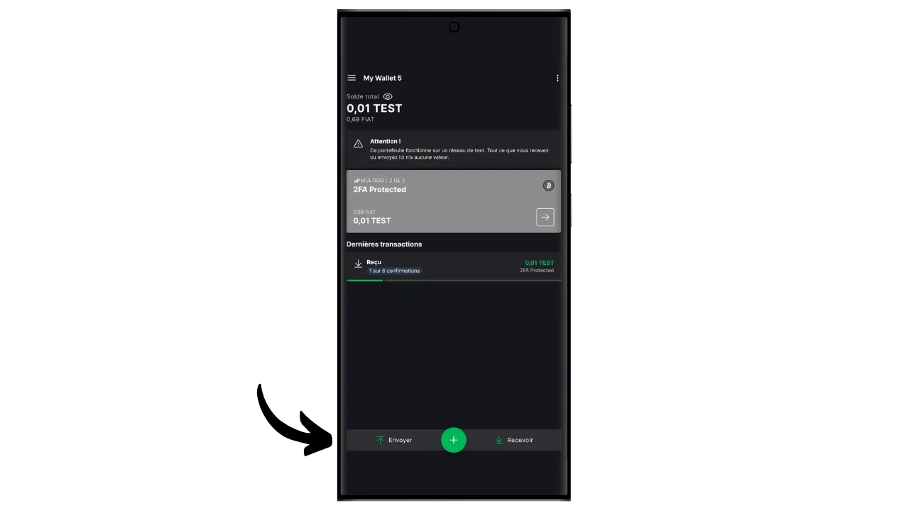

Sur la page suivante, entrez l'adresse du destinataire. Vous pouvez la saisir manuellement ou scanner un QR code.

Choisissez le montant du paiement.

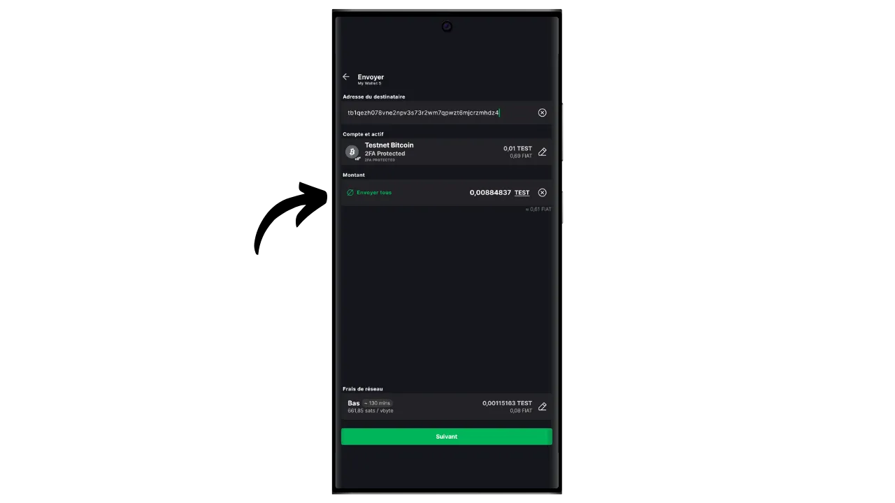

En bas de l'écran, vous pouvez sélectionner le taux de frais pour cette transaction. Vous avez le choix de suivre les recommandations de l'application ou de personnaliser vos frais. Plus les frais sont élevés par rapport aux autres transactions en attente, plus vite votre transaction sera traitée. Pour connaitre le marché de frais, vous pouvez consulter le site [Mempool.space](https://mempool.space/) dans la section "*Transaction Fees*".

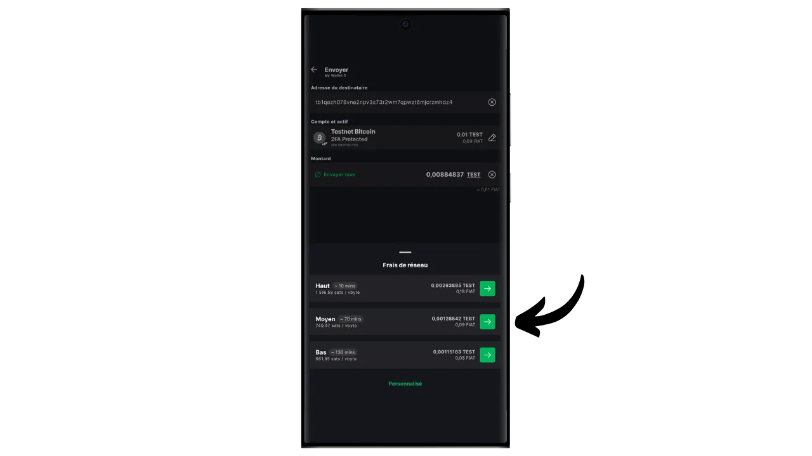

Cliquez sur "*Suivant*" pour accéder à un écran récapitulatif de votre transaction. Vérifiez que l'adresse, le montant et les frais sont corrects.

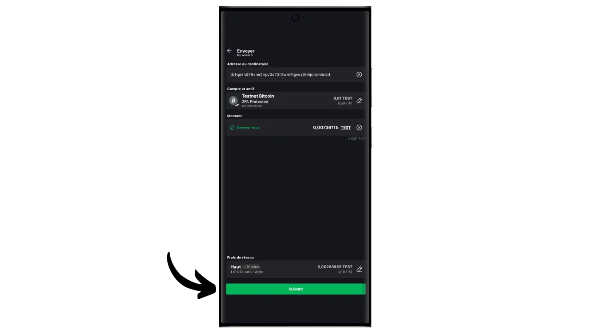

Si tout vous convient, faites glisser le bouton vert en bas de l'écran vers la droite pour signer et diffuser la transaction sur le réseau Bitcoin.

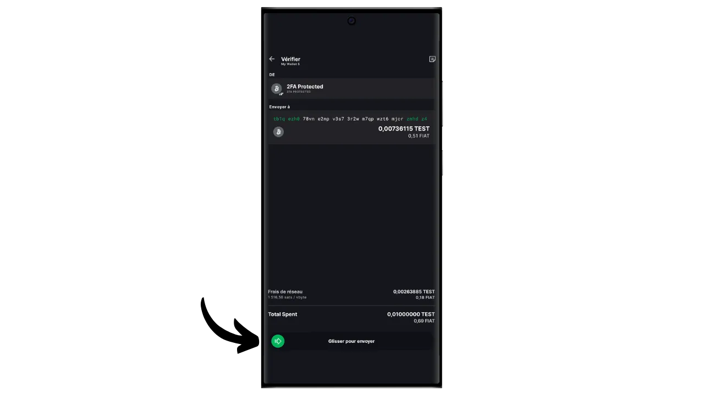

C'est à ce moment-là que vous devez entrer votre code d'authentification pour déverrouiller la seconde clé du multisig conservée par Blockstream. Saisissez le code à 6 chiffres affiché sur votre application d'authentification.

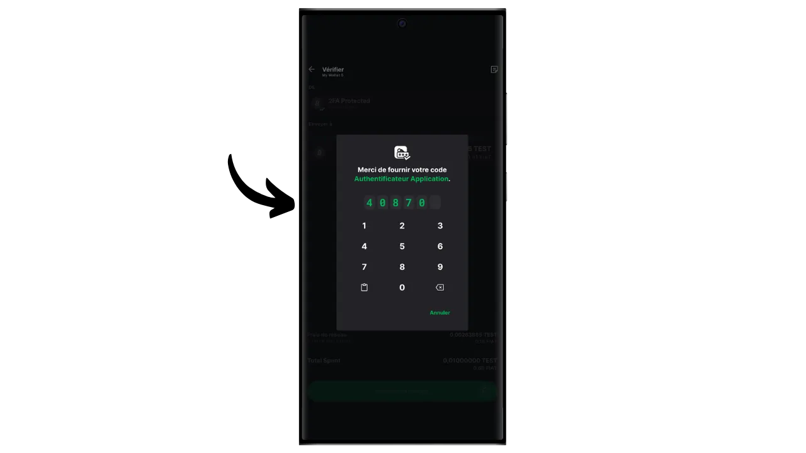

Votre transaction apparaîtra maintenant sur le tableau de bord de votre portefeuille Bitcoin en attente de confirmation.

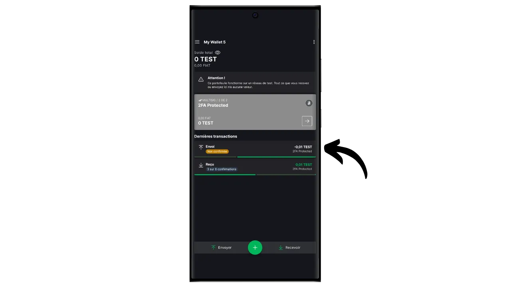

Et voilà, vous savez maintenant comment configurer facilement un portefeuille multisig 2/2 à l'aide de l'option 2FA de Blockstream Green !

Si vous avez trouvé ce tutoriel utile, je vous serais reconnaissant de laisser un pouce vert ci-dessous. N'hésitez pas à partager cet article sur vos réseaux sociaux. Merci beaucoup !

Je vous conseille également de découvrir cet autre tutoriel complet sur l'application mobile Blockstream Green pour mettre en place un portefeuille Liquid :

https://planb.network/tutorials/wallet/blockstream-green-liquid
