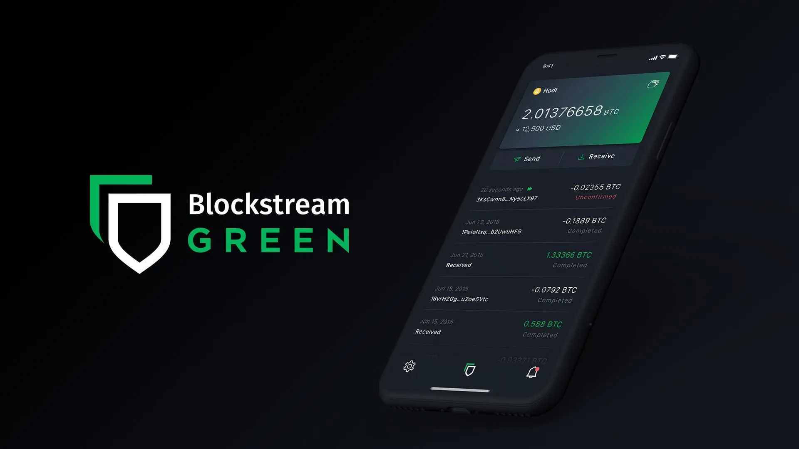

Dans ce tutoriel, nous allons explorer comment utiliser le logiciel Blockstream Green sur ordinateur pour gérer un portefeuille sécurisé sur un hardware wallet. Lorsque vous utilisez un hardware wallet, il est indispensable d'avoir recours à un logiciel sur votre ordinateur pour gérer ce portefeuille. Ce logiciel de gestion n'a pas accès aux clés privées ; il est utilisé uniquement pour consulter le solde de votre portefeuille, générer des adresses de réception, et construire puis diffuser les transactions qui seront signées par le hardware wallet. Green représente une des nombreuses solutions disponibles pour la gestion de votre hardware wallet Bitcoin.

En 2024, Blockstream Green est uniquement compatible avec les appareils Ledger Nano S (ancienne version), Ledger Nano X, Trezor One, Trezor T, et Blockstream Jade.

## Présentation de Blockstream Green

Blockstream Green est un logiciel disponible sur mobile et sur ordinateur. Anciennement connu sous le nom de Green Address, ce portefeuille est devenu un projet de Blockstream suite à son acquisition en 2016.

Green est une application très facile à utiliser, ce qui la rend particulièrement adaptée aux débutants. Elle offre diverses fonctionnalités, telles que la gestion de portefeuilles chauds, de hardware wallets, ainsi que des portefeuilles sur la sidechain Liquid. Vous pouvez également l'utiliser pour mettre en place un portefeuille watch-only.

Dans ce tutoriel, nous nous concentrerons uniquement sur l'utilisation du logiciel sur ordinateur. Pour explorer d'autres utilisations de Green, je vous invite à consulter nos autres tutoriels dédiés :

https://planb.network/tutorials/wallet/blockstream-green

https://planb.network/tutorials/wallet/blockstream-green-watch-only

## Installer et paramétrer le logiciel Blockstream Green

Commencez par installer le logiciel Blockstream Green sur votre ordinateur. Rendez-vous [sur le site officiel](https://blockstream.com/green/) et cliquez sur le bouton "*Download Now*". Suivez ensuite le processus d'installation en fonction de votre système d'exploitation.

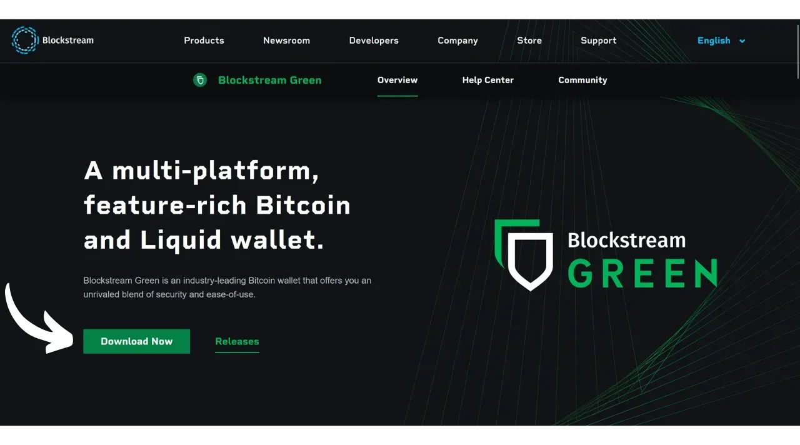

Lancez l'application, puis cochez la case "*J'accepte les conditions...*".

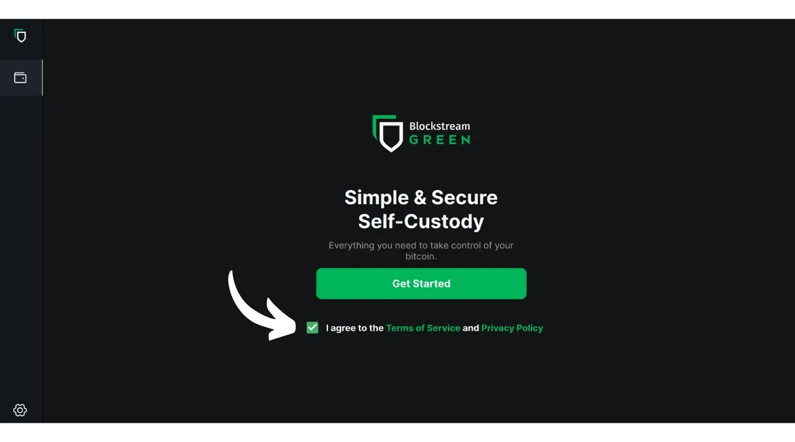

Lorsque vous ouvrez Green pour la première fois, l’écran d’accueil s’affiche sans portefeuille configuré. Plus tard, si vous créez ou importez des portefeuilles, ils apparaîtront dans cette interface. Avant de passer à la création d’un portefeuille, je vous conseille d’ajuster les paramètres de l’application en fonction de vos attentes. Cliquez sur l'icône des paramètres en bas à gauche.

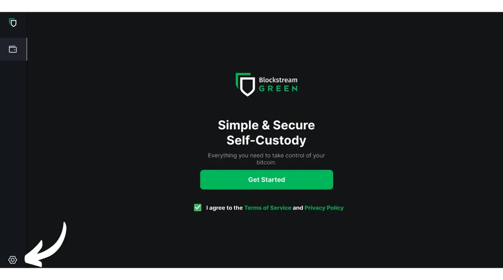

Dans le menu "*General*", vous pouvez modifier la langue du logiciel et activer si vous le souhaitez les fonctionnalités expérimentales.

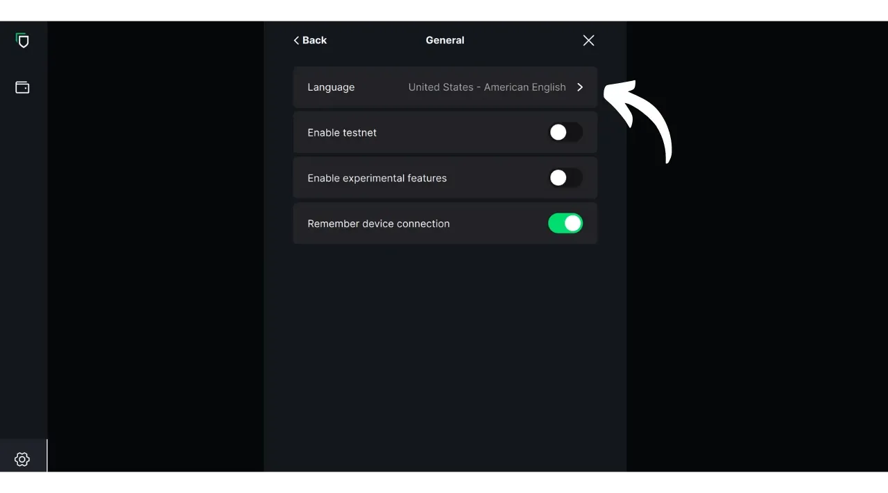

Dans le menu "*Network*", vous pouvez activer la connexion via Tor, un réseau permettant de chiffrer toutes vos connexions et de rendre vos activités difficiles à tracer. Bien que cette option puisse légèrement ralentir le fonctionnement de l’application, elle est fortement recommandée pour protéger votre vie privée, surtout si vous n'utilisez pas votre propre nœud complet.

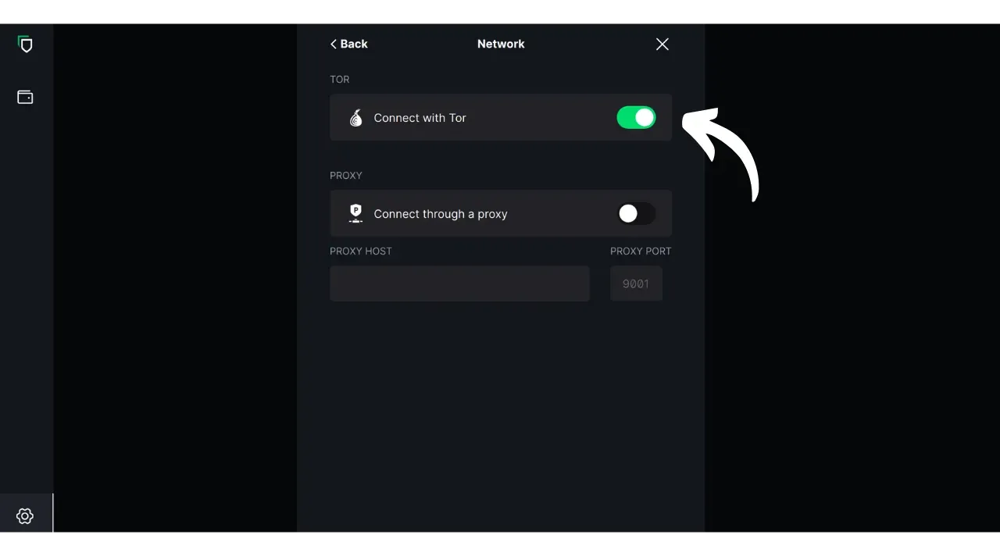

Pour les utilisateurs qui disposent de leur nœud complet, Green offre la possibilité de s'y connecter via un serveur Electrum, ce qui garantit un contrôle total sur les informations du réseau Bitcoin et sur la diffusion des transactions. Pour ce faire, cliquez sur le menu "*Custom servers and validation*", puis entrez les informations de votre serveur Electrum.

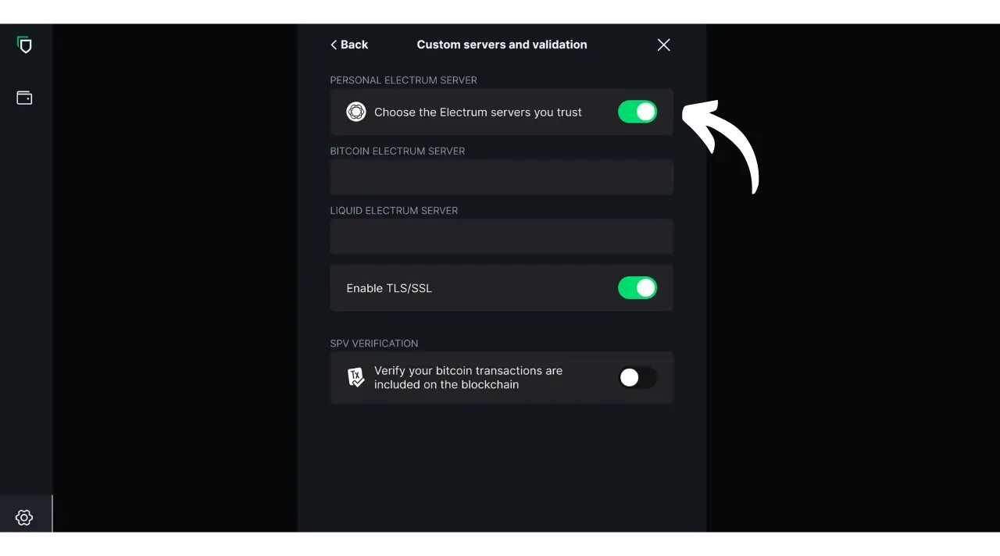

Une autre fonctionnalité alternative est l’option "*SPV Verification*", qui permet de vérifier directement certaines données de la blockchain et donc de réduire le besoin de confiance envers le nœud par défaut de Blockstream, bien que cette méthode ne fournisse pas toutes les garanties d’un nœud complet. Cette option se trouve également dans le menu "*Custom servers and validation*".

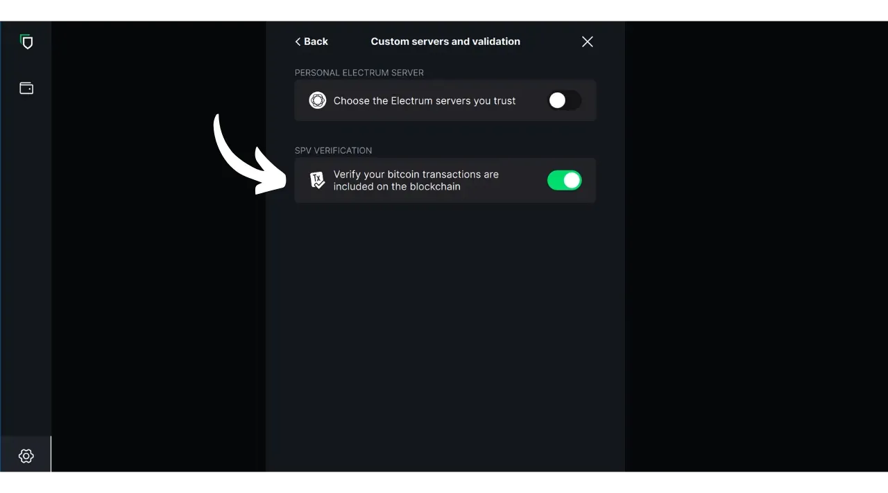

Une fois ces paramètres ajustés selon vos besoins, vous pouvez quitter cette interface.

## Importer un portefeuille Bitcoin sur Blockstream Green

Vous êtes maintenant prêt à importer votre portefeuille Bitcoin. Cliquez sur le bouton "**Get Started**".

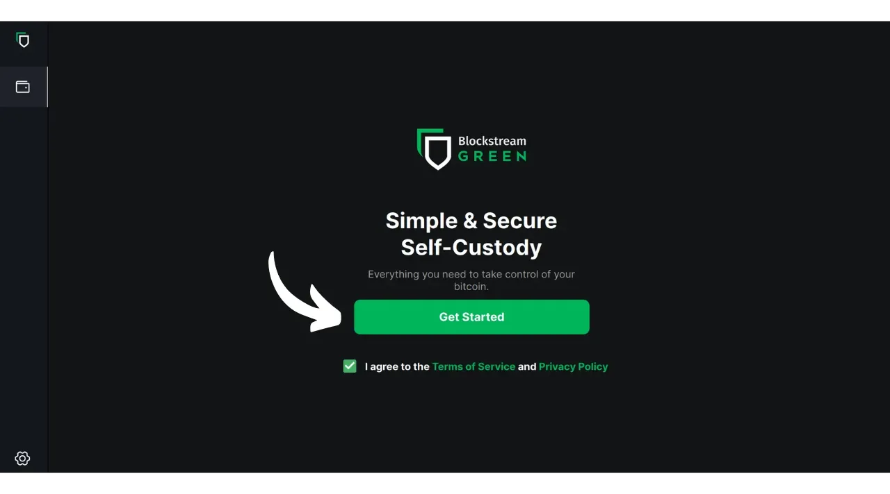

Vous avez le choix entre créer un portefeuille logiciel en local ou gérer un portefeuille froid via un hardware wallet. Pour ce tutoriel, nous nous concentrons sur la gestion d'un hardware wallet, donc vous devrez sélectionner l'option "*On Hardware Wallet*".

L'option "*Watch-only*", quant à elle, vous permet d'importer une clé publique étendue (`xpub`) pour consulter les transactions d’un portefeuille sans pouvoir dépenser les fonds associés.

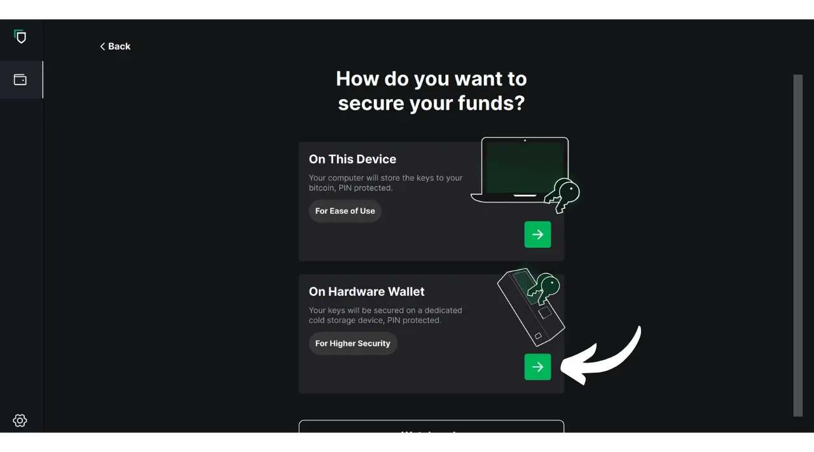

Si vous utilisez un Jade, cliquez sur le bouton correspondant. Sinon, sélectionnez "*Connect a different Hardware Device*". Dans mon cas, j'utilise un Ledger Nano S. Pour les utilisateurs de Ledger, assurez-vous d'installer l'application "*Bitcoin Legacy*" sur votre hardware wallet, car Green ne prend en charge que cette version.

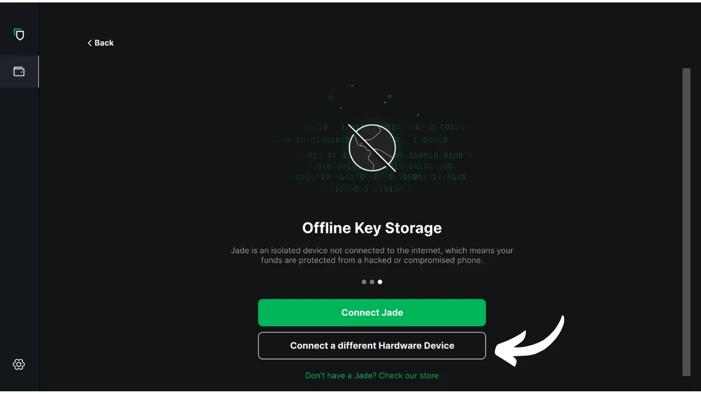

Branchez votre hardware wallet à l'ordinateur et sélectionnez-le sur Green.

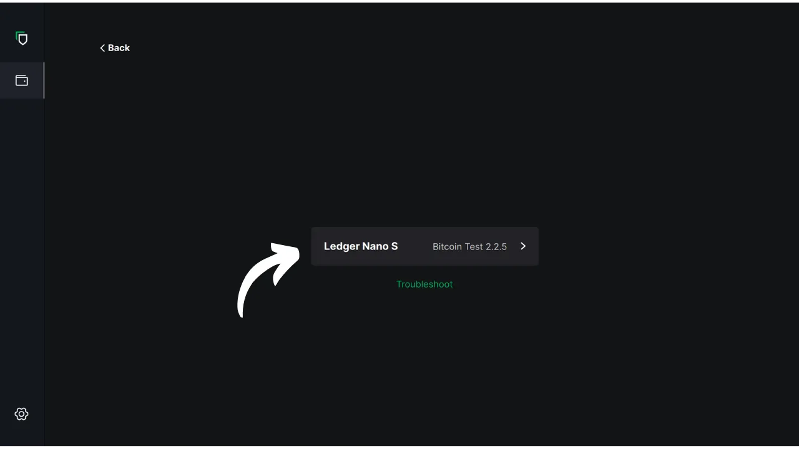

Patientez le temps que Green importe les informations de votre portefeuille, après quoi vous pourrez y accéder.

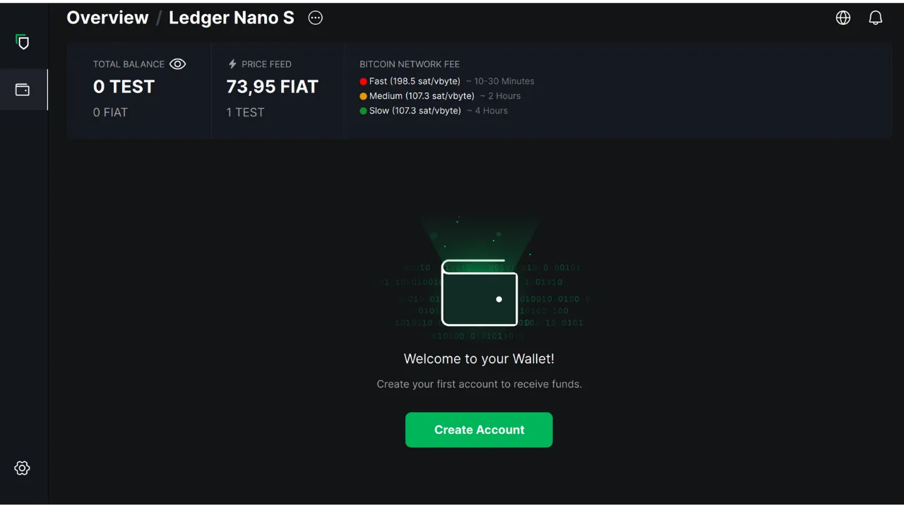

À ce stade, deux scénarios sont possibles. Si vous aviez déjà utilisé votre hardware wallet auparavant, vous devriez voir votre compte apparaître sur le logiciel. Mais si, comme moi, vous venez juste d'initialiser votre hardware wallet en générant une phrase mnémonique sans l'avoir encore utilisé, vous devrez créer un compte. Cliquez sur "*Create Account*".

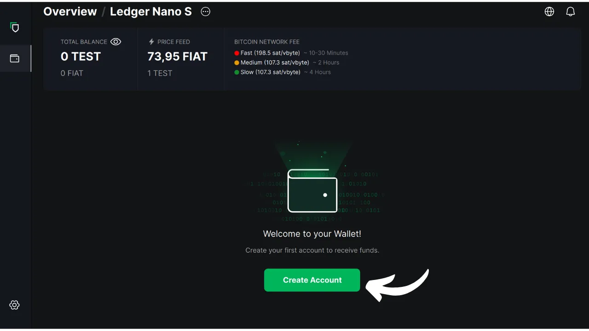

Choisissez "*Standard*" si vous souhaitez utiliser un portefeuille classique.

Vous avez maintenant accès à votre compte.

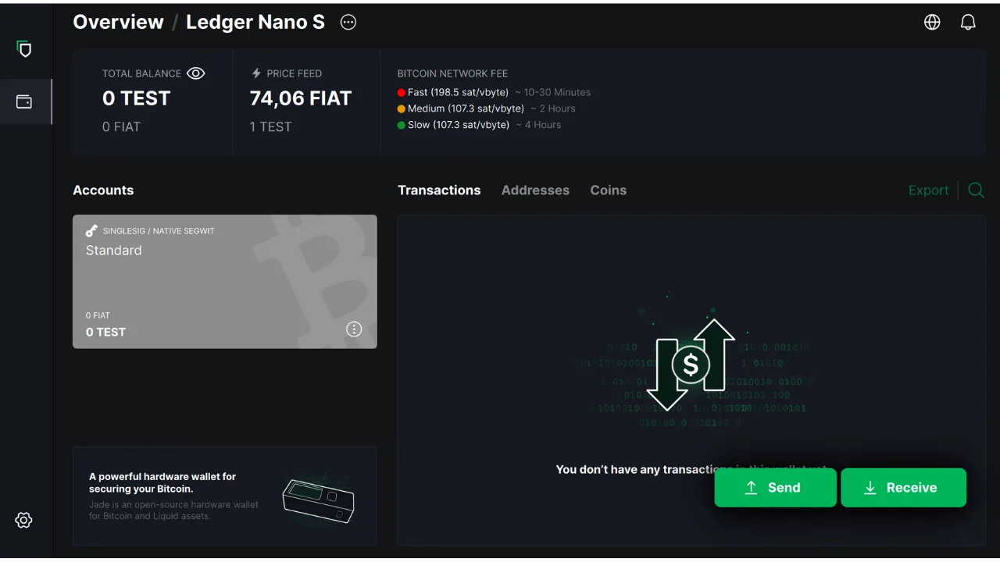

## Utiliser un hardware wallet avec Blockstream Green

Maintenant que votre portefeuille Bitcoin est configuré, vous êtes prêt à recevoir vos premiers sats ! Pour cela, cliquez simplement sur le bouton "*Receive*".

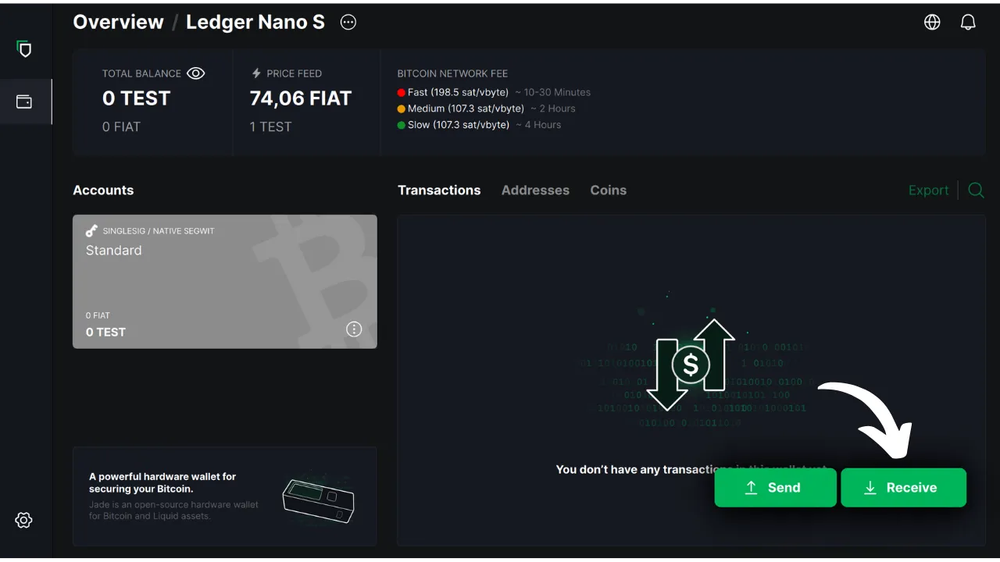

Cliquez sur le bouton "*Copy address*" pour copier l'adresse, ou bien scannez son QR code.

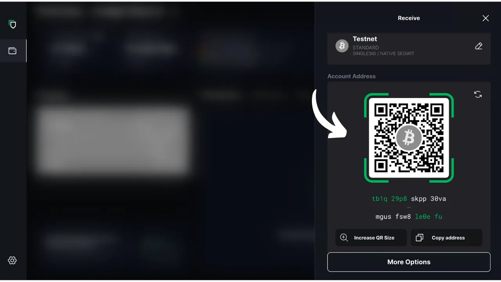

Une fois la transaction diffusée sur le réseau, elle apparaîtra dans votre portefeuille. Attendez d'obtenir suffisamment de confirmations pour considérer la transaction comme immuable.

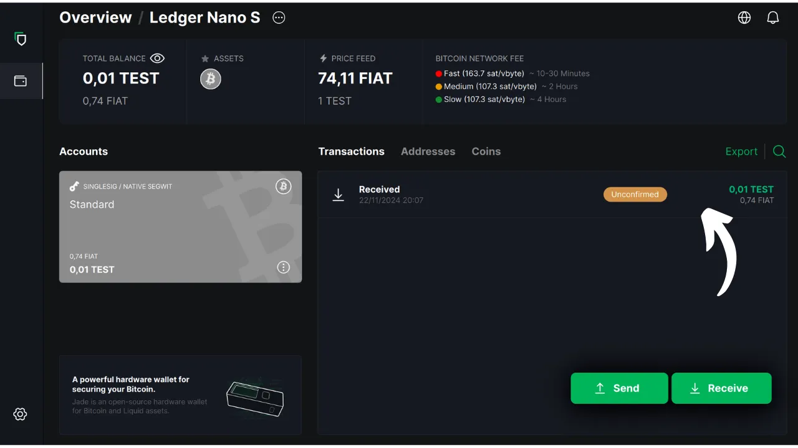

Avec des bitcoins dans votre portefeuille, vous êtes maintenant en mesure d'en envoyer. Cliquez sur le bouton "*Send*".

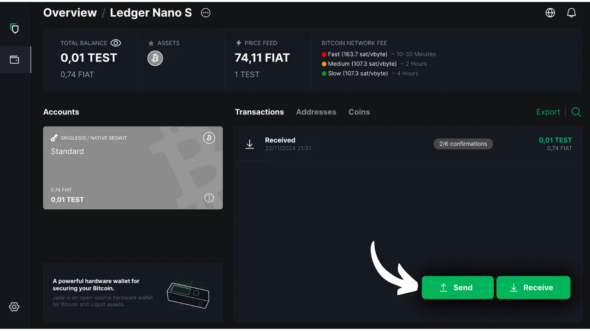

Sur la page suivante, saisissez l'adresse du destinataire. Vous pouvez l'entrer manuellement ou scanner un QR code avec votre webcam.

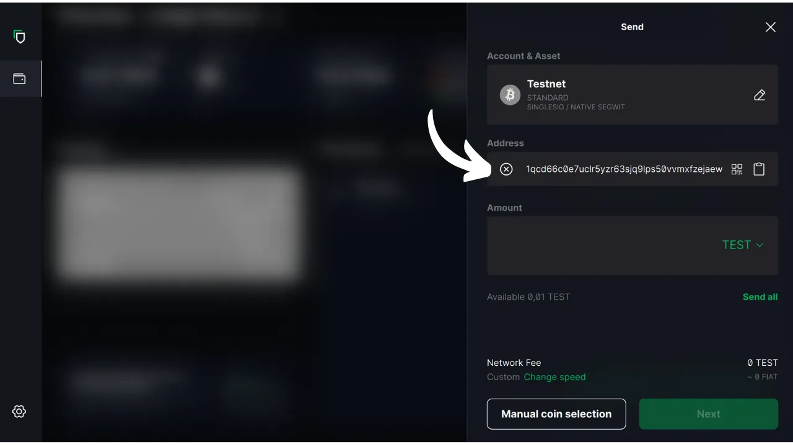

Choisissez le montant du paiement.

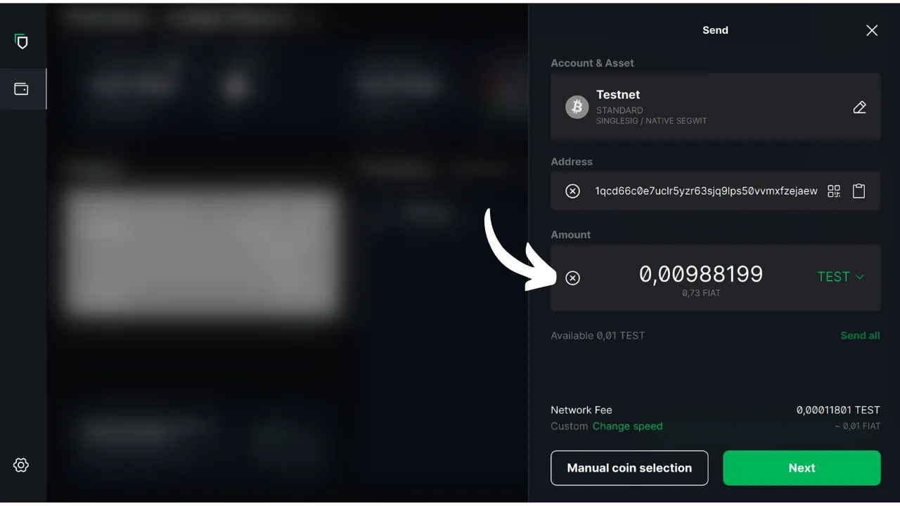

En bas de l'écran, vous pouvez sélectionner le taux de frais pour cette transaction. Vous avez le choix de suivre les recommandations de l'application ou de personnaliser vos frais. Plus les frais sont élevés par rapport aux autres transactions en attente, plus vite votre transaction sera traitée. Pour connaitre le marché de frais, vous pouvez consulter le site [Mempool.space](https://mempool.space/) dans la section "*Transaction Fees*".

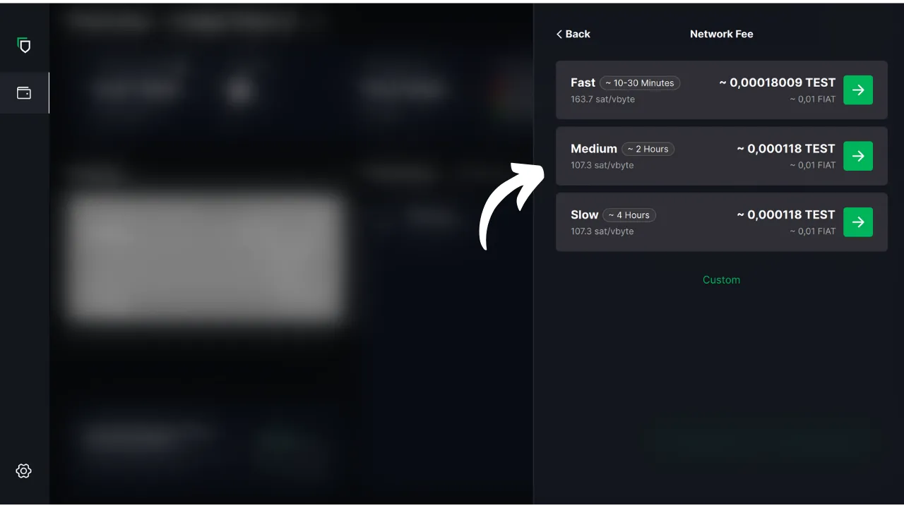

Si vous souhaitez sélectionner spécifiquement quels UTXOs utiliser dans votre transaction, cliquez sur le bouton "*Manual coin selection*".

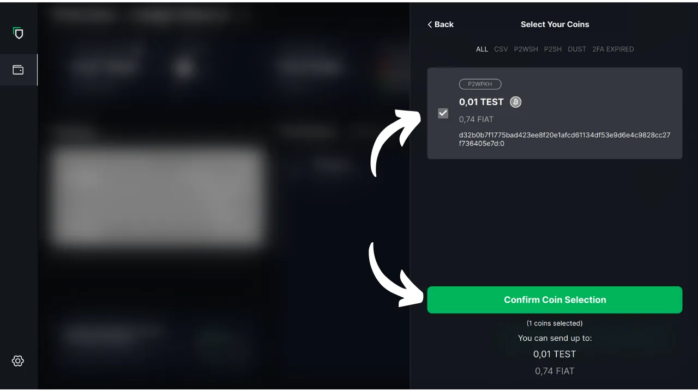

Vérifiez les paramètres de votre transaction et, si tout est conforme à vos attentes, cliquez sur "*Next*".

Vérifiez une nouvelle fois que l'adresse, le montant et les frais sont corrects, puis cliquez sur "*Confirm transaction*".

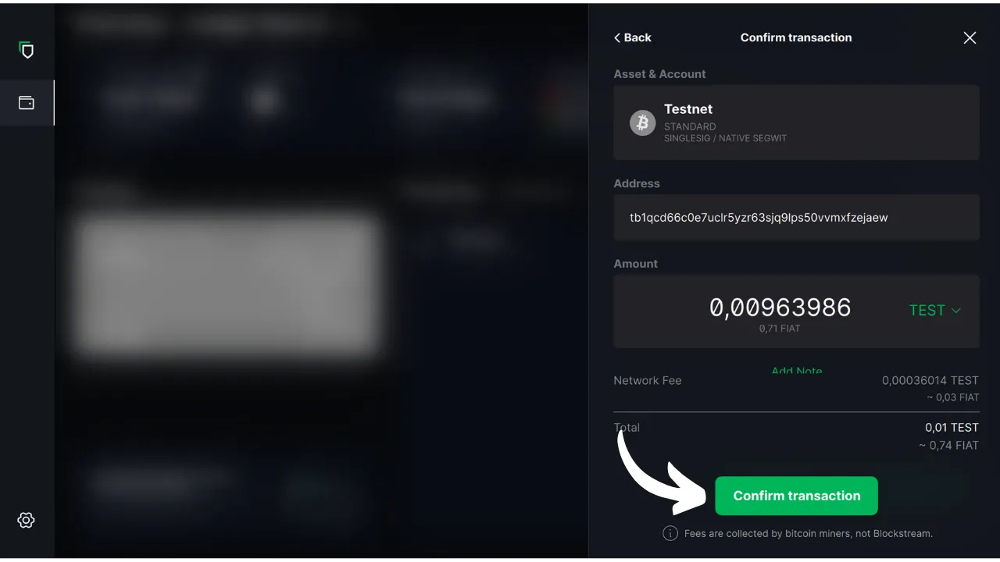

Assurez-vous que tous les paramètres de la transaction sont corrects sur l'écran de votre hardware wallet, puis signez la transaction à l'aide de celui-ci.

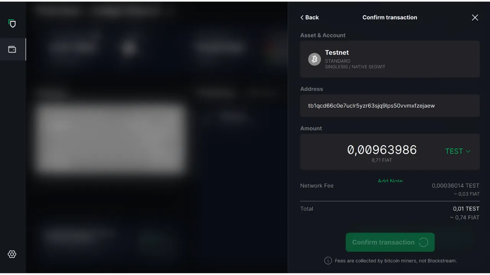

Une fois la transaction signée depuis le hardware wallet, Green la diffuse automatiquement sur le réseau Bitcoin. Votre transaction apparaîtra alors sur le tableau de bord de votre portefeuille Bitcoin, en attente de confirmation.

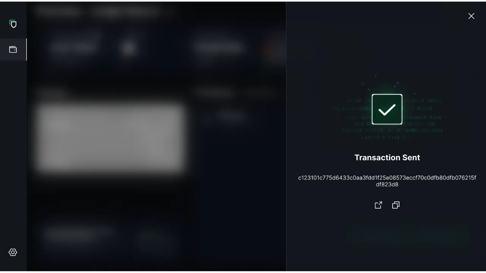

Et voilà, vous savez maintenant comment configurer facilement le logiciel Blockstream Green pour gérer votre portefeuille Bitcoin sur un hardware wallet.

Si vous avez trouvé ce tutoriel utile, je vous serais reconnaissant de laisser un pouce vert ci-dessous. N'hésitez pas à partager cet article sur vos réseaux sociaux. Merci beaucoup !

Je vous conseille également de découvrir cet autre tutoriel complet sur l'application mobile Blockstream Green pour mettre en place un portefeuille chaud :

https://planb.network/tutorials/wallet/blockstream-green
