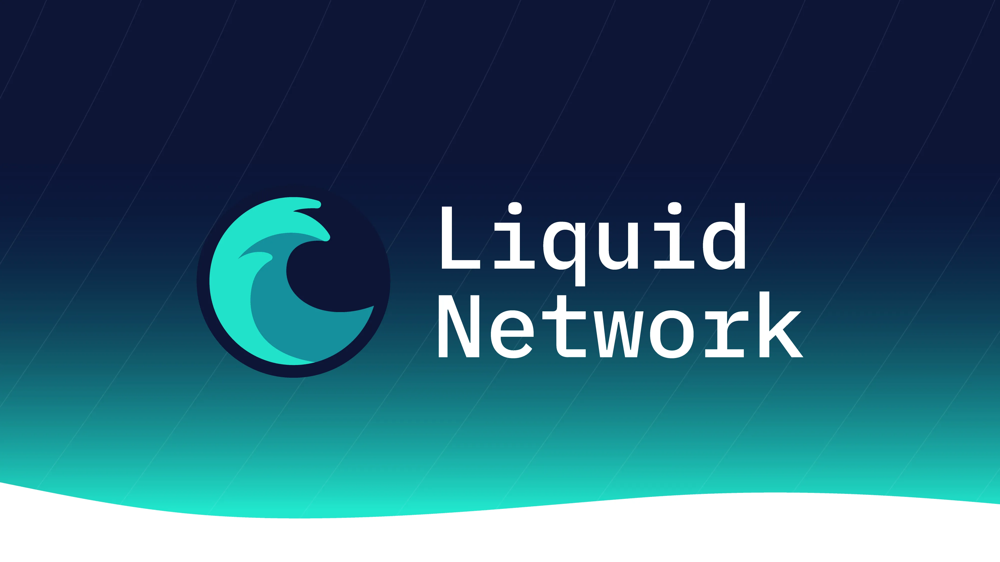
Le protocole Bitcoin présente des limitations techniques intentionnelles qui permettent de maintenir la décentralisation du réseau et d'assurer une distribution de la sécurité parmi tous les utilisateurs. Cependant, ces limites peuvent parfois frustrer les utilisateurs, notamment lors de congestions dues à un volume élevé de transactions simultanées. Le débat sur la scalabilité de Bitcoin a longtemps divisé la communauté, en particulier lors de la Blocksize War. Depuis cet épisode, il est largement reconnu au sein de la communauté Bitcoin que l'évolutivité doit être assurée par des solutions off-chain, sur des systèmes de seconde couche. Parmi ces solutions, il y a les sidechains, qui sont encore relativement méconnues et peu utilisées comparativement à d'autres systèmes comme le Lightning Network.

Une sidechain est une blockchain indépendante qui fonctionne en parallèle de la blockchain principale de Bitcoin. Elle utilise le bitcoin comme unité de compte grâce à un mécanisme appelé "*two-way peg*". Ce système permet de verrouiller des bitcoins sur la chaîne principale afin de reproduire leur valeur sur la sidechain, où ils circulent sous forme de tokens adossés aux bitcoins d'origine. Ces tokens conservent normalement une parité de valeur avec les bitcoins verrouillés sur la chaîne principale, et le processus peut être inversé pour récupérer les fonds sur Bitcoin.

L'objectif des sidechains est d'offrir des fonctionnalités supplémentaires ou des améliorations techniques, comme des transactions plus rapides, des frais réduits ou la prise en charge de contrats intelligents. Ces innovations ne peuvent pas toujours être mises en œuvre directement sur la blockchain de Bitcoin sans en compromettre la décentralisation ou la sécurité. Les sidechains permettent donc de tester et d’explorer de nouvelles solutions tout en préservant l’intégrité de Bitcoin. Cependant, ces protocoles nécessitent souvent des compromis, notamment en matière de décentralisation et de sécurité, en fonction du modèle de gouvernance et du mécanisme de consensus choisi.

Aujourd'hui, la sidechain la plus connue est probablement Liquid. Dans ce tutoriel, je vous propose d'abord de découvrir ce qu'est Liquid, puis de vous guider pour commencer à l'utiliser facilement grâce à l'application Blockstream Green, afin de profiter de ses avantages.

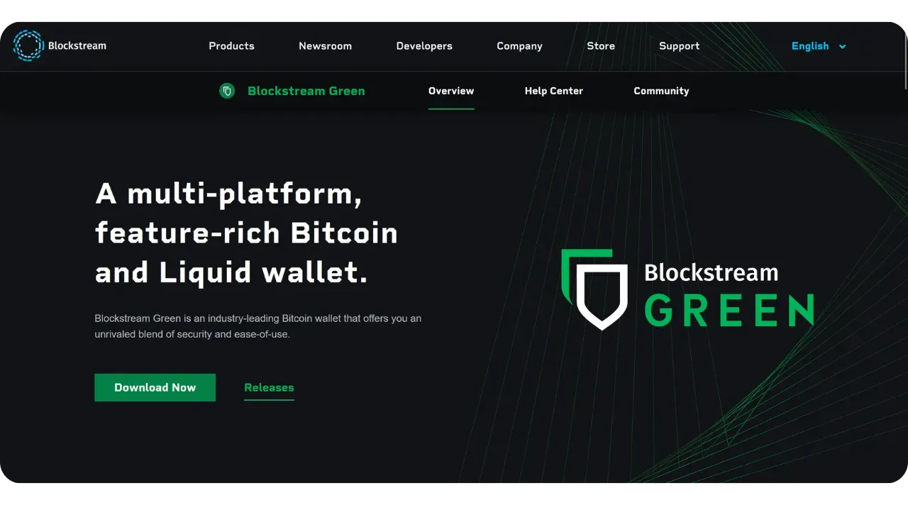

## C'est quoi Liquid Network ?

Liquid est une sidechain fédérée en surcouche de Bitcoin, développée par Blockstream, qui vise à améliorer la vitesse, la confidentialité et les fonctionnalités des transactions. Elle utilise un mécanisme d’ancrage bilatéral établi sur une fédération pour verrouiller les bitcoins sur la chaîne principale et créer en contrepartie des Liquid-bitcoins (L-BTC), des tokens circulant sur Liquid tout en restant adossés aux bitcoins originaux.

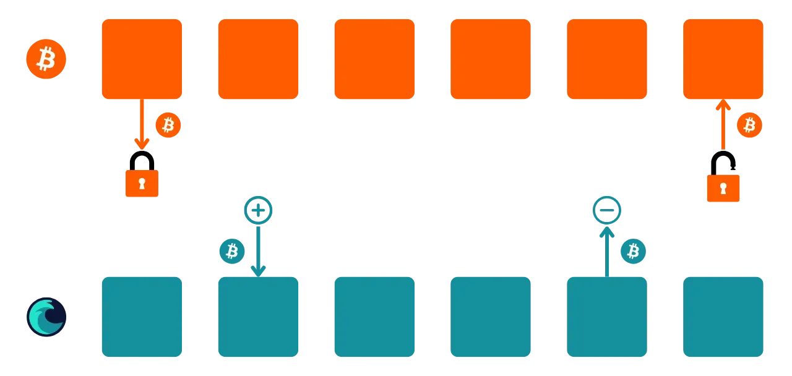

Le réseau Liquid repose sur une fédération de participants, composée d’entités reconnues de l’écosystème Bitcoin, qui valident les blocs et gèrent l’ancrage bilatéral. En plus des L-BTC, Liquid permet également l’émission d’autres actifs numériques, comme des stablecoins ou d'autres cryptomonnaies.

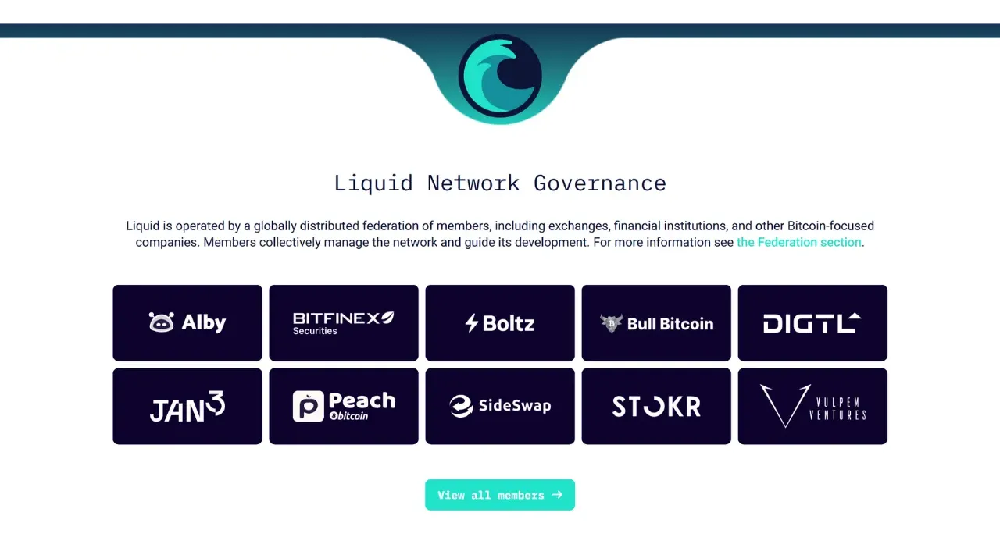

## Présentation de Blockstream Green

Blockstream Green est un portefeuille logiciel disponible sur mobile et sur ordinateur. Anciennement connu sous le nom de *Green Address*, ce portefeuille est devenu un projet Blockstream suite à son acquisition en 2016.

Green est une application particulièrement facile à utiliser, ce qui la rend intéressante pour les débutants. Elle propose toutes les fonctionnalités essentielles d'un bon portefeuille Bitcoin, notamment RBF (*Replace-by-Fee*), une option de connexion via Tor, la capacité de connecter son propre nœud, l'option SPV (*Simple Payment Verification*), l'étiquetage et le contrôle des pièces.

Blockstream Green prend également en charge le réseau Liquid, et c'est ce que nous allons découvrir dans ce tutoriel. Si vous souhaitez utiliser Green pour d'autres applications, je vous recommande de consulter également ces autres tutoriels :

https://planb.network/tutorials/wallet/desktop/blockstream-green-desktop-c1503adf-1404-4328-b814-aa97fcf0d5da

https://planb.network/tutorials/wallet/mobile/blockstream-green-e84edaa9-fb65-48c1-a357-8a5f27996143

https://planb.network/tutorials/wallet/mobile/blockstream-green-e84edaa9-fb65-48c1-a357-8a5f27996143-watch-only

## Installer et paramétrer l'application Blockstream Green

La première étape est naturellement de télécharger l'application Green. Rendez-vous sur votre store d'applications :
- [Pour Android](https://play.google.com/store/apps/details?id=com.greenaddress.greenbits_android_wallet) ;
- [Pour Apple](https://apps.apple.com/us/app/green-bitcoin-wallet/id1402243590).

Pour les utilisateurs Android, vous avez aussi la possibilité d'installer l'application via le fichier `.apk` [disponible sur le GitHub de Blockstream](https://github.com/Blockstream/green_android/releases).

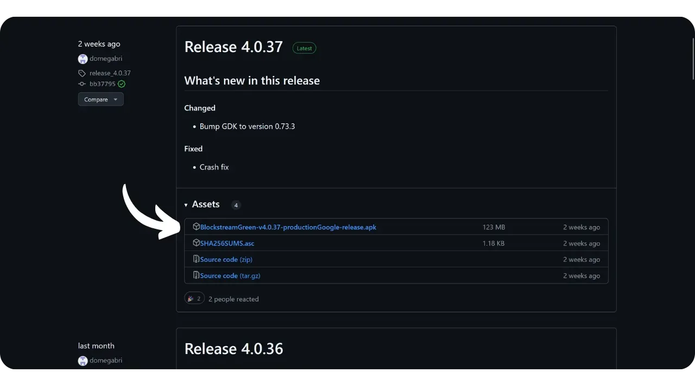

Lancez l'application, puis cochez la case "*J'accepte les conditions...*".

Lorsque vous ouvrez Green pour la première fois, l’écran d’accueil s’affiche sans portefeuille configuré. Plus tard, si vous créez ou importez des portefeuilles, ils apparaîtront dans cette interface. Avant de passer à la création d’un portefeuille, je vous conseille d’ajuster les paramètres de l’application en fonction de vos attentes. Cliquez sur "*Paramètres de l'application*".

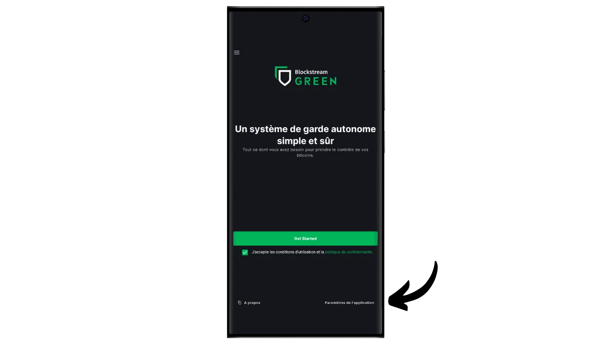

L’option "*Enhanced Privacy*", disponible uniquement sur Android, améliore la confidentialité en désactivant les captures d’écran et en masquant les aperçus d’application. Elle verrouille également automatiquement l’accès à l’application dès que votre téléphone est verrouillé, ce qui rend vos données plus difficiles à exposer.

Pour ceux qui souhaitent renforcer leur confidentialité, l’application propose de rooter votre trafic via Tor, un réseau permettant de chiffrer toutes vos connexions et de rendre vos activités difficiles à tracer. Bien que cette option puisse légèrement ralentir le fonctionnement de l’application, elle est fortement recommandée pour protéger votre vie privée, surtout si vous n'utilisez pas votre propre nœud complet.

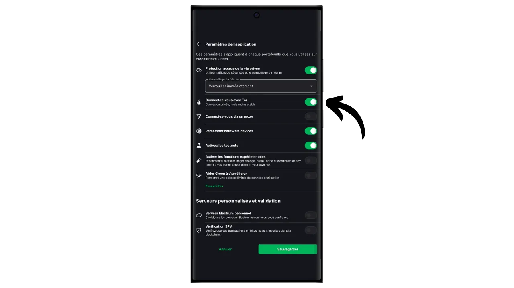

Pour les utilisateurs qui disposent de leur nœud complet, Green Wallet offre la possibilité de s'y connecter via un serveur Electrum, ce qui garantit un contrôle total sur les informations du réseau Bitcoin et sur la diffusion des transactions. Mais cette fonctionnalité concerne les portefeuilles Bitcoin classiques, donc vous n'en avez pas besoin si vous utilisez Liquid.

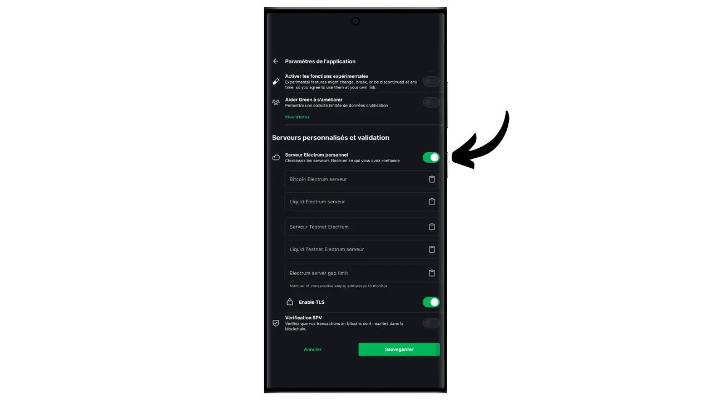

Une autre fonctionnalité alternative est l’option "*SPV Verification*", qui permet de vérifier directement certaines données de la blockchain et donc de réduire le besoin de confiance envers le nœud par défaut de Blockstream, bien que cette méthode ne fournisse pas toutes les garanties d’un nœud complet. Encore une fois, cela concernera uniquement vos portefeuilles Bitcoin onchain, et pas Liquid.

Une fois ces paramètres ajustés selon vos besoins, cliquez sur le bouton "*Sauvegarder*" et redémarrez l’application.

## Créer un portefeuille Liquid sur Blockstream Green

Vous êtes maintenant prêt à créer un portefeuille Liquid. Cliquez sur le bouton "*Get Started*".

Vous avez le choix entre créer un portefeuille logiciel en local ou gérer un portefeuille froid via un hardware wallet. Pour ce tutoriel, nous nous concentrons sur la création d'un portefeuille chaud sur Liquid, donc vous devrez sélectionner l'option "*On This Device*". Vous pouvez également utiliser un hardware wallet compatible, tel que le Blockstream Jade, pour sécuriser votre portefeuille Liquid.

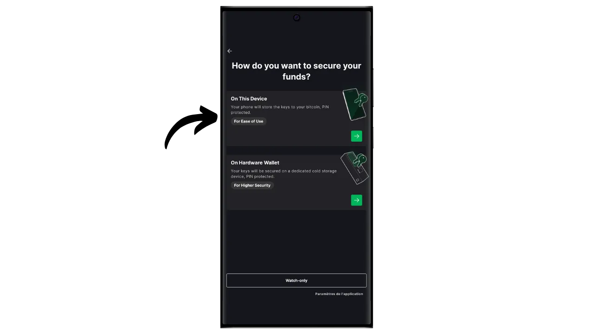

Vous pouvez ensuite choisir de restaurer un portefeuille Bitcoin existant ou d'en créer un nouveau. Pour les besoins de ce tutoriel, nous allons créer un nouveau portefeuille. Cependant, si vous devez régénérer un portefeuille Liquid déjà existant à partir de sa phrase mnémonique, par exemple suite à la perte de votre hardware wallet, vous devrez choisir la seconde option.

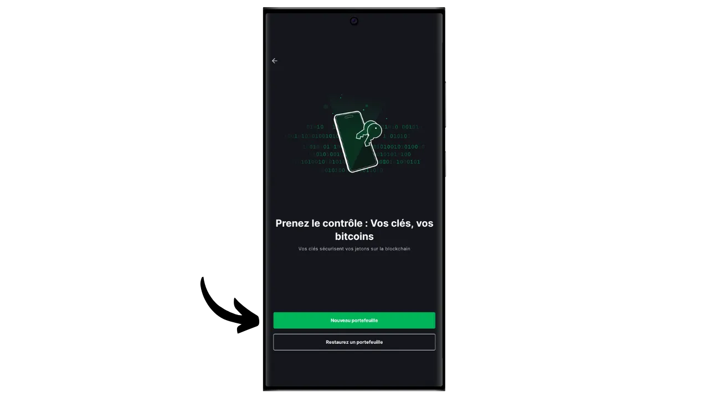

Vous avez ensuite le choix entre une phrase mnémonique de 12 mots ou de 24 mots. Cette phrase vous permettra de récupérer l'accès à votre portefeuille depuis n'importe quel logiciel compatible en cas de problème sur votre téléphone. Actuellement, opter pour une phrase de 24 mots n'offre pas plus de sécurité qu'une phrase de 12 mots. Je vous recommande donc de choisir une phrase mnémonique de **12 mots**.

Green vous fournira ensuite votre phrase mnémonique. Avant de continuer, assurez-vous de ne pas être observé. Cliquez sur "*Afficher la phrase de récupération*" pour l'afficher à l'écran.

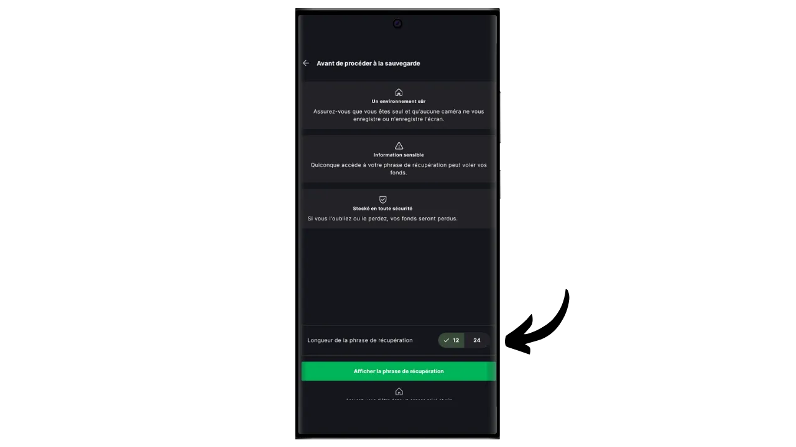

**Cette phrase mnémonique donne un accès complet et non restreint à tous vos bitcoins.** N'importe qui en possession de cette phrase peut subtiliser vos fonds, même sans accès physique à votre téléphone.

Elle permet de restaurer l'accès à vos bitcoins en cas de perte, de vol ou de casse de votre téléphone. Il est donc très important de la sauvegarder soigneusement **sur un support physique (pas numérique)** et de la stocker dans un endroit sécurisé. Vous pouvez l'inscrire sur un bout de papier, ou bien pour plus de sécurité, si ce portefeuille est important, je vous recommande de la graver sur un support en acier inoxydable afin de la protéger contre les risques d'incendies, d'inondations ou d'écroulements (pour un portefeuille chaud destiné à sécuriser une petite quantité de bitcoins, une simple sauvegarde sur papier est probablement suffisante).

*Évidemment, vous ne devez jamais partager ces mots sur internet, contrairement à ce que je fais dans ce tutoriel. Ce portefeuille en exemple sera utilisé uniquement sur le Testnet de Liquid et sera supprimé à l'issue du tutoriel.*

Après avoir correctement noté votre phrase mnémonique sur un support physique, cliquez sur "*Continuez*". Green Wallet vous demandera ensuite de confirmer certains mots de votre phrase pour vérifier que vous les avez bien enregistrés. Complétez les espaces avec les mots manquants.

Choisissez le code PIN de votre appareil, qui vous servira à déverrouiller votre portefeuille Green. C'est donc une protection contre les accès physiques non autorisés. Ce code PIN n'intervient pas dans la dérivation des clés cryptographiques de votre portefeuille. Ainsi, même sans accès à ce code PIN, la possession de votre phrase mnémonique de 12 ou 24 mots vous permettra de retrouver l'accès à vos bitcoins.

Il est recommandé de choisir un code PIN de 6 chiffres le plus aléatoire possible. Assurez-vous également de sauvegarder ce code pour ne pas l'oublier, sans quoi vous serez contraint de récupérer votre portefeuille depuis la phrase mnémonique. Vous pourrez par la suite ajouter une option de blocage par biométrie afin d’éviter de rentrer le PIN à chaque utilisation. De façon générale, la biométrie est bien moins sécurisée que le PIN en lui-même. Ainsi, par défaut, je vous déconseille de mettre en place cette option de déverrouillage.

Entrez votre PIN une seconde fois pour le confirmer.

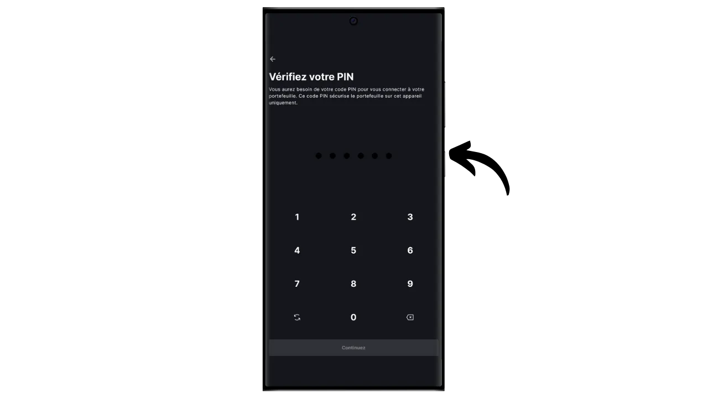

Patientez le temps de la création de votre portefeuille, puis cliquez sur le bouton "*Créer un compte*".

Dans la case "*Actifs*", sélectionnez "*Liquid Bitcoin*". Vous avez ensuite le choix entre un portefeuille standard à signature unique, que nous utiliserons dans ce tutoriel, ou un portefeuille protégé par une authentification à deux facteurs (2FA).

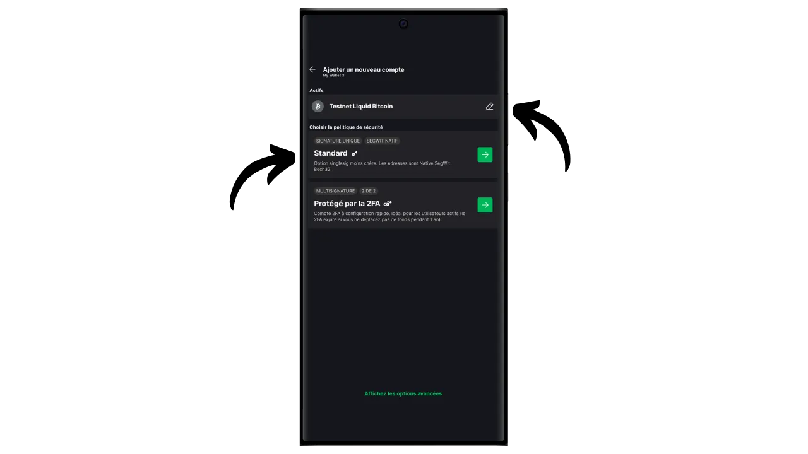

Et voilà, votre portefeuille Liquid a bien été créé à l'aide de l'application Green !

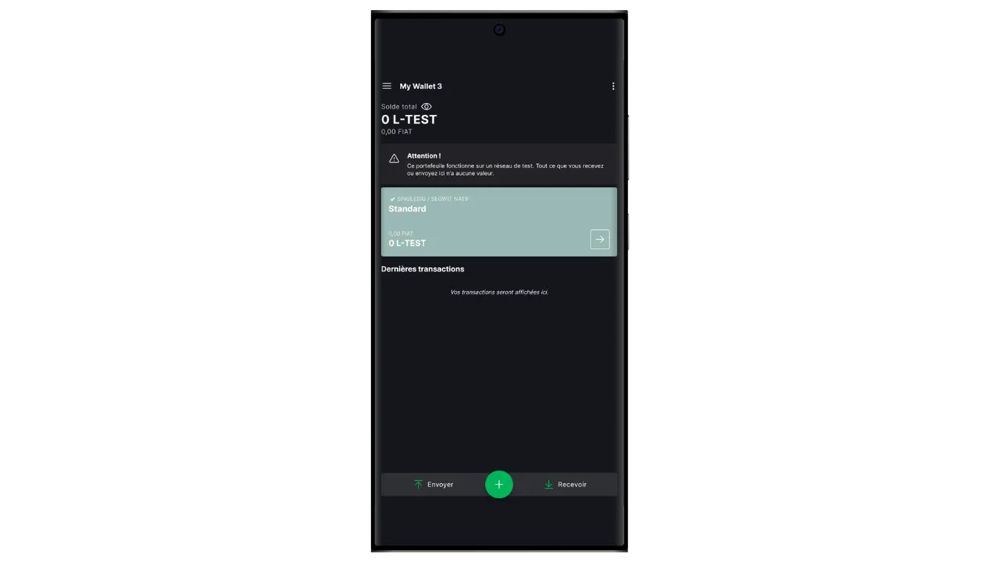

Avant de recevoir vos premiers bitcoins sur votre portefeuille Liquid, **je vous conseille vivement de réaliser un test de récupération à vide**. Notez une information de référence, telle que votre xpub ou la première adresse de réception, puis supprimez votre portefeuille sur l'application Green tant qu'il est encore vide. Ensuite, essayez de restaurer votre portefeuille sur Green en utilisant vos sauvegardes papier. Vérifiez que l'information témoin générée après la restauration correspond à celle que vous aviez notée initialement. Si c'est le cas, vous pouvez être assuré que vos sauvegardes papier sont fiables. Pour en savoir plus sur comment effectuer un test de récupération, je vous conseille de consulter cet autre tutoriel :

https://planb.network/tutorials/wallet/backup/recovery-test-5a75db51-a6a1-4338-a02a-164a8d91b895

## Paramétrer votre portefeuille Liquid

Si vous souhaitez personnaliser votre portefeuille, cliquez sur les trois petits points en haut à droite.

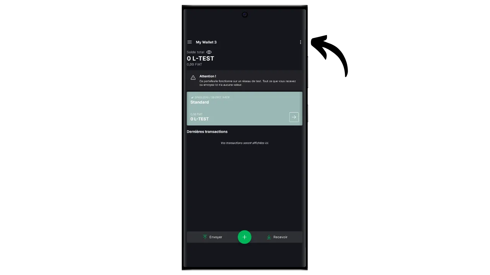

L'option "*Renommer*" vous permet de personnaliser le nom de votre portefeuille, ce qui est particulièrement utile si vous gérez plusieurs portefeuilles sur la même application.

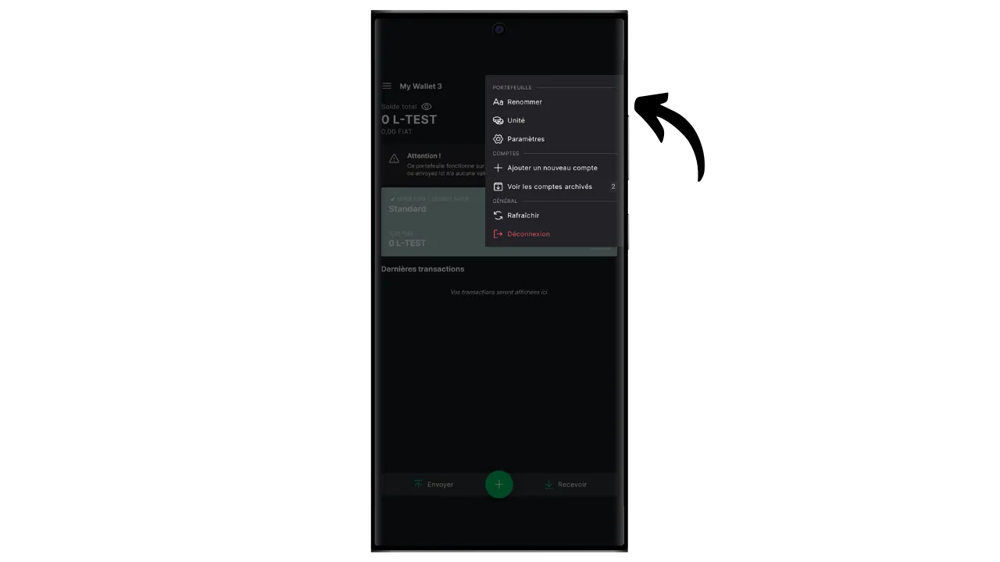

Le menu "*Unité*" vous donne la possibilité de changer l'unité de base de votre portefeuille. Vous pouvez par exemple choisir de l'afficher en satoshis plutôt qu'en bitcoins.

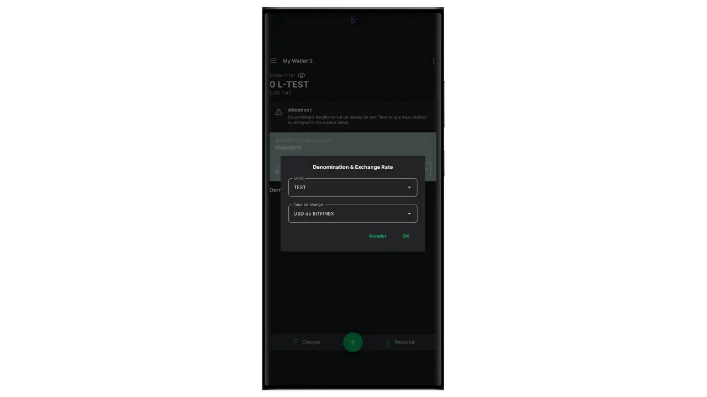

Le menu "*Paramètres*" offre un accès aux différentes options de votre portefeuille Bitcoin.

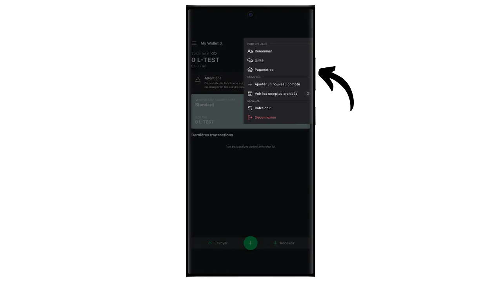

Vous y trouverez par exemple votre *descriptor* qui peut vous être utile si vous envisagez de configurer un portefeuille en mode watch-only à partir de ce portefeuille Liquid.

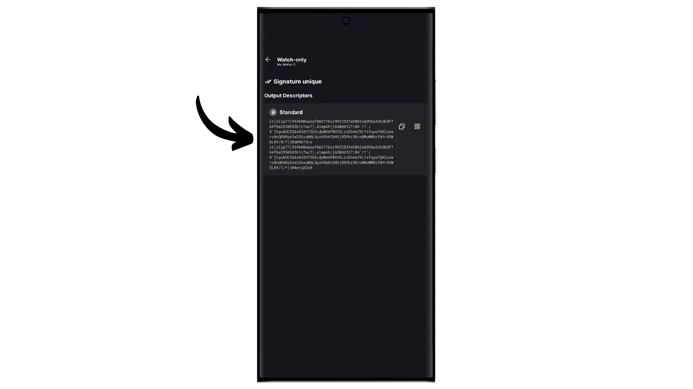

Vous pouvez aussi y modifier le code PIN de votre portefeuille et activer une connexion par biométrie.

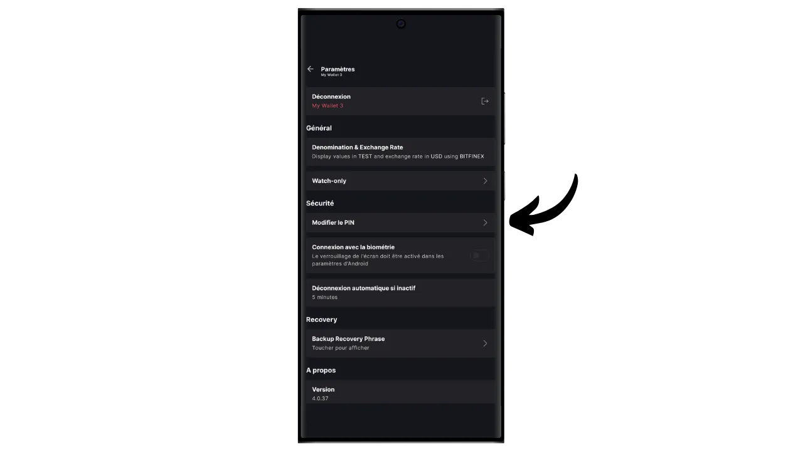

## Utiliser votre portefeuille Liquid

Maintenant que votre portefeuille Liquid est configuré, vous êtes prêt à recevoir vos premiers L-sats !

Si vous ne possédez pas encore de L-BTC, plusieurs options s'offrent à vous. La première est de vous en faire envoyer directement. Si quelqu'un souhaite vous payer en bitcoins sur Liquid, donnez-lui simplement une adresse de réception. L'autre solution est d'échanger vos bitcoins onchain ou sur le réseau Lightning contre des L-BTC. Pour ce faire, vous pouvez utiliser [un bridge tel que Boltz](https://boltz.exchange/). Entrez simplement votre adresse Liquid sur le site, puis effectuez le paiement soit via le réseau Lightning, soit onchain.

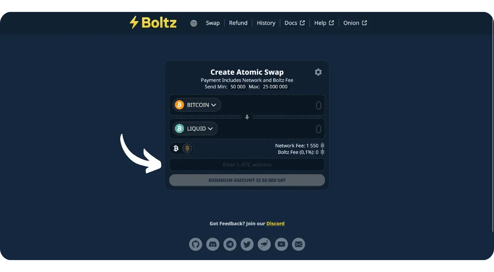

Pour générer une adresse Liquid, cliquez sur le bouton "*Recevoir*".

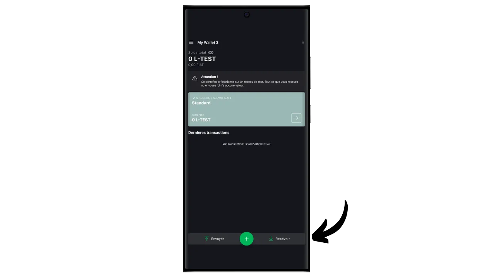

Green affichera alors la première adresse de réception vierge de votre portefeuille. Vous pouvez soit scanner le QR code associé, soit copier l'adresse directement pour y envoyer des L-BTC.

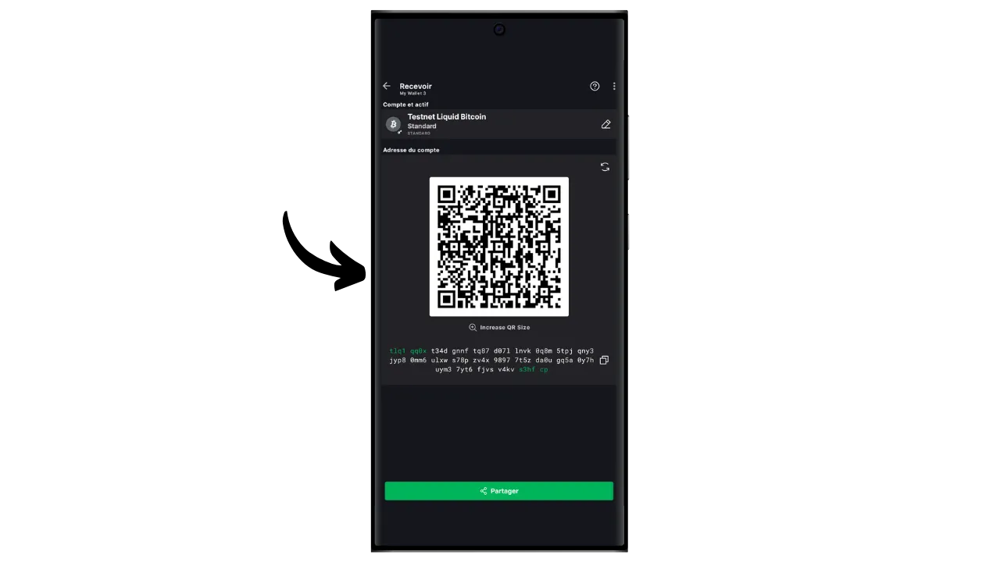

Quand la transaction est diffusée sur le réseau, elle apparaîtra dans votre portefeuille.

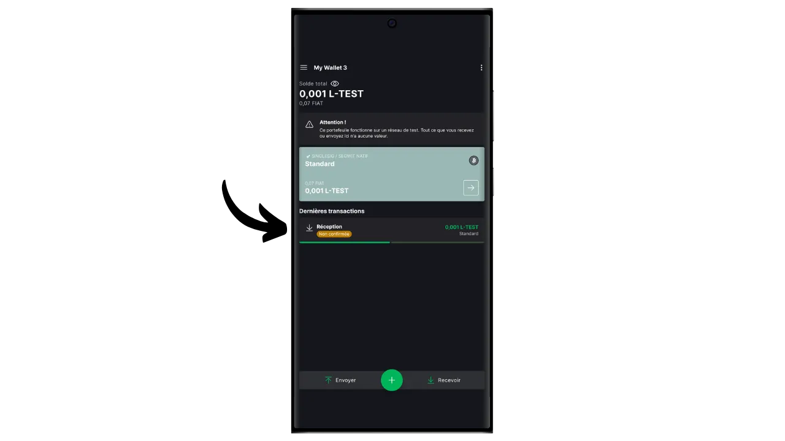

Attendez d'obtenir suffisamment de confirmations pour considérer la transaction comme définitive. Sur Liquid, les confirmations devraient être rapides, car un bloc y est publié toutes les minutes.

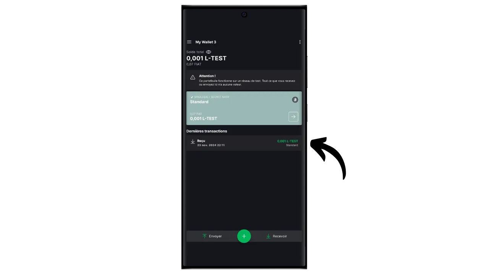

Avec des L-sats dans votre portefeuille Liquid, vous pouvez maintenant également en envoyer. Cliquez sur "*Envoyer*".

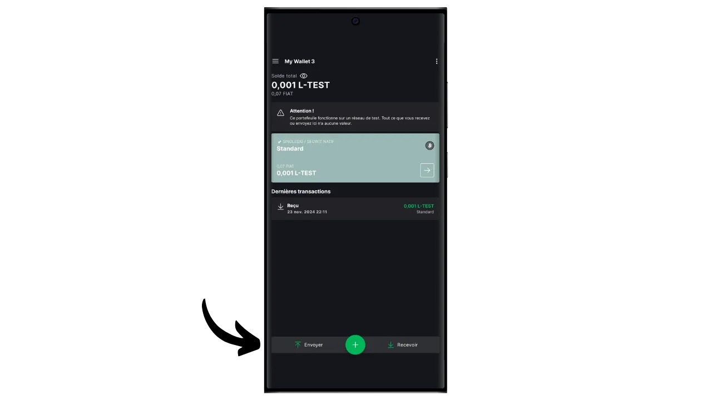

Sur la page suivante, entrez l'adresse Liquid du destinataire. Vous pouvez la saisir manuellement ou scanner son QR code.

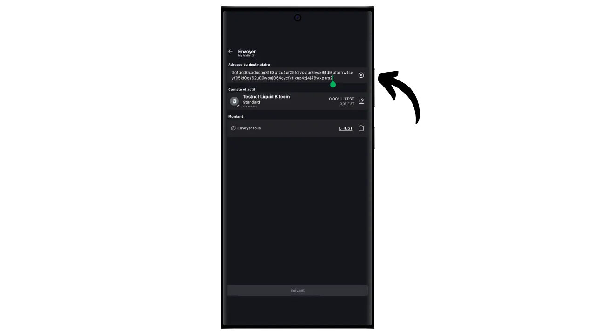

Choisissez le montant du paiement.

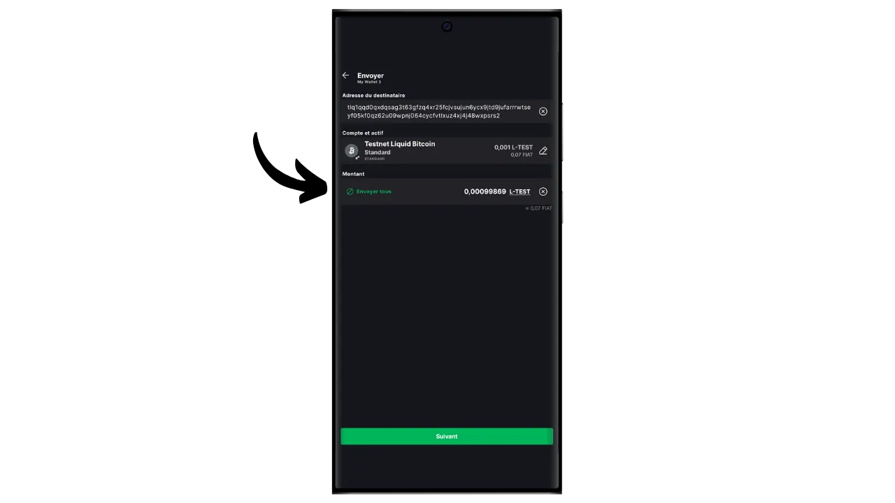

Cliquez sur "*Suivant*" pour accéder à un écran récapitulatif de votre transaction. Vérifiez que l'adresse, le montant et les frais sont corrects.

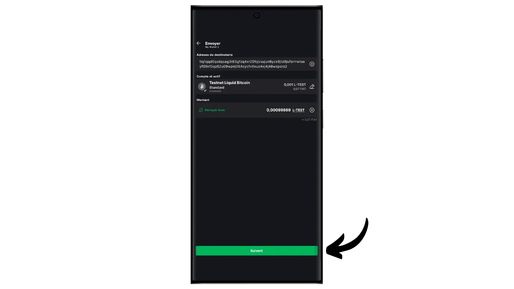

Si tout vous convient, faites glisser le bouton vert en bas de l'écran vers la droite pour signer et diffuser la transaction sur le réseau Bitcoin.

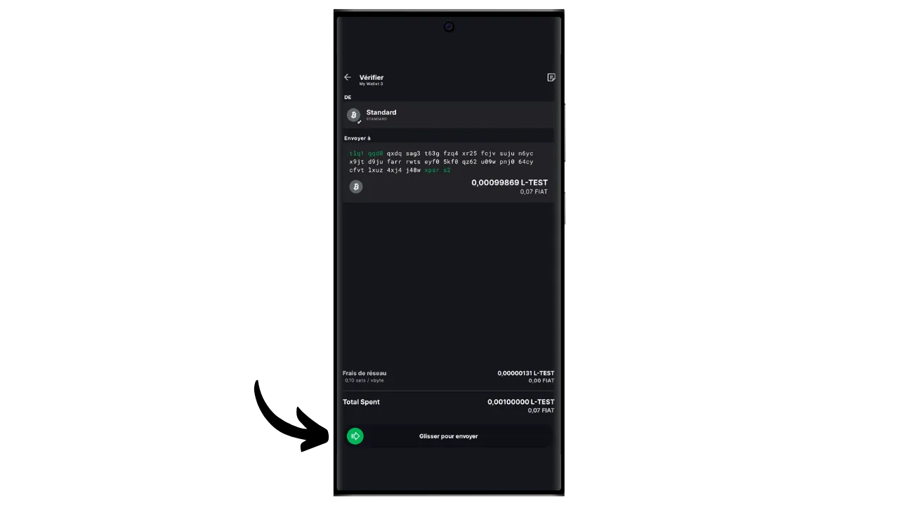

Votre transaction apparaîtra maintenant sur le tableau de bord de votre portefeuille Bitcoin en attente de confirmation.

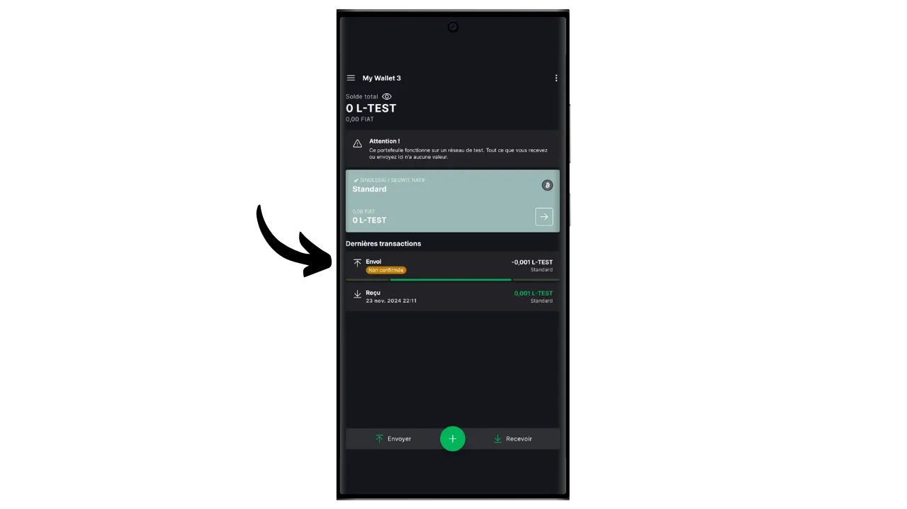

Et voilà, vous savez maintenant comment utiliser la sidechain Liquid facilement avec l'application Blockstream Green !

Si vous avez trouvé ce tutoriel utile, je vous serais reconnaissant de laisser un pouce vert ci-dessous. N'hésitez pas à partager cet article sur vos réseaux sociaux. Merci beaucoup !

Je vous conseille également de découvrir cet autre tutoriel complet sur l'application mobile Blockstream Green pour mettre en place un portefeuille chaud Bitcoin onchain :

https://planb.network/tutorials/wallet/mobile/blockstream-green-e84edaa9-fb65-48c1-a357-8a5f27996143
