Dans ce tutoriel, vous allez découvrir comment mettre en place facilement un portefeuille "*watch-only*" sur mobile grâce à l'application Blockstream Green.

## C'est quoi un Watch-Only Wallet ?

Un portefeuille en lecture seule, ou "*watch-only wallet*", est un type de logiciel conçu pour permettre à l'utilisateur d'observer les transactions associées à une ou plusieurs clés publiques Bitcoin spécifiques, sans pour autant avoir accès aux clés privées correspondantes.

Ce type d'application conserve uniquement les données nécessaires à la surveillance d'un portefeuille Bitcoin, notamment pour voir son solde et son historique des transactions, mais elle n'a pas accès aux clés privées. Ainsi, il est impossible de dépenser les bitcoins détenus par le portefeuille sur l'application watch-only.

On utilise généralement le watch-only en plus d'un hardware wallet. Celui-ci va permettre de stocker les clés privées du portefeuille de manière sécurisée, sur un matériel non connecté à internet, qui dispose d'une infime surface d'attaque, ce qui isole les clés privées des environnements potentiellement vulnérables. L'application watch-only, elle, stocke exclusivement la clé publique étendue (`xpub`, `zpub`, etc.) du portefeuille Bitcoin. Cette clé parent ne permet pas de trouver les clés privées associées et, par conséquent, ne permet pas de dépenser les bitcoins. Toutefois, elle permet la dérivation des clés publiques enfants et des adresses de réception. Grâce à la connaissance des adresses du portefeuille sécurisé par le hardware wallet, l'application watch-only peut suivre ces transactions sur le réseau Bitcoin, ce qui offre à l'utilisateur la possibilité de surveiller son solde et de générer de nouvelles adresses de réception, sans avoir à connecter à chaque fois son hardware wallet.

Dans ce tutoriel, je vous propose de découvrir une des solutions les plus populaires de portefeuille watch-only sur mobile : **Blockstream Green**.

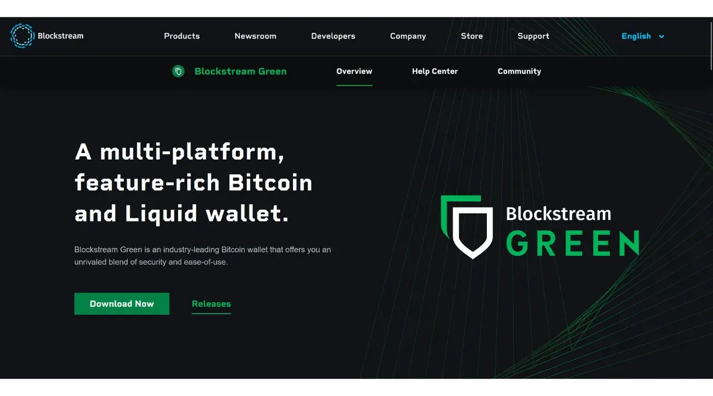

## Présentation de Blockstream Green

Blockstream Green est un logiciel disponible sur mobile et sur ordinateur. Anciennement connu sous le nom de Green Address, ce portefeuille est devenu un projet de Blockstream suite à son acquisition en 2016.

Green est une application très facile à utiliser, ce qui la rend particulièrement adaptée aux débutants. Elle offre diverses fonctionnalités, telles que la gestion de portefeuilles chauds, de hardware wallets, ainsi que des portefeuilles sur la sidechain Liquid.

Dans ce tutoriel, nous nous concentrerons uniquement sur la création d'un portefeuille watch-only. Pour explorer d'autres utilisations de Green, je vous invite à consulter nos autres tutoriels dédiés :

https://planb.network/tutorials/wallet/blockstream-green-desktop

https://planb.network/tutorials/wallet/blockstream-green

## Installer et paramétrer l'application Blockstream Green

La première étape est naturellement de télécharger l'application Green. Rendez-vous sur votre store d'applications :
- [Pour Android](https://play.google.com/store/apps/details?id=com.greenaddress.greenbits_android_wallet) ;
- [Pour Apple](https://apps.apple.com/us/app/green-bitcoin-wallet/id1402243590).

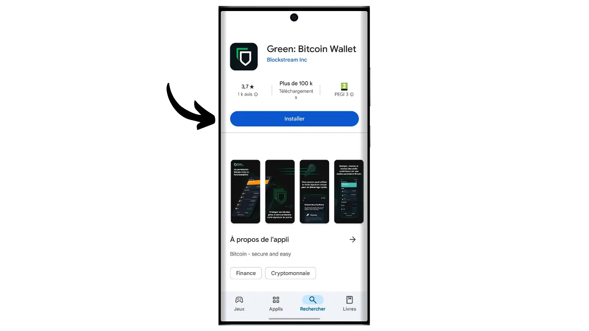

Pour les utilisateurs Android, vous avez aussi la possibilité d'installer l'application via le fichier `.apk` [disponible sur le GitHub de Blockstream](https://github.com/Blockstream/green_android/releases).

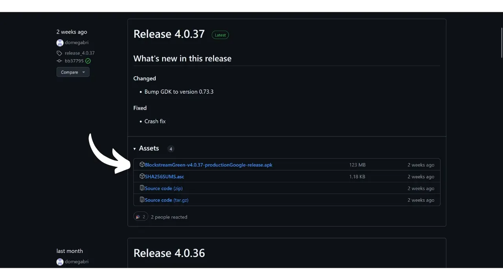

Lancez l'application, puis cochez la case "*J'accepte les conditions...*".

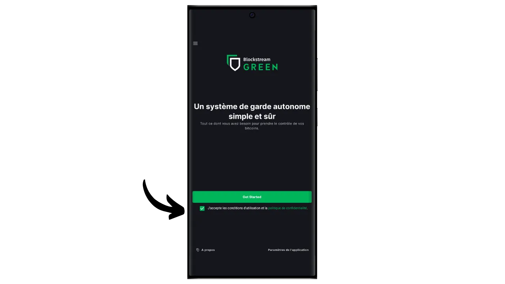

Lorsque vous ouvrez Green pour la première fois, l’écran d’accueil s’affiche sans portefeuille configuré. Plus tard, si vous créez ou importez des portefeuilles, ils apparaîtront dans cette interface. Avant de passer à la création d’un portefeuille, je vous conseille d’ajuster les paramètres de l’application en fonction de vos attentes. Cliquez sur "*Paramètres de l'application*".

L’option "*Enhanced Privacy*", disponible uniquement sur Android, améliore la confidentialité en désactivant les captures d’écran et en masquant les aperçus d’application. Elle verrouille également automatiquement l’accès à l’application dès que votre téléphone est verrouillé, ce qui rend vos données plus difficiles à exposer.

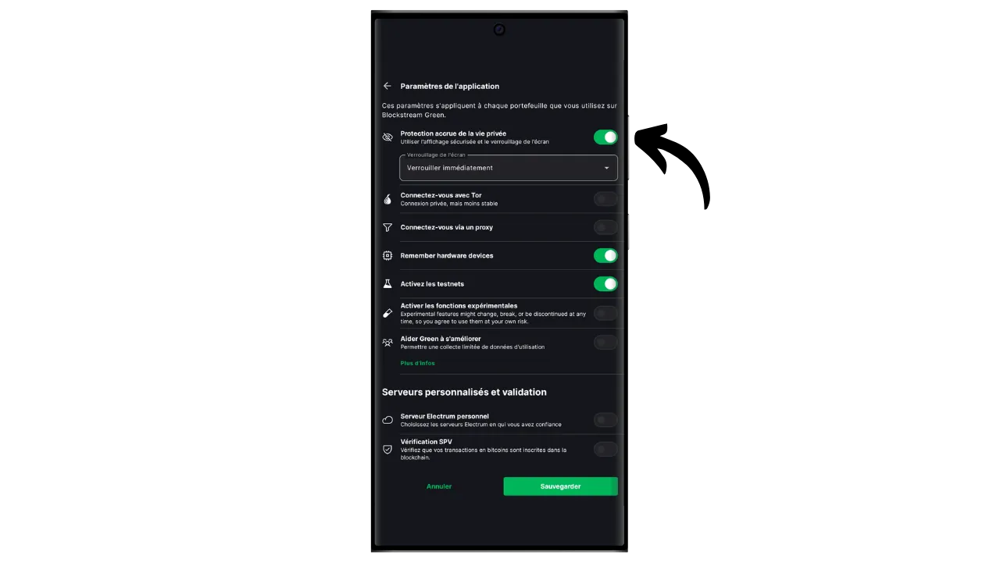

Pour ceux qui souhaitent renforcer leur confidentialité, l’application propose de rooter votre trafic via Tor, un réseau permettant de chiffrer toutes vos connexions et de rendre vos activités difficiles à tracer. Bien que cette option puisse légèrement ralentir le fonctionnement de l’application, elle est fortement recommandée pour protéger votre vie privée, surtout si vous n'utilisez pas votre propre nœud complet.

Pour les utilisateurs qui disposent de leur nœud complet, Green Wallet offre la possibilité de s'y connecter via un serveur Electrum, ce qui garantit un contrôle total sur les informations du réseau Bitcoin et sur la diffusion des transactions. 

Une autre fonctionnalité alternative est l’option "*SPV Verification*", qui permet de vérifier directement certaines données de la blockchain et donc de réduire le besoin de confiance envers le nœud par défaut de Blockstream, bien que cette méthode ne fournisse pas toutes les garanties d’un nœud complet.

Une fois ces paramètres ajustés selon vos besoins, cliquez sur le bouton "*Sauvegarder*" et redémarrez l’application.

## Créer un portefeuille watch-only sur Blockstream Green

Vous êtes maintenant prêt à créer un portefeuille watch-only. Cliquez sur le bouton "*Get Started*".

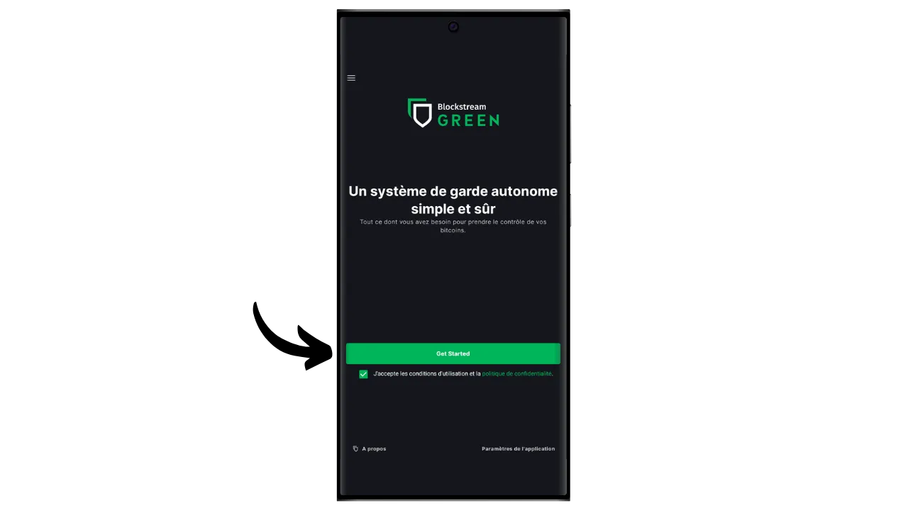

Vous aurez le choix entre plusieurs types de portefeuilles. Pour ce tutoriel, nous voulons créer un portefeuille watch-only, donc cliquez sur le bouton correspondant.

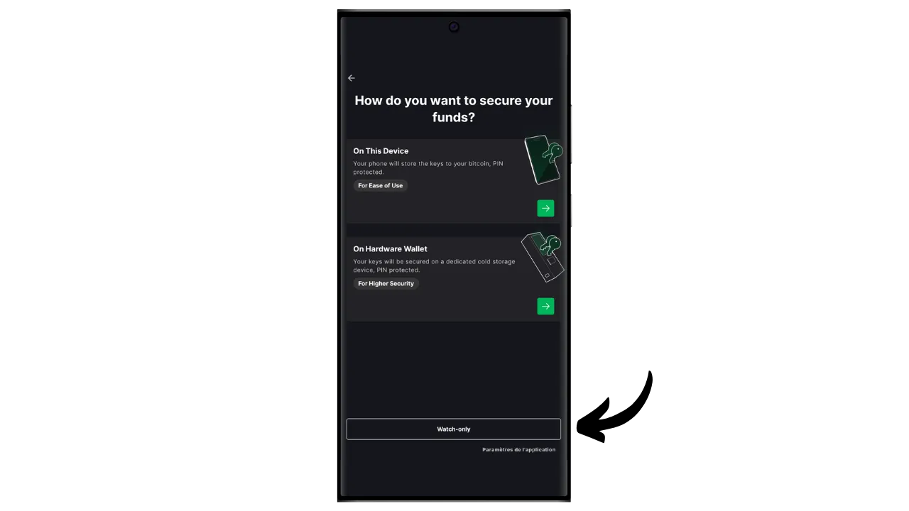

Choisissez l'option "*Signature unique*".

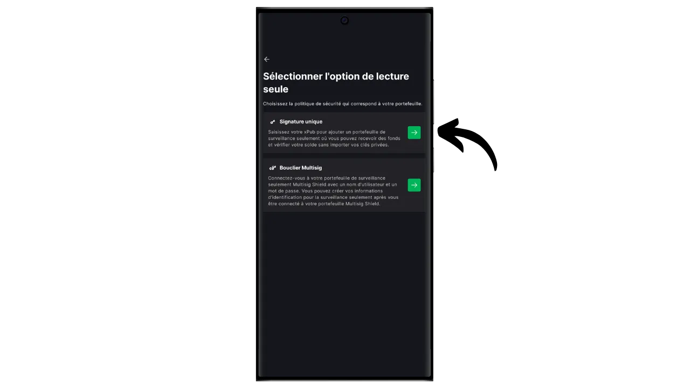

Sélectionnez ensuite "*Bitcoin*". Pour ma part, je réalise ce tutoriel sur un portefeuille testnet, mais la procédure reste identique sur le mainnet.

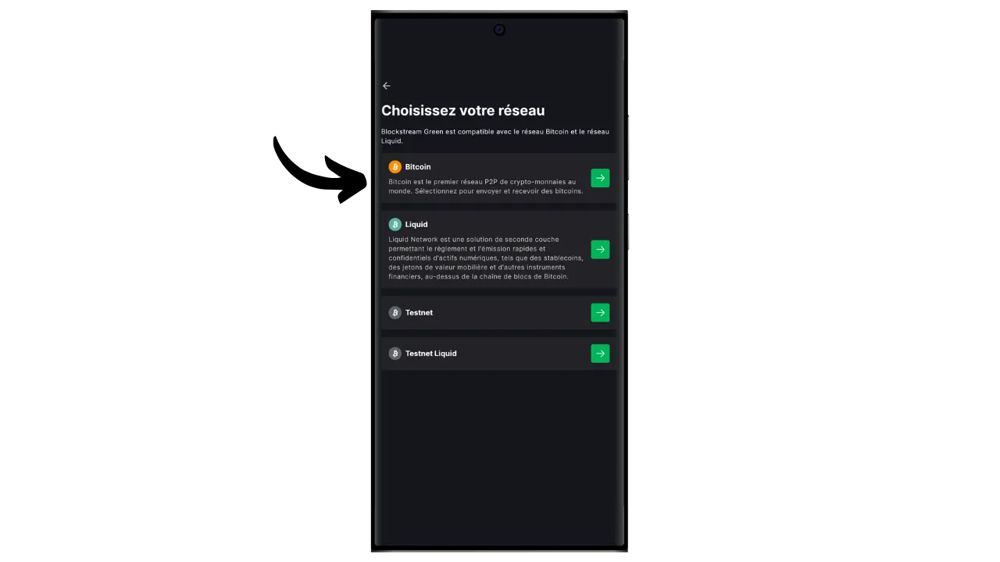

Il vous sera demandé de fournir soit une clé publique étendue (`xpub`, `zpub`, etc.), soit un output script descriptor.

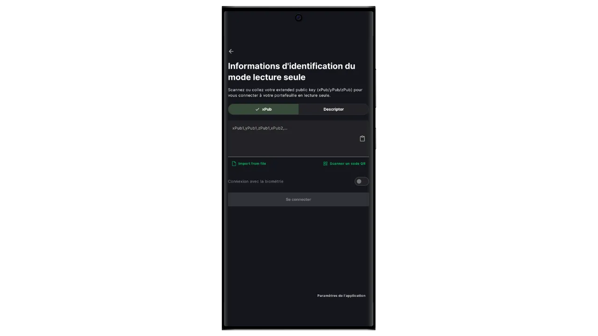

Vous devrez donc récupérer cette information depuis le portefeuille que vous souhaitez suivre via votre portefeuille watch-only. La clé publique étendue n'est pas sensible en termes de sécurité, car elle ne permet pas l'accès aux clés privées, mais elle est sensible pour votre confidentialité, puisqu'elle révèle toutes vos clés publiques et donc toutes vos transactions Bitcoin.

Imaginons que vous utilisiez Sparrow Wallet pour gérer votre portefeuille sur un hardware wallet, vous trouverez cette information dans la section "*Settings*". Trouver cette information va dépendre du logiciel de gestion de portefeuille que vous utilisez, mais cela se trouve généralement dans les paramètres.

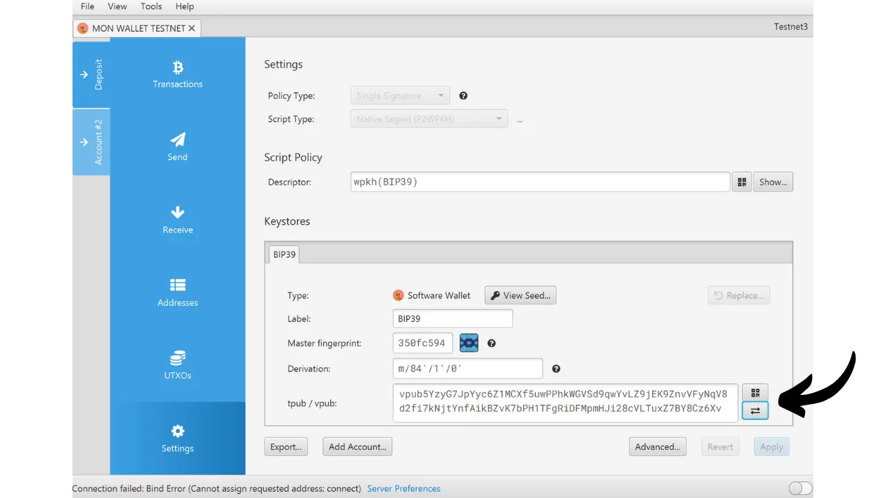

Copiez votre clé publique étendue et renseignez-la dans l'application Green, puis cliquez sur "*Se connecter*".

Vous pourrez alors voir le solde associé à cette clé ainsi que l'historique des transactions.

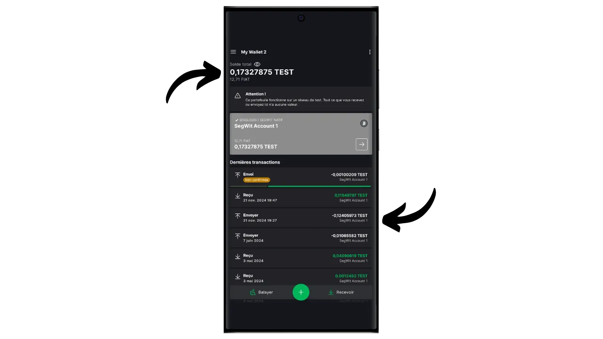

En cliquant sur "*Recevoir*", vous pouvez générer une adresse de réception pour recevoir des bitcoins sur le portefeuille de votre hardware wallet. Cependant, je vous déconseille d'utiliser cette option sans vérifier préalablement sur l'écran du hardware wallet que celui-ci dispose de la clé privée associée à l'adresse générée, avant de l'utiliser pour verrouiller des bitcoins. C'est une bonne pratique à suivre.

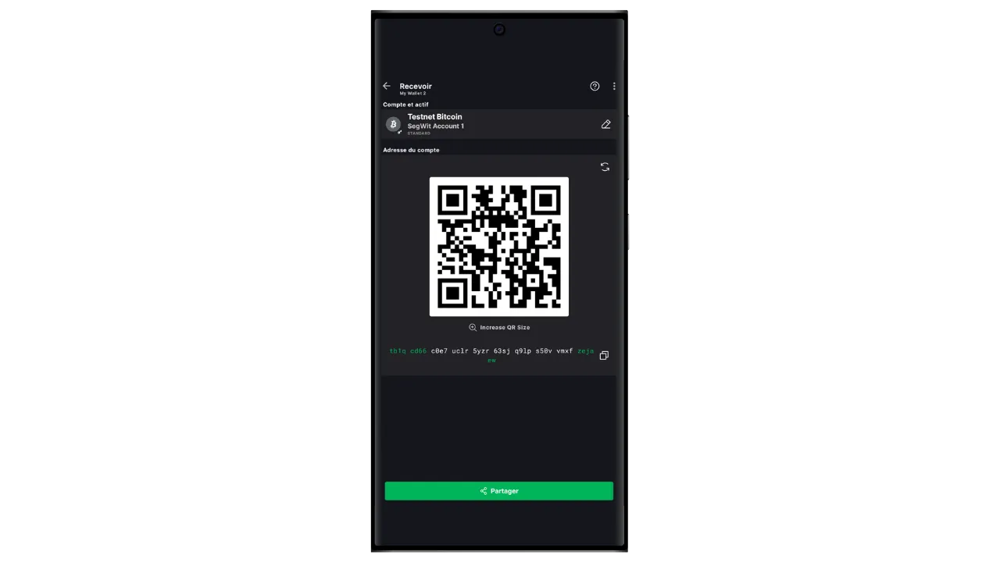

L'option "*Balayer*" vous permet d'entrer manuellement une clé privée pour dépenser des fonds directement depuis votre application Green. Sauf dans des cas très spécifiques, je recommande de ne pas utiliser cette fonction, car elle nécessite de révéler votre clé privée sur un téléphone, qui est bien plus vulnérable aux attaques informatiques que votre hardware wallet.

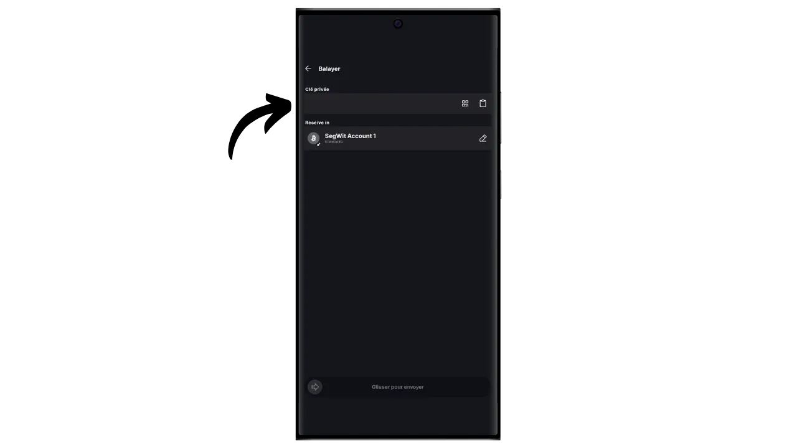

Et voilà, vous savez maintenant comment configurer facilement un portefeuille watch-only sur votre smartphone ! C'est un outil très pratique pour surveiller un portefeuille sur un hardware wallet sans devoir le connecter et le déverrouiller à chaque fois.

Si vous avez trouvé ce tutoriel utile, je vous serais reconnaissant de laisser un pouce vert ci-dessous. N'hésitez pas à partager cet article sur vos réseaux sociaux. Merci beaucoup !

Je vous conseille également de découvrir cet autre tutoriel complet sur l'application Blockstream Green pour mettre en place un portefeuille chaud :

https://planb.network/tutorials/wallet/blockstream-green
